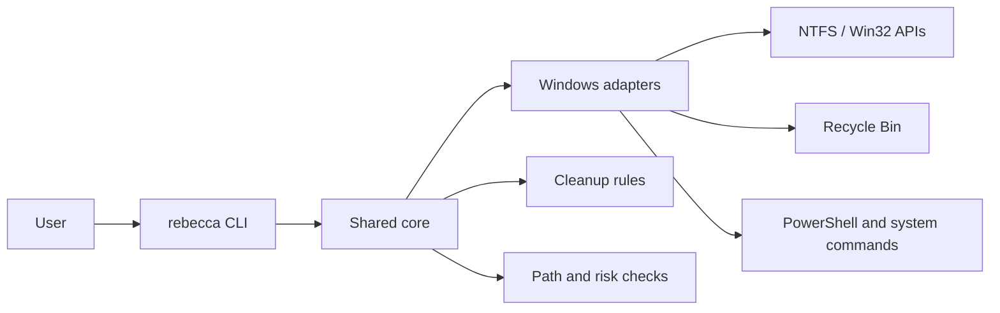

# Context

We are building a Rust + clap CLI for cleaning system junk and application caches. The user goal is closest to Mole on macOS, but the target environment is Windows first.

Windows is the right primary platform because:

- cache and temp locations are highly standardized in common Windows installs,
- Recycle Bin and uninstall leftovers are important user-facing cleanup targets,
- NTFS-specific scanning can become a differentiator later,
- Windows-specific tooling is more fragmented than Linux developer cache cleanup.

# Decision

Ship a Windows-first product with a shared core that can later support Linux through adapters and optional rules.

Linux is not a launch promise. It may be supported later for developer caches and generic disk analysis, but not as a first-class system-cleaning target.

# Alternatives Considered

## Option A: Windows-only product

**Pros**: Minimal surface area, easiest safety model, fastest time to value.  
**Cons**: Harder to reuse the core for Linux later.  
**Decision**: Rejected.

## Option B: Full cross-platform from the start

**Pros**: Broader reach and one codebase.  
**Cons**: More rules, more edge cases, weaker focus, slower delivery.  
**Decision**: Rejected.

## Option C: Windows-first with reusable core

**Pros**: Clear positioning, strong fit for the problem, reusable architecture.  
**Cons**: Requires discipline to keep platform details isolated.  
**Decision**: Chosen.

# Consequences

- Product copy, docs, and examples should describe Windows as the supported launch platform.
- Rule definitions should be platform-tagged from the start.
- Linux support can be added later without changing the product identity.
- GPL-derived projects remain reference material only; no direct code or rule copying.

# Success Metrics

| Metric | Target | Measurement |
|--------|--------|-------------|
| Windows launch scope | Core cleanup usable on Windows 10/11 | Manual smoke test on representative Windows machine |
| Scope clarity | No Linux promise in v1 docs | ADR and README review |
| Extensibility | Linux adapter path exists in core model | Code review against module boundaries |

# Risks & Mitigations

| Risk | Severity | Likelihood | Mitigation |
|------|----------|------------|------------|
| Scope drift into multi-platform work too early | High | Medium | Freeze launch scope to Windows-first |
| Windows-specific APIs leak into core | Medium | Medium | Keep platform adapters behind interfaces |
| GPL contamination from reference projects | High | Low | Use behavior only, not code or data |

# Status

Proposed.
