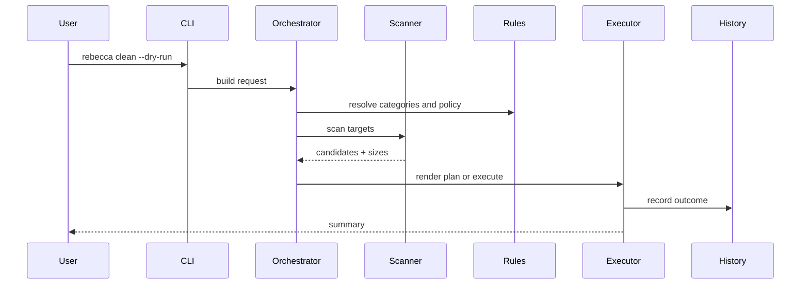

# Context

The cleaner needs to do three things well:

1. Discover candidate files and directories quickly.
2. Apply risk-aware filtering before deletion.
3. Execute cleanup with dry-run, confirmation, and history.

The runtime should use Rust strengths where they matter most: type safety, parallel scans, deterministic rules, and a small single-binary CLI.

# Decision

Use a layered Rust workspace:

- `cli` for `clap` parsing and presentation.
- `core` for rules, planning, safety checks, and history.
- `platform` modules for Windows-specific APIs and optional Linux adapters.
- `rules` as data-driven cleanup definitions.

Scanning should be synchronous at the file-system edge and parallelized with Rayon where it helps. Async should stay at process boundaries, UI events, and network or subprocess interactions.

NTFS/MFT fast-path support may be added later behind a feature flag, but the default implementation should rely on safe parallel directory traversal first.

# Alternatives Considered

## Option A: Monolithic CLI

**Pros**: Small codebase initially.  
**Cons**: Hard to test, hard to extend, platform logic gets tangled.  
**Decision**: Rejected.

## Option B: Async-first Tokio everywhere

**Pros**: Familiar modern Rust story.  
**Cons**: Most file-system work is blocking anyway, and async adds complexity without real wins here.  
**Decision**: Rejected.

## Option C: Layered core + parallel sync scanning

**Pros**: Fits the workload, keeps boundaries explicit, easier to optimize later.  
**Cons**: Requires discipline around interfaces and ownership.  
**Decision**: Chosen.

# Consequences

- Rules can be expanded without rewriting execution flow.
- Safety checks stay centralized.
- Parallel scan performance can improve without changing the CLI contract.
- NTFS fast-path work stays optional and isolated.

# Success Metrics

| Metric | Target | Measurement |
|--------|--------|-------------|
| Scan throughput | Parallel scan beats single-thread baseline on large trees | Benchmark on representative dataset |
| Safety coverage | All destructive operations go through centralized validation | Unit and integration tests |
| Dry-run parity | Dry-run and execute share the same plan builder | Test on identical inputs |
| Observability | Every cleanup action writes history metadata | History inspection tests |

# Risks & Mitigations

| Risk | Severity | Likelihood | Mitigation |
|------|----------|------------|------------|
| Over-abstraction | Medium | Medium | Keep modules small and concrete until reuse is proven |
| Blocking I/O hidden behind async | Medium | High | Use sync scans and Rayon, not async for filesystem traversal |
| NTFS feature complexity | High | Medium | Gate it behind a feature flag and keep the safe fallback path |
| Performance regressions from overly broad concurrency | Medium | Medium | Cap concurrency per device/class and benchmark before merging |

# Status

Proposed.
