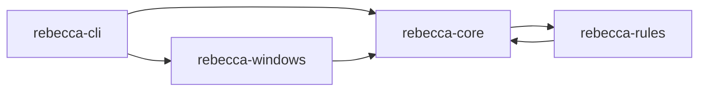

# Context

The cleaner will need a CLI entrypoint, a reusable core, Windows-specific APIs, and a rule catalog. Keeping all of that in a single crate would be simple at first, but it would quickly mix CLI concerns, platform code, and policy logic.

# Decision

Use a small Cargo workspace with a few explicit crates:

- `rebecca-cli` for `clap`, prompts, and output.
- `rebecca-core` for scanning plans, safety checks, deletion orchestration, and history.
- `rebecca-windows` for Windows adapters and OS-specific APIs.
- `rebecca-rules` for built-in cleanup rules and category metadata.

The core crate must not depend on Windows-only APIs directly.

# Alternatives Considered

## Option A: Single crate with modules

**Pros**: Lowest initial setup cost.  
**Cons**: Boundaries blur quickly, test isolation is worse, platform code leaks into core.  
**Decision**: Rejected.

## Option B: Many small crates for every feature

**Pros**: Strong separation.  
**Cons**: Too much packaging overhead, harder navigation, unnecessary indirection.  
**Decision**: Rejected.

## Option C: Small workspace with a few stable crates

**Pros**: Clear boundaries, testable, easy to extend later.  
**Cons**: Slightly more setup than a monolith.  
**Decision**: Chosen.

# Consequences

- CLI, core, and platform code can evolve independently.
- Shared policy stays in `rebecca-core`.
- Windows-specific code can be compiled only on Windows.
- Future Linux support can be added as a new adapter crate without reshaping the whole repo.

# Success Metrics

| Metric | Target | Measurement |
|--------|--------|-------------|
| Boundary clarity | `rebecca-core` compiles without Windows-only imports | CI compilation on target matrix |
| Testability | Core logic can be unit-tested without OS access | Unit tests for rules and planning |
| Extensibility | New platform adapter can be added without rewriting CLI | Architecture review |

# Risks & Mitigations

| Risk | Severity | Likelihood | Mitigation |
|------|----------|------------|------------|
| Too many crates too early | Medium | Medium | Keep the workspace small and stable |
| Circular dependencies | High | Low | Enforce one-way dependency direction |
| Premature abstraction | Medium | Medium | Add crates only when boundaries are real |

# Status

Proposed.
