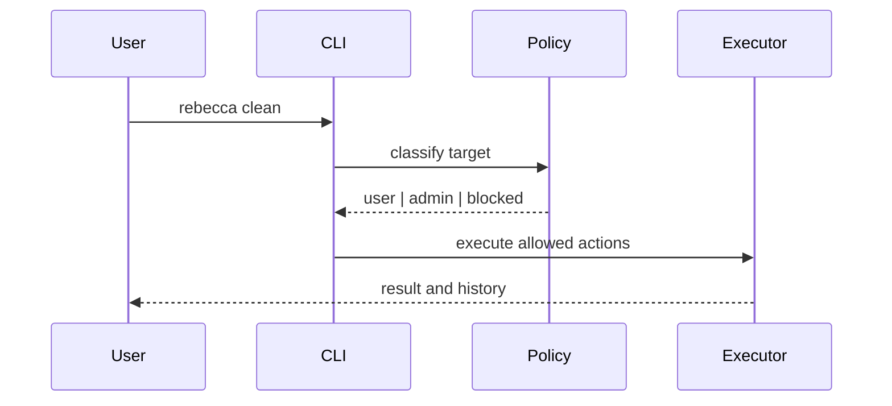

# Context

Windows cleanup has different trust and access levels. Most user caches live under user-owned paths and should work without elevation. Some system locations require admin rights. Registry data is useful for discovery, but registry cleanup is high risk and easy to get wrong.

# Decision

Default to standard-user execution.

- User-owned cache cleanup should work without elevation.
- Admin-only cleanup must be explicit and separately reported.
- Registry access in v1 is read-only and limited to discovery, such as uninstall inventory and install-path hints.
- Registry deletion is out of scope for v1.

# Alternatives Considered

## Option A: Auto-elevate when needed

**Pros**: Fewer user prompts, broader access.  
**Cons**: Easier to overreach, weaker safety model, worse trust story.  
**Decision**: Rejected.

## Option B: Admin-only tool

**Pros**: Simplifies access checks.  
**Cons**: Bad UX, too much privilege for routine cleanup.  
**Decision**: Rejected.

## Option C: Standard-user first with explicit admin opt-in

**Pros**: Safer by default, good UX, clear permissions boundary.  
**Cons**: Some cleanup targets require a separate elevated run.  
**Decision**: Chosen.

# Consequences

- The tool can clean most common caches without UAC friction.
- System-level cleanup becomes a deliberate mode, not a surprise.
- Registry support stays useful for discovery without becoming a risky cleaner.
- Uninstall-related features can read registry metadata without writing to it.

# Success Metrics

| Metric | Target | Measurement |
|--------|--------|-------------|
| Default usability | Common user caches clean without admin rights | Smoke test on standard account |
| Safety | No registry writes in v1 | Code review and tests |
| Clarity | Admin-required targets are surfaced explicitly | CLI output review |

# Risks & Mitigations

| Risk | Severity | Likelihood | Mitigation |
|------|----------|------------|------------|
| Hidden admin-only caches are skipped silently | Medium | Medium | Mark them clearly in output |
| Registry reads fail on restricted machines | Low | Medium | Treat as best-effort discovery |
| Registry cleanup temptation grows later | High | Medium | Keep deletion out of v1 scope |

# Status

Proposed.
