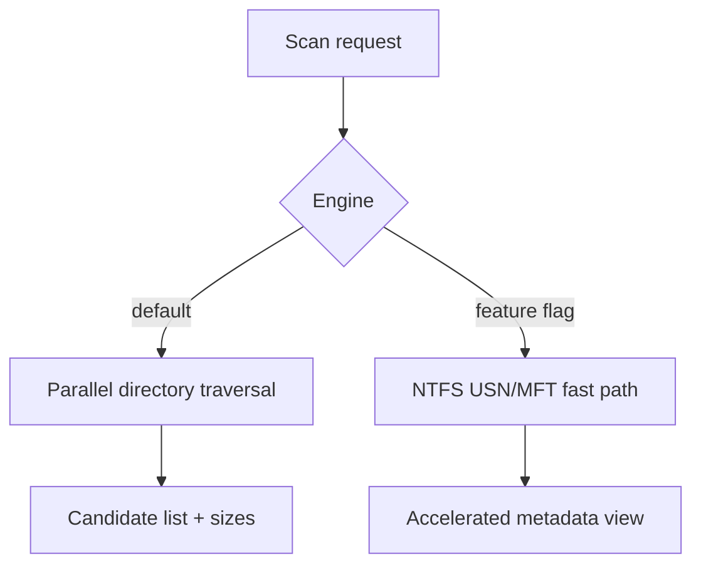

# Context

The product needs predictable cleanup scans first, and possibly WizTree-like fast disk exploration later. NTFS has special metadata paths, but they add complexity and platform coupling.

# Decision

Use parallel directory traversal as the default scan engine.

- Build the first engine on safe filesystem walking and bounded concurrency.
- Add NTFS/USN/MFT acceleration only as an optional, feature-gated path.
- Restrict NTFS fast-path usage to analysis and size discovery, not as a requirement for core cleanup.

# Alternatives Considered

## Option A: NTFS-first implementation

**Pros**: Potentially very fast on Windows volumes.  
**Cons**: High complexity, narrow platform fit, hard to test early.  
**Decision**: Rejected.

## Option B: Directory traversal only

**Pros**: Safe, simple, cross-platform, easy to reason about.  
**Cons**: Not as fast as NTFS metadata access on large volumes.  
**Decision**: Rejected as the final state, but accepted as the default baseline.

## Option C: Parallel traversal with optional NTFS fast path

**Pros**: Safe default, clear upgrade path, preserves future performance work.  
**Cons**: Two scan paths to maintain eventually.  
**Decision**: Chosen.

# Consequences

- v1 can ship without NTFS internals.
- Users get reliable behavior before exotic speedups.
- Later performance work can happen behind a feature flag.
- Benchmarks can compare default traversal against NTFS acceleration on representative datasets.

# Success Metrics

| Metric | Target | Measurement |
|--------|--------|-------------|
| Default scan coverage | Matches expected directories on representative Windows systems | Integration tests |
| Performance | Parallel traversal outperforms single-thread baseline | Benchmark suite |
| Safety | NTFS path stays behind a feature flag | Build and code review |

# Risks & Mitigations

| Risk | Severity | Likelihood | Mitigation |
|------|----------|------------|------------|
| NTFS implementation distracts from MVP | High | Medium | Defer behind feature flag |
| Traversal misses some metadata edge cases | Medium | Medium | Add focused tests and fallback handling |
| Performance regressions from uncontrolled concurrency | Medium | Medium | Cap concurrency and benchmark |

# Status

Proposed.
