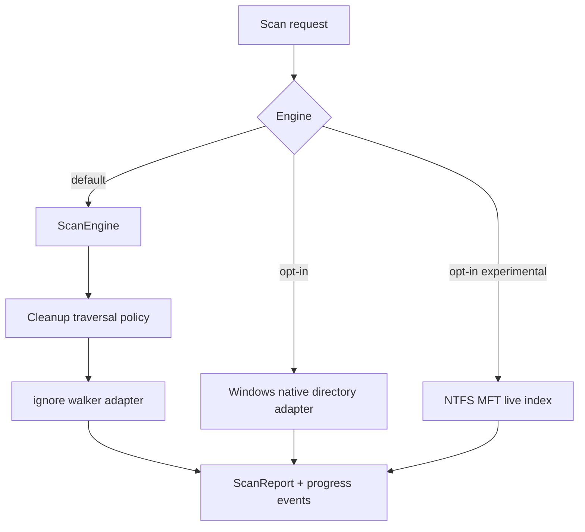

# Context

The product needs predictable cleanup scans first, and possibly WizTree-like fast disk exploration later. NTFS has special metadata paths, but they add complexity and platform coupling.

Rebecca also uses the `ignore` crate, which is proven in ripgrep but defaults to search-tool semantics: hidden entries, `.ignore`, `.gitignore`, git excludes, and global ignore rules can filter traversal. That is wrong for cleanup measurement. A cleanup scanner must count the target contents that will be cleaned, not the subset a search tool would inspect.

# Decision

Use a deep `ScanEngine` module as the default cleanup measurement interface.

- Build the first engine on safe filesystem walking through an internal `ignore` walker adapter.
- Disable search-style ignore filters for cleanup measurement: hidden entries, `.ignore`, `.gitignore`, git excludes, and global gitignore rules do not exclude measured files.
- Keep symlink and reparse-point traversal disabled.
- Keep bounded target-level parallelism through Rebecca's shared rayon scan pool.
- Provide a Windows native directory enumeration backend as an explicit `clean --scan-backend windows-native` opt-in. It uses Windows find data to read entry attributes and file sizes during enumeration, keeps the same reparse protections, and falls back to portable scanning when unsupported.
- Add NTFS/MFT acceleration only as an optional experimental path. `clean --scan-backend windows-ntfs-mft-experimental` attempts a read-only live NTFS volume index on supported local NTFS volumes, reuses the index within a command, and falls back with caveats when unsupported, unprivileged, or ambiguous.
- Restrict NTFS fast-path usage to analysis and size discovery, not as a requirement for core cleanup.

# Alternatives Considered

## Option A: NTFS-first implementation

**Pros**: Potentially very fast on Windows volumes.  
**Cons**: High complexity, narrow platform fit, hard to test early.  
**Decision**: Rejected.

## Option B: Shallow directory traversal helpers

**Pros**: Safe, simple, cross-platform, easy to reason about.
**Cons**: Pushes traversal policy, progress, cache wrapping, and future adapter choices into callers.
**Decision**: Rejected.

## Option C: Deep scan engine with optional future adapters

**Pros**: Safe default, explicit cleanup semantics, clear upgrade path, preserves future performance work behind a small interface.
**Cons**: Requires keeping adapter-neutral report and progress types stable.
**Decision**: Chosen.

# Consequences

- v1 can ship without NTFS internals.
- Users get reliable behavior before exotic speedups.
- Later performance work can happen behind a feature flag or internal adapter selection.
- Windows users can dogfood a native directory backend without making it the default cleanup authority.
- The experimental MFT selector can be tested by wrappers without granting it deletion authority; live-volume access remains opt-in and fallback-capable.
- Benchmarks can compare default traversal against NTFS acceleration on representative datasets.
- Search-tool ignore rules do not create cleanup-size undercounts.

# Success Metrics

| Metric | Target | Measurement |
|--------|--------|-------------|
| Default scan coverage | Matches expected cleanup target contents, including hidden and ignore-matched files | Integration tests |
| Performance | Target-level bounded traversal remains stable and benchmarked | Benchmark suite |
| Safety | Windows native and future NTFS paths stay opt-in and preserve reparse blocking | Build, code review, and scan backend tests |

# Risks & Mitigations

| Risk | Severity | Likelihood | Mitigation |
|------|----------|------------|------------|
| NTFS implementation distracts from MVP | High | Medium | Defer behind feature flag |
| Traversal misses some metadata edge cases | Medium | Medium | Add focused tests and fallback handling |
| Performance regressions from uncontrolled concurrency | Medium | Medium | Cap concurrency and benchmark |
| Cleanup measurement inherits search ignore semantics | High | Medium | Disable standard ignore filters in the internal walker adapter and cover `.ignore` / `.gitignore` fixtures |

# Status

Accepted and implemented as the default scan module direction.
