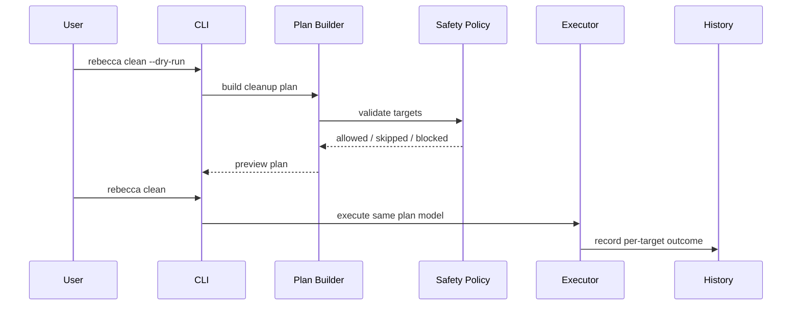

# Context

A cleaner is only trustworthy if users can preview, understand, and recover from destructive actions. Windows adds extra risk through junctions, symlinks, reparse points, locked files, and recoverable trash accounting.

# Decision

All destructive commands must build a cleanup plan before execution.

- `dry-run` and real execution use the same plan builder.
- Default deletion moves files to the Windows recoverable trash when possible.
- Permanent deletion is explicit and requires a stronger flag.
- Every target passes centralized path validation before deletion.
- Executors may batch already revalidated, non-overlapping targets for platform
  efficiency, but backends must return outcomes that map back to individual
  cleanup targets.
- Reparse points, junctions, and symlinks are not followed by default.
- History records both `freed_bytes` and `pending_reclaim_bytes` because moving to recoverable trash does not immediately free disk space.
- Skipped, blocked, and failed targets carry stable `reason_code` values, while
  summaries aggregate those values into an `issue_matrix` keyed by target status
  and reason code. Detailed `reason` text remains available for local context.

# Alternatives Considered

## Option A: Direct deletion from each rule

**Pros**: Simple implementation per rule.  
**Cons**: Inconsistent safety checks, weak observability, hard to test.  
**Decision**: Rejected.

## Option B: Always permanent delete

**Pros**: Honest immediate freed-space accounting.  
**Cons**: Too risky for a general-purpose cleaner.
**Decision**: Rejected.

## Option C: Plan-first cleanup with recoverable default

**Pros**: Safe default, consistent dry-run behavior, auditable history.
**Cons**: recoverable trash can fail for some paths and does not immediately free space.
**Decision**: Chosen.

# Consequences

- Users can preview cleanup before any destructive operation.
- Rules do not decide how deletion happens; they only produce candidates.
- CLI output must distinguish moved-to-Recycle-Bin from permanently freed bytes.
- Batch-capable deletion backends reduce platform call overhead without becoming
  delete authority; failed batch attempts must still resolve to per-target
  completed or failed outcomes.
- Some targets may fall back to permanent deletion only when explicitly requested.
- Human output, JSON output, and history all derive issue diagnostics from the
  core cleanup plan model instead of reclassifying errors in the CLI.

# Success Metrics

| Metric | Target | Measurement |
|--------|--------|-------------|
| Dry-run parity | Dry-run and execution produce plans from the same code path | Unit tests |
| Recoverable default | Default deletion uses recoverable trash where supported | Integration tests on Windows |
| Safety | Reparse points are not followed by default | Fixture tests |
| Auditability | Every attempted target has a history outcome | History tests |
| Issue observability | Skipped, blocked, and failed targets expose stable reason-code summaries | Core and CLI regression tests |
| Batch execution safety | Batch-capable backends receive only non-overlapping revalidated targets and preserve per-target outcomes | Executor contract tests |

# Risks & Mitigations

| Risk | Severity | Likelihood | Mitigation |
|------|----------|------------|------------|
| recoverable trash move fails for locked/system paths | Medium | Medium | Record failure and continue; do not silently delete permanently |
| User misreads pending bytes as freed bytes | Medium | Medium | Separate `freed` and `pending` in output |
| Junction traversal deletes unexpected data | High | Medium | Do not follow reparse points by default |

# Status

Accepted and implemented as the cleanup execution model.
