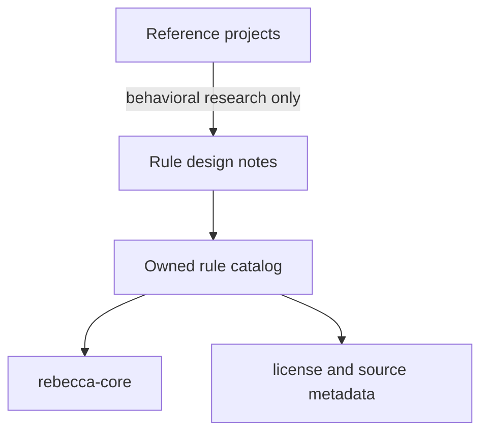

# Context

The product needs many cleanup rules, but reference projects use different licenses. GPL projects such as Mole and BleachBit are valuable for understanding behavior, but directly copying rule data or code may constrain this project's licensing.

# Decision

Maintain an owned rule catalog with explicit provenance metadata.

The built-in catalog is stored as cleanup-family TOML files under
`crates/rebecca-rules/rules/cleanup/` and embedded into the `rebecca-rules`
crate at build time. Each manifest owns shared metadata plus one or more
`[[platforms]]` blocks. The Rust code is responsible for parsing, validation,
checking that file path, family id, platform blocks, and generated rule id
prefixes agree, and conversion into the shared core model.

Each built-in rule must record:

- stable id,
- platform,
- category,
- safety level,
- target path templates or discovery strategy,
- deletion method policy,
- restore or rebuild hint,
- provenance notes,
- license/source classification.

GPL reference projects may inform behavior and safety analysis, but their code and rule files must not be copied into this repository unless the project intentionally adopts a compatible license.

# Alternatives Considered

## Option A: Hard-code rules directly in scanner implementations

**Pros**: Fastest to start.  
**Cons**: Hard to audit provenance, hard to list categories, harder to test.  
**Decision**: Rejected.

## Option B: Import rules from existing GPL projects

**Pros**: Large rule coverage quickly.  
**Cons**: License contamination risk, unclear maintainability.  
**Decision**: Rejected for current licensing posture.

## Option C: Owned catalog with provenance metadata

**Pros**: Auditable, testable, safe licensing boundary.  
**Cons**: Slower rule growth.  
**Decision**: Chosen.

# Consequences

- Rule coverage grows more slowly but remains legally and technically controlled.
- Rule tests can validate safety level and path expansion.
- Future contributors have a clear process for adding rules.
- Reference repositories remain citations, not copied source material.

# Success Metrics

| Metric | Target | Measurement |
|--------|--------|-------------|
| Provenance coverage | Every built-in rule has source metadata | Rule catalog validation |
| GPL safety | No direct copied GPL rule data or code | Review checklist |
| Rule testability | Rules can be expanded in fixtures without touching real user paths | Unit tests |

# Risks & Mitigations

| Risk | Severity | Likelihood | Mitigation |
|------|----------|------------|------------|
| Rule growth is slower than competitors | Medium | Medium | Prioritize high-value platform cache categories first |
| Provenance metadata becomes stale | Medium | Medium | Add catalog validation and review checklist |
| Developers accidentally copy GPL snippets | High | Low | Document provenance policy and require review |

# Status

Accepted.
