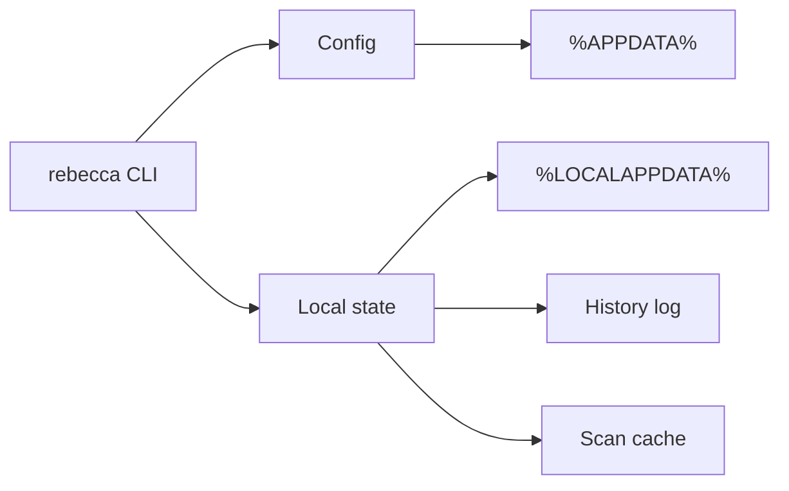

# Context

The cleaner needs user configuration, allowlists, history, scan caches, and possibly benchmark or diagnostic data. Windows has standard per-user locations for roaming configuration and local cache/state.

# Decision

Use user-scoped storage by default.

- Roaming/user settings live under `%APPDATA%\Rebecca`.
- Local state, history, scan cache, and temporary files live under `%LOCALAPPDATA%\Rebecca`.
- The tool should not write to `ProgramData` in v1.
- Config should be human-editable TOML.
- The current config schema is version `1`; omitted `version` means `1`, and
  unsupported versions fail with a file-scoped parse/validation error.
- History should be structured append-only data, with a CLI command to render it.
- Local scan cache must be safe to delete and rebuild.

# Alternatives Considered

## Option A: Store everything next to the executable

**Pros**: Portable-friendly.  
**Cons**: Bad fit for installed binaries and user profiles, write permissions vary.  
**Decision**: Rejected as the default.

## Option B: Store everything in one AppData directory

**Pros**: Simple.  
**Cons**: Mixes roaming preferences with machine-local cache/history.  
**Decision**: Rejected.

## Option C: Split roaming config and local state

**Pros**: Matches Windows conventions, keeps cache local, keeps config portable across profiles where applicable.  
**Cons**: Two directories to manage.  
**Decision**: Chosen.

# Consequences

- The tool behaves predictably on normal Windows installations.
- Cache and history can be cleaned without losing user preferences.
- Portable mode can be added later as an explicit mode.
- Config and state paths should be shown by `rebecca config paths`.
- Future config migrations have an explicit schema boundary instead of relying
  on unknown-key behavior alone.

# Success Metrics

| Metric | Target | Measurement |
|--------|--------|-------------|
| Config clarity | `rebecca config paths` shows all storage locations | CLI smoke test |
| Schema clarity | Unsupported config versions fail clearly | Core and CLI regression tests |
| Safe cache | Deleting local cache does not break configuration | Integration test |
| Privacy | No secrets are stored in history or cache | Review checklist |

# Risks & Mitigations

| Risk | Severity | Likelihood | Mitigation |
|------|----------|------------|------------|
| History stores sensitive paths | Medium | Medium | Avoid contents and secrets; store paths and metadata only |
| AppData assumptions fail in constrained environments | Low | Medium | Fall back to known-folder APIs or explicit env overrides |
| Config schema changes break older configs | Medium | Medium | Pin schema version `1`, default missing versions to `1`, and reject unsupported versions clearly |

# Status

Accepted. Implemented for the initial config-file-backed storage path contract.
