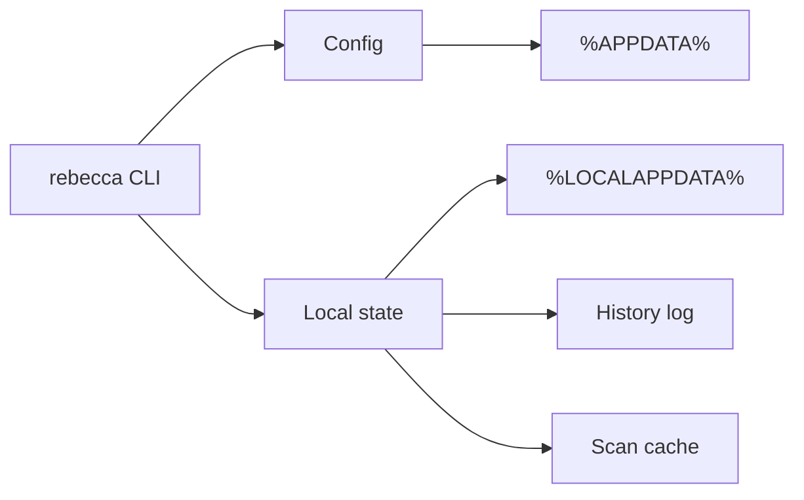

# Context

The cleaner needs user configuration, allowlists, history, scan caches, and possibly benchmark or diagnostic data. Windows has standard per-user locations for roaming configuration and local cache/state.

# Decision

Use user-scoped storage by default.

- Roaming/user settings live under `%APPDATA%\Rebecca`.
- Local state, history, scan cache, and temporary files live under `%LOCALAPPDATA%\Rebecca`.
- The tool should not write to `ProgramData` in v1.
- Config should be human-editable TOML.
- The current config schema is version `1`; omitted `version` means `1`, and
  unsupported versions fail with a file-scoped parse/validation error.
- History should be structured append-only data, with a CLI command to render it.
- Local scan cache must be safe to delete and rebuild.
- The storage contract distinguishes lifecycle classes: configuration and
  durable state are preserved, history is append-only preserved, and cache is
  rebuildable.
- The operational contract for schema fields, path precedence, migration
  expectations, and local-state ownership is maintained in
  `docs/configuration.md`.

# Alternatives Considered

## Option A: Store everything next to the executable

**Pros**: Portable-friendly.  
**Cons**: Bad fit for installed binaries and user profiles, write permissions vary.  
**Decision**: Rejected as the default.

## Option B: Store everything in one AppData directory

**Pros**: Simple.  
**Cons**: Mixes roaming preferences with machine-local cache/history.  
**Decision**: Rejected.

## Option C: Split roaming config and local state

**Pros**: Matches Windows conventions, keeps cache local, keeps config portable across profiles where applicable.  
**Cons**: Two directories to manage.  
**Decision**: Chosen.

# Consequences

- The tool behaves predictably on normal Windows installations.
- Cache and history can be cleaned without losing user preferences.
- Portable mode can be added later as an explicit mode.
- Config and state paths should be shown by `rebecca config paths`.
- Future config migrations have an explicit schema boundary instead of relying
  on unknown-key behavior alone.
- Future cache cleanup can reason over the lifecycle metadata instead of
  guessing from path names.
- Future settings work has a single contract document to update alongside the
  Rust schema and CLI tests.
- `rebecca cache purge` can remove only direct contents of Rebecca's rebuildable
  cache directory, must preserve the cache directory itself, must report its
  lifecycle, entry-status counts, and stable issue matrix, and must refuse
  preserved-path overlap.
- `clean --scan-cache` explicitly enables planner access to scan-cache records
  under `cache_dir\scan` for regular-file targets and directory targets with
  fresh records. Missing, corrupted, stale, expired, or unsupported-version
  records are cache misses, not hard failures. Directory target cache reuse is
  freshness-bounded so stale trees fall back to a full scan. The freshness
  window is governed by a policy seam with a current 5-minute default and can
  be overridden through `scan_cache.directory_record_max_age_seconds`, rather
  than by hard-coded record validation logic.
- Human `clean` output can summarize scan-cache hits, misses, and skipped
  writes as build diagnostics. Cleanup plan JSON remains a cleanup-result
  contract and does not include scan-cache diagnostic counters.

# Success Metrics

| Metric | Target | Measurement |
|--------|--------|-------------|
| Config clarity | `rebecca config paths` shows all storage locations | CLI smoke test |
| Schema clarity | Unsupported config versions fail clearly | Core and CLI regression tests |
| Lifecycle clarity | Cache is marked rebuildable and state/history are marked preserve | Core and CLI regression tests |
| Cache purge safety | Purge defaults to preview, preserves cache directory, and rejects preserved-path overlap | Core and CLI regression tests |
| Cache purge observability | Purge reports lifecycle, cache-dir preservation, cache-dir existence, entry-status counts, and issue-matrix details | Core and CLI regression tests |
| Scan cache rebuildability | Scan-cache stale/corrupt/future-version records return cache misses | Core regression tests |
| Controlled scan cache | `clean --scan-cache` reuses eligible file-target records, freshness-bounded directory records, and soft-fails on cache errors | Core and CLI regression tests |
| Scan cache policy | Configured directory freshness changes cache-hit eligibility without changing the cache record format | Core and CLI regression tests |
| Scan cache observability | Planner progress and human output report scan-cache hit, miss, and skipped-write activity without changing plan JSON | Core and CLI regression tests |
| Safe cache | Deleting local cache does not break configuration | Integration test |
| Privacy | No secrets are stored in history or cache | Review checklist |

# Risks & Mitigations

| Risk | Severity | Likelihood | Mitigation |
|------|----------|------------|------------|
| History stores sensitive paths | Medium | Medium | Avoid contents and secrets; store paths and metadata only |
| AppData assumptions fail in constrained environments | Low | Medium | Fall back to known-folder APIs or explicit env overrides |
| Config schema changes break older configs | Medium | Medium | Pin schema version `1`, default missing versions to `1`, and reject unsupported versions clearly |

# Status

Accepted. Implemented for the initial config-file-backed storage path contract.
