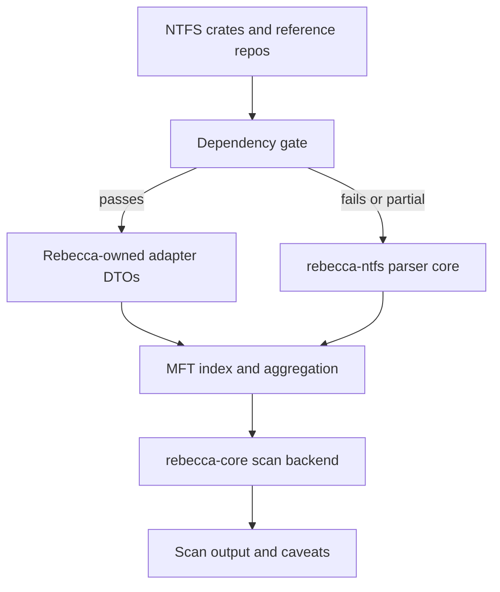

# Context

Rebecca now has an experimental live NTFS/MFT backend that can read `$MFT`
sequentially and fall back to per-record FSCTL reads. Raw throughput is no
longer the main gap. Correctness now depends on modeling NTFS records,
attributes, streams, file-reference sequence numbers, hardlinks, data runs,
attribute lists, and directory indexes without weakening cleanup safety.

Several Rust crates and cloned reference projects already solve parts of this
problem. None can become cleanup authority directly because Rebecca must keep
target identity validation, source provenance, bounded caveats, fallback, and
delete-time path revalidation in its own code.

# Decision

Adopt a dependency gate instead of an immediate dependency replacement.

- Treat `ntfs` as the lead production candidate. It is read-only, permissively
  licensed, safe Rust at the crate level, and already models the NTFS features
  Rebecca is missing: attribute lists, data runs, directory indexes, hardlinks,
  and file-reference sequence numbers.
- Treat `ntfs-core` as a secondary spike candidate. Its parser coverage is
  broad, but its forensic-first API, dependency set, and published metadata need
  isolated validation before production use.
- Treat `mft` as a dev-only oracle candidate for exported `$MFT` fixtures. If
  used, disable CLI-oriented default features unless a benchmark or tool target
  intentionally needs them.
- Treat `ntfs-reader` as a live-Windows reference, not as the scan backend. Its
  elevated handle flow and aligned reader are useful, but Rebecca keeps source
  acquisition, fallback, and provenance in `rebecca-core`.
- Treat `usn-journal-rs` as future USN/cache research only. USN enumeration is
  not a replacement for raw MFT parser correctness in this refactor.
- Keep GPL/LGPL and mixed-license projects under `repo-ref/` as behavior
  references only. Do not copy implementation code, fixtures, or tables from
  incompatible sources.

Any accepted production crate must be hidden behind Rebecca-owned adapter DTOs
before it reaches `rebecca-core`, cache records, CLI output, or aggregation.
External crate types must not leak into the cleanup contract.

# Required Adapter Boundary

The parser adapter must expose Rebecca-owned types for:

- file references: low record ID plus sequence number,
- record metadata: base reference, in-use state, directory flag, reparse flag,
  and parser caveats,
- file names: namespace, full parent file reference, name, size hints, and file
  attributes,
- streams: attribute ID, optional stream name, lowest VCN, logical bytes,
  allocated bytes, initialized bytes, sparse information, and cleanup-counting
  policy,
- directory index entries: parent directory reference, child reference, name,
  namespace, and index caveats,
- source provenance: first-party parser, dependency adapter, sequential live
  MFT, FSCTL fallback, fixture, or oracle.

These DTOs are allowed to evolve internally. They are not permission to delete.
Deletion continues to use normal filesystem path validation at operation time.

# Gate Criteria

A production dependency is acceptable only when all of these pass:

- license and transitive dependencies pass `cargo deny check`,
- MSRV is compatible with the workspace MSRV,
- default features are intentional and do not add unrelated CLI or write-capable
  behavior,
- no third-party type appears in `rebecca-core` public structs, scan cache
  records, or CLI output contracts,
- fixture parity proves that unsupported NTFS states produce caveats or fallback
  rather than silent success,
- live-volume use preserves Rebecca's opt-in backend selection, target identity
  validation, bounded caveats, fallback, and delete-time revalidation.

If no candidate passes, `rebecca-ntfs` remains the owned parser and implements
the missing capabilities directly.

# Alternatives Considered

## Option A: Replace `rebecca-ntfs` directly with `ntfs`

**Pros**: Faster access to mature NTFS parsing behavior.  
**Cons**: Risks leaking a general filesystem model into cleanup safety logic and
makes provenance/fallback harder to control.  
**Decision**: Rejected as a direct replacement. Kept as the lead adapter-backed
candidate.

## Option B: Adopt `ntfs-core` immediately

**Pros**: Broad parser surface, including forensic-oriented modules Rebecca may
eventually need for validation.  
**Cons**: Newer dependency shape, metadata questions, and API fit are not yet
proven for a cleanup scanner.  
**Decision**: Rejected for immediate production adoption. Kept as a secondary
isolated spike.

## Option C: Continue with only first-party parser code

**Pros**: Maximum control over cleanup-specific semantics and dependencies.  
**Cons**: Slower correctness progress and higher risk of missing mature NTFS
edge cases already solved elsewhere.  
**Decision**: Kept as fallback after the dependency gate, not as the first move.

# Consequences

- The next parser refactor starts by defining owned adapter DTOs before adding a
  production NTFS crate.
- `Cargo.toml` remains unchanged until the adapter spike proves a candidate can
  satisfy Rebecca's safety and dependency gates.
- `cargo deny check` remains the hard policy gate for any accepted crate.
- The live Windows backend continues to own privilege checks, source order,
  fallback, cache reuse, target identity validation, and output provenance.
- Tests and fixtures must verify caveat behavior for unsupported metadata before
  any dependency-backed path can be trusted.
- The first-party parser path is allowed to advance without waiting on an
  external crate when the dependency gate has not accepted a production
  dependency.
- Future dependency spikes must prove parity with the owned parser's current
  tree-aware `$I30` behavior: child VCN preservation, reachable-node traversal
  from `$INDEX_ROOT`, cycle/out-of-range caveats, and direct
  `$INDEX_ALLOCATION` attribute-list extension merging.

# Success Metrics

| Metric | Target | Measurement |
|--------|--------|-------------|
| Dependency boundary | No third-party NTFS type reaches `rebecca-core` public contracts | Code review and grep |
| License safety | Production/dev dependency choices pass policy | `cargo deny check` |
| Correctness | Attribute-list, sequence, hardlink, runlist, and `$I30` cases are caveated or parsed deterministically | Parser and scan tests |
| Cleanup safety | Raw MFT metadata never authorizes deletion | Scan backend tests and delete-time validation review |

# Status

Accepted. No production NTFS parser dependency is added yet. The owned adapter
contract and first-party parser core are now the active implementation path:
`rebecca-ntfs` models records, file references with sequence numbers,
attributes, streams, data runs, direct attribute-list extension records,
hardlink path candidates, resident `$I30` directory entries, and reachable
runlist-backed `$INDEX_ALLOCATION:$I30` nodes behind Rebecca-owned DTOs.
External crates remain candidates for future adapter-backed spikes or dev-only
oracles, not public cleanup contracts.

Current known gaps stay explicit: nonresident attribute lists remain caveated,
unusual multi-index-buffer-per-cluster `$I30` geometry is bounded as
unsupported, and live whole-volume MFT indexing still needs dogfood evidence
before it can be treated as a fast default path.
