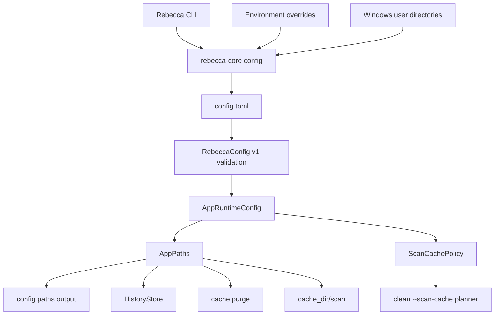

# Configuration And Local State Contract

This document is the user and developer contract for Rebecca's configuration
schema, storage paths, local state ownership, and migration posture.

`crates/rebecca-core/src/config.rs` is the runtime source of truth. This
document explains the contract that code enforces, and
`docs/adr/0008-configuration-and-local-state-model.md` records the architectural
decision behind it.

## Goals

- Keep user-editable configuration separate from machine-local state.
- Make every persisted path visible through `rebecca config paths`.
- Treat cache as rebuildable and preserved state as non-disposable.
- Keep config evolution explicit through a versioned TOML schema.
- Preserve stable JSON surfaces for scripts while letting human output improve.

## Contract Flow



The CLI must render the resolved model. It must not duplicate path resolution,
schema validation, or lifecycle classification.

## Config Schema V1

Rebecca reads human-editable TOML from the resolved config file. The current
schema version is `1`.

```toml
version = 1

[app_paths]
state_dir = 'D:\Rebecca\state'
cache_dir = 'D:\Rebecca\cache'
history_file = 'D:\Rebecca\state\history.jsonl'

[scan_cache]
directory_record_max_age_seconds = 300
```

All fields except `version` are optional. Missing `version` is treated as
version `1` so early config files keep working.

| Field | Type | Default | Validation | Effect |
|-------|------|---------|------------|--------|
| `version` | integer | `1` | Must equal `1` | Selects the config schema |
| `app_paths.state_dir` | path | `%LOCALAPPDATA%\Rebecca\state` | Parsed as a path | Durable local state root |
| `app_paths.cache_dir` | path | `%LOCALAPPDATA%\Rebecca\cache` | Parsed as a path | Rebuildable cache root |
| `app_paths.history_file` | path | `<state_dir>\history.jsonl` | Parsed as a path | Append-only cleanup history |
| `scan_cache.directory_record_max_age_seconds` | unsigned integer | `300` | Must be at least `1` | Freshness window for directory scan-cache records |

Parsing rules:

- Missing, empty, or comment-only config files are valid and use defaults.
- Malformed TOML fails before path resolution.
- Unknown fields fail clearly.
- Unsupported `version` values fail clearly and are not partially interpreted.
- Invalid scan-cache policy values fail before cleanup planning.

## Resolution Precedence

Rebecca resolves paths in a fixed order. Environment overrides are escape
hatches for tests and constrained environments, not the primary configuration
surface.

| Value | Highest precedence | Then | Default |
|-------|--------------------|------|---------|
| Config directory | `REBECCA_CONFIG_DIR` | none | `%APPDATA%\Rebecca` |
| Config file | `<config_dir>\config.toml` | none | `%APPDATA%\Rebecca\config.toml` |
| State directory | `REBECCA_STATE_DIR` | `app_paths.state_dir` | `%LOCALAPPDATA%\Rebecca\state` |
| Cache directory | `REBECCA_CACHE_DIR` | `app_paths.cache_dir` | `%LOCALAPPDATA%\Rebecca\cache` |
| History file | `REBECCA_HISTORY_FILE` | `app_paths.history_file` | `<state_dir>\history.jsonl` |

Empty environment variables are ignored. `REBECCA_CONFIG_DIR` selects where
Rebecca looks for `config.toml`; it is intentionally not a field inside
`config.toml`.

## Local State Ownership

`AppPaths::storage_entries()` exposes the lifecycle and retention policy for
Rebecca-owned storage. `rebecca config paths --json` includes this inventory
under the `storage` field while preserving the top-level path fields.

| Storage id | Default path | Lifecycle | Retention | Owner and mutation rules |
|------------|--------------|-----------|-----------|--------------------------|
| `config-file` | `%APPDATA%\Rebecca\config.toml` | `configuration` | `preserve` | User-editable config. Rebecca reads it and must not purge it. |
| `config-dir` | `%APPDATA%\Rebecca` | `configuration` | `preserve` | Container for user config. Not a cleanup target. |
| `state-dir` | `%LOCALAPPDATA%\Rebecca\state` | `durable-state` | `preserve` | Durable local state root. Future state belongs here unless it is rebuildable cache. |
| `history-file` | `%LOCALAPPDATA%\Rebecca\state\history.jsonl` | `append-only-history` | `preserve` | Append-only cleanup audit trail. Rebecca appends and reads; purge must preserve it. |
| `cache-dir` | `%LOCALAPPDATA%\Rebecca\cache` | `rebuildable-cache` | `rebuildable` | Rebuildable local cache root. `rebecca cache purge --yes` may remove direct contents but must keep the directory itself. |

The scan cache is a derived cache under `<cache_dir>\scan`. It stores versioned
records for scan reuse and is safe to delete. It must not be treated as durable
history.

## Cache Purge Boundary

`rebecca cache purge` owns only Rebecca's rebuildable cache directory. It must:

- preview by default;
- require `--yes` to delete;
- delete only direct contents of `cache_dir`;
- preserve `cache_dir` itself;
- refuse to run if `cache_dir` overlaps preserved config, state, or history;
- report lifecycle, directory existence, preservation behavior, status counts,
  and issue-matrix details.

Cleanup rules must not target Rebecca's own config, state, history, or cache
paths. Rebecca-owned cache cleanup goes through `rebecca cache purge`.
`rebecca clean` now enforces that boundary in code and blocks any target that
overlaps Rebecca-owned storage.

## History And Privacy

History is append-only JSONL. It records cleanup request metadata, summaries,
target paths, status, byte counts, reason codes, and restore hints. It must not
store file contents, credentials, tokens, or arbitrary user data.

The current cleanup safety boundaries and planned hardening steps are documented
in [Rebecca Cleanup Safety Audit](security-audit.md).

Scan-cache records may store target paths, metadata fingerprints, scan reports,
and write times. They are rebuildable optimization data, not an audit log.

## CLI Contract

`rebecca config paths --json` is the stable machine-readable surface for storage
locations. Existing top-level fields are intentionally stable:

- `config_dir`
- `config_file`
- `state_dir`
- `cache_dir`
- `history_file`
- `storage`

The `storage` array contains `id`, `path`, `lifecycle`, and `retention` for each
known Rebecca-owned path. Future additions should be additive unless a schema or
CLI contract version is introduced.

Human output can be improved for readability, but it should keep the same
storage labels and ordering unless there is a deliberate contract update.

## Migration Rules

- Current schema: `version = 1`.
- Missing `version` means version `1`.
- Unsupported versions fail before Rebecca interprets any settings.
- There is no automatic config migration in v1.
- A future version must define whether it is additive, migratable, or rejected
  by older binaries.
- New copied examples in README or docs should not break the currently supported
  binary unless the docs also declare a new schema version.
- Breaking changes require a new schema version and a migration or explicit
  rejection path.

## Alternatives Considered

### Option A: README-only contract

**Pros**: Easy for users to find.
**Cons**: README becomes too dense and mixes quick-start guidance with migration
rules.
**Decision**: Rejected. README now links here and keeps a summary.

### Option B: Code and tests only

**Pros**: Hard to drift from implementation.
**Cons**: Users and future contributors must reverse-engineer precedence,
lifecycle, and migration rules from Rust tests.
**Decision**: Rejected. Tests remain the enforcement layer, but docs define the
intended contract.

### Option C: Dedicated contract document

**Pros**: One place for schema, precedence, lifecycle, migration, and ownership
rules. Easy to cite from README, ADRs, and plans.
**Cons**: Must be kept current when the schema changes.
**Decision**: Chosen.

## Success Metrics

| Metric | Target | Measurement |
|--------|--------|-------------|
| Schema clarity | Users can copy the v1 example and predict defaults | README and this contract agree with config tests |
| Override clarity | Each override has one documented precedence order | `config paths` CLI tests |
| Lifecycle clarity | Preserved and rebuildable paths are machine-readable | `AppPaths::storage_entries` and CLI JSON tests |
| Migration safety | Unsupported versions fail before partial interpretation | Core and CLI config-version tests |
| Cache safety | Cache purge cannot delete config, state, or history | Core and CLI cache purge tests |

## Risks And Mitigations

| Risk | Severity | Likelihood | Mitigation |
|------|----------|------------|------------|
| Documentation drifts from `config.rs` | Medium | Medium | Update this file with any config schema or storage lifecycle change |
| New fields break older binaries | Medium | Medium | Treat published config examples as compatibility commitments |
| Environment overrides become an undocumented config system | Medium | Low | Keep overrides documented as escape hatches and prefer `config.toml` for user settings |
| History or scan cache accidentally stores sensitive data | High | Low | Review new persisted fields against the privacy boundary before merging |

## Verification References

- `cargo nextest run -p rebecca-core config`
- `cargo nextest run -p rebecca-cli --test cli_output`
- `cargo nextest run -p rebecca-cli --test cli_cache`
