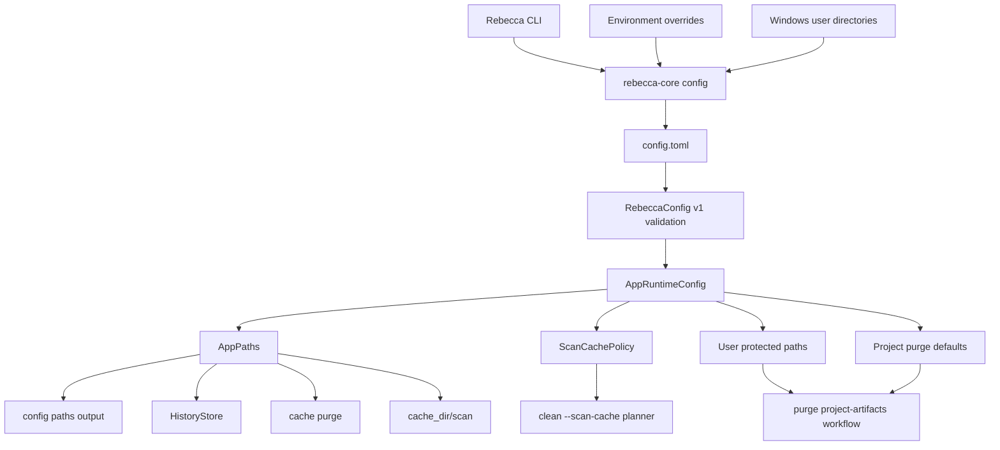

# Configuration And Local State Contract

This document is the user and developer contract for Rebecca's configuration
schema, storage paths, local state ownership, and migration posture.

`crates/rebecca-core/src/config.rs` is the runtime source of truth. This
document explains the contract that code enforces, and
`docs/adr/0008-configuration-and-local-state-model.md` records the architectural
decision behind it.

## Goals

- Keep user-editable configuration separate from machine-local state.
- Make every persisted path visible through `rebecca config paths`.
- Treat cache as rebuildable and preserved state as non-disposable.
- Keep config evolution explicit through a versioned TOML schema.
- Preserve stable JSON surfaces for scripts while letting human output improve.

## Contract Flow



The CLI must render the resolved model. It must not duplicate path resolution,
schema validation, or lifecycle classification.

## Config Schema V1

Rebecca reads human-editable TOML from the resolved config file. The current
schema version is `1`.

```toml
version = 1

[app_paths]
state_dir = 'D:\Rebecca\state'
cache_dir = 'D:\Rebecca\cache'
history_file = 'D:\Rebecca\state\history.jsonl'

[scan_cache]
directory_record_max_age_seconds = 300

[protection]
protected_paths = ['D:\Keep\Cache']

[purge]
roots = ['D:\SourceCodes', 'D:\Work']
max_depth = 6
min_age_days = 7
```

All fields except `version` are optional. Missing `version` is treated as
version `1` so early config files keep working.

| Field | Type | Default | Validation | Effect |
|-------|------|---------|------------|--------|
| `version` | integer | `1` | Must equal `1` | Selects the config schema |
| `app_paths.state_dir` | path | `%LOCALAPPDATA%\Rebecca\state` | Parsed as a path | Durable local state root |
| `app_paths.cache_dir` | path | `%LOCALAPPDATA%\Rebecca\cache` | Parsed as a path | Rebuildable cache root |
| `app_paths.history_file` | path | `<state_dir>\history.jsonl` | Parsed as a path | Append-only cleanup history |
| `scan_cache.directory_record_max_age_seconds` | unsigned integer | `300` | Must be at least `1` | Freshness window for directory scan-cache records |
| `protection.protected_paths` | array of paths | `[]` | Entries must be absolute and cannot be empty or contain `.` / `..` path segments | Extra user-owned paths that cleanup, app-leftovers, and project-purge workflows must skip |
| `purge.roots` | array of paths | `[]` | Entries must be absolute and cannot be empty or contain `.` / `..` path segments | Long-lived project artifact scan roots |
| `purge.max_depth` | unsigned integer | `6` | Parsed as a depth value | Default project artifact scan depth |
| `purge.min_age_days` | unsigned integer | `7` | `0` is allowed | Default recent-artifact skip window; `0` includes recently modified artifacts |

Parsing rules:

- Missing, empty, or comment-only config files are valid and use defaults.
- Malformed TOML fails before path resolution.
- Unknown fields fail clearly.
- Unsupported `version` values fail clearly and are not partially interpreted.
- Invalid scan-cache policy values fail before cleanup planning.
- Invalid protected-path entries fail before cleanup planning.
- Invalid purge root entries fail while loading config; configured roots that
  later go missing or become unreadable are reported as discovery diagnostics.

## Resolution Precedence

Rebecca resolves paths in a fixed order. Environment overrides are escape
hatches for tests and constrained environments, not the primary configuration
surface.

| Value | Highest precedence | Then | Default |
|-------|--------------------|------|---------|
| Config directory | `REBECCA_CONFIG_DIR` | none | `%APPDATA%\Rebecca` |
| Config file | `<config_dir>\config.toml` | none | `%APPDATA%\Rebecca\config.toml` |
| State directory | `REBECCA_STATE_DIR` | `app_paths.state_dir` | `%LOCALAPPDATA%\Rebecca\state` |
| Cache directory | `REBECCA_CACHE_DIR` | `app_paths.cache_dir` | `%LOCALAPPDATA%\Rebecca\cache` |
| History file | `REBECCA_HISTORY_FILE` | `app_paths.history_file` | `<state_dir>\history.jsonl` |

Empty environment variables are ignored. `REBECCA_CONFIG_DIR` selects where
Rebecca looks for `config.toml`; it is intentionally not a field inside
`config.toml`.

## Local State Ownership

`AppPaths::storage_entries()` exposes the lifecycle and retention policy for
Rebecca-owned storage. `rebecca config paths --format json` returns a CLI API
v1 success envelope whose `data.storage` field includes this inventory while
preserving the existing path fields inside `data`.

| Storage id | Default path | Lifecycle | Retention | Owner and mutation rules |
|------------|--------------|-----------|-----------|--------------------------|
| `config-file` | `%APPDATA%\Rebecca\config.toml` | `configuration` | `preserve` | User-editable config. Rebecca reads it and must not purge it. |
| `config-dir` | `%APPDATA%\Rebecca` | `configuration` | `preserve` | Container for user config. Not a cleanup target. |
| `state-dir` | `%LOCALAPPDATA%\Rebecca\state` | `durable-state` | `preserve` | Durable local state root. Future state belongs here unless it is rebuildable cache. |
| `history-file` | `%LOCALAPPDATA%\Rebecca\state\history.jsonl` | `append-only-history` | `preserve` | Append-only cleanup audit trail. Rebecca appends and reads; purge must preserve it. |
| `cache-dir` | `%LOCALAPPDATA%\Rebecca\cache` | `rebuildable-cache` | `rebuildable` | Rebuildable local cache root. `rebecca cache purge --yes` may move direct contents to the Recycle Bin, and `--yes --permanent` may delete them permanently; both modes must keep the directory itself. |

The scan cache is a derived cache under `<cache_dir>\scan`. It stores compact,
versioned JSON records for scan reuse and is safe to delete. The current record
version is `1`; unsupported records are treated as stale, pruned, and rebuilt. Each
record carries the scanned root path, root metadata fingerprint, scan report,
write time, scan backend, optional backend source, estimate confidence, and
optional filesystem identity fields such as volume serial, file id, and USN
checkpoint data. Rebecca
uses atomic replacement for cache writes and keeps strict file sync as an
internal policy option rather than the default hot-path behavior. Stale,
expired, corrupted, or unsupported cache files are pruned on lookup and rebuilt
when needed. Exact records from the portable and Windows native directory
backends can be reused when the root fingerprint and filesystem identity still
match. Missing USN support falls back to the normal fingerprint and identity
policy; mismatched journal ids, unavailable journal ranges, or target-subtree
changes conservatively invalidate cached records. The scan cache must not be
treated as durable history.

## Scan Backend Selection

The default scanner remains the portable recursive directory walker. Users can
opt into platform scanners per command with `--scan-backend`:

- `windows-native` uses Windows directory enumeration and falls back to the
  portable scanner when unsupported.
- `windows-ntfs-mft-experimental` attempts a read-only live NTFS/MFT volume
  index for local fixed NTFS volumes. It tries a sequential `$MFT::$DATA` source
  before the per-record FSCTL source, requires permission to open the volume
  read-only, reuses the in-memory volume index only for the current command, and
  falls back to a safe directory scanner when the volume is unsupported,
  unprivileged, or too ambiguous to trust.

Experimental NTFS/MFT estimates are explainability data only. They never
authorize deletion, and execution still revalidates filesystem paths through
the normal safety model. The parser keeps Rebecca-owned records, file-reference
sequence numbers, attributes, data streams, data runs, direct attribute-list
extensions, hardlink path candidates, and resident `$I30` directory index
entries behind the scan backend boundary. Machine outputs expose the actual
scanner through `estimate_backend`, exactness through `estimate_confidence`,
fallback detail through `estimate_fallback_reason`, actual experimental source
through optional `estimate_backend_source`, and parser or ambiguity notes through
`estimate_caveats`.

The v1 cleanup estimate remains logical bytes from the unnamed `$DATA` stream.
Allocated and initialized stream sizes are retained internally so a later disk
usage surface can report allocation-aware reclaim estimates without changing the
cleanup contract. Unsupported metadata, such as nonresident attribute lists or
nonresident `$I30` index allocation buffers, must produce caveats or fallback
instead of silent success.

## Cache Purge Boundary

`rebecca cache purge` owns only Rebecca's rebuildable cache directory. It must:

- preview by default;
- require `--yes` before mutating cache entries;
- move direct contents of `cache_dir` to the Recycle Bin by default;
- require `--yes --permanent` for irreversible direct-content deletion;
- preserve `cache_dir` itself;
- refuse to run if `cache_dir` overlaps preserved config, state, or history;
- report lifecycle, directory existence, preservation behavior, status counts,
  pending reclaim bytes, reclaimed bytes, and issue-matrix details.

Cleanup rules must not target Rebecca's own config, state, history, or cache
paths. Rebecca-owned cache cleanup goes through `rebecca cache purge`.
`rebecca clean` now enforces that boundary in code and blocks any target that
overlaps Rebecca-owned storage.

## User Protected Paths

Rebecca has built-in protected categories for credentials, browser private
data, cloud-synced data, application durable data, and other sensitive
locations. The built-in category and warning knowledge comes from the audited
Windows safety catalog, while runtime checks still protect filesystem roots,
path traversal, Rebecca-owned storage, user-profile roots, and reparse-like
paths. Users can add their own absolute protected paths when a cache-like
directory should survive cleanup.

Long-lived protection belongs in `config.toml`:

```toml
[protection]
protected_paths = [
  'D:\Keep\Cache',
  'D:\Work\ImportantTool\Cache',
]
```

One-off protection can be passed at runtime:

```powershell
rebecca clean --dry-run --exclude "$env:APPDATA\Slack\Cache"
rebecca apps scan --exclude "$env:LOCALAPPDATA\Example App\Cache"
rebecca purge --root . --exclude "$PWD\target"
```

Config and CLI protection feed the same `ProtectionPolicy` used by planning and
execution, and they are additive to the built-in safety catalog rather than a
replacement for it. If a cleanup target equals, contains, or is contained by a
protected path, the target is blocked with the `safety-policy-blocked` reason
code before scanning or deletion proceeds. This applies to regular cleanup,
app-leftovers cleanup, and project artifact purge.

After execution-time revalidation, Rebecca may group non-overlapping executable
targets into backend batches to reduce platform deletion overhead. Batching does
not change the safety boundary: each target still records its own status,
reason code, pending reclaim bytes, and history outcome.

## Project Artifact Purge Boundary

`rebecca purge` discovers rebuildable project artifact directories under
configured `[purge].roots`, the current directory, or explicit `--root <PATH>`
values. It must:

- preview by default;
- require `--yes` to move artifacts to the Windows Recycle Bin;
- scan only bounded directory depths, defaulting to `[purge].max_depth` or
  depth `6`;
- skip artifact directories modified within `[purge].min_age_days` or the last
  `7` days unless the user lowers `--min-age-days`;
- recognize directories carrying a valid `CACHEDIR.TAG` marker as rebuildable
  cache targets;
- treat `--root` values as explicit workspace boundaries that override
  configured roots for one run, rather than broad user-profile scans;
- reject explicit `--root` paths that are missing, not directories, or reparse
  points, because the user asked for that exact root;
- keep configured `[purge].roots` absolute and valid at config-load time while
  reporting later missing, unreadable, metadata-failing, or reparse-point roots
  as `discovery_diagnostics` so one stale workspace entry does not abort every
  configured root;
- treat repeated `--artifact <NAME>` values as an explicit artifact-kind filter,
  accepting directory names, full project-artifact rule ids, or rule id suffixes;
- support `rebecca catalog --kind project-artifact` as the canonical scan-free
  catalog of accepted artifact selectors, with `purge --list-artifacts`
  retained as a purge-specific compatibility listing;
- support `--reclaim-limit-bytes <BYTES>` as a planning selector that measures
  ranked eligible artifacts until the requested reclaim target is met, then
  leaves later trim-eligible candidates unmeasured;
- support `inspect artifacts` as the canonical read-only insight report that
  uses the same roots, selectors, depth, age, exclude, scan-cache, warning-gate,
  reclaim-limit, and diagnostics pipeline without accepting `--yes`, prompting,
  executing cleanup, or writing history;
- group human output by project path and label artifact kinds separately from
  full target paths;
- prune a matched artifact directory from further discovery to avoid nested
  duplicate targets;
- route all targets through Rebecca-owned storage protection, user protected
  paths, reparse-point blocking, scan-cache estimation, history, and issue
  matrix reporting.

Project artifact targets in JSON and history include a `project_artifact`
object with the matched context, project root, and anchor path that justified
the match. This is an explainability field, not a confidence score.
Project artifact cleanup plans and inspect reports also carry estimate
provenance on each target. `estimate_source` explains whether bytes came from
this command (`fresh-scan`), a valid scan-cache record (`scan-cache`), a skipped
or blocked unmeasured target (`not-measured`), or legacy serialized input
(`unknown`). When known, `estimate_backend`, `estimate_confidence`,
`estimate_backend_source`, `estimate_fallback_reason`, and `estimate_caveats`
identify the scanner, source strategy, confidence, backend fallback, and caveats
behind the estimate. These fields are explainability metadata, not deletion
authority.

The first supported artifact set tracks high-confidence rebuildable project
directories such as `node_modules`, `target`, `build`, `dist`, frontend
framework caches, Python virtual environments and caches, Gradle caches,
coverage output, CocoaPods `Pods`, Composer `vendor`, .NET `bin`/`obj`, and
valid `CACHEDIR.TAG` directories. Ambiguous directories such as generic `bin`
and non-Composer `vendor` are intentionally outside the automatic target set;
Rebecca only includes `vendor` with a sibling `composer.json`, and only includes
`bin` with a sibling `.csproj`, `.fsproj`, or `.vbproj` plus `Debug` or
`Release` output.

Project artifact metadata is governed by the Rust policy matrix in
`rebecca-core`, not ad hoc CLI strings. Each artifact has stable aliases,
default age behavior, trim eligibility, deletion style, and ranking metadata.
CLI output and API catalog data are generated from that policy so selectors,
human labels, and documentation stay aligned.

`inspect lint` is intentionally outside the purge/delete boundary. It scans
roots and optional `--reference` roots for duplicate groups, large files, empty
files, and empty directories, then reports conservative reclaim estimates. It
does not select files for deletion, remediate duplicates, or write history.

Reference source snapshots used for development should be excluded or protected
by the local environment rather than hardcoded into Rebecca. In this repository,
`repo-ref` is a git-ignored reference tree and can be protected for purge runs
with either a one-off CLI flag or an absolute protected path in config:

```powershell
rebecca purge --root . --exclude "$PWD\repo-ref"
```

```toml
[protection]
protected_paths = ['D:\SourceCodes\Rust\rebecca\repo-ref'] # replace with your checkout path
```

## History And Privacy

History is append-only JSONL. It records cleanup request metadata, summaries,
target paths, status, byte counts, reason codes, and restore hints. It must not
store file contents, credentials, tokens, or arbitrary user data.
`rebecca history --limit <N>` reads the bounded tail of non-empty history lines
and builds summaries from those newest records instead of loading the full
history projection.

The current cleanup safety boundaries and planned hardening steps are documented
in [Rebecca Cleanup Safety Audit](security-audit.md).

Scan-cache records may store target paths, metadata fingerprints, filesystem
identity fields, scan backend/source/confidence metadata, scan reports, and
write times. They are rebuildable optimization data, not an audit log.

## CLI Contract

`rebecca config paths --format json` is the stable machine-readable surface for storage
locations. It uses the CLI API v1 success envelope documented in
`docs/api/cli/v1/`; the storage payload under `data` intentionally keeps these
fields stable:

- `config_dir`
- `config_file`
- `state_dir`
- `cache_dir`
- `history_file`
- `storage`

The `data.storage` array contains `id`, `path`, `lifecycle`, and `retention`
for each known Rebecca-owned path. Future additions should be additive unless a
schema or CLI contract version is introduced.

Human output can be improved for readability, but it should keep the same
storage labels and ordering unless there is a deliberate contract update.

## Migration Rules

- Current schema: `version = 1`.
- Missing `version` means version `1`.
- Unsupported versions fail before Rebecca interprets any settings.
- There is no automatic config migration in v1.
- A future version must define whether it is additive, migratable, or rejected
  by older binaries.
- New copied examples in README or docs should not break the currently supported
  binary unless the docs also declare a new schema version.
- Breaking changes require a new schema version and a migration or explicit
  rejection path.

## Alternatives Considered

### Option A: README-only contract

**Pros**: Easy for users to find.
**Cons**: README becomes too dense and mixes quick-start guidance with migration
rules.
**Decision**: Rejected. README now links here and keeps a summary.

### Option B: Code and tests only

**Pros**: Hard to drift from implementation.
**Cons**: Users and future contributors must reverse-engineer precedence,
lifecycle, and migration rules from Rust tests.
**Decision**: Rejected. Tests remain the enforcement layer, but docs define the
intended contract.

### Option C: Dedicated contract document

**Pros**: One place for schema, precedence, lifecycle, migration, and ownership
rules. Easy to cite from README, ADRs, and plans.
**Cons**: Must be kept current when the schema changes.
**Decision**: Chosen.

## Success Metrics

| Metric | Target | Measurement |
|--------|--------|-------------|
| Schema clarity | Users can copy the v1 example and predict defaults | README and this contract agree with config tests |
| Override clarity | Each override has one documented precedence order | `config paths` CLI tests |
| Lifecycle clarity | Preserved and rebuildable paths are machine-readable | `AppPaths::storage_entries` and CLI JSON tests |
| Migration safety | Unsupported versions fail before partial interpretation | Core and CLI config-version tests |
| Cache safety | Cache purge cannot delete config, state, or history | Core and CLI cache purge tests |

## Risks And Mitigations

| Risk | Severity | Likelihood | Mitigation |
|------|----------|------------|------------|
| Documentation drifts from `config.rs` | Medium | Medium | Update this file with any config schema or storage lifecycle change |
| New fields break older binaries | Medium | Medium | Treat published config examples as compatibility commitments |
| Environment overrides become an undocumented config system | Medium | Low | Keep overrides documented as escape hatches and prefer `config.toml` for user settings |
| History or scan cache accidentally stores sensitive data | High | Low | Review new persisted fields against the privacy boundary before merging |

## Verification References

- `cargo nextest run -p rebecca-core config`
- `cargo nextest run -p rebecca --test cli_output`
- `cargo nextest run -p rebecca --test cli_cache`
