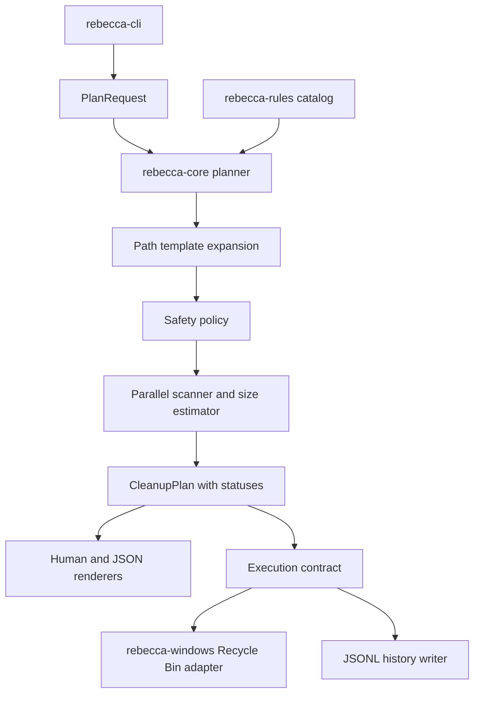
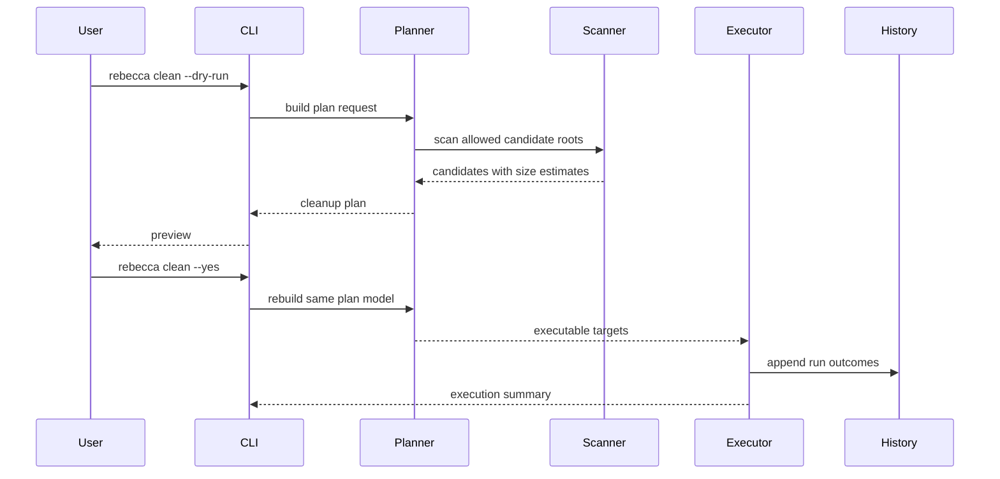

# feat: Build Windows Cleanup MVP

## Status

Complete. The MVP has been implemented and verified; follow-up work belongs in separate plans.

## Summary

Build Rebecca's first real Windows cleanup loop: resolve owned cleanup rules, scan candidates in parallel, build a safety-reviewed cleanup plan, preview with dry-run, execute recoverable deletion through the Windows adapter, and record append-only history. The plan keeps Rebecca Windows-first and defers uninstall, optimization, disk-map analysis, and NTFS metadata acceleration.

---

## Problem Frame

Rebecca is currently a Rust workspace with a `clap` CLI skeleton and ADRs that pin the product direction. The CLI can list stub rules and print configuration paths, but `clean` does not scan, plan, delete, or record history.

The next milestone should prove the product's core trust contract before expanding rule coverage: a user can see what would be cleaned, understand why each target is allowed or skipped, execute a recoverable cleanup, and inspect what happened afterward. This follows the existing ADR direction: Windows-first, plan-first, owned rule catalog, standard-user default, bounded parallel traversal, Recycle Bin by default, and no copied GPL rule data.

---

## Requirements

**Rule Catalog And Discovery**

- R1. Built-in Windows rules resolve owned path templates into candidate roots without copying GPL cleaner definitions or source.
- R2. Every built-in rule exposes stable metadata: id, platform, category, safety level, delete policy, restore hint, and provenance.
- R3. Missing paths are represented as skipped discovery results, not errors that fail the whole run.

**Planning And Safety**

- R4. `clean --dry-run` and real cleanup use the same plan builder and differ only at execution mode.
- R5. The cleanup plan distinguishes allowed, skipped, blocked, failed, and completed targets with rule id, path, size estimate, and reason metadata.
- R6. Central safety policy blocks empty paths, path traversal, filesystem roots, critical Windows and profile paths, and reparse-point traversal by default.
- R7. Moderate or risky rules require an explicit opt-in flag before they can become executable targets.

**Scanning And Execution**

- R8. The default scan engine uses bounded parallel directory traversal and deterministic output ordering.
- R9. Default Windows execution moves allowed targets to the Recycle Bin when supported; permanent deletion remains out of the MVP command surface.
- R10. Admin-only or inaccessible targets are reported as skipped or failed without auto-elevation.

**CLI And History**

- R11. `scan`, `clean`, `history`, `config paths`, and `doctor permissions` support human-readable output, with JSON output for scriptable surfaces.
- R12. Every executed cleanup appends structured history with run summary, per-target outcome, `freed_bytes`, and `pending_reclaim_bytes`.
- R13. History and cache/state files are stored under the AppData paths already defined by the configuration model.

**Quality And Verification**

- R14. Core planning, safety, scanning, and history logic is testable without touching real user cache directories.
- R15. Windows-specific execution has a mockable core contract and Windows-gated integration coverage.

---

## Key Technical Decisions

- KTD1. **Plan-first orchestration:** `rebecca-core` should own scan-to-plan orchestration so `dry-run`, execution, JSON output, and tests all consume the same model.
- KTD2. **Candidate status model:** Replace the current target-only `CleanupPlan` with a richer status model so skipped and blocked paths are visible instead of disappearing from output.
- KTD3. **Typed rule targets:** Evolve `RuleDefinition.path_templates` toward typed target specs while preserving simple templates for the first rules; this keeps future registry, known-folder, and glob discovery from becoming ad hoc string handling.
- KTD4. **Synchronous filesystem with bounded parallelism:** Use `jwalk`, `ignore`, and `rayon` for scanning and sizing instead of an async runtime; the workload is blocking filesystem I/O and the ADRs already favor sync traversal.
- KTD5. **Recoverable Windows adapter:** Keep Recycle Bin deletion and privilege detection in `rebecca-windows`, behind contracts that `rebecca-core` can test with fakes.
- KTD6. **Conservative safety defaults:** Do not follow junctions, symlinks, or other reparse points by default; report them for review unless a later feature adds explicit traversal policy.
- KTD7. **Human and JSON from one model:** CLI rendering should be a view over core structs, not a second code path that recomputes totals or target state.

---

## High-Level Technical Design

---

## Scope Boundaries

### In Scope

- Windows user-scope cleanup for the existing starter categories: user temp, Microsoft Edge cache, and npm cache.
- Dry-run preview, JSON output, safety status reporting, and Recycle Bin execution.
- Append-only history and `history` CLI rendering.
- Mockable tests for destructive behavior and Windows-gated tests for the platform adapter.

### Deferred To Follow-Up Work

- Uninstaller and leftover application removal.
- System optimization commands, maintenance tasks, and registry cleanup.
- WizTree-style NTFS/MFT/USN indexing and disk-map analysis.
- Broad cleaner catalog expansion for browsers, package managers, game launchers, and IDEs.
- Linux/macOS parity beyond keeping shared core APIs platform-aware.
- TUI category selection and rich interactive review.
- Permanent delete mode and administrator auto-elevation.

---

## System-Wide Impact

This work turns Rebecca from a skeleton into a destructive-capable local tool, so the core safety model becomes a project-wide invariant. After this plan lands, new cleanup rules should plug into the same planner, safety policy, executor, and history writer instead of deleting directly.

The CLI contract also becomes externally visible. JSON shapes for `scan`, `clean --dry-run`, and `history --json` should be treated as early but intentional contracts and changed only with deliberate migration.

---

## Implementation Units

### U1. Expand Core Domain Model And Rule Metadata

- **Goal:** Replace the minimal plan and rule structs with the domain types needed for candidate discovery, status reporting, safety review, and history.
- **Requirements:** R1, R2, R5, R14
- **Dependencies:** None
- **Files:** `crates/rebecca-core/src/model.rs`, `crates/rebecca-core/src/plan.rs`, `crates/rebecca-core/src/error.rs`, `crates/rebecca-core/src/lib.rs`, `crates/rebecca-core/tests/model_contract.rs`, `crates/rebecca-rules/src/lib.rs`
- **Approach:** Add plan request, candidate, target status, skip/block reason, run summary, and rule target concepts in `rebecca-core`. Keep `rebecca-rules` as the owner of built-in rules and validate that every rule has provenance and a stable id.
- **Execution note:** Implement model serialization and rule validation test-first because later CLI and history behavior will depend on these shapes.
- **Patterns to follow:** Existing `RuleDefinition`, `DeleteMode`, `SafetyLevel`, and `CleanupPlan` types in `crates/rebecca-core/src/model.rs` and `crates/rebecca-core/src/plan.rs`.
- **Test scenarios:**
  - Happy path: serializing a cleanup plan with one allowed target preserves rule id, path, size, status, and delete mode.
  - Edge case: a plan with only skipped targets still has a run summary and zero executable bytes.
  - Error path: duplicate built-in rule ids fail catalog validation.
  - Error path: a built-in rule without provenance metadata fails catalog validation.
- **Verification:** Core model tests pass and the starter rules still render through `rebecca scan --json` without losing metadata.

### U2. Implement Path Expansion And Safety Policy

- **Goal:** Resolve rule path templates into filesystem candidates and classify dangerous paths before any scan or delete can occur.
- **Requirements:** R1, R3, R6, R7, R10, R14
- **Dependencies:** U1
- **Files:** `crates/rebecca-core/src/path_template.rs`, `crates/rebecca-core/src/safety.rs`, `crates/rebecca-core/src/lib.rs`, `crates/rebecca-core/tests/path_templates.rs`, `crates/rebecca-core/tests/safety_policy.rs`
- **Approach:** Implement Windows environment-variable expansion for `%TEMP%`, `%LOCALAPPDATA%`, `%APPDATA%`, and related user-scoped templates through an injectable environment source. Add safety checks for empty paths, relative paths, traversal components, drive roots, user profile roots, Windows system directories, and reparse-point policy.
- **Execution note:** Use fixture and fake-environment tests rather than the developer machine's real AppData paths.
- **Patterns to follow:** ADR 0004 for privilege boundaries, ADR 0006 for recovery/safety, and Mole's local safety posture in `repo-ref/Mole/lib/core/file_ops.sh` as behavior-level reference only.
- **Test scenarios:**
  - Happy path: `%LOCALAPPDATA%\Temp` expands from a fake environment to an absolute user-local path.
  - Edge case: an unset environment variable returns a skipped candidate with a reason instead of panicking.
  - Error path: `..\Windows` and paths containing traversal components are blocked.
  - Error path: `C:\`, `%USERPROFILE%`, and `%WINDIR%` are blocked even if a rule points at them.
  - Integration scenario: a rule with safe and unsafe templates produces one allowed candidate and one blocked candidate in the same discovery result.
- **Verification:** Safety tests cover allowed, skipped, and blocked classifications without requiring administrator rights.

### U3. Build Parallel Scanner And Size Accounting

- **Goal:** Turn safe candidate roots into deterministic file and directory targets with estimated byte counts.
- **Requirements:** R5, R8, R10, R14
- **Dependencies:** U1, U2
- **Files:** `crates/rebecca-core/src/scan.rs`, `crates/rebecca-core/src/size.rs`, `crates/rebecca-core/src/lib.rs`, `crates/rebecca-core/tests/scan_engine.rs`, `crates/rebecca-core/benches/scan_baseline.rs`
- **Approach:** Use bounded parallel traversal for directories and direct metadata reads for files. Do not follow reparse points. Return per-target scan errors so one locked or inaccessible path does not fail the whole plan. Sort output by category, rule id, and path for stable CLI and JSON snapshots.
- **Execution note:** Start with deterministic fixture tests, then add a small benchmark fixture only after behavior is covered.
- **Patterns to follow:** ADR 0002 and ADR 0005; Mole's size-first cleanup reporting is a UX reference, not an implementation source.
- **Test scenarios:**
  - Happy path: scanning a fixture directory returns total bytes equal to the sum of contained files.
  - Edge case: an empty directory returns a target with zero bytes and still appears in the plan.
  - Error path: an inaccessible or disappearing path is reported as failed or skipped with a reason.
  - Edge case: a symlink or junction-like fixture is not traversed by default.
  - Integration scenario: repeated scans over the same fixture return deterministic ordering.
- **Verification:** Scanner tests pass on Windows and non-Windows hosts where fixtures are supported; Windows-only reparse behavior is gated with `cfg(windows)`.

### U4. Implement Cleanup Planner And Selection Filters

- **Goal:** Compose rules, path expansion, safety policy, scanning, and user-selected filters into one cleanup plan.
- **Requirements:** R3, R4, R5, R7, R8, R14
- **Dependencies:** U1, U2, U3
- **Files:** `crates/rebecca-core/src/planner.rs`, `crates/rebecca-core/src/plan.rs`, `crates/rebecca-core/src/lib.rs`, `crates/rebecca-core/tests/planner.rs`, `crates/rebecca-rules/src/lib.rs`
- **Approach:** Add a `PlanRequest` with platform, delete mode, selected categories, selected rule ids, and safety-level opt-ins. The planner should return one complete plan containing executable targets and non-executable statuses. Unknown rule ids should produce clear user-facing errors.
- **Execution note:** Keep planning pure and side-effect-light so CLI tests can call it repeatedly without touching history or deletion.
- **Patterns to follow:** Current `CleanupPlan::new(mode)` entry point, expanded rather than bypassed.
- **Test scenarios:**
  - Happy path: selecting the `system` category includes user temp candidates and excludes browser/development rules.
  - Happy path: selecting one rule id includes only that rule.
  - Edge case: no selected rules produces a valid empty plan with an explanatory summary.
  - Error path: an unknown rule id returns `InvalidRuleId`.
  - Error path: a moderate rule is skipped unless the request opts into moderate safety level.
  - Integration scenario: dry-run and recycle-bin requests over the same fixture produce the same target set and different execution modes only.
- **Verification:** Planner tests prove dry-run parity and rule/category filtering before CLI wiring begins.

### U5. Implement Windows Execution Adapter

- **Goal:** Execute allowed cleanup targets through a Windows-specific recoverable deletion path while keeping core execution mockable.
- **Requirements:** R4, R9, R10, R15
- **Dependencies:** U1, U4
- **Files:** `crates/rebecca-core/src/executor.rs`, `crates/rebecca-core/src/lib.rs`, `crates/rebecca-core/tests/executor_contract.rs`, `crates/rebecca-windows/src/lib.rs`, `crates/rebecca-windows/src/recycle.rs`, `crates/rebecca-windows/src/privilege.rs`, `crates/rebecca-windows/tests/recycle_bin.rs`
- **Approach:** Define a core execution contract that receives an executable plan and returns per-target outcomes. Implement the Windows adapter with Recycle Bin behavior through the existing Windows dependency set. Keep permanent deletion unsupported in the CLI for this MVP. Report permission failures, locked files, and Recycle Bin failures without fallback deletion.
- **Execution note:** Use a fake executor for core tests; keep Windows integration tests guarded so non-Windows builds remain useful.
- **Patterns to follow:** ADR 0004 and ADR 0006; Mole's `mole_delete` behavior in `repo-ref/Mole/lib/core/file_ops.sh` is a safety reference only.
- **Test scenarios:**
  - Happy path: a fake executor marks one allowed target as completed and records pending reclaim bytes.
  - Error path: a fake executor permission failure records a failed target and leaves the run non-fatal.
  - Error path: a blocked target is never passed to the executor.
  - Windows integration scenario: a temporary file can be moved through the Recycle Bin adapter when the host supports it.
  - Windows integration scenario: privilege detection returns standard, elevated, or unknown without panicking.
- **Verification:** Core executor contract tests pass everywhere; Windows-gated tests pass on a Windows developer machine.

### U6. Add History Store And Output Contracts

- **Goal:** Persist cleanup runs and expose scriptable summaries without storing sensitive file contents.
- **Requirements:** R11, R12, R13, R14
- **Dependencies:** U1, U5
- **Files:** `crates/rebecca-core/src/history.rs`, `crates/rebecca-core/src/config.rs`, `crates/rebecca-core/src/lib.rs`, `crates/rebecca-core/tests/history.rs`, `crates/rebecca-cli/src/main.rs`, `crates/rebecca-cli/tests/cli_history.rs`
- **Approach:** Write append-only JSONL records under the existing `history_file` path. Include run id, timestamp, mode, totals, per-target outcome, and error reason when present. Add `rebecca history` and `rebecca history --json` rendering from the same stored records.
- **Execution note:** Avoid recording file contents, environment variable values beyond resolved paths, or command-line secrets.
- **Patterns to follow:** ADR 0008 for state location and Mole's history concept in `repo-ref/Mole/lib/core/history.sh` as behavior-level reference.
- **Test scenarios:**
  - Happy path: appending two run records preserves both records in order.
  - Edge case: missing history file renders an empty history instead of an error.
  - Error path: malformed JSONL records are reported and skipped or surfaced according to one consistent policy.
  - Privacy scenario: history records path metadata and outcomes but never file contents.
  - CLI integration scenario: `history --json` prints parseable JSON for a fixture history file.
- **Verification:** History tests pass with temporary state directories and no writes to the real AppData tree.

### U7. Wire CLI Workflow, Prompts, And JSON Output

- **Goal:** Make `rebecca scan`, `rebecca clean`, `rebecca history`, and `rebecca doctor permissions` usable from the terminal.
- **Requirements:** R4, R7, R9, R10, R11, R12, R15
- **Dependencies:** U1, U2, U3, U4, U5, U6
- **Files:** `crates/rebecca-cli/src/main.rs`, `crates/rebecca-cli/tests/cli_scan.rs`, `crates/rebecca-cli/tests/cli_clean.rs`, `crates/rebecca-cli/tests/cli_output.rs`, `README.md`
- **Approach:** Add category/rule filters, safety opt-in flags, `--dry-run`, `--json`, and an explicit execution confirmation path. Require `--yes` or an interactive confirmation before non-dry-run cleanup. On unsupported platforms, keep commands informative rather than pretending full cleanup is available.
- **Execution note:** Treat CLI tests as contract tests over the binary because these flags become user-facing.
- **Patterns to follow:** Current `clap` command enum in `crates/rebecca-cli/src/main.rs`; ADR 0001 for Windows-first wording.
- **Test scenarios:**
  - Happy path: `scan --json` returns all starter rules as parseable JSON.
  - Happy path: `clean --dry-run --json` returns a plan and does not execute deletion.
  - Error path: `clean --rule missing.rule --dry-run` exits with a clear invalid-rule error.
  - Error path: non-dry-run cleanup without `--yes` asks for confirmation or exits without deleting in non-interactive mode.
  - Integration scenario: `config paths --json` remains parseable after history and cache directories are introduced.
  - Platform scenario: non-Windows hosts report unsupported execution while still allowing non-destructive rule listing and config inspection.
- **Verification:** CLI contract tests pass and README examples match implemented flags.

---

## Acceptance Examples

- AE1. Given a fake `%LOCALAPPDATA%` containing temp files, when the user runs `rebecca clean --dry-run --json`, then the output lists candidate paths and byte estimates without deleting files.
- AE2. Given a rule template that resolves to `C:\`, when planning runs, then the target is blocked with a safety reason and is never executable.
- AE3. Given a moderate development-cache rule, when the user does not pass the moderate opt-in, then the rule appears as skipped and no target from that rule is executable.
- AE4. Given a supported Windows host and an allowed temporary file target, when the user confirms cleanup, then the target is moved through the recoverable Windows deletion path and history records pending reclaim bytes.
- AE5. Given no previous cleanup runs, when the user runs `rebecca history --json`, then the command returns a valid empty history response.

---

## Risks & Dependencies

- **Safety regression risk:** A cleaner bug can delete valuable user data. Mitigation: all deletes pass through safety policy, executable plan filtering, and the platform executor contract.
- **Windows filesystem edge cases:** Junctions, symlinks, locked files, and Recycle Bin failures can vary by host. Mitigation: default to non-traversal, report failures per target, and keep Windows tests gated.
- **JSON contract churn:** Early machine-readable output may be used by scripts. Mitigation: derive human and JSON output from the same model and avoid needless shape changes.
- **Reference license risk:** Mole and BleachBit are GPL references. Mitigation: use them only for behavior-level research and keep owned rule metadata in Rebecca.
- **Performance risk:** Parallel traversal can overload slow drives if uncontrolled. Mitigation: use bounded traversal and add a baseline benchmark after functional tests.

---

## Documentation And Operational Notes

- Update `README.md` with Windows-first positioning, dry-run-first usage, JSON examples, and safety notes.
- Keep ADRs unchanged unless implementation discovers a decision conflict; this plan is intended to execute the existing ADR direction.
- Keep `repo-ref/` as reference material and avoid importing rule data from GPL projects.
- Use `cargo fmt --all`, `cargo check --workspace`, and `cargo nextest run --workspace` as the normal verification baseline when implementing.

---

## Sources & Research

- `docs/adr/0001-platform-strategy.md` for Windows-first scope.
- `docs/adr/0002-core-runtime-architecture.md` for layered runtime and sync parallel scanning.
- `docs/adr/0003-workspace-and-module-boundaries.md` for crate boundaries.
- `docs/adr/0004-windows-privilege-and-registry-model.md` for standard-user and registry limits.
- `docs/adr/0005-scan-engine-strategy.md` for traversal-first scanning and deferred NTFS acceleration.
- `docs/adr/0006-deletion-and-recovery-model.md` for plan-first cleanup and Recycle Bin defaults.
- `docs/adr/0007-rule-catalog-and-license-provenance.md` for owned rule catalog and GPL boundaries.
- `docs/adr/0008-configuration-and-local-state-model.md` for AppData config and state paths.
- `repo-ref/Mole/README.md`, `repo-ref/Mole/lib/core/file_ops.sh`, and `repo-ref/Mole/lib/core/history.sh` for behavior-level safety, dry-run, deletion, and history reference.
- `repo-ref/windows-cleaner-cli/README.md` for Windows cleaner category and CLI UX comparison.
- `repo-ref/CrunchyCleaner/README.md` for Windows/Linux cache category comparison.
- `repo-ref/bleachbit/README.md` for mature cleaner preview/delete workflow and GPL rule-license caution.
- `repo-ref/Bulk-Crap-Uninstaller/README.md` for future uninstall scope context, deferred from this MVP.
