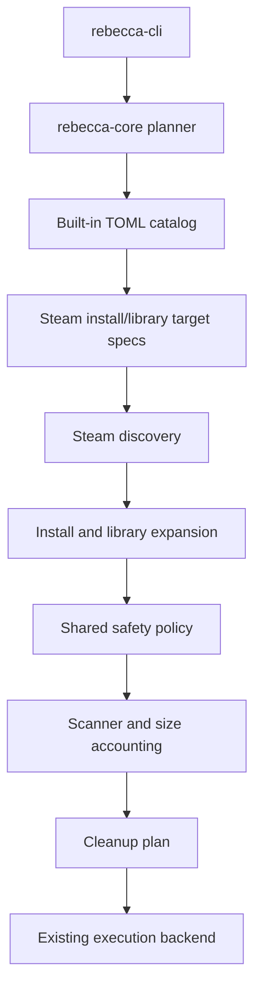

# feat: Expand Steam cleanup coverage

## Summary

Extend Rebecca's Steam support beyond the current client web cache by adding a small set of conservative install-root and library-root cleanup rules. The plan keeps Steam discovery typed, best-effort, and safety-first, while leaving active downloads and game content out of scope.

---

## Problem Frame

The MVP already proves Steam install and library discovery, and the catalog can resolve Steam-aware targets through typed rule specs. What is still missing is useful cleanup coverage that takes advantage of that discovery without turning Steam into a broad game-data deletion feature.

This follow-up should add a narrow, auditable Steam cleanup slice that feels immediately useful to users and still fits the project's preview-first trust model.

---

## Requirements

**Steam Coverage**

- R1. Built-in Steam rules target only disposable install-root or library-root cache directories.
- R2. Steam-aware rules use the existing typed Steam install and Steam library target specs, not raw string special cases.
- R3. New Steam rules keep owned provenance, explicit safety levels, Recycle Bin deletion, and restore hints.

**Discovery And Safety**

- R4. Steam library-relative targets expand across the Steam install root and every discovered library root, with deterministic deduped output.
- R5. Steam-relative path validation continues to reject absolute paths, parent traversal, and root-like segments.
- R6. Missing Steam discovery skips only Steam-aware rules and does not fail unrelated planning or scanning.

**User Surface**

- R7. `scan`, `clean --dry-run`, and rule listing continue to show Steam cleanup coverage through the existing human and JSON output.
- R8. README and rule-authoring guidance explain the new Steam coverage and its explicit non-goals.

---

## Key Technical Decisions

- **Keep Steam rules declarative.** Add coverage in TOML catalog files instead of branching more Steam logic into the planner.
- **Stay conservative.** Cover client cache and library shader or cache directories only; keep `steamapps/common`, workshop content, account metadata, and active downloads out of scope.
- **Treat discovery as best-effort.** Steam absence remains a skip reason, not a failure path for the whole run.
- **Preserve the current CLI contract.** This is catalog growth, not a new mode or confirmation workflow.

---

## High-Level Technical Design

---

## Scope Boundaries

### In Scope

- Steam client cache coverage under the install root.
- Steam library-relative cache coverage for safe disposable directories such as shader caches.
- TOML rule additions, catalog validation, and planner regressions.
- README and rule-authoring updates for the new Steam scope.

### Deferred To Follow-Up Work

- Active download cleanup.
- `steamapps/common` game content.
- Workshop content and other user-generated Steam data.
- Steam uninstall leftovers or app removal flows.

### Outside This Product's Identity

- Broad Steam game management.
- Aggressive cleanup of live install state.
- Any cleanup that depends on guessing user intent instead of explicit safe targets.

---

## System-Wide Impact

This change widens the set of destructive targets the product can surface, so the safety and provenance model remains project-wide infrastructure, not a per-rule afterthought. The new rules also become part of Rebecca's public trust story: they should be easy to explain, easy to preview, and easy to audit from the catalog files alone.

---

## Implementation Units

### U1. Add Conservative Steam Cleanup Rules

- **Goal:** Add new Steam install-root and library-root rules to the TOML catalog.
- **Files:** `crates/rebecca-rules/rules/windows/steam-install-cache.toml`, `crates/rebecca-rules/rules/windows/steam-install-download-cache.toml`, `crates/rebecca-rules/rules/windows/steam-install-library-cache.toml`, `crates/rebecca-rules/rules/windows/steam-library-shader-cache.toml`, `crates/rebecca-rules/rules/windows/steam-library-downloading-cache.toml`, `crates/rebecca-rules/rules/windows/steam-library-temp-cache.toml`, `crates/rebecca-rules/src/lib.rs`
- **Approach:** Introduce conservative install-root cache rules for `appcache\httpcache`, `appcache\download`, and `appcache\librarycache`, plus library-root rules for shader, downloading, and temp caches. Keep the rules owned, provenance-backed, and recycle-bin based.
- **Patterns to follow:** Existing Steam rule structure in `crates/rebecca-rules/rules/windows/steam-cache.toml` and the catalog parser in `crates/rebecca-rules/src/lib.rs`.
- **Test scenarios:**
  - Happy path: both new rules load from the catalog with stable ids and required metadata.
  - Edge case: rule ids remain unique across the built-in catalog.
  - Error path: a malformed Steam rule file still fails catalog validation with a clear error.
- **Verification:** Built-in rule validation still passes and the new rule ids appear in `scan` output.

### U2. Prove Steam Expansion And Skip Behavior

- **Goal:** Verify that Steam-aware targets expand safely across discovered roots and skip cleanly when discovery is absent.
- **Files:** `crates/rebecca-core/src/applications.rs`, `crates/rebecca-core/src/discovery.rs`, `crates/rebecca-core/tests/discovery.rs`, `crates/rebecca-core/tests/planner.rs`
- **Approach:** Extend the existing fake-discovery tests to cover install-root targets, library-root targets, deterministic dedupe and ordering, and skip behavior when Steam is unavailable.
- **Patterns to follow:** The current Steam discovery and planner tests already exercise `SteamInstallation`, `StaticApplicationDiscovery`, and typed Steam target specs.
- **Test scenarios:**
  - Happy path: a Steam install-root target expands from the discovered install path.
  - Happy path: a Steam library-root target expands across multiple discovered libraries.
  - Edge case: duplicate roots dedupe to a single planned target.
  - Error path: a Steam-relative target with `..` or an absolute path is rejected.
  - Edge case: missing Steam discovery skips only Steam-aware rules.
- **Verification:** Planner and discovery tests cover the new Steam rules without depending on the developer machine's Steam install.

### U3. Update User-Facing Documentation And CLI Coverage

- **Goal:** Keep the visible product story aligned with the expanded Steam catalog.
- **Files:** `README.md`, `docs/rule-authoring.md`, `crates/rebecca-cli/tests/cli_scan.rs`, `crates/rebecca-cli/tests/cli_output.rs`
- **Approach:** Document the new Steam coverage, restate the exclusions, and add or refresh CLI regression coverage if rule listing or dry-run snapshots need stable updates.
- **Patterns to follow:** The current README's built-in rule list and the Steam guidance already in `docs/rule-authoring.md`.
- **Test scenarios:**
  - Happy path: the README examples and built-in rule list stay consistent with the catalog.
  - Edge case: CLI output still shows Steam rules through the existing scan and clean paths.
  - Error path: no new user-facing flag is required to use the added Steam rules.
- **Verification:** Documentation and CLI tests remain aligned with the built-in catalog.

---

## Current Status

- The Steam cleanup expansion slice is implemented in the repository.
- The implemented slice now includes the Steam catalog expansion, Steam discovery hardening, and the user-facing restore-hint contract across human and JSON outputs.
- Any remaining work belongs to future follow-up scopes, not this plan.

---

## Acceptance Examples

- AE1. Given a Steam install with a discovered library, when the user runs `rebecca clean --dry-run`, then the new Steam rules appear with the same status and byte reporting as other rules.
- AE2. Given multiple Steam libraries, when a library-relative rule expands, then each discovered root contributes a deduped target path.
- AE3. Given a Steam-relative target that points at `..` or a drive root, when planning runs, then the target is blocked before execution.
- AE4. Given a machine without Steam installed, when the user runs `rebecca scan`, then non-Steam rules still work and Steam-aware rules are skipped rather than failing the run.

---

## Risks And Dependencies

- **Steam layout drift:** Client and library layouts vary by install and version. Mitigation: keep the new rules narrow and preserve best-effort discovery.
- **Overreach risk:** Steam has tempting but dangerous targets such as live downloads and game binaries. Mitigation: keep those paths deferred and document the boundary explicitly.
- **Catalog churn:** More rules can make auditability harder. Mitigation: keep provenance notes specific and tests fixture-based.

---

## Documentation And Operational Notes

- Update `README.md` with the new Steam coverage and the explicit exclusions.
- Update `docs/rule-authoring.md` so future Steam rules follow the same conservative boundaries.
- Keep the Steam rules small enough that their intent is obvious from the TOML files alone.
- Keep the restore-hint contract visible in both human and JSON outputs so future rule additions remain auditable from the catalog and plan history.

---

## Sources And Research

- `crates/rebecca-core/src/applications.rs`
- `crates/rebecca-core/src/discovery.rs`
- `crates/rebecca-core/tests/discovery.rs`
- `crates/rebecca-core/tests/planner.rs`
- `crates/rebecca-rules/rules/windows/steam-cache.toml`
- `crates/rebecca-rules/src/lib.rs`
- `crates/rebecca-cli/tests/cli_scan.rs`
- `crates/rebecca-cli/tests/cli_output.rs`
- `README.md`
- `docs/rule-authoring.md`
- `repo-ref/Bulk-Crap-Uninstaller/source/UninstallTools/Factory/SteamFactory.cs`
