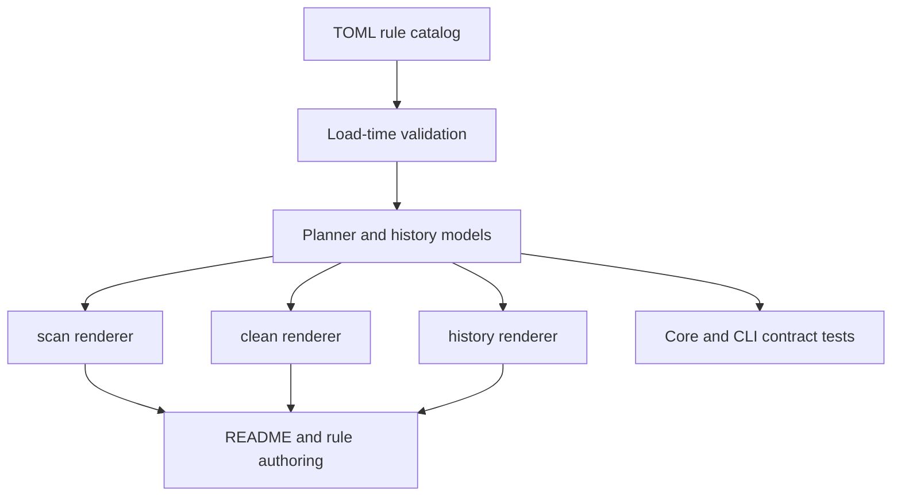

# refactor: Tighten cleanup contracts and rule governance

## Summary

Rebecca has reached the point where rule growth needs stronger contracts than convention. This plan hardens the built-in rule catalog, the CLI output surfaces, and the history boundary so future cleanup work stays auditable and predictable.

Mole is a useful reference for the posture here: preview-first, history as an audit surface, protected paths treated as part of the product contract, and JSON output reserved for stable machine use. Rebecca should follow that discipline without copying Mole's implementation style or broadening cleanup scope.

---

## Problem Frame

Steam expansion proved that Rebecca can grow its built-in catalog, but it also highlighted how much of the current behavior depends on convention: catalog metadata shape, restore-hint propagation, output ordering, and history replay.

The next slice should lock down those contracts before more rules are added. That keeps the cleanup loop easy to reason about, keeps automation stable, and avoids turning small catalog changes into output regressions.

---

## Requirements

**Rule Catalog Governance**

- R1. Built-in rules remain one rule per file, and catalog loading rejects malformed TOML, missing required metadata, empty ids, duplicate rule ids, and duplicate target specs.
- R2. Rule provenance stays mandatory and descriptive, so each built-in rule can still be traced back to an owned source and an explicit note.

**Output Contracts**

- R3. `scan`, `clean`, and `history` keep deterministic machine-readable output, with JSON shape changes treated as additive-only for existing fields.
- R4. Human output for `scan`, `clean`, and `history` keeps its grouped structure and restore-hint summaries so operators can compare runs quickly.
- R5. Missing history remains a normal empty result, while malformed history fails with a clear corruption error that names the bad file or line.

**Selection And Safety**

- R6. Unknown categories and rule ids continue to fail before planning starts, and safety opt-in behavior remains explicit at the request boundary.
- R7. The plan does not add new cleanup families, discovery backends, or execution modes.

**Docs And State**

- R8. The rule authoring guide, README, and durable engineering state stay aligned with the governed contract and the current built-in catalog.

---

## Key Technical Decisions

- KTD1. Keep catalog invariants centralized in `rebecca-rules` so every built-in rule is validated once at load time instead of being rechecked in each consumer.
- KTD2. Treat the core plan and history types as the canonical contract; CLI renderers should project them, not recompute state or invent alternate schemas.
- KTD3. Preserve the current structural output of `scan`, `clean`, and `history`, with additive JSON changes only, so scripted consumers stay stable.
- KTD4. Use Mole's preview-first and history-readable posture as the contract benchmark, but keep Rebecca's own rule data, output text, and file formats intact.
- KTD5. Do not widen the cleanup surface in this slice; any new rule family or discovery backend belongs in a separate plan with its own tests.

---

## High-Level Technical Design

The design keeps contract authority in the core and treats the CLI as a view. That makes the same invariants visible to rule loading, planning, output rendering, and history replay.

---

## Scope Boundaries

### In Scope

- Catalog validation and provenance checks for built-in rules.
- Stable CLI output contracts for `scan`, `clean`, and `history`.
- Restore-hint and history replay behavior.
- README, rule-authoring, and durable-state alignment.

### Deferred For Later

- New cleanup families.
- New discovery backends.
- New history storage formats.
- Broad UI redesign or command-shape changes.

### Outside This Product's Identity

- Copying Mole implementation code or shell patterns.
- Broadening cleanup scope just because the catalog validator now exists.
- Introducing a second contract source that competes with the core models.

---

## System-Wide Impact

This work affects every consumer of the built-in rule catalog and every operator-facing CLI command. It also establishes the default safety posture for future rule work: preview-first, auditable, and validated at load time instead of at the point of deletion.

---

## Risks & Dependencies

- JSON shape changes can break downstream scripts, so the contract tests need to pin the current fields and ordering before any doc updates land.
- Tightening catalog validation may surface latent problems in rule files or fixtures; that should be treated as a correctness gain, not papered over.
- The Mole references are guidance for contract posture, not a source to copy from mechanically.

---

## Sources / Research

- `repo-ref/Mole/README.md`
- `repo-ref/Mole/SECURITY.md`
- `repo-ref/Mole/SECURITY_AUDIT.md`
- `repo-ref/Mole/tests/history.bats`
- `repo-ref/Mole/tests/purge.bats`
- `docs/rule-authoring.md`
- `crates/rebecca-rules/src/lib.rs`
- `crates/rebecca-cli/src/output.rs`
- `crates/rebecca-cli/src/clean.rs`
- `crates/rebecca-cli/src/info.rs`
- `crates/rebecca-core/src/history.rs`
- `crates/rebecca-core/src/model.rs`
- `crates/rebecca-core/tests/model_contract.rs`
- `crates/rebecca-cli/tests/cli_history.rs`

---

## Implementation Units

### U1. Tighten Rule Catalog Governance

- **Goal:** Make the built-in catalog contract explicit and enforce it at load time.
- **Files:** `crates/rebecca-rules/src/lib.rs`, `crates/rebecca-rules/rules/windows/*.toml`, `docs/rule-authoring.md`
- **Approach:** Keep the one-rule-per-file shape, validate required metadata and provenance centrally, and make the authoring guide match the validator instead of relying on tribal knowledge.
- **Patterns to follow:** The current TOML catalog loader, `validate_rule_catalog`, and Mole's protected-rule / preview-first posture.
- **Test scenarios:**
  - Malformed TOML and unknown fields fail fast.
  - Duplicate rule ids and duplicate target specs are rejected.
  - A valid built-in catalog still loads with the required metadata.
- **Verification:** Built-in rule loading remains deterministic and the scan catalog still lists the same entries for valid input.

### U2. Stabilize Output Contracts

- **Goal:** Make `scan`, `clean`, and `history` share one stable contract across human and JSON renderers.
- **Files:** `crates/rebecca-cli/src/output.rs`, `crates/rebecca-cli/src/scan.rs`, `crates/rebecca-cli/src/clean.rs`, `crates/rebecca-cli/src/info.rs`, `crates/rebecca-core/src/history.rs`, `crates/rebecca-core/src/plan.rs`, `crates/rebecca-core/src/model.rs`
- **Approach:** Keep the core model canonical, preserve restore hints and status labels, and ensure JSON output stays deterministic and additive-only for existing fields.
- **Patterns to follow:** Mole's `history --json` contract and the current shared renderer structure in Rebecca.
- **Test scenarios:**
  - Missing history returns an empty JSON array and a clear human message.
  - Malformed history reports a corruption error with file context.
  - `scan` and `clean` JSON output preserve existing fields and restore hints.
  - Human output keeps grouped categories, grouped target statuses, and restore-hint summaries.
- **Verification:** CLI snapshots and core serialization tests continue to pass against the same contract shape.

### U3. Broaden Contract Regression Coverage

- **Goal:** Pin the contract with table-driven tests and shared fixtures.
- **Files:** `crates/rebecca-cli/tests/cli_scan.rs`, `crates/rebecca-cli/tests/cli_clean.rs`, `crates/rebecca-cli/tests/cli_history.rs`, `crates/rebecca-cli/tests/cli_output.rs`, `crates/rebecca-core/tests/model_contract.rs`, `crates/rebecca-core/tests/planner.rs`, `tests/common/steam.rs`
- **Approach:** Use shared helpers for output snapshots and selection cases so the contract tests stay readable as the catalog grows.
- **Patterns to follow:** The existing Steam fixture helpers, the current table-driven planner coverage, and Mole's dedicated history and preview regression style.
- **Test scenarios:**
  - Unknown category and rule failures stay clear and specific.
  - Restore hints survive plan serialization and history replay.
  - Repeated runs on the same fixture produce the same JSON ordering and summary counts.
  - Grouped human output remains stable across the current built-in catalog.
- **Verification:** CLI and core contract tests cover the intended surfaces without adding new cleanup scope.

### U4. Align Docs And Durable State

- **Goal:** Keep the user-facing docs and engineering memory aligned with the governed contract.
- **Files:** `README.md`, `docs/rule-authoring.md`, `docs/knowledge/engineering/current-state.md`
- **Approach:** Document the contract boundaries, the safety-first preview posture, and the non-goals for this slice.
- **Patterns to follow:** The current README's built-in rule list and the existing engineering-state summary style.
- **Test scenarios:**
  - README rule listings stay in sync with the built-in catalog.
  - Rule-authoring guidance matches the actual validator and target guidance.
  - Current-state reflects the contract-governance follow-up instead of the earlier Steam-only focus.
- **Verification:** Docs and durable notes describe the same contract the code enforces.
