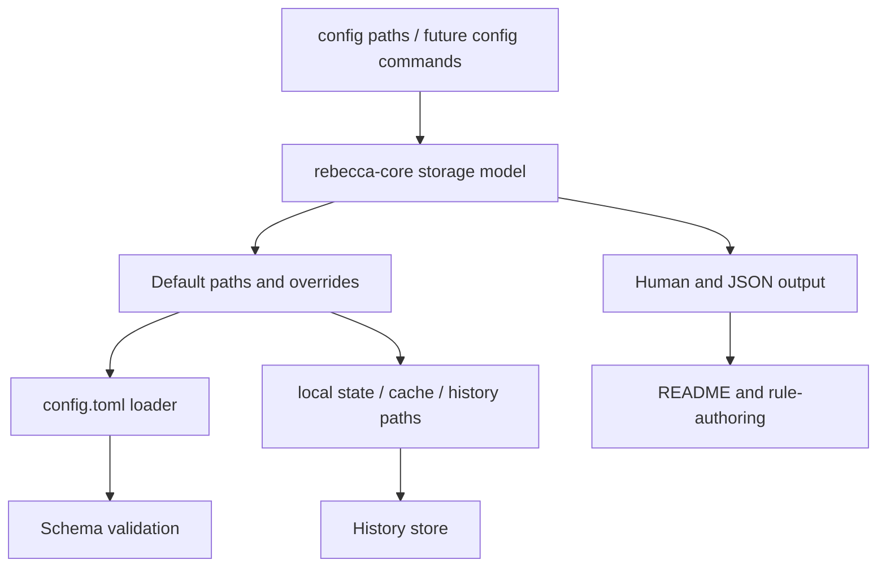

# refactor: Tighten configuration and state contracts

## Summary

Rebecca already has a local-state model and a CLI that prints paths, but the contract is still split across defaults, environment overrides, and renderer behavior. This plan makes configuration and state handling explicit, testable, and easier to extend without changing cleanup scope.

Mole is a useful reference for the posture here: conservative defaults, stable JSON surfaces for automation, and config-state boundaries that stay readable in one terminal screen. Rebecca should keep its own Windows-oriented storage layout and output text, while tightening the contract around it.

---

## Problem Frame

The current codebase can resolve config, state, cache, and history locations, but it does not yet treat those locations as a coherent contract. The next slice should make the storage model more deliberate so future work can add config parsing, cached scan data, or profile-specific behavior without revisiting the same boundary questions.

This is also the right moment to make the path display and override behavior predictable. Users should be able to see where Rebecca stores things, override those locations for tests or constrained environments, and get the same shape back from the CLI every time.

---

## Requirements

**Storage Contract**

- R1. Rebecca keeps separate roaming config and local state by default, with cache and history living under local state.
- R2. The storage model remains overrideable through explicit environment variables for tests and constrained environments.
- R3. `config paths` continues to expose the resolved locations in both human and JSON form.

**Configuration Loading**

- R4. Rebecca gains a real config-file loader for `config.toml`, with a stable schema and clear validation errors.
- R5. Missing config files remain a normal empty/default case, while malformed config files fail with a clear error that names the bad file or field.
- R6. Config parsing stays conservative about unknown keys and invalid values so future settings do not silently misconfigure cleanup behavior.

**State And History**

- R7. Local state paths remain explicit and predictable, including history and any future cache files.
- R8. History handling keeps the existing empty-file and corruption behavior while continuing to surface useful path context.

**CLI And Docs**

- R9. The CLI keeps a stable `config paths` contract and does not invent new storage modes in this slice.
- R10. README, rule-authoring guidance, and durable engineering state stay aligned with the storage contract and any new config schema.

---

## Key Technical Decisions

- KTD1. Keep storage resolution in `rebecca-core` so the CLI only renders resolved paths instead of reimplementing path selection.
- KTD2. Treat `config.toml` as the canonical user-editable config surface, not environment variables or ad hoc flags.
- KTD3. Keep environment overrides as test and escape-hatch mechanisms, not as a competing primary configuration system.
- KTD4. Preserve the current local-state layout unless a real config requirement forces a schema change, because path stability matters for docs and automation.
- KTD5. Use Mole's config-state split and readable history posture as a contract benchmark, but keep Rebecca's own Windows path layout and command names intact.

---

## High-Level Technical Design

The design keeps path resolution and config loading in the core, then lets the CLI render those decisions without recomputing them. That keeps tests focused on one contract instead of duplicating path logic across surfaces.

---

## Scope Boundaries

### In Scope

- Storage path resolution for config, state, cache, and history.
- `config.toml` loading and validation behavior.
- `config paths` human and JSON contract stability.
- Docs and durable-state alignment for the storage model.

### Deferred For Later

- A full user-editable settings surface beyond the base config file.
- Multiple config profiles or layered config precedence.
- A cache invalidation subsystem or scan-result cache format.
- Non-Windows storage layout changes.

### Outside This Product's Identity

- Replacing the Windows user-scoped storage model with a portable or cross-platform default.
- Hiding storage locations behind a new abstraction that makes the paths harder to inspect.
- Growing this into a generic preferences framework before the cleanup contract needs it.

---

## System-Wide Impact

This work affects configuration resolution, local-state layout, CLI rendering, and any future feature that wants to persist data beyond the current history log. It also sets the default posture for later settings work: explicit schema, explicit path layout, and explicit override points.

---

## Risks & Dependencies

- A real config loader can surface malformed user files, so error wording and fallback behavior need to stay clear.
- Path resolution changes can break tests or docs if the CLI and core diverge, so the core model should remain the single source of truth.
- Future cache or profile settings may want precedence rules, so the initial schema should stay narrow and conservative.

---

## Sources / Research

- `docs/adr/0008-configuration-and-local-state-model.md`
- `docs/knowledge/engineering/current-state.md`
- `docs/knowledge/engineering/log.md`
- `README.md`
- `crates/rebecca-core/src/config.rs`
- `crates/rebecca-cli/src/info.rs`
- `crates/rebecca-cli/src/main.rs`
- `crates/rebecca-cli/tests/cli_output.rs`
- `crates/rebecca-cli/tests/info.rs`
- `crates/rebecca-core/src/history.rs`
- `crates/rebecca-core/tests/history.rs`
- `repo-ref/Mole/README.md`
- `repo-ref/Mole/tests/history.bats`
- `repo-ref/Mole/tests/purge_config_paths.bats`
- `repo-ref/Mole/bin/clean.sh`

---

## Implementation Units

### U1. Formalize Storage Path Resolution

- **Goal:** Make the config, state, cache, and history path contract explicit and consistently resolved in core.
- **Files:** `crates/rebecca-core/src/config.rs`, `crates/rebecca-core/src/lib.rs`, `crates/rebecca-core/tests/config.rs`, `crates/rebecca-cli/src/info.rs`, `crates/rebecca-cli/tests/cli_output.rs`
- **Approach:** Keep the current Windows default layout, but turn it into a well-tested contract with clear override behavior and no duplicated path selection in the CLI.
- **Patterns to follow:** The existing `default_app_paths()` helper, the isolated CLI test harness, and Mole's config-path clarity posture.
- **Test scenarios:**
  - Happy path: the default app paths resolve to the expected config, state, cache, and history locations.
  - Edge case: explicit environment overrides replace the default directories without affecting unrelated paths.
  - Error path: missing user directories fail clearly instead of producing partial or inconsistent paths.
- **Verification:** Core and CLI tests agree on the same resolved storage layout.

### U2. Add Config File Loading And Validation

- **Goal:** Introduce a real `config.toml` loader with a narrow, explicit schema.
- **Files:** `crates/rebecca-core/src/config.rs`, `crates/rebecca-core/src/error.rs`, `crates/rebecca-core/tests/config.rs`, `crates/rebecca-cli/src/main.rs`, `crates/rebecca-cli/tests/info.rs`
- **Approach:** Parse `config.toml` from the resolved config directory, validate unknown keys and invalid values, and keep missing files as a normal empty/default case.
- **Patterns to follow:** `serde`-driven config parsing, the existing local-state model, and Mole's small config-file contract in `tests/purge_config_paths.bats`.
- **Test scenarios:**
  - Happy path: a valid config file loads and affects only the intended settings.
  - Edge case: a missing config file falls back to defaults without error.
  - Error path: malformed TOML or unknown keys reports a clear file-scoped failure.
  - Edge case: empty or comment-only config files behave like missing config.
- **Verification:** Config loading tests pin the schema and its fallback behavior.

### U3. Stabilize Config Paths CLI Coverage

- **Goal:** Keep `config paths` deterministic in human and JSON output while the storage contract evolves.
- **Files:** `crates/rebecca-cli/src/info.rs`, `crates/rebecca-cli/tests/cli_output.rs`, `crates/rebecca-cli/tests/info.rs`
- **Approach:** Render the resolved storage model from core and cover both parseable JSON and human text so the CLI output does not drift while config behavior changes.
- **Patterns to follow:** The current `config paths` implementation and Mole's stable JSON automation surfaces.
- **Test scenarios:**
  - Happy path: `config paths --json` remains parseable and includes every resolved location.
  - Edge case: the human output preserves the existing path labels and order.
  - Error path: config loading failures surface clearly through the CLI boundary.
- **Verification:** CLI contract tests stay green against the same path-shape expectations.

### U4. Align Docs And Durable State

- **Goal:** Keep README, rule-authoring guidance, and engineering memory aligned with the storage contract.
- **Files:** `README.md`, `docs/rule-authoring.md`, `docs/knowledge/engineering/current-state.md`
- **Approach:** Document the default storage layout, override points, and the new config-file boundary without broadening the user-facing surface.
- **Patterns to follow:** The current Local State section in `README.md` and the existing engineering-memory summary style.
- **Test scenarios:**
  - README path listings match the resolved defaults.
  - Rule-authoring guidance does not contradict the new config schema or storage layout.
  - Current-state reflects configuration and state work instead of the earlier contract slice.
- **Verification:** Docs and durable notes describe the same contract the code enforces.
