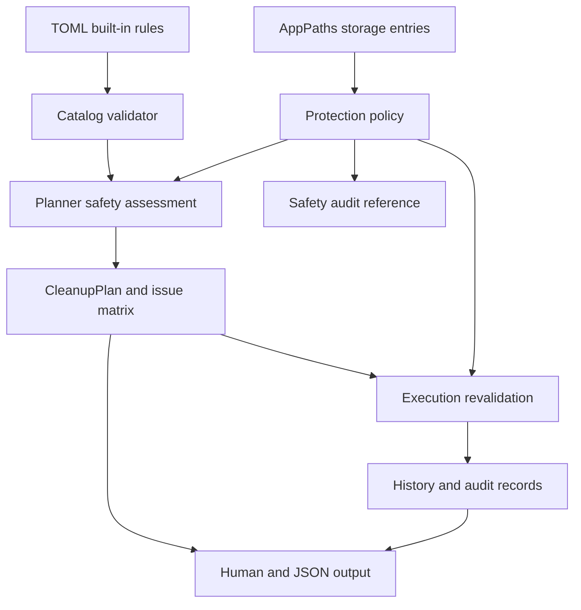

# refactor: Reach Mole-level cleanup safety governance

## Summary

Rebecca has strong Windows-first foundations: typed TOML rules, preview-first
cleanup planning, stable issue matrices, config/state ownership, and
Rebecca-owned storage protection. This plan turns the active long-term goal into
a phased roadmap for reaching Mole-like safety governance without copying Mole's
shell implementation or widening Rebecca into an unrelated product.

Mole is the maturity benchmark for posture: protected path categories,
allowlisted maintenance exceptions, destructive-operation revalidation, and a
living public safety audit. Rebecca should reach comparable safety and
maintainability for its Windows cleanup domain before broadening the rule
catalog aggressively.

---

## Problem Frame

Recent slices hardened catalog metadata, config schema versioning, scan-cache
contracts, cleanup issue matrices, and Rebecca-owned storage boundaries. The
remaining gap is that Rebecca's safety model is still narrower than Mole's:
`crates/rebecca-core/src/safety.rs` blocks roots, traversal, critical Windows
paths, user profile roots, and reparse-like paths, but it does not yet model
protected user-data categories, allowlisted maintenance subpaths, or execution
time revalidation as one shared contract.

That gap matters more as the rule catalog grows. A cleanup tool should fail
closed when a rule, path expansion, runtime mutation, or backend boundary becomes
ambiguous. The next work should therefore deepen the safety model before adding
many more cleanup families.

---

## Requirements

**Safety Boundary**

- R1. Rebecca must have a central Windows protection model that distinguishes
  never-delete roots, allowlisted maintenance subpaths, Rebecca-owned storage,
  and protected user-data categories.
- R2. The protected-category registry must cover sensitive Windows data families:
  credentials and password managers, VPN/proxy state, AI/coding tool durable
  state, browser history and cookies, cloud-synced data, container/VM runtime
  state, startup automation, and application durable data roots.
- R3. Cleanup execution must revalidate executable targets immediately before
  deletion and fail closed on traversal, reparse-like paths, protected roots,
  protected categories, or Rebecca-owned storage overlap.

**Rule Catalog Governance**

- R4. Built-in rules must remain typed TOML with Windows-scoped ids,
  project-owned provenance, restore hints, and target shapes validated against
  the central protection model.
- R5. New cleanup families must include planner coverage, CLI contract coverage,
  history/audit behavior, and documentation before they are considered complete.

**Audit And UX Contracts**

- R6. Dry-run remains the primary user contract, and machine-readable JSON
  changes remain additive unless a future contract version exists.
- R7. Human output and history must surface blocked/protected reason codes
  without storing file contents, credentials, tokens, or arbitrary user data.
- R8. Rebecca must gain a living safety audit document that explains the current
  destructive-operation boundaries, protected categories, execution controls,
  known limitations, and verification coverage.

**Mole-Parity Definition**

- R9. "Mole-like" means comparable safety posture, auditability, and
  maintainability for Windows-first cleanup; it does not require Mole feature
  parity for uninstall, optimize, disk mapping, sudo workflows, or macOS
  package/release surfaces.

---

## Key Technical Decisions

- KTD1. Benchmark Mole by safety posture, not implementation: use
  `repo-ref/Mole/SECURITY.md` and `repo-ref/Mole/SECURITY_AUDIT.md` as design
  references while keeping Rebecca's Rust, TOML, and Windows-first architecture.
- KTD2. Put protection policy in `rebecca-core`, not in CLI renderers or rule
  files, so planning, execution, history, and docs all describe one contract.
- KTD3. Treat execution revalidation as mandatory even when planning already
  accepted a target; runtime state can change between scan and deletion.
- KTD4. Gate catalog expansion behind safety governance. New rules should be
  cheap to add only after the protection model makes unsafe target shapes hard
  to express.
- KTD5. Keep audit data privacy-limited. Reason codes, paths, byte counts, and
  restore hints are useful; file contents and secret-like data do not belong in
  history or scan-cache records.

---

## High-Level Technical Design

The shared protection policy becomes the authority for destructive-operation
eligibility. Rule files describe intended cleanup targets; the planner projects
those targets into a cleanup plan; the executor rechecks the same safety
contract before the backend touches the filesystem.

---

## Phased Delivery

1. Establish the safety audit baseline and parity criteria.
2. Deepen the core protected-path and protected-category model.
3. Wire that model into planning, issue matrices, and catalog validation.
4. Revalidate executable targets at the execution boundary.
5. Expand rules only after the guardrails and audit surfaces are in place.

---

## Scope Boundaries

### In Scope

- Windows-first protected roots, allowlisted maintenance paths, protected
  categories, and Rebecca-owned storage boundaries.
- Planner, executor, rule catalog, CLI, history, and documentation alignment
  around that protection model.
- Safety-audit documentation and regression coverage for high-risk path
  categories.
- Conservative cleanup-rule expansion after the guardrails exist.

### Deferred To Follow-Up Work

- Release artifact attestations, installer integrity, and package distribution
  hardening.
- Cross-platform cleanup support.
- Broader application discovery beyond the rule families needed for the next
  Windows cleanup batches.

### Outside This Product's Identity

- Copying GPL code, Mole shell helpers, or Mole rule definitions into Rebecca.
- Uninstall flows, optimize flows, disk-map tooling, sudo/elevation workflows,
  or aggressive orphan-data cleanup in this roadmap.
- Deleting user-durable data because a path matches a broad cache-looking
  pattern.

---

## System-Wide Impact

This plan affects the central cleanup contract. The policy model will shape
rule authoring, path expansion, planner decisions, execution behavior, history
records, CLI output, and future documentation. It also changes the default
engineering posture: a new rule family is not complete until its destructive
boundary is explainable in the safety audit and pinned by tests.

---

## Success Metrics

- No executable cleanup target reaches the Windows backend unless the shared
  protection policy allows it at execution time.
- Every protected root and protected category has planner-level and
  execution-level regression coverage.
- The built-in rule catalog rejects target shapes that overlap protected
  categories unless they are explicit allowlisted maintenance targets.
- `docs/security-audit.md` accurately describes the current protection model,
  known limitations, and verification coverage.
- Existing `clean`, `scan`, `history`, `cache purge`, and `config paths`
  contracts remain additive and backwards-compatible for current JSON fields.

---

## Risks & Dependencies

- Overblocking can reduce usefulness. Mitigate this with explicit reason codes,
  narrow allowlisted maintenance subpaths, and clear human output.
- Windows protected categories are not one-to-one translations of Mole's macOS
  categories. Use Mole as a conceptual benchmark and map categories to Windows
  data locations deliberately.
- Planner and executor checks can drift if they duplicate logic. Mitigate this
  by sharing one core policy API.
- Catalog expansion can outrun safety if rule additions are treated as simple
  TOML work. Mitigate this by requiring rule tests, CLI tests, and audit updates
  for every new cleanup family.
- History and scan-cache surfaces can accidentally become privacy sinks.
  Mitigate this by reviewing every persisted field against the privacy boundary.

---

## Sources / Research

- `repo-ref/Mole/SECURITY.md`
- `repo-ref/Mole/SECURITY_AUDIT.md`
- `docs/configuration.md`
- `docs/rule-authoring.md`
- `docs/plans/2026-06-24-003-refactor-cleanup-contract-governance-plan.md`
- `docs/plans/2026-06-24-004-refactor-configuration-and-state-contracts-plan.md`
- `docs/plans/2026-06-24-017-feat-cleanup-plan-issue-matrix-plan.md`
- `crates/rebecca-core/src/safety.rs`
- `crates/rebecca-core/src/planner.rs`
- `crates/rebecca-core/src/executor.rs`
- `crates/rebecca-core/src/config.rs`
- `crates/rebecca-core/src/history.rs`
- `crates/rebecca-core/src/plan.rs`
- `crates/rebecca-rules/src/lib.rs`
- `crates/rebecca-windows/src/lib.rs`

---

## Implementation Units

### U1. Establish Rebecca Safety Audit Baseline

- **Goal:** Create the living safety audit surface and define the Mole-parity
  checklist for Rebecca's Windows cleanup scope.
- **Requirements:** R8, R9
- **Dependencies:** None
- **Files:** `docs/security-audit.md`, `docs/configuration.md`,
  `docs/rule-authoring.md`, `docs/knowledge/engineering/current-state.md`
- **Approach:** Document current protections, current gaps, known limitations,
  and the explicit boundary between Mole-inspired posture and Rebecca-owned
  implementation. Keep the audit grounded in current code paths rather than
  aspirational behavior.
- **Patterns to follow:** `repo-ref/Mole/SECURITY_AUDIT.md`,
  `docs/configuration.md`, and the existing ADR style under `docs/adr/`.
- **Test scenarios:** Test expectation: none -- this unit creates and aligns
  documentation, but links and claims should be checked against the cited files.
- **Verification:** A new reader can understand what Rebecca protects today,
  what is still planned, and why Mole is a benchmark rather than a source to
  copy.

### U2. Build The Core Protection Policy

- **Goal:** Replace the narrow hardcoded path checks with a structured protection
  model for Windows roots, allowlisted maintenance paths, Rebecca storage, and
  protected user-data categories.
- **Requirements:** R1, R2, R7
- **Dependencies:** U1
- **Files:** `crates/rebecca-core/src/safety.rs`,
  `crates/rebecca-core/src/protection.rs`, `crates/rebecca-core/src/lib.rs`,
  `crates/rebecca-core/tests/safety_policy.rs`
- **Approach:** Introduce a reusable policy type that returns machine-stable
  classifications and human-readable explanations. Preserve current behavior
  for roots, critical Windows paths, user profile roots, traversal, and
  reparse-like paths while adding protected categories and explicit maintenance
  allowlists.
- **Execution note:** Start with characterization tests for the current
  `assess_path` behavior before moving logic behind the new policy.
- **Patterns to follow:** The existing `PathDisposition` shape, Mole's protected
  prefix and protected-category audit sections, and
  `AppPaths::storage_entries()` lifecycle metadata.
- **Test scenarios:**
  - A drive root, `C:\Windows`, `C:\Program Files`, `C:\ProgramData`, and a user
    profile root remain blocked with stable classifications.
  - A normal cache directory under `%LOCALAPPDATA%` remains allowed when it does
    not overlap a protected category.
  - Credential stores, browser history/cookie files, cloud sync roots, startup
    automation, and AI/coding tool durable-state roots are blocked.
  - Allowlisted maintenance subpaths are allowed only when the path matches the
    narrow intended target, not the parent protected root.
  - Case differences, slash style differences, trailing separators, and path
    traversal segments do not bypass protection.
- **Verification:** Core safety tests prove the policy is stricter than the
  current model without regressing existing allowed cache paths.

### U3. Wire Protection Policy Into Planning

- **Goal:** Make cleanup plans use the shared protection policy and expose
  protected-path results through stable issue reasons.
- **Requirements:** R1, R2, R4, R6, R7
- **Dependencies:** U2
- **Files:** `crates/rebecca-core/src/planner.rs`,
  `crates/rebecca-core/src/plan.rs`, `crates/rebecca-core/tests/planner.rs`,
  `crates/rebecca-core/tests/model_contract.rs`,
  `crates/rebecca-cli/tests/cli_clean.rs`,
  `crates/rebecca-cli/tests/cli_history.rs`
- **Approach:** Replace planner-local safety calls with the shared policy,
  preserve Rebecca-owned storage overlap blocking, and add stable reason-code
  coverage for protected roots, protected categories, and protected storage.
  Keep JSON changes additive.
- **Patterns to follow:** The existing cleanup issue matrix introduced in
  `docs/plans/2026-06-24-017-feat-cleanup-plan-issue-matrix-plan.md`.
- **Test scenarios:**
  - A rule expanding to a protected root is blocked during planning and appears
    in the issue matrix.
  - A rule expanding to a protected category is blocked with a category-specific
    reason code and readable human reason.
  - A rule expanding to Rebecca-owned config, state, history, or cache paths
    remains blocked.
  - Legacy plan/history JSON without the new protection fields still
    deserializes.
  - Human `clean --dry-run` and `history` output surface the grouped protected
    issue reasons without hiding detailed target reasons.
- **Verification:** Planner, model-contract, and CLI tests agree on the same
  protected issue semantics.

### U4. Add Execution-Time Revalidation

- **Goal:** Prevent stale cleanup plans from deleting targets that become unsafe
  after planning.
- **Requirements:** R3, R6, R7
- **Dependencies:** U2, U3
- **Files:** `crates/rebecca-core/src/executor.rs`,
  `crates/rebecca-core/src/safety.rs`,
  `crates/rebecca-core/src/protection.rs`,
  `crates/rebecca-core/tests/executor_contract.rs`,
  `crates/rebecca-windows/src/lib.rs`,
  `crates/rebecca-windows/tests/recycle_bin.rs`
- **Approach:** Reassess each executable target immediately before calling the
  backend. Convert unsafe targets to blocked or failed issue states without
  invoking deletion. Keep dry-run behavior unchanged because dry-run has no
  backend execution boundary.
- **Patterns to follow:** Mole's destructive-operation revalidation posture and
  the existing `CleanupBackend` seam in `crates/rebecca-core/src/executor.rs`.
- **Test scenarios:**
  - An allowed target that becomes a reparse-like path before execution is not
    passed to the backend.
  - An allowed target whose path now overlaps protected storage is blocked
    before execution.
  - Backend failures remain `execution-failed` and are not confused with policy
    blocks.
  - Dry-run still recomputes summaries without backend calls.
  - Windows backend tests continue to prove directory targets preserve the
    target directory while moving direct children.
- **Verification:** Executor tests prove backend calls happen only after the
  revalidation gate allows the target.

### U5. Validate Catalog Target Shapes Against Protection Policy

- **Goal:** Make unsafe built-in rule targets fail at catalog load time rather
  than waiting for runtime planning.
- **Requirements:** R2, R4, R5
- **Dependencies:** U2, U3
- **Files:** `crates/rebecca-rules/src/lib.rs`,
  `crates/rebecca-rules/rules/windows/*.toml`,
  `crates/rebecca-core/src/discovery.rs`,
  `crates/rebecca-core/tests/path_templates.rs`,
  `docs/rule-authoring.md`
- **Approach:** Extend built-in catalog validation so static target shapes and
  discovery-relative targets cannot point at protected categories unless a
  narrow maintenance allowlist explicitly permits them. Keep dynamic checks in
  planning and execution because environment expansion can still change the
  final path.
- **Patterns to follow:** The existing built-in-only governance checks for
  Windows platform, `windows.` ids, restore hints, and project-owned
  provenance.
- **Test scenarios:**
  - A synthetic built-in rule targeting a credential store is rejected.
  - A synthetic browser rule targeting `History`, `Cookies`, `Local Storage`,
    `IndexedDB`, `Service Worker`, or a browser profile root is rejected.
  - Steam install/library targets that point at `userdata`, `steamapps\common`,
    workshop content, or unlisted metadata are rejected.
  - Current built-in rules still load after the policy is introduced.
  - Dynamic discovery paths are still rechecked at planning and execution time.
- **Verification:** Catalog tests make unsafe target shapes unrepresentable for
  built-in rules while preserving the existing safe catalog.

### U6. Preserve Protected Results In History And Output

- **Goal:** Make blocked/protected outcomes auditable across dry-run, execution,
  and history replay without persisting sensitive content.
- **Requirements:** R6, R7, R8
- **Dependencies:** U3, U4
- **Files:** `crates/rebecca-core/src/history.rs`,
  `crates/rebecca-core/src/plan.rs`,
  `crates/rebecca-core/tests/history.rs`,
  `crates/rebecca-cli/src/clean.rs`,
  `crates/rebecca-cli/src/history.rs`,
  `crates/rebecca-cli/tests/cli_clean.rs`,
  `crates/rebecca-cli/tests/cli_history.rs`,
  `docs/security-audit.md`
- **Approach:** Ensure protected reason codes survive serialization, execution
  updates, and history replay. Keep raw human reasons concise and path-scoped,
  and document which fields are safe to persist.
- **Patterns to follow:** The existing additive issue-matrix JSON contract and
  the privacy boundary in `docs/configuration.md`.
- **Test scenarios:**
  - A protected-category block round-trips through plan JSON and history JSONL.
  - Human history output groups protected blocks in the issue matrix.
  - JSON history includes reason codes as additive fields and keeps older
    history records compatible.
  - Protected output does not serialize file contents or discovered child-file
    lists.
- **Verification:** History and CLI tests prove audit visibility without
  expanding persisted sensitive data.

### U7. Expand Rules Only Behind The Guardrails

- **Goal:** Resume cleanup-rule growth after the protection model, revalidation,
  and audit surfaces are in place.
- **Requirements:** R4, R5, R8, R9
- **Dependencies:** U1, U2, U3, U4, U5, U6
- **Files:** `crates/rebecca-rules/rules/windows/*.toml`,
  `crates/rebecca-rules/src/lib.rs`, `crates/rebecca-core/tests/planner.rs`,
  `crates/rebecca-cli/tests/cli_scan.rs`,
  `crates/rebecca-cli/tests/cli_clean.rs`, `README.md`,
  `docs/rule-authoring.md`, `docs/security-audit.md`
- **Approach:** Add conservative Windows cleanup families in small batches,
  prioritizing rebuildable caches and logs with obvious restore behavior. Each
  batch must update rule authoring guidance and the safety audit when it adds a
  new protected boundary or category.
- **Patterns to follow:** Existing browser, Electron, Cargo, JetBrains, and
  Steam rule tests; Mole's preference for bounded cleanup over aggressive orphan
  cleanup.
- **Test scenarios:**
  - Every new rule appears in `scan`, dry-run JSON, and human dry-run output.
  - Every new rule has planner fixtures for allowed targets and known unsafe
    near-misses.
  - Moderate or risky rules remain skipped without the matching opt-in.
  - New families do not add roots, durable app data, credentials, history,
    cookies, synced data, or runtime images as cleanup targets.
- **Verification:** Rule expansion is blocked unless tests and docs prove the
  new family respects the central protection model.

### U8. Run The Mole-Parity Completion Review

- **Goal:** Decide whether Rebecca has reached the intended Mole-like safety
  maturity for Windows-first cleanup.
- **Requirements:** R8, R9
- **Dependencies:** U1, U2, U3, U4, U5, U6, U7
- **Files:** `docs/security-audit.md`,
  `docs/plans/2026-06-24-018-refactor-mole-parity-safety-governance-plan.md`,
  `docs/knowledge/engineering/current-state.md`,
  `docs/knowledge/engineering/log.md`
- **Approach:** Compare Rebecca's implemented safeguards against the parity
  definition in this plan and Mole's audit categories. Record remaining gaps as
  explicit follow-up plans instead of leaving them as vague "hardening" work.
- **Patterns to follow:** The current-state memory shape and the safety audit
  structure from U1.
- **Test scenarios:** Test expectation: none -- this is a review and
  documentation unit, but it must cite the implemented tests and docs that prove
  the final posture.
- **Verification:** The active long-term goal has a defensible completion
  standard, and any unfinished work is split into new bounded plans.
