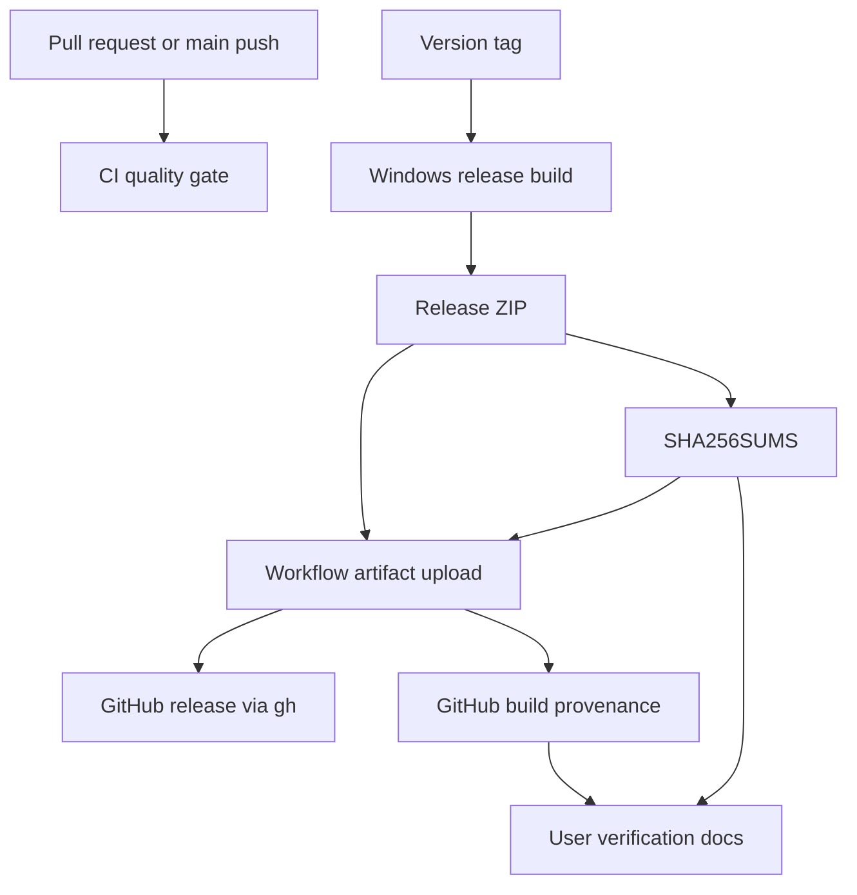

# feat: Add release integrity and distribution hardening

## Summary

Rebecca has reached a Mole-like cleanup safety posture for its Windows-first
domain. This plan adds the missing distribution-layer trust path: repeatable CI,
release artifacts, SHA-256 checksums, GitHub build-provenance attestations, and
operator-facing verification guidance.

The first implementation should stay small and auditable. Rebecca should use
GitHub-hosted release infrastructure and plain PowerShell release scripts before
adopting a larger generator such as cargo-dist or package-manager automation.

---

## Problem Frame

The previous Mole-parity review closed the cleanup-system goal and left release
artifact attestations and installer integrity as future work. That gap matters
because Rebecca is a destructive local cleanup tool: users need to trust not
only the planner and executor, but also the binary they download and the path
that produced it.

Mole is the benchmark for release posture: published checksums, build
provenance, and install-time verification hooks. Rebecca should mirror that
security intent in a Windows/Rust shape rather than copying Mole's macOS shell
installer design.

---

## Requirements

**CI Quality Gate**

- R1. Pull requests and main-branch pushes must run formatting, linting, and
  workspace tests with read-only repository permissions.
- R2. The CI workflow must be useful before formal releases exist and must not
  require maintainer secrets for normal validation.

**Release Artifacts**

- R3. Tag-triggered releases must build a Windows CLI artifact from the Rust
  workspace using locked dependencies.
- R4. Release artifacts must include a machine-checkable `SHA256SUMS` file.
- R5. Release publishing must avoid third-party release actions when the GitHub
  CLI can create the release directly.

**Provenance And Verification**

- R6. Release artifacts must receive GitHub build-provenance attestations with
  `id-token`, `contents`, and `attestations` permissions scoped to the release
  job.
- R7. Documentation must show users how to verify checksums and build
  provenance, including the stricter self-hosted-runner denial path.
- R8. Attestation absence must be documented as a distribution integrity issue,
  not as a cleanup-system safety issue.

**Documentation And Scope**

- R9. README, security policy, and the safety audit must point to the release
  integrity workflow without claiming package-manager support that does not
  exist.
- R10. Package-manager publishing, auto-update, installer UX, SBOM generation,
  and cross-platform release artifacts must remain follow-up work unless this
  slice needs them for a working GitHub release.

---

## Key Technical Decisions

- KTD1. Use first-party GitHub release primitives first: GitHub-hosted runners,
  `actions/checkout`, `actions/upload-artifact`, `actions/download-artifact`,
  `actions/attest`, and `gh release create` cover the current need with a small
  trust surface.
- KTD2. Keep release scripting in PowerShell because Rebecca is Windows-first
  and the scripts need to be runnable locally by the same maintainers who test
  Windows cleanup behavior.
- KTD3. Build one Windows x86_64 MSVC artifact first. ARM64 Windows and
  non-Windows targets are valuable, but they should not block the first
  integrity chain.
- KTD4. Generate checksums from the final packaged artifact, not intermediate
  binaries, so the checksum file matches what users download.
- KTD5. Treat installer verification as a documented verification path in this
  slice. A richer installer can later reuse the same checksum and attestation
  contract.

---

## High-Level Technical Design

CI and release workflows are intentionally separate. Normal validation should
stay cheap and secret-free, while release publishing gets the narrower
permissions needed for attestations and GitHub Releases.

---

## Scope Boundaries

### In Scope

- GitHub Actions CI for format, lint, and tests.
- Tag-triggered Windows x86_64 release packaging.
- PowerShell release scripts for packaging and checksum generation.
- GitHub build-provenance attestations for release artifacts.
- Documentation for checksum and attestation verification.

### Deferred To Follow-Up Work

- Native installer, update command, or `winget`/Scoop/Homebrew publishing.
- SBOM generation and dependency provenance beyond GitHub build attestations.
- Windows ARM64 and non-Windows release artifacts.
- Fully pinned action SHAs and automated dependency update workflow.

### Outside This Product's Identity

- Copying Mole's shell installer or Homebrew release automation.
- Claiming release trust for artifacts built outside the documented workflow.
- Treating checksum-only verification as equivalent to build provenance.

---

## System-Wide Impact

This plan adds repository-level delivery infrastructure rather than cleanup
runtime behavior. It changes how Rebecca is validated and distributed, and it
extends the public security story from destructive-operation safety into release
trust. It should not change CLI command behavior, cleanup rules, history
formats, or scan-cache contracts.

---

## Risks & Dependencies

- GitHub Actions API and action versions can evolve. Use official documentation
  as the source of truth and keep release scripts small enough to audit.
- GitHub-hosted Windows runners may have toolchain changes. The workflow should
  show Rust versions and use locked Cargo dependencies.
- Checksums prove artifact integrity, not origin. Mitigate this by publishing
  build-provenance attestations and documenting `gh attestation verify`.
- A tag-triggered release workflow can publish a bad artifact if the tag points
  at unreviewed code. Branch and tag protection remain repository settings
  outside the codebase.
- First-party actions are still external code. Fully pinned SHAs can be added
  after the first working pipeline proves the release shape.

---

## Acceptance Examples

- AE1. Given a pull request, when GitHub Actions runs, then formatting, clippy,
  and workspace tests run without release permissions or repository secrets.
- AE2. Given a tag such as `v0.1.0`, when the release workflow runs, then it
  creates a Windows x86_64 ZIP and `SHA256SUMS` from locked dependencies.
- AE3. Given release artifacts, when the attestation step runs, then GitHub
  records build provenance for the downloadable artifacts.
- AE4. Given a downloaded ZIP and `SHA256SUMS`, when a user follows
  `docs/release.md`, then they can verify the checksum locally and verify
  provenance with `gh attestation verify` when authenticated GitHub CLI is
  available.

---

## Implementation Units

### U1. Add CI Quality Gate

- **Goal:** Add a secret-free workflow for pull requests and main pushes.
- **Requirements:** R1, R2
- **Files:** `.github/workflows/ci.yml`, `README.md`
- **Approach:** Run `cargo fmt --all -- --check`, `cargo clippy --workspace
  --all-targets -- -D warnings`, and workspace tests under read-only
  permissions. Keep the workflow Windows-first because Rebecca's backend and
  most integration behavior target Windows.
- **Patterns to follow:** Mole's read-only `check.yml` permission posture and
  Rebecca's existing development command block in `README.md`.
- **Test scenarios:**
  - The workflow has `contents: read` permissions.
  - It does not require secrets.
  - The command list matches local development guidance.
- **Verification:** `git diff --check` plus local format/test commands prove the
  repository still validates before CI executes remotely.

### U2. Add Release Packaging Scripts

- **Goal:** Create local and CI-usable PowerShell scripts that package the final
  Windows binary and generate `SHA256SUMS`.
- **Requirements:** R3, R4
- **Files:** `scripts/release/build-release.ps1`,
  `scripts/release/write-checksums.ps1`, `docs/release.md`
- **Approach:** Build `rebecca-cli` with `cargo build --release --locked`,
  stage the binary with README and security docs, compress the staged directory,
  and generate sorted SHA-256 entries for final release assets.
- **Patterns to follow:** Mole's checksum-first release posture, adapted to
  PowerShell and Windows ZIP artifacts.
- **Test scenarios:**
  - Packaging fails if the expected binary is absent.
  - The ZIP artifact name includes the version and Windows target.
  - `SHA256SUMS` excludes itself and includes every downloadable artifact.
  - Re-running the checksum script overwrites stale checksum output.
- **Verification:** Run the scripts locally against a release build and inspect
  the generated ZIP and checksum file.

### U3. Add Tag-Triggered Release Workflow

- **Goal:** Publish GitHub Releases with release artifacts, checksums, and build
  provenance.
- **Requirements:** R3, R4, R5, R6
- **Files:** `.github/workflows/release.yml`, `docs/release.md`
- **Approach:** Build on `windows-latest`, upload artifacts, then publish from a
  narrow-permission Ubuntu job using `gh release create`. Use `actions/attest`
  after artifacts are available so release ZIPs and checksums receive build
  provenance.
- **Patterns to follow:** Mole's separation between build and publish jobs, and
  GitHub's artifact-attestation permission model.
- **Test scenarios:**
  - The release workflow triggers only on version tags.
  - The build job can only read repository contents.
  - The publish job has `contents: write`, `id-token: write`, and
    `attestations: write`.
  - The release step publishes only files under the downloaded release artifact
    directory.
- **Verification:** YAML structure review and local script smoke tests cover the
  static contract before the first real tag run.

### U4. Document User Verification And Security Posture

- **Goal:** Make release trust understandable to users and future maintainers.
- **Requirements:** R7, R8, R9
- **Files:** `docs/release.md`, `README.md`, `SECURITY.md`,
  `docs/security-audit.md`
- **Approach:** Add checksum verification and `gh attestation verify` examples,
  explain what each signal proves, and keep package-manager claims deferred.
- **Patterns to follow:** Mole's public security audit release-integrity
  section and Rebecca's existing security-reporting language.
- **Test scenarios:**
  - Documentation distinguishes checksum integrity from build provenance.
  - Commands use the current artifact names and do not require unsupported
    package managers.
  - Security docs classify release/install trust issues as reportable security
    issues.
- **Verification:** Documentation links resolve, and the release guide matches
  the workflow artifact names.

### U5. Prepare Follow-Up Distribution Work

- **Goal:** Leave clear hooks for installer and package-manager work without
  forcing those decisions into this slice.
- **Requirements:** R10
- **Files:** `docs/release.md`,
  `docs/knowledge/engineering/current-state.md`,
  `docs/knowledge/engineering/log.md`
- **Approach:** Record remaining distribution work as explicit follow-up
  options: installer, strict install-time attestation policy, package-manager
  manifests, SBOM, and multi-target artifacts.
- **Patterns to follow:** The Mole-parity completion review's habit of closing
  one objective and splitting future work into bounded plans.
- **Test scenarios:** Test expectation: none -- this unit is planning and
  documentation continuity, but claims must cite the implemented workflow and
  release guide.
- **Verification:** Future agents can identify the next distribution slice
  without reopening cleanup-safety work.

---

## Sources / Research

- `repo-ref/mole/.github/workflows/release.yml`
- `repo-ref/mole/SECURITY.md`
- `repo-ref/mole/SECURITY_AUDIT.md`
- `repo-ref/mole/install.sh`
- `repo-ref/mole/tests/install_checksum.bats`
- `docs/knowledge/engineering/verification/2026-06-24-mole-parity-completion-review.md`
- `docs/security-audit.md`
- `README.md`
- GitHub Docs, "Using artifact attestations to establish provenance for builds"
- GitHub `actions/attest` usage documentation
- GitHub CLI manual, `gh attestation verify`
