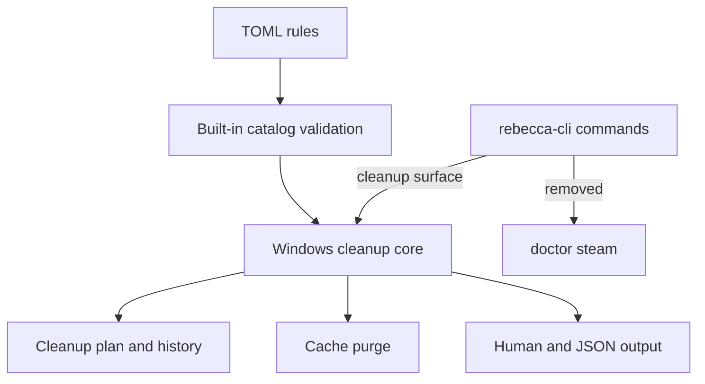

# refactor: Shrink Rebecca to the Windows cleanup core

## Summary

Rebecca already has the core Windows cleanup flow. This plan removes dead model branches, trims non-core command surfaces, and deletes stale rule metadata so the product reads like one focused cleanup tool instead of a partial cross-platform abstraction.

The refactor keeps inspection, cleanup, history, and Rebecca-owned cache management intact. It removes code that no longer carries user value and tightens docs and tests to the smaller shipped surface.

---

## Problem Frame

The workspace still carries scaffolding from broader ambitions: cross-platform variants, permanent-delete branches, unused rule metadata, and a standalone Steam doctor command. Some of that code is only reachable through tests or dead branches, which makes the shipped product harder to understand than it needs to be.

Mole is a useful benchmark here, but only as a reminder to stay focused. Rebecca should keep the Windows cleanup core, and stop pretending that unfinished or unused paths are part of the contract.

---

## Requirements

**Core model**

- R1. The core model exposes only the Windows-first cleanup semantics Rebecca actually uses.
- R2. Dead variants and constructors are removed from the model, including `DeleteMode::Permanent`, `DeletePolicy`, `RuleSource::UserDefined`, `Platform::Linux`, `Platform::Macos`, `Platform::current`, `PlanRequest::new`, and `CleanupPlan::new`.
- R3. Call sites construct cleanup requests explicitly for Windows instead of inferring a current platform.

**CLI surface**

- R4. The user-facing command surface keeps the cleanup-focused commands and `doctor permissions`, and removes the standalone Steam doctor command.
- R5. Help text, command routing, and docs stop advertising removed commands or removed modes.

**Rule catalog**

- R6. Built-in rule TOML no longer carries dead catalog metadata such as `delete_policy`.
- R7. Rule provenance and restore hints stay required, and the built-in catalog still validates at load time.

**Dependencies and cleanup**

- R8. Workspace dependencies and helper crates that are no longer used by retained code are pruned.
- R9. Existing cleanup, history, cache-purge, and scan behavior remain functionally intact after the shrink.

**Documentation and tests**

- R10. `README.md`, rule-authoring guidance, and command examples match the smaller shipped surface.
- R11. Regression tests pin the removed command surface, the simplified model, and the preserved cleanup contracts.

---

## Acceptance Examples

- A `rebecca --help` run shows the retained cleanup commands and omits `doctor steam`.
- A built-in rule file without `delete_policy` still loads, and stale embedded fixtures with the old field fail fast.
- A Steam cache rule still resolves during cleanup planning even though the standalone Steam doctor command is gone.

---

## Key Technical Decisions

- KTD1. Treat Windows-only cleanup as the product identity, so cross-platform branches are deleted instead of preserved as dormant variants.
- KTD2. Remove unused abstractions rather than wrapping them in compatibility shims; the goal is to reduce the number of concepts Rebecca exposes.
- KTD3. Keep Steam discovery as an internal capability for cleanup rules, but remove the standalone doctor command because it is not part of the cleanup workflow.
- KTD4. Remove dead rule metadata from the TOML contract, and keep only fields that affect shipped behavior or auditability.
- KTD5. Prune dependencies only when no retained code path needs them, so the workspace gets smaller without accidental breakage.

---

## High-Level Technical Design

The CLI keeps only commands that feed cleanup, inspection, or Rebecca-owned cache management. Internal Steam discovery stays available to the planner, but the standalone diagnostic entry point disappears.

---

## Scope Boundaries

### In Scope

- Model simplification for the shipped cleanup semantics.
- Removal of `doctor steam`.
- Removal of dead catalog metadata and dead mode branches.
- Dependency pruning and doc/test alignment.

### Deferred For Later

- New cleanup families.
- Reintroducing broad platform abstractions.
- Replacing scan-cache or cache-purge with new storage systems.

### Outside This Product's Identity

- Keeping dead branches around as future placeholders.
- Preserving command surfaces that do not support cleanup, inspection, or Rebecca-owned cache management.
- Adding compatibility shims for deleted abstractions.

---

## System-Wide Impact

This refactor touches the core request model, CLI routing, rule loading, docs, and multiple test suites. It also changes the public help surface, so command snapshots and README examples need to move with the code.

---

## Risks & Dependencies

- Removing model variants can ripple through constructors and tests, so the migration should happen in one coherent pass.
- Dropping `delete_policy` from the rule catalog will fail any stale fixtures or docs that still render it.
- Pruning workspace dependencies can expose hidden usage, so manifest cleanup should follow code removal rather than lead it.
- Removing `doctor steam` must not affect the internal Steam discovery path used by cleanup planning.

---

## Sources / Research

- `repo-ref/Mole/README.md`
- `repo-ref/Mole/AGENTS.md`
- `crates/rebecca-cli/src/main.rs`
- `crates/rebecca-cli/src/info.rs`
- `crates/rebecca-cli/src/output.rs`
- `crates/rebecca-cli/src/clean_view.rs`
- `crates/rebecca-core/src/model.rs`
- `crates/rebecca-core/src/plan.rs`
- `crates/rebecca-core/src/executor.rs`
- `crates/rebecca-rules/src/lib.rs`
- `crates/rebecca-rules/rules/windows/*.toml`
- `crates/rebecca-windows/src/lib.rs`
- `crates/rebecca-windows/src/steam.rs`
- `README.md`
- `docs/rule-authoring.md`
- `crates/rebecca-cli/tests/cli_scan.rs`
- `crates/rebecca-cli/tests/cli_clean.rs`
- `crates/rebecca-cli/tests/cli_history.rs`
- `crates/rebecca-cli/tests/cli_output.rs`
- `crates/rebecca-core/tests/model_contract.rs`
- `crates/rebecca-core/tests/planner.rs`
- `crates/rebecca-core/tests/executor_contract.rs`
- `crates/rebecca-core/tests/discovery.rs`
- `crates/rebecca-windows/tests/recycle_bin.rs`

---

## Implementation Units

### U1. Collapse The Core Model

- **Goal:** Remove dead modes and constructors from the shared request and plan model.
- **Requirements:** R1, R2, R3
- **Files:** `crates/rebecca-core/src/model.rs`, `crates/rebecca-core/src/plan.rs`, `crates/rebecca-core/src/executor.rs`, `crates/rebecca-core/src/lib.rs`, `crates/rebecca-core/tests/model_contract.rs`, `crates/rebecca-core/tests/executor_contract.rs`
- **Approach:** Delete `DeleteMode::Permanent`, `DeletePolicy`, `RuleSource::UserDefined`, `Platform::Linux`, `Platform::Macos`, `Platform::current`, `PlanRequest::new`, and `CleanupPlan::new`. Keep the remaining Windows cleanup semantics explicit at construction sites, and simplify any labels or helper paths that only existed to support the deleted branches.
- **Patterns to follow:** Existing explicit `PlanRequest::for_platform(Platform::Windows, ...)` call sites and the current cleanup summary shape.
- **Test scenarios:**
  - Retained model variants still serialize and deserialize cleanly.
  - Windows cleanup requests are built explicitly instead of via `Platform::current()`.
  - Executor and planner tests still pass with the simplified constructors.
- **Verification:** Core tests prove the reduced model still supports the shipped cleanup flow.

### U2. Contract The CLI Surface

- **Goal:** Remove the standalone Steam doctor command and align user-facing help with the smaller product.
- **Requirements:** R4, R5, R9, R11
- **Files:** `crates/rebecca-cli/src/main.rs`, `crates/rebecca-cli/src/info.rs`, `crates/rebecca-cli/src/output.rs`, `crates/rebecca-cli/src/clean_view.rs`, `crates/rebecca-cli/tests/cli_output.rs`, `crates/rebecca-cli/tests/cli_clean.rs`, `README.md`
- **Approach:** Delete the `doctor steam` routing and any user-facing text that advertises it. Keep Steam discovery as an internal planning capability for cleanup rules, and keep `doctor permissions` and the cleanup commands intact.
- **Patterns to follow:** The current command routing in `main.rs`, the permission probe in `info.rs`, and the existing help/output style used by the cleanup commands.
- **Test scenarios:**
  - `--help` output no longer advertises `doctor steam`.
  - `doctor permissions` still routes and prints a privilege level.
  - Cleanup and history commands still parse and render as before.
- **Verification:** CLI contract tests prove the user-visible surface is smaller without breaking the retained commands.

### U3. Strip Dead Rule Metadata And Prune Manifests

- **Goal:** Remove rule metadata and dependencies that no longer support retained behavior.
- **Requirements:** R6, R7, R8
- **Files:** `crates/rebecca-rules/src/lib.rs`, `crates/rebecca-rules/rules/windows/*.toml`, `Cargo.toml`, `crates/rebecca-cli/Cargo.toml`, `crates/rebecca-core/tests/model_contract.rs`, `docs/rule-authoring.md`
- **Approach:** Remove `delete_policy` from the embedded TOML schema and all built-in rule files, keep provenance and restore hints required, and prune workspace dependencies that no retained code path uses. This is where unused support crates such as completion-only or property-test-only dependencies should disappear if no live code still references them.
- **Patterns to follow:** The current built-in catalog loader and its validation rules for provenance, restore hints, and Windows-only ids.
- **Test scenarios:**
  - Built-in rule files still load after `delete_policy` is removed.
  - A stale embedded rule fixture with the old field fails fast instead of being silently accepted.
  - Required provenance and restore-hint validation still runs.
  - Workspace manifests no longer declare dependencies that no code path consumes.
- **Verification:** Catalog and manifest tests prove the rule files and dependency graph match the reduced runtime surface.

### U4. Reconcile Docs And Regression Coverage

- **Goal:** Keep documentation and tests synchronized with the smaller shipped surface.
- **Requirements:** R9, R10, R11
- **Files:** `README.md`, `docs/rule-authoring.md`, `crates/rebecca-cli/tests/cli_scan.rs`, `crates/rebecca-cli/tests/cli_history.rs`, `crates/rebecca-core/tests/planner.rs`, `crates/rebecca-core/tests/discovery.rs`, `crates/rebecca-windows/tests/recycle_bin.rs`
- **Approach:** Remove command examples and prose for deleted modes or commands, keep the cleanup and cache-management examples current, and pin the internal Steam discovery behavior with tests so removing the doctor surface does not break planning.
- **Patterns to follow:** Existing README usage blocks and the current planner and discovery regression style.
- **Test scenarios:**
  - README examples only show retained commands.
  - Planner and discovery tests still cover Steam-driven cleanup targets.
  - History and cleanup snapshots still match the preserved contracts.
- **Verification:** Docs and tests describe the same smaller surface that the code now implements.

