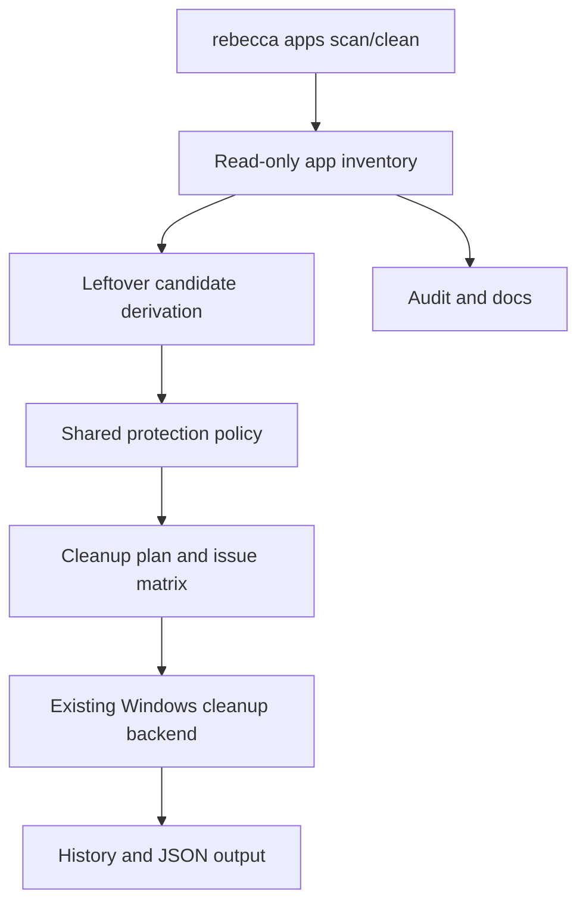

# feat: Add Windows app leftovers cleanup

## Summary

Rebecca already cleans caches well. This plan adds a bounded Windows app-leftover slice: read-only installed-app discovery, conservative leftover-path derivation, and a dedicated `apps` workflow that previews and removes only the residue that remains after app removal.

The feature keeps the cleanup engine, protection policy, history, and JSON contracts in place. It does not turn Rebecca into a full uninstaller, and it does not add registry writes, vendor uninstaller execution, or system-level maintenance.

---

## Problem Frame

Mole's uninstall surface closes a real Windows gap: apps leave files behind after removal. Rebecca currently covers system junk, cache families, Steam-related caches, and self-managed cache purge, but it still leaves app-residue cleanup as a manual task.

The repo already has the right building blocks for a conservative version of this problem: a shared planner, a Windows-only adapter layer, a read-only registry-discovery boundary, and a safety policy that can reject dangerous paths. The missing piece is a product slice that uses those pieces to surface leftover app data without claiming a full uninstall system.

---

## Requirements

**App inventory and discovery**

- R1. Rebecca can enumerate installed-app candidates from read-only Windows sources, including uninstall inventory and install-path hints.
- R2. Discovery is best-effort and stable: unreadable registry keys, missing values, duplicate hints, and absent app roots are skipped rather than failing the whole run.
- R3. Discovery output includes a stable app identity and enough path context to derive leftover cleanup candidates without guessing at vendor-specific uninstall behavior.

**Leftover cleanup contract**

- R4. Rebecca can derive a conservative set of cleanup candidates for discovered apps, focused on user-scoped leftover paths and other reconstructable app data.
- R5. The leftover workflow reuses the shared protection policy, issue-matrix reporting, dry-run behavior, and history model instead of introducing a separate delete engine.
- R6. The workflow stays read-only on registry and does not execute vendor uninstallers, write uninstall metadata, or delete system-owned locations outside the shared safety policy.
- R7. Clean failure modes remain additive: no app inventory entry, no leftover paths, or all paths blocked still produce a valid preview and history record.

**User surface and parity**

- R8. Rebecca exposes the new workflow through `rebecca apps scan` and `rebecca apps clean`, with preview-first behavior by default.
- R9. `README.md`, `docs/security-audit.md`, and `docs/rule-authoring.md` explain the boundary between app leftovers, cache cleanup, and full uninstall.
- R10. Existing cache cleanup, Steam cleanup, scan-cache, and cache-purge behavior remain unchanged.

---

## Acceptance Examples

- AE1. Given an installed app with user-scoped leftovers, when the user runs `rebecca apps scan`, the app appears with stable size and leftover paths.
- AE2. Given missing registry values, when `apps scan` runs, the broken entry is skipped and the remaining apps still render.
- AE3. Given a leftover path that overlaps protected storage or Rebecca-owned storage, when `apps clean --dry-run` runs, the target is blocked with a reason code instead of being deleted.
- AE4. Given no app inventory, when `apps scan` runs, Rebecca reports an empty result without failing the run.

---

## Key Technical Decisions

- Keep inventory read-only. Registry reads are discovery only, which matches the Windows privilege ADR and avoids turning this slice into a risky installer-removal tool.
- Model leftovers as cleanup candidates. The new workflow should flow through the existing planner, protection policy, history, and executor rather than adding a second delete engine.
- Keep the user surface explicit. A dedicated `apps` command is clearer than overloading `clean`, and it leaves room for future uninstall-related work without pretending that it already exists.
- Stay conservative on candidate roots. Prefer user-scoped data and reconstructable app state; defer system-wide leftovers, vendor uninstallers, process killing, and registry writes.
- Treat ambiguous inventory data as a skip. A missed cleanup target is cheaper than a wrong one.

---

## High-Level Technical Design

The new domain sits beside the existing cache workflow, not inside it. The inventory layer discovers app identities and install hints, the candidate layer derives conservative leftover paths, and the shared cleanup pipeline handles preview, execution, and audit.

---

## Scope Boundaries

### In Scope

- Read-only Windows app inventory discovery.
- Conservative leftover cleanup for user-scoped and reconstructable app data.
- `rebecca apps scan` and `rebecca apps clean`.
- Preview-first output, additive JSON/history fields, and issue-matrix reporting.
- Docs and regression coverage for the new workflow.

### Deferred For Later

- Vendor uninstaller execution.
- Registry writes or removal of uninstall metadata.
- Process-kill orchestration for still-running apps.
- System-service, driver, or package-manager cleanup.
- System-wide Program Files cleanup that would blur into full uninstall.

### Outside This Product's Identity

- Copying Mole's uninstall shell scripts or BCUninstaller's broader Windows uninstall engine.
- Broad optimize, monitor, or disk-map features.
- Aggressive cleanup of live installed applications that the inventory cannot tie back to safe leftover data.

---

## System-Wide Impact

This plan introduces Rebecca's first app-residue workflow. That touches the CLI surface, the discovery seam, the planning and execution contract, the safety audit, and the docs that explain what Rebecca does and does not remove.

It also sets a precedent: new Windows domains should be added as bounded, auditable slices, not as a grab-bag of uninstaller behavior.

---

## Risks & Dependencies

- Registry layout varies by vendor and Windows version. Use narrow read-only discovery and preserve skip behavior.
- App names collide easily. Dedupe by stable identity and install-path hints, not display name alone.
- Overmatching leftovers is the main safety risk. Keep candidate roots conservative and let the protection policy reject the rest.
- The feature can sprawl into full uninstall if the boundary is not explicit. Hold registry writes and vendor uninstallers out of scope for this slice.

---

## Documentation / Operational Notes

- Update `README.md` with the new `apps` workflow and the exact boundary relative to cache cleanup and full uninstall.
- Update `docs/security-audit.md` to state that registry reads are discovery-only and that leftover cleanup remains file-system only.
- Update `docs/rule-authoring.md` if the new inventory-derived targets need authoring guidance for future app-specific cleanup families.
- Keep the new workflow small enough that its intent is obvious from the command name, the preview output, and the audit text.

---

## Sources / Research

- `docs/adr/0001-platform-strategy.md`
- `docs/adr/0003-workspace-and-module-boundaries.md`
- `docs/adr/0004-windows-privilege-and-registry-model.md`
- `docs/adr/0006-deletion-and-recovery-model.md`
- `docs/adr/0007-rule-catalog-and-license-provenance.md`
- `docs/plans/2026-06-23-001-feat-windows-cleanup-mvp-plan.md`
- `docs/plans/2026-06-24-002-feat-steam-cleanup-expansion-plan.md`
- `crates/rebecca-core/src/applications.rs`
- `crates/rebecca-core/src/discovery.rs`
- `crates/rebecca-core/src/planner.rs`
- `crates/rebecca-core/src/protection.rs`
- `crates/rebecca-core/src/plan.rs`
- `crates/rebecca-core/src/history.rs`
- `crates/rebecca-cli/src/main.rs`
- `crates/rebecca-windows/src/lib.rs`
- `crates/rebecca-windows/src/steam.rs`
- `README.md`
- `docs/security-audit.md`
- `docs/rule-authoring.md`
- `repo-ref/Mole/README.md`
- `repo-ref/Mole/SECURITY_AUDIT.md`
- `repo-ref/windows-cleaner-cli/README.md`
- `repo-ref/windows-cleaner-cli/src/commands/uninstall.ts`
- `repo-ref/Bulk-Crap-Uninstaller/README.md`
- `repo-ref/Bulk-Crap-Uninstaller/source/SteamHelper/SteamUninstaller.cs`
- `repo-ref/Bulk-Crap-Uninstaller/source/UninstallTools/UninstallerType.cs`

---

## Implementation Units

### U1. Extend The App-Discovery Seam

- **Goal:** Add read-only installed-app inventory to the core and Windows adapter.
- **Files:** `crates/rebecca-core/src/applications.rs`, `crates/rebecca-core/src/discovery.rs`, `crates/rebecca-core/tests/discovery.rs`, `crates/rebecca-windows/src/apps.rs`, `crates/rebecca-windows/src/lib.rs`, `crates/rebecca-windows/tests/apps_inventory.rs`
- **Approach:** Broaden the existing discovery seam to return stable app descriptors from uninstall inventory and install-path hints. Dedupe by stable identity, keep failures local to one source, and keep Steam discovery unchanged.
- **Patterns to follow:** The current Steam discovery contract and the existing best-effort registry-reading shape in `rebecca-windows`.
- **Test scenarios:**
  - A registry entry with display name and install location is discovered.
  - An unreadable key or missing value is skipped without failing the whole run.
  - Duplicate hints dedupe to one app descriptor.
  - Non-Windows still returns an empty discovery result.
- **Verification:** Inventory tests cover happy-path discovery and skip behavior without depending on the host machine.

### U2. Derive Leftover Cleanup Candidates Through The Shared Planner

- **Goal:** Turn inventory records into conservative cleanup candidates that flow through the existing plan model.
- **Files:** `crates/rebecca-core/src/model.rs`, `crates/rebecca-core/src/plan.rs`, `crates/rebecca-core/src/planner.rs`, `crates/rebecca-core/src/protection.rs`, `crates/rebecca-core/tests/planner.rs`, `crates/rebecca-core/tests/model_contract.rs`, `crates/rebecca-core/tests/history.rs`
- **Approach:** Add a bounded app-leftover target model that feeds the existing cleanup pipeline. Use only user-scoped and reconstructable paths that are backed by discovered app identity. Apply the protection policy before the target reaches execution and keep JSON/history compatibility additive.
- **Patterns to follow:** The existing issue-matrix contract, Steam target handling, and the current additive JSON model for plan and history data.
- **Test scenarios:**
  - A leftover path under AppData is allowed when it is tied to a discovered app.
  - A path overlapping protected storage is blocked with a stable reason code.
  - Duplicate leftover paths dedupe before execution.
  - Legacy plan and history JSON still load.
- **Verification:** Planner, model, and history tests show that app leftovers behave like first-class cleanup candidates without weakening safety.

### U3. Add The `apps` CLI Workflow

- **Goal:** Expose scan and clean for app leftovers.
- **Files:** `crates/rebecca-cli/src/main.rs`, `crates/rebecca-cli/src/apps.rs`, `crates/rebecca-cli/src/apps_view.rs`, `crates/rebecca-cli/src/output.rs`, `crates/rebecca-cli/tests/cli_apps.rs`, `crates/rebecca-cli/tests/cli_history.rs`, `README.md`
- **Approach:** Add `rebecca apps scan` and `rebecca apps clean` with preview-first behavior, human and JSON renderers, and history replay that matches the existing cleanup style. Keep the current `clean` command focused on rule-based cleanup.
- **Patterns to follow:** The current `scan`, `clean`, `cache purge`, and `history` command structure.
- **Test scenarios:**
  - `--help` shows the new workflow.
  - `apps scan` renders app candidates and sizes.
  - `apps clean --dry-run` shows the issue matrix without deleting anything.
  - JSON output keeps the additive shape and stable reason codes.
- **Verification:** CLI tests prove the new workflow fits the existing command surface without changing the retained cleanup commands.

### U4. Update Safety Docs And Keep The Boundary Tight

- **Goal:** Make the new boundary explicit and keep future growth bounded.
- **Files:** `docs/security-audit.md`, `docs/rule-authoring.md`, `README.md`
- **Approach:** Document that registry reads are discovery-only, the new workflow is leftovers only, and full uninstall, vendor uninstallers, and registry writes remain deferred. Tie the docs back to the same shared safety model that already governs cleanup and Steam rules.
- **Patterns to follow:** The current safety audit style and the README's command and capability summaries.
- **Test scenarios:**
  - The README examples name the new workflow and its exclusions.
  - The safety audit states the new registry boundary clearly.
  - Rule-authoring guidance stays aligned with the cleanup-only model.
- **Verification:** A reader can tell, in one pass, what the new workflow does and what it deliberately does not do.
