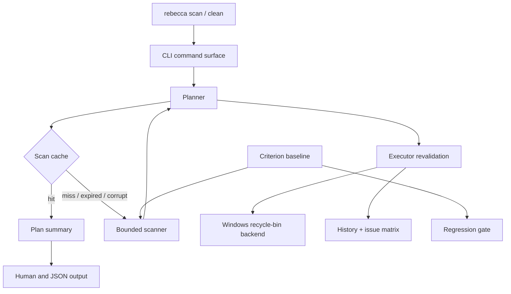

# refactor: Harden the cleanup core

## Goal Capsule

- **Objective:** Raise Rebecca's existing Windows cleanup core from "working" to "mature" by tightening scan throughput, scan-cache lifecycle, execution revalidation, and the verification gates that prove those behaviors stay stable.
- **Authority:** Preserve the current Windows-first cleanup contract, the recoverable trash default, dry-run parity, the existing rule catalog, and the shared safety policy. Do not broaden the product into new cleanup domains while this hardening slice is in flight.
- **Stop Conditions:** Large-tree scans remain bounded and benchmarked, scan-cache records are treated as first-class rebuildable data with explicit lifecycle behavior, execution-time policy revalidation stays visible in the core and CLI, and the targeted regression suite plus workspace gates stay green.
- **Execution Profile:** Characterization-first for the scan and execution hardening units, benchmark-backed for throughput, and doc-follow-through only after the behavior is pinned down by tests.
- **Tail Ownership:** Remove any abandoned scheduler or cache-maintenance experiment code before declaring done, and update the engineering memory so the next cleanup slice starts from the new maturity bar.

---

## Product Contract

### Summary

Rebecca already has the core cleanup loop, but it still reads like a feature-complete tool rather than a mature one. This plan hardens the parts that matter most for a cleanup CLI: bounded scan throughput, explicit scan-cache lifecycle, stable execution revalidation, and regression gates that make speed and safety measurable.

The scope stays inside the current Windows-first cleanup core. It does not add new cleanup families, new commands, or new platform promises.

### Problem Frame

The current core works, but the remaining gap is engineering maturity. Large scans still need a clearer throughput budget, scan-cache records are useful but not yet handled as a lifecycle-managed optimization layer, and execution outcomes still need stronger classification and reporting discipline.

That leaves the product slightly under-finished under load and under failure. The code path is present, but the tool still needs the sort of boundaries and gates that make mature cleanup software feel predictable on large trees, stale state, and partial failure.

### Requirements

- **R1.** Large-target scans remain bounded, cancelable, and measurably non-regressive on representative fixtures.
- **R2.** Scan-cache records are versioned, freshness-bounded, and pruned or rebuilt when stale, corrupted, or unsupported.
- **R3.** Execution revalidates targets immediately before backend deletion and keeps policy outcomes stable.
- **R4.** Human and JSON output report scan-cache and execution outcomes consistently enough to support troubleshooting.
- **R5.** Verification uses benchmark and regression gates rather than prose alone to define maturity.

### Success Criteria

- Representative large-tree scans complete with bounded concurrency and no meaningful regression against the recorded benchmark baseline.
- Repeated scans reuse cache records when safe and rebuild when records are stale or corrupted.
- Execution-time path changes produce deterministic blocked, skipped, or failed outcomes instead of ambiguous partial state.
- README, safety audit, and engineering memory describe the mature contract and its boundaries.

### Acceptance Examples

- **AE1.** Given an unchanged large target tree, when Rebecca scans it twice, the second run reports cache hits and avoids re-measuring fresh directory records.
- **AE2.** Given a stale or corrupted scan-cache record, when Rebecca scans the same target again, it rebuilds the measurement and reports a miss instead of trusting stale bytes.
- **AE3.** Given a target that becomes protected or disappears after planning, when execution runs, Rebecca revalidates it and downgrades it to a deterministic skipped or blocked outcome.
- **AE4.** Given the benchmark fixture, when the throughput gate runs, the scan baseline stays within the accepted regression tolerance.

---

## Scope Boundaries

### In Scope

- Bounded scan scheduling and progress preservation for large target sets.
- Scan-cache lifecycle discipline, including pruning of stale or unsupported records.
- Execution-time revalidation and stable failure classification.
- Benchmark and regression gates for scan throughput and core cleanup behavior.
- README, safety-audit, configuration, and engineering-memory updates that explain the new maturity bar.

### Deferred To Follow-Up Work

- New cleanup families or catalog expansion.
- New command surfaces for cache maintenance or throughput tuning.
- Async filesystem traversal or a new task-queue subsystem.
- Permanent-delete defaults or a broader uninstall surface.
- Cross-platform expansion beyond the current Windows-first core.

### Outside This Product's Identity

- Treating cleanup as "feature complete" without measurable performance and safety gates.
- Replacing the recoverable trash default with direct permanent deletion.
- Copying Mole, null-e, Windows Cleaner CLI, BleachBit, or BCU code or rule data instead of re-implementing the behavior in Rebecca's own shape.

---

## Planning Contract

### Key Technical Decisions

- **KTD1.** Keep filesystem traversal synchronous at the edge and use bounded parallelism only where the existing core already benefits from it. Do not introduce async I/O as a maturity shortcut.
- **KTD2.** Treat scan-cache as an optimization cache with version, freshness, and pruning semantics, not as durable state. Cache corruption or age should trigger rebuild behavior, not a hard failure.
- **KTD3.** Keep execution revalidation inside the shared core executor so planner, executor, history, and CLI all report the same policy boundary.
- **KTD4.** Make benchmark-backed throughput the acceptance gate for the scan path. "Faster" only matters if the representative fixture proves it and the regression budget stays intact.

### Assumptions

- The current Windows cleanup catalog stays unchanged during this slice; the work is about maturity, not more coverage.
- The scan benchmark uses a representative large-tree fixture and relative regression tolerance instead of a single absolute wall-clock promise.
- Scan-cache pruning should be opportunistic and bounded so happy-path scans do not turn cache maintenance into a new bottleneck.

### Sequencing

1. Tighten scan scheduling and capture the benchmark baseline first, because that establishes the latency ceiling for the rest of the slice.
2. Close scan-cache lifecycle gaps next, because cache behavior only matters once the scan path can rely on it safely.
3. Finish execution revalidation and output alignment after the scan/cache contract is stable, so failure reporting matches the same policy model end to end.
4. Land the doc and engineering-memory updates last, once the behavior and gates are pinned down.

### High-Level Technical Design

---

## Implementation Units

### U1. Bound scan throughput and keep progress predictable

- **Goal:** Make large scans stay responsive without introducing a new async runtime or an unbounded scheduler.
- **Requirements:** R1, R5
- **Dependencies:** None.
- **Files:** `crates/rebecca-core/src/scan.rs`, `crates/rebecca-core/src/planner.rs`, `crates/rebecca-core/benches/scan_baseline.rs`, `crates/rebecca-core/tests/scan_engine.rs`, `crates/rebecca-core/tests/planner.rs`
- **Approach:** Keep synchronous filesystem traversal, but make the planner's scan work obey an explicit parallelism budget instead of relying on the loosest default shape. Preserve cancellation and progress events while making the large-tree benchmark representative enough to catch accidental over-subscription or throughput regressions.
- **Execution note:** Characterize current scan and cancellation behavior before adjusting the scheduler so the new budget does not change semantics by accident.
- **Patterns to follow:** The existing `scan.rs` progress/cancellation flow, the current Rayon-backed target parallelism in `planner.rs`, and the bounded-concurrency posture in `repo-ref/Mole/cmd/analyze/scanner.go` and `repo-ref/null-e/README.md`.
- **Test scenarios:**
  - A multi-target scan still returns deterministic, sorted results after the scheduling change.
  - A cancellation request during a long directory scan stops further measurement and leaves no partial status drift.
  - File-level progress still advances for scanned files on large targets.
  - The benchmark fixture remains representative enough to expose a throughput regression or improvement on the scan path.
- **Verification:** The core scan and planner tests prove the scheduling change preserves behavior, and the benchmark gate proves the scan path stays within the accepted regression budget.

### U2. Make scan-cache lifecycle explicit and self-pruning

- **Goal:** Turn scan-cache into a managed optimization layer with explicit hit, miss, expiry, and prune behavior.
- **Requirements:** R2, R4, R5
- **Dependencies:** U1.
- **Files:** `crates/rebecca-core/src/scan_cache.rs`, `crates/rebecca-core/src/planner.rs`, `crates/rebecca-cli/src/clean.rs`, `crates/rebecca-cli/src/clean_view.rs`, `crates/rebecca-cli/src/output.rs`, `crates/rebecca-core/tests/scan_cache.rs`, `crates/rebecca-cli/tests/cli_clean.rs`, `docs/configuration.md`, `docs/security-audit.md`
- **Approach:** Keep the current versioned record model and freshness window, but add bounded pruning for stale, corrupted, or unsupported records and surface hit/miss/write-skip counts in the human path. Cache maintenance should be opportunistic and cheap enough that it does not become the new bottleneck on the happy path.
- **Execution note:** Capture current miss reasons and cache-summary behavior before adding pruning so the lifecycle stays additive.
- **Patterns to follow:** Mole's cache freshness and pruning discipline in `repo-ref/Mole/cmd/analyze/cache.go`, plus Rebecca's existing versioned scan-cache contract in `crates/rebecca-core/src/scan_cache.rs`.
- **Test scenarios:**
  - A fresh directory record still hits after a second scan with no mutation.
  - A stale or expired directory record falls back to a fresh measurement and reports the right miss reason.
  - A corrupted record is ignored or pruned and does not poison later scans.
  - Human output shows cache hit, miss, and write-skip counts, while JSON output stays stable.
- **Verification:** The scan-cache unit tests and CLI clean regressions show that cache lifecycle behavior is explicit, bounded, and non-disruptive.

### U3. Harden execution revalidation and failure classification

- **Goal:** Make execution-time behavior match the planner's safety contract and keep partial failure states easy to reason about.
- **Requirements:** R3, R4, R5
- **Dependencies:** U2.
- **Files:** `crates/rebecca-core/src/executor.rs`, `crates/rebecca-core/src/plan.rs`, `crates/rebecca-core/src/history.rs`, `crates/rebecca-core/tests/executor_contract.rs`, `crates/rebecca-core/tests/history.rs`, `crates/rebecca-cli/tests/cli_history.rs`, `crates/rebecca-cli/tests/cli_clean.rs`
- **Approach:** Keep the existing policy revalidation boundary, but make the execution results and history/output mapping stricter so missing paths, policy blocks, and backend failures end up in stable, testable outcomes. Preserve the current recoverable trash default and the directory-preserving deletion style.
- **Execution note:** Add or expand executor characterization coverage before touching the classification surface so the revalidation contract remains the same contract, just clearer.
- **Patterns to follow:** The current policy revalidation in `executor.rs`, the stable issue-matrix contract in `plan.rs`, and the warning-heavy deletion posture in `repo-ref/BleachBit/share/protected_path.xml` and `repo-ref/Bulk-Crap-Uninstaller/README.md`.
- **Test scenarios:**
  - A target that becomes protected between plan and execute is downgraded during execution, not deleted.
  - A target that disappears before backend deletion is skipped with a stable reason, not treated as an opaque failure.
  - A backend permission or IO failure is recorded as a failed execution with the right counters and history entry.
  - Mixed plans with allowed and blocked targets preserve summary counts, reason codes, and history replay.
- **Verification:** Executor, history, and CLI regression tests prove that real execution and reported execution now tell the same story.

### U4. Lock the maturity bar into docs and engineering memory

- **Goal:** Make the new cleanup-core contract visible so future slices inherit the same performance and safety bar.
- **Requirements:** R1, R2, R3, R4, R5
- **Dependencies:** U1, U2, U3.
- **Files:** `README.md`, `docs/security-audit.md`, `docs/knowledge/engineering/current-state.md`, `docs/knowledge/engineering/log.md`
- **Approach:** Update the operator-facing docs and engineering memory to describe the bounded scan contract, the scan-cache lifecycle, and the execution revalidation behavior as part of the shipped maturity baseline. Keep the wording aligned with the implemented behavior, not with a future wish list.
- **Patterns to follow:** The current README safety model, the security-audit contract style, and the engineering-memory entries that already record prior cleanup slices.
- **Test scenarios:**
  - Test expectation: none -- this unit is documentation and memory follow-through, but the wording must match the implemented behavior and benchmark gate.
- **Verification:** A reader can tell, in one pass, what Rebecca now guarantees for scan throughput, scan-cache lifecycle, and execution revalidation, and the engineering memory points future work at the new baseline.

---

## Verification Contract

| Gate | Command | Proves |
|---|---|---|
| Format | `cargo fmt --all -- --check` | No formatting drift landed with the hardening work. |
| Lint | `cargo clippy --workspace --all-targets -- -D warnings` | The maturity changes do not introduce new static-analysis regressions. |
| Scan behavior | `cargo nextest run -p rebecca-core --test scan_engine -p rebecca-core --test planner` | Bounded scan scheduling, progress, and cancellation still behave as expected. |
| Scan-cache behavior | `cargo nextest run -p rebecca-core --test scan_cache -p rebecca-cli --test cli_clean -p rebecca-cli --test output` | Cache hits, misses, expiries, pruning, and human output stay aligned. |
| Execution behavior | `cargo nextest run -p rebecca-core --test executor_contract -p rebecca-core --test history -p rebecca-cli --test cli_history` | Revalidation, partial failure handling, and history replay keep the same policy story. |
| Throughput gate | `cargo bench -p rebecca-core --bench scan_baseline` | The scan path stays within the accepted regression tolerance on representative large trees. |
| Workspace gate | `cargo nextest run --workspace` | The full repository stays green after the maturity work lands. |
| Hygiene | `git diff --check` | No accidental whitespace or line-ending damage sneaks into the plan-following diff. |

---

## Definition of Done

- The scan path has a documented bounded-throughput gate and the benchmark stays within the accepted tolerance on the representative fixture.
- Scan-cache records behave like managed optimization data: fresh hits work, stale or corrupted entries rebuild cleanly, and the lifecycle is visible in human output.
- Execution-time revalidation preserves the same safety contract the planner used, and blocked, skipped, and failed outcomes remain deterministic across CLI, history, and core tests.
- README, safety audit, configuration, current-state, and engineering log all describe the matured contract without advertising new cleanup domains.
- No temporary scheduler experiments, pruning prototypes, or dead-end failure-classification branches remain in the final diff.

---

## Risks & Dependencies

| Risk | Impact | Mitigation |
|---|---|---|
| Benchmark noise on Windows hides real throughput change | Medium | Use a representative fixture and a relative regression budget instead of a single absolute wall-clock promise. |
| More aggressive scan concurrency saturates disk I/O on low-core machines | Medium | Keep the scheduler budget bounded and conservative by default. |
| Cache pruning accidentally removes useful records | High | Prune only stale, corrupted, or unsupported records and keep the happy path cheap. |
| Execution classification changes perturb human and JSON output | Medium | Keep reason-code mappings stable and pin them with executor, history, and CLI regression tests. |

---

## System-Wide Impact

This plan touches the planner, the scan engine, the scan-cache store, the executor, the CLI human/JSON surfaces, the benchmark baseline, and the engineering memory that future slices read first. It also raises the definition of done for later cleanup work: future slices should inherit the same scan-cache discipline and throughput gate instead of rediscovering them.

---

## Sources / Research

- `crates/rebecca-core/src/scan.rs`, `crates/rebecca-core/src/scan_cache.rs`, `crates/rebecca-core/src/planner.rs`, `crates/rebecca-core/src/executor.rs`
- `README.md`, `docs/security-audit.md`, `docs/configuration.md`, `docs/knowledge/engineering/current-state.md`, `docs/knowledge/engineering/log.md`
- `docs/adr/0001-platform-strategy.md`, `docs/adr/0002-core-runtime-architecture.md`, `docs/adr/0005-scan-engine-strategy.md`, `docs/adr/0006-deletion-and-recovery-model.md`, `docs/adr/0008-configuration-and-local-state-model.md`
- `repo-ref/Mole/README.md`, `repo-ref/Mole/cmd/analyze/scanner.go`, `repo-ref/Mole/cmd/analyze/cache.go`, `repo-ref/Mole/cmd/analyze/delete.go`
- `repo-ref/null-e/README.md`, `repo-ref/null-e/crates/null-e-core/src/scan.rs`, `repo-ref/null-e/crates/null-e-cli/src/main.rs`
- `repo-ref/windows-cleaner-cli/README.md`, `repo-ref/windows-cleaner-cli/src/commands/scan.ts`, `repo-ref/windows-cleaner-cli/src/commands/clean.ts`
- `repo-ref/BleachBit/share/protected_path.xml`, `repo-ref/BleachBit/bleachbit/ProtectedPath.py`, `repo-ref/BleachBit/bleachbit/Cleaner.py`
- `repo-ref/Bulk-Crap-Uninstaller/README.md`, `repo-ref/Bulk-Crap-Uninstaller/source/BCU-console/Program.cs`
