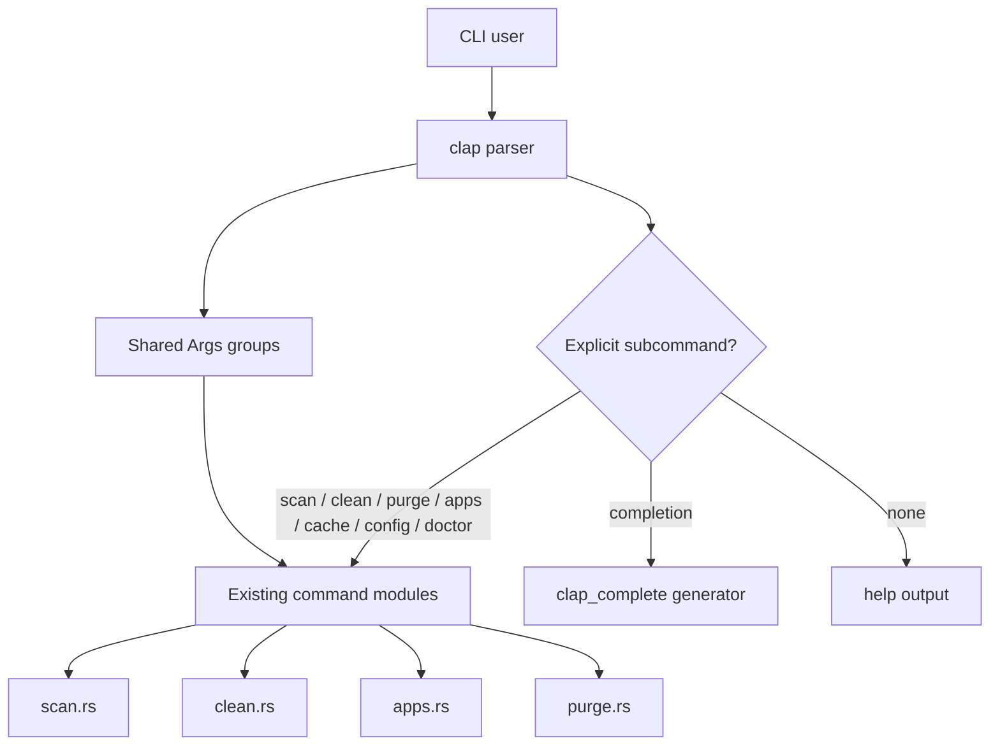

# refactor: Modernize the CLI surface

## Goal Capsule

- **Objective:** Turn Rebecca's command-line entry into an explicit, composable CLI that is easier to discover, easier to extend, and easier to complete from shells.
- **Authority:** Preserve the cleanup engine, rule catalog, safety policy, and retained subcommand behavior. Remove the hidden no-arg `scan` shortcut in favor of a visible command tree and generated completion support.
- **Stop Conditions:** The root command no longer silently dispatches to `scan`, shared options are defined once, completion generation comes from the live parser, and the README plus CLI tests match the new contract.
- **Execution Profile:** Characterization-first for the root help and no-arg behavior, refactor-first for the parser split, and docs-after-behavior for completion examples.
- **Tail Ownership:** Remove the temporary hidden-default path and any duplicated parser scaffolding before declaring the slice done.

---

## Product Contract

### Summary

Rebecca's CLI should feel like a mature command surface rather than a bundle of ad hoc entry points. The root command should be explicit, shared options should be modeled once, and shell completion should come from the live `clap` parser instead of a hand-maintained side path.

The cleanup engine, rule catalog, and safety policy stay in place. This plan changes how users enter and discover commands, not what the cleaner does.

### Problem Frame

Current CLI behavior is correct but uneven. The top-level command silently maps no-arg input to `scan`, repeated flags are duplicated across command branches, and the repo has no first-class completion command even though the parser already knows the full command tree.

That leaves the surface usable but not polished. A mature CLI should expose its structure directly, keep shared arguments in one place, and generate completion scripts from the same parser that powers help and dispatch.

### Requirements

#### Command entry

- R1. `rebecca` without a subcommand should no longer silently run `scan`; the root entry should make the command structure explicit instead.
- R2. The retained command set should keep the current cleanup, cache, config, and doctor behavior once entered explicitly.

#### Parser reuse

- R3. Shared cleanup flags and repeated value options are modeled once and reused across command branches instead of being duplicated in `main.rs`.
- R4. The parser shape should keep command dispatch readable and make future command additions local.

#### Completion and discoverability

- R5. The CLI exposes shell completion generation from the live parser using `clap_complete`, with a shell choice that works on Windows and common POSIX shells.
- R6. README examples and help text describe the explicit command entry and completion workflow.

#### Regression protection

- R7. Root help, command help, and completion output are covered by tests so the CLI contract does not drift back to the hidden default path.

### Acceptance Examples

- AE1. Given `rebecca` with no subcommand, when invoked, it prints help and does not emit the scan catalog.
- AE2. Given `rebecca clean --help`, when invoked, it still shows the cleanup flags after the parser refactor.
- AE3. Given `rebecca completion powershell`, when invoked, it emits a completion script that includes the current subcommands.

### Scope Boundaries

#### In Scope

- Root command ergonomics and parser shape.
- Shared command option groups.
- `clap_complete`-backed completion generation.
- README/help updates and CLI tests.

#### Deferred for Later

- Separate interactive cleanup wizard or dashboard UI.
- New cleanup families, safety policy changes, or engine behavior changes.
- Installer packaging for shell completion scripts.

---

## Planning Contract

### Key Technical Decisions

- **KTD1.** Use explicit subcommand parsing at the root, even though it removes the old no-arg shortcut. Clap best practice and help discoverability matter more than implicit dispatch.
- **KTD2.** Extract reusable `Args`/`flatten` groups for the shared cleanup flags so `clean`, `apps`, and `purge` share one parser contract.
- **KTD3.** Generate completions from the live parser through `clap_complete` rather than maintaining a separate shell script or command list.
- **KTD4.** Keep completion generation CLI-native and read-only so it is easy to script and does not depend on installer state.

### High-Level Technical Design

### System-Wide Impact

- External users will need to type an explicit subcommand if they were relying on the old no-arg scan shortcut.
- Shell init files and README examples will pick up a new completion workflow.
- Future CLI additions should go through the shared parser layer so help and completion stay synchronized.

### Risks & Dependencies

| Risk | Impact | Mitigation |
|---|---|---|
| Removing the no-arg shortcut surprises existing users | Medium | Document the explicit `scan` entry and pin the root help behavior with tests. |
| Completion output drifts from the parser | Medium | Generate completions from the live `Command` and test the emitted subcommand list. |
| Clap API or feature mismatches block the refactor | Low | Keep the change within the existing clap 4.5 derive surface and update the dependency entry together. |

### Sources / Research

- `crates/rebecca-cli/src/main.rs`
- `crates/rebecca-cli/src/scan.rs`
- `crates/rebecca-cli/src/clean.rs`
- `crates/rebecca-cli/src/apps.rs`
- `crates/rebecca-cli/src/purge.rs`
- `crates/rebecca-cli/tests/cli_scan.rs`
- `crates/rebecca-cli/tests/cli_clean.rs`
- `crates/rebecca-cli/tests/cli_apps.rs`
- `crates/rebecca-cli/tests/cli_output.rs`
- `README.md`
- `repo-ref/Mole/bin/completion.sh`
- `repo-ref/Mole/lib/core/commands.sh`
- `repo-ref/Mole/README.md`
- `https://docs.rs/clap/latest/clap/struct.Command.html`
- `https://docs.rs/clap/latest/clap/_derive/index.html`
- `https://docs.rs/clap/latest/clap/trait.Args.html`
- `https://docs.rs/clap_complete/`
- `https://docs.rs/clap_complete/latest/clap_complete/aot/enum.Shell.html`

---

## Implementation Units

### U1. Rebuild the root parser around explicit subcommands and shared args

- **Goal:** Make the command tree visible and remove the hidden default dispatch.
- **Requirements:** R1, R2, R3, R4, R7
- **Dependencies:** None
- **Files:** `crates/rebecca-cli/src/main.rs`, `crates/rebecca-cli/src/cli.rs`, `crates/rebecca-cli/tests/cli_help.rs`, `crates/rebecca-cli/tests/cli_scan.rs`, `crates/rebecca-cli/tests/cli_clean.rs`, `crates/rebecca-cli/tests/cli_apps.rs`, `crates/rebecca-cli/tests/cli_purge.rs`
- **Approach:** Move parser types out of `main.rs`, model shared options with reusable `Args` structs, require the root to resolve through explicit subcommands, and keep the execution modules unchanged.
- **Execution note:** Characterize the current root no-arg and help behavior before changing the parser so the new contract is deliberate, not accidental.
- **Patterns to follow:** The existing command module split in `scan.rs`, `clean.rs`, `apps.rs`, and `purge.rs`, plus clap derive examples for `Args`, `Subcommand`, and `flatten`.
- **Test scenarios:**
  - `rebecca` with no subcommand prints help instead of the scan catalog.
  - `rebecca --help` still lists the full top-level command set.
  - `rebecca clean --help`, `rebecca apps --help`, and `rebecca purge --help` still show the expected option groups after the refactor.
  - Shared cleanup flags and repeated selectors still parse on the retained commands.
- **Verification:** The parser shape is explicit, the no-arg shortcut is gone, and existing commands still parse the same inputs.

### U2. Add live completion generation

- **Goal:** Expose shell completion from the live parser.
- **Requirements:** R5, R6, R7
- **Dependencies:** U1
- **Files:** `Cargo.toml`, `crates/rebecca-cli/Cargo.toml`, `crates/rebecca-cli/src/completion.rs`, `crates/rebecca-cli/src/main.rs`, `crates/rebecca-cli/tests/cli_completion.rs`, `README.md`
- **Approach:** Wire a `completion` subcommand through `clap_complete`, accept explicit shell selection with a sensible current-shell fallback, and generate scripts from the same command tree that powers help and dispatch.
- **Patterns to follow:** Mole's `completion` command shape and the `clap_complete` runtime generation helpers.
- **Test scenarios:**
  - `rebecca completion --help` documents the completion command and supported shells.
  - `rebecca completion powershell` emits a completion script that contains the current top-level commands.
  - `rebecca completion bash` or `zsh` emits a script that includes the same live subcommand set.
  - Invalid shell input fails clearly instead of generating the wrong script.
- **Verification:** Completion output is generated from the live parser and stays in sync with the visible command tree.

### U3. Refresh user-facing documentation and close the regression gaps

- **Goal:** Make the revised command contract discoverable and durable.
- **Requirements:** R1, R5, R6, R7
- **Dependencies:** U1, U2
- **Files:** `README.md`, `crates/rebecca-cli/tests/cli_help.rs`, `crates/rebecca-cli/tests/cli_completion.rs`
- **Approach:** Rewrite the usage examples to use explicit subcommands, add a short completion example, and keep the README aligned with the root help output and completion command.
- **Patterns to follow:** The current README usage section and the concise command-style docs already used for other CLI surfaces.
- **Test scenarios:** Test expectation: none -- this unit is documentation-only; parser and completion behavior are pinned by the CLI integration tests.
- **Verification:** The README matches the actual CLI contract and no longer advertises the hidden no-arg shortcut.

---

## Verification Contract

| Gate | Command | Proves |
|---|---|---|
| Format | `cargo fmt --all --check` | Parser and docs changes stay formatted. |
| CLI integration | `cargo nextest run -p rebecca-cli --test cli_help -p rebecca-cli --test cli_completion -p rebecca-cli --test cli_scan -p rebecca-cli --test cli_clean -p rebecca-cli --test cli_apps -p rebecca-cli --test cli_purge` | Explicit root help, completion, and retained command behavior all hold together. |
| Workspace | `cargo nextest run --workspace` | The CLI refactor does not destabilize the rest of the repo. |
| Static checks | `cargo clippy --workspace --all-targets -- -D warnings` | Parser changes and dependency additions stay warning-free. |

---

## Definition of Done

- `rebecca` no longer silently scans on no args; the root behavior is explicit in help.
- Shared CLI option groups are reused instead of duplicated.
- `completion` is a first-class subcommand and emits usable scripts from the live parser.
- README examples match the new CLI surface, and the command contract is pinned by integration tests.
- Obsolete parser branches and temporary duplication are removed from the final diff.
