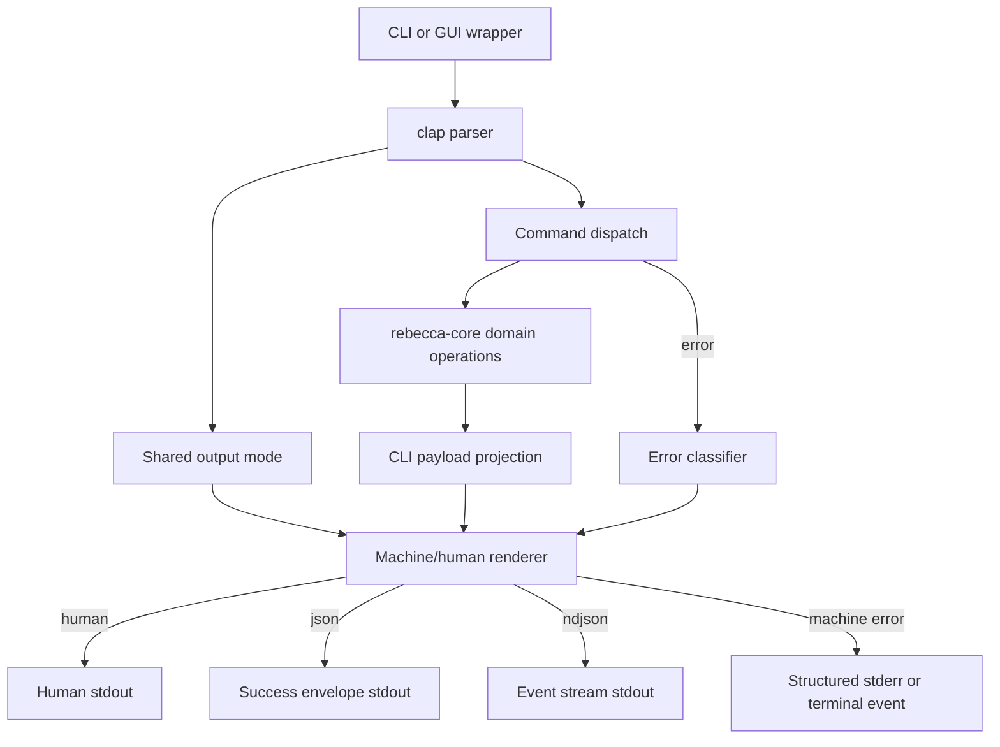
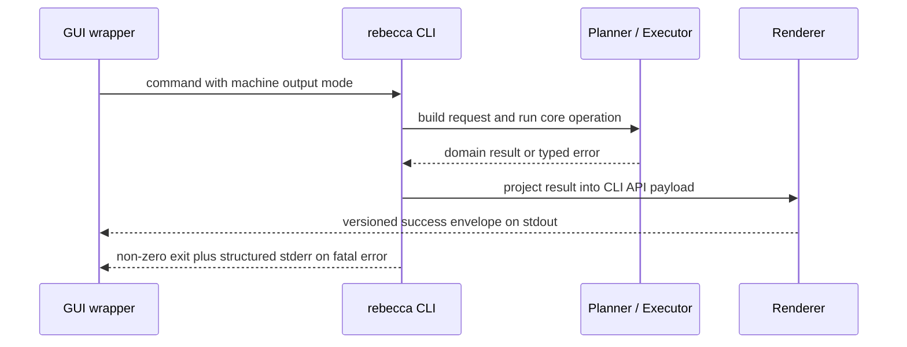
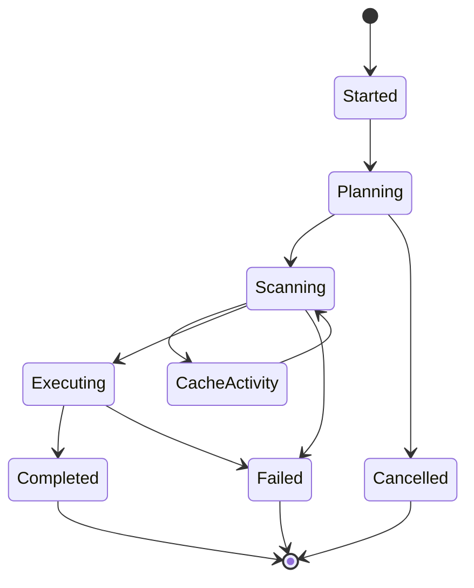

# CLI API Contract - Plan

## Goal Capsule

- **Objective:** Turn Rebecca's CLI machine surfaces into a versioned product API that GUI wrappers, scripts, and future frontends can consume without parsing human text or unstable core structs.
- **Authority:** Break the current pre-release naked JSON shapes where needed, preserve the cleanup safety model, keep human output ergonomic, and keep `rebecca-core` as the source model behind CLI projections.
- **Stop Conditions:** Machine success responses use a v1 envelope, machine failures are structured, long-running workflows can emit NDJSON events, `doctor permissions` has a JSON report, docs publish the contract, and binary-level contract tests pin the new surface.
- **Execution Profile:** Characterization-first for existing JSON/error tests, refactor-first for the output boundary, then command-by-command migration to the new contract.
- **Tail Ownership:** Remove stale naked JSON render paths, stale command-local JSON flags, and outdated README examples before the slice is done.

---

## Product Contract

### Summary

Rebecca will treat the CLI as a stable API boundary for GUI and automation consumers.
The plan replaces command-local naked JSON with a versioned machine contract, gives failures a parseable shape, and exposes progress as line-delimited events for long-running cleanup workflows.

### Problem Frame

Rebecca already has strong cleanup models in core, but the current CLI leaks those models directly through scattered `serde_json::to_string_pretty` calls.
That is workable for early tests but weak for GUI integration: consumers cannot rely on a schema version, error output is only text on stderr, progress events are spinner messages, and `doctor permissions` has no machine-readable form.

Mole shows the useful baseline: JSON outputs and a status NDJSON stream are valuable for scripting.
Rebecca can go further because it is pre-release and Rust-first: break the current shapes now, centralize the contract, and make CLI-as-API behavior explicit instead of accidental.

### Requirements

#### Machine Output Contract

- R1. Every supported machine-readable success response is wrapped in a v1 envelope with command identity, schema version, generation metadata, and typed payload data.
- R2. Existing `--format json` naked payload shapes are replaced rather than compatibility-preserved; current users are tests and local development scripts, not public API consumers.
- R3. Output selection is centralized through a shared CLI output mode instead of repeating command-local JSON flags across subcommands.
- R4. Human output remains the default and must not be interleaved with JSON or NDJSON stdout.

#### Error Contract

- R5. Machine-readable failures use a structured error envelope inspired by RFC 9457 Problem Details, adapted for CLI process exits with stable error codes and exit-code metadata.
- R6. JSON-mode errors are written as structured JSON to stderr with a non-zero exit status; human-mode errors remain concise text.
- R7. NDJSON-mode failures that happen after event streaming begins are emitted as terminal error events so stream consumers do not have to reconcile partial stdout with unrelated stderr text.

#### Event Stream Contract

- R8. Long-running cleanup workflows support NDJSON event output for lifecycle, progress, cache, warning, cancellation, completion, and error states.
- R9. NDJSON events are versioned, ordered, and typed so a GUI can drive progress UI without parsing spinner text.
- R10. Event streaming initially covers Rebecca cleanup workflows and diagnostic preflight surfaces, not system monitoring.

#### Diagnostic Contract

- R11. `doctor permissions` exposes machine-readable platform support, privilege level, capability findings, and suggested action.
- R12. Unsupported platforms produce structured diagnostic data instead of only a human label.

#### Documentation And Verification

- R13. The CLI API v1 contract is documented with JSON Schema 2020-12 files and examples under repo documentation.
- R14. Binary-level CLI tests validate success envelopes, error envelopes, NDJSON event streams, schema examples, and absence of human text in machine stdout.
- R15. README, security audit, and engineering memory describe the new CLI API boundary and its non-goals.

### Acceptance Examples

- AE1. Given a temp fixture with cleanable files, when the user runs `rebecca clean --format json --category system`, then stdout is a valid v1 success envelope whose payload contains the dry-run cleanup plan and no human progress text.
- AE2. Given an unknown rule id, when the user runs `rebecca clean --format json --rule missing.rule`, then the process exits non-zero and stderr is a valid v1 error envelope with a stable invalid-rule code.
- AE3. Given scan-cache-enabled cleanup, when the user runs `rebecca clean --format ndjson --scan-cache --category system`, then stdout contains one JSON object per line and ends with a terminal completion or error event.
- AE4. Given a non-Windows host, when the user runs `rebecca doctor permissions --format json`, then stdout reports the platform as unsupported without pretending cleanup execution is available.
- AE5. Given an empty history file state, when the user runs `rebecca history --format json`, then stdout is a success envelope whose payload contains an empty history list.

### Scope Boundaries

#### In Scope

- Central output-mode parsing and renderer plumbing.
- Versioned success envelopes for current JSON-capable commands.
- Structured machine-readable error envelopes.
- NDJSON lifecycle and progress events for cleanup workflows.
- Machine-readable permissions diagnostics.
- JSON Schema files, examples, README updates, and contract tests.

#### Deferred to Follow-Up Work

- A first-party GUI application.
- A background HTTP daemon or local RPC service.
- Publishing `rebecca-core` as a stable public Rust SDK.
- System status monitoring equivalent to Mole's `mo status --watch`.
- Compatibility shims for the old naked JSON output after this branch lands.

#### Outside This Product's Identity

- Copying Mole shell or Go implementation code.
- Widening cleanup rule coverage as part of the API-contract refactor.
- Storing arbitrary child-file listings or sensitive content in history to satisfy GUI display needs.

---

## Planning Contract

### Key Technical Decisions

- **KTD1.** Use a CLI API v1 envelope as the external machine contract, with core structs nested or projected inside payloads rather than serialized as top-level responses.
- **KTD2.** Replace repeated command-local `--format json` flags with a shared output mode such as `human`, `json`, and `ndjson`, because GUI consumers need one contract language across commands.
- **KTD3.** Keep process-channel rules strict: success JSON and NDJSON events go to stdout, JSON-mode fatal errors go to stderr, and human diagnostics never appear in machine stdout.
- **KTD4.** Adapt RFC 9457's error-field discipline without importing HTTP semantics wholesale; CLI errors need stable codes, detail, command context, and exit-code metadata more than HTTP status codes.
- **KTD5.** Treat NDJSON as an event stream, not pretty-printed JSON split across lines. Each line is a complete versioned event with sequence and kind.
- **KTD6.** Publish JSON Schema 2020-12 documents for response, error, event, and payload families so GUI wrappers can validate without linking Rust code.
- **KTD7.** Keep `rebecca-core` as the domain authority and move API shaping into the CLI layer, so future SDK work can still expose cleaner Rust-native types.
- **KTD8.** Validate the contract through binary integration tests and schema fixtures; renderer unit tests are secondary because the executable is the API surface GUI callers actually invoke.

### High-Level Technical Design

### Assumptions

- Rebecca has no public release that requires preserving the current naked JSON output.
- Existing history JSONL storage can remain an internal persistence format while `history --format json` gets a new external envelope.
- A dev-only JSON Schema validator dependency is acceptable if it keeps API contract tests honest without increasing runtime footprint.

### System-Wide Impact

- CLI tests that currently read `value["request"]`, `value["summary"]`, or raw arrays will need to read through the v1 envelope.
- Error tests that currently assert stderr substrings will need to parse structured machine errors when a machine format is requested.
- Progress reporting will become a shared event rendering concern rather than a spinner-only concern in `clean.rs`.
- Documentation must clearly separate the stable CLI API from internal history JSONL and scan-cache record formats.

### Risks & Dependencies

| Risk | Impact | Mitigation |
|---|---|---|
| Envelope migration touches many CLI tests at once | High | Add shared test helpers first, then migrate commands one family at a time. |
| NDJSON events accidentally expose sensitive path detail beyond current plan output | Medium | Limit event fields to target-level paths already present in plans and avoid child-file listings. |
| Error mapping loses useful `anyhow` context | Medium | Keep human detail in `detail`, but derive stable machine `code` from known error variants and command preflight failures. |
| Global output mode conflicts with completion or help behavior | Low | Keep help and completion script generation outside the API payload contract and pin parser behavior with help tests. |
| JSON Schema files drift from Rust payloads | Medium | Validate representative CLI outputs against schemas in integration tests. |

### Documentation / Operational Notes

- `docs/api/cli/v1/README.md` should define channel rules, output modes, versioning policy, event lifecycle, and breaking-change posture.
- `README.md` should switch examples from `--format json` to the shared output mode and explain when GUI wrappers should prefer `json` versus `ndjson`.
- `docs/security-audit.md` should record that machine-mode output must not include arbitrary child-file listings or sensitive contents.
- `docs/knowledge/engineering/current-state.md` should note the CLI API contract once implemented and verified.

### Sources / Research

- `crates/rebecca-cli/src/cli.rs` for current command-local `--format json` flags and `doctor permissions` shape.
- `crates/rebecca-cli/src/main.rs` for current `anyhow::Result` top-level error behavior.
- `crates/rebecca-cli/src/output.rs`, `crates/rebecca-cli/src/scan.rs`, `crates/rebecca-cli/src/info.rs`, `crates/rebecca-cli/src/cache.rs`, and `crates/rebecca-cli/src/purge.rs` for scattered naked JSON rendering.
- `crates/rebecca-cli/src/clean.rs` and `crates/rebecca-core/src/planner.rs` for current human-only progress consumption and internal progress events.
- `crates/rebecca-core/src/plan.rs`, `crates/rebecca-core/src/history.rs`, and `crates/rebecca-core/src/cache.rs` for current serializable domain models.
- `crates/rebecca-cli/tests/cli_clean.rs`, `crates/rebecca-cli/tests/cli_apps.rs`, `crates/rebecca-cli/tests/cli_cache.rs`, `crates/rebecca-cli/tests/cli_history.rs`, and `crates/rebecca-cli/tests/cli_output.rs` for current binary contract expectations.
- `repo-ref/Mole/README.md`, `repo-ref/Mole/cmd/analyze/json.go`, `repo-ref/Mole/cmd/status/watch.go`, `repo-ref/Mole/lib/core/history.sh`, and `repo-ref/Mole/tests/cli.bats` for the comparison baseline.
- JSON Schema Draft 2020-12: `https://json-schema.org/draft/2020-12`.
- RFC 9457 Problem Details: `https://www.rfc-editor.org/info/rfc9457/`.

---

## Implementation Units

### U1. Introduce the shared output mode and API renderer boundary

- **Goal:** Give every command one shared way to choose human, JSON, or NDJSON output and one renderer boundary for success, error, and event output.
- **Requirements:** R1, R2, R3, R4, R6
- **Dependencies:** None
- **Files:** `crates/rebecca-cli/src/cli.rs`, `crates/rebecca-cli/src/main.rs`, `crates/rebecca-cli/src/output.rs`, `crates/rebecca-cli/tests/cli_help.rs`, `crates/rebecca-cli/tests/cli_output.rs`, `crates/rebecca-cli/tests/cli_clean.rs`
- **Approach:** Add a shared output mode to the parser, thread it through command dispatch, and introduce a CLI API renderer module or submodule that owns machine envelopes and channel behavior. Replace the current top-level `anyhow::Result` exit path with a small wrapper that can render errors through the selected mode.
- **Execution note:** Characterize current JSON and error outputs first so the breaking migration is intentional and reviewable.
- **Patterns to follow:** The current parser split in `cli.rs`, shared argument groups from the CLI completion refactor, and the existing human projection pattern in `clean_view.rs` and `history_view.rs`.
- **Test scenarios:**
  - `rebecca --help` documents the shared output mode without hiding the command tree.
  - `rebecca clean --format human --category system` keeps human output as the default-equivalent behavior.
  - `rebecca clean --format invalid` fails through clap with a clear parser error.
  - A command in machine mode does not emit progress spinner text to stdout.
- **Verification:** Output mode parsing is centralized, command modules receive the mode without duplicating flags, and the old command-local JSON flag surface is removed or hidden according to the final parser decision.

### U2. Migrate success responses to the CLI API v1 envelope

- **Goal:** Wrap current machine-readable success payloads in a consistent v1 envelope while preserving the domain data needed by existing tests.
- **Requirements:** R1, R2, R4, R13, R14
- **Dependencies:** U1
- **Files:** `crates/rebecca-cli/src/output.rs`, `crates/rebecca-cli/src/scan.rs`, `crates/rebecca-cli/src/clean.rs`, `crates/rebecca-cli/src/apps.rs`, `crates/rebecca-cli/src/purge.rs`, `crates/rebecca-cli/src/cache.rs`, `crates/rebecca-cli/src/info.rs`, `crates/rebecca-cli/tests/cli_scan.rs`, `crates/rebecca-cli/tests/cli_clean.rs`, `crates/rebecca-cli/tests/cli_apps.rs`, `crates/rebecca-cli/tests/cli_purge.rs`, `crates/rebecca-cli/tests/cli_cache.rs`, `crates/rebecca-cli/tests/cli_history.rs`, `crates/rebecca-cli/tests/cli_output.rs`
- **Approach:** Define typed payload kinds for scan catalog, cleanup plan, app leftovers plan, project artifact catalog, cache purge report, history list, and config paths. Keep core data nested under a named payload field where possible, but do not expose core structs as the envelope itself.
- **Patterns to follow:** The existing `CleanupPlan`, `HistoryEntry`, and `CachePurgeReport` serialization contracts, plus current CLI tests that already prove the important payload fields.
- **Test scenarios:**
  - `scan --format json` returns a success envelope with a scan-catalog payload.
  - `clean --format json` defaults to dry-run and returns a cleanup-plan payload without deleting files.
  - `apps scan --format json` returns an app-leftovers cleanup-plan payload.
  - `purge --list-artifacts --format json` returns a project-artifact catalog payload.
  - `history --format json` returns an empty history payload when no history file exists.
  - `config paths --format json` returns config path storage metadata through the envelope.
- **Verification:** All formerly JSON-capable commands produce parseable v1 envelopes, and old top-level payload assertions have been migrated to shared helper accessors.

### U3. Add structured machine-readable error envelopes

- **Goal:** Make CLI failures parseable for GUI wrappers without losing clear human diagnostics.
- **Requirements:** R5, R6, R7, R14
- **Dependencies:** U1
- **Files:** `crates/rebecca-cli/src/main.rs`, `crates/rebecca-cli/src/output.rs`, `crates/rebecca-cli/src/clean.rs`, `crates/rebecca-cli/src/purge.rs`, `crates/rebecca-cli/src/info.rs`, `crates/rebecca-core/src/error.rs`, `crates/rebecca-cli/tests/cli_clean.rs`, `crates/rebecca-cli/tests/cli_cache.rs`, `crates/rebecca-cli/tests/cli_history.rs`, `crates/rebecca-cli/tests/cli_completion.rs`, `crates/rebecca-cli/tests/cli_api.rs`
- **Approach:** Classify known `RebeccaError` variants and selected CLI preflight failures into stable API error codes. Render a Problem Details-inspired envelope in machine mode, including command context and exit-code metadata. Keep clap parse errors in clap's native human form unless the parser can reliably see a machine mode before the parse failure.
- **Patterns to follow:** Existing stable reason-code labels in `CleanupTargetIssueReason`, config schema error tests, and current history corruption tests.
- **Test scenarios:**
  - Unknown cleanup rule in JSON mode exits non-zero and emits a structured invalid-rule error.
  - Unknown cleanup category in JSON mode emits a structured invalid-category error.
  - Malformed history in JSON mode emits a structured history-corrupted error that includes file and line context.
  - Invalid protected path in JSON mode emits a structured validation error instead of only a text substring.
  - Non-Windows execution in JSON mode emits a structured platform-unavailable error.
  - Human mode still prints readable errors for the same cases.
- **Verification:** Machine errors are parseable, stable-code-based, and non-zero; human errors remain concise and do not require JSON parsing.

### U4. Expose NDJSON lifecycle events for long-running workflows

- **Goal:** Give GUI wrappers a machine-readable progress stream for plan building, scan-cache activity, execution, cancellation, and terminal outcome.
- **Requirements:** R7, R8, R9, R10, R14
- **Dependencies:** U1, U2, U3
- **Files:** `crates/rebecca-cli/src/output.rs`, `crates/rebecca-cli/src/clean.rs`, `crates/rebecca-cli/src/apps.rs`, `crates/rebecca-cli/src/purge.rs`, `crates/rebecca-core/src/planner.rs`, `crates/rebecca-core/src/executor.rs`, `crates/rebecca-cli/tests/cli_clean.rs`, `crates/rebecca-cli/tests/cli_apps.rs`, `crates/rebecca-cli/tests/cli_purge.rs`, `crates/rebecca-core/tests/executor_contract.rs`
- **Approach:** Convert existing `PlanProgressEvent` values into stable API events and add execution events where the executor can report target outcomes. Emit one compact JSON object per line, with a terminal completion event carrying the final v1 payload or a terminal error event carrying the v1 error.
- **Patterns to follow:** `PlanProgressReporter` event coverage, scan-cache hit/miss/prune events, and Mole's `status --watch` line-delimited stream discipline without copying its status-monitoring scope.
- **Test scenarios:**
  - `clean --format ndjson --category system` emits a start event and a terminal completion event.
  - Scan-cache enabled cleanup emits cache hit, miss, write-skip, or prune events when fixtures trigger those states.
  - A cancellation-capable plan build can terminate with a cancellation event rather than malformed JSON.
  - A non-Windows execution attempt in NDJSON mode terminates with an error event and a non-zero exit.
  - Every stdout line in NDJSON mode parses as an independent JSON object.
- **Verification:** GUI wrappers can consume progress by reading stdout line by line and do not need to scrape spinner text or wait for final JSON.

### U5. Make permissions diagnostics machine-readable

- **Goal:** Upgrade `doctor permissions` from a single label to a GUI-ready diagnostic report.
- **Requirements:** R11, R12, R14
- **Dependencies:** U1, U2, U3
- **Files:** `crates/rebecca-cli/src/cli.rs`, `crates/rebecca-cli/src/info.rs`, `crates/rebecca-cli/src/output.rs`, `crates/rebecca-windows/src/lib.rs`, `crates/rebecca-cli/tests/cli_output.rs`, `crates/rebecca-cli/tests/info.rs`, `crates/rebecca-windows/tests/privilege.rs`
- **Approach:** Define a report payload with platform support, privilege level, cleanup execution support, and suggested action. On non-Windows hosts, return a successful diagnostic payload that says permissions are unsupported for execution rather than throwing a platform error.
- **Patterns to follow:** The existing `current_privilege_label` split and Windows privilege adapter boundary.
- **Test scenarios:**
  - `doctor permissions --format json` returns a success envelope with a permissions diagnostic payload.
  - Non-Windows diagnostics report unsupported execution with a stable platform value.
  - Human `doctor permissions` keeps the concise privilege label.
  - Windows privilege tests still distinguish standard user, elevated, and unknown when the platform adapter can report them.
- **Verification:** GUI callers can decide whether to show an elevation warning or unsupported-platform message from structured fields.

### U6. Publish JSON schemas and contract examples

- **Goal:** Make the CLI API v1 contract reviewable outside the Rust codebase.
- **Requirements:** R13, R14, R15
- **Dependencies:** U2, U3, U4, U5
- **Files:** `docs/api/cli/v1/README.md`, `docs/api/cli/v1/envelope.schema.json`, `docs/api/cli/v1/error.schema.json`, `docs/api/cli/v1/event.schema.json`, `docs/api/cli/v1/payloads.schema.json`, `crates/rebecca-cli/Cargo.toml`, `crates/rebecca-cli/tests/cli_api.rs`
- **Approach:** Document the channel rules, output modes, versioning policy, event lifecycle, and representative command examples. Add a dev-only schema validation path for representative command outputs and event lines.
- **Patterns to follow:** `docs/configuration.md` for contract-style local-state documentation and `docs/security-audit.md` for safety boundaries.
- **Test scenarios:**
  - Representative success envelopes validate against the v1 envelope schema.
  - Representative error envelopes validate against the v1 error schema.
  - Representative NDJSON event lines validate against the v1 event schema.
  - Schema examples in docs parse as valid JSON.
- **Verification:** A non-Rust GUI implementer can read `docs/api/cli/v1/README.md`, validate fixtures against schemas, and know which process stream to consume.

### U7. Refresh docs, audit text, and durable engineering state

- **Goal:** Align user-facing and maintainer-facing documentation with the new CLI API contract.
- **Requirements:** R15
- **Dependencies:** U1, U2, U3, U4, U5, U6
- **Files:** `README.md`, `docs/security-audit.md`, `docs/configuration.md`, `docs/knowledge/engineering/current-state.md`, `crates/rebecca-cli/tests/cli_help.rs`, `crates/rebecca-cli/tests/cli_completion.rs`
- **Approach:** Replace old `--format json` examples, explain `human` versus `json` versus `ndjson`, document GUI-wrapper guidance, and update the safety audit to mention machine-mode privacy boundaries. Keep completion and help examples aligned with the global output mode.
- **Patterns to follow:** The current README command example style and safety-audit wording for destructive-operation boundaries.
- **Test scenarios:**
  - README examples use supported output-mode syntax.
  - Help and completion tests still list the retained command surface after parser changes.
  - Security audit and configuration docs do not imply history JSONL is the public API shape.
- **Verification:** Documentation no longer advertises stale naked JSON behavior and gives GUI wrapper authors a clear starting point.

---

## Verification Contract

| Gate | Command | Proves |
|---|---|---|
| Format | `cargo fmt --all --check` | Parser, renderer, tests, and schema-adjacent Rust changes stay formatted. |
| CLI API contract | `cargo nextest run -p rebecca-cli --test cli_api -p rebecca-cli --test cli_output -p rebecca-cli --test cli_help -p rebecca-cli --test cli_completion` | Shared output mode, success envelopes, error envelopes, permissions diagnostics, help, and completion stay aligned. |
| Cleanup workflows | `cargo nextest run -p rebecca-cli --test cli_clean -p rebecca-cli --test cli_apps -p rebecca-cli --test cli_purge -p rebecca-cli --test cli_cache -p rebecca-cli --test cli_history -p rebecca-cli --test cli_scan` | All migrated command surfaces produce the v1 API contract without regressing behavior. |
| Core contracts | `cargo nextest run -p rebecca-core --test planner -p rebecca-core --test executor_contract -p rebecca-core --test history -p rebecca-core --test model_contract` | Event sources, execution outcomes, history, and serializable models still support the CLI projections. |
| Workspace | `cargo nextest run --workspace` | The API refactor does not destabilize the rest of the workspace. |
| Static checks | `cargo clippy --workspace --all-targets -- -D warnings` | The renderer boundary and error mapping stay warning-free. |

---

## Definition of Done

- A shared output mode replaces scattered command-local JSON handling.
- Every supported machine success response is a v1 envelope with documented payload kind and schema version.
- JSON-mode failures are structured and parseable with stable error codes.
- NDJSON mode emits one complete event object per line and has terminal completion/error events for cleanup workflows.
- `doctor permissions` has a machine-readable diagnostic report.
- JSON Schema 2020-12 docs and examples exist for the v1 contract.
- CLI integration tests prove the success, error, event, and diagnostic contracts through the executable.
- README, security audit, configuration docs, and engineering memory describe the new API boundary.
- Abandoned naked JSON render paths, stale `--format json` examples, and temporary migration helpers are removed from the final diff.
