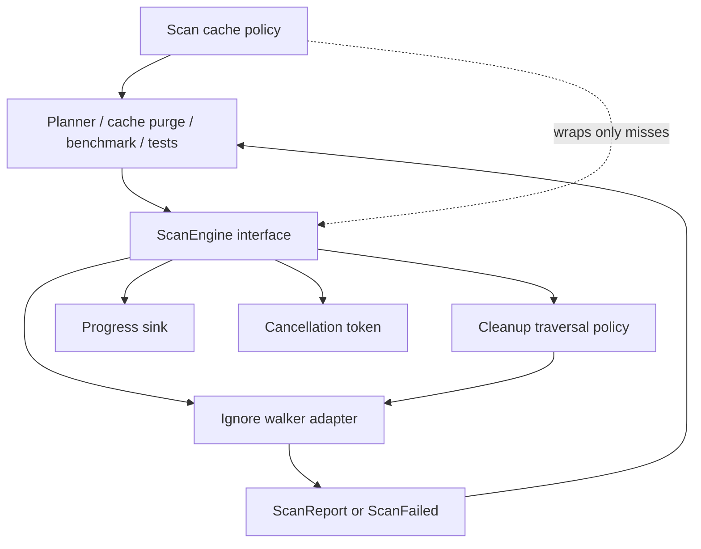

# Scan Engine Deep Module - Plan

## Goal Capsule

| Field | Value |
|---|---|
| Objective | Refactor Rebecca's cleanup scanner into a deep module with explicit cleanup measurement semantics and a small caller-facing interface. |
| Authority | User request to design and execute a fearless refactor, `docs/adr/0005-scan-engine-strategy.md`, current scan-cache and cleanup-core contracts. |
| Execution profile | Breaking refactor is allowed inside this repository; remove obsolete shallow scanner entry points when callers can move to the new interface. |
| Stop conditions | Stop if implementation would change product scope beyond cleanup measurement semantics, weaken safety policy, or require an unplanned NTFS/MFT fast path. |
| Tail ownership | `ce-work` / goal execution owns implementation, verification, review, commits, and memory updates. |

---

## Product Contract

### Summary

Rebecca's scanner should behave like a cleanup measurement engine, not like a search tool.
It should count rebuildable cleanup targets completely, including hidden files and files matched by `.gitignore`, `.ignore`, or global gitignore rules, while still refusing symlink or reparse-point traversal.

### Problem Frame

The current scanner already uses ripgrep's `ignore` crate and bounded target-level parallelism, but the scanner interface is shallow: callers know about direct path measurement functions, target scanning helpers, cancellation, progress callbacks, and scan-cache integration as separate concepts.
That shape makes future GUI and API work fragile because traversal policy, measurement semantics, progress, cache eligibility, and future acceleration points can drift across callers.

Ripgrep's successful pattern is not its text search pipeline for this product; the useful lesson is a configurable, well-tested traversal adapter hidden behind a focused interface.
Rebecca should keep that mature traversal dependency but own a cleanup-specific interface and policy.

### Requirements

**Cleanup measurement semantics**

- R1. Directory measurement must include hidden entries, `.gitignore`-ignored entries, `.ignore`-ignored entries, and the ignore files themselves when they exist under the measured root.
- R2. Scanner traversal must not follow symlinks or reparse-like entries, and a symlink root must remain blocked rather than silently measured.
- R3. File roots, directory roots, missing roots, unsupported roots, permission failures, and directory-loop failures must keep structured `ScanReport` or `ScanFailed` outcomes.

**Module interface**

- R4. Callers should use a small scan-engine interface that accepts a path, cancellation token, and progress sink, without knowing `ignore::WalkBuilder` configuration details.
- R5. Scan progress events must continue to support planner and CLI NDJSON progress without exposing traversal adapter internals.
- R6. Scan cache integration stays outside the traversal adapter, but it must call the new scan-engine interface so cache decisions and measurement decisions do not duplicate path metadata logic.

**Performance and future extension**

- R7. Target-level parallelism stays bounded through Rebecca's existing shared rayon budget; directory-internal parallel traversal is deferred until benchmark evidence justifies it.
- R8. The new module must leave a clean internal adapter seam for a future NTFS/USN/MFT or parallel-walker implementation without changing planner, cache, or CLI callers.

**Verification and documentation**

- R9. Regression tests must prove cleanup measurement ignores search-style ignore filters and preserves cancellation, ordering, symlink, and error behavior.
- R10. The scan engine ADR, benchmark baseline, and engineering memory must describe the new module boundary and the ripgrep lesson Rebecca is adopting.

### Scope Boundaries

- The refactor does not add NTFS/MFT acceleration.
- The refactor does not make project-artifact discovery use the scan engine; artifact discovery is a finder with pruning semantics, while the scan engine is a measurement module.
- The refactor does not add user-facing CLI flags for scan policy.

#### Deferred to Follow-Up Work

- Directory-internal parallel traversal using `WalkBuilder::build_parallel()` if benchmarks show single-root directories dominate scan time.
- A second concrete adapter for NTFS/USN/MFT metadata once the default cleanup measurement interface is stable.

---

## Planning Contract

### Key Technical Decisions

- KTD1. **External seam at the scan engine, not the walker:** `ignore::WalkBuilder` remains an internal adapter detail; planner, cache, CLI, benchmarks, and tests consume Rebecca scan types.
- KTD2. **Cleanup policy disables search ignore filters:** Rebecca should disable `ignore` crate standard filters for cleanup measurement so `.gitignore`, `.ignore`, git excludes, and hidden-file filters do not undercount cleanup targets.
- KTD3. **Preserve target-level bounded parallelism:** Rebecca already scans many cleanup targets with a bounded rayon pool; nested directory-level parallelism would complicate cancellation and progress ordering before evidence proves it is needed.
- KTD4. **Cache wraps measurement, not traversal:** scan-cache hit/miss/prune policy belongs to planner measurement code; the scan engine owns only actual filesystem measurement and progress emission.
- KTD5. **Break shallow public helpers when migration is local:** this crate is unpublished and the user authorized a breaking refactor, so obsolete functions such as direct `measure_directory_*` wrappers should be removed or made private instead of kept as permanent compatibility surface.

### High-Level Technical Design

The module should have one public measurement path and a private traversal adapter layer.
Future adapters can satisfy the same internal adapter role, but callers should not learn whether traversal came from `ignore`, NTFS metadata, or a parallel walker.

### Sources & Research

- `crates/rebecca-core/src/scan.rs` currently owns cancellation, progress events, reports, `WalkBuilder` configuration, path measurement, and target scanning helpers.
- `crates/rebecca-core/src/planner/measure.rs` wraps scanner measurement with scan-cache hit/miss/write-skip behavior.
- `crates/rebecca-core/src/parallelism.rs` owns the bounded 2..8 rayon budget used by scan and cleanup execution.
- `repo-ref/ripgrep/crates/ignore/src/walk.rs` shows `WalkBuilder` exposes `standard_filters`, hidden-file filtering, gitignore filtering, `same_file_system`, and parallel traversal as explicit policy choices.
- `repo-ref/ripgrep/crates/ignore/README.md` documents that default traversal respects ignore files and hidden-file behavior, which is the behavior Rebecca must not inherit silently for cleanup measurement.
- `docs/adr/0005-scan-engine-strategy.md` selects safe directory traversal as the default scan engine and keeps NTFS acceleration as future optional work.

### System-Wide Impact

The refactor affects cleanup plan estimates, CLI progress events, scan-cache reuse, cache purge size reporting, and benchmark baselines.
The expected behavior change is intentional: files hidden from search by ignore rules should now be counted when Rebecca measures a cleanup target.

### Risks & Dependencies

| Risk | Mitigation |
|---|---|
| Disabling search ignore filters increases measured bytes for targets under repositories. | Cover `.gitignore`, `.ignore`, and hidden-file fixtures in scanner tests and treat the increase as the intended cleanup semantics. |
| A wide scanner interface rewrite could break planner progress or NDJSON cleanup events. | Keep `ScanProgressEvent::FileMeasured` semantics stable and run core planner plus CLI clean contract tests. |
| Removing old helpers may make tests harder to read. | Replace tests with `ScanEngine`-level helpers so test surface matches the module interface. |
| Future parallel walker work could be blocked by an overly concrete interface. | Keep walker configuration and adapter selection private to the module and make report/progress types adapter-neutral. |

---

## Implementation Units

### U1. Lock cleanup measurement semantics with scanner characterization tests

- **Goal:** Add failing scanner tests that prove Rebecca counts entries hidden by search ignore rules and still blocks unsafe traversal.
- **Requirements:** R1, R2, R3, R9.
- **Dependencies:** None.
- **Files:** `crates/rebecca-core/tests/scan_engine.rs`.
- **Approach:** Extend the existing scanner fixture tests with `.gitignore`, `.ignore`, hidden dotfile, nested directory, regular file, file-root, and symlink-root cases. Expected byte counts should include ignored files and ignore files themselves when they are regular files under the measured root.
- **Execution note:** Start test-first for the ignore-policy cases so the current undercounting behavior is visible before implementation.
- **Patterns to follow:** Existing `scan_engine.rs` tempdir tests and structured `RebeccaError::ScanFailed` assertions.
- **Test scenarios:**
  - A directory containing `.gitignore` that ignores `ignored.bin` still reports bytes for `.gitignore`, `ignored.bin`, and non-ignored files.
  - A directory containing `.ignore` that ignores `ignored-by-ignore.bin` still reports bytes for `.ignore`, `ignored-by-ignore.bin`, and non-ignored files.
  - A directory containing `.hidden.bin` reports the hidden file bytes.
  - A symlink root returns a blocked target or safety error rather than a measured report.
  - A cancellation triggered after the first file still returns `OperationCancelled`.
- **Verification:** The new scanner tests fail before U2 and pass after the scan engine policy is implemented.

### U2. Introduce the deep scan engine module

- **Goal:** Replace the shallow scanner free-function cluster with a `ScanEngine`-style module interface and private traversal adapter.
- **Requirements:** R2, R3, R4, R5, R8.
- **Dependencies:** U1.
- **Files:** `crates/rebecca-core/src/scan.rs` or `crates/rebecca-core/src/scan/mod.rs`, optional private files under `crates/rebecca-core/src/scan/`, `crates/rebecca-core/src/lib.rs`.
- **Approach:** Define the caller-facing scan module around a measurement request, cancellation token, progress events, and report output. Move `ignore::WalkBuilder` setup behind a private adapter function or type configured with cleanup traversal policy: no standard search filters, no link following, and stable structured error conversion.
- **Patterns to follow:** `ScanCachePolicy` as an explicit policy seam, `parallelism.rs` for bounded shared execution, and `error.rs` for structured scan failure conversion.
- **Test scenarios:**
  - Measuring a file root produces a one-file `ScanReport` and one progress event.
  - Measuring a directory root produces cumulative file, byte, and directory counts.
  - Missing root metadata still maps to `ScanFailurePhase::RootMetadata`.
  - Entry metadata and directory walk failures still use structured `ScanFailure` values.
- **Verification:** Scanner tests compile against the new interface, and no caller constructs or configures `ignore::WalkBuilder` outside the scan module.

### U3. Migrate planner, scan cache, and cache purge callers

- **Goal:** Route all production measurement through the new scan engine interface.
- **Requirements:** R4, R5, R6.
- **Dependencies:** U2.
- **Files:** `crates/rebecca-core/src/planner/measure.rs`, `crates/rebecca-core/src/planner.rs`, `crates/rebecca-core/src/cache.rs`, `crates/rebecca-cli/src/clean.rs`.
- **Approach:** Update planner measurement and cache purge size accounting to use the new engine. Keep scan-cache hit/miss/write-skip logic in `planner/measure.rs`, but remove duplicate metadata assumptions where the scan engine can own them.
- **Patterns to follow:** Existing `PlanBuildContext` dependency injection style and planner progress event forwarding.
- **Test scenarios:**
  - A scan-cache miss falls through to the scan engine and emits file progress.
  - A scan-cache hit returns the cached `ScanReport` without filesystem traversal.
  - Cache purge measurement reports bytes, files, and directories through the new interface.
  - Ctrl+C cancellation from CLI still cancels planner scanning through the same token.
- **Verification:** Planner, cache, and CLI clean tests pass without any production caller using removed scanner helpers.

### U4. Replace target scanning helpers and benchmarks with engine-level orchestration

- **Goal:** Remove or privatize obsolete `scan_target`, `scan_targets`, and directory-only measurement helpers, replacing them with engine-level target orchestration where still needed.
- **Requirements:** R4, R7, R8, R9.
- **Dependencies:** U2, U3.
- **Files:** `crates/rebecca-core/src/scan.rs` or `crates/rebecca-core/src/scan/mod.rs`, `crates/rebecca-core/tests/scan_engine.rs`, `crates/rebecca-core/benches/scan_baseline.rs`.
- **Approach:** Keep bounded target-level parallelism behind the scan module if target batch measurement is still useful for benchmarks or tests. Delete public helpers that no production path uses, and migrate benchmarks to the new interface so performance evidence tracks the real module.
- **Patterns to follow:** Existing deterministic sorting in `scan_targets` and `run_scoped_scan` tests.
- **Test scenarios:**
  - Batch target measurement remains deterministic by rule id and path.
  - Bounded scan parallelism still uses the same 2..8 budget as cleanup execution.
  - Benchmark fixture still validates report counts and bytes for 1,024 files.
- **Verification:** `cargo check -p rebecca-core --benches` succeeds and scanner benchmark code no longer calls deleted helper functions.

### U5. Refresh scan-engine documentation and engineering memory

- **Goal:** Record the new module interface and the ripgrep-derived traversal lesson in durable project docs.
- **Requirements:** R10.
- **Dependencies:** U2, U3, U4.
- **Files:** `docs/adr/0005-scan-engine-strategy.md`, `docs/knowledge/engineering/current-state.md`, `docs/knowledge/engineering/log.md`, optional `docs/security-audit.md` if the scan semantics affect safety wording.
- **Approach:** Update the ADR from broad "parallel traversal" language to the current deep-module shape: cleanup measurement policy, internal `ignore` adapter, bounded target-level parallelism, and future optional adapters. Update memory after implementation and verification rather than using the plan as progress state.
- **Patterns to follow:** Existing engineering memory current-state and chronological log style.
- **Test scenarios:** Test expectation: none -- documentation-only unit.
- **Verification:** Engineering wiki memory validation passes and docs do not claim `.gitignore` is respected for cleanup measurement.

### U6. Full verification, simplification, review, and commit

- **Goal:** Prove the refactor is complete, simplify the final module shape, run review, and commit only the intended changes.
- **Requirements:** R1 through R10.
- **Dependencies:** U1, U2, U3, U4, U5.
- **Files:** All changed files from U1 through U5.
- **Approach:** Run focused tests first, then workspace gates. Review the diff for obsolete wrappers, duplicated traversal policy, and accidental caller knowledge of `ignore::WalkBuilder`. Commit with a Conventional Commit message after tests and review pass.
- **Patterns to follow:** Previous CLI API contract slice verification discipline and repository instruction to use `nextest` and `cargo fmt`.
- **Test scenarios:**
  - Focused scanner tests cover cleanup traversal semantics.
  - Planner tests cover cache hit and miss paths.
  - CLI clean tests cover cancellation/progress behavior.
  - Workspace tests cover cross-crate regressions.
- **Verification:** All Verification Contract gates pass, code review findings are resolved or explicitly recorded, and the final worktree contains only this refactor.

---

## Verification Contract

| Gate | Command | Proves |
|---|---|---|
| Scanner behavior | `cargo nextest run -p rebecca-core --test scan_engine` | Cleanup traversal semantics, cancellation, symlink blocking, deterministic target behavior. |
| Planner and cache integration | `cargo nextest run -p rebecca-core --test planner -p rebecca-core cache` | Scan-cache wrapping and planner progress still use the new scanner correctly. |
| CLI integration | `cargo nextest run -p rebecca-cli --test cli_clean -p rebecca-cli --test cli_output` | Human and machine cleanup surfaces still receive scan progress and cancellation outcomes. |
| Benchmark compile | `cargo check -p rebecca-core --benches` | Benchmark code tracks the new scanner interface. |
| Workspace tests | `cargo nextest run --workspace` | Cross-crate behavior remains intact. |
| Formatting | `cargo fmt --all -- --check` | Rust formatting is stable. |
| Lints | `cargo clippy --workspace --all-targets -- -D warnings` | Rust warnings remain clean. |
| Diff hygiene | `git diff --check` | No whitespace errors. |
| Memory validation | `python "$env:CODEX_HOME\skills\engineering-wiki-memory\scripts\wiki_memory.py" validate --root docs\knowledge\engineering` | Engineering memory remains structurally valid. |

---

## Definition of Done

- The scan module exposes one deep measurement interface and hides traversal adapter configuration.
- `.gitignore`, `.ignore`, global gitignore, and hidden-file search filters do not exclude cleanup measurement entries.
- Symlink and reparse-like traversal remains blocked or skipped according to current safety rules.
- Planner, scan-cache, cache purge, CLI cancellation, tests, and benchmarks use the new scanner interface.
- Obsolete shallow scanner helpers are removed or made private when no production caller needs them.
- Documentation and engineering memory describe the new scan-engine module boundary.
- All Verification Contract gates pass.
- The final commit is a focused Conventional Commit and does not stage unrelated user changes.
