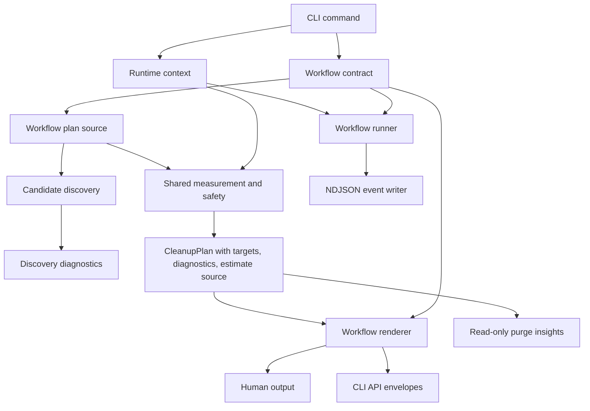

# Cleanup Workflow Architecture - Plan

## Goal Capsule

- **Objective:** Refactor Rebecca's cleanup workflow architecture so command identity, planning, discovery diagnostics, estimate provenance, and rendering are explicit extension points instead of workflow-specific branches hidden in shared code.
- **Authority:** Favor the best long-term shape over compatibility-preserving small patches. CLI API v1, the Windows-first safety model, recoverable trash execution, dry-run-first behavior, and existing project-artifact semantics remain the product contracts to preserve or update deliberately.
- **Stop Conditions:** Workflow command metadata is no longer inferred from `CleanupWorkflow`, the core planner no longer acts as a workflow dispatcher, project-artifact rules are maintainable as a typed registry, partial discovery is visible to users, cache-based estimates are labeled, human renderers are workflow-owned, and the next read-only project-space insight command can be added without duplicating purge internals.
- **Execution Profile:** Characterization-first for CLI API and planner behavior, refactor-first for core boundaries, then additive product work for the insight command after the architecture is stable.
- **Tail Ownership:** Remove transitional adapters, duplicate renderer paths, and dead-end catalog abstractions before declaring the refactor done.

---

## Product Contract

### Summary

Rebecca is already a useful Windows-first cleanup CLI, but its newest surfaces have grown through shared branches instead of clear module contracts.
The next refactor should make each workflow declare what it is, where its plan candidates come from, how it reports partial discovery, and how it renders output.
That gives the project room to become a top-tier cleaner without accumulating brittle `if workflow == ...` checks around every new capability.

### Problem Frame

The current implementation has several pressure points that will compound as Rebecca adds richer purge and app-cleaning workflows.
`run_workflow` installs cancellation, constructs scan-cache context, chooses NDJSON command identity, handles confirmation, executes plans, and calls a renderer.
`planner.rs` branches on `CleanupWorkflow` and mixes rules, app leftovers, and project artifacts behind one public entry point.
`project_artifacts/catalog.rs` combines definition data, selector aliases, context kinds, and predicate implementations in one large file.
`discovery.rs` skips unreadable directories with debug logs only, so users can undercount reclaimable space without seeing why.
`output.rs` remains both the machine API kernel and the human renderer for several workflow-specific views.

The user explicitly allows breaking changes and wants the best cleaner architecture, so this plan treats the current pre-release shape as malleable while preserving tested behavior through characterization coverage.

### Requirements

#### Workflow Contract

- R1. Every cleanup workflow supplies explicit command identity, payload kind, confirmation text, cancellation text, and renderer behavior to the shared runner.
- R2. JSON and NDJSON command fields come from the invoked command contract, not from a completed `CleanupPlan` after the fact.
- R3. Ctrl+C cancellation is owned by the CLI/runtime layer once per process and is passed into workflow execution.

#### Planning Core

- R4. Core planning separates common target measurement/finalization from workflow-specific candidate discovery.
- R5. The public planner API remains usable for existing tests and callers while the internal dispatcher becomes a thin compatibility adapter.
- R6. Project-artifact definitions and context predicates are split into a typed registry that can grow without a monolithic match table.

#### Diagnostics And Trust

- R7. Project-artifact discovery reports skipped roots, unreadable directories, unreadable entries, and metadata failures as structured diagnostics.
- R8. Cleanup targets expose estimate provenance so users and machine consumers can distinguish fresh scans from scan-cache hits or unmeasured targets.
- R9. Human output summarizes partial discovery and cached estimates without turning normal cleanup output into a noisy log dump.

#### Output And User Experience

- R10. `output.rs` stays focused on CLI API envelopes, error classification, NDJSON primitives, and shared formatting helpers.
- R11. Human rendering is owned by workflow-specific view modules that can evolve independently.
- R12. Rebecca gains a read-only project-space insight command after the refactor, reusing purge discovery and measurement without touching execution or history.
- R13. CLI docs, API schemas, examples, README, configuration docs, and engineering memory stay aligned with any machine-contract or command-surface change.

### Acceptance Examples

- AE1. Given `rebecca apps scan --format ndjson`, when the command emits started, progress, and completed events, then every event uses command `apps scan` instead of a generic or inferred cleanup command.
- AE2. Given `rebecca purge --format json`, when planning succeeds, then the success envelope command and payload kind are supplied by the purge workflow contract before rendering begins.
- AE3. Given a project-artifact scan that cannot read a child directory, when planning completes, then the result includes a structured discovery diagnostic and the human view reports that partial discovery occurred.
- AE4. Given `--scan-cache` and a fresh cache hit, when a target is rendered in JSON, then that target identifies its estimate source as scan-cache-derived.
- AE5. Given a fresh measurement without a scan-cache hit, when a target is rendered, then its estimate source is fresh-scan-derived.
- AE6. Given `project_artifacts/catalog.rs` gains a new artifact type, when tests exercise selector aliases and context anchors, then the change is made by adding registry data and a focused predicate rather than editing one large decision function.
- AE7. Given `rebecca purge inspect --root . --format json`, when it scans rebuildable project artifacts, then it returns a read-only insight payload and does not prompt, execute, or append cleanup history.
- AE8. Given the full workspace verification gate, when this refactor is complete, then existing clean, apps, purge, cache, history, scan-cache, and model-contract tests still pass.

### Scope Boundaries

#### In Scope

- Breaking internal Rust module APIs and pre-release CLI machine details when the plan updates tests, schemas, and docs in the same slice.
- Refactoring `run_workflow` into explicit workflow contracts and runtime context.
- Refactoring planner workflow dispatch into workflow-owned plan sources.
- Splitting project-artifact catalog data from context predicate implementation.
- Adding structured project-artifact discovery diagnostics.
- Adding estimate provenance to cleanup targets and renderers.
- Moving workflow-specific human rendering out of `output.rs`.
- Adding a read-only project-artifact insight command after the architecture supports it.

#### Deferred To Follow-Up Work

- External plugin loading for third-party cleanup rules.
- A first-party GUI.
- Duplicate-file detection, empty-directory cleanup, registry cleanup, or uninstall automation.
- Cross-platform cleanup execution beyond the current Windows-first contract.
- A stronger directory fingerprint that scans child entries before trusting cache records; this remains a later performance trade-off once provenance is visible.

#### Outside This Product's Identity

- Permanent deletion as the default cleanup mode.
- Hiding partial filesystem access failures because a dry run still produced some results.
- Treating cache estimates as equivalent to fresh scans without telling the user.
- Copying rule data or source code from reference cleaners instead of using them as behavior and architecture benchmarks.

---

## Planning Contract

### Key Technical Decisions

- KTD1. Workflow identity belongs in a workflow contract supplied before planning starts. This removes the current hard-coded NDJSON command and prevents JSON or error rendering from depending on a completed plan.
- KTD2. Cancellation belongs to a runtime context created at CLI entry. Workflow functions should consume a `ScanCancellationToken`; they should not install process-global Ctrl+C handlers.
- KTD3. The core planner should expose workflow-specific plan sources and keep shared logic in measurement, dedupe, safety assessment, scan-cache, and finalization helpers.
- KTD4. Project-artifact catalog data should become a typed Rust registry first, not a TOML catalog yet. The definitions are data-like, but the context anchors are executable predicates that need compile-time tests and tight coupling to safety logic.
- KTD5. Discovery diagnostics should be plan-level observations, not fake cleanup targets. This keeps target counts meaningful while making partial scans visible.
- KTD6. Estimate provenance should be additive and target-level. Existing estimated byte fields remain stable, while `estimate_source` explains whether the bytes came from a fresh scan, scan cache, or no measurement.
- KTD7. Renderers should be selected by workflow contract. `output.rs` should own envelopes and event primitives, while `clean_view.rs`, `purge_view.rs`, and future renderer modules own human presentation.
- KTD8. The read-only insight command should reuse the purge plan source and measurement path. It must not create a second project-artifact scanner or reuse deletion-oriented confirmation/history code.

### Assumptions

- Rebecca remains pre-release enough that machine-contract additions and command-field corrections are acceptable when schema docs and tests move with them.
- The existing `rebecca.cli.v1` version can accept additive fields such as diagnostics and estimate provenance; a new API version is only needed if existing field meanings change.
- `repo-ref/` stays a reference-only directory. Borrow architecture ideas from `czkawka`, `kondo`, `cargo-cache`, `bleachbit`, `rmlint`, and `dust`, but do not copy code or incompatible rule data.
- Permission-denied discovery tests may need a small filesystem adapter because Windows, Linux, and CI differ in how temp-directory permissions behave.

### Priority Order

| Priority | Units | Rationale |
|---|---|---|
| P1 | U1, U2, U3, U4 | These units remove architectural coupling that would make every later feature more expensive or more brittle. |
| P2 | U5, U6, U7 | These units improve user trust and maintainability once the core contracts are explicit. |
| P3 | U8 | This adds the next user-visible "best cleaner" capability after the shared foundation can support it cleanly. |

### High-Level Technical Design

### Phased Delivery

1. Stabilize workflow contracts and cancellation ownership before touching planner internals.
2. Extract plan sources and project-artifact registry boundaries while preserving existing behavior through characterization tests.
3. Add diagnostics, estimate provenance, and renderer separation after the plan model can carry the new information.
4. Add `purge inspect` only after the purge source and renderer can be reused without duplicating logic.

---

## Implementation Units

### U1. Make workflow command and payload identity explicit

- **Goal:** Remove command and payload inference from shared output code and make each workflow declare its machine contract before planning starts.
- **Requirements:** R1, R2, R13; AE1, AE2
- **Dependencies:** None.
- **Files:** `crates/rebecca/src/clean.rs`, `crates/rebecca/src/apps.rs`, `crates/rebecca/src/purge.rs`, `crates/rebecca/src/output.rs`, `crates/rebecca/tests/cli_api.rs`, `crates/rebecca/tests/cli_apps.rs`, `crates/rebecca/tests/cli_purge.rs`, `docs/api/cli/v1/README.md`, `docs/api/cli/v1/event.schema.json`, `docs/api/cli/v1/payloads.schema.json`, `docs/api/cli/v1/examples/event-completed.json`
- **Approach:** Add a small workflow identity structure to `WorkflowRunOptions` with command, payload kind, display title, and event command labels. Use it to construct `NdjsonEventWriter`, success envelopes, cancellation events, and terminal error events. Keep `cleanup_plan_command` and `cleanup_plan_payload_kind` only as temporary compatibility helpers during the migration, then delete them once all call sites pass explicit identity.
- **Execution note:** Start with CLI contract tests for current `clean`, `apps scan`, `apps clean`, and `purge` JSON/NDJSON command fields so the breaking corrections are reviewable.
- **Patterns to follow:** The existing CLI API v1 envelope helpers in `crates/rebecca/src/output.rs` and binary-level contract tests in `crates/rebecca/tests/cli_api.rs`.
- **Test scenarios:**
  - `clean --format ndjson --no-progress` emits lifecycle events with command `clean`.
  - `apps scan --format ndjson --no-progress` emits lifecycle events with command `apps scan`.
  - `apps clean --format json --dry-run --no-progress` returns a success envelope with command `apps clean`.
  - `purge --format ndjson --root <fixture> --min-age-days 0 --no-progress` emits started and completed events with command `purge`.
  - A plan-build error in NDJSON mode terminates with an error event using the workflow command label.
- **Verification:** CLI API, apps, and purge contract tests prove command identity is explicit across success, progress, cancellation, and error output.

### U2. Move cancellation and runtime setup out of workflow execution

- **Goal:** Make cancellation and shared runtime state process-owned rather than workflow-owned.
- **Requirements:** R1, R3; AE8
- **Dependencies:** U1.
- **Files:** `crates/rebecca/src/main.rs`, `crates/rebecca/src/clean.rs`, `crates/rebecca/src/apps.rs`, `crates/rebecca/src/purge.rs`, `crates/rebecca/src/output.rs`, `crates/rebecca/tests/cli_api.rs`, `crates/rebecca/tests/cli_clean.rs`, `crates/rebecca-core/tests/scan_engine.rs`
- **Approach:** Introduce a CLI runtime context that contains the cancellation token, runtime config, protected storage, and scan-cache policy inputs needed by workflow runners. Install Ctrl+C handling once at entry and pass the token into `run_workflow_with_runtime_config`. Keep testable constructors for command modules so integration tests can still exercise workflows without installing a global handler repeatedly.
- **Execution note:** Characterize cancellation event behavior before moving the handler so user-visible cancellation text and machine terminal events stay stable.
- **Patterns to follow:** `ScanCancellationToken` in `crates/rebecca-core/src/scan.rs` and the existing `PlanBuildContext` builder shape in `crates/rebecca-core/src/planner.rs`.
- **Test scenarios:**
  - Calling workflow runner helpers in-process does not attempt to install a second Ctrl+C handler.
  - A cancelled plan build still returns a human cancellation message in human mode.
  - A cancelled plan build still emits a terminal cancellation event in NDJSON mode.
  - Runtime config and protected paths still reach clean, apps, and purge planning after the context move.
- **Verification:** Command integration tests and core scan cancellation tests prove cancellation remains observable while runtime setup is no longer embedded in each workflow.

### U3. Extract workflow plan sources from the central planner

- **Goal:** Turn `planner.rs` from a workflow dispatcher into a shared plan builder fed by workflow-specific sources.
- **Requirements:** R4, R5; AE8
- **Dependencies:** U1, U2.
- **Files:** `crates/rebecca-core/src/planner.rs`, `crates/rebecca-core/src/planner/measure.rs`, `crates/rebecca-core/src/planner/source.rs`, `crates/rebecca-core/src/planner/rules.rs`, `crates/rebecca-core/src/planner/app_leftovers.rs`, `crates/rebecca-core/src/planner/project_artifacts.rs`, `crates/rebecca-core/tests/planner.rs`, `crates/rebecca-core/tests/executor_contract.rs`, `crates/rebecca-core/tests/model_contract.rs`
- **Approach:** Create an internal `WorkflowPlanSource` boundary that yields candidate targets or workflow-specific candidates plus validation diagnostics. Move rules, app leftovers, and project artifacts into separate source modules. Keep the current public `build_cleanup_plan_with_context` function as a compatibility adapter that selects the source from `PlanRequest`, then routes through the common builder.
- **Execution note:** Add characterization tests around each existing workflow before moving code, then refactor module boundaries behind the preserved public function.
- **Patterns to follow:** The existing `measure.rs` split for target measurement and the recent `ScanEngine` deep-module refactor that hides traversal details behind a caller-facing module.
- **Test scenarios:**
  - Rules workflow validates categories and rule ids exactly as before.
  - App-leftovers workflow derives the same skipped and allowed targets for the same application fixture.
  - Project-artifacts workflow returns the same candidates, modified-at fields, deletion style, and restore hints for existing fixtures.
  - Public planner entry points still compile and behave for tests that call `build_cleanup_plan` or `build_cleanup_plan_with_context`.
  - Shared measurement still emits scan-cache and file-progress events for all workflows that measure paths.
- **Verification:** Core planner, model-contract, and executor-contract tests prove the refactor changed ownership boundaries without changing plan semantics.

### U4. Split the project-artifact catalog into definitions and context predicates

- **Goal:** Make project-artifact coverage extensible without growing one monolithic catalog file.
- **Requirements:** R6, R13; AE6
- **Dependencies:** U3.
- **Files:** `crates/rebecca-core/src/project_artifacts.rs`, `crates/rebecca-core/src/project_artifacts/catalog.rs`, `crates/rebecca-core/src/project_artifacts/definitions.rs`, `crates/rebecca-core/src/project_artifacts/context.rs`, `crates/rebecca-core/tests/project_artifacts.rs`, `crates/rebecca/tests/cli_purge.rs`, `docs/configuration.md`, `README.md`
- **Approach:** Split artifact definitions, selector aliases, context kind declarations, and predicate implementations into separate modules. Use a typed registry that maps each definition to a `ProjectArtifactContextKind`, then maps the context kind to a predicate. Keep `CACHEDIR.TAG` as a first-class built-in source because it is a protocol-like marker rather than a normal directory-name rule.
- **Execution note:** Preserve all current selector and context-match tests before moving definitions so a future artifact addition only needs one local test block.
- **Patterns to follow:** The TOML-backed normal rule catalog's strict metadata discipline, without moving project-artifact predicates into TOML before they are data-only.
- **Test scenarios:**
  - `node_modules`, `target`, `dist`, `.next`, Python cache, .NET `bin`/`obj`, Composer `vendor`, and `CACHEDIR.TAG` fixtures still match the same rule ids.
  - Selector aliases still accept directory name, rule suffix, and full project-artifact rule id.
  - Generic output directories still require a project anchor and do not match arbitrary folders.
  - Known artifact directory names that fail context checks are pruned rather than recursively scanned as generic children.
  - `purge --list-artifacts --format json` still returns the complete selector catalog.
- **Verification:** Project-artifacts core tests and purge CLI tests prove the registry split preserved behavior and made additions localized.

### U5. Surface project-artifact discovery diagnostics

- **Goal:** Turn partial filesystem discovery from debug-only logs into structured user-visible diagnostics.
- **Requirements:** R7, R9, R13; AE3
- **Dependencies:** U3, U4.
- **Files:** `crates/rebecca-core/src/project_artifacts.rs`, `crates/rebecca-core/src/project_artifacts/discovery.rs`, `crates/rebecca-core/src/planner/project_artifacts.rs`, `crates/rebecca-core/src/plan.rs`, `crates/rebecca/src/purge_view.rs`, `crates/rebecca/src/output.rs`, `crates/rebecca/tests/cli_purge.rs`, `crates/rebecca-core/tests/project_artifacts.rs`, `docs/api/cli/v1/payloads.schema.json`, `docs/api/cli/v1/event.schema.json`, `docs/api/cli/v1/examples/success-purge.json`
- **Approach:** Change project-artifact discovery to return candidates plus diagnostics. Add diagnostic kinds for inaccessible root, unreadable directory, unreadable directory entry, metadata unavailable, and ignored reparse-like paths when that information is useful. Propagate diagnostics into the plan or a purge-specific plan extension, summarize counts in human output, and include structured diagnostics in JSON. Emit NDJSON warning events only when they are useful for long-running scans and do not duplicate the final payload excessively.
- **Execution note:** Use a small filesystem adapter or injectable read-dir abstraction if portable permission-error tests cannot be written against real temp directories.
- **Patterns to follow:** Existing stable `CleanupTargetIssueReason` labels and the warning-conscious posture in BleachBit's protected-path handling, while keeping Rebecca's target counts clean.
- **Test scenarios:**
  - An unreadable child directory produces a diagnostic and does not abort the whole purge plan.
  - A missing configured root remains a non-crashing discovery outcome with the agreed diagnostic or skip behavior.
  - A reparse-like directory is skipped without recursive traversal and is represented consistently.
  - Human purge output reports a concise partial-discovery summary when diagnostics exist.
  - JSON purge output includes diagnostic objects with kind, path, and detail fields.
  - NDJSON output remains valid one-object-per-line when diagnostics are present.
- **Verification:** Core project-artifact tests and purge CLI API tests prove partial scans are visible without polluting cleanup target semantics.

### U6. Add target-level estimate provenance

- **Goal:** Make scan-cache reuse transparent so users can tell which byte estimates were freshly measured and which were reused.
- **Requirements:** R8, R9, R13; AE4, AE5
- **Dependencies:** U3, U5.
- **Files:** `crates/rebecca-core/src/plan.rs`, `crates/rebecca-core/src/planner/measure.rs`, `crates/rebecca-core/src/scan_cache.rs`, `crates/rebecca/src/clean_view.rs`, `crates/rebecca/src/purge_view.rs`, `crates/rebecca/src/output.rs`, `crates/rebecca-core/tests/planner.rs`, `crates/rebecca-core/tests/model_contract.rs`, `crates/rebecca/tests/cli_clean.rs`, `crates/rebecca/tests/cli_purge.rs`, `docs/api/cli/v1/payloads.schema.json`, `docs/api/cli/v1/examples/success-clean.json`, `docs/api/cli/v1/examples/success-purge.json`
- **Approach:** Add a serializable `EstimateSource` enum to cleanup targets or target projections. Set it from measurement code when a fresh scan completes, when a scan-cache hit supplies bytes, when measurement is skipped, or when a target has no measurable bytes. Human output should summarize cache-derived estimates and optionally tag large cached targets; machine output should include the field in target payloads.
- **Execution note:** Keep byte totals unchanged. This unit explains trust level; it should not change estimate arithmetic.
- **Patterns to follow:** Existing scan-cache progress events and the `ScanCacheProgressSummary` human summary pattern.
- **Test scenarios:**
  - A first scan with `--scan-cache` records targets as fresh-scan estimates.
  - A second scan over an unchanged cacheable target records targets as scan-cache estimates.
  - Skipped or blocked targets with zero estimate do not pretend to have a fresh measurement.
  - JSON schema and examples accept the new estimate provenance field.
  - Human clean and purge output mention cached estimates without overwhelming target details.
- **Verification:** Planner, model-contract, clean CLI, and purge CLI tests prove provenance is additive, serialized, and visible.

### U7. Split workflow human renderers from the CLI API kernel

- **Goal:** Keep shared machine output code small while giving clean, apps, purge, cache, and history their own presentation boundaries.
- **Requirements:** R10, R11, R13; AE8
- **Dependencies:** U1, U5, U6.
- **Files:** `crates/rebecca/src/output.rs`, `crates/rebecca/src/clean_view.rs`, `crates/rebecca/src/purge_view.rs`, `crates/rebecca/src/cache_view.rs`, `crates/rebecca/src/history_view.rs`, `crates/rebecca/src/render.rs`, `crates/rebecca/src/render/clean.rs`, `crates/rebecca/src/render/purge.rs`, `crates/rebecca/tests/output.rs`, `crates/rebecca/tests/cli_clean.rs`, `crates/rebecca/tests/cli_apps.rs`, `crates/rebecca/tests/cli_purge.rs`, `crates/rebecca/tests/cli_cache.rs`, `crates/rebecca/tests/cli_history.rs`
- **Approach:** Move human plan rendering behind workflow renderer functions or small renderer structs selected by the workflow contract. Leave `print_success`, error rendering, `NdjsonEventWriter`, `format_bytes`, and shared envelope helpers in `output.rs`. Remove workflow-specific branches from `print_plan_with_events` and let the runner call a renderer supplied by `WorkflowRunOptions`.
- **Execution note:** Use snapshot-like assertions or focused substring tests around existing human output before moving code so renderer changes stay intentional.
- **Patterns to follow:** Existing projection types in `clean_view.rs`, `purge_view.rs`, `cache_view.rs`, and `history_view.rs`.
- **Test scenarios:**
  - Clean human output still reports workflow, mode, counters, issue matrix, scan-cache summary, largest targets, and grouped target details.
  - Apps human output uses app-leftovers workflow text without falling through to generic cleanup labels.
  - Purge human output still groups by project path, artifact type, recent modifications, diagnostics, and estimate provenance.
  - Cache and history human outputs remain unchanged except for shared formatting helpers.
  - JSON and NDJSON output keep the same envelopes after renderer extraction.
- **Verification:** CLI output tests and workflow-specific CLI tests prove renderer ownership moved without regressing user-visible output.

### U8. Add a read-only `purge inspect` project-space insight command

- **Goal:** Give users a safer way to understand where rebuildable project space is going before choosing a purge action.
- **Requirements:** R12, R13; AE7
- **Dependencies:** U3, U4, U5, U6, U7.
- **Files:** `crates/rebecca/src/cli.rs`, `crates/rebecca/src/purge.rs`, `crates/rebecca/src/purge_view.rs`, `crates/rebecca-core/src/project_artifacts.rs`, `crates/rebecca-core/src/project_artifacts/insights.rs`, `crates/rebecca-core/tests/project_artifacts.rs`, `crates/rebecca/tests/cli_purge.rs`, `docs/api/cli/v1/payloads.schema.json`, `docs/api/cli/v1/README.md`, `README.md`, `docs/configuration.md`
- **Approach:** Add a `purge inspect` subcommand that accepts the same root, depth, age, artifact, exclude, output-mode, no-progress, and scan-cache options as purge planning, but never confirms, executes, or writes history. Build an insight report from the project-artifact plan source: top artifacts by bytes, totals by root/project/artifact kind, diagnostics, and estimate provenance. Keep the default display dense and scannable rather than marketing-like.
- **Execution note:** Implement this after renderer and plan-source extraction so it reuses shared purge internals instead of copying them.
- **Patterns to follow:** `dust` for top-space insight shape, `kondo` for project artifact cleanup posture, and Rebecca's existing dry-run purge safety contract.
- **Test scenarios:**
  - `purge inspect --root <fixture> --min-age-days 0 --format json` returns an insight payload with totals and top artifacts.
  - `purge inspect` honors `--artifact`, `--max-depth`, `--exclude`, and configured roots the same way purge planning does.
  - `purge inspect --yes` is rejected or unavailable because the command is read-only.
  - `purge inspect` does not append history.
  - Human output sorts top artifacts by estimated bytes and includes diagnostics when partial discovery occurred.
  - NDJSON output remains one-object-per-line for long scans and ends with a terminal insight report.
- **Verification:** Purge CLI and project-artifact core tests prove the new command is read-only, shares purge semantics, and gives actionable space insight.

---

## Verification Contract

| Gate | Command | Proves |
|---|---|---|
| Format | `cargo fmt --all --check` | Rust formatting stayed stable across refactored modules. |
| Lint | `cargo clippy --workspace --all-targets -- -D warnings` | New abstractions, renderers, and plan models stay warning-free. |
| Core planning | `cargo nextest run -p rebecca-core --test planner -p rebecca-core --test project_artifacts -p rebecca-core --test model_contract -p rebecca-core --test executor_contract` | Plan-source extraction, project-artifact registry behavior, target serialization, and execution compatibility remain intact. |
| CLI contracts | `cargo nextest run -p rebecca --test cli_api -p rebecca --test cli_apps -p rebecca --test cli_purge -p rebecca --test cli_clean` | Workflow identity, NDJSON events, purge diagnostics, estimate provenance, and human output stay aligned. |
| Output surfaces | `cargo nextest run -p rebecca --test output -p rebecca --test cli_output -p rebecca --test cli_cache -p rebecca --test cli_history` | Shared API rendering and non-workflow outputs did not regress while `output.rs` shrank. |
| Workspace | `cargo nextest run --workspace` | The refactor did not destabilize unrelated crates or tests. |
| Documentation hygiene | `git diff --check` | Markdown, schemas, examples, and Rust files avoid whitespace and line-ending damage. |

---

## Definition of Done

- Workflow command identity and payload kind are explicit inputs to the shared runner, with tests covering clean, apps scan, apps clean, and purge in JSON and NDJSON modes.
- Ctrl+C handling is installed once by CLI runtime setup, and workflow runners consume a cancellation token without owning process-global handler setup.
- Core planner internals use workflow-specific plan sources and shared measurement/finalization helpers, while existing public planner entry points remain covered.
- Project-artifact catalog additions are localized to definition registry and context predicate modules.
- Project-artifact partial discovery is visible in human, JSON, and NDJSON output without corrupting cleanup target counts.
- Cleanup targets or their API projections expose estimate provenance for fresh scans, scan-cache hits, and unmeasured targets.
- `output.rs` no longer contains workflow-specific human rendering branches.
- `purge inspect` exists as a read-only project-space insight command and shares purge discovery, filtering, diagnostics, and estimate provenance.
- CLI API schemas, examples, README, configuration docs, and engineering memory describe the final contract.
- Temporary compatibility helpers and abandoned refactor experiments are removed from the final diff.

---

## Alternative Approaches Considered

| Alternative | Why not |
|---|---|
| Patch only the NDJSON command mismatch | It would fix the visible bug while leaving planner dispatch, catalog coupling, diagnostics, and renderer growth untouched. |
| Externalize project-artifact catalog to TOML immediately | Normal cleanup rules are data-like, but project-artifact context checks are executable predicates. A typed Rust registry is the safer intermediate step. |
| Add `purge inspect` before refactoring | It would duplicate the current purge discovery and renderer branches, increasing the exact coupling this plan is trying to remove. |
| Strengthen directory scan-cache fingerprints before adding provenance | Stronger fingerprints can require walking children, which competes with the performance purpose of scan-cache. Provenance is the first trust fix; stronger fingerprints can follow if measured need appears. |
| Create a plugin system now | Plugins are valuable later, but the current bottleneck is internal workflow architecture. A plugin surface before these contracts would freeze the wrong boundaries. |

---

## Risk Analysis & Mitigation

| Risk | Impact | Mitigation |
|---|---|---|
| Over-abstraction makes the planner harder to read | High | Keep plan-source boundaries small and preserve shared measurement helpers instead of creating a framework. |
| CLI API additions surprise current local scripts | Medium | Update schemas, examples, README, and tests in the same units; treat command-field corrections as deliberate pre-release breaks. |
| Discovery diagnostics become noisy | Medium | Summarize diagnostics in human output and keep detailed paths in machine output. Do not create one cleanup target per skipped entry. |
| Permission-error tests are flaky across platforms | Medium | Add a minimal discovery filesystem adapter when real permission fixtures are not portable. |
| Estimate provenance is misread as cache correctness | Medium | Document that provenance explains source, not perfect freshness. Keep `--scan-cache` opt-in and freshness-bounded. |
| The refactor is too wide for one landing | High | Land in the priority order above and keep each unit independently testable. U8 can ship after U1-U7 if review needs a smaller merge. |

---

## System-Wide Impact

This plan touches the CLI command runner, workflow modules, CLI API envelopes, NDJSON events, core planner internals, project-artifact discovery, cleanup target serialization, human output projections, API schemas, and user documentation.
The intended impact is a cleaner internal architecture with a more honest user-facing contract: Rebecca should say what command is running, where candidates came from, what could not be scanned, and whether a byte estimate is fresh or cached.

---

## Documentation Plan

- Update `docs/api/cli/v1/README.md`, schemas, and examples whenever command labels, diagnostics, estimate provenance, or insight payloads change.
- Update `README.md` with concise examples for `purge inspect`, diagnostics, and estimate provenance.
- Update `docs/configuration.md` if purge roots, scan-cache trust language, or project-artifact options gain new behavior.
- Update `docs/knowledge/engineering/current-state.md` and `docs/knowledge/engineering/log.md` after the refactor lands so future work starts from the new architecture baseline.

---

## Sources / Research

- `crates/rebecca/src/clean.rs` for current workflow runner, progress, cancellation, and event writer ownership.
- `crates/rebecca/src/apps.rs` and `crates/rebecca/src/purge.rs` for workflow-specific invocation details.
- `crates/rebecca/src/output.rs` for CLI API envelopes, NDJSON events, error mapping, and current workflow-specific rendering branches.
- `crates/rebecca-core/src/planner.rs` and `crates/rebecca-core/src/planner/measure.rs` for workflow dispatch and shared measurement/finalization logic.
- `crates/rebecca-core/src/project_artifacts/catalog.rs` and `crates/rebecca-core/src/project_artifacts/discovery.rs` for project-artifact definition, context, and traversal behavior.
- `crates/rebecca-core/src/plan.rs` and `crates/rebecca-core/src/scan_cache/store.rs` for serializable cleanup targets and cache freshness behavior.
- `docs/api/cli/v1/README.md`, `docs/configuration.md`, `docs/knowledge/engineering/current-state.md`, and `docs/knowledge/engineering/log.md` for current shipped contracts and engineering baseline.
- `repo-ref/czkawka` for cleaner architecture that separates scanning logic from presentation.
- `repo-ref/kondo` for project artifact cleanup posture and user-facing project sweeps.
- `repo-ref/cargo-cache` for domain-specific cache reporting ideas.
- `repo-ref/bleachbit` for safety-first cleaner behavior and protected-path caution.
- `repo-ref/rmlint` for output-format and long-running scan reporting discipline.
- `repo-ref/dust` for read-only disk-usage insight shape.
