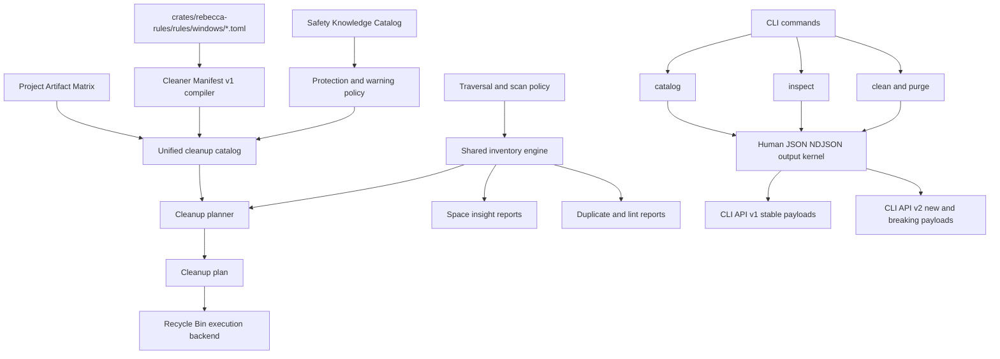

# Cleanup Intelligence Platform - Plan

## Goal Capsule

| Field | Value |
|---|---|
| Objective | Refactor Rebecca from a Windows-first cleanup CLI into a governed cleanup intelligence platform: manifest-backed cleaners, auditable safety knowledge, canonical catalogs, generic space inspection, stronger project-artifact trimming, and report-only duplicate/large/empty linting. |
| Authority | User request allows fearless refactoring, breaking changes, and deletion of obsolete code; existing safety doctrine in `docs/security-audit.md`, rule provenance in `docs/knowledge/engineering/conventions/rule-sources.md`, and the current CLI API contract still constrain unsafe behavior. |
| Execution profile | Deep cross-cutting implementation, executed in dependency order from catalog/safety foundations to inspection and lint reporting. |
| Stop conditions | All implementation units satisfy their test scenarios, machine-readable contracts are documented under `docs/api/cli/`, no GPL rule data or code is copied from `repo-ref/`, and no obsolete compatibility layer remains unless this plan explicitly keeps it. |
| Tail ownership | Implementation tracks progress outside this file; the plan stays a stable decision artifact. |

---

## Product Contract

### Summary

Rebecca should become a cleanup platform that explains what can be cleaned, why it is safe, what warnings apply, and which read-only insights led to deletion candidates.
The next product step is not another batch of path rules; it is a governed model that can absorb BleachBit-style cleaner manifests, dust-style space insight, kondo/cargo-cache-style project cache policies, and czkawka/rmlint-style lint reports without turning the CLI into a collection of unrelated commands.

### Problem Frame

The current architecture is much cleaner after the workflow and output-contract refactor, but several product concerns still live in separate shapes.
Built-in Windows cleanup rules are TOML files compiled directly into `RuleDefinition`, project artifacts are a separate const catalog, protected paths are mostly code-level predicates, and `purge inspect` is project-artifact-specific instead of a general insight surface.
This creates a ceiling: new cleanup families can be added, but safety warnings, selector discovery, rule contribution, and inspection features will keep duplicating semantics unless the catalog and scan layers become first-class.

The open-source references point in the same direction.
BleachBit proves that a cleaner manifest and protected-path knowledge base scale better than ad hoc rule code.
Dust proves that users need a fast top-N view before they decide what to clean.
Kondo and cargo-cache prove that developer artifacts need age, project type, and trim policies rather than blanket deletion.
Czkawka and rmlint prove that duplicate and lint tools must be report-first, core-first, and explicit about hardlink/reference handling.

### Requirements

**Catalog and Manifest Governance**

- R1. Rebecca has a versioned Cleaner Manifest v1 domain that models cleaner identity, options/selectors, actions, warnings, safety level, restore hint, provenance, and target resolution without copying external rule data.
- R2. Built-in rule files under `crates/rebecca-rules/rules/windows/` compile through the manifest domain, and obsolete direct parsing paths are removed after migration.
- R3. Rule, project-artifact, warning, and safety entries are visible through one canonical catalog model so users and machine consumers can discover what Rebecca knows before running cleanup.
- R4. Catalog validation rejects broad roots, unsafe relative targets, missing restore hints, unknown manifest fields, unsupported action kinds, and provenance that violates `docs/knowledge/engineering/conventions/rule-sources.md`.

**Safety and Warning Posture**

- R5. Rebecca has an auditable Safety Knowledge Catalog for protected paths, protected categories, allowlisted maintenance paths, and warning families, while retaining code predicates for dynamic path semantics that cannot be safely expressed as data.
- R6. Cleanup planning emits structured warning metadata for warning-bearing rules and targets, including active-process, broad-discovery, durable-state-nearby, special-action, permission-sensitive, and source-boundary warnings.
- R7. Warning-bearing targets are excluded or downgraded by default unless the user selects the named warning gate; `--allow-moderate` and `--allow-risky` may become compatibility aliases over the new gate model.
- R8. Windows active-process diagnostics identify when a known application cache is likely in use and surface this in `doctor`, catalog output, cleanup plans, and read-only inspection where relevant.

**Inspection and Space Intelligence**

- R9. A canonical `inspect` surface supports read-only space insight with roots, top-N entries, byte and file-count metrics, traversal diagnostics, estimate source, and JSON/NDJSON output.
- R10. `purge inspect` is reimplemented through the generic inspection engine or replaced by a canonical `inspect artifacts` surface with only intentional compatibility left behind.
- R11. Project-artifact insight reports group by root, project, artifact kind, status, age policy, and trim eligibility, not just by raw target path.

**Project Artifact Cleanup**

- R12. Project artifacts are modeled as a governed matrix of artifact kind, project context, anchors, default age policy, restore hint, deletion style, and trim eligibility.
- R13. Project artifact cleanup supports kondo/cargo-cache-inspired controls for older-than selection, reclaim limits, and top cache items while preserving explicit preview, confirmation, exclusion, and Recycle Bin execution.

**Lint Reports**

- R14. Rebecca can produce report-only duplicate, large-file, empty-file, and empty-directory lint reports from the shared scan inventory without deleting or rewriting user files.
- R15. Duplicate reports use size bucketing, optional prehash, full-content hash confirmation, and reference/protected root handling so reported reclaim estimates are conservative.

**Contracts, Documentation, and Cleanup**

- R16. Machine-readable breaking changes move to a documented CLI API v2 contract; existing v1 payloads are not silently redefined.
- R17. The implementation removes dead adapters, empty placeholders, duplicated render branches, and outdated docs that no longer match the canonical catalog and inspect surfaces.
- R18. The changelog `Unreleased` section records user-visible command, schema, and safety behavior changes when implementation lands.

### Key Flows

- F1. Catalog authoring flow
  - **Trigger:** A maintainer adds or changes a built-in Windows cleaner.
  - **Steps:** The manifest parser validates schema, the safety catalog validates targets, provenance validation checks source boundaries, and the compiled catalog exposes the rule through CLI and machine output.
  - **Outcome:** Unsafe or under-documented rules fail before runtime; valid rules are discoverable and explainable.
  - **Covers:** R1, R2, R3, R4.

- F2. Safe cleanup planning flow
  - **Trigger:** A user runs cleanup with a category, rule, artifact, or warning selection.
  - **Steps:** Catalog selection resolves to typed candidates, warning gates filter or downgrade targets, active-process diagnostics annotate risky candidates, protection policy revalidates paths, and the plan renders human and machine output.
  - **Outcome:** Cleanup remains dry-run-first and every blocked/skipped target has a structured reason.
  - **Covers:** R5, R6, R7, R8, R16.

- F3. Space inspection flow
  - **Trigger:** A user runs `inspect` against one or more roots.
  - **Steps:** The shared scan inventory applies traversal policy, builds aggregate metrics, reports top-N paths, and emits diagnostics for skipped paths and protected boundaries.
  - **Outcome:** The user can identify space hotspots without entering a cleanup workflow.
  - **Covers:** R9, R10, R11.

- F4. Project artifact trim flow
  - **Trigger:** A user wants to reclaim developer workspace space.
  - **Steps:** Rebecca discovers artifact candidates with project context, applies age and reclaim-limit policy, ranks eligible targets, shows a read-only preview, asks for confirmation when executing, and moves selected targets to the Recycle Bin.
  - **Outcome:** Project cleanup behaves like a governed trim policy instead of blanket `rm -rf`.
  - **Covers:** R11, R12, R13.

- F5. Duplicate and lint report flow
  - **Trigger:** A user asks for duplicate, large, empty-file, or empty-directory insight.
  - **Steps:** Rebecca inventories files, groups low-cost candidates first, performs expensive hashing only on plausible duplicates, applies protected/reference roots, and renders report-only findings.
  - **Outcome:** Rebecca surfaces cleanup opportunities without taking destructive duplicate-remediation responsibility.
  - **Covers:** R14, R15.

### Acceptance Examples

- AE1. Given a manifest target points at `%USERPROFILE%`, when built-in rules load, then validation fails with a stable rule-catalog error before cleanup planning begins.
- AE2. Given a browser cache rule carries an `active-process` warning and the browser process is running, when the user previews cleanup without the named warning gate, then the target is skipped or downgraded with a structured warning reason instead of being silently allowed.
- AE3. Given a workspace contains `node_modules`, `target`, and a recent `.next` directory, when the user runs artifact inspection, then output groups totals by project and artifact and identifies the recent artifact as ineligible under the default age policy.
- AE4. Given a root contains two identical files outside protected roots and one identical reference copy under a protected root, when duplicate inspection runs, then the protected file is kept as reference and only non-reference duplicates are reported as reclaim candidates.
- AE5. Given `--format json` is used for a new or breaking payload, when output is emitted, then it validates against `docs/api/cli/v2/payloads.schema.json` and does not mutate the v1 schema shape.

### Scope Boundaries

**In scope**

- Local built-in manifest governance for Windows cleaner rules and project artifacts.
- Data-backed safety knowledge where it improves auditability.
- Canonical catalog and inspect CLI surfaces, with compatibility retained only when it does not preserve duplicate internal abstractions.
- Read-only duplicate, large-file, empty-file, and empty-directory reports.
- Project-artifact trim policy using age and reclaim limits.
- CLI API v2 docs and schema fixtures for new or breaking machine payloads.

**Deferred for later**

- Remote manifest marketplace, signed manifest updates, or third-party plugin installation.
- BleachBit-style special actions such as SQLite vacuum, JSON/INI mutation, registry mutation, truncate, shred, memory cleaning, or free-space wiping.
- Duplicate remediation actions such as delete, hardlink, symlink, reflink, or rewrite scripts.
- Media similarity, image hashing, video/audio metadata grouping, and broken-file detection.
- Cross-platform cleanup execution beyond the current Windows-first deletion backend.

**Outside this product identity**

- Permanent deletion as the default cleanup path.
- Copying GPL code, CleanerML rules, or incompatible rule data from reference repositories.
- Broad uninstallers, vendor uninstall flows, registry cleaning, credential cleanup, browser history cleanup, or durable application-state deletion.

### Success Criteria

- A contributor can add a new built-in cleaner by editing manifest data and tests without touching planner internals.
- A user can answer "what can Rebecca clean, what is protected, and what warnings exist" through catalog output before running cleanup.
- A user can run read-only `inspect` workflows to locate space and lint opportunities without history writes or confirmation prompts.
- A cleanup executor can delete obsolete internal code while keeping dry-run-first, Recycle Bin, protection-policy, and provenance guarantees intact.

---

## Planning Contract

### Key Technical Decisions

- KTD1. Manifest first, planner second: cleaner definitions compile into planner-ready targets, but planner code must not parse rule-file details directly.
- KTD2. Safety data is auditable, safety semantics remain code-reviewed: protected path patterns and warnings move into a catalog where possible, while root detection, traversal rejection, path overlap, and reparse handling stay in Rust.
- KTD3. Catalog becomes a product surface: `scan` as a rule-listing command is too narrow, so the canonical surface should be `catalog` with rules, project artifacts, warnings, and safety knowledge; `scan` can remain only as a thin compatibility entry if it does not duplicate logic.
- KTD4. API v2 is the boundary for breaking machine contracts: new payload families and changed field meanings use `rebecca.cli.v2`, while v1 remains stable or is deliberately retired with docs; the output kernel must choose API version per output contract instead of relying on one global `API_VERSION`.
- KTD5. One inventory engine feeds inspect, project artifacts, and lint reports: scanning, traversal policy, diagnostics, cancellation, progress, and scan-cache provenance should not be forked per command.
- KTD6. Duplicate handling is report-only in this plan: Czkawka and rmlint justify duplicate discovery, but deletion and replacement policies require a separate product contract.
- KTD7. Project artifacts become a policy matrix: artifact kind, project context, age policy, trim eligibility, deletion style, and restore hint belong together instead of being split between hard-coded definitions and purge rendering.
- KTD8. Reference projects are behavior inputs only: permissive code may inspire architecture, but GPL projects stay as research breadcrumbs and never become copied rule data.

### Assumptions

- Breaking internal Rust APIs is allowed and expected.
- Breaking CLI behavior is allowed when it removes misleading abstractions or unlocks the canonical model, but cheap compatibility aliases may remain if they are thin and documented.
- The implementation can add a small permissively licensed hashing dependency such as `blake3` for duplicate reports after license review; if not added, duplicate report quality must not rely on unstable process-randomized hashes.
- Windows process detection can extend the existing `windows` dependency feature set in `Cargo.toml`.
- Existing `ignore`, `rayon`, scan-cache, cancellation, and output-envelope patterns remain the default implementation materials unless an implementation unit proves they are inadequate.

### Priority Order

| Priority | Units | Reason |
|---|---|---|
| P0 | U1, U2 | Manifest and safety catalogs are the load-bearing architecture; building inspect or lint first would duplicate old shapes. |
| P1 | U3, U4 | Users and machine consumers need catalog visibility and warning gates before new cleanup surfaces can be trusted. |
| P2 | U5, U6 | Generic inspection and project-artifact trim build on the shared catalog, safety, and scan contracts. |
| P3 | U7, U8 | Duplicate/lint reports and final API/docs cleanup are high-value, but they should consume the stabilized inventory and schema model. |

### High-Level Technical Design

The target architecture keeps the existing split between `rebecca-core`, `rebecca-rules`, `rebecca-windows`, and `rebecca`, but changes what each crate owns.
`rebecca-core` owns manifest domain types, compiled catalog types, safety knowledge, warning taxonomy, inventory, inspection, lint reports, planning, and execution contracts.
`rebecca-rules` owns built-in manifest files and compiles them into core catalog objects.
`rebecca-windows` owns platform adapters such as Recycle Bin deletion, Steam discovery, app discovery, and process inspection.
`rebecca` owns command parsing, runtime wiring, confirmation, history writes, and view/render projections.

### System-Wide Impact

- CLI command topology changes because `catalog` and `inspect` become canonical product surfaces.
- Existing JSON schema work expands from `docs/api/cli/v1/` to a v2 contract for changed payloads.
- Planner internals should delete the current empty `PROJECT_ARTIFACT_RULES` placeholder and replace workflow-specific catalog injection with typed plan sources.
- Scan-cache provenance must remain visible when inventory is reused by inspect and lint commands.
- Rule authoring docs, security docs, changelog, and API docs all need synchronized updates in the same landing series.

### Implementation Constraints

- Keep all file references in documentation repo-relative.
- Keep cleanup execution plan-first, dry-run-first, and Recycle Bin-backed.
- Do not use shell commands from Rebecca to discover or delete targets when a Rust API or Windows API adapter can do it.
- Do not add permanent-delete, shred, registry mutation, or file-rewrite actions in this plan.
- Remove superseded modules and compatibility branches once their behavior has moved to the new canonical model.

---

## Implementation Units

### U1. Introduce Cleaner Manifest v1 and migrate built-in rules

- **Goal:** Replace direct `CatalogRule` parsing with a versioned manifest compiler that can grow toward BleachBit-style cleaner/options/actions without copying CleanerML.
- **Requirements:** R1, R2, R4.
- **Files:** `crates/rebecca-core/src/model.rs`, `crates/rebecca-core/src/lib.rs`, `crates/rebecca-core/src/planner/rules.rs`, `crates/rebecca-core/src/manifest.rs`, `crates/rebecca-rules/src/lib.rs`, `crates/rebecca-rules/rules/windows/*.toml`, `docs/rule-authoring.md`.
- **Patterns to follow:** Current strict TOML parsing in `crates/rebecca-rules/src/lib.rs`, current target safety validation in `crates/rebecca-core/src/protection.rs`, and provenance rules in `docs/knowledge/engineering/conventions/rule-sources.md`.
- **Approach:** Add manifest structs with `serde(deny_unknown_fields)`, a manifest version field, option/action identity, warnings, restore hints, provenance, and compile output into existing or renamed planner-ready definitions.
  Migrate built-in rule TOML to the manifest shape, delete old direct parser structs after parity tests pass, and keep GPL references only in prose provenance.
- **Test Scenarios:** Invalid manifest version fails; unknown field fails; missing restore hint fails; unsafe broad target fails; valid migrated rules compile to stable rule ids; rule selection by old id still resolves if compatibility is retained.
- **Verification:** `cargo nextest run -p rebecca-rules`; `cargo nextest run -p rebecca-core --test model_contract --test planner`; `cargo nextest run -p rebecca --test cli_scan`.
- **Dependencies:** None.

### U2. Externalize auditable safety knowledge and refactor protection policy

- **Goal:** Turn protected path categories and warning families into auditable data while keeping dynamic path safety in code.
- **Requirements:** R5, R6, R7.
- **Files:** `crates/rebecca-core/src/protection.rs`, `crates/rebecca-core/src/protection/patterns.rs`, `crates/rebecca-core/src/safety.rs`, `crates/rebecca-core/src/safety_catalog.rs`, `crates/rebecca-rules/safety/windows.toml`, `crates/rebecca-core/tests/safety_policy.rs`, `crates/rebecca-core/tests/safety_catalog.rs`, `docs/security-audit.md`, `docs/configuration.md`.
- **Patterns to follow:** Existing `ProtectionPolicy` path-overlap checks, Rebecca-owned storage protection in `crates/rebecca/src/clean.rs`, and BleachBit protected-path research in `repo-ref/bleachbit/bleachbit/ProtectedPath.py`.
- **Approach:** Add a safety catalog domain for protected categories, path patterns, warning kinds, and allowlisted maintenance leaves.
  Refactor `ProtectionPolicy` to consume compiled safety knowledge and keep path traversal, filesystem root, profile root, Rebecca-owned storage, user-protected path, reparse, and app-leftover dynamic checks in Rust.
  Delete duplicated hard-coded lists after tests lock behavior.
- **Test Scenarios:** Filesystem roots are blocked; user profile root is blocked; Rebecca-owned storage is blocked; configured protected path overlap is blocked; allowlisted maintenance cache leaf is allowed; near-miss durable application data remains blocked; invalid safety catalog entries fail validation.
- **Verification:** `cargo nextest run -p rebecca-core --test safety_policy --test safety_catalog`; `cargo nextest run -p rebecca --test cli_clean --test cli_purge --test cli_apps`.
- **Dependencies:** U1 for manifest warning integration.

### U3. Build the unified catalog model and canonical `catalog` CLI

- **Goal:** Make all cleanup knowledge discoverable through one catalog surface instead of separate rule and project-artifact list paths.
- **Requirements:** R3, R4, R16, R17.
- **Files:** `crates/rebecca-core/src/catalog.rs`, `crates/rebecca-core/src/project_artifacts/catalog.rs`, `crates/rebecca-core/src/project_artifacts/definitions.rs`, `crates/rebecca/src/cli.rs`, `crates/rebecca/src/main.rs`, `crates/rebecca/src/scan.rs`, `crates/rebecca/src/catalog.rs`, `crates/rebecca/src/output.rs`, `crates/rebecca/tests/cli_catalog.rs`, `crates/rebecca/tests/cli_scan.rs`, `crates/rebecca/tests/cli_api.rs`, `docs/api/cli/v2/payloads.schema.json`, `docs/api/cli/v2/README.md`.
- **Patterns to follow:** `ProjectArtifactCatalogEntry` projection in `crates/rebecca/src/purge_view.rs`, `print_command_success` in `crates/rebecca/src/output.rs`, and current schema validation tests in `crates/rebecca/tests/cli_api.rs`.
- **Approach:** Add `CatalogItem` variants for cleanup rule, project artifact, warning, safety category, and future action kind.
  Extend `WorkflowOutputContract` or its successor with an API-version field so v1 and v2 payloads can coexist without changing the global envelope version for old commands.
  Introduce `rebecca catalog` with filters by kind, category, rule id, artifact selector, warning kind, and safety level.
  Rewire `scan` to call the catalog backend as a thin alias or retire it with a documented error if keeping it would retain duplicate code.
- **Test Scenarios:** Catalog human output lists rules and project artifacts; catalog JSON validates against v2 schema; warning and safety entries are discoverable; invalid selectors report machine-readable errors; `scan` behavior is either compatible through the shared backend or deliberately removed with tests proving the new command.
- **Verification:** `cargo nextest run -p rebecca --test cli_catalog --test cli_scan --test cli_api --test cli_help`.
- **Dependencies:** U1, U2.

### U4. Add warning gates and Windows active-process diagnostics

- **Goal:** Make risky cleanup state visible and selectable by named warning rather than only by coarse safety levels.
- **Requirements:** R6, R7, R8.
- **Files:** `crates/rebecca-core/src/warnings.rs`, `crates/rebecca-core/src/model.rs`, `crates/rebecca-core/src/plan.rs`, `crates/rebecca-core/src/planner/rules.rs`, `crates/rebecca-core/src/planner/project_artifacts.rs`, `crates/rebecca-windows/src/process.rs`, `crates/rebecca-windows/src/lib.rs`, `crates/rebecca/src/cli.rs`, `crates/rebecca/src/main.rs`, `crates/rebecca/src/clean.rs`, `crates/rebecca/src/info.rs`, `crates/rebecca/src/clean_view.rs`, `crates/rebecca/tests/cli_clean.rs`, `crates/rebecca/tests/info.rs`.
- **Patterns to follow:** Current `CleanupTargetIssueReason` stable labels, current `doctor permissions` output in `crates/rebecca/src/info.rs`, and Windows adapter boundaries in `crates/rebecca-windows/src/lib.rs`.
- **Approach:** Add `WarningKind`, warning gate selection in `PlanRequest`, target-level warning summaries, and plan-level warning counts.
  Implement Windows process enumeration in `rebecca-windows` using Windows APIs, map process names to warning-bearing catalog entries, and degrade gracefully on non-Windows.
  Convert `--allow-moderate` and `--allow-risky` into compatibility inputs for the new warning/safety selection model where possible.
- **Test Scenarios:** Warning-bearing target is skipped without gate; named gate allows planning while preserving warning metadata; active process diagnostic appears when a fake process adapter reports a match; non-Windows process diagnostics are unavailable but not fatal; JSON/NDJSON output carries warning reason labels.
- **Verification:** `cargo nextest run -p rebecca-core --test planner --test model_contract`; `cargo nextest run -p rebecca --test cli_clean --test cli_output --test info`.
- **Dependencies:** U1, U2, U3.

### U5. Create the generic inspection engine and canonical `inspect` CLI

- **Goal:** Generalize `purge inspect` into a read-only inspection platform with dust-style top-N space insight and reusable traversal diagnostics.
- **Requirements:** R9, R10, R11, R16.
- **Files:** `crates/rebecca-core/src/inspect.rs`, `crates/rebecca-core/src/scan.rs`, `crates/rebecca-core/src/scan_cache.rs`, `crates/rebecca-core/src/project_artifacts/discovery.rs`, `crates/rebecca/src/cli.rs`, `crates/rebecca/src/main.rs`, `crates/rebecca/src/inspect.rs`, `crates/rebecca/src/inspect_view.rs`, `crates/rebecca/src/render/inspect.rs`, `crates/rebecca/src/purge.rs`, `crates/rebecca/src/purge_view.rs`, `crates/rebecca/src/render/purge.rs`, `crates/rebecca-core/tests/space_insight.rs`, `crates/rebecca/tests/cli_inspect.rs`, `crates/rebecca/tests/cli_purge.rs`, `docs/api/cli/v2/payloads.schema.json`.
- **Patterns to follow:** `ScanEngine` and `ScanCancellationToken` in `crates/rebecca-core/src/scan.rs`, current `ProjectArtifactInsightReport` in `crates/rebecca/src/purge_view.rs`, and dust's top-N UX in `repo-ref/dust/README.md`.
- **Approach:** Add inspection report types for roots, totals, top entries, metrics, traversal diagnostics, and estimate source.
  Add `inspect space` and `inspect artifacts`; route existing `purge inspect` through `inspect artifacts` or intentionally remove it after tests and docs update.
  Keep inspection read-only: no history writes, no confirmation prompts, and no execution backend.
- **Test Scenarios:** Top-N output is deterministic for equal sizes; byte and file-count metrics both work; reparse and unreadable path diagnostics are reported; scan-cache hit/miss provenance is preserved; `purge inspect` compatibility path matches `inspect artifacts` if retained; JSON payload validates against v2 schema.
- **Verification:** `cargo nextest run -p rebecca-core --test scan_engine --test space_insight --test project_artifacts`; `cargo nextest run -p rebecca --test cli_inspect --test cli_purge --test cli_api --test output`.
- **Dependencies:** U2, U3, U4.

### U6. Promote project artifacts into a policy matrix and add trim controls

- **Goal:** Move project artifact cleanup from directory-name discovery to a governed policy matrix with age, restore, ranking, and reclaim-limit semantics.
- **Requirements:** R11, R12, R13.
- **Files:** `crates/rebecca-core/src/project_artifacts/catalog.rs`, `crates/rebecca-core/src/project_artifacts/definitions.rs`, `crates/rebecca-core/src/project_artifacts/context.rs`, `crates/rebecca-core/src/project_artifacts/discovery.rs`, `crates/rebecca-core/src/project_artifacts/policy.rs`, `crates/rebecca-core/src/planner/project_artifacts.rs`, `crates/rebecca/src/cli.rs`, `crates/rebecca/src/purge.rs`, `crates/rebecca/src/purge_view.rs`, `crates/rebecca/src/render/purge.rs`, `crates/rebecca-core/tests/project_artifacts.rs`, `crates/rebecca/tests/cli_purge.rs`.
- **Patterns to follow:** Existing project-context tests in `crates/rebecca-core/tests/project_artifacts.rs`, current CACHEDIR.TAG support, kondo's project sweep posture in `repo-ref/kondo/README.md`, and cargo-cache's cache summary posture in `repo-ref/cargo-cache/README.md`.
- **Approach:** Replace the split `ProjectArtifactRule`/definition layout with a policy matrix that carries artifact kind, aliases, rule id, project context, anchor predicates, default age policy, trim eligibility, restore hint, deletion style, and ranking hints.
  Add reclaim-limit and older-than selection to the project artifact workflow, with a canonical trim command or option shape chosen during implementation based on the updated CLI topology.
  Delete the empty `PROJECT_ARTIFACT_RULES` constant and route artifact planning through typed plan sources.
- **Test Scenarios:** Context-required artifacts do not match embedded toolchains; CACHEDIR.TAG remains supported; recent artifacts are ineligible by default; reclaim limit selects largest eligible targets until the limit is satisfied; exclude paths override trim selection; execution still uses Recycle Bin and revalidates protection.
- **Verification:** `cargo nextest run -p rebecca-core --test project_artifacts --test planner`; `cargo nextest run -p rebecca --test cli_purge --test cli_output`.
- **Dependencies:** U3, U5.

### U7. Add report-only duplicate, large, empty-file, and empty-directory lint reports

- **Goal:** Give Rebecca czkawka/rmlint-style cleanup opportunity reports without entering destructive duplicate remediation.
- **Requirements:** R14, R15, R16.
- **Files:** `Cargo.toml`, `crates/rebecca-core/Cargo.toml`, `crates/rebecca-core/src/inventory.rs`, `crates/rebecca-core/src/lint.rs`, `crates/rebecca-core/src/scan.rs`, `crates/rebecca-core/src/scan_cache.rs`, `crates/rebecca/src/cli.rs`, `crates/rebecca/src/main.rs`, `crates/rebecca/src/inspect.rs`, `crates/rebecca/src/inspect_view.rs`, `crates/rebecca/src/render/inspect.rs`, `crates/rebecca-core/tests/lint_report.rs`, `crates/rebecca/tests/cli_inspect.rs`, `docs/api/cli/v2/payloads.schema.json`.
- **Patterns to follow:** Czkawka core/frontend split in `repo-ref/czkawka/czkawka_core/README.md`, rmlint's duplicate and empty-dir test coverage in `repo-ref/rmlint/tests/test_types/`, and Rebecca's scan cancellation model.
- **Approach:** Add shared file inventory types with path, size, modified time, file identity when available, and protected/reference classification.
  Implement duplicate detection as size bucket, prehash for large candidates, full-content hash confirmation, and conservative grouping.
  Implement large-file, empty-file, and empty-directory reports through the same inventory; keep all actions report-only and mark reclaim estimates as conservative when protected/reference paths participate.
- **Test Scenarios:** Singleton file sizes are not hashed; identical files form a duplicate group only after full hash; different files with same size do not group; protected/reference roots are retained as keep candidates; empty directories are reported deepest-first; no lint command writes history or deletes files.
- **Verification:** `cargo nextest run -p rebecca-core --test lint_report --test scan_engine`; `cargo nextest run -p rebecca --test cli_inspect --test cli_api`.
- **Dependencies:** U2, U5.

### U8. Land API v2 docs, changelog, and obsolete-code removal

- **Goal:** Make the new platform contract durable and remove stale surfaces that would confuse maintainers or users.
- **Requirements:** R16, R17, R18.
- **Files:** `docs/api/cli/v2/README.md`, `docs/api/cli/v2/payloads.schema.json`, `docs/api/cli/v2/envelope.schema.json`, `docs/api/cli/v2/event.schema.json`, `docs/api/cli/v1/README.md`, `docs/rule-authoring.md`, `docs/security-audit.md`, `docs/configuration.md`, `README.md`, `CHANGELOG.md`, `crates/rebecca/src/output.rs`, `crates/rebecca/tests/cli_api.rs`, `crates/rebecca/tests/cli_help.rs`, `crates/rebecca/tests/cli_output.rs`.
- **Patterns to follow:** Current CLI API v1 schema tests in `crates/rebecca/tests/cli_api.rs` and current `CHANGELOG.md` Unreleased style.
- **Approach:** Document CLI API v2 payload families for catalog, safety/warnings, inspect space, inspect artifacts, and lint reports.
  Mark retained v1 surfaces as stable legacy where applicable, or remove/update docs for intentionally broken commands.
  Update changelog with user-facing commands, safety behavior, output schema, and breaking changes.
  Run dead-code and help-output cleanup after all units land.
- **Test Scenarios:** All new JSON examples validate; help output mentions canonical commands and omits removed aliases; changelog has Unreleased entries for new surfaces and breaking changes; stale `purge inspect` docs do not survive if the command is removed.
- **Verification:** `cargo nextest run -p rebecca --test cli_api --test cli_help --test cli_output`; `cargo clippy --workspace --all-targets -- -D warnings`; `git diff --check`.
- **Dependencies:** U1 through U7.

---

## Verification Contract

| Gate | Command | Applies To | Done Signal |
|---|---|---|---|
| Formatting | `cargo fmt --all --check` | All units | No formatting drift. |
| Rule catalog | `cargo nextest run -p rebecca-rules` | U1, U2, U3 | Built-in manifests and safety/catalog validation pass. |
| Core focused tests | `cargo nextest run -p rebecca-core --test model_contract --test planner --test safety_policy --test project_artifacts --test scan_engine` | U1-U6 | Core planning, safety, scan, and artifact contracts pass. |
| New core tests | `cargo nextest run -p rebecca-core --test safety_catalog --test space_insight --test lint_report` | U2, U5, U7 | New safety, inspect, and lint contracts pass. |
| CLI focused tests | `cargo nextest run -p rebecca --test cli_catalog --test cli_clean --test cli_purge --test cli_inspect --test cli_api --test cli_output --test cli_help --test info` | U3-U8 | Commands, output envelopes, help text, and doctor diagnostics pass. |
| Workspace regression | `cargo nextest run --workspace` | Landing | No workspace test regression. |
| Lints | `cargo clippy --workspace --all-targets -- -D warnings` | Landing | No warnings. |
| API schema | Existing `cli_api` schema assertions plus new v2 validators | U3, U5, U7, U8 | Every JSON payload family validates against docs. |
| Diff hygiene | `git diff --check` | Landing | No whitespace errors. |

---

## Definition of Done

- R1-R18 are satisfied or explicitly removed from scope in a revised plan before implementation closes.
- `crates/rebecca-core` owns manifest, catalog, safety, warning, inventory, inspect, lint, planner, and execution contracts without CLI rendering dependencies.
- `crates/rebecca-rules` owns built-in manifest data and validation, not planner policy.
- `crates/rebecca-windows` owns Windows-only adapters for Recycle Bin, process diagnostics, Steam, and app discovery.
- `crates/rebecca` owns CLI parsing, runtime wiring, confirmation, history, view projections, and output envelopes.
- New or breaking machine-readable payloads are documented under `docs/api/cli/v2/` and validated by tests.
- `CHANGELOG.md` has Unreleased entries for canonical catalog, inspect, project-artifact trim, lint reports, warning gates, API v2, and any removed aliases.
- No GPL code, CleanerML rules, or incompatible rule data is copied into Rebecca.
- No permanent-delete, registry mutation, shred, duplicate remediation, or special action slips into this plan's implementation.
- Dead-end experimental code, obsolete adapters, empty placeholders, and stale docs are removed before completion.

---

## Alternative Approaches Considered

- Keep adding built-in TOML rules without a manifest layer.
  This is cheaper short term but keeps warnings, options, action kinds, and rule contribution policy scattered.
- Make `purge inspect` richer without adding `inspect`.
  This improves one workflow but misses the broader dust/czkawka/rmlint opportunity and would duplicate traversal diagnostics.
- Add duplicate deletion immediately.
  This creates too much user-data risk before reference-root handling, hardlink identity, and selection policy mature.
- Copy CleanerML or GPL protected-path data directly.
  This is rejected by the existing provenance policy and would contaminate the project's licensing posture.

---

## Risk Analysis & Mitigation

| Risk | Impact | Mitigation |
|---|---|---|
| Catalog migration changes existing rule behavior. | Users may see different cleanup candidates. | Characterize built-in rule output before migration, keep rule ids stable where intentional, and test selection parity. |
| Safety catalog externalization weakens path protection. | Unsafe cleanup could be allowed. | Keep dynamic checks in Rust, add negative near-miss tests, and fail closed on invalid catalog data. |
| CLI breaking changes confuse users. | Existing scripts may fail. | Use API v2 for machine contracts, keep thin aliases only when they do not duplicate logic, and document removals in changelog and help tests. |
| Duplicate scanning is expensive. | Large roots may be slow. | Use size bucketing, prehash thresholds, cancellation, progress events, and top-level limits before full hashing. |
| Active-process detection is platform-specific. | Non-Windows behavior may diverge. | Keep diagnostics optional and graceful outside Windows; do not block cleanup solely because process inspection is unavailable. |
| New inspect and lint reports duplicate scan code. | Maintenance burden grows. | Make inventory the shared primitive and require new reports to consume it. |

---

## Documentation Plan

- Update `docs/rule-authoring.md` with Cleaner Manifest v1, warning gates, safety catalog expectations, and provenance examples.
- Update `docs/security-audit.md` with the safety catalog, active-process diagnostics, report-only lint boundary, and deferred special actions.
- Update `docs/configuration.md` with protected paths, catalog/inspect examples, project-artifact trim policy, and warning selection.
- Add `docs/api/cli/v2/` schemas and examples for catalog, inspect, and lint payloads.
- Update `README.md` to present Rebecca as a cleanup intelligence CLI with preview-first cleanup, catalog discovery, inspect, and report-only linting.
- Update `CHANGELOG.md` Unreleased during implementation, not only at the end.

---

## Sources / Research

- `docs/plans/2026-06-30-001-refactor-cleanup-workflow-architecture-plan.md` for the already-completed workflow/output split that this plan builds on.
- `crates/rebecca-core/src/planner.rs`, `crates/rebecca-core/src/planner/rules.rs`, and `crates/rebecca-core/src/planner/project_artifacts.rs` for current plan-source separation.
- `crates/rebecca-core/src/protection.rs` and `crates/rebecca-core/src/safety.rs` for current protection policy.
- `crates/rebecca-core/src/project_artifacts/definitions.rs` and `crates/rebecca-core/src/project_artifacts/catalog.rs` for the current artifact catalog shape.
- `crates/rebecca/src/purge.rs`, `crates/rebecca/src/purge_view.rs`, and `crates/rebecca/src/render/purge.rs` for current project-artifact cleanup and inspect output.
- `docs/knowledge/engineering/conventions/rule-sources.md` and `docs/rule-authoring.md` for source-license and built-in rule authoring constraints.
- `repo-ref/bleachbit` for cleaner manifest, protected-path, warning, preview/clean, and process-detection behavior patterns.
- `repo-ref/dust` for top-N disk-usage insight, display projection, and metric-oriented traversal ideas.
- `repo-ref/kondo` and `repo-ref/cargo-cache` for project artifact cleanup, age filters, trim limits, and cache summary ideas.
- `repo-ref/czkawka` and `repo-ref/rmlint` for core/frontend separation, duplicate-file pipelines, report-first lint tools, hardlink/reference handling, and empty-directory ordering.
