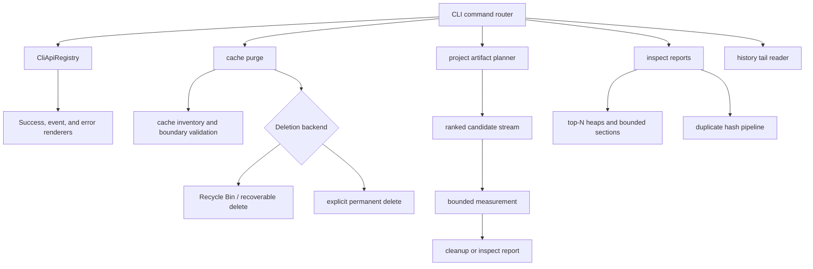

# Cleanup Performance And API Hardening - Plan

## Goal Capsule

| Field | Value |
|---|---|
| Objective | Remove the next layer of architectural drag in Rebecca's cleanup CLI by unifying CLI API contracts, making delete semantics consistent, and replacing full-scan/full-buffer behavior with bounded planning and inspection paths. |
| Authority | The user's fearless-refactor direction is authoritative: breaking internal APIs, deleting obsolete compatibility code, and changing machine contracts is allowed when the result is safer and more coherent. |
| Execution profile | Deep cross-cutting Rust refactor with characterization tests around public CLI behavior, then focused implementation and incremental commits. |
| Stop conditions | Stop if a change would add permanent-delete capability without an explicit opt-in, broaden cleanup targets beyond current safety policy, or require guessing product behavior that affects user data. |
| Tail ownership | Execution progress is represented by commits and verification results, not by editing this plan. |

---

## Product Contract

### Summary

Rebecca already has a stronger catalog, safety catalog, warning gates, inspect commands, and report-only lint reports.
The remaining gap is operational quality: some new surfaces still rely on global v1 error rendering, cache purge deletes differently from cleanup, project-artifact trimming measures everything before applying a reclaim limit, inspect reports sort or retain full inventories, and scan/history paths do unnecessary work for large local datasets.

This plan turns those findings into implementation work.
The product outcome is a cleanup CLI whose machine contracts are explicit, whose deletion posture is consistent, and whose high-cardinality commands can scale without keeping all intermediate state in memory.

### Problem Frame

The current architecture contains three important mismatches.
First, API success output is command-aware but error output is still global, so v2 commands can fail with v1 envelopes.
Second, the main cleanup path defaults to recoverable deletion while `cache purge --yes` uses direct filesystem deletion, which creates two safety stories for one product.
Third, several report and planning paths perform exact full scans even when the user asked for a small top-N or reclaim-limited answer.

### Requirements

**API and safety**

- R1. Every machine-readable command must resolve its API version, command name, payload kind, and error contract through one registry instead of ad hoc constants.
- R2. v2 commands must emit v2 JSON and NDJSON fatal errors, with schemas, examples, and tests matching the same contract as v2 success output.
- R3. `cache purge` must default to a recoverable deletion backend when deleting Rebecca-owned cache contents, while retaining an explicit permanent-delete opt-in for users who need the old behavior.
- R4. Permanent deletion must be named in CLI flags, rendered reports, docs, and tests; it must never be implied by `--yes` alone.

**Bounded planning and inspection**

- R5. Project artifact reclaim limits must affect measurement work, not only post-measure selection; small limits should avoid measuring the full candidate set when enough eligible reclaim has been found.
- R6. Parallel planner progress must avoid retaining every file-level event in memory before replay; large directory scans should emit bounded progress or aggregate summaries.
- R7. `inspect space --top N` must avoid sorting an unbounded list when only the top entries are needed.
- R8. `inspect lint` must avoid always building and sorting complete report lists before applying top limits, and duplicate hashing must remain report-only and opt-in to expensive work where practical.
- R9. Scan traversal should reuse metadata already provided by `ignore::DirEntry` where possible, reducing redundant syscalls without weakening symlink or reparse-point protection.
- R10. `history --limit N` must read bounded tail state instead of loading the full append-only history file when a limit is provided.

**Product polish and maintainability**

- R11. Public docs and `CHANGELOG.md` must describe the new default deletion semantics, v2 error contract, reclaim-limit behavior, and any removed or changed compatibility surfaces.
- R12. Dead adapters, duplicated render helpers, and obsolete tests/docs that only preserve the old architecture must be deleted or rewritten.

### Key Flows

- F1. Machine consumer runs a v2 read-only command with invalid input.
  - **Trigger:** The user runs `rebecca catalog --format json --warning missing-warning`.
  - **Steps:** CLI parsing identifies `catalog`, registry selects API v2 and payload kind, error classifier renders a v2 error envelope.
  - **Outcome:** The consumer receives `api_version = "rebecca.cli.v2"` for both success and failure.
  - **Covered by:** R1, R2
- F2. User purges Rebecca's cache.
  - **Trigger:** The user runs `rebecca cache purge --yes`.
  - **Steps:** Core enumerates direct cache contents, CLI uses the recoverable deletion backend, the cache root remains, report labels entries as recoverably deleted.
  - **Outcome:** Cache contents are removed from active cache but not silently permanently deleted.
  - **Covered by:** R3, R4
- F3. User asks for a small reclaim target.
  - **Trigger:** The user runs project artifact cleanup or inspect with `--reclaim-limit-bytes`.
  - **Steps:** Discovery ranks candidates, measurement proceeds in priority order, and measurement stops after the target plus configured slack is satisfied.
  - **Outcome:** The report is predictable and avoids measuring every eligible artifact when the limit is small.
  - **Covered by:** R5, R6
- F4. User asks for top-N insight.
  - **Trigger:** The user runs `inspect space --top 10` or `inspect lint --top 10`.
  - **Steps:** The report path keeps bounded heaps or streaming accumulators for limited sections, with expensive duplicate hashing restricted to plausible duplicate groups.
  - **Outcome:** Rebecca returns useful read-only insight without turning every report into an unbounded inventory materialization.
  - **Covered by:** R7, R8, R9

### Acceptance Examples

- AE1. Given `catalog --format json --warning missing-warning`, when command validation fails, then stderr contains a JSON envelope with `api_version = "rebecca.cli.v2"`, `command = "catalog"`, and a stable error body.
- AE2. Given `inspect lint --format ndjson --root <missing>`, when inspection fails, then the error event uses `api_version = "rebecca.cli.v2"` rather than the legacy v1 error event.
- AE3. Given a cache directory containing files and nested directories, when `cache purge --yes` runs without `--permanent`, then the active cache directory is emptied through the recoverable backend and the report does not claim permanent deletion.
- AE4. Given the same cache directory, when `cache purge --yes --permanent` runs, then direct filesystem deletion is used and the report clearly marks the permanent mode.
- AE5. Given project artifact candidates where the first ranked candidate already satisfies `--reclaim-limit-bytes`, when planning runs, then later lower-ranked candidates are not measured and are reported as skipped because the reclaim limit was satisfied.
- AE6. Given a large scan with per-file progress enabled, when parallel measurement runs, then memory use is bounded by target summaries and no per-file progress vector grows with every traversed file.
- AE7. Given `history --limit 5` on a large history file, when history is rendered, then only the tail records are parsed into the projection and aggregate summaries reflect those five records.

### Scope Boundaries

In scope:

- Breaking internal Rust APIs in `rebecca-core`, `rebecca`, and tests.
- Breaking v2 machine error contracts where the new schema is clearer and documented.
- Adding or changing CLI flags for safety, especially a named `--permanent` opt-in.
- Removing duplicated compatibility helpers, obsolete docs, and tests that preserve old internals.

Deferred to follow-up work:

- Duplicate remediation, hardlink mutation, shredding, registry cleaning, app uninstallers, or browser history deletion.
- A full plugin ecosystem for external cleaner manifests.
- Persistent history indexing or database migration beyond bounded tail reads.
- Exact memory benchmark automation; this plan uses structural tests and existing CI gates, with benchmarks deferred if needed.

Outside this product's identity:

- Silent permanent deletion as the default cleanup posture.
- Cleanup actions that cannot explain why a target is safe, skipped, or recoverable.

### Dependencies

- Prior cleanup intelligence work in `docs/plans/2026-06-30-002-feat-cleanup-intelligence-platform-plan.md`.
- Local reference repositories in `repo-ref/bleachbit`, `repo-ref/cargo-cache`, `repo-ref/czkawka`, `repo-ref/dust`, `repo-ref/kondo`, and `repo-ref/rmlint`.
- Existing Rust workspace tests using `cargo nextest`.

---

## Planning Contract

### Key Technical Decisions

- KTD1. API versioning is a registry concern, not a renderer default.
  `output.rs` should stop deciding error API versions from a global v1 constant; command routing should provide a `CliApiContract` for success, events, and errors.
- KTD2. Cache purge deletion is owned by a deletion backend boundary.
  Core should enumerate and validate Rebecca-owned cache entries, while the CLI wires recoverable or permanent deletion behavior through an explicit backend so platform-specific recovery does not leak into pure planning code.
- KTD3. Reclaim limits must be pushed before expensive measurement.
  A limit applied after all measurement gives correct final bytes but not correct performance; project artifact planning should rank first, measure in bounded batches, and stop once the selected set satisfies the user request.
- KTD4. Progress is an observation stream, not a retained data model.
  Per-file progress events may be emitted, throttled, sampled, or summarized, but they must not be accumulated in a `Vec` for replay after worker completion.
- KTD5. Top-N reports should use bounded accumulators.
  Space and lint reports can preserve exact totals while using heaps for displayed top sections; full sorting belongs only to exact unlimited modes.
- KTD6. Expensive duplicate work remains read-only and constrained.
  Czkawka and rmlint justify duplicate discovery, but Rebecca should not hash every singleton, remediate duplicates, or select deletion actions in this plan.
- KTD7. Tail reads beat append-only history indexing for this step.
  A ring-buffer tail reader solves `--limit N` memory behavior without committing to a persistent index format.

### High-Level Technical Design

### Priority Order

| Priority | Units | Rationale |
|---|---|---|
| P0 | U1, U2 | Machine contract correctness and deletion safety are the highest-risk public behaviors. |
| P1 | U3, U4 | Project artifact cleanup can otherwise do unbounded work even for small user limits. |
| P2 | U5, U6, U7 | Inspect and scan performance are high-value but read-only, so they follow safety and deletion changes. |
| P3 | U8, U9 | History tail reads and docs/changelog complete the platform hardening after core behavior is stable. |

### System-Wide Impact

- CLI consumers must branch on `api_version` for errors the same way they already do for success output.
- Cache purge behavior changes from direct permanent deletion to recoverable deletion by default.
- Planner progress may become less file-granular in parallel mode when bounded progress is required.
- Existing tests that assert post-measure reclaim-limit semantics must be rewritten to assert early selection and explicit skip reasons.
- Documentation must stop describing post-measure trimming and global v1 fatal errors as current behavior.

### Assumptions

- The current branch is allowed to carry breaking changes for v2 machine consumers and internal Rust APIs.
- Recoverable cache purge can reuse the existing cleanup deletion abstraction or a small new backend trait without making `rebecca-core` depend on Windows-specific crates.
- Exact total byte counts are still required for roots that are actually selected or reported; unselected candidates may carry an unmeasured skip reason after bounded planning stops.

---

## Implementation Units

### U1. Centralize CLI API contracts and v2 errors

- **Goal:** Replace scattered API version selection with one command-aware registry used by success, NDJSON, and fatal error rendering.
- **Requirements:** R1, R2, R11, R12; covers F1 and AE1-AE2.
- **Dependencies:** None.
- **Files:** `crates/rebecca/src/output.rs`, `crates/rebecca/src/main.rs`, `crates/rebecca/src/catalog.rs`, `crates/rebecca/src/inspect.rs`, `crates/rebecca/src/purge.rs`, `crates/rebecca/tests/cli_api.rs`, `crates/rebecca/tests/cli_catalog.rs`, `crates/rebecca/tests/cli_inspect.rs`, `docs/api/cli/v2/README.md`, `docs/api/cli/v2/envelope.schema.json`, `docs/api/cli/v2/event.schema.json`, `docs/api/cli/v2/error.schema.json`, `docs/api/cli/v2/examples/error-invalid-warning.json`.
- **Approach:** Introduce a small `CliApiContract` or extend `WorkflowOutputContract` so command routing can resolve API version and payload kind once.
  Update `render_error` and `NdjsonEventWriter::emit_error` to accept that contract.
  Delete helpers whose only purpose is carrying global v1 defaults into commands that now have explicit contracts.
- **Execution note:** Start with failing CLI tests for v2 JSON and NDJSON error output before changing the renderer.
- **Patterns to follow:** Existing `WorkflowOutputContract::v2` usage in inspect and catalog commands; existing v1 error schema in `docs/api/cli/v1/error.schema.json`.
- **Test Scenarios:** Invalid catalog warning emits v2 JSON error; invalid inspect root emits v2 NDJSON error event; legacy `clean` and `history` errors remain v1; v2 error schema validates required fields; success envelope tests keep passing.
- **Verification:** Focused `cargo nextest run -p rebecca --test cli_api --test cli_catalog --test cli_inspect` passes, and docs contain a v2 error schema and example.

### U2. Make cache purge recoverable by default

- **Goal:** Align Rebecca-owned cache purge with the product's recoverable cleanup posture while preserving explicit permanent deletion.
- **Requirements:** R3, R4, R11, R12; covers F2 and AE3-AE4.
- **Dependencies:** U1 only if cache error contracts need the registry shape.
- **Files:** `crates/rebecca-core/src/cache.rs`, `crates/rebecca/src/cache.rs`, `crates/rebecca/src/cli.rs`, `crates/rebecca/src/main.rs`, `crates/rebecca/tests/cli_cache.rs`, `docs/configuration.md`, `README.md`, `CHANGELOG.md`.
- **Approach:** Split cache purge into validation/inventory and deletion execution.
  Add a deletion backend boundary with at least dry-run, recoverable, and permanent modes.
  Wire `cache purge --yes` to recoverable deletion and require `--permanent` for direct filesystem removal.
  Render the deletion mode in human and machine reports so automation can distinguish recoverable and permanent runs.
- **Execution note:** Characterize current core cache purge behavior first, then change tests to the new explicit safety contract.
- **Patterns to follow:** Cleanup executor deletion backend and restore-hint reporting; `CachePurgeReport` issue matrix rendering.
- **Test Scenarios:** Dry run still reports direct contents without deleting; `--yes` empties active cache through a fake recoverable backend in tests; `--yes --permanent` uses direct deletion; cache root is preserved in all delete modes; overlap with config/state/history remains rejected; report includes deletion mode.
- **Verification:** Focused `cargo nextest run -p rebecca --test cli_cache` and relevant core cache tests pass.

### U3. Push project artifact reclaim limits into measurement

- **Goal:** Stop measuring every project artifact candidate when a reclaim limit can be satisfied by higher-ranked candidates.
- **Requirements:** R5, R11, R12; covers F3 and AE5.
- **Dependencies:** None.
- **Files:** `crates/rebecca-core/src/planner/project_artifacts.rs`, `crates/rebecca-core/src/planner/measure.rs`, `crates/rebecca-core/tests/project_artifacts.rs`, `crates/rebecca-core/tests/planner.rs`, `crates/rebecca/tests/cli_purge.rs`, `crates/rebecca/tests/cli_inspect.rs`, `docs/configuration.md`, `CHANGELOG.md`.
- **Approach:** Rank candidates before measurement and measure in priority order.
  Once selected eligible bytes meet the limit, mark remaining trim-eligible candidates as skipped with a stable reason such as `reclaim-limit-satisfied` without calling the scan engine for their byte totals.
  Keep blocked and protected candidates explainable, but avoid expensive exact measurement for candidates that no longer affect the result.
- **Execution note:** Add a test double or observable counter so tests prove lower-ranked candidates are not measured.
- **Patterns to follow:** Current `ProjectArtifactTrimSortKey`; current `EstimateSource::Unmeasured` model; warning-gated skip reason rendering.
- **Test Scenarios:** First candidate satisfying the limit prevents lower-ranked measurement; warning-blocked candidates do not count toward selected bytes; unmeasured skipped candidates serialize with reason code and zero bytes; no-limit mode still measures all eligible candidates; inspect artifacts and purge share identical selection.
- **Verification:** Focused core and CLI project-artifact tests pass.

### U4. Remove per-file progress buffering from parallel measurement

- **Goal:** Replace `file_progress: Vec<MeasuredFileProgress>` replay with bounded or streaming progress semantics.
- **Requirements:** R6, R12; covers F3 and AE6.
- **Dependencies:** U3 may change the measurement loop; implement after or together with U3.
- **Files:** `crates/rebecca-core/src/planner/measure.rs`, `crates/rebecca-core/src/plan.rs`, `crates/rebecca/src/output.rs`, `crates/rebecca/tests/cli_clean.rs`, `crates/rebecca/tests/cli_purge.rs`, `crates/rebecca-core/tests/planner.rs`.
- **Approach:** Delete `MeasuredFileProgress` storage from `MeasuredTarget`.
  Preserve target-level lifecycle events and emit aggregate progress summaries or bounded sampled events from scan callbacks.
  If NDJSON consumers previously saw replayed file events after each target, document the narrower parallel progress contract as a v2-compatible behavior change for relevant commands.
- **Execution note:** Use existing NDJSON progress tests as characterization, then update only assertions that depended on replay order or per-file volume.
- **Patterns to follow:** `emit_target_finished`, `emit_measured_target_progress`, and current scan cancellation callbacks.
- **Test Scenarios:** Parallel measurement does not allocate per-file progress vectors; NDJSON still emits started, progress, and completed events; cancellation remains responsive; scan-cache estimate events still identify cached targets.
- **Verification:** Focused planner and CLI NDJSON workflow tests pass.

### U5. Bound `inspect space` top-N accumulation

- **Goal:** Keep exact root summaries while avoiding full child sorting for limited top-entry reports.
- **Requirements:** R7, R9, R12; covers F4.
- **Dependencies:** None.
- **Files:** `crates/rebecca-core/src/inspect.rs`, `crates/rebecca-core/tests/space_insight.rs`, `crates/rebecca/tests/cli_inspect.rs`, `docs/api/cli/v2/payloads.schema.json`, `docs/api/cli/v2/examples/success-inspect-space.json`.
- **Approach:** Replace full `Vec` sort/truncate with a bounded heap when `top_limit` is set.
  Preserve deterministic tie-breaking by path and kind.
  Keep unlimited mode exact for users that explicitly request broad output.
- **Patterns to follow:** Existing `SpaceInsightEntry` serialization and diagnostics shape; dust-style top-heavy reporting from `repo-ref/dust`.
- **Test Scenarios:** Top limit returns the largest N entries in deterministic order; equal-sized entries break ties consistently; diagnostics are preserved; unlimited reports remain complete; JSON example stays schema-valid.
- **Verification:** Focused `cargo nextest run -p rebecca-core --test space_insight` and `cargo nextest run -p rebecca --test cli_inspect` pass.

### U6. Stream and constrain `inspect lint`

- **Goal:** Avoid full report materialization and unnecessary duplicate hashing for limited or scoped lint reports.
- **Requirements:** R8, R9, R12; covers F4.
- **Dependencies:** U5 if shared bounded-top helpers are extracted.
- **Files:** `crates/rebecca-core/src/inventory.rs`, `crates/rebecca-core/src/lint.rs`, `crates/rebecca-core/tests/lint_report.rs`, `crates/rebecca/src/cli.rs`, `crates/rebecca/src/inspect.rs`, `crates/rebecca/tests/cli_inspect.rs`, `docs/api/cli/v2/payloads.schema.json`, `docs/api/cli/v2/examples/success-inspect-lint.json`, `CHANGELOG.md`.
- **Approach:** Keep duplicate detection as size-bucket then prehash/full-hash confirmation, but bound rendered large-file, empty-file, and empty-directory sections with heaps when `top_limit` is set.
  Add an explicit mode or flag if implementation shows expensive duplicate hashing should be disabled independently from other lint checks.
  Delete duplicated sorting passes and keep summary counters independent from displayed top sections.
- **Execution note:** Protect existing duplicate correctness with characterization tests before changing accumulation.
- **Patterns to follow:** Czkawka core/frontend split in `repo-ref/czkawka`; rmlint duplicate/reference-root behavior in `repo-ref/rmlint`.
- **Test Scenarios:** Singleton sizes are not hashed; top limit bounds displayed large files and empty entries; duplicate groups remain correct after full hash; protected/reference roots remain keep candidates; no lint command writes history or deletes files; optional duplicate-disable mode, if added, skips content hashing and reports that duplicates were not evaluated.
- **Verification:** Focused `cargo nextest run -p rebecca-core --test lint_report` and `cargo nextest run -p rebecca --test cli_inspect` pass.

### U7. Reuse scan metadata and keep traversal protection

- **Goal:** Reduce redundant metadata syscalls in shared scan traversal without weakening symlink, reparse-point, permission, or cancellation behavior.
- **Requirements:** R9, R12.
- **Dependencies:** None.
- **Files:** `crates/rebecca-core/src/scan.rs`, `crates/rebecca-core/tests/scan_engine.rs`, `crates/rebecca/tests/cli_scan.rs`.
- **Approach:** Prefer `ignore::DirEntry::file_type()` for regular file and directory classification.
  Fall back to `symlink_metadata` only when the scan needs byte size, modified time, reparse detection, or a file type is unavailable.
  Keep root metadata handling strict because root errors and reparse rejection are user-facing safety behavior.
- **Patterns to follow:** Current `root_metadata`, `entry_metadata`, and cancellation helper boundaries.
- **Test Scenarios:** Regular files and directories are measured correctly; symlink/reparse paths remain skipped or blocked as before; permission-denied diagnostics still appear; cancellation still aborts traversal; CLI scan output is unchanged except for performance.
- **Verification:** Focused scan engine and CLI scan tests pass.

### U8. Add bounded history tail loading

- **Goal:** Make `history --limit N` parse only the bounded tail needed for projection instead of loading the full JSONL history.
- **Requirements:** R10, R11, R12; covers AE7.
- **Dependencies:** None.
- **Files:** `crates/rebecca-core/src/history.rs`, `crates/rebecca/src/history_view.rs`, `crates/rebecca/src/main.rs`, `crates/rebecca/tests/cli_history.rs`, `crates/rebecca-core/tests/history.rs`, `docs/configuration.md`, `CHANGELOG.md`.
- **Approach:** Add `HistoryStore::load_tail(limit: NonZeroUsize)` using a ring buffer over parsed lines.
  Keep `load()` for unlimited views and tests.
  Route CLI `--limit` through the tail reader so summaries and largest-run highlights are computed from the same limited window currently rendered.
- **Patterns to follow:** Current history corruption diagnostics and line-number context; `HistoryProjection::new` limit semantics.
- **Test Scenarios:** Tail reader returns newest N records in chronological render order; malformed lines still report the correct line number; unlimited history is unchanged; CLI summaries reflect only the limited records; missing history remains empty.
- **Verification:** Focused history core and CLI tests pass.

### U9. Update docs, changelog, and remove obsolete compatibility code

- **Goal:** Make public docs match the new architecture and delete obsolete code left behind by the refactor.
- **Requirements:** R11, R12.
- **Dependencies:** U1-U8.
- **Files:** `CHANGELOG.md`, `README.md`, `docs/configuration.md`, `docs/api/cli/v1/README.md`, `docs/api/cli/v2/README.md`, `docs/api/cli/v2/*.schema.json`, `docs/api/cli/v2/examples/*.json`, affected Rust modules and tests from U1-U8.
- **Approach:** Add Unreleased entries for v2 errors, recoverable cache purge, bounded project artifact measurement, bounded inspect reports, scan metadata reuse, and history tail reads.
  Remove docs that say v2 fatal errors use the global v1 contract.
  Delete old helpers or compatibility aliases when tests show they only preserve the old architecture.
- **Patterns to follow:** Current `CHANGELOG.md` Unreleased structure and existing CLI API docs.
- **Test Scenarios:** Docs examples match tests; changelog Unreleased section names user-visible behavior; no stale mention of global v1 errors for v2 commands remains; no dead helper survives only for obsolete behavior.
- **Verification:** `git diff --check`, docs/schema-focused tests, and final workspace gates pass.

---

## Verification Contract

| Gate | Command | When | Done Signal |
|---|---|---|---|
| Format | `cargo fmt --all --check` | After each Rust commit cluster and final | No formatting drift. |
| API and CLI contracts | `cargo nextest run -p rebecca --test cli_api --test cli_catalog --test cli_inspect --test cli_cache --test cli_history --test cli_purge --test cli_clean --test cli_scan` | After affected CLI units | Machine and human CLI behavior matches the new contracts. |
| Core planner and reports | `cargo nextest run -p rebecca-core --test project_artifacts --test planner --test space_insight --test lint_report --test scan_engine --test history` | After core units | Planner, inspect, lint, scan, and history behavior is correct. |
| Full workspace | `cargo nextest run --workspace` | Final | All workspace tests pass. |
| Lint | `cargo clippy --workspace --all-targets -- -D warnings` | Final | No warnings. |
| Diff hygiene | `git diff --check` | Before each commit and final | No whitespace errors. |

---

## Definition of Done

- U1-U9 are implemented or deliberately narrowed with a commit message and final summary explaining why.
- `cache purge --yes` no longer silently means permanent deletion.
- v2 commands have v2 error envelopes, schemas, examples, and tests.
- Reclaim-limited project artifact planning avoids measuring lower-ranked candidates once the limit is satisfied.
- Parallel measurement no longer stores per-file progress vectors for replay.
- `inspect space`, `inspect lint`, scan traversal, and history limit paths have bounded or lower-overhead implementations where the plan requires them.
- `CHANGELOG.md` Unreleased describes every user-visible change.
- Abandoned experimental code, obsolete helpers, and superseded tests/docs are removed.
- The final verification gates in the Verification Contract pass or any skipped gate is called out with the concrete reason.

---

## Appendix

### Sources And Research

- `docs/plans/2026-06-30-001-refactor-cleanup-workflow-architecture-plan.md` for the earlier output/runtime split and cleanup workflow architecture.
- `docs/plans/2026-06-30-002-feat-cleanup-intelligence-platform-plan.md` for catalog, warning, inspect, purge, and lint contracts this plan hardens.
- `repo-ref/bleachbit` for cleaner manifest, warning, preview/clean, and process-safety patterns.
- `repo-ref/cargo-cache` and `repo-ref/kondo` for cache-cleaning CLI posture and explicit deletion UX.
- `repo-ref/dust` for top-heavy disk usage reporting.
- `repo-ref/czkawka` and `repo-ref/rmlint` for report-first duplicate/lint pipelines and reference-root behavior.

### Risks

| Risk | Impact | Mitigation |
|---|---|---|
| v2 error contract changes surprise consumers. | Existing integrations may parse v1 fatal errors for v2 commands. | Document the v2 error schema, add examples, and keep legacy v1 commands on v1. |
| Recoverable cache purge is platform-dependent. | Non-Windows behavior may not have a native recycle bin backend. | Use a backend boundary and explicit fallback/reporting rather than hiding permanent deletion. |
| Early reclaim-limit measurement changes exact report totals. | Users may no longer see byte totals for unselected candidates. | Use explicit unmeasured skip reasons and preserve exact totals for selected targets. |
| Bounded top-N reports accidentally change ordering. | Machine tests may become flaky or users may see unstable output. | Keep deterministic tie-breaking by path and kind. |
| Duplicate lint optimizations miss real duplicates. | Report quality regresses. | Preserve size-bucket plus full-hash confirmation for duplicate-enabled mode. |
