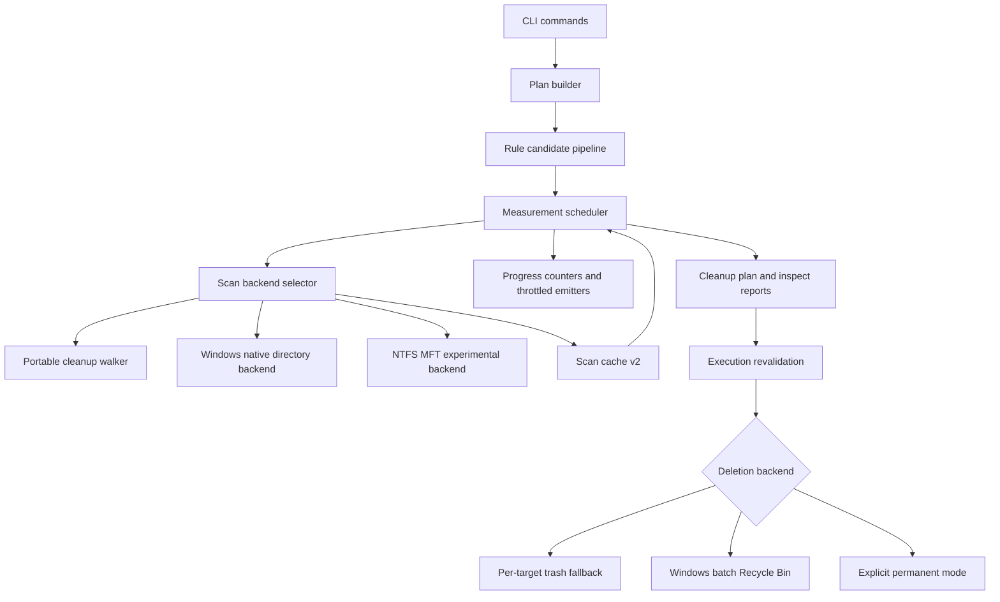
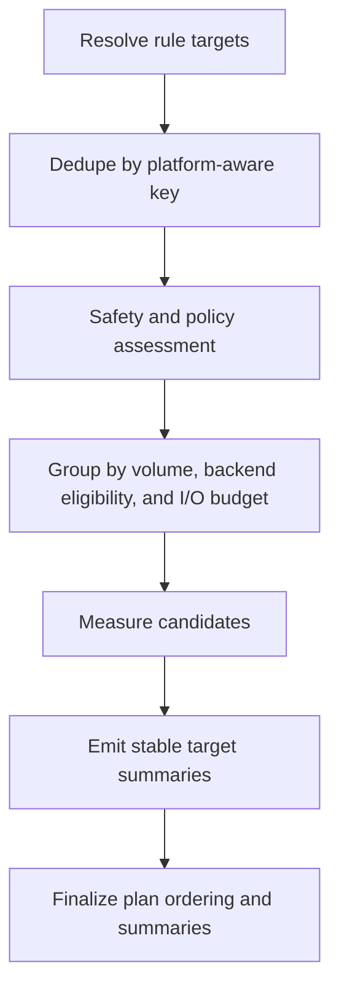

# Fearless Cleaner Engine Performance - Plan

## Goal Capsule

| Field | Value |
|---|---|
| Objective | Turn Rebecca from a safe cleanup CLI with good local optimizations into a measured, multi-backend, Windows-aware cleaner engine that can compete with best-in-class cleaners and disk analyzers. |
| Authority | The user's "make the strongest cleanup CLI" and fearless-refactor direction is authoritative. Existing safety ADRs remain hard constraints. |
| Execution profile | Deep, phased Rust refactor across scan, planning, progress, cache, deletion, Windows adapters, benchmark infrastructure, and rule governance. |
| Stop conditions | Stop if a proposed optimization weakens dry-run parity, deletion revalidation, reparse/symlink protection, or makes raw NTFS/MFT access a default cleanup dependency. |
| Tail ownership | Implementation progress is represented by code, tests, benchmark reports, and commits, not by editing this plan as a task board. |

---

## Product Contract

### Summary

Rebecca already has a strong safety baseline: bounded Rayon pools, no symlink/reparse traversal, scan cache support, delete-time revalidation, overlap-aware parallel deletion, and Criterion benchmarks.
The next step is not one micro-optimization.
The product needs a cleaner engine architecture where performance is measurable, ordinary rules can be planned in parallel, progress output cannot throttle scanning, cache writes are cheap enough for hot paths, deletion can batch platform operations, and Windows can grow dedicated fast scan backends without contaminating the safe default path.

The plan absorbs the existing `docs/plans/2026-06-30-003-refactor-performance-api-hardening-plan.md` and `docs/plans/2026-06-29-001-refactor-scan-engine-deep-module-plan.md` as Wave 0/1 work.
It extends them with prior-art findings from `repo-ref/bleachbit`, `repo-ref/czkawka`, `repo-ref/dust`, `repo-ref/dua-cli`, `repo-ref/rmlint`, `repo-ref/windirstat`, `repo-ref/edirstat`, `repo-ref/mft`, `repo-ref/ntfs`, `repo-ref/usn-parser-rs`, `repo-ref/usn-journal-rs`, `repo-ref/ripgrep`, and `repo-ref/squirreldisk`.

### Problem Frame

The current engine is safer than many cleanup tools, but it is not yet a top-tier performance system.
Normal rule planning still measures targets inside a mostly serial loop in `crates/rebecca-core/src/planner/rules.rs`.
Single large directory scans still use one `ignore::WalkBuilder::build()` walker in `crates/rebecca-core/src/scan.rs`.
Human progress and NDJSON can receive one event per file in `crates/rebecca/src/clean.rs` and `crates/rebecca/src/output.rs`.
Scan cache writes use pretty JSON plus per-file `sync_all` in `crates/rebecca-core/src/scan_cache/store.rs`.
Windows deletion still calls the `trash` crate target-by-target in `crates/rebecca-windows/src/lib.rs`.

WizTree-class speed comes from reading NTFS metadata directly, but that cannot be Rebecca's default cleanup foundation.
The right path is layered: make the portable pipeline excellent first, then add Windows fast recursive scanning, then add an opt-in NTFS/MFT experimental backend, then use USN Journal data to invalidate cache rather than to replace first scans.

### Requirements

**Measurable Performance**

- R1. Rebecca must have a repeatable product-level performance matrix for cold scan, hot scan-cache, progress on/off, many small files, deep trees, large single directories, many targets, regular rule plans, and deletion modes.
- R2. Benchmark output must include enough machine-readable metrics to compare wall time, file count, byte count, cache hit rate, progress event count, and delete backend behavior across commits.
- R3. Performance work must be gated by correctness checks that prove byte totals, target statuses, warnings, and safety decisions do not regress.

**Planner and Scan Pipeline**

- R4. Ordinary rule planning must split candidate resolution, dedupe/safety assessment, measurement, and final ordering so measurement can run in bounded parallel batches.
- R5. Project artifact reclaim limits must stop lower-ranked measurement once the selected set satisfies the limit, preserving explicit unmeasured skip reasons.
- R6. The scan engine must expose a backend-neutral interface so portable walking, Windows native directory enumeration, future parallel walking, and NTFS/MFT indexing can satisfy one contract.
- R7. The portable backend must keep cleanup semantics: count hidden and ignore-matched files, avoid symlink/reparse traversal, preserve cancellation, and emit structured failures.
- R8. Large directory performance must be evaluated under the same I/O budget as outer target parallelism, so inner and outer parallelism do not oversubscribe the disk.

**Progress, Output, and Cache**

- R9. Hot scan paths must update counters cheaply and emit human progress on a time or count throttle rather than per file.
- R10. NDJSON must default to target-level or batch-level progress, with file-level progress available only through an explicit verbose/debug mode.
- R11. Scan cache writes must use compact atomic writes by default, avoid per-target `sync_all` for rebuildable cache data, and support strict durability only as an opt-in policy.
- R12. Scan cache records must use the current v1 identity model with backend kind, volume identity, target file identity where available, freshness confidence, and future USN checkpoint fields.

**Deletion and Windows Specialization**

- R13. Cleanup deletion must keep execute-time revalidation and overlap-aware batching while allowing backends to delete a whole safe batch at once.
- R14. Windows must gain a batch Recycle Bin backend, preferably through Shell `IFileOperation`, with `trash` retained as a fallback.
- R15. Windows must gain a native directory enumeration backend that batches metadata retrieval and preserves Rebecca's cleanup safety semantics.
- R16. NTFS/MFT scanning must be experimental, opt-in, read-only, failure-tolerant, and used only for measurement or inspect estimates, never as direct authority for deletion.
- R17. USN Journal integration must first invalidate or refresh scan cache entries; true incremental subtree accounting is deferred until correctness is proven.

**Rule and Product Governance**

- R18. Rule scale must not multiply directory walks unnecessarily; discovery and measurement should share candidate indexes where the semantics match.
- R19. Rule manifests must carry enough metadata for safety level, process/running-app policy, target search kind, cache policy, and versioning.
- R20. CLI reports must expose estimate source and caveats when a target is measured from scan cache, Windows fast index, or NTFS/MFT rather than a fresh portable walk.
- R21. OSS reference use and new dependencies must preserve Rebecca's license boundary: GPL projects are design-only references, and any dependency or copied fixture must pass the repository license policy.

### Key Flows

- F1. A normal `clean --dry-run` evaluates hundreds of Windows rules.
  - **Trigger:** User runs Rebecca with the built-in catalog.
  - **Steps:** Rule targets are expanded into candidates, candidates are deduped and safety-assessed, measurement runs in bounded batches, progress is throttled, and final output is sorted deterministically.
  - **Outcome:** The user gets the same safety story with lower wall time and bounded output overhead.
  - **Covered by:** R4, R7, R9, R10
- F2. A reclaim-limited project cleanup only needs the first high-value artifacts.
  - **Trigger:** User runs project artifact cleanup with a small reclaim limit.
  - **Steps:** Candidates are ranked before measurement; selected bytes accumulate; lower-ranked candidates are marked unmeasured once the limit is satisfied.
  - **Outcome:** Rebecca avoids scanning targets that cannot affect the plan.
  - **Covered by:** R5
- F3. A Windows user deletes many safe cache targets.
  - **Trigger:** User confirms cleanup on Windows.
  - **Steps:** Executor revalidates every target, partitions overlapping paths into safe batches, and passes each batch to the platform backend.
  - **Outcome:** Batch Recycle Bin execution reduces Shell overhead without weakening recovery semantics.
  - **Covered by:** R13, R14
- F4. A Windows user opts into fast inspection.
  - **Trigger:** User runs an explicit fast-index inspect or scan backend mode.
  - **Steps:** Backend selection checks filesystem, privilege, volume identity, reparse status, and feature flags; NTFS/MFT or native enumeration returns estimates with caveats; fallback runs portable scan.
  - **Outcome:** The user can get WizTree-like measurement where supported, but cleanup remains safe and explainable.
  - **Covered by:** R15, R16, R20
- F5. A hot dry-run checks whether a cached target changed.
  - **Trigger:** Scan cache v2 has a previous target record on an NTFS volume.
  - **Steps:** Cache lookup compares policy, target identity, and optional USN checkpoint; changed subtrees invalidate the record.
  - **Outcome:** Hot scans become faster without trusting stale directory TTL alone.
  - **Covered by:** R11, R12, R17

### Acceptance Examples

- AE1. Given two identical rule targets from different rules, when a dry-run builds a plan, then the filesystem target is measured once and both resulting targets retain deterministic rule-specific output.
- AE2. Given a rule catalog with many independent targets, when planning runs with progress enabled, then measurement uses bounded parallelism and human progress emits fewer events than files measured.
- AE3. Given NDJSON output without verbose progress, when a 10,000-file directory is measured, then output includes started, target progress, and completed events but does not emit 10,000 `file-measured` events.
- AE4. Given scan cache enabled, when a target is measured and cached, then the cache file is written atomically without default `sync_all`, and strict durability mode can still force sync.
- AE5. Given reclaim-limited project artifact planning where the first ranked target satisfies the limit, when planning runs, then lower-ranked targets are not scanned and serialize an explicit `reclaim-limit-satisfied` skip reason.
- AE6. Given Windows cleanup with multiple non-overlapping targets, when execution confirms deletion, then the Windows backend receives a batch delete call after target revalidation.
- AE7. Given a target on an unsupported filesystem or without required privileges, when a fast backend is selected, then Rebecca falls back to portable scanning and reports the fallback reason.
- AE8. Given an NTFS/MFT estimate, when the user executes deletion, then the executor still revalidates the live path through the existing safety policy before deletion.

### Scope Boundaries

In scope:

- Breaking internal Rust APIs across `rebecca-core`, `rebecca`, and `rebecca-windows`.
- Creating new crates such as `rebecca-ntfs` when module isolation materially improves safety and testability.
- Adding unstable or hidden CLI/config switches for scan backend selection during rollout.
- Replacing or removing old shallow scan/planner helpers when tests cover the new pipeline.
- Adding benchmark tooling, fixture generation, and report-only CI performance jobs before hard gates.

Deferred to follow-up work:

- True USN-based incremental subtree size updates.
- Duplicate remediation, hardlink replacement, secure shredding, registry cleaning, and app uninstallers.
- Full GUI/TUI disk treemap features.
- Making raw NTFS/MFT scanning default for cleanup.
- Copying code from GPL projects. GPL references may inform design only.

Outside this product's identity:

- Silent permanent deletion as the default cleanup posture.
- Optimizations that bypass plan-first cleanup, restore hints, or delete-time path validation.
- Treating metadata-index estimates as sufficient authority to delete a target.

---

## Planning Contract

### Key Technical Decisions

- KTD1. Performance evidence comes before exotic backends.
  The first wave builds a matrix that can prove ordinary rule planning, progress, scan cache, and deletion behavior; NTFS/MFT comes after the portable pipeline is measurable.
- KTD2. Rule planning becomes a candidate pipeline.
  `rules.rs` should stop interleaving rule iteration, expansion, safety assessment, scanning, progress, and finalization inside one nested loop.
- KTD3. Scan backend selection is an engine concern.
  Callers ask for measurement with options; they do not know whether the implementation is `ignore`, `jwalk`, `NtQueryDirectoryFile`, or NTFS/MFT.
- KTD4. Fast estimates are never delete authority.
  Any backend may estimate bytes, but execution still uses live path revalidation in `executor.rs`.
- KTD5. Progress is sampled observation, not scanner control flow.
  Hot loops update counters; emitters decide human and NDJSON granularity.
- KTD6. Cache durability matches data value.
  Scan cache is derived state, so atomic replace is the default; strict fsync belongs behind policy.
- KTD7. Windows optimization has two rungs before MFT.
  Batch Recycle Bin and native directory enumeration are lower-risk, product-relevant wins before raw NTFS parsing.
- KTD8. MFT parsing belongs behind a narrow, read-only boundary.
  A `rebecca-ntfs` parser can be tested with exported `$MFT` fixtures, while `rebecca-windows` owns volume handles and privileges.
- KTD9. USN Journal is first a cache invalidation primitive.
  Using USN for full incremental accounting is valuable but more failure-prone than invalidating stale cache records.
- KTD10. Rule DSL growth requires governance.
  Borrow BleachBit-style search semantics conceptually, but keep Rebecca's manifest format, safety catalog, warning gates, and versioned contracts.

### High-Level Technical Design

### Alternative Approaches Considered

| Option | Pros | Cons | Decision |
|---|---|---|---|
| Keep current walker and only tune syscalls | Low implementation risk | Leaves serial planner, progress overhead, cache writes, and deletion backend limits unsolved | Rejected as insufficient |
| Make NTFS/MFT the main scanner now | Potentially dramatic speed on NTFS | Requires privileges, has complex correctness risks, and does not help non-NTFS or safe deletion semantics | Rejected as default path |
| Adopt `jwalk` as the immediate portable backend | Proven fast Rust walker, used by `dua-cli` | Adds dependency and changes traversal behavior before Rebecca has backend abstraction | Deferred behind `ScanBackend` |
| Multi-backend scan engine with portable default | Preserves safety, allows staged Windows acceleration, and keeps benchmarks honest | Larger refactor and more tests | Chosen |

### Phased Delivery

| Wave | Units | Outcome |
|---|---|---|
| Wave 0 | U1, U2, U3 | Product-level performance evidence, scan engine contract, and ordinary rule candidate pipeline. |
| Wave 1 | U4, U5, U6, U7 | Parallel measurement, bounded progress, bounded inspect/project planning, and lightweight scan cache. |
| Wave 2 | U8, U9, U10 | Batch deletion backend, Windows native directory backend, and I/O budget coordination. |
| Wave 3 | U11, U12, U13 | NTFS parser crate, experimental MFT backend, and USN cache invalidation. |
| Wave 4 | U14, U15 | Rule governance and final docs/release hardening. |

### System-Wide Impact

- CLI machine consumers may see coarser default NDJSON progress unless they opt into verbose file-level events.
- Scan cache records need a version bump because backend kind, identity, and confidence become part of the cache contract.
- Planner tests must assert stable final output even when measurement order is parallel.
- Windows users may see faster deletion and scan estimates, but every fast path must report fallback reasons and estimate caveats.
- Existing plans `2026-06-29-001` and `2026-06-30-003` remain valid as narrower slices; this plan is the top-level sequencing document for the performance engine.

### Assumptions

- `repo-ref/` is intentionally ignored by git and can hold reference repositories without becoming part of Rebecca's deliverable.
- Current workspace target remains Rust 1.95 and Windows-first cleanup behavior.
- Raw NTFS/MFT access requires elevated permissions on real volumes and must be skipped or fixture-backed in normal CI.
- GPL projects such as WinDirStat are design references only; implementation must be original or use compatible dependencies.

---

## Implementation Units

### U1. Build the performance evidence harness

- **Goal:** Replace anecdotal speed discussion with a repeatable benchmark and report system.
- **Requirements:** R1, R2, R3.
- **Dependencies:** None.
- **Files:** `crates/rebecca-core/benches/scan_baseline.rs`, `crates/rebecca-core/benches/perf_matrix.rs`, `scripts/perf/`, `docs/knowledge/engineering/current-state.md`, `docs/knowledge/engineering/log.md`.
- **Approach:** Keep the existing Criterion scan baseline, but add a product-level matrix that generates fixtures for many small files, deep trees, large single directories, duplicated targets, progress on/off, cache hit/miss, and delete backends.
  Output JSON artifacts so later CI can compare trend lines before enforcing hard budgets.
  Borrow the measurement discipline from `repo-ref/mft/PERF.md` and `repo-ref/rmlint/tests/test_speed/benchmark.py`.
- **Execution note:** Start characterization-first: the first report documents current performance rather than failing on thresholds.
- **Patterns to follow:** Existing `scan_baseline` fixture builders and `cargo nextest` convention.
- **Test scenarios:** Benchmark fixtures produce expected file, directory, and byte counts; progress-on and progress-off scenarios return identical `ScanReport` totals; duplicate target fixtures can prove one filesystem measurement feeds multiple plan targets once U4 lands; JSON report schema remains stable.
- **Verification:** Criterion benches compile and run locally on small fixtures; report artifacts include scenario name, backend, wall time, file count, byte count, event count, and cache mode.

### U2. Convert the scan module into a backend-neutral engine

- **Goal:** Make `ScanEngine` a deep interface with portable cleanup semantics and hidden traversal adapters.
- **Requirements:** R6, R7, R8, R20.
- **Dependencies:** U1.
- **Files:** `crates/rebecca-core/src/scan.rs`, `crates/rebecca-core/src/scan/backend.rs`, `crates/rebecca-core/src/scan/portable.rs`, `crates/rebecca-core/src/scan/progress.rs`, `crates/rebecca-core/src/lib.rs`, `crates/rebecca-core/tests/scan_engine.rs`, `crates/rebecca-core/benches/scan_baseline.rs`.
- **Approach:** Introduce backend-neutral request, options, report metadata, progress sink, and fallback/caveat fields.
  Move current `ignore` walker code into a portable backend that keeps `standard_filters(false)` and `follow_links(false)`.
  Keep target-level parallel helpers behind the scan module until the planner scheduler replaces them.
- **Patterns to follow:** `docs/adr/0005-scan-engine-strategy.md`, current `ScanEngine::measure_path_with_progress`, and ripgrep `ignore` walker policy in `repo-ref/ripgrep/crates/ignore/src/walk.rs`.
- **Test scenarios:** Hidden files and `.gitignore`-ignored files count; symlink or reparse roots remain blocked; missing root and permission failures preserve structured errors; cancellation still stops traversal; report metadata names the portable backend.
- **Verification:** Scan engine tests pass, benchmarks compile against the new interface, and no production caller configures `ignore::WalkBuilder` directly.

### U3. Split ordinary rule planning into candidate stages

- **Goal:** Prepare normal rule planning for parallel measurement and shared scan results.
- **Requirements:** R4, R18, R20; covers F1 and AE1.
- **Dependencies:** U2.
- **Files:** `crates/rebecca-core/src/planner/rules.rs`, `crates/rebecca-core/src/planner/measure.rs`, `crates/rebecca-core/src/planner.rs`, `crates/rebecca-core/tests/planner.rs`, `crates/rebecca/tests/cli_clean.rs`.
- **Approach:** Refactor `build_rule_plan_with_context` into candidate resolution, dedupe/safety assessment, measurement scheduling, and stable finalization.
  Preserve existing skip/block reason codes and final ordering while removing scan calls from the rule expansion loop.
  Keep the first implementation serial if necessary, but shape the data model for U4.
- **Execution note:** Add characterization tests for duplicate targets and stable output before moving work into parallel batches.
- **Patterns to follow:** Existing `dedupe_key`, `finalize_plan`, and project artifact candidate measurement structure.
- **Test scenarios:** Duplicate target paths do not duplicate measurement intent; blocked/protected/recently modified targets bypass measurement; rule metadata survives stage boundaries; final target ordering matches current user-facing order.
- **Verification:** Focused planner and CLI clean tests pass with the staged pipeline.

### U4. Parallelize and share normal rule measurement

- **Goal:** Make ordinary catalog cleanup planning use bounded parallel measurement with deterministic output.
- **Requirements:** R4, R6, R8, R18; covers F1 and AE1-AE2.
- **Dependencies:** U3.
- **Files:** `crates/rebecca-core/src/planner/rules.rs`, `crates/rebecca-core/src/planner/measure.rs`, `crates/rebecca-core/src/parallelism.rs`, `crates/rebecca-core/tests/planner.rs`, `crates/rebecca-core/benches/perf_matrix.rs`.
- **Approach:** Measure eligible candidates through `run_scoped_scan` or a new measurement scheduler, keyed by normalized path and backend eligibility.
  Emit progress after merging results into stable order unless a streaming target-level event is required.
  Share one measured result across duplicate path candidates without hiding rule-specific target records.
- **Patterns to follow:** `project_artifacts.rs` and `app_leftovers.rs` parallel measurement, with stronger stable-output guarantees.
- **Test scenarios:** Many independent targets measure concurrently under the bounded budget; duplicate candidates reuse the same measured bytes; parallel completion order does not affect final target ordering; cancellation interrupts outstanding work and returns the same cancellation error contract.
- **Verification:** Planner tests prove measurement counts and deterministic order; perf matrix shows ordinary rule planning improvement on synthetic many-target fixtures.

### U5. Add throttled progress and NDJSON granularity modes

- **Goal:** Prevent progress rendering from becoming a scan bottleneck.
- **Requirements:** R9, R10; covers AE2-AE3.
- **Dependencies:** U2, U3.
- **Files:** `crates/rebecca-core/src/planner.rs`, `crates/rebecca-core/src/scan.rs`, `crates/rebecca/src/clean.rs`, `crates/rebecca/src/output.rs`, `crates/rebecca/src/cli.rs`, `crates/rebecca/tests/cli_clean.rs`, `crates/rebecca/tests/cli_output.rs`, `docs/api/cli/v2/event.schema.json`, `docs/api/cli/v2/README.md`.
- **Approach:** Add aggregate progress counters and a progress policy that separates internal scan updates from emitted events.
  Human output should refresh at a configurable time or count interval.
  NDJSON should default to started, target-scanning, target-finished, scan-cache, and completed events; file-level events move behind an explicit verbose progress option.
- **Patterns to follow:** `repo-ref/dust/src/progress.rs`, `repo-ref/dua-cli/src/common.rs` throttle, and `repo-ref/czkawka/czkawka_core/src/common/progress_stop_handler.rs`.
- **Test scenarios:** Human progress receives fewer UI updates than measured files; NDJSON default omits file-level events for large fixtures; verbose NDJSON still emits file-level details; cancellation and error events are never throttled away; scan cache summary counts stay correct.
- **Verification:** CLI progress tests and v2 event schema examples pass; perf matrix records lower event count and lower overhead with progress enabled.

### U6. Push bounded planning into project artifacts and inspect reports

- **Goal:** Finish the high-cardinality bounded-work items already identified in the earlier performance hardening plan.
- **Requirements:** R3, R5, R20; covers F2 and AE5.
- **Dependencies:** U2.
- **Files:** `crates/rebecca-core/src/planner/project_artifacts.rs`, `crates/rebecca-core/src/planner/measure.rs`, `crates/rebecca-core/src/inspect.rs`, `crates/rebecca-core/src/lint.rs`, `crates/rebecca-core/tests/project_artifacts.rs`, `crates/rebecca-core/tests/space_insight.rs`, `crates/rebecca-core/tests/lint_report.rs`, `crates/rebecca/tests/cli_inspect.rs`, `crates/rebecca/tests/cli_purge.rs`.
- **Approach:** Rank project artifacts before measurement and stop after reclaim limits are satisfied.
  Replace full sort/truncate paths in `inspect space` and `inspect lint` with bounded heaps where top limits are set.
  Keep exact totals for measured or selected roots and use explicit unmeasured reasons elsewhere.
- **Patterns to follow:** `docs/plans/2026-06-30-003-refactor-performance-api-hardening-plan.md` U3, U5, and U6; dust-style top-heavy reporting from `repo-ref/dust`.
- **Test scenarios:** Reclaim limit prevents lower-ranked scans; top-N reports return deterministic ties; unlimited inspect modes remain exact; duplicate lint does not hash singleton size buckets; unmeasured skipped targets serialize source and reason.
- **Verification:** Core project artifact, space insight, lint report, and CLI inspect/purge tests pass.

### U7. Rework scan cache writes and identity model

- **Goal:** Make cache fast enough for hot dry-run paths and expressive enough for future USN invalidation.
- **Requirements:** R11, R12, R17, R20; covers F5 and AE4.
- **Dependencies:** U2.
- **Files:** `crates/rebecca-core/src/scan_cache.rs`, `crates/rebecca-core/src/scan_cache/store.rs`, `crates/rebecca-core/src/planner/measure.rs`, `crates/rebecca-core/tests/planner.rs`, `crates/rebecca-core/tests/scan_engine.rs`, `docs/configuration.md`, `CHANGELOG.md`.
- **Approach:** Add cache format/version metadata for backend kind, estimate confidence, optional volume serial, optional file id, and placeholder USN checkpoint fields.
  Change writes to compact JSON or a compatible compact representation with temp-file atomic replace.
  Make strict fsync a policy option rather than the default.
  Consider a planning-session write buffer so multiple target records flush at workflow end.
- **Patterns to follow:** Current cache stale/miss tests, `repo-ref/czkawka/czkawka_core/src/common/cache.rs`, and `repo-ref/cargo-cache/src/remove.rs` invalidation concept.
- **Test scenarios:** Existing v1 records are stale or migrated intentionally; compact records round-trip; default writes do not call strict durability path; strict mode syncs; backend and confidence appear in estimate source; missing roots prune records as before.
- **Verification:** Scan cache tests pass and perf matrix shows reduced cache-write overhead on many-target dry-runs.

### U8. Add batch-capable deletion backend contracts

- **Goal:** Let safe batches delete efficiently without weakening per-target outcomes.
- **Requirements:** R13; covers F3 and AE6.
- **Dependencies:** U1.
- **Files:** `crates/rebecca-core/src/executor.rs`, `crates/rebecca-core/src/plan.rs`, `crates/rebecca-core/tests/executor_contract.rs`, `crates/rebecca-core/benches/perf_matrix.rs`.
- **Approach:** Extend `CleanupBackend` with an optional batch-delete method that defaults to per-target delete.
  Keep `batch_executable_targets` and execute-time revalidation as the authority.
  Map batch backend results back to individual `CleanupTarget` statuses, issue matrix entries, and history semantics.
- **Patterns to follow:** Current `execute_cleanup_plan_parallel_with_policy`, `batch_executable_targets`, and deletion/recovery ADR.
- **Test scenarios:** Backends without batch support behave exactly as before; batch-capable backends receive non-overlapping batches; partial batch failures mark only failed targets; parent and child paths still appear in separate batches; permanent deletion remains explicit.
- **Verification:** Executor contract tests and cleanup delete benchmarks pass.

### U9. Implement Windows batch Recycle Bin deletion

- **Goal:** Reduce Windows deletion overhead for many safe targets while preserving recoverable default behavior.
- **Requirements:** R13, R14; covers F3 and AE6.
- **Dependencies:** U8.
- **Files:** `crates/rebecca-windows/src/lib.rs`, optional `crates/rebecca-windows/src/recycle_bin.rs`, `crates/rebecca-windows/tests/recycle_bin.rs`, `crates/rebecca/src/clean.rs`, `crates/rebecca/tests/cli_clean.rs`, `CHANGELOG.md`.
- **Approach:** Add a Windows batch recycle backend using Shell `IFileOperation` if feasible with the current `windows` crate features.
  Preserve the current `trash` backend as fallback for unsupported modes, test failures, or non-Windows behavior.
  Report backend and fallback reasons in machine-readable output.
- **Patterns to follow:** Current `trash::delete` adapter and WinDirStat's product-level delete affordances as design reference only.
- **Test scenarios:** Batch backend receives multiple paths; fallback path preserves current behavior; locked or missing files produce per-target failures; root-content preservation mode does not delete the root directory; restore hints remain present.
- **Verification:** Windows recycle bin tests pass on Windows, non-Windows workspace still compiles through cfg boundaries.

### U10. Add Windows native directory enumeration backend

- **Goal:** Get a lower-risk Windows scan speedup before raw NTFS/MFT.
- **Requirements:** R6, R7, R8, R15, R20; covers F4 and AE7.
- **Dependencies:** U2, U5.
- **Files:** `crates/rebecca-windows/src/lib.rs`, `crates/rebecca-windows/src/nt_query_scan.rs`, `crates/rebecca-core/src/scan.rs`, `crates/rebecca/tests/cli_scan.rs`, `crates/rebecca-windows/tests/`, `Cargo.toml`.
- **Approach:** Implement a Windows-only backend that enumerates directories with native APIs capable of returning attributes, file size, file id, and reparse information in fewer calls than portable metadata lookups.
  Start with a conservative implementation and feature gate it behind backend selection.
  Fall back to portable scanning on unsupported paths, network paths, permission problems, or semantic uncertainty.
- **Patterns to follow:** `repo-ref/windirstat/windirstat/FinderBasic.cpp` design, but not code; `repo-ref/dua-cli/src/common.rs` metadata-in-entry pattern.
- **Test scenarios:** Native backend reports the same totals as portable backend on fixture trees; reparse paths are skipped or blocked consistently; fallback reason appears for unsupported roots; cancellation remains responsive; backend selection can force portable mode.
- **Verification:** Windows-specific tests pass where available, and backend comparison bench reports parity plus timing.

### U11. Create a read-only NTFS parser crate

- **Goal:** Build the parser foundation for MFT measurement without platform handle code in core.
- **Requirements:** R16; supports F4 and AE8.
- **Dependencies:** U1.
- **Files:** `crates/rebecca-ntfs/Cargo.toml`, `crates/rebecca-ntfs/src/lib.rs`, `crates/rebecca-ntfs/src/record.rs`, `crates/rebecca-ntfs/src/fixup.rs`, `crates/rebecca-ntfs/src/attrs.rs`, `crates/rebecca-ntfs/src/tree.rs`, `crates/rebecca-ntfs/src/reader.rs`, `crates/rebecca-ntfs/tests/`, `Cargo.toml`.
- **Approach:** Create a small MIT/Apache-compatible parser around exported `$MFT` fixtures.
  Parse fixups, standard information, file names, data sizes, reparse metadata, parent references, and enough attribute-list behavior to report caveats.
  Build a compact entry graph keyed by record id for subtree aggregation without storing full paths for every record.
- **Patterns to follow:** `repo-ref/mft/src/mft.rs`, `repo-ref/mft/src/entry.rs`, `repo-ref/ntfs/src`, `repo-ref/edirstat/src/engine/mft.rs`, and `repo-ref/mft/PERF.md`.
- **Test scenarios:** Valid fixture records parse; invalid fixups fail safely; parent-child tree aggregation sums bytes; deleted or pathless records are reported as caveats; reparse records are identifiable; parser handles truncated data without panic.
- **Verification:** New crate unit and integration tests pass; parser benches run on small checked-in fixtures or generated fixtures.

### U12. Add experimental Windows NTFS/MFT scan backend

- **Goal:** Provide an opt-in WizTree-class measurement path with explicit fallback and caveats.
- **Requirements:** R6, R8, R16, R20; covers F4 and AE7-AE8.
- **Dependencies:** U2, U10, U11.
- **Files:** `crates/rebecca-windows/src/ntfs_scan.rs`, `crates/rebecca-windows/src/lib.rs`, `crates/rebecca-core/src/scan.rs`, `crates/rebecca/src/cli.rs`, `crates/rebecca/src/clean.rs`, `crates/rebecca/src/inspect.rs`, `crates/rebecca-windows/tests/`, `crates/rebecca-core/benches/perf_matrix.rs`.
- **Approach:** Implement backend selection for `windows-ntfs-mft-experimental`.
  Group targets by volume, detect NTFS and privileges, map target paths to file ids, read `$MFT::$DATA` or equivalent volume metadata through Windows APIs, aggregate target subtrees, and return estimates with caveats.
  On any uncertainty, fall back to portable or native directory scanning.
- **Patterns to follow:** WinDirStat `FinderNtfs` design, `repo-ref/usn-parser-rs/src/main.rs` privilege-facing UX, and `repo-ref/edirstat/src/engine/traversal.rs` fallback posture.
- **Test scenarios:** Unsupported filesystem falls back; non-admin access reports fallback; target file id mismatch falls back; MFT estimate never bypasses executor revalidation; multiple targets on one volume reuse one index; backend metadata appears in output.
- **Verification:** Fixture-backed tests pass without admin rights; elevated Windows smoke can be run manually and recorded in docs.

### U13. Integrate USN Journal cache invalidation

- **Goal:** Use NTFS/ReFS change data to make scan cache trust more precise.
- **Requirements:** R12, R17; covers F5.
- **Dependencies:** U7, U10.
- **Files:** `crates/rebecca-windows/src/usn_cache.rs`, `crates/rebecca-windows/src/lib.rs`, `crates/rebecca-core/src/scan_cache.rs`, `crates/rebecca-core/src/scan_cache/store.rs`, `crates/rebecca-core/tests/scan_engine.rs`, `crates/rebecca-windows/tests/`, `docs/configuration.md`.
- **Approach:** Store volume serial, journal id, next USN, and target file id in cache records when available.
  On lookup, read the USN range and invalidate the cache if entries touch the target subtree or if the range cannot be trusted.
  Do not implement incremental byte updates in this unit.
- **Patterns to follow:** `repo-ref/usn-journal-rs/src`, `repo-ref/usn-parser-rs/src/main.rs`, and cache confidence fields from U7.
- **Test scenarios:** Missing USN support falls back to normal cache policy; changed target invalidates cache; journal id mismatch invalidates cache; unreadable USN range produces conservative miss; cache hit reports confidence source.
- **Verification:** Windows tests with mocks or fixtures pass; real-machine dogfood documents hit/miss behavior.

### U14. Govern rule scale and search semantics

- **Goal:** Let the rule catalog grow without multiplying work or hiding safety assumptions.
- **Requirements:** R18, R19, R20.
- **Dependencies:** U3, U4, U7.
- **Files:** `crates/rebecca-core/src/catalog.rs`, `crates/rebecca-core/src/manifest.rs`, `crates/rebecca-core/src/discovery.rs`, `crates/rebecca-core/src/project_artifacts/discovery.rs`, `crates/rebecca-rules/rules/windows/*.toml`, `docs/rule-authoring.md`, `crates/rebecca-core/tests/safety_catalog.rs`, `crates/rebecca-core/tests/discovery.rs`.
- **Approach:** Add manifest fields for search kind, rule schema version, safety level, running-process policy, and cache policy.
  Introduce a discovery index where multiple rules can share directory enumeration when their semantics align.
  Borrow BleachBit concepts such as `file`, `glob`, `walk.files`, `walk.all`, and `walk.top` as semantics, not XML format.
- **Patterns to follow:** Current TOML rule manifests, `repo-ref/bleachbit/bleachbit/Action.py`, `repo-ref/kondo/kondo-lib/src/lib.rs`, and safety catalog tests.
- **Test scenarios:** Old manifests migrate or validate with defaults; search kind affects target expansion correctly; running-process policy can warn or block; shared discovery avoids repeated enumeration for compatible rules; incompatible search semantics do not incorrectly share results.
- **Verification:** Catalog validation, discovery tests, and rule-authoring docs pass.

### U15. Documentation, release notes, and dogfood gates

- **Goal:** Make the new performance engine understandable, testable, and releasable.
- **Requirements:** R1 through R21.
- **Dependencies:** U1-U14.
- **Files:** `README.md`, `CHANGELOG.md`, `docs/configuration.md`, `docs/release.md`, `docs/adr/0005-scan-engine-strategy.md`, `docs/adr/0006-deletion-and-recovery-model.md`, `docs/knowledge/engineering/current-state.md`, `docs/knowledge/engineering/log.md`, `.github/workflows/`, `scripts/release/`.
- **Approach:** Update docs to explain backend selection, estimate caveats, progress granularity, scan cache policy, Windows fast-path requirements, and recoverable deletion behavior.
  Add a dogfood checklist for `catalog validate`, `inspect space`, `inspect artifacts`, `inspect lint`, `clean --dry-run`, cache hot reruns, and Windows delete smoke.
  Keep benchmark gates report-only until enough baseline history exists.
- **Patterns to follow:** Existing release docs and engineering memory conventions.
- **Test scenarios:** Docs examples match schemas; changelog names user-visible behavior; release preflight includes perf report generation or explicit skip reason; dogfood notes record fast backend fallback behavior.
- **Verification:** Full workspace tests, clippy, fmt, diff check, release preflight, and documented dogfood commands pass or have explicit skip reasons.

---

## Verification Contract

| Gate | Command | When | Done Signal |
|---|---|---|---|
| Format | `cargo fmt --all --check` | After each Rust change cluster and final | No formatting drift. |
| Core scanner/planner | `cargo nextest run -p rebecca-core --test scan_engine --test planner --test project_artifacts --test space_insight --test lint_report --test executor_contract` | After U2-U8 | Scan, planner, bounded reports, cache-facing measurement, and executor behavior are correct. |
| CLI contracts | `cargo nextest run -p rebecca --test cli_clean --test cli_scan --test cli_inspect --test cli_output --test cli_purge --test cli_cache` | After progress/output/cache/delete changes | Human and machine output preserve contracts. |
| Windows adapters | `cargo nextest run -p rebecca-windows` | After U9-U13 on Windows | Windows deletion and scan adapters pass their focused tests. |
| NTFS parser | `cargo nextest run -p rebecca-ntfs` | After U11-U12 | Parser fixture tests pass without live-volume access. |
| Benches compile | `cargo check -p rebecca-core --benches` | After U1 and any scan benchmark edits | Benchmark code tracks real APIs. |
| Perf smoke | `cargo bench -p rebecca-core --bench scan_baseline` plus the new report command | Before enforcing thresholds | Baseline report exists with scenario metrics. |
| Full workspace | `cargo nextest run --workspace` | Final | All tests pass. |
| Lint | `cargo clippy --workspace --all-targets --all-features -- -D warnings` | Final | No warnings. |
| Dependency and license policy | `cargo deny check` | After dependency or fixture additions and final | Advisories, sources, bans, and licenses pass. |
| Diff hygiene | `git diff --check` | Before commit and final | No whitespace errors. |
| Release preflight | Existing release preflight or equivalent local script | Before release-facing merge | Packaging, checksums, SBOM, and install smoke still work. |

---

## Definition of Done

- The ordinary rule plan path no longer measures targets inline in a serial rule loop.
- Progress overhead is bounded and NDJSON has an explicit file-level verbosity mode.
- Scan cache writes are cheaper by default and carry backend/confidence metadata.
- Deletion backends can batch safe target groups while preserving individual outcomes and revalidation.
- Windows has a path to native directory enumeration and batch Recycle Bin execution.
- NTFS/MFT work, if implemented, is opt-in, read-only, fixture-tested, and never deletion authority.
- USN integration, if implemented, starts as conservative cache invalidation.
- Rule manifests and discovery support catalog growth without repeated incompatible directory walks.
- Benchmark reports exist before performance claims are made, and any later gate uses measured baselines.
- Documentation and changelog explain backend selection, caveats, safety posture, and user-visible output changes.
- Dependency and fixture choices preserve the license boundary; GPL projects remain design-only references.
- Abandoned experimental code is removed before final landing.

---

## Appendix

### Sources And Research

- `docs/plans/2026-06-29-001-refactor-scan-engine-deep-module-plan.md` for the existing deep scan module direction.
- `docs/plans/2026-06-30-003-refactor-performance-api-hardening-plan.md` for bounded project artifact, progress buffering, top-N, history, and cache purge work.
- `docs/adr/0005-scan-engine-strategy.md` for cleanup traversal semantics and future NTFS adapter boundaries.
- `docs/adr/0006-deletion-and-recovery-model.md` for plan-first cleanup and recoverable deletion constraints.
- `repo-ref/czkawka` for directory traversal builder, throttled progress, cache, and deletion posture.
- `repo-ref/dust` and `repo-ref/dua-cli` for fast disk usage traversal and lightweight progress.
- `repo-ref/rmlint` for per-disk scheduling and benchmark discipline.
- `repo-ref/bleachbit` and `repo-ref/kondo` for cleaner rule semantics and project artifact discovery.
- `repo-ref/windirstat` and `repo-ref/edirstat` for native Windows and MFT scanning architecture.
- `repo-ref/mft`, `repo-ref/ntfs`, `repo-ref/usn-parser-rs`, and `repo-ref/usn-journal-rs` for NTFS/MFT/USN parser and API references.
- `repo-ref/ripgrep` for the `ignore` walker internals that already underpin Rebecca's portable scan engine.

### Risks And Mitigations

| Risk | Impact | Mitigation |
|---|---|---|
| Parallel planner changes output ordering. | CLI tests and users may see unstable results. | Keep stable candidate ids and sort final output after measurement. |
| Progress throttling breaks machine consumers. | NDJSON users may expect file-level events. | Add explicit verbose mode and document default v2 event granularity. |
| Cache v2 invalidation is too optimistic. | Dry-run estimates could be stale. | Prefer conservative misses and expose confidence/caveats. |
| Windows batch delete maps failures poorly. | One failed Shell operation could hide per-target outcomes. | Require per-target outcome reconstruction or fallback to per-target delete. |
| Native scan backend diverges from portable safety semantics. | Reparse or symlink behavior could regress. | Backend parity tests compare portable and Windows results on fixtures. |
| NTFS/MFT implementation consumes excessive time. | Core cleaner work stalls. | Keep NTFS as Wave 3 and opt-in; do not start until Wave 0/1 metrics are in place. |
| GPL reference contamination. | License incompatibility. | Use GPL projects only for behavioral ideas; implementation must be original or use compatible crates. |
