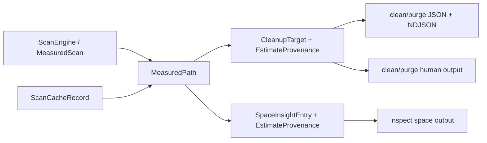

# Estimate Provenance Explainability - Plan

## Goal Capsule

| Field | Value |
|---|---|
| Objective | Make every cleanup and inspect estimate explain where it came from: source, scan backend, confidence, fallback reason, and caveats. |
| Authority | The user's "best cleanup CLI" and fearless-refactor direction is authoritative. Existing safety decisions around dry-run parity, delete-time revalidation, and symlink/reparse avoidance remain hard constraints. |
| Execution profile | Cross-cutting Rust refactor across core planning models, scan cache records, clean/purge/inspect CLI output, schemas, documentation, and tests. |
| Stop conditions | Stop if backend metadata becomes deletion authority, if the v1 machine contract is replaced by a new v2 surface, or if experimental NTFS/MFT behavior becomes a default cleanup dependency. |
| Tail ownership | Progress is represented by code, tests, docs, dogfood logs, and commits, not by editing this plan as a task board. |

---

## Product Contract

### Summary

Rebecca now has multiple scan backends, scan-cache freshness checks, and an experimental NTFS/MFT path, but the user-facing cleanup and inspect reports still mostly collapse measurement provenance into `estimate_source`.
That hides load-bearing trust details.
A best-in-class cleaner needs to tell users and automation whether an estimate came from a fresh portable walk, a Windows backend, a cache hit, or a fallback path with caveats.

The next product step is additive v1 explainability.
The work should preserve existing safety behavior while making fast paths inspectable before Rebecca grows live volume indexing.

### Problem Frame

`MeasuredScan` already carries `backend`, `confidence`, `fallback_reason`, and `caveats` in `crates/rebecca-core/src/scan/backend.rs`.
`ScanCacheRecord` also stores backend and confidence in `crates/rebecca-core/src/scan_cache.rs`.
The planner drops most of that context when it turns measured paths into `CleanupTarget` values in `crates/rebecca-core/src/planner/measure.rs` and `crates/rebecca-core/src/planner/rules.rs`.
`inspect space` has the same gap: `SpaceInsightEntry` only exposes `estimate_source`, and the CLI hardcodes `ScanBackendKind::PortableRecursive` in `crates/rebecca/src/inspect.rs`.

The result is a trust gap.
Machine consumers can see a target is `fresh-scan` or `scan-cache`, but not which backend produced the estimate, whether fallback happened, or whether an experimental backend added caveats.
Human output also cannot warn compactly when a result used fallback.

### Requirements

**Estimate Provenance Model**

- R1. Cleanup, purge, and inspect estimates must expose source, backend, confidence, fallback reason, and caveats when that metadata is known.
- R2. Existing `estimate_source` fields must remain present and stable in the v1 JSON/NDJSON contract.
- R3. Legacy serialized plans and outputs without new provenance fields must deserialize safely with unknown or empty defaults.
- R4. Backend provenance must be observational metadata only; deletion planning and execution must continue to rely on path revalidation and safety checks.

**Scan Cache And Backend Behavior**

- R5. Fresh scan estimates must preserve `MeasuredScan` backend, confidence, fallback reason, and caveats through planning and output.
- R6. Scan-cache hits must preserve the cached record's backend and confidence, and must not invent fallback or caveat details that were not stored.
- R7. Fallback paths from Windows native or NTFS/MFT experimental backends must remain visible in machine output and summarized in human output.
- R8. Experimental NTFS/MFT behavior must remain opt-in and read-only.

**CLI And Documentation**

- R9. Human clean, purge, and inspect output must show provenance only when it materially changes trust, such as cache hits, non-portable backends, fallback, or caveats.
- R10. Machine schemas and contract tests must document additive v1 provenance fields without reintroducing an API v2.
- R11. `inspect space` must accept the same scan backend selection vocabulary as clean dry-runs for measurement estimates.
- R12. README, CHANGELOG unreleased notes, release docs, and dogfood fixtures must describe the new explainability surface.

### Key Flows

- F1. A user runs `clean --dry-run --format json` with the portable backend.
  The target keeps `estimate_source: "fresh-scan"` and additionally reports the portable backend and exact confidence.
- F2. A user runs a second dry-run with scan cache enabled.
  The target keeps `estimate_source: "scan-cache"` and reports the backend/confidence stored with the cached record.
- F3. A Windows user selects a native or experimental backend that falls back.
  The machine output includes a fallback reason, and human output summarizes that the estimate fell back without flooding every normal target line.
- F4. A user runs `inspect space --scan-backend windows-native --format json`.
  Top entries expose the selected backend or fallback provenance using the same v1 field vocabulary as clean output.
- F5. A purge workflow reuses cleanup targets.
  Purge output keeps provenance parity with clean output, and delete execution still revalidates paths before action.

### Acceptance Examples

- AE1. Given a fresh portable dry-run, when JSON is rendered, then each measured target contains `estimate_source`, `estimate_backend`, `estimate_confidence`, and an empty or absent caveat list.
- AE2. Given a valid scan-cache hit, when JSON is rendered, then the target reports `estimate_source: "scan-cache"` and the cached backend/confidence.
- AE3. Given a Windows backend fallback, when JSON is rendered, then the target includes `estimate_fallback_reason`; human output includes one compact fallback note.
- AE4. Given an old serialized `CleanupPlan` without provenance fields, when it is deserialized, then defaults are safe and no existing contract test breaks.
- AE5. Given `inspect space --scan-backend windows-ntfs-mft-experimental` on an unsupported platform, when fallback succeeds, then the report exposes fallback provenance and caveats while still returning measured totals.

### Scope Boundaries

In scope:

- Additive v1 provenance fields on cleanup, purge, inspect, JSON, and NDJSON surfaces.
- Backend selection for `inspect space`.
- Compact human reporting for non-default trust details.
- Scan-cache propagation of already-known backend and confidence.
- Documentation, changelog, and dogfood updates.

Deferred to follow-up work:

- Live NTFS volume indexing and direct MFT subtree accounting.
- USN Journal incremental subtree accounting beyond current cache identity/freshness work.
- New cleanup rule intelligence based on backend provenance.
- A machine API v2.

Outside this product's identity:

- Using raw filesystem index metadata as direct delete authority.
- Making experimental NTFS/MFT scanning a silent default.

---

## Planning Contract

### Key Technical Decisions

- KTD1. Add an explicit estimate provenance model instead of overloading `EstimateSource`.
  `EstimateSource` stays as the stable source enum, while backend, confidence, fallback reason, and caveats become adjacent metadata.
- KTD2. Keep the machine contract v1 and additive.
  New fields must deserialize with defaults and serialize only where useful or stable, so old consumers keep seeing the existing `estimate_source`.
- KTD3. Propagate provenance at the core model boundary.
  `MeasuredPath`, `CleanupTarget`, and `SpaceInsightEntry` should carry the same conceptual metadata so CLI renderers do not reconstruct trust state from side channels.
- KTD4. Treat cache hits as provenance-preserving but not caveat-reconstructing.
  Existing cache records store backend and confidence; fallback reasons and caveats can be absent for cache hits unless the cache format already has durable fields for them.
- KTD5. Human output should be quiet by default and loud on trust changes.
  Portable fresh scans do not need extra wording on every line; cache hits, fallback, experimental caveats, and non-portable backends do.
- KTD6. `inspect space` backend selection is measurement-only.
  It must share scan backend parsing with clean where practical, but it must not alter cleanup execution semantics.

### High-Level Technical Design

The core rule is one-way propagation.
Scan backends and cache records produce provenance, planners attach it to targets, and renderers display it.
No renderer should infer backend behavior from path shape, platform, or CLI flags.

### Assumptions

- `ScanEstimateConfidence` remains `Exact` today, but the model should not block future confidence levels.
- Cache format migration can be additive because legacy records already default backend and confidence safely.
- Human output can remain concise if machine output carries the full detail.
- Current reference-project research remains design guidance only; GPL projects are not copied into Rebecca.

### System-Wide Impact

This plan touches exported CLI contracts, test fixtures, docs, and cache-backed planning behavior.
The change is intentionally breaking only where the user has permitted fearless refactor and only when needed for correctness.
The preferred path is additive v1 compatibility because automation already consumes Rebecca JSON.

### Risks & Dependencies

- Risk: provenance fields may become noisy in human output.
  Mitigation: show compact suffixes or summary notes only for cache, fallback, caveat, or non-portable backend cases.
- Risk: cache hits may look less detailed than fresh scans.
  Mitigation: preserve backend/confidence now and defer durable fallback/caveat cache persistence unless implementation finds it already cheap.
- Risk: adding fields to shared models may break many tests.
  Mitigation: characterize model serialization first, then update CLI fixtures in one pass.
- Risk: Windows backend tests are platform-sensitive.
  Mitigation: assert fallback semantics on non-Windows and native semantics behind existing platform gates.

### Sources & Research

- `crates/rebecca-core/src/scan/backend.rs` already defines `MeasuredScan`, `ScanBackendKind`, `ScanEstimateConfidence`, and `ScanEstimateCaveat`.
- `crates/rebecca-core/src/planner/measure.rs` currently drops measured scan metadata after producing `estimate_source`.
- `crates/rebecca-core/src/scan_cache.rs` and `crates/rebecca-core/src/scan_cache/store.rs` already store cache backend and confidence.
- `crates/rebecca-core/src/inspect.rs` exposes `SpaceInsightEntry.estimate_source` but no backend provenance.
- `crates/rebecca/src/cli.rs` already has clean scan backend argument parsing that inspect can reuse.
- `docs/knowledge/engineering/current-state.md` names backend-specific caveat reporting as the next likely track.

---

## Implementation Units

### U1. Add Core Estimate Provenance Model

**Goal:** Introduce shared core metadata for estimate backend, confidence, fallback reason, and caveats while preserving `estimate_source`.

**Requirements:** R1, R2, R3, R4, AE1, AE4

**Dependencies:** None

**Files:** `crates/rebecca-core/src/plan.rs`, `crates/rebecca-core/src/scan/backend.rs`, `crates/rebecca-core/tests/model_contract.rs`

**Approach:** Add a small provenance type or equivalent fields that can be embedded in `CleanupTarget` without changing the meaning of `estimate_source`.
Provide constructors/defaults so legacy targets deserialize to unknown or empty metadata.
Keep serialization names stable and human-readable, matching existing enum label style.

**Execution note:** Start with serialization and legacy-deserialization characterization tests before changing planner code.

**Patterns to follow:** Existing `EstimateSource` serde labels and `cleanup_plan_deserializes_legacy_target_without_estimate_source`.

**Test scenarios:**

- Given a target built from a fresh scan with backend metadata, serialization includes source, backend, confidence, and no fallback reason.
- Given a target with fallback metadata, serialization includes fallback reason and caveats.
- Given legacy JSON without new fields, deserialization succeeds and defaults are safe.
- Given `EstimateSource::NotMeasured`, provenance fields stay absent or empty.

**Verification:** Core model tests prove additive v1 compatibility and stable field labels.

### U2. Preserve Provenance Through Planner And Scan Cache

**Goal:** Carry provenance from `MeasuredScan` and scan-cache hits into planned cleanup targets.

**Requirements:** R1, R4, R5, R6, R7, AE1, AE2, AE3

**Dependencies:** U1

**Files:** `crates/rebecca-core/src/planner/measure.rs`, `crates/rebecca-core/src/planner/rules.rs`, `crates/rebecca-core/src/scan_cache.rs`, `crates/rebecca-core/src/scan_cache/store.rs`, `crates/rebecca-core/tests/planner.rs`, `crates/rebecca-core/tests/scan_engine.rs`

**Approach:** Extend the measured-path result to hold provenance.
Fresh scans copy metadata directly from `MeasuredScan`.
Cache hits use durable cache record backend/confidence and preserve `estimate_source: "scan-cache"`.
Rule planning attaches provenance when it creates each `CleanupTarget`.

**Patterns to follow:** Existing `MeasuredPath`, `MeasuredScanCacheEvent`, and scan-cache identity tests.

**Test scenarios:**

- Given a fresh portable scan, planner targets include portable backend and exact confidence.
- Given a Windows native request that falls back, planner targets include portable backend plus fallback reason.
- Given a cache hit from a Windows-native record, planner targets include scan-cache source and Windows-native backend.
- Given a cache miss followed by fresh measurement, planner targets include fresh-scan source and measured backend.

**Verification:** Planner tests prove target provenance for fresh scans, cache hits, and fallback paths without changing delete eligibility.

### U3. Surface Provenance In Clean And Purge Output

**Goal:** Render provenance consistently in clean and purge human, JSON, and NDJSON outputs.

**Requirements:** R1, R2, R7, R9, R10, R12, AE1, AE2, AE3

**Dependencies:** U1, U2

**Files:** `crates/rebecca/src/clean_view.rs`, `crates/rebecca/src/purge_view.rs`, `crates/rebecca/src/render.rs`, `crates/rebecca/src/render/clean.rs`, `crates/rebecca/src/render/purge.rs`, `crates/rebecca/tests/cli_clean.rs`, `crates/rebecca/tests/cli_purge.rs`, `crates/rebecca/tests/cli_api.rs`, `docs/api/cli/v1/payloads.schema.json`

**Approach:** Project provenance into view rows once, then use render helpers for both clean and purge.
JSON/NDJSON should expose the full additive fields.
Human output should add compact trust notes only when backend, fallback, cache, or caveat details matter.

**Patterns to follow:** Existing estimate suffix rendering pattern, clean view projection, purge view projection, and CLI contract tests.

**Test scenarios:**

- Given clean JSON output for a fresh scan, target objects include provenance fields and preserve `estimate_source`.
- Given purge JSON output after a dry-run, target objects carry the same provenance fields as clean.
- Given human output for a default portable fresh scan, output remains concise.
- Given human output for a cache hit or fallback, output includes a compact provenance note.
- Given NDJSON target progress or completion events, event payloads do not contradict final target provenance.

**Verification:** CLI tests prove clean/purge parity and schema tests prove the additive v1 contract.

### U4. Add Inspect Space Backend Selection And Provenance

**Goal:** Let `inspect space` choose scan backends and expose provenance on top entries.

**Requirements:** R1, R2, R5, R7, R8, R9, R10, R11, AE5

**Dependencies:** U1, U2

**Files:** `crates/rebecca-core/src/inspect.rs`, `crates/rebecca/src/cli.rs`, `crates/rebecca/src/inspect.rs`, `crates/rebecca/src/render/inspect.rs`, `crates/rebecca-core/tests/space_insight.rs`, `crates/rebecca/tests/cli_inspect.rs`

**Approach:** Add scan backend to `SpaceInsightRequest`, defaulting to portable recursive.
Route CLI parsing through the existing backend argument vocabulary.
Return the same provenance metadata shape on `SpaceInsightEntry`.
Human inspect output should show provenance only for cache, fallback, caveat, or non-portable backend cases.

**Patterns to follow:** Existing clean `--scan-backend` parsing, `SpaceInsightScanCache`, and inspect rendering.

**Test scenarios:**

- Given default `inspect space`, entries report portable fresh provenance.
- Given `inspect space --scan-backend windows-native` on unsupported platforms, entries report fallback provenance when measurement succeeds.
- Given scan cache enabled for inspect, a second run reports scan-cache source plus cached backend/confidence.
- Given JSON output, top entries expose the same field names used by clean targets.
- Given human inspect output for default fresh scans, output remains concise.

**Verification:** Core and CLI inspect tests prove backend selection, fallback visibility, and v1 field parity.

### U5. Update Schemas, Docs, Changelog, And Dogfood

**Goal:** Document provenance fields and make release validation prove the new trust surface.

**Requirements:** R10, R12

**Dependencies:** U3, U4

**Files:** `README.md`, `CHANGELOG.md`, `docs/release.md`, `docs/configuration.md`, `docs/api/cli/v1/payloads.schema.json`, `docs/knowledge/engineering/current-state.md`, `dogfood/`

**Approach:** Update user docs and schemas after field names settle.
Add unreleased changelog notes.
Refresh dogfood samples so a maintainer can see backend/confidence/fallback fields without reading code.

**Patterns to follow:** Current CHANGELOG unreleased section, release dogfood notes, and API schema naming.

**Test scenarios:**

- Given schema validation fixtures, the new fields are accepted in clean and inspect outputs.
- Given docs examples, field names match real CLI JSON output.
- Given changelog review, the unreleased entry names the user-visible explainability change.

**Verification:** Docs and schema updates are consistent with CLI output generated by tests or dogfood.

### U6. Final Compatibility And Cleanup Gates

**Goal:** Remove obsolete wording and dead code left by the refactor, then verify the workspace.

**Requirements:** R2, R3, R4, R8, R10, R12

**Dependencies:** U1, U2, U3, U4, U5

**Files:** `crates/rebecca-core/src/`, `crates/rebecca/src/`, `crates/rebecca-core/tests/`, `crates/rebecca/tests/`, `docs/`

**Approach:** Sweep for stale `v2` language, duplicated provenance formatting, unused helpers, and misleading docs.
Keep breaking cleanup where it simplifies the new model, but do not remove v1 fields that automation already uses.

**Patterns to follow:** Existing final-gate commits from the performance plan and `cargo deny` policy.

**Test scenarios:**

- Given workspace tests, no old `estimate_source` behavior regresses.
- Given clippy with all targets and features, no dead code or warning remains.
- Given docs search, no obsolete v2 or backend-caveat TODO contradicts the implemented surface.
- Given dogfood output, provenance is visible for at least one machine-readable command.

**Verification:** Full quality gates pass, and the final diff contains no abandoned implementation attempt.

---

## Verification Contract

Run focused gates as each unit lands, then the full workspace gates before completion:

- Formatting: `cargo fmt --all --check`
- Core model and planner: `cargo nextest run -p rebecca-core --test model_contract --test planner --test scan_engine --test space_insight`
- CLI output contracts: `cargo nextest run -p rebecca --test cli_clean --test cli_purge --test cli_inspect --test cli_api`
- Workspace tests: `cargo nextest run --workspace`
- Lints: `cargo clippy --workspace --all-targets --all-features -- -D warnings`
- Dependency and license policy: `cargo deny check`
- Diff hygiene: `git diff --check`

Dogfood should include at least one clean JSON command and one inspect JSON command where the output visibly includes provenance fields.
If platform-specific Windows behavior cannot be exercised on the current machine, fallback behavior and non-Windows unsupported-path tests are acceptable for this plan.

---

## Definition of Done

- Cleanup targets expose stable additive v1 provenance fields while keeping `estimate_source`.
- Purge output preserves cleanup target provenance.
- `inspect space` accepts scan backend selection and exposes provenance on top entries.
- Fresh scans, scan-cache hits, and fallback paths have test coverage.
- Human output is concise for normal portable fresh scans and informative for cache/fallback/caveat cases.
- README, CHANGELOG unreleased notes, docs, schemas, and dogfood references match implemented field names.
- No API v2 is reintroduced.
- No backend metadata is used as deletion authority.
- Full verification gates in this plan pass, or any skipped platform-specific gate is explicitly documented with the reason.
- Dead code, abandoned experiments, and stale wording from earlier approaches are removed before final commit.
