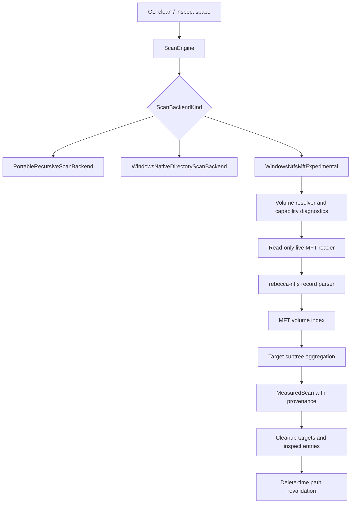
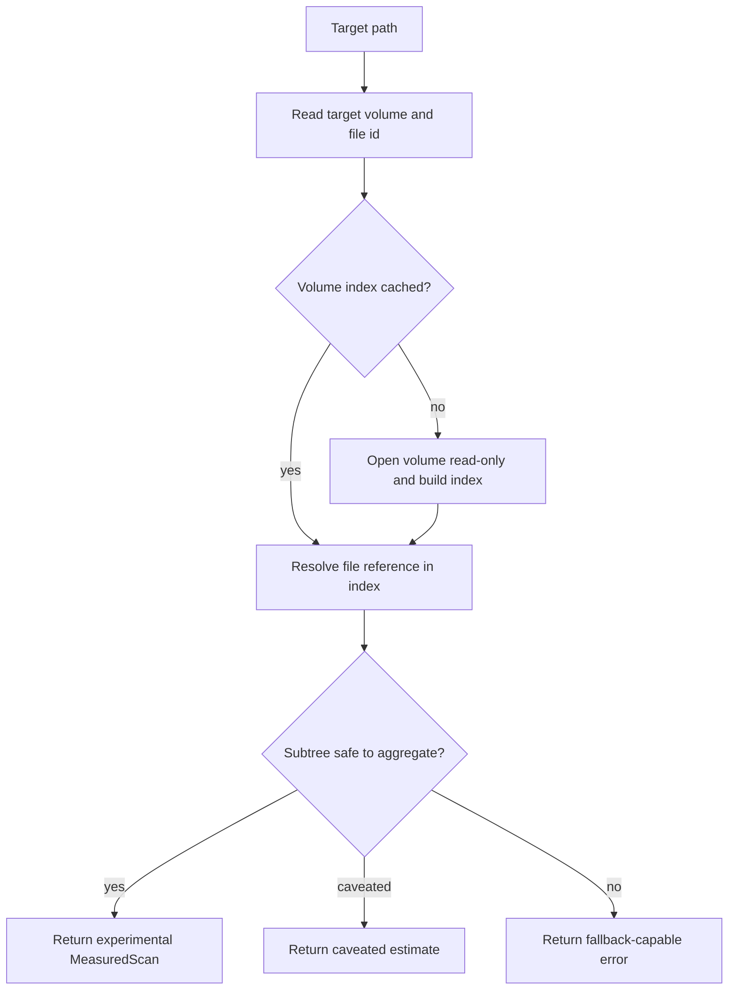

# NTFS Live Volume Index - Plan

## Goal Capsule

| Field | Value |
|---|---|
| Objective | Turn `windows-ntfs-mft-experimental` from a safe fallback selector into a real opt-in, read-only NTFS live volume indexing backend for cleanup estimates and `inspect space`. |
| Authority | The user's "best cleanup CLI" and fearless-refactor direction is authoritative. Rebecca's safety ADRs and delete-time revalidation remain hard constraints. |
| Execution profile | Deep Windows-focused Rust work across `rebecca-windows`, `rebecca-ntfs`, `rebecca-core` scan backends, CLI provenance, tests, dogfood, and performance reporting. |
| Stop conditions | Stop if raw NTFS metadata becomes deletion authority, the backend becomes default, unsupported privilege paths fail without fallback, reparse protection weakens, or GPL code is copied. |
| Tail ownership | Progress is represented by code, tests, dogfood artifacts, docs, and commits, not by editing this plan as a task board. |

---

## Product Contract

### Summary

Rebecca now has a backend-neutral `ScanEngine`, Windows native fallback, scan-cache provenance, and CLI output fields for backend, confidence, fallback reason, and caveats.
The remaining gap for WizTree-class speed is live NTFS metadata indexing.
This plan makes the existing `windows-ntfs-mft-experimental` selector attempt a real read-only MFT index on supported local NTFS volumes, while preserving fallback, caveats, and deletion safety.

### Problem Frame

The current experimental selector in `crates/rebecca-core/src/scan.rs` always reports live volume indexing as unavailable, then falls back to Windows native or portable scanning.
`crates/rebecca-windows/src/ntfs_scan.rs` only exposes an unavailable error, and `crates/rebecca-ntfs/src/lib.rs` intentionally parses exported record bytes without opening volumes.
That split is correct, but incomplete: `rebecca-windows` needs the live volume boundary, `rebecca-ntfs` needs a reusable index and path mapping model, and `rebecca-core` needs to reuse per-volume indexes when one command measures many targets.

The product risk is correctness, not just API plumbing.
NTFS records can be deleted, pathless, reparse-backed, hard-linked, attribute-listed, compressed, sparse, or inaccessible without privileges.
The backend must treat those cases conservatively and keep raw metadata as an estimate source only.

### Requirements

**Backend Capability**

- R1. The explicit `windows-ntfs-mft-experimental` backend must attempt live NTFS indexing only on supported local NTFS volumes.
- R2. Live NTFS access must open volume or metadata streams read-only and must never mutate filesystem state.
- R3. Unsupported platform, unsupported filesystem, permission denial, unreadable metadata, parse uncertainty, and path mismatch must produce structured fallback reasons rather than hard CLI failures when a safe scanner can continue.
- R4. A successful live MFT estimate must report `estimate_backend: windows-ntfs-mft-experimental`, `estimate_confidence`, and any caveats through existing clean, purge, inspect, and scan-cache surfaces.

**Correctness And Safety**

- R5. NTFS metadata estimates must never bypass cleanup safety assessment or executor path revalidation.
- R6. Reparse points, symlinks, deleted records, pathless records, unsupported attribute-list cases, and ambiguous hardlink accounting must be excluded or caveated conservatively.
- R7. Byte totals for supported live estimates must be compared against portable or Windows native scans on fixture trees and real dogfood runs, with mismatches above the chosen threshold failing tests or forcing caveated fallback.
- R8. The backend must preserve cancellation and bounded parallelism expectations from `ScanEngine`.

**Indexing And Performance**

- R9. The implementation must build a per-volume MFT index keyed by file reference with parent links and subtree byte aggregation.
- R10. Target path resolution must prefer Windows file identity when available and use path-name lookup only as a guarded fallback.
- R11. A single command measuring multiple targets on the same volume must reuse one live volume index instead of reparsing `$MFT` per target.
- R12. Performance reporting must compare portable, Windows native, and experimental NTFS/MFT backends on many-small, large-directory, deep-tree, and repeated-target scenarios.

**UX, Docs, And License Boundary**

- R13. Human output must stay quiet for ordinary fallback success but show compact backend, fallback, and caveat details when the user opted into the experimental backend.
- R14. Documentation must explain privileges, supported volume types, fallback behavior, dogfood commands, and why metadata estimates are not deletion authority.
- R15. OSS references under `repo-ref/` may shape architecture only; GPL code must not be copied, and any dependency or fixture must pass `cargo deny check`.

### Key Flows

- F1. Supported NTFS dry-run estimate.
  - **Trigger:** User runs `clean --dry-run --scan-backend windows-ntfs-mft-experimental` for targets on a local NTFS volume.
  - **Steps:** Core selects the experimental backend, Windows resolves the volume, the live index is built once, target file identity maps to an MFT entry, subtree bytes are aggregated, and output exposes experimental provenance.
  - **Outcome:** The user gets a fast estimate with visible backend provenance and unchanged cleanup safety.
  - **Covered by:** R1, R2, R4, R5, R9, R10
- F2. Unsupported or unprivileged volume fallback.
  - **Trigger:** User selects the experimental backend on non-Windows, non-NTFS, network, removable, or permission-denied paths.
  - **Steps:** Capability diagnostics classify the reason, core falls back to Windows native or portable scanning, and provenance records the fallback chain.
  - **Outcome:** The command still returns useful estimates when safe scanning can continue.
  - **Covered by:** R3, R4, R13, R14
- F3. `inspect space` top entries reuse one volume index.
  - **Trigger:** User runs `inspect space --scan-backend windows-ntfs-mft-experimental` on several roots from the same volume.
  - **Steps:** The scan context groups by volume, builds one index, measures each requested subtree, and emits top entries with backend/caveat fields.
  - **Outcome:** Inspect avoids repeated full-volume parses and remains explainable.
  - **Covered by:** R9, R11, R12
- F4. Metadata ambiguity becomes caveat or fallback.
  - **Trigger:** The live index sees reparse records, deleted records, pathless entries, unsupported attribute-list data, or ambiguous hardlinks under a target.
  - **Steps:** Aggregation excludes unsafe records or marks the estimate caveated; severe uncertainty falls back to a directory scan.
  - **Outcome:** Rebecca favors conservative correctness over overstated speed.
  - **Covered by:** R6, R7
- F5. Delete execution after an MFT estimate.
  - **Trigger:** User executes a cleanup plan that was estimated by the experimental backend.
  - **Steps:** Executor revalidates each live path through the existing safety policy before sending it to the deletion backend.
  - **Outcome:** Raw NTFS metadata does not authorize deletion.
  - **Covered by:** R5

### Acceptance Examples

- AE1. Given a supported local NTFS fixture and sufficient privileges, when the experimental backend measures a directory, then `MeasuredScan.backend` is `WindowsNtfsMftExperimental` and the report totals match a portable scan within the accepted threshold.
- AE2. Given the experimental backend on a non-NTFS or unsupported path, when fallback succeeds, then output includes a fallback reason containing `windows-ntfs-mft-experimental` and retains the actual fallback backend.
- AE3. Given a target containing a reparse child, when live indexing aggregates the subtree, then the reparse entry is not counted as a traversed normal subtree and the estimate carries a caveat or falls back.
- AE4. Given several targets on the same volume in one command, when measurement runs, then the live MFT index is built once and reused for each target.
- AE5. Given a path-to-record identity mismatch, when the backend resolves the target, then it does not return a successful experimental estimate and instead falls back with a diagnostic.
- AE6. Given a cleanup plan produced from an experimental estimate, when execution starts, then existing executor safety tests still prove live path revalidation before deletion.
- AE7. Given `inspect space --scan-backend windows-ntfs-mft-experimental`, when entries are reported, then `estimate_backend`, `estimate_confidence`, `estimate_fallback_reason`, and `estimate_caveats` serialize per entry.
- AE8. Given GPL reference projects in `repo-ref/`, when implementation lands, then no copied source or incompatible fixture is introduced into tracked code.

### Scope Boundaries

In scope:

- Read-only live NTFS volume capability checks and MFT reading on Windows.
- `rebecca-ntfs` index construction, file-reference lookup, and subtree aggregation.
- `rebecca-core` backend wiring, fallback, provenance, cancellation, and per-command index reuse.
- CLI and docs updates for the experimental backend.
- Fixture-backed tests, mocked Windows-boundary tests, dogfood commands, and performance matrix coverage.

Deferred:

- USN Journal incremental subtree updates.
- Persistent on-disk NTFS indexes.
- Making NTFS/MFT the default scan backend.
- Full disk treemap UI or TUI features.
- Duplicate cleanup, hardlink rewrite, recovery, or forensic extraction features.

Outside this product's identity:

- Treating raw metadata as permission to delete.
- Silent elevation or auto-enabling privileged scanning.
- Copying GPL implementation code.

---

## Planning Contract

### Key Technical Decisions

- KTD1. `rebecca-windows` owns live volume handles and privilege diagnostics.
  Platform APIs, filesystem type checks, file identity reads, and handle flags stay outside `rebecca-core` and outside the parser crate.
- KTD2. `rebecca-ntfs` remains a pure parser and index crate.
  It consumes readers and record bytes, builds file-reference graphs, and reports parse caveats without knowing about Windows handles or cleanup policy.
- KTD3. The experimental backend returns through `MeasuredScan`.
  Core and CLI callers should not grow a special NTFS path; they consume the same backend, confidence, fallback, and caveat fields added for estimate provenance.
- KTD4. Fallback is the product contract.
  Capability and parse errors that leave safe scanning possible become fallback reasons, while only unrecoverable programmer or cancellation paths should stop the command.
- KTD5. File identity is the primary path resolver.
  Windows file id and volume identity should validate that the requested path maps to the record being measured; normalized path lookup is a fallback with caveats.
- KTD6. One command owns one bounded index cache.
  Reusing an in-memory `NtfsVolumeIndexCache` avoids reparsing large MFTs for every target while keeping memory lifetime short and avoiding stale persistent indexes.
- KTD7. Ambiguity is represented, not hidden.
  `ScanEstimateConfidence` may need a caveated or approximate variant if exact totals cannot be claimed; severe ambiguity must fall back.
- KTD8. OSS references are design inputs only.
  `repo-ref/windirstat`, `repo-ref/edirstat`, `repo-ref/mft`, `repo-ref/ntfs`, `repo-ref/usn-parser-rs`, and `repo-ref/usn-journal-rs` guide boundaries and test ideas, not copied code.

### High-Level Technical Design

### System-Wide Impact

- `ScanEngine` likely needs a short-lived scan context or backend session so multiple target measurements can share one volume index.
- `ScanEstimateConfidence` currently only has `Exact`; live MFT accounting may require an additive confidence variant or stricter fallback when exactness cannot be defended.
- Existing scan-cache records can store experimental backend provenance, but cache invalidation must remain conservative until USN work lands.
- Windows tests need mockable volume access because normal CI should not require elevated live volume reads.
- Release dogfood gains an optional privileged Windows smoke path, while normal verification remains fixture-backed.

### Sequencing

| Phase | Units | Outcome |
|---|---|---|
| Phase 1 | U1, U2 | Windows live volume boundary is diagnosable, read-only, and mockable. |
| Phase 2 | U3 | `rebecca-ntfs` can build an index and aggregate target subtrees from records. |
| Phase 3 | U4, U5 | Core backend returns successful experimental estimates and reuses volume indexes per command. |
| Phase 4 | U6, U7, U8 | Performance, docs, dogfood, changelog, and dead-code cleanup make the feature releasable as experimental. |

### Risks And Mitigations

| Risk | Impact | Mitigation |
|---|---|---|
| Live volume access requires privileges that vary by Windows version and policy. | Users may see inconsistent behavior. | Classify capability failures and make fallback first-class. |
| NTFS edge cases make exact byte accounting hard. | Estimates could be wrong. | Add caveats, compare against safe scans, and fall back when exactness is not defensible. |
| Full-volume indexes consume too much memory on large disks. | Large scans could regress or fail. | Store compact entries, reuse per command only, and add memory-oriented tests or benchmarks. |
| Backend session sharing complicates `ScanEngine`. | Core API could become leaky. | Add a narrow internal context rather than exposing Windows concepts to callers. |
| License contamination from reference projects. | Release policy could be violated. | Use design-only notes for GPL references and rely on original code or compatible crates. |

---

## Implementation Units

### U1. Add Windows volume resolution and capability diagnostics

- **Goal:** Resolve a target path into a supported local NTFS volume identity before any MFT read is attempted.
- **Requirements:** R1, R2, R3, R10, R14.
- **Dependencies:** None.
- **Files:** `crates/rebecca-windows/src/ntfs_scan.rs`, optional `crates/rebecca-windows/src/volume.rs`, `crates/rebecca-windows/src/lib.rs`, `crates/rebecca-windows/tests/ntfs_scan.rs`, `docs/configuration.md`, `docs/release.md`.
- **Approach:** Introduce a small `NtfsVolumeCapabilities` model with volume root, volume serial or GUID, filesystem name, local-drive eligibility, required privileges, and target file identity when available.
  Keep diagnostics structured enough that `crates/rebecca-core/src/scan.rs` can convert them into fallback reasons.
  The capability layer must be mockable for tests and must not open write handles.
- **Patterns to follow:** Existing Windows cfg boundaries in `crates/rebecca-windows/src/lib.rs`, scan-cache volume identity helpers in `crates/rebecca-core/src/scan_cache.rs`, and the current unavailable error in `crates/rebecca-windows/src/ntfs_scan.rs`.
- **Test scenarios:** Non-Windows returns platform unavailable; non-NTFS capability returns fallback-capable unavailable; permission denied includes the experimental backend label; target file identity is captured when supported; no write access flags are requested.
- **Verification:** `cargo nextest run -p rebecca-windows` and `cargo nextest run -p rebecca-core --test scan_engine`.

### U2. Implement the read-only live MFT reader boundary

- **Goal:** Provide a Windows-only, read-only source of MFT record bytes without leaking handle logic into `rebecca-ntfs`.
- **Requirements:** R2, R3, R8, R15.
- **Dependencies:** U1.
- **Files:** `crates/rebecca-windows/src/ntfs_scan.rs`, optional `crates/rebecca-windows/src/ntfs_reader.rs`, `crates/rebecca-ntfs/src/reader.rs`, `crates/rebecca-windows/tests/ntfs_scan.rs`, `crates/rebecca-ntfs/tests/`.
- **Approach:** Define a reader adapter that can stream or batch MFT record bytes from a live volume through a trait already consumable by `MftRecordReader`.
  Keep real Windows handle code behind cfg gates and test most behavior with a fake reader.
  Surface cancellation checkpoints between record batches.
- **Patterns to follow:** `crates/rebecca-ntfs/src/reader.rs`, `repo-ref/ntfs/src/boot_sector.rs`, `repo-ref/mft/src/mft.rs`, and `repo-ref/usn-journal-rs/src/volume.rs` as design references.
- **Test scenarios:** Fake reader yields multiple record batches; read errors become fallback-capable scan failures; cancellation stops batch iteration; truncated records do not panic; handle creation remains read-only in the Windows boundary.
- **Verification:** `cargo nextest run -p rebecca-ntfs` and `cargo nextest run -p rebecca-windows`.

### U3. Build `rebecca-ntfs` volume index and subtree aggregation

- **Goal:** Convert parsed MFT records into a compact index that can resolve file references and aggregate subtree byte totals.
- **Requirements:** R6, R7, R9, R10.
- **Dependencies:** U2 for final integration; pure parser tests can start independently.
- **Files:** `crates/rebecca-ntfs/src/tree.rs`, optional `crates/rebecca-ntfs/src/index.rs`, `crates/rebecca-ntfs/src/record.rs`, `crates/rebecca-ntfs/src/attrs.rs`, `crates/rebecca-ntfs/tests/`, `crates/rebecca-ntfs/benches/`.
- **Approach:** Extend the current `MftTree` model into a volume index keyed by file reference and parent reference.
  Track allocated data size, logical size if needed, directory/file counts, deleted status, reparse status, path availability, hardlink signals, and parse caveats.
  Aggregation should return a summary plus caveat codes, not just a byte count.
- **Patterns to follow:** Existing `MftTree`, `SubtreeSummary`, parser caveat tests, `repo-ref/edirstat/src/engine/mft.rs`, and `repo-ref/mft/tests/test_entry.rs`.
- **Test scenarios:** Parent-child aggregation sums bytes and counts; deleted records are excluded or caveated; pathless records do not resolve silently; reparse records are identified; hardlink ambiguity is reported; attribute-list unsupported records produce caveats; generated large-record fixtures benchmark without pathological memory growth.
- **Verification:** `cargo nextest run -p rebecca-ntfs` and `cargo check -p rebecca-ntfs --benches` if a bench target is added.

### U4. Wire the experimental backend through `ScanEngine`

- **Goal:** Replace the current always-unavailable experimental stub with a real backend call that returns `MeasuredScan` on supported Windows volumes and falls back otherwise.
- **Requirements:** R1, R3, R4, R5, R8, R13.
- **Dependencies:** U1, U2, U3.
- **Files:** `crates/rebecca-core/src/scan.rs`, `crates/rebecca-core/src/scan/backend.rs`, `crates/rebecca-windows/src/ntfs_scan.rs`, `crates/rebecca-windows/src/lib.rs`, `crates/rebecca-core/tests/scan_engine.rs`, `crates/rebecca/tests/cli_clean.rs`, `crates/rebecca/tests/cli_inspect.rs`, `crates/rebecca/tests/cli_api.rs`.
- **Approach:** Add a Windows-only experimental backend adapter analogous to `WindowsNativeDirectoryScanBackend`.
  Successful live estimates must use `MeasuredScan::exact` only when exactness is defensible; otherwise add a new confidence variant or force fallback.
  Preserve the current fallback chain from NTFS experimental to Windows native to portable.
- **Patterns to follow:** `measure_windows_native_with_portable_fallback`, `measure_windows_ntfs_mft_with_fallback`, `WindowsNativeDirectoryScanBackend`, and the estimate provenance fields from `docs/plans/2026-07-02-001-feat-estimate-provenance-explainability-plan.md`.
- **Test scenarios:** Mocked live backend success reports experimental backend; unsupported capability falls back with existing caveat code or a refined one; cancellation propagates; delete execution still revalidates paths; CLI JSON includes backend, confidence, fallback reason, and caveats.
- **Verification:** `cargo nextest run -p rebecca-core --test scan_engine --test planner`, `cargo nextest run -p rebecca --test cli_clean --test cli_inspect --test cli_api`.

### U5. Add per-command NTFS volume index reuse

- **Goal:** Avoid reparsing the same volume for every target measured during one clean or inspect command.
- **Requirements:** R9, R11, R12.
- **Dependencies:** U4.
- **Files:** `crates/rebecca-core/src/scan.rs`, optional `crates/rebecca-core/src/scan/session.rs`, `crates/rebecca-core/src/planner/measure.rs`, `crates/rebecca-core/src/inspect.rs`, `crates/rebecca-windows/src/ntfs_scan.rs`, `crates/rebecca-core/tests/planner.rs`, `crates/rebecca-core/tests/space_insight.rs`, `crates/rebecca-core/benches/perf_matrix.rs`.
- **Approach:** Introduce an internal scan session or backend context that can hold an `NtfsVolumeIndexCache` keyed by volume identity.
  Keep the public CLI and planner APIs small by threading the context through existing measurement paths rather than exposing Windows-specific types.
  Bound memory by command lifetime and drop indexes after reporting.
- **Patterns to follow:** Existing bounded scan pool ownership in `crates/rebecca-core/src/scan.rs`, planner measurement batching in `crates/rebecca-core/src/planner/measure.rs`, and scan-cache hit provenance flow.
- **Test scenarios:** Multiple targets on one mocked volume build one index; targets on different volumes build separate indexes; fallback for one volume does not poison another; concurrent target measurement does not race or double-build; `inspect space` honors `--scan-backend`.
- **Verification:** Core planner and space-insight tests pass, and the perf matrix can distinguish repeated-target experimental scans.

### U6. Expand correctness and performance matrix coverage

- **Goal:** Prove the experimental backend is faster only when it is also correct enough to trust as an estimate.
- **Requirements:** R7, R12.
- **Dependencies:** U4, U5.
- **Files:** `crates/rebecca-core/benches/perf_matrix.rs`, `scripts/perf/run-benchmark-matrix.ps1`, `docs/performance/perf-matrix.md`, `docs/release.md`, optional `crates/rebecca-windows/tests/fixtures/`.
- **Approach:** Add backend comparison scenarios that record actual backend, confidence, fallback reason, caveat count, wall time, file count, directory count, byte count, and whether the run used live MFT.
  Keep live NTFS dogfood optional and explicit so normal CI can pass without elevation.
  Add a portable-vs-experimental comparison helper for real-machine smoke runs.
- **Patterns to follow:** Existing `many_small_windows_ntfs_mft_experimental_scan_1024_files` scenario and `scripts/perf/run-benchmark-matrix.ps1`.
- **Test scenarios:** Scenario manifest includes NTFS experimental fields; fallback runs still assert portable-equivalent totals; live dogfood records skip reasons when privileges are unavailable; mismatch reports include both backend totals.
- **Verification:** `cargo check -p rebecca-core --benches`, `pwsh -File scripts/perf/run-benchmark-matrix.ps1`, and targeted dogfood on a local NTFS path when available.

### U7. Update docs, changelog, and release dogfood

- **Goal:** Make the experimental backend understandable and safe to try.
- **Requirements:** R13, R14, R15.
- **Dependencies:** U4, U6.
- **Files:** `README.md`, `CHANGELOG.md`, `docs/configuration.md`, `docs/release.md`, `docs/performance/perf-matrix.md`, `docs/adr/0005-scan-engine-strategy.md`, `docs/api/cli/v1/README.md`, `docs/knowledge/engineering/current-state.md`, `docs/knowledge/engineering/log.md`.
- **Approach:** Document opt-in usage, supported volumes, privilege expectations, fallback behavior, caveat fields, and the guarantee that MFT estimates do not authorize deletion.
  Add unreleased changelog notes for the user-visible experimental backend and any machine-output additions.
  Record dogfood commands and skip reasons.
- **Patterns to follow:** Existing estimate provenance docs, release dogfood commands, and engineering memory conventions.
- **Test scenarios:** CLI API examples match serialized fields; release guide has both fallback and live-run examples; changelog entry names the experimental nature and safety posture; docs do not imply the backend is default.
- **Verification:** `cargo nextest run -p rebecca --test cli_api`, `cargo deny check`, and `git diff --check`.

### U8. Remove obsolete stub-only code and harden the license boundary

- **Goal:** Finish the refactor by deleting dead fallback-only scaffolding and proving the new implementation is original and policy-compliant.
- **Requirements:** R15 and all safety requirements.
- **Dependencies:** U1 through U7.
- **Files:** `crates/rebecca-core/src/scan.rs`, `crates/rebecca-windows/src/ntfs_scan.rs`, `crates/rebecca-ntfs/src/`, `deny.toml`, `Cargo.toml`, `CHANGELOG.md`, docs under `docs/`.
- **Approach:** Remove unreachable stub messages once the real backend path exists, collapse duplicate fallback wording, and keep only the diagnostics that represent real runtime conditions.
  If a compatible dependency is added, document why it is acceptable; if no dependency is used, keep reference use as design-only notes.
- **Patterns to follow:** Repository license policy, `docs/adr/0007-rule-catalog-and-license-provenance.md`, and existing `cargo deny check` gates.
- **Test scenarios:** No tests assert the old "live volume indexing is not enabled in this build" stub when the feature is compiled; fallback tests assert real capability reasons; `cargo deny check` passes; tracked files contain no copied GPL source.
- **Verification:** Full final gate set in the Verification Contract.

---

## Verification Contract

| Gate | Command | When | Done Signal |
|---|---|---|---|
| Format | `cargo fmt --all --check` | After Rust edits and final | No formatting drift. |
| NTFS parser | `cargo nextest run -p rebecca-ntfs` | After U2-U3 and final | Parser, index, caveat, and aggregation tests pass without live volume access. |
| Windows adapter | `cargo nextest run -p rebecca-windows` | After U1-U2, U4, and final | Capability diagnostics, mocked reader behavior, and cfg boundaries pass. |
| Core scan and planner | `cargo nextest run -p rebecca-core --test scan_engine --test planner --test space_insight` | After U4-U5 | Backend selection, fallback, provenance, planner, and inspect behavior pass. |
| CLI contracts | `cargo nextest run -p rebecca --test cli_clean --test cli_inspect --test cli_api` | After U4 and U7 | Human and JSON output expose backend provenance without breaking v1 contracts. |
| Bench compile | `cargo check -p rebecca-core --benches` | After U6 | Performance matrix code tracks real APIs. |
| Perf matrix | `pwsh -File scripts/perf/run-benchmark-matrix.ps1` | After U6 and final | Backend comparison report is generated or records an explicit live-NTFS skip reason. |
| Full workspace | `cargo nextest run --workspace` | Final | All workspace tests pass. |
| Lint | `cargo clippy --workspace --all-targets --all-features -- -D warnings` | Final | No warnings. |
| License and advisories | `cargo deny check` | After dependency or fixture changes and final | Advisories, sources, bans, and licenses pass. |
| Diff hygiene | `git diff --check` | Before each commit and final | No whitespace errors. |
| Dogfood dry-run | `cargo run -p rebecca -- clean --dry-run --no-scan-cache --scan-backend windows-ntfs-mft-experimental --category system --format json` | Final on Windows | JSON shows either experimental backend success or a clear fallback reason and caveat. |
| Dogfood inspect | `cargo run -p rebecca -- inspect space --scan-backend windows-ntfs-mft-experimental --format json` | Final on Windows | Inspect entries expose backend, confidence, fallback reason, and caveats. |

---

## Definition of Done

- `windows-ntfs-mft-experimental` can return a successful live MFT-backed `MeasuredScan` on supported Windows NTFS environments.
- Unsupported or unprivileged environments fall back through existing safe scanners with visible fallback provenance.
- The live MFT path is read-only, opt-in, and never deletion authority.
- `rebecca-ntfs` owns parser/index/aggregation behavior and remains independent from Windows handle code.
- Multiple targets on one volume can reuse one in-memory index during a command.
- Reparse, deleted, pathless, hardlink, and unsupported attribute-list cases are excluded, caveated, or forced to fallback.
- Clean, purge, inspect, scan-cache, and CLI API surfaces preserve additive v1 provenance fields.
- Performance matrix and dogfood artifacts compare portable, Windows native, and experimental NTFS/MFT behavior.
- README, configuration, release docs, ADRs, API docs, changelog, and engineering memory describe the experimental backend and safety posture.
- `cargo fmt --all --check`, targeted nextest suites, `cargo nextest run --workspace`, `cargo clippy --workspace --all-targets --all-features -- -D warnings`, `cargo deny check`, and `git diff --check` pass.
- Abandoned stub-only or exploratory code is removed before final landing.

---

## Appendix

### Sources And Research

- `docs/adr/0005-scan-engine-strategy.md` for the optional NTFS/USN/MFT adapter boundary and cleanup traversal semantics.
- `docs/plans/2026-07-01-002-perf-cleaner-engine-plan.md` for the broader performance roadmap and earlier U11-U12 NTFS parser/backend work.
- `docs/plans/2026-07-02-001-feat-estimate-provenance-explainability-plan.md` for the provenance fields this backend should reuse.
- `crates/rebecca-core/src/scan.rs` for current backend selection and fallback behavior.
- `crates/rebecca-core/src/scan/backend.rs` for `MeasuredScan`, `ScanBackendKind`, `ScanEstimateConfidence`, and caveat types.
- `crates/rebecca-windows/src/ntfs_scan.rs` for the current experimental unavailable boundary.
- `crates/rebecca-ntfs/src/lib.rs`, `crates/rebecca-ntfs/src/reader.rs`, and `crates/rebecca-ntfs/src/tree.rs` for the parser/index foundation.
- `crates/rebecca-core/benches/perf_matrix.rs` and `scripts/perf/run-benchmark-matrix.ps1` for benchmark expansion.
- `repo-ref/windirstat` and `repo-ref/edirstat` as design references for Windows disk-usage scanning and MFT indexing.
- `repo-ref/mft`, `repo-ref/ntfs`, `repo-ref/usn-parser-rs`, and `repo-ref/usn-journal-rs` as design references for NTFS/MFT/USN parsing and Windows volume access.
