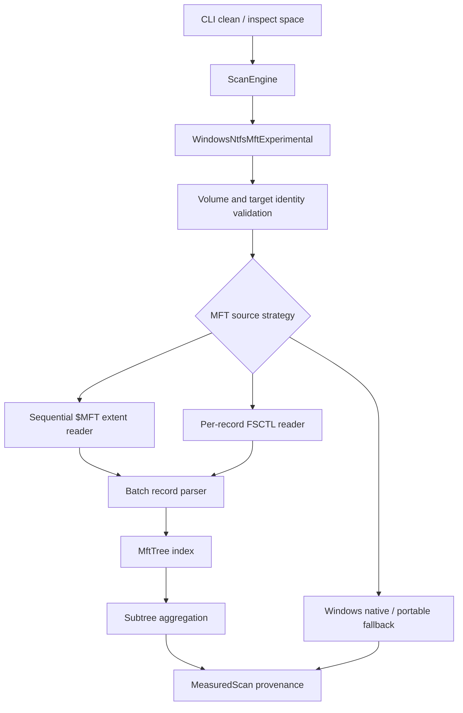
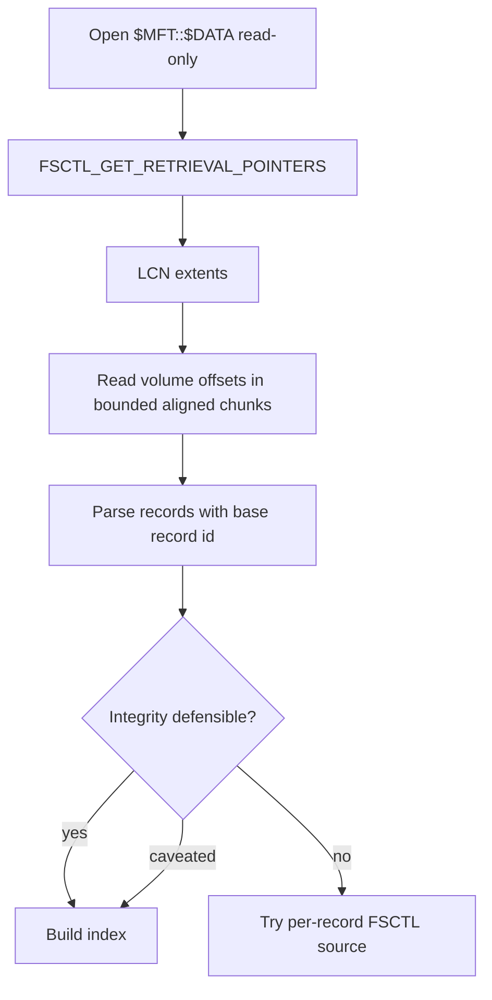

# NTFS Sequential MFT Reader - Plan

## Goal Capsule

| Field | Value |
|---|---|
| Objective | Replace the current per-record `FSCTL_GET_NTFS_FILE_RECORD` experimental path with a second-generation read-only NTFS `$MFT` sequential reader that can approach WizTree-class scan speed while preserving conservative cleanup safety. |
| Authority | The user's "best cleanup CLI" and fearless-refactor direction is authoritative. Delete-time revalidation, opt-in experimental scanning, and license hygiene override raw speed. |
| Execution profile | Deep Windows/Rust performance work across `crates/rebecca-core/src/scan/windows_ntfs_mft.rs`, `crates/rebecca-ntfs`, CLI provenance, benchmarks, docs, and dogfood. |
| Stop conditions | Stop if raw NTFS metadata becomes deletion authority, the backend becomes default, GPL source is copied, unsupported metadata is counted silently, or unprivileged users lose safe fallback. |
| Tail ownership | Progress is represented by code, tests, dogfood artifacts, docs, and commits, not by editing this plan as a task board. |

---

## Product Contract

### Summary

Rebecca already has a working opt-in NTFS/MFT experimental backend, but its live reader asks Windows for one file record at a time.
That path proves correctness and fallback wiring, not peak disk-usage scan throughput.
This plan promotes a second-generation backend that discovers `$MFT::$DATA` extents and reads MFT record bytes in large aligned batches before feeding the existing parser/index model.

### Problem Frame

The current implementation in `crates/rebecca-core/src/scan/windows_ntfs_mft.rs` loops over `FSCTL_GET_NTFS_FILE_RECORD`.
That API is simple and conservative, but it pays a kernel round trip for each record and cannot compete with tools that stream the physical MFT payload.

The faster design is more dangerous if it is blurred with deletion semantics.
Rebecca must treat streamed raw metadata as an estimate source only, validate requested target identity, surface caveats for ambiguous records, and fall back to safe directory scanners whenever a supported estimate cannot be defended.

### Requirements

**Reader Strategy**

- R1. The `windows-ntfs-mft-experimental` backend must try a sequential `$MFT` reader before the current per-record FSCTL reader when the volume supports it.
- R2. The current `FSCTL_GET_NTFS_FILE_RECORD` implementation must remain as an internal fallback until sequential reading is proven and dogfooded.
- R3. Sequential reading must open volume and metadata handles read-only and must never request write access or mutate filesystem state.
- R4. The reader must discover `$MFT` stream extents with Windows-supported metadata APIs or an equivalent original implementation, then read aligned volume ranges in bounded chunks.
- R5. The reader must preserve cancellation checks between chunk reads and record batches.

**Correctness And Safety**

- R6. Sequential batches must parse records with the same fixup, caveat, hardlink, deleted-record, reparse, and subtree aggregation rules as the current index.
- R7. Sparse, invalid, compressed, encrypted, attribute-list-dependent, truncated, or unreadable MFT regions must produce caveats or fallback rather than silent success.
- R8. Target path measurement must continue to validate file identity and volume identity before using an MFT record as the subtree root.
- R9. Raw metadata estimates must never bypass cleanup safety assessment or executor path revalidation.

**Performance And Observability**

- R10. The implementation must reduce the dominant live-reader cost from one DeviceIoControl call per record to large sequential reads with batch parsing.
- R11. Per-command volume index caching must continue to reuse one in-memory index for several targets on the same volume.
- R12. Benchmark and dogfood output must distinguish sequential live MFT success, per-record FSCTL fallback, Windows native fallback, and portable fallback.
- R13. CLI JSON and human output must keep backend, confidence, fallback reason, and caveat provenance additive and quiet by default.

**Docs And License Boundary**

- R14. Documentation must explain privilege expectations, direct-volume read constraints, fallback behavior, performance expectations, and why estimates are not deletion authority.
- R15. GPL projects under `repo-ref/` may guide architecture only; tracked Rebecca code must be original or derived from license-compatible references.

### Key Flows

- F1. Sequential NTFS estimate.
  - **Trigger:** User selects `--scan-backend windows-ntfs-mft-experimental` on a supported local NTFS target with sufficient privileges.
  - **Steps:** Core resolves the target identity, opens the volume read-only, discovers `$MFT` extents, streams chunks, parses records in batches, builds the existing `MftTree`, aggregates the requested subtree, and emits experimental provenance.
  - **Outcome:** The command returns a fast estimate with backend `windows-ntfs-mft-experimental` and no deletion authority changes.
  - **Covered by:** R1, R3, R4, R6, R8, R9, R10
- F2. Sequential reader unavailable.
  - **Trigger:** `$MFT::$DATA` cannot be opened, retrieval pointers are unavailable, reads are unaligned or denied, or metadata geometry is unsupported.
  - **Steps:** The sequential reader returns a structured fallback reason; the backend tries the per-record FSCTL reader, then the existing Windows native or portable fallback chain.
  - **Outcome:** Users still get safe estimates and can see why the fast path was skipped.
  - **Covered by:** R2, R7, R12, R13, R14
- F3. Chunk parse uncertainty.
  - **Trigger:** A streamed batch contains truncated, invalid, sparse, or unsupported records.
  - **Steps:** Parser records caveats for local uncertainty; severe index integrity uncertainty makes the backend fallback before returning a successful experimental estimate.
  - **Outcome:** Rebecca favors explainable under-claiming over fast but misleading totals.
  - **Covered by:** R6, R7
- F4. Multi-target command.
  - **Trigger:** `clean --dry-run` or `inspect space` measures several paths on one NTFS volume.
  - **Steps:** The command builds or reuses one cached sequential index and resolves each target by file identity.
  - **Outcome:** Repeated targets avoid reparsing the MFT and still keep command-lifetime cache bounds.
  - **Covered by:** R8, R11, R12

### Acceptance Examples

- AE1. Given an elevated supported NTFS volume, when the experimental backend runs, then the sequential reader is attempted before the per-record FSCTL reader.
- AE2. Given retrieval pointer discovery fails, when safe scanning can continue, then the backend falls back with a reason that names the sequential reader failure.
- AE3. Given a synthetic MFT stream split across multiple extents, when batches are parsed, then record IDs and subtree totals match the existing `MftTree` expectations.
- AE4. Given a sparse or invalid extent, when the reader reaches it, then the result is caveated or falls back without panicking or inventing records.
- AE5. Given cancellation during a large MFT stream, when the token is cancelled, then reading stops before finishing the full volume and returns the existing cancellation error path.
- AE6. Given several targets on one volume, when one command measures them, then the sequential index is built once and reused.
- AE7. Given unelevated Windows, when volume opening is denied, then output still shows a Windows native or portable estimate with experimental fallback provenance.
- AE8. Given GPL reference code in `repo-ref/windirstat`, when implementation lands, then tracked source contains no copied GPL implementation.

### Scope Boundaries

In scope:

- Sequential read-only `$MFT` extent discovery and batch reading on Windows.
- Parser-side batch abstractions that remain independent from Windows handles.
- Internal source strategy selection: sequential reader, per-record FSCTL fallback, then directory scan fallback.
- Provenance, benchmark, dogfood, docs, changelog, and release updates for the new fast path.
- Refactoring or deleting per-record-only naming once the source strategy boundary exists.

Deferred:

- Making NTFS/MFT scanning the default backend.
- Persistent disk indexes, USN Journal incremental updates, or cross-run index reuse.
- Full NTFS filesystem browser features such as `$I30` traversal, ADS export, recovery, or forensic extraction.
- Parallel chunk parsing beyond the minimum needed to prove the source abstraction and benchmark shape.

Outside this product's identity:

- Treating raw metadata as permission to delete.
- Silent elevation or automatic privileged scanning.
- Copying GPL implementation code.

---

## Planning Contract

### Key Technical Decisions

- KTD1. Sequential reading is a source strategy, not a new scan backend.
  `ScanBackendKind::WindowsNtfsMftExperimental` remains the user-facing selector while internal code chooses sequential `$MFT`, per-record FSCTL, or safe fallback.
- KTD2. Keep Windows handle and extent discovery in `crates/rebecca-core/src/scan/windows_ntfs_mft.rs` for this iteration.
  The current dependency graph already hosts the live Windows boundary there, while `rebecca-ntfs` stays platform-neutral.
- KTD3. Move batch parsing shape into `rebecca-ntfs`.
  The parser crate should accept record batches with a base record ID so sequential streams, fixtures, and exported MFT files share one parsing path.
- KTD4. Query `$MFT::$DATA` retrieval pointers before reading raw volume offsets.
  This handles fragmented MFT files and matches the architecture seen in compatible design references without copying code.
- KTD5. Use bounded aligned chunk reads before adding broad parallelism.
  Sequential throughput and fewer syscalls are the first-order win; parallel parsing can be added after correctness and memory bounds are measured.
- KTD6. Fallback preserves product trust.
  Any capability failure, privilege denial, geometry mismatch, unsupported stream state, or severe parse uncertainty must leave the command with a safe scanner when possible.
- KTD7. Benchmark labels must expose the actual source.
  Reports should separate `windows-ntfs-mft-experimental-sequential`, `windows-ntfs-mft-experimental-fsctl-record`, and directory fallback behavior.
- KTD8. License-compatible references can inform implementation details; GPL references can only inform high-level design.
  `repo-ref/windirstat` is GPLv2; `repo-ref/edirstat` is MIT; `repo-ref/mft` is MIT/Apache-2.0.

### High-Level Technical Design

### System-Wide Impact

- `crates/rebecca-core/src/scan/windows_ntfs_mft.rs` needs a source-strategy boundary so current code is no longer hard-wired to per-record DeviceIoControl.
- `crates/rebecca-ntfs/src/reader.rs` needs record-base-aware batch parsing because streamed chunks do not always start at record 0.
- `crates/rebecca-ntfs/src/attrs.rs` may need original data-run decoding support if Windows retrieval pointers are insufficient for future exported-MFT or image scenarios.
- `crates/rebecca-core/benches/perf_matrix.rs` must record actual source metadata rather than only the requested scan backend.
- Documentation and changelog must avoid implying this path is default or deletion-authoritative.

### Sequencing

| Phase | Units | Outcome |
|---|---|---|
| Phase 1 | U1, U2 | Current per-record implementation is isolated behind a source trait, and `rebecca-ntfs` can parse base-record batches. |
| Phase 2 | U3, U4 | Windows sequential `$MFT` extent discovery and chunk reading exist with mocked and synthetic tests. |
| Phase 3 | U5, U6 | Experimental backend prefers sequential source, falls back cleanly, and records actual source provenance. |
| Phase 4 | U7, U8 | Performance, dogfood, docs, changelog, license notes, and dead-code cleanup make the refactor landable. |

### Risks And Mitigations

| Risk | Impact | Mitigation |
|---|---|---|
| `FSCTL_GET_RETRIEVAL_POINTERS` on `$MFT::$DATA` is denied or behaves differently across Windows versions. | Sequential reader may be unavailable for many users. | Keep per-record FSCTL and directory scanners as structured fallback paths. |
| Direct volume reads require alignment that is easy to get wrong. | Reads fail or return partial records. | Start with conservative buffered reads or explicit aligned buffers, then benchmark before adding `FILE_FLAG_NO_BUFFERING`. |
| Fragmented or sparse MFT extents make record ID mapping wrong. | Subtree roots and byte totals could drift. | Track base record IDs per extent, compare against parsed record identity where possible, and fallback on severe mismatch. |
| Batch parsing accumulates too many records in memory. | Large volumes regress memory use. | Preserve command-lifetime cache bounds, measure memory in perf runs, and avoid extra per-record strings in the source layer. |
| GPL reference contamination. | Release compliance is compromised. | Treat WinDirStat as an API-shape reference only and implement from Windows APIs plus original Rust code. |

---

## Implementation Units

### U1. Split MFT source strategy from scan aggregation

- **Goal:** Make the current per-record reader an internal `MftRecordSource` strategy instead of embedding it directly in `CachedNtfsVolumeIndex::build`.
- **Requirements:** R1, R2, R5, R6, R11.
- **Dependencies:** None.
- **Files:** `crates/rebecca-core/src/scan/windows_ntfs_mft.rs`, `crates/rebecca-core/tests/scan_engine.rs`.
- **Approach:** Introduce a narrow internal source abstraction that yields parsed records plus source caveats and source label metadata.
  Keep the existing `FSCTL_GET_NTFS_FILE_RECORD` logic behaviorally intact as `FsctlRecordMftSource`.
  Preserve cancellation checkpoints and per-command cache reuse.
- **Patterns to follow:** `WindowsNtfsMftIndexCache`, `CachedNtfsVolumeIndex::build`, `LiveNtfsVolume::read_mft_records`, and the fallback reason style already used in `windows_ntfs_mft.rs`.
- **Test scenarios:** A fake successful source builds an index; a failing first source falls through to the next source; cancellation is checked before long reads; actual-source metadata can be attached without changing user-facing `ScanBackendKind`.
- **Verification:** `cargo nextest run -p rebecca-core --test scan_engine`.

### U2. Add base-record-aware batch parsing in `rebecca-ntfs`

- **Goal:** Let streamed MFT chunks parse record batches whose first record ID is not zero.
- **Requirements:** R5, R6, R7, R10.
- **Dependencies:** None.
- **Files:** `crates/rebecca-ntfs/src/reader.rs`, `crates/rebecca-ntfs/tests/mft_parser.rs`, optional `crates/rebecca-ntfs/src/lib.rs`.
- **Approach:** Extend `MftRecordReader` or add a sibling method that accepts `base_record_id` and parses `chunks_exact(record_size)` into the correct record IDs.
  Preserve truncated-record errors and invalid-geometry behavior.
  Keep this platform-neutral so synthetic fixtures can prove the contract without live NTFS.
- **Patterns to follow:** Current `MftRecordReader::parse_records`, `MftRecord::parse`, and existing `ParseCaveat` test helpers.
- **Test scenarios:** Batch starting at record 100 yields record IDs 100..N; truncated tail reports the correct record ID; invalid record size still returns a structured error; multiple chunks can be concatenated into an equivalent record set.
- **Verification:** `cargo nextest run -p rebecca-ntfs`.

### U3. Implement read-only `$MFT::$DATA` extent discovery

- **Goal:** Discover physical extents for the live `$MFT` stream without reading every record through DeviceIoControl.
- **Requirements:** R3, R4, R7, R14, R15.
- **Dependencies:** U1.
- **Files:** `crates/rebecca-core/src/scan/windows_ntfs_mft.rs`, `docs/adr/0005-scan-engine-strategy.md`, `docs/adr/0007-rule-catalog-and-license-provenance.md`.
- **Approach:** Open `$MFT::$DATA` read-only with share modes compatible with normal volume activity and query retrieval pointers.
  Store extent records as VCN start, LCN start, cluster count, and byte range.
  Classify access denied, more-data buffer growth, invalid parameter, sparse extents, and empty extent lists into source failures or caveats.
- **Patterns to follow:** Existing `NtfsVolumeCapabilities`, `LiveNtfsVolume::ntfs_volume_data`, `repo-ref/mft/crates/ntfs/src/ntfs/volume.rs`, and Windows API constants already imported for NTFS metadata.
- **Test scenarios:** Retrieval pointer parser handles one extent, multiple extents, buffer growth, empty extents, and sparse/invalid LCN values; access denied becomes fallback-capable; docs record the GPL boundary.
- **Verification:** `cargo nextest run -p rebecca-core --test scan_engine` plus `cargo check -p rebecca-core`.

### U4. Implement bounded sequential chunk reads

- **Goal:** Read MFT extents from the raw volume in large bounded chunks and emit base-record-aware record batches.
- **Requirements:** R3, R4, R5, R7, R10.
- **Dependencies:** U2, U3.
- **Files:** `crates/rebecca-core/src/scan/windows_ntfs_mft.rs`, `crates/rebecca-ntfs/src/reader.rs`, `crates/rebecca-core/tests/scan_engine.rs`.
- **Approach:** Convert extents into volume byte offsets and read them with a conservative chunk size that is a multiple of record size and sector size.
  Preserve a base record ID derived from VCN and record geometry.
  Keep chunk memory bounded and add cancellation checks before each read and parse loop.
- **Patterns to follow:** Current `LiveNtfsVolume::open`, `MftRecordReader`, `repo-ref/edirstat/src/engine/mft.rs` for chunked ingestion shape, and `repo-ref/mft/crates/ntfs/src/ntfs/data_stream.rs` for data-run boundary thinking.
- **Test scenarios:** Synthetic extents split records on chunk boundaries only at record-aligned points; short reads become fallback failures; cancellation interrupts mid-stream; invalid geometry fails before allocation; chunk size stays bounded for very large `MftValidDataLength`.
- **Verification:** `cargo nextest run -p rebecca-ntfs` and `cargo nextest run -p rebecca-core --test scan_engine`.

### U5. Prefer sequential source with per-record source fallback

- **Goal:** Make the experimental backend attempt sequential source first, then per-record FSCTL source, then safe directory fallback.
- **Requirements:** R1, R2, R6, R8, R9, R11, R13.
- **Dependencies:** U1, U2, U3, U4.
- **Files:** `crates/rebecca-core/src/scan/windows_ntfs_mft.rs`, `crates/rebecca-core/src/scan/backend.rs`, `crates/rebecca-core/tests/scan_engine.rs`, `crates/rebecca/tests/cli_clean.rs`, `crates/rebecca/tests/cli_inspect.rs`, `crates/rebecca/tests/cli_api.rs`.
- **Approach:** Compose source failures into fallback provenance without changing the public backend selector.
  Successful sequential and per-record sources both feed `MftTree`.
  Keep delete-time path revalidation untouched.
- **Patterns to follow:** Existing `measure_windows_ntfs_mft_with_fallback`, `MeasuredScan::with_fallback_reason`, CLI estimate provenance serialization, and previous fallback dogfood logs under `target/dogfood/`.
- **Test scenarios:** Sequential success does not call per-record source; sequential failure calls per-record source; both MFT sources failing fall back to Windows native or portable; target identity mismatch still fails to safe fallback; CLI JSON reports the requested backend plus source/fallback caveats.
- **Verification:** `cargo nextest run -p rebecca-core --test scan_engine --test planner --test space_insight` and `cargo nextest run -p rebecca --test cli_clean --test cli_inspect --test cli_api`.

### U6. Add source-level benchmark and dogfood provenance

- **Goal:** Prove that the new source is measurably faster and still correctness-gated.
- **Requirements:** R10, R11, R12, R13.
- **Dependencies:** U5.
- **Files:** `crates/rebecca-core/benches/perf_matrix.rs`, `scripts/perf/run-benchmark-matrix.ps1`, `docs/performance/perf-matrix.md`, `docs/release.md`.
- **Approach:** Extend benchmark metadata with actual MFT source, fallback chain, record count, caveat count, and live-skip reason.
  Keep unelevated CI stable by treating live sequential dogfood as optional and explicitly skipped when privileges are unavailable.
- **Patterns to follow:** Current `many_small_ntfs_mft_fallback_scan_1024_files` scenario and perf report JSON generation.
- **Test scenarios:** Perf matrix can encode sequential success, per-record source fallback, and directory fallback; fallback totals still match portable totals; dogfood logs preserve source labels.
- **Verification:** `cargo check -p rebecca-core --benches` and `pwsh -File scripts/perf/run-benchmark-matrix.ps1`.

### U7. Update docs, changelog, and engineering memory

- **Goal:** Make the fast path discoverable without overstating support or safety.
- **Requirements:** R12, R13, R14, R15.
- **Dependencies:** U5, U6.
- **Files:** `CHANGELOG.md`, `README.md`, `docs/configuration.md`, `docs/release.md`, `docs/performance/perf-matrix.md`, `docs/api/cli/v1/README.md`, `docs/knowledge/engineering/current-state.md`, `docs/knowledge/engineering/log.md`.
- **Approach:** Document opt-in usage, privilege expectations, sequential/per-record fallback terminology, source labels, dogfood commands, and the no-deletion-authority guarantee.
  Add an Unreleased changelog entry for the sequential NTFS reader.
- **Patterns to follow:** Existing scan backend docs, estimate provenance docs, and release dogfood notes.
- **Test scenarios:** CLI API examples match serialized fields; release docs show both elevated and unelevated outcomes; changelog entry names the feature as experimental; no doc implies the backend is default.
- **Verification:** `cargo nextest run -p rebecca --test cli_api` and `git diff --check`.

### U8. Remove obsolete per-record-only naming and dead code

- **Goal:** Finish the fearless refactor by deleting names, comments, and tests that assume the experimental backend only has one record source.
- **Requirements:** R1, R2, R12, R15.
- **Dependencies:** U5, U7.
- **Files:** `crates/rebecca-core/src/scan/windows_ntfs_mft.rs`, `crates/rebecca-ntfs/src/reader.rs`, tests under `crates/rebecca-core/tests/` and `crates/rebecca-ntfs/tests/`, `docs/adr/0005-scan-engine-strategy.md`.
- **Approach:** Rename internals around source strategy rather than public backend names.
  Delete obsolete stubs and duplicate fallback strings after tests prove the new source order.
  Keep the per-record source code only if it remains a real fallback.
- **Patterns to follow:** Existing internal visibility choices for `WindowsNtfsMftIndexCache` and `WindowsNtfsMftScanBackend`.
- **Test scenarios:** No tests assert the old per-record-only behavior; source order tests remain explicit; `cargo deny check` proves no incompatible dependency or copied source entered tracked code.
- **Verification:** Full final gate set in the Verification Contract.

---

## Verification Contract

| Gate | Command | When | Done Signal |
|---|---|---|---|
| Format | `cargo fmt --all --check` | After Rust edits and final | No formatting drift. |
| NTFS parser | `cargo nextest run -p rebecca-ntfs` | After U2, U4, and final | Base-record batch parsing and parser caveats pass without live NTFS. |
| Core scan | `cargo nextest run -p rebecca-core --test scan_engine --test planner --test space_insight` | After U1, U5, and final | Source strategy, fallback, cache reuse, planner, and inspect behavior pass. |
| CLI contracts | `cargo nextest run -p rebecca --test cli_clean --test cli_inspect --test cli_api` | After U5 and U7 | Human and JSON output preserve additive provenance. |
| Bench compile | `cargo check -p rebecca-core --benches` | After U6 | Performance matrix compiles against actual APIs. |
| Perf matrix | `pwsh -File scripts/perf/run-benchmark-matrix.ps1` | After U6 and final | Report distinguishes sequential, per-record, and directory fallback paths. |
| Full workspace | `cargo nextest run --workspace` | Final | All workspace tests pass. |
| Lint | `cargo clippy --workspace --all-targets --all-features -- -D warnings` | Final | No warnings. |
| License and advisories | `cargo deny check` | After dependency or reference-policy changes and final | Advisory, source, ban, and license policies pass. |
| Diff hygiene | `git diff --check` | Before each commit and final | No whitespace errors. |
| Unelevated dogfood | `cargo run -p rebecca -- clean --dry-run --no-scan-cache --scan-backend windows-ntfs-mft-experimental --category system --format json` | Final on Windows | Output shows sequential success or a clear source fallback chain. |
| Inspect dogfood | `cargo run -p rebecca -- inspect space --scan-backend windows-ntfs-mft-experimental --format json` | Final on Windows | Inspect entries expose backend, confidence, fallback reason, caveats, and source labels when available. |

---

## Definition of Done

- `windows-ntfs-mft-experimental` attempts a read-only sequential `$MFT` source before the per-record FSCTL source.
- The per-record FSCTL source remains an internal fallback until sequential reading is proven across dogfood and tests.
- `rebecca-ntfs` can parse base-record-aware batches without depending on Windows handles.
- Sequential reading handles fragmented extents, bounded chunks, cancellation, invalid geometry, and fallback-capable source failures.
- Target identity validation, cleanup safety assessment, and delete-time path revalidation remain unchanged.
- Scan, clean, purge, inspect, scan-cache, and CLI API surfaces preserve additive provenance.
- Performance matrix and dogfood logs distinguish actual MFT source and fallback chain.
- README, configuration docs, release docs, performance docs, API docs, changelog, ADRs, and engineering memory describe the experimental fast path and safety posture.
- GPL references remain design-only, and any new dependency or fixture passes `cargo deny check`.
- `cargo fmt --all --check`, targeted nextest suites, `cargo nextest run --workspace`, `cargo clippy --workspace --all-targets --all-features -- -D warnings`, `cargo deny check`, and `git diff --check` pass.
- Abandoned exploratory code, duplicate fallback strings, and per-record-only names are removed before final landing.

---

## Appendix

### Sources And Research

- `docs/plans/2026-07-02-002-feat-ntfs-live-volume-index-plan.md` for the completed first-generation live MFT backend and safety contract.
- `crates/rebecca-core/src/scan/windows_ntfs_mft.rs` for current capability checks, file identity validation, per-record FSCTL reads, cache reuse, and fallback behavior.
- `crates/rebecca-ntfs/src/reader.rs` for current record-batch parsing shape.
- `crates/rebecca-ntfs/src/tree.rs` for subtree aggregation, caveats, reparse handling, and hardlink ambiguity.
- `crates/rebecca-core/benches/perf_matrix.rs` and `scripts/perf/run-benchmark-matrix.ps1` for benchmark expansion.
- `repo-ref/windirstat/windirstat/FinderNtfs.cpp` as a GPLv2 design-only reference showing `$MFT::$DATA` retrieval pointers and chunked volume reads.
- `repo-ref/edirstat/src/engine/mft.rs` as an MIT reference for chunked raw MFT ingestion and data-run mapping ideas.
- `repo-ref/mft/src/mft.rs` and `repo-ref/mft/crates/ntfs/src/ntfs/volume.rs` as MIT/Apache-2.0 references for MFT parser behavior and data-run-backed entry reads.
