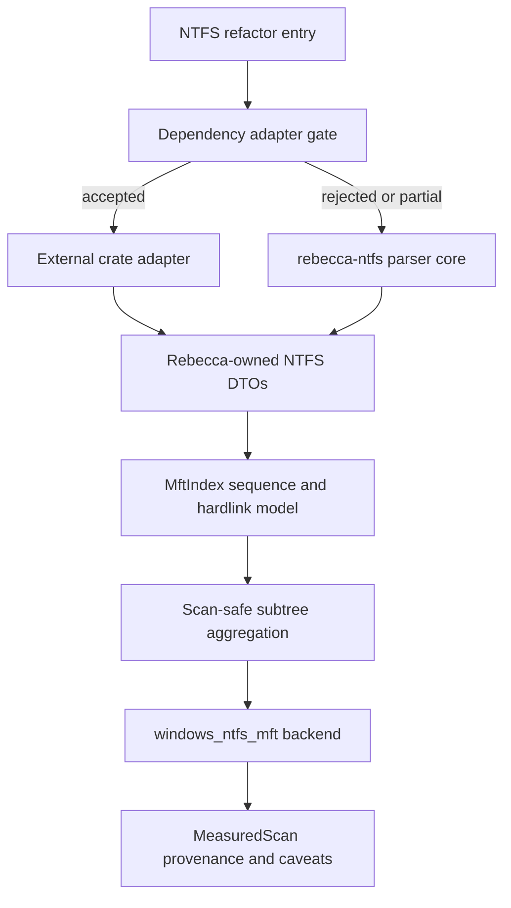
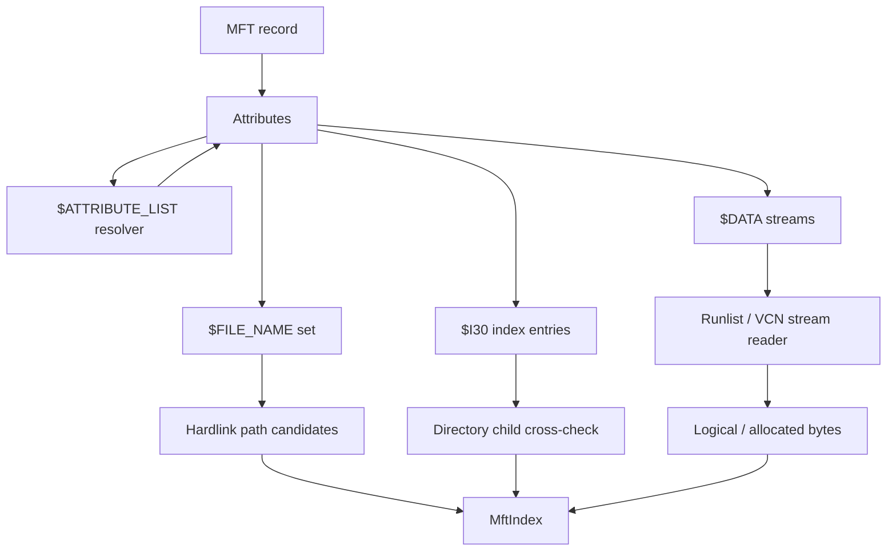

# NTFS Parser Core Dependency Gate - Plan

## Goal Capsule

| Field | Value |
|---|---|
| Objective | Decide and execute the next fearless NTFS/MFT core refactor by putting Rust ecosystem reuse behind a strict adapter gate, then hardening Rebecca's scan-safe parser/index model for attribute lists, sequence-aware hardlinks, directory indexes, runlists, and fixture coverage. |
| Authority | The user's "best cleanup CLI" direction is authoritative. External Rust crates are welcome when they improve correctness and speed without weakening Rebecca's cleanup safety, provenance, fallback, license, or deletion-revalidation contracts. |
| Execution profile | Deep Rust/Windows parser architecture across `crates/rebecca-ntfs`, `crates/rebecca-core/src/scan/windows_ntfs_mft.rs`, dependency policy, ADRs, benchmarks, fixtures, docs, and changelog. |
| Stop conditions | Stop if raw NTFS metadata becomes deletion authority, an external crate type leaks into the public cleanup contract, GPL/LGPL code is copied, a dependency fails policy gates, or unsupported metadata is counted silently. |
| Tail ownership | Progress is represented by code, tests, dogfood artifacts, docs, and commits, not by editing this plan as a task board. |

---

## Product Contract

### Summary

Rebecca now has a working experimental live NTFS/MFT backend with sequential `$MFT::$DATA` reads and per-record FSCTL fallback.
That path is fast enough to make correctness the next limiting factor.
The Rust ecosystem has useful building blocks, especially `ntfs`, `mft`, `ntfs-reader`, `usn-journal-rs`, and the newer `ntfs-core`, but none is a drop-in cleanup scan backend because Rebecca needs target identity validation, bounded caveats, conservative fallback, additive provenance, and delete-time revalidation.

This plan chooses a dependency-first gate rather than a dependency-first rewrite.
The implementation must prove whether a Rust NTFS crate can sit behind Rebecca's scan-safe adapter contract.
If the gate passes, Rebecca can adopt the crate internally.
If it fails, the same units continue by deepening `rebecca-ntfs` with the exact capabilities that mature NTFS implementations show are missing.

### Problem Frame

`crates/rebecca-ntfs` is intentionally small, but it now sits on a high-leverage path.
`MftRecord` is still too flat: it records names, a single data size, and caveats, while real NTFS is record, attribute, stream, extension record, directory index, and file-reference state.
`MftTree` also assumes one parent record ID per selected name, so sequence mismatches and hardlinks remain caveats instead of first-class model inputs.

The ecosystem research changes the right plan.
`ntfs` already handles read-only filesystem traversal, attribute lists, data runs, directory indexes, and file-reference sequence numbers with a permissive license.
`mft` is strong as a fast exported `$MFT` parser and oracle, but less complete as a live scan backend.
`ntfs-reader` shows a live Windows MFT reader shape and aligned volume reader, but it is not scan-safe enough to replace Rebecca's backend directly.
`usn-journal-rs` is useful for USN-based enumeration and future cache invalidation, not for raw MFT correctness.
`ntfs-core` is promising and broad, but its package metadata, dependency set, and forensic-oriented high-level API need isolated validation before it can become a production dependency.

### Requirements

**Dependency Gate**

- R1. The next NTFS refactor must evaluate Rust ecosystem reuse before expanding first-party parser code.
- R2. `ntfs` is the lead direct-dependency candidate because it is permissively licensed, read-only, safe Rust, and already models attribute lists, data runs, directory indexes, hardlinks, and sequence references.
- R3. `ntfs-core` is a secondary candidate because its advertised coverage is broad, but it must pass dependency, license, API, and freshness checks before any production adoption.
- R4. `mft` may be used as an oracle or dev-only comparison dependency when feature/default-feature choices avoid CLI-only dependency bloat.
- R5. `ntfs-reader` and `usn-journal-rs` may inform live Windows handle and enumeration behavior, but must not replace Rebecca's source provenance and fallback model directly.
- R6. Any adopted crate must sit behind a first-party adapter trait so `rebecca-core` and CLI contracts do not depend on third-party types.
- R7. If no candidate passes the gate, the implementation must continue by deepening `rebecca-ntfs` as an owned parser instead of blocking.

**Cleanup Safety**

- R8. NTFS/MFT metadata estimates remain opt-in, read-only, source-provenanced, fallback-capable, and non-authoritative for deletion.
- R9. Target path measurement must keep volume identity and target identity validation before an MFT-backed estimate can be used.
- R10. Unsupported records, severe parser uncertainty, missing extension records, sequence mismatch, and directory-index disagreement must produce caveats or fallback, never silent success.
- R11. The scan cache may store additive backend/source provenance, but raw MFT identities must not bypass freshness or delete-time path revalidation.

**Parser And Index Correctness**

- R12. The core model must move from `record -> selected name + data_size` to `record -> attributes -> streams -> names -> indexable entries`.
- R13. `$ATTRIBUTE_LIST` parsing must support extension records without recursively expanding another attribute list and without infinite loops.
- R14. File references must preserve both low record ID and high sequence number for records, parents, and extension records.
- R15. Hardlinks must be represented as multiple path candidates with a deterministic canonical path choice, not only as an ambiguity caveat.
- R16. Directory `$I30` parsing must cover resident `$INDEX_ROOT` and non-resident `$INDEX_ALLOCATION` well enough to cross-check or supplement parent-chain children.
- R17. Data-run and VCN stream abstractions must support exported `$MFT` fixtures, fragmented `$MFT` streams, and future raw-image tests without Windows handles.
- R18. Logical bytes and allocated/reclaim bytes must be represented separately so scan outputs can later surface richer disk-usage signals without changing the parser again.

**Verification And Operations**

- R19. Realistic fixtures must cover fragmented MFT, attribute lists, hardlinks, sequence mismatch, directory indexes, named streams, sparse runs, corrupt fixups, and bounded parse-error summaries.
- R20. Benchmarks and dogfood logs must distinguish default directory scanning, Windows native scanning, live MFT sequential scanning, per-record FSCTL fallback, dependency-backed NTFS traversal, and first-party parser traversal where both exist.
- R21. Docs, changelog, ADRs, and engineering memory must state the dependency decision, license boundary, and experimental safety posture.

### Key Flows

- F1. Dependency-backed scan candidate.
  - **Trigger:** Implementation starts the plan and evaluates `ntfs` or `ntfs-core` behind an internal adapter.
  - **Steps:** The spike wires the crate only in an isolated module, maps records into Rebecca-owned DTOs, runs fixture parity, checks license/dependency policy, and dogfoods a read-only estimate path.
  - **Outcome:** The dependency is accepted, rejected, or limited to dev/oracle use with an ADR-level reason.
  - **Covered by:** R1, R2, R3, R4, R6, R7
- F2. First-party parser continuation.
  - **Trigger:** No crate passes the adapter gate, or a crate passes only for partial use.
  - **Steps:** `rebecca-ntfs` grows record, attribute, stream, attribute-list, runlist, and index modules while preserving the adapter output shape.
  - **Outcome:** The backend gains mature NTFS correctness without waiting on upstream crates.
  - **Covered by:** R7, R12, R13, R16, R17
- F3. Sequence-aware subtree estimate.
  - **Trigger:** A target root resolves to a file reference on an NTFS volume.
  - **Steps:** The index resolves `(record_id, sequence_number)`, validates parent references, expands hardlink candidates, chooses a canonical path for reporting, and aggregates the subtree with caveats for uncertain edges.
  - **Outcome:** Cleanup estimates avoid stale-parent and reused-record mistakes.
  - **Covered by:** R9, R10, R14, R15
- F4. Directory index cross-check.
  - **Trigger:** A directory record contains `$INDEX_ROOT` or `$INDEX_ALLOCATION`.
  - **Steps:** The parser reads `$I30` entries and compares them against `$FILE_NAME` parent-chain children.
  - **Outcome:** Matching indexes increase confidence; mismatches produce caveats or fallback.
  - **Covered by:** R10, R16
- F5. Allocated-byte reporting preparation.
  - **Trigger:** A file has resident data, non-resident data runs, sparse ranges, or named streams.
  - **Steps:** The parser records logical size, allocated size, initialized size, sparse bytes, named stream presence, and cleanup-counting policy separately.
  - **Outcome:** Existing v1 output can keep logical estimates while future disk-usage surfaces can expose allocation-aware reclaim estimates.
  - **Covered by:** R18

### Acceptance Examples

- AE1. Given the `ntfs` crate passes license, dependency, fixture, and dogfood gates, when implementation lands, then Rebecca uses it only behind an owned adapter and still emits Rebecca-owned estimate provenance.
- AE2. Given `ntfs-core` has useful APIs but fails a policy gate, when implementation lands, then the ADR records the rejection and `rebecca-ntfs` implements the required owned parser pieces instead.
- AE3. Given an MFT record with `$ATTRIBUTE_LIST`, when extension records hold part of unnamed `$DATA`, then the estimate includes the supported stream pieces or falls back with a bounded caveat.
- AE4. Given an extension record's attribute list points to another attribute list, when expansion runs, then the parser refuses recursive expansion and records a cycle/unsupported caveat.
- AE5. Given a parent file reference sequence does not match the current parent record sequence, when the subtree index builds, then that edge is caveated and not silently trusted.
- AE6. Given one record has two Win32-visible `$FILE_NAME` attributes, when paths are resolved, then both path candidates remain available and reporting uses a deterministic canonical path.
- AE7. Given `$I30` lists a child missing from the parent-chain map, when the directory index is parsed, then the child is included only when identity and sequence checks are defensible; otherwise the estimate is caveated or falls back.
- AE8. Given a sparse non-resident data stream, when bytes are aggregated, then logical size and allocated bytes remain separate.
- AE9. Given a corrupted fixture repeats thousands of parse errors, when JSON output is produced, then caveats stay bounded as current output already requires.
- AE10. Given GPL/LGPL reference repos under `repo-ref/`, when implementation lands, then tracked source and fixtures contain no copied incompatible code.

### Scope Boundaries

In scope:

- Rust ecosystem dependency evaluation for NTFS/MFT parser and traversal crates.
- A first-party scan adapter contract that can wrap external crates or `rebecca-ntfs`.
- `rebecca-ntfs` model refactoring for records, attributes, streams, names, data runs, directory indexes, and sequence-aware indexes.
- Live Windows NTFS backend integration only where it preserves opt-in safety and fallback behavior.
- Fixtures, fuzz-ready parser tests, benchmarks, docs, changelog, and ADR updates.

Deferred:

- Making NTFS/MFT scanning the default backend.
- Persistent whole-volume indexes or cross-run raw MFT indexes.
- USN-assisted cache invalidation beyond preserving adapter space for it.
- Full forensic recovery, deleted-file carving, `$LogFile` analysis, and slack-space cleanup.
- UI-like disk treemaps or a full WizTree clone surface.

Outside this product's identity:

- Writing to NTFS metadata.
- Using raw metadata as permission to delete.
- Silent elevation or automatic privileged scanning.
- Copying GPL/LGPL implementation code into tracked source.

---

## Planning Contract

### Key Technical Decisions

- KTD1. Use a dependency gate, not an immediate dependency replacement.
  The ecosystem has useful crates, but Rebecca needs a cleanup-specific trust boundary that existing crates do not provide directly.
- KTD2. Treat `ntfs` as the lead production candidate.
  It has the strongest mature read-only filesystem model, permissive license, no unsafe in the crate, and direct support for attribute lists, data runs, `$I30`, hardlinks, and sequence numbers.
- KTD3. Treat `ntfs-core` as a high-potential spike, not a default choice.
  Its coverage is attractive, but the published crate metadata, dependency chain, and forensic-first high-level model need isolated validation.
- KTD4. Keep `mft` as an oracle/dev tool unless the adapter gate proves otherwise.
  It is fast and permissively licensed, but it is centered on exported `$MFT` parsing and path reconstruction rather than Rebecca's live scan safety model.
- KTD5. Keep Windows source acquisition in `rebecca-core`.
  `crates/rebecca-core/src/scan/windows_ntfs_mft.rs` already owns privilege checks, volume identity, target identity, fallback, caching, and `estimate_backend_source`.
- KTD6. Keep parser semantics in `rebecca-ntfs` or an owned adapter layer.
  External crate models must be mapped into Rebecca-owned structs before aggregation, caveat shaping, cache records, or CLI output.
- KTD7. Model sequence and hardlinks before adding more speed work.
  Sequential reading is already working; correctness gaps now have higher leverage than another raw-throughput pass.
- KTD8. Add allocated-byte fields without changing v1 cleanup output defaults.
  The parser should record logical and allocated measures now, while CLI v1 can keep existing logical estimate semantics until a product surface chooses otherwise.
- KTD9. Use incompatible reference projects only as behavior references.
  `repo-ref/libfsntfs`, `repo-ref/ntfs-3g`, and `repo-ref/sleuthkit` can guide edge-case thinking but not implementation copying.

### High-Level Technical Design

### System-Wide Impact

- `crates/rebecca-ntfs` becomes a real NTFS parser boundary instead of a flat MFT-record helper.
- `crates/rebecca-core/src/scan/windows_ntfs_mft.rs` keeps source acquisition and fallback, but consumes an adapter output that may come from `ntfs`, `ntfs-core`, or first-party parsing.
- `Cargo.toml`, `deny.toml`, and `Cargo.lock` may change if a production or dev-only dependency passes the gate.
- `crates/rebecca-core/benches/perf_matrix.rs` and `scripts/perf/run-benchmark-matrix.ps1` need labels for dependency-backed traversal if it lands.
- CLI API v1 remains additive: existing estimate fields stay stable, while caveats/backend-source detail can grow.
- `docs/adr/0005-scan-engine-strategy.md` and a new dependency-strategy ADR must explain why the chosen parser path is safe for cleanup.

### Dependency Evaluation Matrix

| Candidate | Current role | Strength | Constraint | Decision posture |
|---|---|---|---|---|
| `ntfs` 0.4.0 | Lead production candidate | Read-only `Read + Seek` NTFS library with attribute lists, data runs, indexes, hardlinks, sequence references, permissive license, and no unsafe in crate code. | Requires adapter work, alignment-safe live volume reads, and performance validation for subtree disk-usage scans. | Spike first; adopt only behind `RebeccaNtfsAdapter` if gates pass. |
| `ntfs-core` 0.9.0 | Secondary candidate | Broad from-scratch parser with MFT, attributes, indexes, data runs, USN, `$MFTMirr`, fuzz claims, and Apache-2.0 package metadata. | Newer forensic-oriented crate; README license badge disagrees with package metadata; brings `forensicnomicon`, `lznt1`, `chrono`, and `bitflags`. | Spike in isolation; accept only after policy and API proof. |
| `mft` 0.7.0 | Oracle/dev candidate | Fast safe exported `$MFT` parser with sequence fields, attribute-list parsing, index-root parsing, path helper, and permissive license. | Default feature pulls CLI deps; not a live cleanup backend; limited directory-index and stream aggregation fit. | Prefer dev-only parity/oracle use with default features disabled if needed. |
| `ntfs-reader` 0.4.5 | Live Windows reference | Shows elevated live volume open, aligned reader, MFT data/bitmap loading, attribute-list lookup, and path cache performance data. | Uses unsafe pointer casts internally; reads whole MFT into memory; not Rebecca's fallback/provenance model. | Reference or limited adapter only after review. |
| `usn-journal-rs` 0.4.1 | Future USN/cache reference | Provides Windows USN/MFT enumeration and path resolution utilities with permissive license. | USN enumeration is not raw MFT correctness and includes create/delete journal APIs Rebecca should not expose. | Do not use for this refactor except future cache planning. |

### Sequencing

| Phase | Units | Outcome |
|---|---|---|
| Phase 1 | U1, U2 | The dependency decision is evidence-backed, recorded, and isolated behind a first-party adapter contract. |
| Phase 2 | U3, U4 | The parser model can represent records, attributes, streams, runlists, and attribute-list extension records. |
| Phase 3 | U5, U6 | The index is sequence-aware, hardlink-aware, and can use `$I30` for cross-check or fallback. |
| Phase 4 | U7, U8 | Logical/allocated bytes, backend integration, bounded caveats, and source provenance are wired through scan outputs. |
| Phase 5 | U9, U10 | Fixtures, fuzz-ready tests, benchmarks, docs, changelog, ADRs, and dead-code cleanup make the refactor landable. |

### Risks And Mitigations

| Risk | Impact | Mitigation |
|---|---|---|
| A crate looks complete but cannot meet Rebecca's scan-safe contract. | Time wasted or unsafe abstraction leakage. | U1 defines pass/fail gates and U2 keeps adapter DTOs owned by Rebecca. |
| Dependency bloat or license metadata breaks `cargo deny check`. | The build cannot land. | Evaluate in an isolated branch/module and reject or dev-scope the crate if policy fails. |
| Attribute-list expansion creates recursive or cyclic reads. | Parser hangs or double-counts data. | Implement direct-attribute lookup and visited keys; treat recursive attribute-list expansion as caveated unsupported state. |
| Sequence mismatch is ignored during parent-chain aggregation. | Reused MFT records may be counted under stale parents. | Make `(record_id, sequence)` the index key where parent trust matters and caveat mismatches. |
| Hardlink paths double-count or hide files. | Cleanup estimates drift on linked files. | Keep one physical record counted once per subtree walk and represent path candidates separately from byte ownership. |
| `$I30` and `$FILE_NAME` maps disagree. | Directory totals may be incomplete. | Cross-check and fallback on severe disagreement rather than merging blindly. |
| Allocated-byte reporting changes existing CLI semantics. | v1 consumers see unexpected estimates. | Store allocated fields internally and keep current logical-byte output until a separate product contract changes it. |

---

## Implementation Units

### U1. Run the Rust dependency gate and record the decision

- **Goal:** Decide whether `ntfs`, `ntfs-core`, `mft`, `ntfs-reader`, or no crate should be used in production, dev-only, or reference-only roles.
- **Requirements:** R1, R2, R3, R4, R5, R7, R21.
- **Dependencies:** None.
- **Files:** `docs/adr/0009-ntfs-parser-dependency-strategy.md`, `Cargo.toml`, `crates/rebecca-ntfs/Cargo.toml`, `crates/rebecca-core/Cargo.toml`, `deny.toml`.
- **Approach:** Create an isolated adapter spike for the lead candidates without committing to public APIs.
  Check licenses, transitive dependencies, default features, crate MSRV, unsafe usage, parse coverage, path resolution behavior, live-volume fit, fixture parity, and `cargo deny check`.
  Record a clear accept, reject, or dev-only decision in the ADR.
- **Patterns to follow:** `docs/adr/0005-scan-engine-strategy.md`, `docs/adr/0007-rule-catalog-and-license-provenance.md`, and the existing workspace dependency style in `Cargo.toml`.
- **Test scenarios:** `ntfs` can be compiled behind a private adapter with default features chosen intentionally; `mft` dev-only use avoids CLI default-feature bloat if selected; `ntfs-core` transitive dependencies pass or are rejected with reasons; no external crate type appears in `rebecca-core` public structs.
- **Verification:** `cargo check --workspace`, `cargo deny check`, and `git diff --check`.

### U2. Introduce a Rebecca-owned NTFS scan adapter contract

- **Goal:** Make parser source choice swappable while keeping scan outputs and aggregation owned by Rebecca.
- **Requirements:** R6, R8, R9, R10, R11.
- **Dependencies:** U1.
- **Files:** `crates/rebecca-ntfs/src/lib.rs`, `crates/rebecca-ntfs/src/adapter.rs`, `crates/rebecca-core/src/scan/windows_ntfs_mft.rs`, `crates/rebecca-core/tests/scan_engine.rs`.
- **Approach:** Define internal DTOs for parsed records, file references, names, streams, indexes, and caveats.
  Map existing `MftRecordReader` output into the adapter shape first, then map any accepted dependency into the same shape.
  Keep Windows handles, volume identity, target identity, cache, and fallback in `rebecca-core`.
- **Patterns to follow:** Current `MftRecordSource`, `ParsedMftRecords`, `MeasuredScan` provenance, and `rebecca-ntfs` public re-export style.
- **Test scenarios:** Existing sequential and FSCTL sources still build an index; a fake dependency adapter can return records without changing CLI output; adapter errors become bounded caveats or fallback reasons; public API docs do not expose third-party crate types.
- **Verification:** `cargo nextest run -p rebecca-ntfs` and `cargo nextest run -p rebecca-core --test scan_engine`.

### U3. Refactor records into attributes, names, streams, and file references

- **Goal:** Replace the flat `MftRecord` shape with a model that can carry enough NTFS state for correct aggregation.
- **Requirements:** R12, R14, R18.
- **Dependencies:** U2.
- **Files:** `crates/rebecca-ntfs/src/record.rs`, `crates/rebecca-ntfs/src/attrs.rs`, `crates/rebecca-ntfs/src/reference.rs`, `crates/rebecca-ntfs/src/stream.rs`, `crates/rebecca-ntfs/tests/mft_parser.rs`.
- **Approach:** Add `FileReference { record_id, sequence }`, parsed attribute metadata, stream metadata, and separate logical/allocated/initialized byte fields.
  Preserve compatibility through mapping helpers while renaming or deleting old fields that hide important NTFS distinctions.
- **Patterns to follow:** `ntfs` file-reference and file-name model, `ntfs-core` `MftEntry` sequence fields, and Rebecca's current `FileNameNamespace` prioritization.
- **Test scenarios:** Parent file references preserve sequence bits; record sequence is parsed; resident and non-resident unnamed data record logical bytes separately from allocated bytes; named streams remain caveated for cleanup counting; directory and reparse flags still parse from standard information and file names.
- **Verification:** `cargo nextest run -p rebecca-ntfs --test mft_parser`.

### U4. Implement runlist and VCN stream primitives

- **Goal:** Support fragmented non-resident attributes and exported/raw fixture reading without Windows FSCTL handles.
- **Requirements:** R17, R18, R19.
- **Dependencies:** U3.
- **Files:** `crates/rebecca-ntfs/src/runlist.rs`, `crates/rebecca-ntfs/src/stream.rs`, `crates/rebecca-ntfs/src/attrs.rs`, `crates/rebecca-ntfs/tests/mft_parser.rs`, `crates/rebecca-ntfs/benches/mft_parser.rs`.
- **Approach:** Parse NTFS data runs into sparse and data ranges with VCN, LCN, cluster count, byte offsets, and overflow checks.
  Add a stream reader over an abstract `Read + Seek` source for tests and future image support.
  Keep live Windows sequential `$MFT` source in `rebecca-core` until the parser primitive is proven.
- **Patterns to follow:** `ntfs` non-resident attribute value logic, `ntfs-core` `runlist` and `data` modules, and `repo-ref/go-ntfs/parser/reader.go` pagination ideas as behavior reference.
- **Test scenarios:** Single run, multiple runs, negative LCN delta, sparse run, zero terminator, truncated descriptor, overflow, VCN gap, and fragmented `$MFT` fixture all parse or fail deterministically.
- **Verification:** `cargo nextest run -p rebecca-ntfs --test mft_parser` and `cargo check -p rebecca-ntfs --benches`.

### U5. Expand `$ATTRIBUTE_LIST` through a cycle-safe resolver

- **Goal:** Resolve extension-record attributes needed for file names, data streams, directory indexes, and MFT stream assembly.
- **Requirements:** R10, R13, R14, R19.
- **Dependencies:** U3, U4.
- **Files:** `crates/rebecca-ntfs/src/attribute_list.rs`, `crates/rebecca-ntfs/src/record_set.rs`, `crates/rebecca-ntfs/src/attrs.rs`, `crates/rebecca-ntfs/tests/mft_parser.rs`.
- **Approach:** Parse attribute-list entries with type, name, lowest VCN, base reference, extension reference, and attribute ID.
  Resolve only direct target attributes from extension records and do not recursively expand another `$ATTRIBUTE_LIST`.
  Bound visited `(base_reference, extension_reference, attribute_id, lowest_vcn)` keys.
- **Patterns to follow:** `repo-ref/go-ntfs/parser/mft.go` direct-attribute lookup behavior, `ntfs` attribute-list connected entries, and `ntfs-reader` two-pass attribute-list lookup.
- **Test scenarios:** Resident attribute list, non-resident attribute list through runlist reader, split `$DATA`, split `$I30`, missing extension record, sequence mismatch, duplicate entry, recursive attribute list, and cycle all produce deterministic records or caveats.
- **Verification:** `cargo nextest run -p rebecca-ntfs --test mft_parser`.

### U6. Replace `MftTree` with sequence-aware `MftIndex`

- **Goal:** Make subtree aggregation trust file references by sequence and represent hardlinks as first-class path candidates.
- **Requirements:** R10, R14, R15, R18.
- **Dependencies:** U3, U5.
- **Files:** `crates/rebecca-ntfs/src/tree.rs`, `crates/rebecca-ntfs/src/index.rs`, `crates/rebecca-ntfs/src/lib.rs`, `crates/rebecca-core/src/scan/windows_ntfs_mft.rs`, `crates/rebecca-ntfs/tests/mft_parser.rs`, `crates/rebecca-core/tests/scan_engine.rs`.
- **Approach:** Rename or replace `MftTree` with `MftIndex`.
  Store entries by record ID and sequence-aware key, keep all non-DOS file names, build child edges with parent sequence validation, and aggregate each physical record once per subtree.
  Select a deterministic canonical path for reporting while preserving alternate hardlink paths in debug/test-visible structures.
- **Patterns to follow:** Current `MftTree::aggregate_subtree`, `ntfs-core` `EntryKey`, `repo-ref/go-ntfs/parser/hardlinks.go`, and current bounded caveat code in `windows_ntfs_mft.rs`.
- **Test scenarios:** Sequence-matched parent edge is trusted; sequence-mismatched parent edge is caveated; two hardlinks expose two path candidates; subtree aggregation does not double-count a hardlinked file; parent cycles remain bounded; deleted and pathless records keep existing caveats.
- **Verification:** `cargo nextest run -p rebecca-ntfs --test mft_parser` and `cargo nextest run -p rebecca-core --test scan_engine`.

### U7. Parse `$I30` directory indexes and cross-check child maps

- **Goal:** Add directory index parsing as a correctness cross-check and partial fallback for parent-chain gaps.
- **Requirements:** R10, R16, R19.
- **Dependencies:** U4, U5, U6.
- **Files:** `crates/rebecca-ntfs/src/dir_index.rs`, `crates/rebecca-ntfs/src/index.rs`, `crates/rebecca-ntfs/src/attrs.rs`, `crates/rebecca-ntfs/tests/mft_parser.rs`, `crates/rebecca-core/tests/scan_engine.rs`.
- **Approach:** Parse resident `$INDEX_ROOT` entries and non-resident `$INDEX_ALLOCATION` INDX buffers using runlist-backed stream reads.
  Extract child file references, names, namespace, and flags for `$I30`.
  Cross-check against `$FILE_NAME` parent-chain edges and caveat mismatch classes.
- **Patterns to follow:** `ntfs` `NtfsIndex`, `ntfs-core` `index` module, `repo-ref/python-ntfs` directory children handling, and `repo-ref/DiscUtils` object boundaries.
- **Test scenarios:** Small resident directory, large directory with allocation, corrupt INDX fixup, duplicate DOS/Win32 names, index child missing from parent map, parent map child missing from index, and sequence mismatch all produce expected edges or caveats.
- **Verification:** `cargo nextest run -p rebecca-ntfs --test mft_parser`.

### U8. Wire richer parser output into the live backend safely

- **Goal:** Use the richer index in the experimental backend without changing cleanup authority or default backend behavior.
- **Requirements:** R8, R9, R10, R11, R18, R20.
- **Dependencies:** U2, U6, U7.
- **Files:** `crates/rebecca-core/src/scan/windows_ntfs_mft.rs`, `crates/rebecca-core/src/scan/backend.rs`, `crates/rebecca-core/tests/scan_engine.rs`, `crates/rebecca/tests/cli_clean.rs`, `crates/rebecca/tests/cli_inspect.rs`, `crates/rebecca/tests/cli_api.rs`.
- **Approach:** Replace `MftTree` integration with `MftIndex` integration while preserving source order, cache reuse, fallback, target identity validation, bounded caveats, and `estimate_backend_source`.
  Keep existing logical-byte user output stable and hold allocated-byte data for future surfaces.
- **Patterns to follow:** Existing `measure_windows_ntfs_mft_with_fallback`, `CachedNtfsVolumeIndex`, `estimate_backend_source`, and scan-cache provenance tests.
- **Test scenarios:** Sequential source success aggregates through `MftIndex`; FSCTL source fallback still works; sequence mismatch causes caveat or fallback; allocated bytes do not alter existing CLI totals; cache hits retain backend-source provenance; delete-time validation remains untouched.
- **Verification:** `cargo nextest run -p rebecca-core --test scan_engine` and `cargo nextest run -p rebecca --test cli_clean --test cli_inspect --test cli_api`.

### U9. Build fixture, oracle, fuzz-ready, and benchmark coverage

- **Goal:** Make NTFS parser correctness durable enough for fearless future rewrites.
- **Requirements:** R19, R20.
- **Dependencies:** U3, U4, U5, U6, U7, U8.
- **Files:** `crates/rebecca-ntfs/tests/mft_parser.rs`, `crates/rebecca-ntfs/tests/fixtures/`, `crates/rebecca-ntfs/benches/mft_parser.rs`, `crates/rebecca-core/benches/perf_matrix.rs`, `scripts/perf/run-benchmark-matrix.ps1`, `docs/performance/perf-matrix.md`.
- **Approach:** Add synthetic and recorded fixtures with clear provenance.
  Use `mft` and accepted dependency adapters as differential oracles where policy allows.
  Structure parser tests so they can later move into `cargo-fuzz` without redesigning the parser API.
  Extend performance labels for dependency-backed and first-party parser modes when both are present.
- **Patterns to follow:** Existing generated-record tests in `crates/rebecca-ntfs/tests/mft_parser.rs`, perf matrix source labels, `repo-ref/go-ntfs` fixture categories, and `ntfs-core` fuzz-coverage structure as a reference.
- **Test scenarios:** Fragmented MFT, attribute list, non-resident attribute list, hardlink pair, stale parent sequence, `$I30` resident and allocation, sparse runs, named streams, corrupt fixup, invalid attribute length, and repeated parse-error summary fixtures are covered.
- **Verification:** `cargo nextest run -p rebecca-ntfs`, `cargo check -p rebecca-core --benches`, and `pwsh -File scripts/perf/run-benchmark-matrix.ps1`.

### U10. Update docs, changelog, ADRs, and remove obsolete code

- **Goal:** Land the refactor with clear ownership, release notes, and no old flat-parser leftovers.
- **Requirements:** R20, R21.
- **Dependencies:** U1, U8, U9.
- **Files:** `CHANGELOG.md`, `README.md`, `docs/configuration.md`, `docs/release.md`, `docs/performance/perf-matrix.md`, `docs/api/cli/v1/README.md`, `docs/adr/0005-scan-engine-strategy.md`, `docs/adr/0009-ntfs-parser-dependency-strategy.md`, `docs/knowledge/engineering/current-state.md`, `docs/knowledge/engineering/log.md`, `crates/rebecca-ntfs/src/tree.rs`.
- **Approach:** Document the selected crate strategy, fallback behavior, caveat meanings, logical versus allocated byte semantics, live NTFS privilege expectations, and license boundary.
  Add an Unreleased changelog entry.
  Delete obsolete `MftTree` names, caveat-only hardlink handling, and parser fields that were superseded by the richer model.
- **Patterns to follow:** Current Unreleased changelog style, scan backend documentation, ADR status format, and current engineering-memory entries.
- **Test scenarios:** Docs do not imply the backend is default; API docs preserve v1 output semantics; changelog calls the change experimental/internal where appropriate; `rg MftTree` finds only compatibility aliases if intentionally retained.
- **Verification:** `cargo fmt --all --check`, `cargo nextest run --workspace`, `cargo clippy --workspace --all-targets --all-features -- -D warnings`, `cargo deny check`, and `git diff --check`.

---

## Verification Contract

| Gate | Command | When | Done Signal |
|---|---|---|---|
| Format | `cargo fmt --all --check` | After Rust edits and final | No formatting drift. |
| Parser tests | `cargo nextest run -p rebecca-ntfs` | After U3-U7 and final | Record, attribute, runlist, attribute-list, hardlink, and index fixtures pass. |
| Core scan tests | `cargo nextest run -p rebecca-core --test scan_engine` | After U2, U6, U8, and final | Source fallback, identity validation, cache reuse, bounded caveats, and `MftIndex` aggregation pass. |
| CLI contracts | `cargo nextest run -p rebecca --test cli_clean --test cli_inspect --test cli_api` | After U8 and U10 | JSON and human output preserve additive provenance and v1 semantics. |
| Full workspace | `cargo nextest run --workspace` | Final | All workspace tests pass. |
| Lint | `cargo clippy --workspace --all-targets --all-features -- -D warnings` | Final | No warnings. |
| Dependency policy | `cargo deny check` | After U1 and final | License, source, advisory, and duplicate-version policy is acceptable. |
| Bench compile | `cargo check -p rebecca-core --benches` | After U9 and final | Performance matrix compiles with new labels. |
| Perf matrix | `pwsh -File scripts/perf/run-benchmark-matrix.ps1` | After U9 and final | Reports distinguish backend/source modes without requiring elevated live NTFS by default. |
| Diff hygiene | `git diff --check` | Before each commit and final | No whitespace errors. |
| Elevated dogfood | `cargo run -p rebecca -- inspect space --scan-backend windows-ntfs-mft-experimental --format json` | Final on Windows when elevated | Output records the actual experimental source, bounded caveats, and unchanged cleanup authority. |
| Unelevated dogfood | `cargo run -p rebecca -- clean --dry-run --no-scan-cache --scan-backend windows-ntfs-mft-experimental --category system --format json` | Final on Windows without elevation | Output safely falls back and explains source failure without backend-source false positives. |

---

## Definition of Done

- A dependency-strategy ADR records whether `ntfs`, `ntfs-core`, `mft`, `ntfs-reader`, and `usn-journal-rs` are production, dev-only, reference-only, or rejected for this project.
- Any accepted production dependency is hidden behind Rebecca-owned adapter DTOs and passes `cargo deny check`.
- If no dependency is accepted, `rebecca-ntfs` still gains the planned first-party parser/index capabilities.
- `rebecca-ntfs` models records, attributes, file references, streams, logical bytes, allocated bytes, and parser caveats without the old flat-record assumptions.
- `$ATTRIBUTE_LIST` expansion handles extension records and refuses recursive attribute-list traversal safely.
- `MftIndex` replaces or supersedes `MftTree` with sequence-aware edges, hardlink path candidates, deterministic canonical path selection, and one-count-per-record aggregation.
- `$I30` directory index parsing covers resident and non-resident index data enough to cross-check child maps.
- Runlist and VCN stream primitives support fragmented and sparse fixture coverage.
- Live Windows NTFS scanning keeps existing opt-in backend semantics, source provenance, target identity validation, cache behavior, fallback behavior, and delete-time revalidation.
- Existing CLI v1 logical-byte output remains stable unless a separate product contract intentionally changes it.
- Fixtures and tests cover fragmented MFT, attribute lists, hardlinks, sequence mismatch, directory indexes, named streams, sparse runs, corrupt records, and bounded parse-error summaries.
- Performance reports and dogfood logs distinguish external-adapter and first-party parser paths when both exist.
- README, configuration docs, release docs, performance docs, CLI API docs, ADRs, engineering memory, and Unreleased changelog are updated.
- Obsolete flat-parser code, duplicated caveat strings, and dead exploratory adapter code are removed before final landing.
- `cargo fmt --all --check`, targeted nextest suites, `cargo nextest run --workspace`, `cargo clippy --workspace --all-targets --all-features -- -D warnings`, `cargo deny check`, benchmark checks, dogfood where available, and `git diff --check` pass.

---

## Appendix

### Sources And Research

- `docs/plans/2026-07-02-002-feat-ntfs-live-volume-index-plan.md` for the first-generation live NTFS/MFT safety contract.
- `docs/plans/2026-07-02-003-feat-ntfs-sequential-mft-reader-plan.md` for the completed sequential `$MFT::$DATA` source strategy.
- `crates/rebecca-ntfs/src/record.rs` for the current flat record model and missing parent sequence.
- `crates/rebecca-ntfs/src/tree.rs` for current `MftTree` aggregation and hardlink caveat behavior.
- `crates/rebecca-core/src/scan/windows_ntfs_mft.rs` for live Windows source strategy, fallback, bounded caveats, cache reuse, and source provenance.
- `docs/adr/0005-scan-engine-strategy.md` for scan backend safety posture.
- `docs/adr/0007-rule-catalog-and-license-provenance.md` for incompatible-reference handling.
- `https://docs.rs/ntfs` and `https://crates.io/crates/ntfs/0.4.0` for the `ntfs` crate's read-only NTFS API, license, feature, and dependency shape.
- `https://docs.rs/mft/0.7.0` and `https://crates.io/crates/mft/0.7.0` for the `mft` crate's exported-MFT parser and default-feature shape.
- `https://docs.rs/ntfs-reader/0.4.5` and `https://crates.io/crates/ntfs-reader/0.4.5` for the live Windows MFT/USN reader shape.
- `https://docs.rs/ntfs-core` and `https://crates.io/crates/ntfs-core/0.9.0` for the `ntfs-core` crate's broad parser coverage and dependency metadata.
- `https://docs.rs/usn-journal-rs/0.4.1` and `https://crates.io/crates/usn-journal-rs/0.4.1` for USN enumeration and future cache-invalidation references.
- `repo-ref/go-ntfs` for Apache-2.0 behavior references around paged reads, attribute-list direct lookup, hardlink paths, and real-world fixtures.
- `repo-ref/DiscUtils` for MIT object-boundary references around `File`, `MasterFileTable`, and `AttributeList`.
- `repo-ref/gomft` for MIT parser structure references.
- `repo-ref/python-ntfs` for Apache-2.0 references around `$MFTMirr` fallback and `$I30` children.
- `repo-ref/libfsntfs`, `repo-ref/ntfs-3g`, and `repo-ref/sleuthkit` for design-only behavior references under incompatible or mixed licenses.
