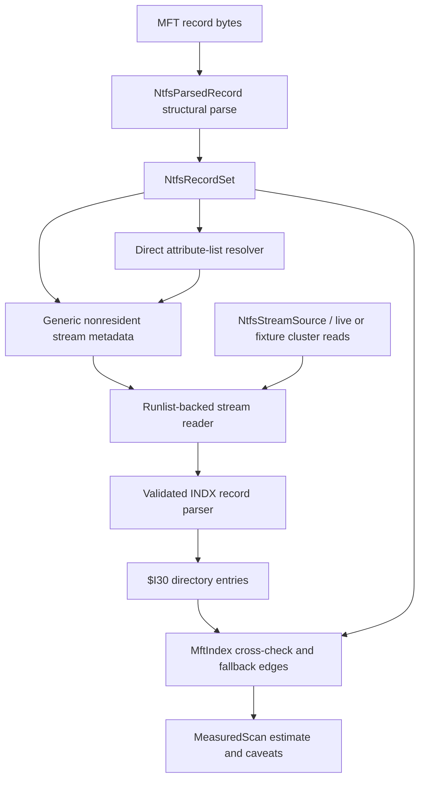
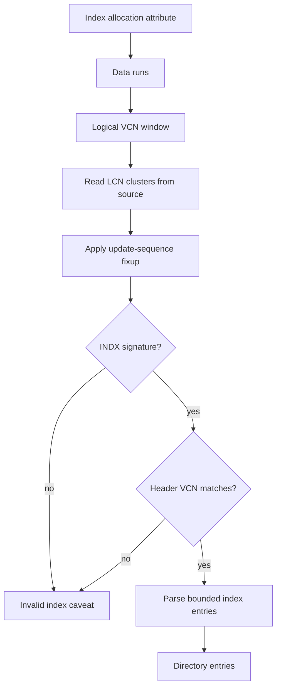

# NTFS Index Allocation Stream Reader - Plan

## Goal Capsule

| Field | Value |
|---|---|
| Objective | Complete the next NTFS correctness jump by replacing the current nonresident `$INDEX_ALLOCATION` caveat-only path with runlist-backed stream reading, validated INDX record parsing, sequence-aware directory-index integration, and durable fixture/oracle/fuzz/perf coverage. |
| Authority | The user's "best cleanup CLI" direction and fearless-refactor permission are authoritative. Correct cleanup estimates on large NTFS directories outrank preserving pre-release parser shapes or compatibility aliases. |
| Execution profile | Deep Rust/Windows refactor across `crates/rebecca-ntfs`, `crates/rebecca-core/src/scan/windows_ntfs_mft.rs`, parser tests, benchmarks, changelog, engineering memory, and selected docs. |
| Stop conditions | Stop if raw NTFS metadata becomes deletion authority, GPL/LGPL implementation code is copied, invalid INDX data is counted silently, live volume access leaks into `rebecca-ntfs`, or existing CLI v1 estimate fields change semantics without a separate product contract. |
| Tail ownership | The plan is complete when code, tests, benchmarks, documentation, and commits prove the new parser path; abandoned compatibility scaffolding and caveat-only dead code must be removed before declaring done. |

---

## Product Contract

### Summary

Rebecca already parses MFT records, direct `$ATTRIBUTE_LIST` `$DATA` extensions, runlists, sequence-aware hardlink paths, and resident `$I30` directory entries.
The largest remaining NTFS correctness gap is large-directory traversal: current records with nonresident `$INDEX_ALLOCATION:$I30` only produce an `index-allocation-present` caveat, so directory-index fallback remains incomplete exactly where large directories need it most.

This plan makes `$INDEX_ALLOCATION:$I30` a first-class, read-only parser input by adding a stream source boundary, parsing validated INDX records, merging split index attributes through direct attribute-list resolution, and wiring the richer directory entries into `MftIndex` without changing cleanup deletion authority.

### Problem Frame

Portable recursive scans are correct but slower on large NTFS trees.
The experimental Windows MFT backend is fast, but correctness depends on reconstructing parent/child edges from MFT metadata.
Resident `$INDEX_ROOT` is not enough for directories that spill into index allocation buffers.
If Rebecca wants the MFT backend to become the strongest cleanup estimate path, it needs the same core guarantees mature NTFS implementations enforce: mapped nonresident streams, INDX update-sequence fixups, VCN validation, bounded attribute-list expansion, and conservative caveats for corrupt or unsupported metadata.

### Requirements

**Stream and parser correctness**

- R1. The parser must represent nonresident attribute byte streams generically enough for `$DATA`, `$INDEX_ALLOCATION:$I30`, and nonresident `$ATTRIBUTE_LIST` without keeping a `$DATA`-only model.
- R2. The stream reader must map logical stream offsets through parsed data runs using cluster geometry, preserve VCN ordering, reject overflow, and handle sparse or missing runs conservatively.
- R3. INDX records must be parsed only after signature validation, update-sequence fixup, header bounds checks, and VCN validation against the requested stream position.
- R4. `$I30` index entries must extract child file references, parent references from embedded `$FILE_NAME`, namespace, name, flags, and file attributes.
- R5. Invalid INDX buffers, malformed entries, unsupported compression/encryption, sparse index allocation, or source read failures must produce bounded caveats or fallback, not silent child edges.

**Record-set and index integration**

- R6. `$INDEX_ALLOCATION:$I30` must be expanded after records are parsed, using `NtfsRecordSet`-level context rather than making `NtfsParsedRecord::parse` perform external I/O.
- R7. `$ATTRIBUTE_LIST` expansion must merge direct `$INDEX_ALLOCATION` and nonresident `$ATTRIBUTE_LIST` attributes from extension records without recursively expanding another attribute list.
- R8. `MftIndex` must merge resident and nonresident `$I30` entries as sequence-aware cross-check and fallback edges, deduplicating DOS/Win32 duplicates and preserving hardlink path behavior.
- R9. Existing logical-byte cleanup totals must remain stable; directory-index parsing improves edge completeness and caveat accuracy, not the v1 byte semantics.

**Live backend, evidence, and cleanup**

- R10. `rebecca-ntfs` must remain read-only and source-agnostic; Windows handles, volume identity, raw volume reads, cancellation, and fallback stay in `rebecca-core`.
- R11. The experimental backend must keep sequential `$MFT::$DATA` and FSCTL record fallback behavior while allowing a live cluster source to expand nonresident directory indexes when available.
- R12. Synthetic fixtures, recorded fixture hooks, oracle comparisons, fuzz-ready boundaries, and parser/perf benchmarks must cover fragmented streams and large-directory indexes.
- R13. Docs, changelog Unreleased entries, and engineering memory must explain the new capability, remaining caveats, license boundaries, and why obsolete caveat-only code was removed.

### Key Flows

- F1. Parse a large NTFS directory from records and stream source
  - **Trigger:** A directory record contains resident `$INDEX_ROOT:$I30` plus nonresident `$INDEX_ALLOCATION:$I30`.
  - **Actors:** `rebecca-core` live backend, `rebecca-ntfs` parser, `MftIndex`.
  - **Steps:** `rebecca-core` reads MFT records, provides cluster-read capability, `NtfsRecordSet` expands `$I30` streams, INDX records yield directory entries, and `MftIndex` cross-checks child edges.
  - **Outcome:** Subtree aggregation includes valid large-directory children without falling back to portable scanning solely because index allocation exists.
  - **Covered by:** R1, R2, R3, R4, R6, R8, R10, R11.
- F2. Reject corrupt index allocation safely
  - **Trigger:** A nonresident `$INDEX_ALLOCATION` run points at an invalid INDX buffer or stale VCN.
  - **Actors:** `rebecca-ntfs` stream reader, INDX parser, `MftIndex`.
  - **Steps:** The reader maps bytes, the INDX parser validates signature/fixup/VCN, and failure is recorded as a caveat scoped to the directory edge source.
  - **Outcome:** Invalid metadata is not counted as a trusted child edge; scan output remains bounded and explainable.
  - **Covered by:** R2, R3, R5, R8.
- F3. Merge split directory index attributes
  - **Trigger:** A base record's `$ATTRIBUTE_LIST` points `$INDEX_ALLOCATION:$I30` or nonresident `$ATTRIBUTE_LIST` content at an extension record.
  - **Actors:** `NtfsRecordSet`, attribute-list resolver, stream reader.
  - **Steps:** The resolver finds direct extension attributes by reference, attribute ID, name, type, and lowest VCN, then connects their runs in order.
  - **Outcome:** Split large-directory index data is parsed where direct resolution is safe; recursive lists and cycles stay caveated.
  - **Covered by:** R6, R7.

### Acceptance Examples

- AE1. Given a synthetic directory with one resident `$INDEX_ROOT:$I30` entry and one nonresident `$INDEX_ALLOCATION:$I30` INDX record, when `MftIndex::aggregate_subtree` runs, then both child files are counted and no `index-allocation-present` caveat remains for that valid fixture.
- AE2. Given an INDX record whose update-sequence array does not match sector tails, when directory-index expansion runs, then no child edge is added and a bounded invalid-directory-index caveat is surfaced.
- AE3. Given an INDX record whose header VCN differs from the requested stream VCN, when the parser reads that record, then expansion rejects it with a VCN mismatch caveat.
- AE4. Given an attribute list that splits `$INDEX_ALLOCATION:$I30` across an extension record with matching base reference and sequence, when record-set resolution runs, then directory entries from the extension stream are available to `MftIndex`.
- AE5. Given a live backend run where the sequential `$MFT` source succeeds but a directory index stream cannot be read because raw volume access is unavailable, when the estimate is produced, then the backend returns the existing MFT estimate with an explanatory caveat or falls back according to the current source strategy.

### Scope Boundaries

**In scope**

- Refactor `crates/rebecca-ntfs` DTOs and parser flow as needed, including breaking the current `$DATA`-only stream shape.
- Add first-party stream reader and INDX parsing primitives instead of adopting a production NTFS dependency in this plan.
- Use `repo-ref/ntfs`, `repo-ref/DiscUtils`, `repo-ref/gomft`, `repo-ref/python-ntfs`, `repo-ref/go-ntfs`, `repo-ref/libfsntfs`, `repo-ref/ntfs-3g`, and `repo-ref/sleuthkit` as behavior references, respecting license boundaries.
- Extend live Windows MFT backend internals only where needed to provide raw volume bytes for stream expansion.
- Update Unreleased changelog, relevant docs, and engineering memory after implementation.

**Deferred to follow-up work**

- Making `windows-ntfs-mft-experimental` the default backend.
- Parallel MFT record parsing or parallel INDX buffer expansion.
- USN-assisted scan-cache invalidation beyond the existing model.
- A user-facing allocated/reclaim-byte disk-usage surface.
- Full raw image mounting, `$MFTMirr` fallback, or forensic recovery features.
- Building a new public NTFS library API beyond Rebecca's cleanup scanner needs.

**Outside this product's identity**

- Writing to NTFS metadata or exposing repair/recovery/delete primitives through the parser.
- Copying GPL/LGPL/CPL implementation code from reference projects into Rebecca.
- Treating index slack or deleted INDX entries as cleanup candidates.

---

## Planning Contract

### Key Technical Decisions

- KTD1. Keep a first-party stream source boundary instead of adopting a production parser dependency here.
  `repo-ref/ntfs` remains the strongest Rust design reference, but Rebecca already owns enough parser DTOs after the prior dependency gate.
  The next useful step is to implement the missing boundary cleanly rather than reopen dependency migration.
- KTD2. Expand nonresident streams at `NtfsRecordSet` time, not during single-record parsing.
  A single MFT record cannot safely read extension records, cluster data, or live source bytes.
  `NtfsParsedRecord::parse` should keep returning structural metadata; `NtfsRecordSet` can then resolve attributes and stream-backed directory entries with all records and a source.
- KTD3. Make attribute streams generic before parsing `$INDEX_ALLOCATION`.
  The current `NtfsDataStream` shape is too narrow for `$I30` and nonresident `$ATTRIBUTE_LIST`.
  A generic stream model carrying attribute type, name, ID, VCN range, sizes, flags, and runs avoids another one-off parser later.
- KTD4. Treat INDX as a fixup-protected record with VCN identity.
  Mature implementations validate `INDX`, apply the update-sequence array, bound the index header, and reject VCN mismatches.
  Rebecca should follow that model instead of scanning for entries inside arbitrary bytes.
- KTD5. Attribute-list connected streams are direct and bounded.
  Extension attributes may be joined by `(type, name, attribute_id, lowest_vcn)` and base reference checks.
  Recursive `$ATTRIBUTE_LIST` expansion, cycles, and extension-base mismatches stay caveated.
- KTD6. Directory index entries supplement `$FILE_NAME` parent edges; they do not override trusted sequence evidence.
  `$I30` can repair incomplete parent maps, but stale child sequence numbers, parent mismatches, and hardlink ambiguity remain explicit caveats.
- KTD7. Keep live volume source acquisition in `rebecca-core`.
  `crates/rebecca-core/src/scan/windows_ntfs_mft.rs` already owns Windows handles, privileges, volume identity, raw reads, cancellation, fallback, cache, and provenance.
  `rebecca-ntfs` should receive an abstract source and geometry only.
- KTD8. Keep parser evidence deterministic by default.
  Default CI and perf runs should stay fixture-backed and not require elevated live NTFS reads; live dogfood remains opt-in.

### High-Level Technical Design

### System-Wide Impact

- `crates/rebecca-ntfs` moves from "record parser plus index builder" to "record-set parser with optional stream-backed metadata expansion."
- `crates/rebecca-core/src/scan/windows_ntfs_mft.rs` gains a reusable raw cluster source shape, but still owns all Windows-only source acquisition and fallback.
- `crates/rebecca-ntfs/tests/mft_parser.rs` likely needs helper extraction because synthetic stream, record, and INDX fixtures will otherwise make the current monolithic test file too large.
- Default CLI API v1 output remains additive and stable; caveat codes and backend-source detail may grow.
- The current `nonresident_i30_index_allocation_is_caveated` test becomes obsolete and should be replaced, not preserved as compatibility.

### Sequencing

| Phase | Units | Outcome |
|---|---|---|
| Phase 1 | U1, U2 | Parser primitives can describe and read generic nonresident streams and validate standalone INDX records. |
| Phase 2 | U3, U4 | Record-set expansion can parse `$INDEX_ALLOCATION:$I30` and connect split streams through direct attribute-list resolution. |
| Phase 3 | U5, U6 | `MftIndex` and the live backend consume directory-index expansion without changing cleanup authority or fallback semantics. |
| Phase 4 | U7, U8 | Fixtures, oracle checks, fuzz-ready tests, benchmarks, docs, changelog, and cleanup make the refactor landable. |

### Risks And Mitigations

| Risk | Impact | Mitigation |
|---|---|---|
| Stream expansion pulls Windows I/O into `rebecca-ntfs`. | Parser crate loses testability and publishable boundary. | Define a source trait or adapter in terms of logical cluster reads; implement live source only in `rebecca-core`. |
| INDX parsing trusts corrupt metadata. | Cleanup estimates include invalid subtree edges. | Validate signature, fixup, bounds, VCN, entry lengths, child references, and sequences before adding edges. |
| Attribute-list expansion grows recursive or cyclic. | Parser can hang or duplicate stream data. | Resolve direct extension attributes only and bound visited keys. |
| Generic streams become too abstract for cleanup needs. | More code without stronger estimates. | Limit the stream model to attribute metadata needed for `$DATA`, `$INDEX_ALLOCATION`, and `$ATTRIBUTE_LIST`; defer unrelated NTFS attributes. |
| Live raw reads fail after MFT records were parsed. | The backend loses large-directory improvement on some machines. | Keep existing estimate path with caveat or fallback; never require index allocation expansion to return an MFT estimate. |
| Test fixtures become hard to audit. | Future parser rewrites lose confidence. | Use small synthetic builders, recorded fixture provenance, and differential oracle summaries instead of opaque blobs. |

### Sources And Research

- `docs/knowledge/engineering/current-state.md` identifies nonresident `$INDEX_ALLOCATION` parsing through a runlist-backed stream reader as the next highest-leverage NTFS work.
- `docs/plans/2026-07-02-004-refactor-ntfs-parser-core-dependency-gate-plan.md` established the Rebecca-owned DTO strategy, first-party parser ownership, and reference-only license boundary for incompatible projects.
- `repo-ref/ntfs/src/structured_values/index_allocation.rs` and `repo-ref/ntfs/src/index_record.rs` show the mature Rust boundary: index allocation records are read from a nonresident value, fixed up, bounded, and checked by VCN.
- `repo-ref/ntfs/src/attribute_value/attribute_list_non_resident.rs` shows why attribute-list connected values need run-level stitching rather than a naive wrapper over one nonresident value.
- `repo-ref/DiscUtils/Library/DiscUtils.Ntfs/Index.cs` and `repo-ref/DiscUtils/Library/DiscUtils.Ntfs/IndexBlock.cs` provide a clean object boundary between directory index, allocation stream, VCN-to-position mapping, and fixup-protected index blocks.
- `repo-ref/python-ntfs/ntfs/filesystem/__init__.py` shows the simple shape of a runlist-backed logical attribute buffer and directory children fallback from `$INDEX_ALLOCATION` to `$INDEX_ROOT`.
- `repo-ref/gomft/mft/attributes.go` provides lightweight parser tests and index block entry parsing structure for cross-checking fixture expectations.
- `repo-ref/libfsntfs`, `repo-ref/ntfs-3g`, and `repo-ref/sleuthkit` remain behavior references for edge cases only; do not copy implementation code.

---

## Implementation Units

### U1. Replace `$DATA`-only stream metadata with generic NTFS attribute streams

- **Goal:** Represent nonresident streams for `$DATA`, `$INDEX_ALLOCATION:$I30`, and nonresident `$ATTRIBUTE_LIST` without one-off fields.
- **Requirements:** R1, R2, R6, R7.
- **Dependencies:** None.
- **Files:** `crates/rebecca-ntfs/src/adapter.rs`, `crates/rebecca-ntfs/src/record.rs`, `crates/rebecca-ntfs/src/attrs.rs`, `crates/rebecca-ntfs/src/runlist.rs`, `crates/rebecca-ntfs/src/lib.rs`, `crates/rebecca-ntfs/tests/mft_parser.rs`.
- **Approach:** Replace or reshape `NtfsDataStream` into a generic stream DTO carrying `AttributeType`, `attribute_id`, `name`, `lowest_vcn`, `highest_vcn`, logical/allocated/initialized sizes, flags, and `NtfsDataRun` values.
  Keep cleanup size helpers focused on unnamed `$DATA` so v1 logical totals do not change.
  Delete compatibility aliases that would keep the old flat stream model alive.
- **Execution note:** Add characterization coverage around existing `$DATA` cleanup totals before renaming the DTO.
- **Patterns to follow:** Current `NtfsDataStream` tests, `repo-ref/ntfs/src/attribute_value/non_resident.rs`, and existing `merge_data_stream` behavior.
- **Test scenarios:** Unnamed nonresident `$DATA` still returns the same `cleanup_logical_size`; named `$DATA` still produces the named-stream caveat; nonresident `$INDEX_ALLOCATION:$I30` is represented as a stream rather than only a caveat; nonresident `$ATTRIBUTE_LIST` records stream metadata without attempting recursive expansion; fragmented and sparse runlists preserve VCN order and sparse markers.
- **Verification:** `cargo nextest run -p rebecca-ntfs --test mft_parser` proves the DTO migration preserves existing `$DATA` behavior and exposes `$I30` stream metadata.

### U2. Add a runlist-backed stream reader boundary

- **Goal:** Read logical stream byte ranges from data runs using an abstract source that can be backed by fixtures or live raw volume reads.
- **Requirements:** R2, R5, R10, R11, R12.
- **Dependencies:** U1.
- **Files:** `crates/rebecca-ntfs/src/stream.rs`, `crates/rebecca-ntfs/src/runlist.rs`, `crates/rebecca-ntfs/src/lib.rs`, `crates/rebecca-ntfs/tests/mft_parser.rs`, `crates/rebecca-core/src/scan/windows_ntfs_mft.rs`.
- **Approach:** Introduce a small `NtfsStreamSource`-style boundary for reading cluster-aligned bytes by LCN and byte length, plus a mapped stream reader that translates logical stream offsets through `NtfsDataRun`.
  Include an in-memory fixture source in tests and keep the live implementation in `rebecca-core`.
  Treat sparse `$INDEX_ALLOCATION`, VCN gaps, compressed/encrypted attributes, short reads, and arithmetic overflow as caveated unsupported states.
- **Patterns to follow:** `repo-ref/ntfs/src/attribute_value/non_resident.rs`, `repo-ref/python-ntfs/ntfs/filesystem/__init__.py`, and existing `LiveNtfsVolume::read_volume_bytes`.
- **Test scenarios:** Single-run stream read returns exact bytes; multi-run read crosses run boundaries; negative LCN deltas still map correctly after runlist parsing; sparse ranges return zeros only for data streams where explicitly allowed and caveat for `$INDEX_ALLOCATION`; VCN gaps and overflow fail deterministically; short source reads become a typed stream-read error.
- **Verification:** `cargo nextest run -p rebecca-ntfs --test mft_parser` and `cargo check -p rebecca-core` prove the parser/core boundary compiles without live volume requirements.

### U3. Parse validated INDX records and `$I30` index entries

- **Goal:** Turn raw index allocation bytes into directory entries only after NTFS record-level validation.
- **Requirements:** R3, R4, R5.
- **Dependencies:** U2.
- **Files:** `crates/rebecca-ntfs/src/dir_index.rs`, `crates/rebecca-ntfs/src/fixup.rs`, `crates/rebecca-ntfs/src/parse.rs`, `crates/rebecca-ntfs/src/lib.rs`, `crates/rebecca-ntfs/tests/mft_parser.rs`.
- **Approach:** Add an INDX parser that validates the `INDX` signature, applies update-sequence fixups through the existing fixup primitive, reads record VCN, bounds the index header, and parses entries using the same `$FILE_NAME` parser as resident `$INDEX_ROOT`.
  Support last-entry and child-VCN flags; extract the child VCN for validation and future B-tree traversal, but only add child file entries after their embedded `$FILE_NAME` payload is valid.
- **Patterns to follow:** Current `parse_i30_index_root`, `repo-ref/ntfs/src/index_record.rs`, `repo-ref/gomft/mft/attributes.go`, and `repo-ref/DiscUtils/Library/DiscUtils.Ntfs/IndexBlock.cs`.
- **Test scenarios:** Valid INDX buffer with one entry yields one `NtfsDirectoryEntry`; fixup mismatch fails; invalid signature fails; index used size greater than allocated size fails; entry length smaller than header fails; child VCN flag is parsed without treating the last entry as a file; VCN mismatch fails.
- **Verification:** `cargo nextest run -p rebecca-ntfs --test mft_parser` covers resident root and nonresident INDX parsing with shared entry behavior.

### U4. Expand `$INDEX_ALLOCATION:$I30` and connected attribute-list streams in `NtfsRecordSet`

- **Goal:** Resolve directory-index streams after record parsing so large-directory child entries become available to `MftIndex`.
- **Requirements:** R6, R7, R8, R12.
- **Dependencies:** U1, U2, U3.
- **Files:** `crates/rebecca-ntfs/src/record_set.rs`, `crates/rebecca-ntfs/src/attribute_list.rs`, `crates/rebecca-ntfs/src/dir_index.rs`, `crates/rebecca-ntfs/src/adapter.rs`, `crates/rebecca-ntfs/tests/mft_parser.rs`.
- **Approach:** Extend `NtfsRecordSet` with an expansion pass that takes cluster geometry and a stream source, resolves direct attribute-list extension streams, reads each `$INDEX_ALLOCATION:$I30` stream in index-record-sized chunks, validates INDX VCNs, and appends directory entries to the owning base record.
  Keep recursive attribute-list references, missing extension records, base-reference mismatches, duplicate stream fragments, and unsupported nonresident attribute-list cases caveated unless U2 provides enough source data to expand them safely.
- **Execution note:** Replace the existing `nonresident_i30_index_allocation_is_caveated` test with behavior tests that prove valid index allocation is parsed and invalid allocation is caveated.
- **Patterns to follow:** Existing `NtfsRecordSet::resolve_attribute_lists`, `repo-ref/ntfs/src/attribute_value/attribute_list_non_resident.rs`, and `repo-ref/go-ntfs` direct-attribute lookup behavior reference.
- **Test scenarios:** Base record with direct `$INDEX_ALLOCATION:$I30` gains directory entries; attribute-list extension record with matching base reference contributes split index allocation; missing extension record produces `attribute-list-extension-record-missing`; recursive attribute list is refused; nonresident attribute list with fixture source expands if supported; source read error creates a bounded caveat and leaves existing resident entries intact.
- **Verification:** `cargo nextest run -p rebecca-ntfs --test mft_parser` proves record-set expansion is deterministic and does not require Windows.

### U5. Integrate nonresident `$I30` entries into `MftIndex`

- **Goal:** Use directory-index entries as sequence-aware cross-check and fallback edges while preserving hardlink and logical-size semantics.
- **Requirements:** R4, R5, R8, R9.
- **Dependencies:** U3, U4.
- **Files:** `crates/rebecca-ntfs/src/index.rs`, `crates/rebecca-ntfs/src/adapter.rs`, `crates/rebecca-ntfs/tests/mft_parser.rs`.
- **Approach:** Feed resident and nonresident `$I30` entries through the existing `cross_check_directory_entries` path, then tighten caveat codes where nonresident allocation needs source-specific context.
  Deduplicate DOS/Win32 duplicates by child reference and namespace preference, keep parent-sequence mismatch behavior, and avoid double-counting hardlinked physical records in a subtree.
- **Patterns to follow:** Current `cross_check_directory_entries`, hardlink tests in `crates/rebecca-ntfs/tests/mft_parser.rs`, and `repo-ref/python-ntfs` child de-dup behavior.
- **Test scenarios:** Valid index allocation supplies a fallback edge when `$FILE_NAME` parent mapping is stale; matching `$FILE_NAME` and `$I30` entries do not duplicate children; child sequence mismatch is caveated and skipped; hardlinked file remains counted once per subtree; corrupt nonresident index caveat appears on affected subtree summary.
- **Verification:** `cargo nextest run -p rebecca-ntfs --test mft_parser` proves aggregation results and caveat propagation.

### U6. Wire stream-backed expansion into the live Windows MFT backend

- **Goal:** Let the experimental live backend expand index allocation when raw volume reads are available without weakening fallback or provenance behavior.
- **Requirements:** R10, R11.
- **Dependencies:** U2, U4, U5.
- **Files:** `crates/rebecca-core/src/scan/windows_ntfs_mft.rs`, `crates/rebecca-core/tests/scan_engine.rs`, `crates/rebecca-core/benches/perf_matrix.rs`, `crates/rebecca/tests/cli_clean.rs`, `crates/rebecca/tests/cli_inspect.rs`.
- **Approach:** Implement the stream source adapter on top of `LiveNtfsVolume::read_volume_bytes` and NTFS geometry.
  After MFT records are read by the selected source, run record-set stream expansion before building `MftIndex`.
  Preserve existing source labels (`sequential`, `fsctl-record`), bounded caveats, cache keying, target identity validation, cancellation, and portable fallback.
  If stream expansion fails in a fallback-capable way, attach caveats or fall back according to current source strategy rather than hiding the issue.
- **Patterns to follow:** `ParsedNtfsRecords`, `MftRecordSource`, `read_mft_records_from_sources`, `with_bounded_mft_caveats`, and current live-source opt-out env behavior.
- **Test scenarios:** Fake live source expands a large-directory fixture; fake source read failure keeps a bounded caveat; fallback from sequential to FSCTL still works; cancellation during expansion returns `OperationCancelled`; CLI JSON/NDJSON keeps stable estimate fields and includes additive caveat detail; test environments with `REBECCA_TEST_DISABLE_LIVE_NTFS_MFT` still avoid accidental live scans.
- **Verification:** `cargo nextest run -p rebecca-core --test scan_engine`, `cargo nextest run -p rebecca --test cli_clean --test cli_inspect`, and `cargo check -p rebecca-core --benches` prove integration without requiring elevated live dogfood.

### U7. Build fixture, oracle, fuzz-ready, and benchmark coverage

- **Goal:** Make stream-backed NTFS parsing durable enough for future fearless rewrites and performance work.
- **Requirements:** R12.
- **Dependencies:** U1, U2, U3, U4, U5, U6.
- **Files:** `crates/rebecca-ntfs/tests/mft_parser.rs`, `crates/rebecca-ntfs/tests/fixtures/`, `crates/rebecca-ntfs/benches/mft_parser.rs`, `crates/rebecca-core/benches/perf_matrix.rs`, `scripts/perf/run-benchmark-matrix.ps1`, `docs/performance/perf-matrix.md`.
- **Approach:** Extract reusable synthetic fixture builders for records, runlists, INDX buffers, and record sets.
  Add recorded fixture hooks with provenance notes when safe.
  Use permissively licensed Rust references such as `repo-ref/ntfs` or `repo-ref/mft` as optional oracle inspiration or dev-only comparison, not production dependencies.
  Shape parser boundaries so a future `cargo-fuzz` target can feed runlists, attribute lists, INDX records, and record-set expansion without redesign.
  Add benchmark cases for generated large directories with index allocation and fragmented stream reads.
- **Patterns to follow:** Existing `crates/rebecca-ntfs/benches/mft_parser.rs`, `crates/rebecca-core/benches/perf_matrix.rs`, `repo-ref/ntfs/testdata`, and current perf matrix live-NTFS opt-in design.
- **Test scenarios:** Fragmented index allocation, sparse index allocation, split attribute list, corrupt INDX fixup, VCN mismatch, duplicate DOS/Win32 names, hardlink paths, stale parent sequence, source short read, and repeated caveat summarization are covered by deterministic fixtures.
- **Verification:** `cargo nextest run -p rebecca-ntfs`, `cargo check -p rebecca-ntfs --benches`, `cargo check -p rebecca-core --benches`, and `pwsh -File scripts/perf/run-benchmark-matrix.ps1` prove parser and benchmark coverage.

### U8. Update docs, changelog, memory, and remove obsolete caveat-only code

- **Goal:** Land the refactor with clear release notes and no compatibility clutter from the superseded parser shape.
- **Requirements:** R13.
- **Dependencies:** U1, U2, U3, U4, U5, U6, U7.
- **Files:** `CHANGELOG.md`, `README.md`, `docs/performance/perf-matrix.md`, `docs/api/cli/v1/README.md`, `docs/adr/0005-scan-engine-strategy.md`, `docs/knowledge/engineering/current-state.md`, `docs/knowledge/engineering/log.md`, `crates/rebecca-ntfs/src/record.rs`, `crates/rebecca-ntfs/src/record_set.rs`, `crates/rebecca-ntfs/src/dir_index.rs`.
- **Approach:** Add Unreleased entries for valid nonresident `$I30` parsing, bounded invalid-index caveats, and live backend behavior.
  Update docs without implying the experimental backend is default.
  Remove `index-allocation-present` as the normal valid-data outcome, delete compatibility aliases for old stream DTOs, and replace stale tests that assert caveat-only behavior.
  Record remaining caveats such as unsupported compressed/encrypted index streams or live source failures.
- **Patterns to follow:** Current Unreleased NTFS entries in `CHANGELOG.md`, current engineering-memory style, and parser caveat wording in `windows_ntfs_mft.rs`.
- **Test scenarios:** `rg "index-allocation-present|NtfsDataStream|MftTree"` finds no stale compatibility-only references except intentional changelog/history text; docs preserve v1 logical-byte semantics; changelog describes the capability as experimental MFT backend hardening; no docs claim deletion behavior changed.
- **Verification:** `cargo fmt --all --check`, `cargo check --workspace`, `cargo nextest run --workspace`, `cargo clippy --workspace --all-targets --all-features -- -D warnings`, `cargo deny check`, and `git diff --check` pass.

---

## Verification Contract

| Gate | Applies to | Done signal |
|---|---|---|
| `cargo fmt --all --check` | Entire workspace | Formatting is stable after parser, core, test, and doc-adjacent Rust edits. |
| `cargo check --workspace` | Entire workspace | Public and internal API refactors compile across CLI, core, NTFS, rules, and Windows crates. |
| `cargo nextest run -p rebecca-ntfs` | U1, U2, U3, U4, U5, U7 | Parser DTO, stream reader, INDX parser, record-set expansion, and fixture coverage pass. |
| `cargo nextest run -p rebecca-core --test scan_engine` | U6 | Live backend fallback, cache, caveat, and fake source integration behavior pass. |
| `cargo nextest run -p rebecca --test cli_clean --test cli_inspect` | U6, U8 | CLI contract surfaces remain stable and additive. |
| `cargo nextest run --workspace` | U8 | Cross-crate regression coverage passes before final commit. |
| `cargo clippy --workspace --all-targets --all-features -- -D warnings` | Entire workspace | Refactored parser/core code meets lint bar. |
| `cargo deny check` | Entire workspace | Dependency/license policy stays green; no incompatible reference code or unapproved dependency lands. |
| `cargo check -p rebecca-ntfs --benches` and `cargo check -p rebecca-core --benches` | U7 | Parser and perf matrix benchmark code compiles. |
| `pwsh -File scripts/perf/run-benchmark-matrix.ps1` | U7 | Default benchmark matrix remains deterministic and does not require live NTFS. |
| `git diff --check` | Entire workspace | No whitespace or patch hygiene issues remain. |

---

## Definition of Done

- Valid nonresident `$INDEX_ALLOCATION:$I30` fixtures produce directory entries and no longer rely on `index-allocation-present` as the normal path.
- Invalid or unsupported index allocation states produce bounded, actionable caveats and never add trusted edges silently.
- `NtfsParsedRecord` / `NtfsRecordSet` can represent and expand generic nonresident streams without keeping a `$DATA`-only compatibility model.
- `MftIndex` integrates resident and nonresident `$I30` entries as sequence-aware cross-check/fallback evidence while preserving hardlink and logical-byte behavior.
- The live Windows backend can provide stream source bytes for expansion when available and preserves existing fallback, cancellation, cache, backend-source, and test-disable behavior.
- Synthetic fixture, oracle-ready, fuzz-ready, and benchmark coverage exists for fragmented streams and INDX records.
- `CHANGELOG.md` Unreleased, docs, and engineering memory describe the capability and remaining caveats.
- Obsolete caveat-only tests, aliases, and dead-end parser code are deleted rather than retained for pre-release compatibility.
- All verification gates in the Verification Contract pass, or any intentionally skipped live-only dogfood is documented with exact reason and replacement evidence.

---

## Appendix

### External Code Boundary Notes

- `repo-ref/ntfs` is `MIT OR Apache-2.0` and is safe to use as a design reference or potential future dependency, but this plan does not require production adoption.
- `repo-ref/DiscUtils` is MIT and useful for object-boundary design around `Index`, `IndexBlock`, and allocation streams.
- `repo-ref/gomft` is MIT and useful for compact parser test expectations.
- `repo-ref/python-ntfs` is Apache-2.0 and useful for behavior framing around nonresident attribute data and `$I30` child enumeration.
- `repo-ref/go-ntfs` is Apache-2.0 and useful for paging, fixtures, and direct attribute-list lookup behavior.
- `repo-ref/libfsntfs`, `repo-ref/ntfs-3g`, and `repo-ref/sleuthkit` include incompatible or mixed licenses for Rebecca's source tree; use them only to understand behavior and edge cases.
