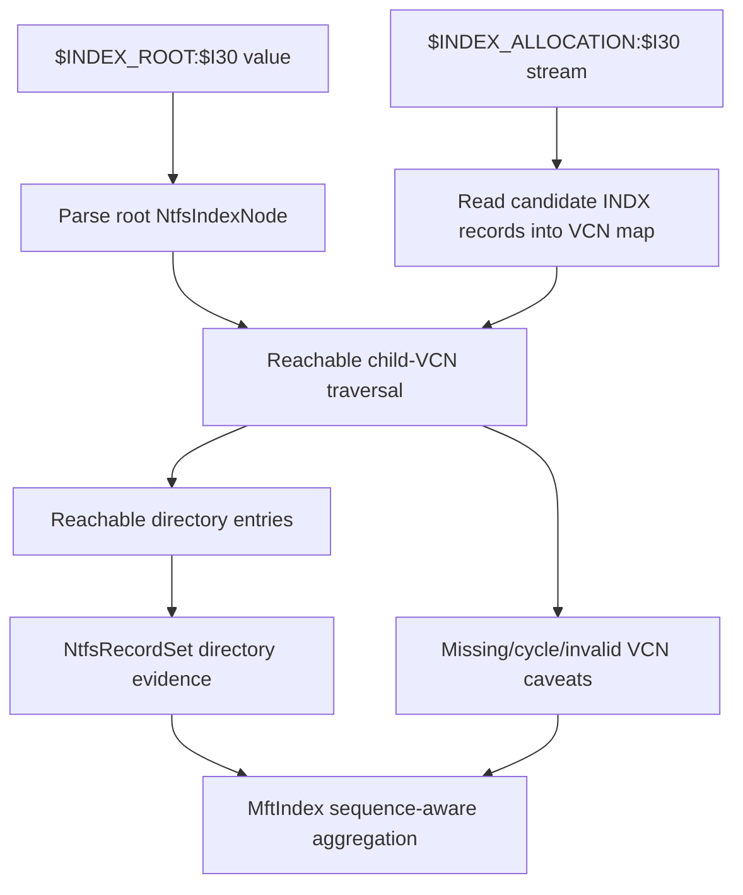
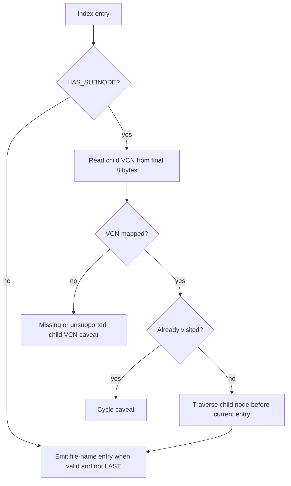

# NTFS Index Tree Dogfood - Plan

## Goal Capsule

| Field | Value |
|---|---|
| Objective | Replace the current flat `$INDEX_ALLOCATION:$I30` expansion with B-tree-aware child-VCN traversal and add repeatable live NTFS dogfood evidence for the experimental backend. |
| Authority | The user's "best cleanup CLI" direction and fearless-refactor permission are authoritative. Correct NTFS metadata interpretation, bounded caveats, and deletion safety outrank preserving pre-release parser DTO compatibility. |
| Execution profile | Deep Rust refactor across `crates/rebecca-ntfs` and `crates/rebecca-core`, plus deterministic tests, benchmarks, live dogfood script/reporting, changelog, docs, and engineering memory. |
| Stop conditions | Stop if raw NTFS metadata becomes deletion authority, invalid or unreachable INDX blocks are counted as trusted children, GPL/LGPL implementation code is copied, live volume handles leak into `rebecca-ntfs`, or the dry-run dogfood script can delete user files. |
| Tail ownership | The plan is complete when tree-aware parser behavior, live dogfood collection, tests, docs, and commits prove the new path; abandoned flat-expansion code and compatibility aliases must be removed. |

---

## Product Contract

### Summary

Rebecca now parses runlist-backed `$INDEX_ALLOCATION:$I30` records, but it appends every valid INDX block from the stream as if the allocation were a flat list.
Mature NTFS implementations treat directory indexes as B-trees: root entries and allocation entries can carry subnode VCNs, and traversal follows those child links.
The next correctness step is to preserve child VCNs, traverse reachable nodes, caveat missing or cyclic children, and dogfood the live backend on an elevated NTFS volume without granting metadata delete authority.

### Problem Frame

The current implementation is fast and useful, but it can over-trust allocation records that are not reachable from `$INDEX_ROOT`.
It also discards the child VCN on entries with `INDEX_ENTRY_FLAG_NODE`, so it cannot validate multi-level directory indexes or reason about missing subnodes.
For a cleanup CLI, this matters because subtree byte estimates should improve from metadata while remaining conservative when metadata is stale, partial, or unsupported.

### Requirements

**Index tree correctness**

- R1. `$INDEX_ROOT:$I30` and `$INDEX_ALLOCATION:$I30` parsing must preserve each index entry's subnode child VCN, including the last-entry child pointer.
- R2. Index allocation reads must map requested child VCNs to stream offsets through a single checked helper that accounts for cluster size, index record size, and unsupported multi-buffer-per-cluster layouts.
- R3. `NtfsRecordSet` must add directory entries from nodes reachable from the root tree and must stop trusting a valid allocation block solely because it appears sequentially in the stream.
- R4. Missing, out-of-range, invalid, cyclic, duplicated, or unsupported child VCN traversal must produce bounded caveats and must not add silent child edges.
- R5. Resident and nonresident `$I30` entries must keep sequence-aware behavior in `MftIndex`, including hardlink path candidates, parent-sequence mismatches, DOS/Win32 de-duplication, and logical-byte totals.

**Live backend and evidence**

- R6. The live Windows backend must remain read-only, opt-in, fallback-capable, and owned by `rebecca-core`; `rebecca-ntfs` must receive only abstract stream bytes and geometry.
- R7. A repeatable elevated dogfood script must run dry-run or inspect-only commands against selected NTFS roots, compare experimental MFT output with portable or Windows-native output, and write local JSON evidence under `target/`.
- R8. The dogfood path must surface backend source, fallback reason, caveat counts, target totals, and command exit status without writing cleanup history or deleting files.

**Maintenance**

- R9. Synthetic tests and benchmarks must cover multi-level index traversal, child VCN failures, fragmented streams, index-record-size edge cases, and live-source failure behavior.
- R10. Changelog, release/config/performance docs, ADR/current-state memory, and stale comments must describe tree-aware `$I30` traversal, live dogfood evidence, and remaining boundaries.

### Key Flows

- F1. Traverse a multi-level directory index
  - **Trigger:** A directory's `$INDEX_ROOT:$I30` contains a last entry with a child VCN pointing into `$INDEX_ALLOCATION:$I30`.
  - **Actors:** `rebecca-ntfs` parser, `NtfsRecordSet`, `MftIndex`.
  - **Steps:** The parser preserves root child VCNs, the stream reader fetches the referenced INDX record, the INDX parser validates fixup and VCN identity, traversal visits child entries, and `MftIndex` uses the resulting directory entries as sequence-aware fallback evidence.
  - **Outcome:** Reachable large-directory children are counted once, while unreferenced allocation blocks are not promoted to trusted edges.
  - **Covered by:** R1, R2, R3, R5.
- F2. Bound corrupt or stale index traversal
  - **Trigger:** A root or allocation entry points at a missing, cyclic, or invalid child VCN.
  - **Actors:** `NtfsRecordSet`, stream reader, INDX parser.
  - **Steps:** Traversal checks the visited set, resolves the child offset, reads the candidate record, validates it, and records a caveat if any step fails.
  - **Outcome:** Existing resident entries remain available, but the invalid child subtree does not become cleanup evidence.
  - **Covered by:** R2, R4.
- F3. Dogfood an elevated live volume without deleting
  - **Trigger:** A maintainer runs the dogfood script on a selected NTFS root such as the current E: workspace volume.
  - **Actors:** CLI, `rebecca-core` scan backend, local JSON report.
  - **Steps:** The script runs read-only experimental MFT estimates and comparison estimates, captures JSON output, normalizes key fields, and writes a local report under `target/ntfs-dogfood/`.
  - **Outcome:** The team can see whether live metadata succeeds, falls back, or emits caveats on the current workstation before deciding future default behavior.
  - **Covered by:** R6, R7, R8.

### Acceptance Examples

- AE1. Given a root node whose last entry has child VCN 0 and an allocation record at VCN 0 containing `large.bin`, when `MftIndex::aggregate_subtree` runs, then `large.bin` is counted and no flat-only traversal is needed.
- AE2. Given root VCN 0 pointing to an allocation node that itself points to VCN 8, when traversal runs, then entries from both reachable nodes are available in sorted traversal order and are not duplicated.
- AE3. Given a cycle where VCN 0 points back to VCN 0, when expansion runs, then traversal stops with one bounded cycle caveat and no infinite loop.
- AE4. Given a child VCN that maps outside the index allocation stream or to a record with mismatched header VCN, when expansion runs, then no child edges from that node are added and the caveat identifies the parent record and VCN.
- AE5. Given a valid allocation block that is not reachable from `$INDEX_ROOT`, when expansion runs, then its entries are not added to `directory_entries`.
- AE6. Given the live dogfood script is run against an NTFS root with dry-run or inspect-only mode, when it completes, then the JSON report includes backend source or fallback reason, caveat summary, comparison totals, and no cleanup history write.

### Scope Boundaries

**In scope**

- Break and reshape `NtfsIndexRoot`, `NtfsDirectoryEntry`, and parser DTOs as needed to represent index nodes and child VCNs cleanly.
- Replace flat sequential `$INDEX_ALLOCATION` entry promotion with tree-aware traversal from root entries.
- Keep reading allocation streams sequentially when useful for building a VCN-to-record map, but trust only reachable nodes for directory entries.
- Add a PowerShell dogfood script for read-only live backend evidence.
- Use `repo-ref/ntfs`, `repo-ref/DiscUtils`, `repo-ref/gomft`, `repo-ref/go-ntfs`, `repo-ref/python-ntfs`, `repo-ref/libfsntfs`, `repo-ref/ntfs-3g`, and `repo-ref/sleuthkit` as behavior references under existing license boundaries.

**Deferred to follow-up work**

- Parsing `$BITMAP:$I30` as an allocation-validity oracle.
- Making `windows-ntfs-mft-experimental` the default backend.
- Parallel MFT or INDX parsing.
- Exposing allocated/reclaim bytes as a user-facing disk-usage contract.
- Raw image mounting, `$MFTMirr` fallback, forensic recovery, index slack recovery, or deleted-entry enumeration.

**Outside this product's identity**

- Writing to NTFS metadata or exposing repair/recovery/delete primitives from the parser.
- Copying GPL/LGPL/CPL implementation code or fixtures from incompatible reference projects.
- Treating unreferenced INDX blocks, index slack, or deleted entries as cleanup candidates.

---

## Planning Contract

### Key Technical Decisions

- KTD1. Introduce an index-node DTO instead of hiding child VCN on `NtfsDirectoryEntry`.
  Directory entries represent file-name evidence; index entries represent B-tree structure.
  A small `NtfsIndexNode` / `NtfsIndexEntry` shape keeps file evidence and traversal edges separate while preserving a derived directory-entry list for `MftIndex`.
- KTD2. Traverse from root child links and demote flat stream parsing to node discovery.
  The previous flat parser is useful for reading candidate INDX records, but not every valid record should become a trusted child edge.
  Traversal should start at resident root entries, follow each subnode VCN, and add file entries only when the node is reachable.
- KTD3. Centralize child VCN to stream-offset mapping.
  `repo-ref/ntfs` reads allocation records from a requested VCN and validates header VCN; DiscUtils also guards layouts where multiple index buffers fit inside one cluster.
  Rebecca should use one helper so common layouts work and unsupported layouts caveat instead of silently misaddressing records.
- KTD4. Keep caveats local and bounded.
  Cycles, missing nodes, VCN mismatches, invalid fixups, unsupported record-size geometry, and source failures should generate sampled caveats per affected directory rather than full-volume noise.
- KTD5. Preserve live backend ownership in `rebecca-core`.
  Raw volume handles, elevation, cancellation, fallback, cache reuse, and source provenance stay in `crates/rebecca-core/src/scan/windows_ntfs_mft.rs`.
  Parser crates receive only stream-source reads and geometry.
- KTD6. Make live dogfood a local evidence workflow, not a default benchmark.
  Deterministic CI and Criterion runs remain fixture-backed.
  Elevated live runs are opt-in, write only to `target/`, and compare JSON contract fields rather than asserting machine-specific byte totals in committed tests.

### High-Level Technical Design

### System-Wide Impact

- `crates/rebecca-ntfs/src/dir_index.rs` becomes an index-node parser, not only a directory-entry parser.
- `crates/rebecca-ntfs/src/record_set.rs` owns tree traversal and caveat policy for stream-backed directory indexes.
- `crates/rebecca-ntfs/src/index.rs` should consume the same directory-entry evidence but may receive clearer source/caveat metadata.
- `crates/rebecca-core/src/scan/windows_ntfs_mft.rs` should gain no new NTFS parsing semantics beyond calling the updated record-set API and supporting dogfood evidence.
- `scripts/perf/` or a new `scripts/ntfs/` directory gains an opt-in live dogfood workflow that never runs in default CI.

### Sequencing

| Phase | Units | Outcome |
|---|---|---|
| Phase 1 | U1, U2 | Parser DTOs preserve child VCNs and can map child VCNs to validated allocation records. |
| Phase 2 | U3, U4 | Record-set expansion traverses reachable index trees and `MftIndex` keeps sequence-aware aggregation behavior. |
| Phase 3 | U5 | Live dogfood evidence can be collected repeatably without deletion or committed machine-specific output. |
| Phase 4 | U6 | Benchmarks, docs, changelog, and engineering memory land with stale flat-expansion code removed. |

### Risks And Mitigations

| Risk | Impact | Mitigation |
|---|---|---|
| Child VCN offset mapping is wrong for uncommon index-record geometry. | Live large-directory estimates can miss or misread child nodes. | Centralize the mapping helper, test index-record-size variants, and caveat unsupported multi-buffer-per-cluster layouts. |
| Traversal trusts unreferenced valid allocation records. | Estimates include stale or slack-like entries. | Build a candidate map if needed, but only promote entries reached from root child links. |
| Cycle handling becomes noisy on corrupt volumes. | JSON caveats become too large. | Use per-record visited sets and bounded caveat summarization. |
| DTO refactor breaks existing tests broadly. | Implementation churn hides actual behavior changes. | Delete old compatibility aliases and update tests around behavior slices: parser node shape, record-set traversal, and aggregation. |
| Live dogfood is mistaken for deterministic CI evidence. | Builds become machine-dependent. | Keep dogfood opt-in, write reports under `target/`, and document it as local evidence only. |

### Sources And Research

- `docs/plans/2026-07-02-005-refactor-ntfs-index-allocation-stream-plan.md` completed generic streams, sequential chunk reads, validated INDX parsing, direct attribute-list `$INDEX_ALLOCATION` expansion, and live source wiring.
- `crates/rebecca-ntfs/src/dir_index.rs` currently drops the subnode child VCN after subtracting the final eight bytes from NODE entries.
- `crates/rebecca-ntfs/src/record_set.rs` currently reads every index-record-sized chunk sequentially and appends valid parsed entries, which is the behavior this plan replaces.
- `repo-ref/ntfs/src/index.rs`, `repo-ref/ntfs/src/index_entry.rs`, and `repo-ref/ntfs/src/structured_values/index_allocation.rs` model child VCN traversal and record-from-VCN validation.
- `repo-ref/DiscUtils/Library/DiscUtils.Ntfs/Index.cs` shows a dedicated `IndexBlockVcnToPosition` boundary and explicit unsupported handling for unusual VCN layouts.
- `docs/performance/perf-matrix.md` already states live NTFS performance is opt-in and that reports should stay under `target/perf/`.
- `docs/release.md` already lists read-only release dogfood commands for `windows-ntfs-mft-experimental`; this plan turns that evidence into a reusable script/report.

---

## Implementation Units

### U1. Model `$I30` index nodes with child VCNs

- **Goal:** Preserve B-tree structure from resident and allocation index entries without overloading plain directory-entry evidence.
- **Requirements:** R1, R5, R9.
- **Dependencies:** None.
- **Files:** `crates/rebecca-ntfs/src/adapter.rs`, `crates/rebecca-ntfs/src/dir_index.rs`, `crates/rebecca-ntfs/src/record.rs`, `crates/rebecca-ntfs/src/lib.rs`, `crates/rebecca-ntfs/tests/mft_parser.rs`.
- **Approach:** Introduce a compact index-node representation that stores source VCN, file-entry payload when present, child VCN when `INDEX_ENTRY_FLAG_NODE` is set, and last-entry state.
  Keep `NtfsDirectoryEntry` focused on child file evidence, then derive it from reachable index entries.
  Parse child VCN from the final eight bytes of any NODE entry, including the LAST entry.
  Delete compatibility helpers that hide the old "entries only" parser shape.
- **Execution note:** Start with parser tests that fail because current root and allocation parsing drops child VCN.
- **Patterns to follow:** `crates/rebecca-ntfs/src/dir_index.rs`, `repo-ref/ntfs/src/index_entry.rs`, and `repo-ref/gomft/mft/attributes_test.go`.
- **Test scenarios:** Root index entry without NODE yields a file entry and no child VCN; root last entry with NODE yields no file entry and preserves child VCN; allocation entry with NODE yields file entry plus child VCN; malformed NODE entry shorter than the final child VCN fails; invalid file-name payload in a non-LAST entry fails without losing the child VCN bounds check.
- **Verification:** Parser tests in `crates/rebecca-ntfs/tests/mft_parser.rs` prove child VCN extraction for root and INDX records.

### U2. Centralize child VCN to index allocation record reads

- **Goal:** Read a requested child VCN through a checked mapping helper and validate the resulting INDX record's header VCN.
- **Requirements:** R2, R4, R6, R9.
- **Dependencies:** U1.
- **Files:** `crates/rebecca-ntfs/src/dir_index.rs`, `crates/rebecca-ntfs/src/record_set.rs`, `crates/rebecca-ntfs/src/stream.rs`, `crates/rebecca-ntfs/tests/mft_parser.rs`, `crates/rebecca-ntfs/benches/mft_parser.rs`.
- **Approach:** Add an allocation-record reader boundary that accepts child VCN, index record size, stream geometry, stream metadata, and a stream source.
  Use the existing `NtfsStreamReader::read_range` or a small wrapper rather than exposing live reads.
  Keep common VCN layouts supported and turn ambiguous multi-buffer-per-cluster layouts into `unsupported-index-allocation` caveats until tested.
- **Patterns to follow:** `repo-ref/ntfs/src/structured_values/index_allocation.rs` and `repo-ref/DiscUtils/Library/DiscUtils.Ntfs/Index.cs`.
- **Test scenarios:** VCN 0 maps to the first allocation record; a later child VCN maps to the expected fragmented run offset; out-of-range VCN returns a typed traversal error; header VCN mismatch returns invalid-index-allocation; unsupported geometry returns unsupported-index-allocation; source short read remains a bounded stream-read caveat.
- **Verification:** `cargo nextest run -p rebecca-ntfs --test mft_parser` covers mapping and failure modes without Windows.

### U3. Replace flat allocation expansion with reachable tree traversal

- **Goal:** Promote only directory entries reachable from `$INDEX_ROOT` through child VCN traversal.
- **Requirements:** R3, R4, R5, R9.
- **Dependencies:** U1, U2.
- **Files:** `crates/rebecca-ntfs/src/record_set.rs`, `crates/rebecca-ntfs/src/dir_index.rs`, `crates/rebecca-ntfs/tests/mft_parser.rs`.
- **Approach:** Rework `expand_index_allocation_stream` so it starts from the root index node, recursively or iteratively follows child VCNs, tracks visited VCNs, and appends unique reachable directory entries.
  Build a candidate VCN map only as an implementation detail; do not append entries from blocks that traversal never reaches.
  Keep resident root entries available even when a child node fails.
- **Execution note:** Replace the current fragmented multi-record test with tree-shaped fixtures where at least one valid allocation record is intentionally unreachable and must not count.
- **Patterns to follow:** `repo-ref/ntfs/src/index.rs` traversal order and current `append_unique_directory_entries` de-duplication.
- **Test scenarios:** Root-only directory still works; root last child VCN reaches allocation entries; multi-level child traversal reaches grandchildren; cycle VCN caveat stops traversal; missing child VCN caveat leaves resident entries intact; unreferenced valid allocation record is ignored; duplicate DOS/Win32 entries stay de-duplicated.
- **Verification:** `cargo nextest run -p rebecca-ntfs --test mft_parser` proves tree traversal and caveat behavior.

### U4. Keep `MftIndex` sequence and hardlink behavior stable on tree-derived entries

- **Goal:** Ensure the richer traversal evidence improves path recovery without changing logical-byte semantics or double-counting physical records.
- **Requirements:** R5, R9.
- **Dependencies:** U3.
- **Files:** `crates/rebecca-ntfs/src/index.rs`, `crates/rebecca-ntfs/src/adapter.rs`, `crates/rebecca-ntfs/tests/mft_parser.rs`.
- **Approach:** Feed tree-derived directory entries through the existing cross-check and fallback path.
  Tighten caveat messages if needed so traversal failures attach to the affected parent directory while sequence mismatches remain child-edge evidence.
  Remove any code that assumes directory entries came from a flat parse.
- **Patterns to follow:** Current `cross_check_directory_entries`, fallback path tests, hardlink tests, and `crates/rebecca-ntfs/src/index.rs` caveat propagation.
- **Test scenarios:** Tree-derived child edge resolves `find_child` and `find_path`; sequence mismatch is caveated and skipped; hardlinked file remains counted once per subtree; root resident entry and allocation entry for the same child do not duplicate bytes; invalid child VCN caveat surfaces in subtree summary.
- **Verification:** `cargo nextest run -p rebecca-ntfs --test mft_parser` proves aggregation behavior.

### U5. Add read-only live NTFS dogfood script and report

- **Goal:** Make elevated live backend evidence repeatable on local NTFS volumes without turning dogfood into committed CI state.
- **Requirements:** R6, R7, R8.
- **Dependencies:** U3, U4.
- **Files:** `scripts/ntfs/run-live-mft-dogfood.ps1`, `docs/release.md`, `docs/performance/perf-matrix.md`, `crates/rebecca/tests/cli_inspect.rs`, `crates/rebecca/tests/cli_clean.rs`.
- **Approach:** Add a PowerShell script that accepts one or more roots, defaults safely to the repo drive when available, runs only `inspect space` or `clean --dry-run` paths, captures JSON output for experimental and comparison backends, and writes a summarized report under `target/ntfs-dogfood/`.
  The script should expose clear failure states for unsupported filesystem, missing elevation, fallback, command failure, and caveat-heavy success.
  Tests should cover argument construction and JSON summarization through helper seams without requiring live NTFS.
- **Execution note:** After unit coverage, run the script on the current E: workspace root if the environment supports it, but keep the report local under `target/`.
- **Patterns to follow:** `scripts/perf/run-benchmark-matrix.ps1`, `docs/release.md`, and CLI JSON tests for `windows-ntfs-mft-experimental`.
- **Test scenarios:** Script refuses delete-capable command modes; a fake successful JSON result records backend source; a fallback JSON result records fallback reason; command failure records exit code; multiple roots produce separate report entries; output path stays under `target/ntfs-dogfood/` by default.
- **Verification:** CLI tests cover contract stability, and a local dogfood run provides exact success/fallback evidence when the host supports live NTFS.

### U6. Refresh benchmarks, docs, changelog, and engineering memory

- **Goal:** Land the refactor with durable evidence and no stale flat-expansion language.
- **Requirements:** R9, R10.
- **Dependencies:** U1, U2, U3, U4, U5.
- **Files:** `crates/rebecca-ntfs/benches/mft_parser.rs`, `CHANGELOG.md`, `README.md`, `docs/configuration.md`, `docs/performance/perf-matrix.md`, `docs/release.md`, `docs/adr/0005-scan-engine-strategy.md`, `docs/adr/0009-ntfs-parser-dependency-strategy.md`, `docs/knowledge/engineering/current-state.md`, `docs/knowledge/engineering/log.md`.
- **Approach:** Add or adjust parser benchmarks for tree traversal and fragmented child reads.
  Update Unreleased changelog entries to say `$I30` traversal is child-VCN aware.
  Remove stale docs that describe nonresident `$INDEX_ALLOCATION` as caveat-only or flat.
  Record remaining gaps: `$BITMAP:$I30`, allocated/reclaim bytes, default-backend promotion, and raw image support.
- **Patterns to follow:** Current NTFS changelog entries, `docs/performance/perf-matrix.md`, and engineering-memory style.
- **Test scenarios:** `rg "flat|index-allocation-present|nonresident .*caveat-only|child VCN" docs crates` shows only intentional historical or current references; benchmark self-test covers generated tree traversal; docs keep the backend experimental and read-only; changelog does not imply deletion behavior changed.
- **Verification:** Workspace gates and doc hygiene checks pass before final commit.

---

## Verification Contract

| Gate | Applies to | Done signal |
|---|---|---|
| `cargo fmt --all --check` | Entire workspace | Formatting is stable after Rust and test edits. |
| `cargo check --workspace` | Entire workspace | Parser DTO refactors and live backend integration compile across crates. |
| `cargo nextest run -p rebecca-ntfs --test mft_parser` | U1, U2, U3, U4, U6 | Parser, traversal, caveat, and benchmark fixture helpers pass. |
| `cargo nextest run -p rebecca-core --test scan_engine` | U5 | Live backend source integration remains fallback-capable. |
| `cargo nextest run -p rebecca --test cli_clean --test cli_inspect` | U5 | Dry-run and inspect machine contracts stay additive and read-only. |
| `cargo nextest run --workspace` | Entire workspace | Cross-crate regression coverage passes before final landing. |
| `cargo clippy --workspace --all-targets --all-features -- -D warnings` | Entire workspace | Refactored parser/core code meets lint bar. |
| `cargo deny check` | Entire workspace | No incompatible dependency or copied reference code lands. |
| `cargo check -p rebecca-ntfs --benches` and `cargo check -p rebecca-core --benches` | U6 | Parser and product benchmark code compiles. |
| `cargo bench -p rebecca-ntfs --bench mft_parser -- --test` | U6 | NTFS microbench self-tests cover tree traversal without live volume access. |
| `pwsh -File scripts/perf/run-benchmark-matrix.ps1` | U6 | Default deterministic performance matrix remains green. |
| `pwsh -File scripts/ntfs/run-live-mft-dogfood.ps1` | U5 | On a supported elevated local NTFS root, a local report records success or structured fallback without deletion. |
| `git diff --check` | Entire workspace | No whitespace or patch hygiene issues remain. |

---

## Definition of Done

- Parser DTOs preserve child VCNs from root and allocation index entries, including LAST entries with subnodes.
- Index allocation reads are requested by child VCN through a checked helper and validate INDX header VCN identity.
- `NtfsRecordSet` promotes only reachable `$I30` entries and ignores unreferenced allocation records as cleanup evidence.
- Cycles, missing children, invalid INDX records, unsupported geometry, and source failures produce bounded caveats.
- `MftIndex` path lookup, hardlink handling, sequence mismatch behavior, and logical unnamed `$DATA` byte totals remain stable.
- A read-only live dogfood script writes local JSON evidence under `target/` and cannot execute deletion.
- Deterministic parser/core/CLI tests and NTFS benchmarks cover tree traversal and dogfood report behavior.
- `CHANGELOG.md`, docs, ADR/current-state memory, and stale comments reflect child-VCN-aware traversal and remaining NTFS gaps.
- Obsolete flat-expansion compatibility code, stale tests, and dead-end helpers are deleted.
- All Verification Contract gates pass, or live-only dogfood is skipped with an exact unsupported-host reason and deterministic replacement evidence.

---

## Appendix

### License Boundary Notes

- `repo-ref/ntfs` is `MIT OR Apache-2.0` and can guide first-party design or future adapter spikes.
- `repo-ref/DiscUtils` is MIT and can guide object boundaries and VCN mapping behavior.
- `repo-ref/gomft`, `repo-ref/go-ntfs`, and `repo-ref/python-ntfs` are useful behavior references for compact fixtures and parser expectations.
- `repo-ref/libfsntfs`, `repo-ref/ntfs-3g`, and `repo-ref/sleuthkit` remain behavior-only references because their licenses or mixed provenance are not compatible with copying implementation code into Rebecca.
