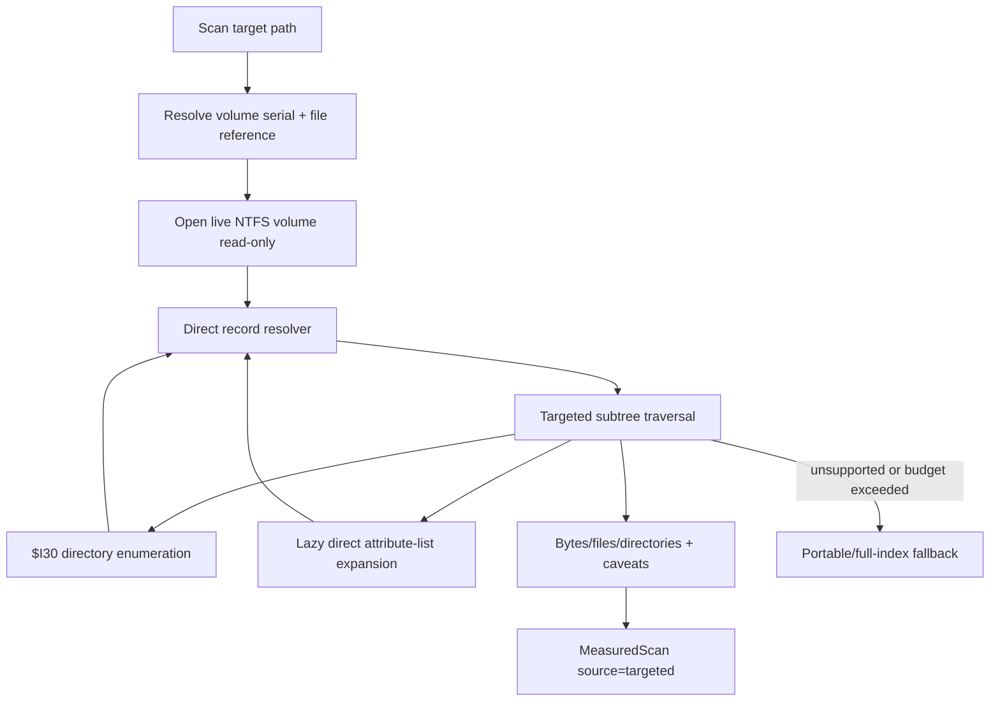
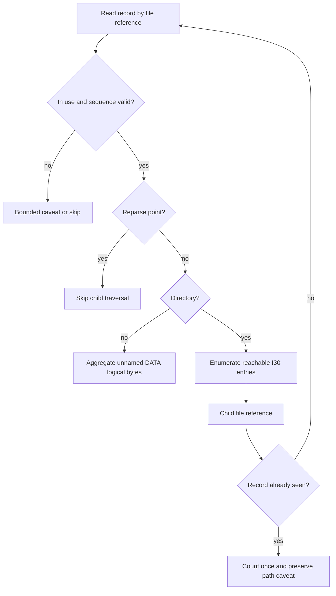

# NTFS Targeted Traversal - Plan

## Goal Capsule

| Field | Value |
|---|---|
| Objective | Replace ordinary live NTFS/MFT cleanup estimates with target-root-scoped traversal so small and medium targets do not require a full-volume `$MFT` read before Rebecca can answer. |
| Authority | The user's "best cleanup CLI" direction and fearless-refactor permission are authoritative. NTFS correctness, bounded fallback, license safety, and delete-time path validation outrank pre-release compatibility with the current full-index-first design. |
| Execution profile | Deep Rust refactor across `crates/rebecca-core` and `crates/rebecca-ntfs`, with deterministic parser/core tests, elevated live dogfood, docs, changelog, and coherent commits. |
| Stop conditions | Stop if raw NTFS metadata becomes deletion authority, GPL/LGPL/mixed-license code is copied, targeted traversal can loop without bounds, target volume identity is not revalidated, or the default path still performs a full-volume MFT build for ordinary target estimates. |
| Tail ownership | The plan is complete when targeted traversal is the default experimental backend path, obsolete full-index-first code is removed or demoted to explicit fallback, verification gates pass, and the changelog/doc surface names the new behavior. |

---

## Product Contract

### Summary

Rebecca's parser core now understands records, streams, data runs, direct attribute-list extension records, and tree-aware `$I30` directory indexes, but the live backend still normally builds a full-volume `MftIndex` before measuring a target.
Recent elevated dogfood shows raw full-volume `$MFT` reads dominate the budget even after parallel parsing improved record decoding.
This plan changes the architecture from full-index-first to targeted-first: resolve the requested filesystem object to a file reference, read only the MFT records needed for that subtree, enumerate directories through reachable `$I30` entries, and fall back with caveats when metadata is incomplete.

### Problem Frame

Full-volume MFT indexing is the right tool for whole-disk maps, forensic-style inventory, and explicit deep inspection, but it is the wrong default for ordinary cleanup targets like a project `target/` directory or an app cache folder.
The current backend pays the same raw read cost for a tiny target as for the entire volume, then falls back when the 20 second guard is exceeded.
A best-in-class cleanup CLI should instead treat NTFS metadata as an acceleration layer scoped to the user's selected target, while keeping normal filesystem deletion and safety checks as the final authority.

### Requirements

**Targeted traversal**

- R1. The live Windows NTFS/MFT backend must read the target root record by file reference without first constructing a full-volume `MftIndex`.
- R2. Directory measurement must recursively enumerate reachable children from `$INDEX_ROOT:$I30` and `$INDEX_ALLOCATION:$I30`, validating child references, sequence numbers, reparse points, and visited-state bounds.
- R3. File measurement must aggregate the unnamed `$DATA` stream logical size for v1 cleanup totals while preserving allocated and initialized size metadata internally for future disk-usage surfaces.
- R4. Hardlink and multi-name records must be counted once per physical record in a target traversal and must emit bounded caveats when canonical parent/sequence evidence is ambiguous.
- R5. Attribute-list extension records required by the targeted subtree must be resolved lazily through direct record lookup, with no recursive expansion of another `$ATTRIBUTE_LIST` and no unbounded loop.

**Fallback, safety, and diagnostics**

- R6. The full-volume live index must become an explicit fallback or deep-inspect path, not the ordinary first step for target estimates.
- R7. Targeted traversal must preserve current read-only volume handling, elevation error messages, cache/fallback behavior, cancellation, target volume identity validation, and delete-time filesystem path validation.
- R8. Traversal must stop under configurable record, depth, byte, elapsed-time, and cancellation budgets, returning caveats or fallback rather than hanging on corrupt metadata.
- R9. Machine output must keep stable estimate fields while adding or reusing backend-source and caveat labels that distinguish targeted traversal from full-index, sequential, FSCTL, and portable fallbacks.

**Validation and maintainability**

- R10. Deterministic fixtures and unit tests must cover direct record lookup, lazy attribute-list expansion, `$I30` recursion, hardlink/sequence caveats, cycle handling, reparse skipping, fallback, and source provenance.
- R11. Elevated dogfood must prove the targeted path against small local roots and must record timings that show whether full-volume reads were avoided.
- R12. Documentation, ADR/current-state notes, changelog entries, and stale comments must describe targeted-first behavior and the remaining explicit full-index use cases.

### Key Flows

- F1. Measure a small cleanup target on an NTFS volume
  - **Trigger:** A user runs `inspect space` or cleanup dry-run with `--scan-backend windows-ntfs-mft-experimental` on a local NTFS directory.
  - **Actors:** `ScanEngine`, `WindowsNtfsMftScanBackend`, targeted NTFS traversal, `rebecca-ntfs` parser.
  - **Steps:** The backend opens the volume read-only, validates target identity, reads the target MFT record directly, traverses only reachable descendant records through `$I30`, aggregates files and directories, and returns exact metadata estimate provenance.
  - **Outcome:** The estimate completes without a full-volume `$MFT` read when metadata is complete enough.
  - **Covered by:** R1, R2, R3, R7, R9.
- F2. Bound corrupt or incomplete metadata
  - **Trigger:** A directory references a stale child sequence, an invalid child VCN, a missing attribute-list extension, or a reparse point.
  - **Actors:** Targeted traversal, record reader, caveat sampler.
  - **Steps:** Traversal validates the edge, records a bounded caveat when the edge cannot be trusted, skips unsafe descendants, and either returns a conservative partial metadata estimate or falls back through the existing backend chain.
  - **Outcome:** Raw metadata never silently authorizes traversal or deletion.
  - **Covered by:** R4, R5, R7, R8.
- F3. Use full-volume MFT indexing intentionally
  - **Trigger:** A future disk-map/deep-inspect mode or explicit diagnostic path asks for whole-volume inventory.
  - **Actors:** Full-index builder, sequential source, FSCTL source, parser.
  - **Steps:** The full-index code path remains available behind an explicit call site or fallback, emits source/timing caveats, and stays isolated from targeted default measurement.
  - **Outcome:** Rebecca keeps the whole-volume capability without making every cleanup estimate pay for it.
  - **Covered by:** R6, R9, R12.

### Acceptance Examples

- AE1. Given a target directory with ten files and no subdirectories, when the experimental backend measures it, then it reads the target record and direct child records without invoking the sequential full-volume `$MFT` source.
- AE2. Given a large directory whose root index points to multiple allocation child VCNs, when targeted traversal runs, then it follows only reachable `$I30` nodes and reads child file records by file reference.
- AE3. Given an attribute-list-backed file whose unnamed `$DATA` stream lives in a direct extension record, when traversal reaches it, then lazy expansion merges the needed stream before size aggregation.
- AE4. Given an attribute-list entry that references another attribute list or a mismatched base record, when traversal reaches it, then traversal records a caveat and does not recurse indefinitely.
- AE5. Given a hardlinked file reachable through two names under the same target subtree, when traversal aggregates the target, then the physical record contributes bytes once and preserves path-candidate caveats.
- AE6. Given a reparse point under the target subtree, when traversal reaches it, then it skips traversal below that record and emits the same safety posture as the current backend.
- AE7. Given targeted traversal exceeds its record/depth/time budget, when measuring the target, then Rebecca falls back or returns a bounded caveated estimate rather than blocking the command.
- AE8. Given elevated dogfood runs against `docs/plans` or another small NTFS root, when timings are emitted, then the report distinguishes targeted traversal timings from full-index read timings.

### Scope Boundaries

**In scope**

- Break `WindowsNtfsMftIndexCache`, `CachedNtfsVolumeIndex`, and related live backend structures as needed to remove full-index-first behavior.
- Add a direct live record reader around `FSCTL_GET_NTFS_FILE_RECORD` and parser-owned targeted traversal APIs.
- Reuse and refactor existing `NtfsRecordSet`, `NtfsStreamReader`, `NtfsDirectoryIndex`, `MftIndex`, and caveat types instead of keeping parallel compatibility layers.
- Demote full-volume index building to explicit fallback or diagnostic code with clear source labels.
- Update tests, dogfood script/reporting, changelog, docs, and ADR/current-state notes.

**Deferred to follow-up work**

- A full WizTree-style disk map UI or whole-volume ranking command.
- USN-backed incremental targeted cache invalidation beyond preserving the existing cache model.
- Raw image mounting, `$MFTMirr` fallback, deleted-entry recovery, index slack recovery, or forensic export.
- User-facing allocated/reclaim-byte totals beyond preserving metadata internally.
- Adopting an external Rust NTFS crate as a production dependency.

**Outside this product's identity**

- Writing to NTFS metadata or using MFT metadata as delete permission.
- Copying implementation code, fixtures, generated tables, or tests from GPL/LGPL/mixed-license reference projects.
- Counting unreferenced INDX blocks, deleted entries, or stale parent-reference scans as cleanup candidates.

---

## Planning Contract

### Key Technical Decisions

- KTD1. Targeted traversal becomes the default experimental path.
  The live backend should try direct target traversal before full-index construction because the user asks about cleanup targets, not whole-volume inventory.
  Full-index remains valuable, but only when the request is whole-volume-shaped or targeted traversal cannot answer safely.
- KTD2. `rebecca-core` owns live I/O and `rebecca-ntfs` owns NTFS semantics.
  Windows handles, privilege errors, cancellation, source labels, and fallback stay in `crates/rebecca-core/src/scan/windows_ntfs_mft.rs`.
  Record expansion, stream merging, directory traversal rules, hardlink counting, and caveat policy should live behind parser-owned DTOs and helpers.
- KTD3. Add a direct-record source boundary instead of exposing a full `MftIndex`.
  Mature implementations such as DiscUtils and SleuthKit separate file-record lookup from filesystem traversal.
  Rebecca should introduce a small record resolver that can fetch `NtfsFileReference` on demand, memoize parsed records, and expand direct attribute-list extensions without scanning the volume.
- KTD4. Traverse directory indexes as the primary child source.
  `$FILE_NAME` parent scans require a full-volume index, so targeted traversal should prefer `$I30` directory enumeration.
  Parent-reference scans become fallback validation for explicit full-index mode, not the targeted default.
- KTD5. Keep budgets as correctness controls, not just performance controls.
  Max records, max depth, max caveats, max elapsed time, and cancellation checks prevent malformed metadata from turning a cleanup estimate into an unbounded filesystem walk.
- KTD6. Do not adopt an external Rust crate in this plan.
  `repo-ref/ntfs` is permissive and mature but still assumes no `$MFT` attribute list in one bootstrap path.
  `repo-ref/mft` is strong for snapshot parsing and oracle fixtures but is not a live targeted traversal replacement.
  The current first-party parser is now close enough that a focused refactor is lower risk than a dependency migration.
- KTD7. License boundaries are design-only for incompatible references.
  `go-ntfs` and DiscUtils are useful permissive references for object boundaries and lookup patterns.
  SleuthKit, ntfs-3g, and libfsntfs inform behavior and edge-case taxonomy only; their code and fixtures must not be copied.

### High-Level Technical Design

### System-Wide Impact

| Area | Impact |
|---|---|
| `crates/rebecca-core/src/scan/windows_ntfs_mft.rs` | Splits live volume I/O from full-index cache, adds direct record resolver, changes default measurement path, and demotes full-index construction. |
| `crates/rebecca-ntfs/src/record_set.rs` | Needs a lazy record-set or resolver-assisted expansion path instead of assuming all records are already in memory. |
| `crates/rebecca-ntfs/src/index.rs` | Keeps full-index aggregation for explicit inventory/fallback but should not be required by targeted measurement. |
| `crates/rebecca-ntfs/src/adapter.rs` | May gain targeted traversal DTOs for resolved records, child edges, traversal summaries, and caveat provenance. |
| `scripts/ntfs/run-live-mft-dogfood.ps1` | Must capture targeted timing/source labels and make full-index avoidance visible. |
| Docs and changelog | Must distinguish targeted-first estimates from explicit full-index behavior and remaining known gaps. |

### Sources And Research

- `crates/rebecca-core/src/scan/windows_ntfs_mft.rs` currently calls `WindowsNtfsMftIndexCache::load_or_build`, then `MftIndex::aggregate_subtree`, so every successful target estimate depends on a full-volume index.
- `crates/rebecca-core/src/scan/windows_ntfs_mft.rs` already has `LiveNtfsVolume::read_file_record`, which can become the direct targeted record lookup primitive.
- `crates/rebecca-ntfs/src/record_set.rs` already resolves direct attribute-list extension records and expands `$INDEX_ALLOCATION:$I30`, but it assumes all extension records are present in a `Vec<NtfsParsedRecord>`.
- `crates/rebecca-ntfs/src/stream.rs` and `crates/rebecca-ntfs/src/runlist.rs` already provide the stream and runlist primitives needed to read index allocation ranges without a new dependency.
- `docs/adr/0009-ntfs-parser-dependency-strategy.md` accepts the owned parser path and keeps external crates behind a dependency gate.
- `repo-ref/ntfs/src/ntfs.rs`, `repo-ref/ntfs/src/file.rs`, and `repo-ref/ntfs/src/index.rs` are permissive references for low-level record and index abstractions; note its `$MFT` bootstrap assumption before using it as a dependency.
- `repo-ref/mft/src/mft.rs` and `repo-ref/mft/crates/ntfs/src/ntfs/volume.rs` are permissive references for snapshot parsing, read-at volume abstractions, and test oracles.
- `repo-ref/go-ntfs`, `repo-ref/DiscUtils`, `repo-ref/sleuthkit`, `repo-ref/ntfs-3g`, and `repo-ref/libfsntfs` are reference projects for pagination, object boundaries, attribute-list handling, directory index behavior, and corruption limits; GPL/LGPL/mixed-license projects are behavior references only.

### Risks And Mitigations

| Risk | Impact | Mitigation |
|---|---|---|
| `$I30` directory evidence is incomplete on a live volume. | Targeted traversal can miss children. | Caveat and fallback instead of silently returning exact success; keep full-index/portable fallback available. |
| Lazy attribute-list expansion follows a loop. | Command can hang or duplicate streams. | Resolve only direct non-attribute-list extension entries, track visited records and attribute keys, and cap attempts. |
| Hardlink handling double-counts a physical file. | Cleanup estimate overstates reclaim bytes. | Track visited record IDs per target traversal and attach path-candidate caveats. |
| Direct FSCTL record lookup is slower than expected for large subtrees. | Large target estimates may regress. | Use bounded memoization and fallback thresholds; full-index remains explicit for large whole-volume-shaped requests. |
| Refactor leaves two competing code paths with stale compatibility glue. | Maintenance burden grows. | Delete obsolete full-index-first wrappers once targeted path has tests; keep only explicit fallback/diagnostic entry points. |
| Dogfood timings are machine-specific. | CI becomes flaky if asserted. | Keep live dogfood opt-in, store reports under `target/`, and assert deterministic behavior only in synthetic tests. |

---

## Implementation Units

### U1. Split live NTFS record lookup from full-index cache

- **Goal:** Introduce a direct live MFT record resolver that can parse one file record by record ID and sequence without constructing `CachedNtfsVolumeIndex`.
- **Requirements:** R1, R6, R7, R9, R10.
- **Dependencies:** None.
- **Files:** `crates/rebecca-core/src/scan/windows_ntfs_mft.rs`, `crates/rebecca-core/src/scan.rs`, `crates/rebecca-core/tests` if a new integration test module is warranted.
- **Approach:** Extract `LiveNtfsVolume`, `NtfsRecordGeometry`, and `LiveNtfsIndexStreamSource` into a resolver-style boundary inside `windows_ntfs_mft.rs`.
  Reuse `LiveNtfsVolume::read_file_record` for direct reads, parse records with `NtfsParsedRecord::parse`, memoize by low record ID, validate target volume serial and optional sequence where known, and keep current permission/fallback error wording.
  Leave the old full-index builder callable only behind a named fallback function.
- **Execution note:** Add focused tests around resolver behavior using a fake record source before changing `measure_path_with_progress`.
- **Patterns to follow:** Existing `read_file_record`, `NtfsMftBuildMonitor`, `MftParseErrorCaveats`, and `MeasuredScan::with_backend_source` patterns in `crates/rebecca-core/src/scan/windows_ntfs_mft.rs`.
- **Test scenarios:** Direct lookup returns the requested parsed record; output record ID returned by FSCTL is normalized with `FILE_REFERENCE_LOW_MASK`; parse errors become bounded caveats; target volume identity mismatch fails before traversal; resolver caches repeated child reads.
- **Verification:** Targeted unit tests prove direct lookup without calling the full-index build helper.

### U2. Add resolver-assisted record expansion in `rebecca-ntfs`

- **Goal:** Let parser semantics expand only the records needed for a target subtree, including direct attribute-list extension records.
- **Requirements:** R2, R3, R5, R8, R10.
- **Dependencies:** U1 for the live resolver shape, though pure parser tests can start first.
- **Files:** `crates/rebecca-ntfs/src/record_set.rs`, `crates/rebecca-ntfs/src/adapter.rs`, `crates/rebecca-ntfs/src/lib.rs`, `crates/rebecca-ntfs/tests/mft_parser.rs`.
- **Approach:** Add a small trait or callback that resolves `NtfsFileReference` to `NtfsParsedRecord`.
  Refactor `resolve_attribute_lists` so eager `Vec`-based resolution and targeted lazy resolution share the same direct-extension merge policy.
  For targeted expansion, resolve only non-`$ATTRIBUTE_LIST` direct extension entries that match base reference, attribute type, name, attribute ID, and lowest VCN.
  Preserve caveats for missing, mismatched, unsupported, and recursive attribute-list entries.
- **Execution note:** Start with tests for a base record whose `$DATA` or `$INDEX_ALLOCATION` stream lives in an extension record not present in the initial record vector.
- **Patterns to follow:** `NtfsRecordSet::resolve_attribute_lists`, `merge_attribute_stream`, `find_extension_record`, and `docs/adr/0009-ntfs-parser-dependency-strategy.md`.
- **Test scenarios:** Lazy expansion merges direct unnamed `$DATA`; lazy expansion merges direct `$INDEX_ALLOCATION:$I30`; extension base mismatch caveats; missing extension caveats; an extension attribute-list entry is skipped without recursive expansion; repeated extension references are read once.
- **Verification:** `crates/rebecca-ntfs/tests/mft_parser.rs` covers eager and lazy expansion with identical stream results for direct extension cases.

### U3. Implement targeted subtree traversal

- **Goal:** Aggregate bytes/files/directories from a target root by reading only reachable records and directory index children.
- **Requirements:** R1, R2, R3, R4, R5, R8, R10.
- **Dependencies:** U1, U2.
- **Files:** `crates/rebecca-ntfs/src/adapter.rs`, `crates/rebecca-ntfs/src/record_set.rs`, `crates/rebecca-ntfs/src/index.rs`, `crates/rebecca-ntfs/tests/mft_parser.rs`, `crates/rebecca-core/src/scan/windows_ntfs_mft.rs`.
- **Approach:** Introduce a targeted traversal summary that mirrors `SubtreeSummary` but is resolver-driven.
  Traverse depth-first or breadth-first from the target record, skip reparse points, enumerate reachable `$I30` entries from the parsed directory indexes, resolve child records directly, validate child sequence and parent evidence, and count each physical record once.
  Keep `MftIndex::aggregate_subtree` for full-index mode but stop requiring it for live target measurement.
- **Execution note:** Characterize current `MftIndex::aggregate_subtree` behavior with synthetic records before replacing the live backend path.
- **Patterns to follow:** `MftIndex::aggregate_subtree`, `cross_check_directory_entries`, `parent_sequence_mismatches`, and existing `$I30` traversal in `NtfsRecordSet`.
- **Test scenarios:** Single-file target counts one file; directory root counts itself and children; nested directory traversal follows child indexes; hardlinked duplicate record counts once; parent sequence mismatch caveats and skips the edge; reparse point skips descendants; cycle in directory records stops with caveat.
- **Verification:** Parser/core tests prove targeted summary matches full-index summary on complete synthetic fixtures and is more conservative on incomplete metadata.

### U4. Make targeted traversal the default experimental backend path

- **Goal:** Change `WindowsNtfsMftScanBackend` so ordinary target estimates use targeted traversal first and full-index construction only as explicit fallback.
- **Requirements:** R1, R6, R7, R8, R9, R11.
- **Dependencies:** U1, U2, U3.
- **Files:** `crates/rebecca-core/src/scan/windows_ntfs_mft.rs`, `crates/rebecca-core/src/scan.rs`, `crates/rebecca-core/src/scan_cache.rs`, `crates/rebecca-core/benches/perf_matrix.rs`, `crates/rebecca/tests` if CLI source assertions live there.
- **Approach:** Replace `cache.load_or_build(...).mft_index.aggregate_subtree(...)` in `measure_path_with_progress` with the targeted resolver/traversal path.
  Add source labels such as `windows-ntfs-mft-experimental-targeted-fsctl` and keep old labels for full-index fallback.
  Ensure fallback reasons distinguish unsupported targeted metadata, timeout/budget exhaustion, and privilege/volume errors.
  Remove or privatize `WindowsNtfsMftIndexCache` if no longer needed for ordinary scans.
- **Execution note:** Add a failing backend-selection test that proves a small target does not call the full-index builder.
- **Patterns to follow:** Existing fallback behavior in scan backend selection, `estimate_backend_source` propagation, and scan-cache source provenance tests.
- **Test scenarios:** Targeted success returns exact metadata source label; unsupported live volume falls back to portable scanner; targeted budget exhaustion falls back with stable fallback reason; repeated targets reuse resolver/cache state without shared mutex full-index builds; scan cache preserves targeted backend source.
- **Verification:** Core tests and targeted CLI/JSON tests prove source labels, fallback reasons, and stable v1 fields.

### U5. Bound traversal budgets, caveats, and timings

- **Goal:** Make targeted traversal observable and safe under corrupt metadata or unexpectedly large subtrees.
- **Requirements:** R8, R9, R11.
- **Dependencies:** U3, U4.
- **Files:** `crates/rebecca-core/src/scan/windows_ntfs_mft.rs`, `crates/rebecca-ntfs/src/record_set.rs`, `crates/rebecca-ntfs/src/index.rs`, `docs/configuration.md`.
- **Approach:** Add targeted-stage timings for open-volume, read-volume-data, target-record-read, attribute-list-extension-read, directory-index-read, child-record-read, and traversal aggregation.
  Reuse the existing timing caveat env var where possible and add targeted budget env vars only if hardcoded defaults are not enough.
  Keep caveat samples bounded by code and record ID.
- **Execution note:** Prefer deterministic budget tests over timing-sensitive assertions.
- **Patterns to follow:** `NtfsMftBuildMonitor`, `with_bounded_mft_caveats`, `MAX_MFT_ESTIMATE_CAVEAT_SAMPLES_PER_CODE`, and existing timeout tests.
- **Test scenarios:** Max-record budget stops traversal; max-depth budget stops traversal; cancellation during child record read returns cancellation; repeated caveats are summarized; timing caveat includes targeted stages when enabled.
- **Verification:** Unit tests cover each budget without sleeping, and live dogfood can display targeted timings.

### U6. Update dogfood and performance evidence

- **Goal:** Make it easy to prove the new default avoids full-volume reads on local NTFS roots and to detect fallback.
- **Requirements:** R9, R11, R12.
- **Dependencies:** U4, U5.
- **Files:** `scripts/ntfs/run-live-mft-dogfood.ps1`, `docs/performance/perf-matrix.md`, `docs/release.md`, `target/ntfs-dogfood/` runtime output only.
- **Approach:** Extend the existing dogfood script to capture targeted source labels, targeted timing caveats, fallback reasons, and whether full-index stages appeared.
  Keep the script dry-run or inspect-only, isolate config/state/history/cache paths, and write machine-local reports under `target/`.
  Add a small documented recipe for elevated local validation.
- **Execution note:** This unit is smoke-first; deterministic tests should cover script argument handling only if the repo already has script tests.
- **Patterns to follow:** Existing `scripts/ntfs/run-live-mft-dogfood.ps1` report format and `docs/release.md` dogfood guidance.
- **Test scenarios:** Script supports a small target root; JSON report records backend source and fallback reason; report flags full-index stages when they happen; dry-run/inspect mode does not write cleanup history.
- **Verification:** Run the dogfood script on a small NTFS root from the current elevated shell and record the observed command in the final work summary.

### U7. Remove obsolete compatibility code and refresh docs

- **Goal:** Leave the codebase in the new architecture instead of keeping full-index-first compatibility paths and stale documentation.
- **Requirements:** R6, R9, R12.
- **Dependencies:** U4, U5, U6.
- **Files:** `CHANGELOG.md`, `docs/adr/0009-ntfs-parser-dependency-strategy.md`, `docs/configuration.md`, `docs/performance/perf-matrix.md`, `docs/knowledge/engineering/index.md`, `docs/knowledge/engineering/verification/index.md`, relevant Rust modules touched by U1-U6.
- **Approach:** Delete compatibility wrappers that only exist to preserve the old full-index-first flow.
  Update Unreleased changelog under Added/Changed/Fixed as appropriate.
  Refresh ADR/current-state docs so future agents understand why targeted traversal owns ordinary cleanup estimates and full-index mode is explicit.
- **Execution note:** Run a dead-code and docs pass after the implementation compiles rather than trying to preserve old names during the refactor.
- **Patterns to follow:** Existing changelog style, `docs/adr/0009-ntfs-parser-dependency-strategy.md`, and recent NTFS plan docs.
- **Test scenarios:** No behavior-bearing tests are expected beyond the verification commands; docs/changelog should mention targeted-first behavior, fallback, dogfood, and license boundaries.
- **Verification:** `cargo clippy --workspace --all-targets --all-features -- -D warnings` catches stale code, and `git diff --check` catches markdown whitespace issues.

---

## Verification Contract

| Gate | Applies to | Done signal |
|---|---|---|
| `cargo fmt --all --check` | All Rust edits | Formatting matches workspace style. |
| `cargo check --workspace` | All implementation units | Workspace compiles after old compatibility code is removed. |
| `cargo nextest run --workspace` | U1-U7 | All deterministic tests pass. |
| `cargo clippy --workspace --all-targets --all-features -- -D warnings` | U1-U7 | No stale code, warnings, or lint regressions remain. |
| `cargo bench -p rebecca-ntfs --bench mft_parser -- --test` | Parser/traversal changes | Parser benchmark harness still builds and runs in test mode. |
| Targeted NTFS test filter | U1-U5 | Focused NTFS/MFT parser and core tests prove direct lookup, lazy expansion, traversal, caveats, and budgets. |
| `pwsh -File scripts/ntfs/run-live-mft-dogfood.ps1 -Root docs/plans -Mode inspect-space -Top 3 -TimeoutSeconds 60` | U4-U6 on elevated Windows | Report shows targeted source or explicit fallback; no cleanup deletion or history write occurs. |
| `git diff --check` | U7 | No whitespace errors. |

---

## Definition of Done

| Scope | Completion criteria |
|---|---|
| U1 | Direct record lookup works through a tested resolver boundary and ordinary target measurement no longer needs to call full-index build to obtain the root record. |
| U2 | Lazy attribute-list expansion resolves direct extension records on demand, rejects recursion, and shares behavior with eager expansion where both apply. |
| U3 | Targeted traversal aggregates files/directories from reachable `$I30` child references, validates sequence and reparse boundaries, and counts hardlinks once. |
| U4 | `windows-ntfs-mft-experimental` uses targeted traversal by default, with full-index limited to explicit fallback/diagnostic paths and distinct source/fallback labels. |
| U5 | Traversal budgets, cancellation, caveat bounding, and timing diagnostics are covered by deterministic tests. |
| U6 | Live dogfood evidence can be collected on the current NTFS workstation and distinguishes targeted traversal from full-volume index reads. |
| U7 | Changelog, docs, ADR/current-state notes, and stale comments reflect the new architecture; obsolete full-index-first compatibility code is removed. |
| Global | All Verification Contract gates pass or are documented as not applicable; no abandoned experimental code remains; no progress/status is written into this plan file; commits are coherent and conventional. |
