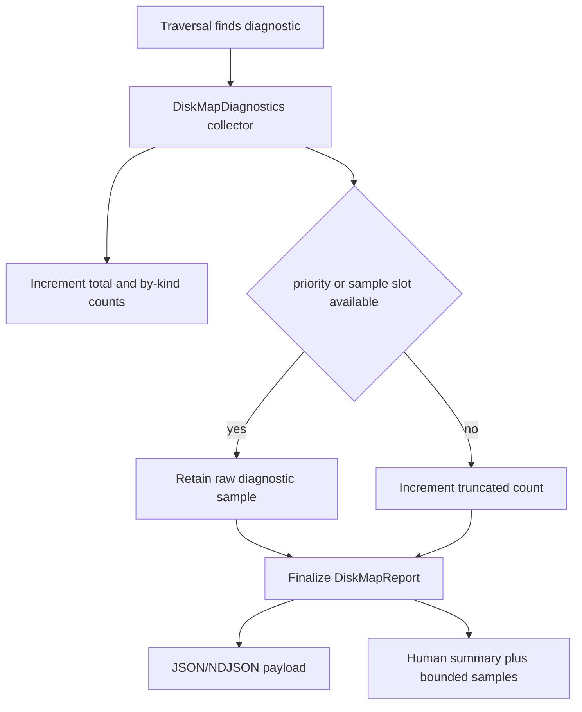

# Disk Map Diagnostic Bounds - Plan

## Goal Capsule

| Field | Value |
|---|---|
| Objective | Make `inspect map` diagnostics bounded, summarized, and configurable so large unstable trees cannot flood memory, JSON, NDJSON, or human output. |
| User value | Users still see why a disk map is partial, but the command remains usable on noisy cache trees with thousands of unreadable or racing entries. |
| Safety stance | Report-only and conservative. Bounded raw diagnostics never hide uncertainty because grouped counts and truncation totals remain explicit. |
| Primary surfaces | `crates/rebecca-core/src/disk_map.rs`, `crates/rebecca/src/inspect.rs`, `crates/rebecca/src/render/inspect.rs`, `crates/rebecca/tests/cli_inspect.rs`, `crates/rebecca-core/tests/disk_map.rs`, `docs/api/cli/v1/`, `README.md`, `CHANGELOG.md`. |
| Stop conditions | Stop if diagnostics can grow without bound, if truncation is silent, if root/fallback diagnostics lose visibility, or if cleanup authorization behavior changes. |

---

## Product Contract

### Summary

The previous slice made portable `inspect map` resilient by converting child-level failures into diagnostics.
That is correct but still not production-grade for a cleanup CLI: a single protected or mutating subtree can now generate a diagnostic per failed entry.
This plan introduces a bounded diagnostic collector with explicit summaries, preserving forensic usefulness while keeping output size predictable.

### Requirements

**Bounded detail**

- R1. `inspect map` must bound raw diagnostic detail by request, with a stable default suitable for human and machine output.
- R2. `--diagnostic-limit 0` must suppress raw diagnostic samples while preserving summary counts.
- R3. Truncation must be explicit in the report; users must be able to tell that more diagnostics occurred than were included.

**Summary fidelity**

- R4. The report must include total diagnostic count, truncated count, and grouped counts by `DiskMapDiagnosticKind`.
- R5. Root-level missing/unreadable diagnostics and backend fallback diagnostics must remain visible whenever possible, even when child diagnostics exceed the raw limit.
- R6. Summary counts must count all diagnostics, including diagnostics not retained in the bounded raw list.

**Interface behavior**

- R7. Human output must print a concise diagnostic summary before raw samples and must not emit an unbounded line per diagnostic.
- R8. JSON and NDJSON output must include the new summary fields in the `inspect-map` payload.
- R9. Existing diagnostic kinds and conservative zero-byte semantics from the partial-diagnostics slice must remain unchanged.

### Acceptance Examples

- AE1. Given 1,000 child metadata failures and the default diagnostic limit, when `inspect map --format json` runs, then `diagnostic_summary.total` is 1,000, `diagnostic_summary.truncated` is greater than zero, and `diagnostics.len()` is at most the default limit.
- AE2. Given the same tree and `--diagnostic-limit 0`, when JSON output is rendered, then `diagnostics` is empty and `diagnostic_summary.by_kind` still reports all 1,000 failures.
- AE3. Given a fallback diagnostic plus many child failures, when the raw limit is small, then the fallback diagnostic remains in the retained diagnostics unless the user sets the limit to zero.
- AE4. Given human output with many failures, when the command completes, then the output shows grouped counts and only bounded sample lines.

---

## Planning Contract

### Key Technical Decisions

- KTD1. Add a `DiskMapDiagnostics` collector instead of pushing directly into `Vec<DiskMapDiagnostic>`.
  The collector owns counting, priority retention, deterministic ordering, and final projection into report fields.
- KTD2. Add `diagnostic_summary` to `DiskMapReport` rather than overloading `diagnostics`.
  The raw list remains a sample; the summary becomes the authoritative completeness signal.
- KTD3. Treat root/fallback diagnostics as priority diagnostics.
  Losing fallback/root visibility is worse than losing one of many child samples because it changes how users interpret the whole root.
- KTD4. Put the limit on `DiskMapRequest` and expose it as `inspect map --diagnostic-limit`.
  The core API and CLI stay aligned, tests can exercise both layers, and dashboards can choose summary-only output.
- KTD5. Keep diagnostic detail deterministic.
  Sorting/grouping must be stable so JSON snapshots, CI tests, and repeated local runs do not churn.

### High-Level Technical Design

The implementation should keep traversal logic focused on events, not presentation.
`DiskMapDiagnostics` can expose `push`, `push_priority`, and `finish` methods so root/fallback handling stays readable.

### System-Wide Impact

| Area | Impact |
|---|---|
| `crates/rebecca-core/src/disk_map.rs` | Add `DiskMapDiagnosticSummary`, grouped counts, request limit, collector, and bounded report finalization. |
| `crates/rebecca/src/inspect.rs` | Wire `--diagnostic-limit` from CLI args into `DiskMapRequest`. |
| `crates/rebecca/src/render/inspect.rs` | Render summary-first disk-map diagnostics and bounded sample rows. |
| `docs/api/cli/v1/` | Update schema and success example for `inspect-map` summary fields. |
| Tests | Add core collector tests and CLI JSON/human regressions for bounded diagnostics and summary-only output. |

### Scope Boundaries

- This plan does not change cleanup execution, cleanup planning, or deletion authorization.
- This plan does not add paging or external diagnostic log files.
- This plan does not change `inspect space`, `inspect lint`, or project-artifact diagnostics unless a shared helper is clearly reusable without broad churn.

### Risks And Mitigations

| Risk | Impact | Mitigation |
|---|---|---|
| API break surprises wrappers. | Existing JSON consumers may not expect `diagnostic_summary`. | This project currently accepts breaking cleanup of unstable API surfaces; document the new field in API v1 docs and changelog. |
| Priority retention complicates deterministic ordering. | Tests may become flaky. | Define final ordering as priority class, kind, path, detail, then sequence only as a last tie-breaker. |
| Summary-only mode hides examples users need. | Human debugging gets harder. | Default keeps samples; only `--diagnostic-limit 0` opts into summary-only. |
| Collector is over-generalized too early. | More abstraction than needed. | Keep it disk-map local unless another diagnostic surface adopts the exact same semantics. |

---

## Implementation Units

### U1. Core bounded diagnostics model

- **Goal:** Replace direct `Vec<DiskMapDiagnostic>` accumulation with a bounded collector that produces raw samples plus summary counts.
- **Requirements:** R1, R3, R4, R5, R6, R9
- **Files:** `crates/rebecca-core/src/disk_map.rs`
- **Approach:** Add `DiskMapDiagnosticSummary`, `DiskMapDiagnosticKindSummary`, and a crate-private `DiskMapDiagnostics` collector. Add `diagnostic_limit` to `DiskMapRequest` with a default constant. Route traversal, fallback, backend-root extension, and root-skip paths through the collector.
- **Test Scenarios:** Core tests prove raw diagnostics are capped, summary counts all skipped diagnostics, fallback/root diagnostics are retained before child samples, and zero limit produces no raw samples.
- **Verification:** `cargo nextest run -p rebecca-core disk_map::tests`; `cargo nextest run -p rebecca-core --test disk_map`

### U2. CLI request wiring and output contract

- **Goal:** Expose bounded diagnostics through `inspect map --diagnostic-limit` and keep JSON/NDJSON contracts explicit.
- **Requirements:** R2, R7, R8
- **Files:** `crates/rebecca/src/inspect.rs`, `crates/rebecca/src/render/inspect.rs`, `crates/rebecca/tests/cli_inspect.rs`
- **Approach:** Add a non-negative `--diagnostic-limit` option to the `inspect map` command. Render human diagnostics as a summary line plus bounded samples. Add CLI tests for JSON default bounding, `--diagnostic-limit 0`, and human summary wording.
- **Test Scenarios:** CLI JSON includes `diagnostic_summary`; zero limit returns an empty `diagnostics` array; human output does not print more sample rows than the configured limit.
- **Verification:** `cargo nextest run -p rebecca --test cli_inspect --test cli_api`

### U3. API docs, examples, and changelog

- **Goal:** Document the breaking-but-cleaner diagnostic payload shape.
- **Requirements:** R3, R4, R8
- **Files:** `docs/api/cli/v1/README.md`, `docs/api/cli/v1/payloads.schema.json`, `docs/api/cli/v1/examples/success-inspect-map.json`, `README.md`, `CHANGELOG.md`, `docs/performance/perf-matrix.md`, `docs/knowledge/engineering/current-state.md`, `docs/knowledge/engineering/log.md`
- **Approach:** Update the inspect-map schema/example with `diagnostic_summary`. Note `--diagnostic-limit` and the summary/sample distinction in user docs and Unreleased changelog.
- **Test Scenarios:** Existing CLI API schema/example tests pass without fixture drift.
- **Verification:** `cargo nextest run -p rebecca --test cli_api`

### U4. Verification and commit

- **Goal:** Land the refactor as one coherent disk-map hardening commit.
- **Requirements:** R1-R9
- **Files:** All files touched by U1-U3.
- **Approach:** Run focused tests first, then full workspace quality gates. Remove any abandoned helper shapes from failed approaches before committing.
- **Test Scenarios:** Full verification proves no workspace-level regression.
- **Verification:** Full Verification Contract below.

---

## Verification Contract

| Gate | Command | Proves |
|---|---|---|
| Formatting | `cargo fmt --all --check` | Rust formatting is stable. |
| Compile | `cargo check --workspace` | Workspace compiles after API changes. |
| Core focused tests | `cargo nextest run -p rebecca-core disk_map::tests` | Collector and traversal diagnostics behave deterministically. |
| Core integration tests | `cargo nextest run -p rebecca-core --test disk_map` | Public core disk-map behavior remains stable. |
| CLI/API tests | `cargo nextest run -p rebecca --test cli_inspect --test cli_api` | Human, JSON, NDJSON, schema, and examples match the new contract. |
| Full tests | `cargo nextest run --workspace` | No cross-crate regressions. |
| Lints | `cargo clippy --workspace --all-targets --all-features -- -D warnings` | No new lint debt. |
| Bench compile | `cargo check -p rebecca-core --benches` | Perf-matrix benchmark still compiles. |
| NTFS dogfood script | `pwsh -File scripts/ntfs/run-live-mft-dogfood.ps1 -SelfTest` | Existing NTFS dogfood harness still runs. |
| Whitespace | `git diff --check` | No whitespace errors. |

---

## Definition of Done

| ID | Done Condition |
|---|---|
| DoD1 | Disk-map diagnostics cannot grow raw output beyond the configured limit. |
| DoD2 | Diagnostic summary counts remain complete even when raw diagnostics are truncated. |
| DoD3 | Root/fallback diagnostics keep priority visibility unless the user requests zero raw diagnostics. |
| DoD4 | Human, JSON, NDJSON, schema, examples, README, performance docs, changelog, and engineering memory describe the new summary/sample contract. |
| DoD5 | Focused and full verification gates pass. |
| DoD6 | The final diff contains no abandoned experimental code from rejected designs and is committed with a Conventional Commit message. |
