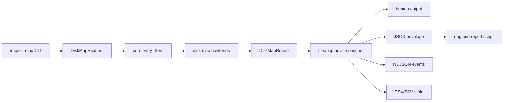

# Disk Map Cleanup Advice - Plan

## Goal Capsule

Objective: turn `inspect map` from a size map into a cleanup decision surface. The command should keep its fast disk inventory behavior, then enrich ranked entries with read-only cleanup advice grounded in the existing rule catalog, protection policy, project artifact policy, and planner safety semantics.

Authority: this plan is authorized by the user's fearless refactor direction. Backward compatibility is secondary to the cleaner architecture, but deletion safety is not negotiable.

Execution profile: Deep. Break internal APIs where useful, delete obsolete compatibility code, and keep work split into reviewable commits.

Stop conditions:

- Stop if advice can delete files, write cleanup history, or bypass the cleanup planner.
- Stop if a protected or unknown path is labelled as directly cleanable.
- Stop if output contracts change without matching CLI schema, docs, and tests.
- Stop if live dogfood artifacts expose more local path data than the user explicitly asked to collect.

## Product Contract

Rebecca should answer three questions in one command:

1. What is taking space?
2. Which large entries are actually cleanable?
3. Which safe command or policy explains that recommendation?

Requirements:

- R1. Cleanup advice is report-only. Actual deletion still goes through `clean` planning and protection policy checks.
- R2. Every advised entry has a machine-readable status: `cleanable`, `maybe-cleanable`, `contains-cleanable`, `protected`, or `unknown`.
- R3. Advice must be grounded in existing cleanup rules, project artifact policy, app leftover policy, or protection policy. Do not infer cleanability from arbitrary substrings.
- R4. JSON, NDJSON, CSV, TSV, and human output expose the same advice facts for ranked entries.
- R5. `inspect map` supports entry filters useful for large-report workflows: minimum logical bytes, entry kind, path substring, and advice status.
- R6. Advice filters affect ranked entries only; root totals and diagnostic summaries continue to describe the scan.
- R7. The table output appends advice columns instead of creating a separate table mode.
- R8. A dogfood report script compares portable/native/MFT backends, emits JSON/CSV/Markdown summaries, and uses one JSON scan per run as the timing authority.
- R9. README, CLI API docs, changelog, and engineering state documents describe the new behavior and its safety boundary.

Out of scope:

- No `clean --from-map` command in this plan.
- No automatic deletion from advice.
- No GUI/TUI work.
- No new unsafe cleanup rules unless required for tests.
- No committing generated dogfood reports.

## Planning Contract

KTD-1: Add a core cleanup advice model instead of CLI-only rendering glue.

`DiskMapEntry` should own optional advice so JSON, NDJSON, table, and future callers share one truth. The model belongs in `rebecca-core`, with CLI only responsible for enabling advice and rendering it.

KTD-2: Advice is an enrichment stage after disk traversal.

Disk backends should stay focused on discovery and measurement. Advice should annotate ranked entries after `inspect_map` produces metrics, so portable, Windows native, and MFT paths do not fork behavior.

KTD-3: Reuse planner semantics.

Rule targets must be expanded with the existing discovery path, and protection must use `ProtectionPolicy`. Safety levels and warning gates are advice facts, not deletion permission.

KTD-4: Distinguish direct deletion from contained cleanability.

If a directory contains a cleanable target but is not itself safe to remove, use `contains-cleanable`. This prevents paths such as application data roots and project roots from being presented as direct cleanup targets.

KTD-5: Entry filters should run as early as their data allows.

Kind, minimum logical bytes, and path substring filters should be core request filters before top-entry ranking. Advice status filtering runs after advice enrichment and only trims ranked entries.

KTD-6: Dogfood timing must not double-scan for formatting.

The report script should run `inspect map --format json` once per backend/repetition, then derive CSV and Markdown from parsed JSON.

## Technical Design



Core model additions:

- `CleanupAdvice`
- `CleanupAdviceStatus`
- `CleanupAdviceSource`
- `CleanupAdviceRelation`
- `CleanupAdviceCommand`
- `CleanupAdviceOptions`
- `DiskMapEntry.cleanup_advice: Option<CleanupAdvice>`

Recommended advice fields:

- `status`
- `source`
- `relation`
- `rule_id`
- `category`
- `safety_level`
- `required_flags`
- `required_warnings`
- `protection_kind`
- `matched_path`
- `reason`
- `suggested_command`

CLI surface:

- `inspect map --cleanup-advice`
- `inspect map --advice-status cleanable|maybe-cleanable|contains-cleanable|protected|unknown`
- `inspect map --min-logical-bytes <bytes>`
- `inspect map --entry-kind file|directory|other`
- `inspect map --path-contains <text>`

`--advice-status` should imply `--cleanup-advice`.

Table advice columns:

- `cleanup_status`
- `cleanup_relation`
- `cleanup_source`
- `cleanup_rule_id`
- `cleanup_category`
- `cleanup_safety_level`
- `cleanup_required_flags`
- `cleanup_required_warnings`
- `cleanup_protection_kind`
- `cleanup_matched_path`
- `cleanup_reason`
- `cleanup_command`

## Implementation Units

### U1. Core entry filters

Files:

- `crates/rebecca-core/src/disk_map.rs`
- `crates/rebecca/src/cli.rs`
- `crates/rebecca/src/main.rs`
- `crates/rebecca/src/inspect.rs`
- `crates/rebecca-core/tests/disk_map.rs`
- `crates/rebecca/tests/cli_inspect.rs`

Tasks:

- Add request filters for minimum logical bytes, entry kind, and case-insensitive path substring.
- Apply filters before ranked top-entry insertion.
- Wire CLI flags and validation.
- Keep totals, groups, and diagnostics scoped to the full scan.

Tests:

- Minimum logical bytes filters ranked entries before top limiting.
- Entry kind filter keeps only files or directories.
- Path substring filter is case-insensitive on Windows paths.
- Human, JSON, NDJSON, CSV, and TSV continue to render filtered entries.

### U2. Cleanup advice model and matcher

Files:

- `crates/rebecca-core/src/cleanup_advice.rs`
- `crates/rebecca-core/src/lib.rs`
- `crates/rebecca-core/src/path_overlap.rs`
- `crates/rebecca-core/tests/cleanup_advice.rs`

Tasks:

- Add advice structs and enums with serde support.
- Add a path relation helper that returns exact, descendant, ancestor, or unrelated.
- Build an advice index from resolved rule targets, project artifact candidates, app leftovers where practical, and protection policy.
- Ensure protection wins over cleanability.
- Represent safety opt-ins and warning gates as `maybe-cleanable`.

Tests:

- Exact safe rule target is `cleanable`.
- Moderate/risky or warning-gated target is `maybe-cleanable`.
- Parent directory of a cleanable target is `contains-cleanable`.
- Protected path is `protected` even if a rule target overlaps it.
- Unmatched path is `unknown`.

### U3. Advice-enabled inspect map output

Files:

- `crates/rebecca-core/src/disk_map.rs`
- `crates/rebecca/src/inspect.rs`
- `crates/rebecca/src/render/inspect.rs`
- `crates/rebecca/tests/cli_inspect.rs`
- `crates/rebecca/tests/cli_api.rs`
- `docs/api/cli/v1/payloads.schema.json`
- `docs/api/cli/v1/README.md`
- `docs/api/cli/v1/examples/success-inspect-map.json`

Tasks:

- Add `DiskMapEntry.cleanup_advice`.
- Wire `--cleanup-advice` and `--advice-status`.
- Emit advice in JSON completed reports and NDJSON `map-entry` events.
- Append table advice columns when advice is enabled.
- Add human output that makes cleanable/protected entries scannable without noisy prose.
- Update schema and examples.

Tests:

- JSON entry advice validates against schema.
- NDJSON entry advice matches final completed report advice.
- Table advice columns quote CSV and normalize TSV.
- Advice status filter trims ranked entries only.
- Existing non-advice output remains valid.

### U4. Project artifact and leftover advice

Files:

- `crates/rebecca-core/src/project_artifacts.rs`
- `crates/rebecca-core/src/project_artifacts/discovery.rs`
- `crates/rebecca-core/src/cleanup_advice.rs`
- `crates/rebecca-core/tests/cleanup_advice.rs`

Tasks:

- Expose a small classifier/index API for project artifact candidates instead of duplicating private context checks.
- Mark anchored `node_modules`, Rust `target`, package build output, and similar existing policies as advice sources.
- Keep orphan basename matches as `unknown` unless the policy can prove project context.

Tests:

- `package.json` plus `node_modules` is cleanable or maybe-cleanable according to existing policy.
- Bare `node_modules` without a project marker is not directly cleanable.
- Recent/min-age or policy caveats appear in advice reason instead of being hidden.

### U5. Inspect map dogfood report script

Files:

- `scripts/dogfood/run-inspect-map-report.ps1`
- `scripts/ntfs/run-live-mft-dogfood.ps1`
- `scripts/dogfood/README.md`

Tasks:

- Add a script that runs requested backends/repetitions over an explicit root.
- Require `-AllowDriveRoot` for drive roots.
- Save raw JSON stdout/stderr under `target/inspect-map-dogfood/<timestamp-pid>/raw`.
- Emit `inspect-map-report.json`, `inspect-map-runs.csv`, `inspect-map-rows.csv`, and `inspect-map-summary.md`.
- Include requested backend, actual backend, fallback reason, caveats, timings, totals, top entries, groups, and pass/fail/mismatch status.
- Keep the old NTFS dogfood script as a thin compatibility wrapper only if that avoids deleting a documented entry point; otherwise migrate docs to the new script.

Tests:

- `-SelfTest` covers JSON, CSV, Markdown, backend mismatch, timeout/failure, missing baseline, and table-row derivation.
- A small real dogfood run against `docs` or `docs/plans` completes without committing generated output.

### U6. Documentation, changelog, and state

Files:

- `README.md`
- `CHANGELOG.md`
- `docs/performance/perf-matrix.md`
- `docs/knowledge/engineering/current-state.md`
- `docs/knowledge/engineering/log.md`

Tasks:

- Document cleanup advice as read-only guidance.
- Document the new filters and table columns.
- Document dogfood report usage and output files.
- Add an Unreleased changelog entry.
- Update current state and engineering log with the new architecture.

## Verification Contract

Minimum required checks:

```powershell
cargo fmt --all --check
cargo nextest run -p rebecca-core --test disk_map --test cleanup_advice
cargo nextest run -p rebecca --test cli_inspect --test cli_api
pwsh -File scripts/dogfood/run-inspect-map-report.ps1 -SelfTest
cargo check --workspace
cargo clippy --workspace --all-targets --all-features -- -D warnings
cargo nextest run --workspace
git diff --check
```

Recommended dogfood:

```powershell
pwsh -File scripts/dogfood/run-inspect-map-report.ps1 -Root docs -Backend portable-recursive,windows-native,windows-ntfs-mft-experimental -Repeat 1 -Top 20 -GroupBy extension,depth,age -DiagnosticLimit 0
```

## Commit Plan

1. `feat(inspect): add disk map entry filters`
2. `feat(inspect): add cleanup advice model`
3. `feat(inspect): render cleanup advice`
4. `feat(dogfood): add inspect map report script`
5. `docs(inspect): document cleanup advice workflow`

## Definition of Done

- `inspect map` can show and filter cleanup advice without deleting anything.
- Advice status is conservative and protection-first.
- Machine output, table output, docs, and schema agree.
- Dogfood report script can produce reproducible local evidence.
- Obsolete compatibility code introduced during the work is removed before final commit.
- Verification contract passes, or any remaining failure is explicitly documented with cause and next action.

## Sources Consulted

- `crates/rebecca-core/src/disk_map.rs`
- `crates/rebecca-core/src/planner/rules.rs`
- `crates/rebecca-core/src/protection.rs`
- `crates/rebecca-core/src/model.rs`
- `crates/rebecca-core/src/discovery.rs`
- `crates/rebecca-core/src/path_overlap.rs`
- `crates/rebecca/src/inspect.rs`
- `crates/rebecca/src/cli.rs`
- `crates/rebecca/src/main.rs`
- `scripts/ntfs/run-live-mft-dogfood.ps1`
- `scripts/perf/run-benchmark-matrix.ps1`
- Subagent read-only reviews: cleanup advice/rules, inspect map surface, dogfood benchmark workflow.
