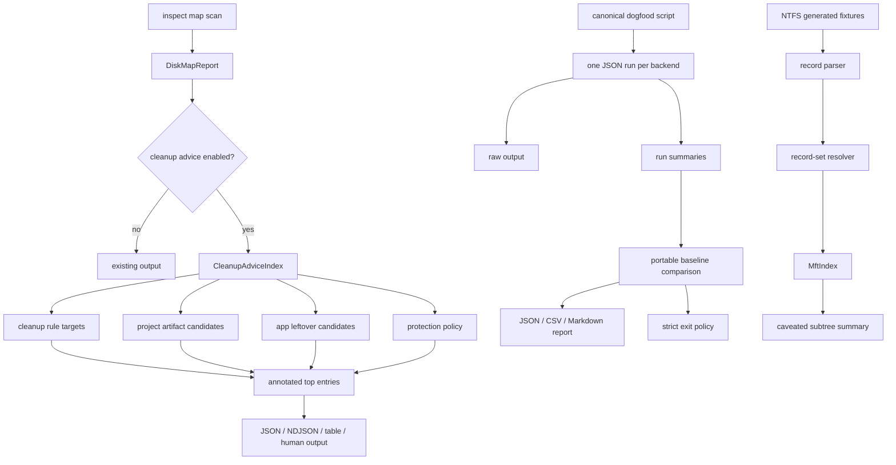

# Cleanup Evidence and Advice Refactor - Plan

## Goal Capsule

| Field | Decision |
|---|---|
| Objective | Consolidate real-disk evidence tooling, complete app-leftover advice in `inspect map`, and harden the next NTFS/MFT correctness slice without carrying old duplicate code. |
| Authority | The user's current instruction allows breaking changes, deletion of obsolete code, and self-commits; repo safety rules still govern filesystem cleanup behavior and license boundaries. |
| Execution profile | Deep refactor with behavior-bearing Rust changes, PowerShell script simplification, parser correctness tests, docs, changelog, and dogfood evidence. |
| Stop condition | Stop only for a scope contradiction, license concern, or a verification failure that cannot be fixed without changing this plan's product contract. |
| Landing strategy | Prefer incremental conventional commits after logical units with focused tests passing; do not stage unrelated user changes. |

---

## Product Contract

### Summary

Rebecca should move closer to a best-in-class cleanup CLI by making its disk-map evidence trustworthy, its cleanup advice more complete, and its NTFS parser safer on malformed or fragmented metadata.
The work is intentionally breaking where cleanliness wins: old duplicate dogfood script bodies should disappear, public output contracts should be updated in one place, and parser tests should encode the edge cases rather than relying on live-machine luck.

### Problem Frame

The current `inspect map` cleanup advice is strong for cleanup rules, project artifacts, and protection policy, but `AppLeftover` exists in the model without being fully wired from installed-app discovery into map advice.
The dogfood surface now has two overlapping PowerShell scripts with duplicated JSON probing, backend comparison, runtime isolation, and self-test logic.
The NTFS parser has already gained attribute-list, hardlink, sequence, `$I30`, stream, and runlist primitives, so the next improvement should lock down record-envelope validity and resolved-record semantics instead of restarting the parser rewrite.

### Requirements

**Evidence and dogfood**

- R1. Real-disk backend dogfood uses one canonical inspect-map report flow that writes JSON, CSV, Markdown, raw stdout/stderr, runtime isolation paths, requested backend, actual backend, fallback reason, caveats, and comparison status from one JSON scan per backend run.
- R2. Dogfood reports fail loudly for command failures, parse failures, timeouts, missing portable baselines, and backend metric mismatches unless a named exploratory opt-in allows mismatch evidence to be collected.
- R3. Dogfood output must not be placed inside the scanned root by default because generated raw/runtime files can pollute backend comparisons.
- R4. The old `scripts/ntfs/run-live-mft-dogfood.ps1` duplicate body is removed rather than maintained as a second implementation; docs and release guidance point to the canonical script.

**Cleanup advice**

- R5. `inspect map --cleanup-advice` includes conservative app-leftover candidates derived from installed-app inventory and existing app-leftover path policy.
- R6. App-leftover advice never infers cleanability from broad app-name substrings; it only uses `derive_app_leftover_candidates`, `AppLeftoverSource`, and `ProtectionPolicy` checks.
- R7. App-leftover advice returns machine-readable source, rule id, relation, reason, structured app-leftover context, and a command suggestion that uses existing CLI flags only.
- R8. JSON, NDJSON, CSV/TSV, schema, human output, README, API docs, and changelog describe advice as read-only guidance, not deletion authorization.

**NTFS/MFT correctness**

- R9. NTFS/MFT correctness work enforces valid record and attribute envelopes, then adds deterministic regression coverage for attribute-list extension `$FILE_NAME`, `$STANDARD_INFORMATION`, `$INDEX_ROOT:$I30`, extension sequence/base mismatch, duplicated extension streams, `$I30` traversal loops, out-of-range child VCNs, and stream-reader short/gap cases.
- R10. NTFS fixture policy stays license-safe: GPL, LGPL, and forensic reference projects inform behavior only; no external code or opaque live-volume fixture is copied into this repo.
- R11. Parser caveats remain structured and propagated to `MftIndex` summaries so live backends can explain uncertainty instead of silently dropping metadata.

### Scope Boundaries

- In scope: deleting duplicate dogfood script logic, completing app-leftover advice, focused NTFS parser hardening, tests, docs, changelog, engineering memory, and local dogfood evidence.
- Out of scope: full uninstall flows, registry writes, vendor uninstallers, broad Program Files cleanup, raw-disk image mounting, MFTMirror recovery, new UI/TUI work, and borrowing GPL/LGPL source code.
- Deferred follow-up work: a dedicated `inspect space` dogfood report can be added later if it is still valuable after `inspect map` becomes the canonical backend evidence surface.

---

## Planning Contract

### Key Technical Decisions

- KTD1. Make `scripts/dogfood/run-inspect-map-report.ps1` the canonical real-disk backend evidence entry point.
  It already has output-inside-root protection, strict failure policy, cleanup-advice row extraction, and report artifacts; keeping the older NTFS script body would preserve ambiguity.
- KTD2. Delete old dogfood code instead of preserving compatibility wrappers by default.
  The user has explicitly preferred clean breaking refactors; if a later release check proves an external entry-point dependency, the replacement should be a tiny forwarding shim, not the old implementation.
- KTD3. Move app-leftover rule facts into the app-leftover domain model.
  `planner/measure.rs` currently owns `windows.app-leftover-*` rule-id strings; `inspect map` advice needs the same facts without duplicating them.
- KTD4. Build app-leftover advice from candidates, not cleanup plans.
  `inspect map` must stay read-only and should not run target measurement or write history; it only needs installed-app inventory, candidate derivation, dedicated app-leftover protection assessment, and path-relation matching.
- KTD5. Treat NTFS correctness as a resolved-record contract.
  Parser boundaries should reject attributes outside the valid record envelope, and record-set resolution should merge supported extension attributes before `MftIndex` builds paths or byte totals.
- KTD6. Keep parser fuzzing lightweight and local.
  Add deterministic bad-input/corpus-style regression tests now; add cargo-fuzz scaffolding only if it does not make normal workspace checks depend on external fuzz tooling.

### High-Level Technical Design

### Assumptions

- The current branch `refactor/cleanup-workflow-architecture` is the intended working branch.
- Breaking script path changes are acceptable if all repository docs and verification commands are updated in the same change.
- App discovery failure during advice should not make a disk map unusable; implementation should either add a bounded diagnostic or skip app-leftover advice with a visible reason.
- Live dogfood output under `target/` remains local evidence and is not committed.

### Risks and Mitigations

| Risk | Mitigation |
|---|---|
| Deleting the old NTFS dogfood script breaks a hidden release habit. | Update every repo reference and make the new script self-test cover the old high-value evidence fields. |
| Advice overstates app leftovers and encourages unsafe deletion. | Use existing candidate derivation and dedicated app-leftover protection policy only; suggest `apps scan` or `apps clean --dry-run`, never a fabricated app-specific command. |
| Installed-app discovery is unavailable on non-Windows or in tests. | Keep the debug override path and add tests that isolate `LOCALAPPDATA`, `APPDATA`, `USERPROFILE`, and `REBECCA_INSTALLED_APPLICATIONS`. |
| NTFS hardening drifts into a second parser rewrite. | Restrict the unit to regression fixtures, caveat propagation, and small resolver fixes needed by those tests. |
| Fuzz scaffolding adds brittle tooling requirements. | Normal verification uses deterministic tests; fuzz commands remain optional developer tooling unless already supported locally. |

---

## Implementation Units

### U1. Collapse dogfood evidence onto one script

- **Goal:** Remove the duplicate NTFS dogfood implementation and make `scripts/dogfood/run-inspect-map-report.ps1` the canonical backend evidence script.
- **Requirements:** R1, R2, R3, R4
- **Dependencies:** None
- **Files:** `scripts/dogfood/run-inspect-map-report.ps1`, `scripts/ntfs/run-live-mft-dogfood.ps1`, `docs/performance/perf-matrix.md`, `docs/release.md`, `README.md`, `CHANGELOG.md`
- **Approach:** Delete the old `scripts/ntfs/run-live-mft-dogfood.ps1` body and update references to the canonical inspect-map dogfood script. Preserve high-value behavior already present in the canonical script: explicit `-Root`, drive-root guard, output-inside-root guard, strict exit policy, `-AllowMismatch`, runtime env isolation, raw stdout/stderr, CSV rows, Markdown summary, and `-SelfTest`.
- **Execution note:** This is a cleanup-first refactor; prefer deleting duplicated PowerShell over extracting a generic framework unless implementation proves a shared helper is materially smaller.
- **Patterns to follow:** `scripts/dogfood/run-inspect-map-report.ps1`, prior review finding in `scripts/dogfood/run-inspect-map-report.ps1`, and `docs/performance/perf-matrix.md`.
- **Test scenarios:**
  - Running `-SelfTest` validates JSON parsing, row extraction, comparison matching, mismatch failure detection, `-AllowMismatch`, CSV generation, and output-inside-root rejection.
  - Repo docs contain no live references to the deleted NTFS script after the refactor.
  - A default dogfood run refuses output inside the scanned root unless `-AllowOutputInsideRoot` is passed.
  - A mismatch or failed run exits non-zero by default.
- **Verification:** The canonical script self-test passes, documentation references resolve to existing files, and no deleted script path remains in active docs or release commands.

### U2. Centralize app-leftover rule facts and advice context

- **Goal:** Move app-leftover rule IDs, restore hints, and advice context out of planner-only code so cleanup plans and map advice use the same source of truth.
- **Requirements:** R5, R6, R7
- **Dependencies:** None
- **Files:** `crates/rebecca-core/src/app_leftovers.rs`, `crates/rebecca-core/src/planner/measure.rs`, `crates/rebecca-core/src/cleanup_advice.rs`, `crates/rebecca-core/src/protection.rs`, `crates/rebecca-core/tests/cleanup_advice.rs`, `crates/rebecca-core/tests/planner.rs`
- **Approach:** Add domain-owned helpers on `AppLeftoverSource` or `AppLeftoverCandidate` for stable rule id, restore hint, target leaf, deletion style, and advice context. Update planner measurement to consume those helpers. Add `CleanupAdviceIndex::add_app_leftover_candidates` that inserts `CleanupAdviceSource::AppLeftover` targets with relation-aware status, uses `ProtectionPolicy::assess_app_leftover_path` for exact/descendant matches, and suggests only existing app workflow commands.
- **Execution note:** Start with focused tests proving the old missing advice behavior before adding production wiring.
- **Patterns to follow:** `CleanupAdviceIndex::add_project_artifact_candidates`, `derive_app_leftover_candidates`, and planner app-leftover tests in `crates/rebecca-core/tests/planner.rs`.
- **Test scenarios:**
  - A derived local AppData cache candidate maps to `windows.app-leftover-local-cache` and returns `cleanable` for the exact path.
  - Roaming and LocalLow candidates map to their existing stable rule IDs.
  - A parent directory returns `contains-cleanable`, not `cleanable`.
  - A user-protected leftover path returns `protected` and does not include a cleanup command.
  - A durable app-data path such as `Local Storage` remains unknown or protected and is not marked cleanable.
  - Advice includes structured app-leftover context with app identity, source, target leaf, deletion style, and modified timestamp when known.
  - Planner app-leftover tests still emit the same rule IDs and restore hints after the helper move.
- **Verification:** Core cleanup-advice and planner tests show app-leftover facts are shared and no rule-id string duplication remains in planner measurement.

### U3. Wire app-leftover advice into inspect map contracts

- **Goal:** Make `inspect map --cleanup-advice` annotate app-leftover candidates from installed-app discovery across JSON, NDJSON, table, and human output.
- **Requirements:** R5, R6, R7, R8
- **Dependencies:** U2
- **Files:** `crates/rebecca/src/inspect.rs`, `crates/rebecca/src/render/inspect.rs`, `crates/rebecca/tests/cli_inspect.rs`, `crates/rebecca/tests/cli_api.rs`, `docs/api/cli/v1/payloads.schema.json`, `docs/api/cli/v1/examples/success-inspect-map.json`, `docs/api/cli/v1/README.md`, `README.md`, `CHANGELOG.md`
- **Approach:** In the advice-enabled path, call installed-app discovery, derive app-leftover candidates with the same environment used by cleanup planning, add them to the advice index, and annotate ranked entries. Keep totals unchanged when `--advice-status` filters top entries. Update schema/docs to include `app-leftover` as an advertised advice source.
- **Execution note:** Use debug installed-application overrides and temp AppData roots so tests do not depend on the host machine.
- **Patterns to follow:** Current `annotate_map_report_with_cleanup_advice`, CLI app-leftover tests in `crates/rebecca/tests/cli_apps.rs`, and API schema tests in `crates/rebecca/tests/cli_api.rs`.
- **Test scenarios:**
  - JSON `inspect map --cleanup-advice` reports `cleanup_advice.source = "app-leftover"` for a derived leftover cache entry.
  - JSON app-leftover advice contains `app_leftover` context rather than hiding app identity in free-form reason text.
  - NDJSON `map-entry` advice matches the final completed report advice.
  - CSV/TSV advice columns include app-leftover source, rule id, app stable id, display name, publisher, leftover source, target leaf, deletion style, and modified timestamp when enabled.
  - `--advice-status cleanable` can return app-leftover entries without changing root totals.
  - Non-Windows or disabled discovery does not fail normal non-advice `inspect map`.
- **Verification:** Focused CLI/API tests pass and `payloads.schema.json` validates the new app-leftover advice shape.

### U4. Enforce NTFS record-envelope and resolved-record correctness

- **Goal:** Make NTFS parsing reject malformed record/attribute envelopes and resolve supported attribute-list extension metadata before index construction.
- **Requirements:** R9, R10, R11
- **Dependencies:** None
- **Files:** `crates/rebecca-ntfs/src/record.rs`, `crates/rebecca-ntfs/src/attrs.rs`, `crates/rebecca-ntfs/src/adapter.rs`, `crates/rebecca-ntfs/src/record_set.rs`, `crates/rebecca-ntfs/src/index.rs`, `crates/rebecca-ntfs/src/stream.rs`, `crates/rebecca-ntfs/tests/common/mod.rs`, `crates/rebecca-ntfs/tests/mft_parser.rs`, `crates/rebecca-ntfs/tests/mft_record_bounds.rs`, `crates/rebecca-ntfs/tests/mft_attribute_list_resolution.rs`, `crates/rebecca-ntfs/tests/fixtures/README.md`
- **Approach:** Add characterization tests first around current behavior, then tighten `used_size`, `first_attribute_offset`, attribute length, attribute name span, resident value span, and runlist span checks. Extend attribute-list resolution to merge supported `$FILE_NAME`, `$STANDARD_INFORMATION`, and `$INDEX_ROOT:$I30` metadata from base-verified extension records while preserving existing `$DATA` and `$INDEX_ALLOCATION` merging.
- **Execution note:** Use deterministic generated fixtures instead of live-volume fixtures.
- **Patterns to follow:** Existing tests for `single_record_resolution_lazily_merges_attribute_list_data_extension`, `record_set_expands_attribute_list_i30_index_allocation_extension`, `record_set_expands_fragmented_multi_record_i30_index_allocation`, and `parent_sequence_mismatch_is_caveated_and_not_counted`.
- **Test scenarios:**
  - Attribute crossing `used_size` is rejected and does not produce names, streams, or directory entries.
  - Attribute name outside its attribute span is rejected.
  - Invalid `first_attribute_offset` is rejected before slack bytes can be parsed.
  - Attribute-list extension with mismatched record sequence is caveated and not merged through the record-id fallback path.
  - Attribute-list extension whose `base_reference` points elsewhere is caveated and does not contribute bytes or directory entries.
  - `$FILE_NAME` on a valid extension lets the base record enter `MftIndex`.
  - `$INDEX_ROOT:$I30` on a valid extension contributes directory entries.
  - Duplicate extension entries do not double-count logical bytes or duplicate `$I30` children.
  - `$I30` child VCN loop emits `invalid-index-allocation` and terminates.
  - Out-of-range child VCN propagates a structured caveat to the subtree summary.
- **Verification:** `rebecca-ntfs` parser tests prove bad metadata is caveated, not silently counted.

### U5. Add parser corpus/fuzz regression scaffolding

- **Goal:** Give future NTFS parser work a place to put malformed-record regression seeds without committing private live-volume data.
- **Requirements:** R9, R10, R11
- **Dependencies:** U4
- **Files:** `crates/rebecca-ntfs/tests/fixtures/README.md`, `crates/rebecca-ntfs/tests/mft_parser.rs`, optional `crates/rebecca-ntfs/fuzz/Cargo.toml`, optional `crates/rebecca-ntfs/fuzz/fuzz_targets/mft_record.rs`, optional `crates/rebecca-ntfs/fuzz/fuzz_targets/runlist.rs`
- **Approach:** Prefer deterministic generated bad-input tests that run under nextest. Add cargo-fuzz-compatible scaffolding only if it stays outside normal workspace checks and does not require CI to install fuzz tooling. Document what can and cannot be stored as fixture input.
- **Execution note:** Do not add opaque binary blobs from live volumes in this unit.
- **Patterns to follow:** `crates/rebecca-ntfs/tests/fixtures/README.md`, generated fixture helpers in `crates/rebecca-ntfs/tests/mft_parser.rs`, and runlist unit tests in `crates/rebecca-ntfs/src/runlist.rs`.
- **Test scenarios:**
  - A generated malformed record corpus case cannot panic the parser.
  - Invalid runlist bytes return `InvalidRunlist` rather than panicking.
  - Fixture README documents privacy and license boundaries for future corpus additions.
  - Optional fuzz targets compile when explicitly checked with their local cargo manifest.
- **Verification:** Deterministic parser hardening tests pass; optional fuzz scaffolding is present only if it does not destabilize normal workspace verification.

### U6. Update evidence docs and engineering memory

- **Goal:** Keep release notes, API docs, performance docs, and engineering memory aligned with the refactor.
- **Requirements:** R1, R2, R3, R4, R8, R10
- **Dependencies:** U1, U2, U3, U4, U5
- **Files:** `CHANGELOG.md`, `README.md`, `docs/api/cli/v1/README.md`, `docs/performance/perf-matrix.md`, `docs/knowledge/engineering/current-state.md`, `docs/knowledge/engineering/log.md`
- **Approach:** Record user-visible changes under Unreleased, explain that app-leftover advice is read-only, explain that `inspect map` dogfood is the canonical backend evidence path, and update current-state after verification.
- **Execution note:** Documentation should describe behavior and boundaries, not the internal plan process.
- **Patterns to follow:** Existing Unreleased changelog entries and `docs/knowledge/engineering/current-state.md`.
- **Test scenarios:** Test expectation: none -- this unit updates documentation and state after behavior-bearing tests have proven the implementation.
- **Verification:** `git diff --check` passes and documentation references existing scripts, flags, and payload fields.

---

## Verification Contract

| Gate | Applies to | Command |
|---|---|---|
| Formatting | Rust changes | `cargo fmt --all --check` |
| Core advice tests | U2 | `cargo nextest run -p rebecca-core --test cleanup_advice --test planner` |
| CLI inspect/API tests | U3 | `cargo nextest run -p rebecca --test cli_inspect --test cli_api` |
| NTFS parser tests | U4, U5 | `cargo nextest run -p rebecca-ntfs` |
| Dogfood script self-test | U1 | `pwsh -File scripts/dogfood/run-inspect-map-report.ps1 -SelfTest` |
| Workspace compile | All Rust units | `cargo check --workspace` |
| Lint | All Rust units | `cargo clippy --workspace --all-targets --all-features -- -D warnings` |
| Full regression | Final | `cargo nextest run --workspace` |
| Diff hygiene | Final | `git diff --check` |
| Local dogfood evidence | Final | `pwsh -File scripts/dogfood/run-inspect-map-report.ps1 -Root docs -Backend portable-recursive,windows-native,windows-ntfs-mft-experimental -Repeat 1 -Top 20 -GroupBy extension,depth,age -DiagnosticLimit 0 -CleanupAdvice` |

---

## Definition of Done

- The old duplicate NTFS dogfood script body is gone, and active docs point to the canonical inspect-map dogfood script.
- App-leftover advice is visible in core tests and CLI machine/table output when a conservative installed-app candidate is present.
- App-leftover rule IDs and restore hints have one core owner.
- NTFS parser hardening tests cover record-envelope rejection, supported attribute-list extension merging, malformed metadata caveats, and subtree caveat propagation.
- No GPL/LGPL code or private live-volume fixture is copied into the repository.
- Changelog, README, API docs, performance docs, and engineering memory describe the new behavior.
- All Verification Contract gates pass or any skipped optional fuzz gate is explicitly justified.
- Abandoned experimental code and duplicate helpers are removed before the final commit.

---

## Sources Consulted

- `docs/knowledge/engineering/current-state.md`
- `docs/plans/2026-07-03-013-feat-disk-map-cleanup-advice-plan.md`
- `scripts/dogfood/run-inspect-map-report.ps1`
- `scripts/ntfs/run-live-mft-dogfood.ps1`
- `crates/rebecca-core/src/cleanup_advice.rs`
- `crates/rebecca-core/src/app_leftovers.rs`
- `crates/rebecca-core/src/planner/measure.rs`
- `crates/rebecca/src/inspect.rs`
- `crates/rebecca-ntfs/src/record_set.rs`
- `crates/rebecca-ntfs/src/index.rs`
- `crates/rebecca-ntfs/src/record.rs`
- `crates/rebecca-ntfs/src/attrs.rs`
- `crates/rebecca-ntfs/tests/mft_parser.rs`
- `crates/rebecca-ntfs/tests/fixtures/README.md`
- Prior read-only subagent findings on cleanup advice contracts, inspect-map dogfood, and dogfood script review.
