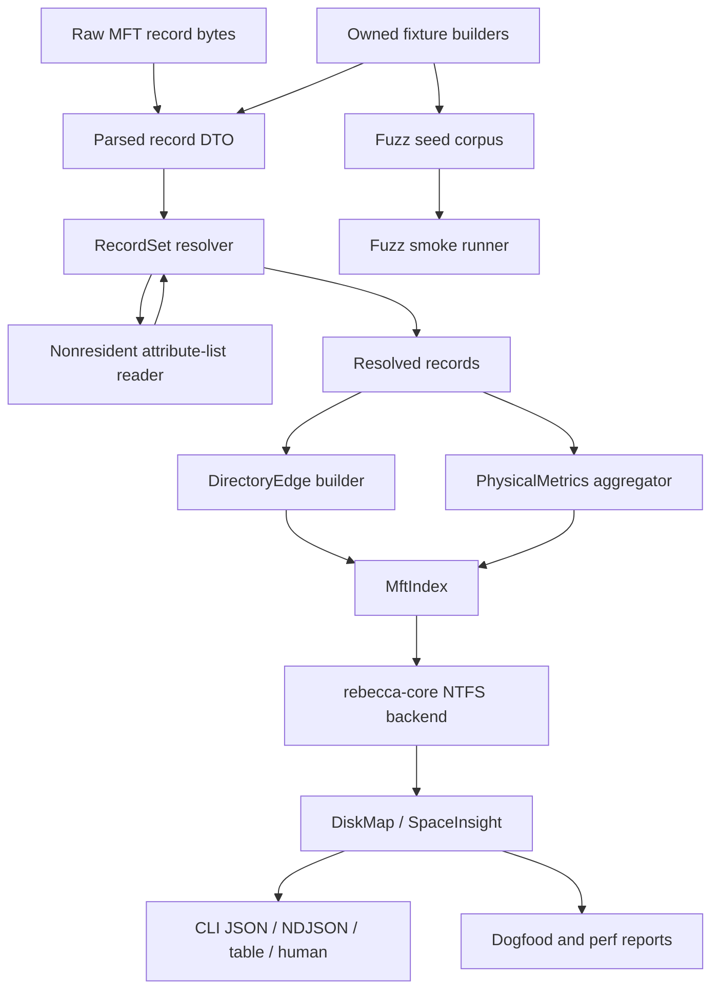

# NTFS Physical Usage and Provenance Refactor - Plan

## Goal Capsule

| Field | Decision |
|---|---|
| Objective | Turn the experimental NTFS/MFT backend into a credible physical-space evidence surface by unifying nonresident attribute-list resolution, directory-edge provenance, hardlink-aware physical metrics, fuzz seeds, and dogfood/perf reporting. |
| Authority | The user explicitly allows fearless refactoring, breaking internal/public contracts when the new contract is cleaner, deleting obsolete code, self-commits, and subagent review. Repository safety, licensing, and deletion-governance rules still override speed. |
| Execution profile | Deep Rust parser/core/CLI refactor plus deterministic fixtures, optional fuzz tooling, PowerShell report upgrades, API/docs/changelog updates, and full verification. |
| Stop condition | Stop only for a license boundary concern, a cleanup-safety regression, a raw live-volume requirement that cannot be tested with owned fixtures, or a verification failure that changes this plan's product contract. |
| Landing strategy | Prefer incremental conventional commits after coherent units with focused tests passing. Stage only files changed for this plan and keep live dogfood output under `target/` uncommitted. |

---

## Product Contract

### Summary

Rebecca already has an experimental NTFS/MFT path that can parse records, resolve direct resident attribute-list extensions, read `$I30` index allocation streams, perform targeted traversal, and expose logical plus some allocated map totals.
The next jump toward a best-in-class cleanup CLI is not another ad hoc speed pass; it is making the NTFS facts trustworthy enough that space reports, cleanup advice, and perf evidence can explain exactly what is known, unknown, deduplicated, and caveated.

This plan intentionally breaks and deletes internal shapes where the old split between parser facts, targeted traversal, full index aggregation, and report scripts makes correctness harder.
The desired end state is one NTFS semantic vocabulary: records own streams, directory relationships are typed edges with provenance, physical metrics are computed once, and every user-visible estimate can say whether allocated and unique bytes are evidence-backed or unknown.

### Problem Frame

The current model still has several seams that make Rebecca less strong than mature filesystem tools:

- `$ATTRIBUTE_LIST` resolution is good for resident lists and direct extension records, but nonresident attribute-list streams still stop at a caveat even though the parser crate now has a runlist stream reader boundary.
- `MftIndex` can preserve hardlink path candidates and cross-check `$I30`, but parent-child membership is still mostly a `parent_record_id -> child_record_id` map with separate caveat side tables instead of first-class `DirectoryEdge` facts.
- Full-index and targeted traversal both compute logical/allocated subtree metrics, sequence fallback caveats, and duplicate handling in their own ways.
- `inspect map` already exposes nullable `allocated_bytes` and `unique_*` fields, but README still says experimental NTFS byte totals stay on logical streams while allocated stream metadata is only retained internally.
- Fuzz targets exist, but they have no deterministic seed corpus, no short smoke runner, and only "do not panic" invariants.
- Dogfood/perf scripts collect useful one-off evidence, but they do not yet form a stable quality gate for allocated/unique mismatch status, backend source distribution, caveat counts, or repeat statistics.

### Requirements

**NTFS completeness**

- R1. Resident and bounded nonresident `$ATTRIBUTE_LIST` streams resolve supported extension `$FILE_NAME`, `$STANDARD_INFORMATION`, `$DATA`, `$INDEX_ROOT:$I30`, and `$INDEX_ALLOCATION:$I30` attributes through one direct-extension resolver.
- R2. Attribute-list expansion must never recursively expand another `$ATTRIBUTE_LIST`; entries that target attribute-list attributes are refused with structured caveats.
- R3. Nonresident attribute-list reading is bounded by logical size and an implementation cap, rejects unsupported sparse/compressed/encrypted cases, and turns short/gap reads into caveats rather than panics or trusted partial maps.
- R4. Parser and record-set tests cover resident, nonresident, split, duplicate, malformed, looped, sequence-mismatched, and unsupported attribute-list cases with owned fixtures only.

**Directory provenance**

- R5. Directory relationships are represented as first-class edges with child reference, parent reference, display name, namespace, source, sequence status, confidence, and caveats.
- R6. Edge sources distinguish `$FILE_NAME`, `$I30` resident root, `$I30` nonresident allocation, and fallback/unknown evidence.
- R7. Full `MftIndex` and live targeted traversal consume the same edge/provenance vocabulary and emit the same caveat codes for parent sequence mismatch, child sequence mismatch, duplicate edge, missing record, fallback edge, and cycle skip.
- R8. Hardlinks remain multi-path facts: Rebecca chooses a deterministic canonical display path while preserving non-DOS alternatives for diagnostics and never counts one physical record multiple times in unique metrics.

**Physical usage semantics**

- R9. NTFS-backed `inspect map` and `inspect space` expose logical bytes, allocated bytes, unique logical bytes, unique allocated bytes, and confidence/caveats consistently when the backend has evidence.
- R10. Unknown allocated or unique allocated values remain nullable and caveated; unknown must never be treated as zero.
- R11. Cleanup estimates remain conservative. Physical bytes are read-only evidence and do not authorize deletion outside existing cleanup, app, or purge planning flows. Default ranking and cleanup advice weighting stay on the existing logical/conservative behavior unless a later explicit ranking plan changes and tests that product decision.
- R12. The parser/core boundary owns a single `PhysicalMetrics`-style aggregation path for full-index and targeted scans, including hardlink deduplication by stable record identity.

**Fuzz and fixture evidence**

- R13. NTFS parser fixtures used by tests, benches, and fuzz seeds come from owned deterministic builders or scrubbed repo-owned bytes, not copied external fixture corpora.
- R14. Existing fuzz targets gain per-target seed corpus directories and lightweight semantic invariants beyond "does not panic".
- R15. A short PowerShell fuzz smoke runner compiles fuzz bins, optionally runs installed `cargo fuzz` for bounded seconds per target, and writes machine-readable plus Markdown summaries without making normal workspace checks require fuzz tooling.
- R16. Fuzz README documents smoke, long runs, crash minimization, privacy scrub rules, and how to promote crashes into deterministic regression tests.

**Dogfood, perf, and documentation**

- R17. Dogfood reports include duration, derived throughput, requested backend, actual backend source, fallback reason, caveat counts, diagnostic counts, logical/allocated/unique metrics, and allocated/unique comparison state.
- R18. Repeat dogfood/perf runs report min, median, max, and p95 duration where repeat count permits it.
- R19. Perf matrix output aligns with dogfood report shape enough to support JSON/CSV/Markdown comparison and optional baseline threshold checks.
- R20. README, CLI API schema/examples, performance docs, changelog, and engineering memory describe the new physical/provenance semantics and the remaining NTFS caveats.

### Scope Boundaries

- In scope: `rebecca-ntfs` parser/index/stream changes, `rebecca-core` NTFS backend refactors, CLI/API output contract updates, deterministic NTFS fixtures, fuzz corpus/runner, dogfood/perf report scripts, tests, docs, changelog, and engineering memory.
- Out of scope: NTFS write support, deleted-entry recovery, index slack recovery, security descriptor analysis, registry or uninstaller flows, raw forensic image mounting, `$MFTMirr` fallback, persistent volume index cache, USN-driven incremental map refresh, and UI/TUI work.
- License boundary: Apache/MIT reference projects can inform design and behavior. GPL/LGPL/mixed forensic projects can inform behavior checklists only. Do not copy code, comments, data-structure layouts, binary fixtures, or translated functions from external projects.
- Safety boundary: Deletion behavior remains governed by existing cleanup/app/purge planners. This plan may improve estimates and advice evidence, but it must not add new automatic deletion authority.
- Deferred follow-ups: raw image mode, `$MFTMirr`, advanced compression/sparse physical cluster accounting, alternate data stream reporting, and long-running CI fuzz jobs can follow after this core model is clean.

---

## Planning Contract

### Key Technical Decisions

- KTD1. `rebecca-ntfs` owns NTFS semantic facts.
  The parser/index crate should expose resolved records, streams, directory edges, path candidates, and physical metrics in a form `rebecca-core` can consume without reinterpreting NTFS internals.
- KTD2. Introduce a first-class directory edge model.
  Names may change during implementation, but the concept should include `DirectoryEdge`, `DirectoryEdgeSource`, `DirectoryEdgeSequenceStatus`, and `DirectoryEdgeConfidence` or equivalent types.
- KTD3. Introduce a single physical metrics aggregator.
  Names may change, but full-index and targeted paths should call the same logic for logical bytes, allocated bytes, unique logical bytes, unique allocated bytes, hardlink deduplication, and unknown propagation.
- KTD4. Resolve nonresident `$ATTRIBUTE_LIST` through the stream-source boundary.
  Reuse `NtfsStreamReader`/`NtfsStreamSource` with a bounded read policy instead of adding another raw runlist reader.
- KTD5. Reject recursive attribute-list expansion.
  Extension lookup is direct: attribute-list entries may request supported attributes from extension records, but extension records' own attribute-list attributes are caveated and ignored.
- KTD6. Keep fuzz optional but reproducible.
  `cargo check --manifest-path crates/rebecca-ntfs/fuzz/Cargo.toml --bins` should remain the mandatory toolchain-level gate; actual `cargo fuzz run` is optional and bounded by a smoke script when installed.
- KTD7. Report evidence is part of the product.
  Dogfood/perf scripts should produce stable artifacts that explain backend source, fallbacks, caveats, and metric comparison status, not just raw command output.
- KTD8. Keep physical metrics explanatory in this plan.
  Allocated and unique metrics can be exposed, sorted by explicit user flags, and compared in reports, but this plan must not silently change default map ranking or cleanup advice priority to prefer allocated bytes.

### High-Level Technical Design



### Assumptions

- The current branch `refactor/cleanup-workflow-architecture` remains the working branch.
- Breaking parser/core/CLI schema changes are acceptable when docs, tests, examples, and changelog are updated in the same work.
- `E:` can be used for local dogfood, but generated evidence under `target/` must remain uncommitted.
- Exact type and field names can be adapted to the codebase if the plan's semantic requirements remain satisfied.
- Subagents may review and analyze. Main-thread edits stay serialized to avoid shared-worktree conflicts.

### Risks and Mitigations

| Risk | Mitigation |
|---|---|
| Nonresident attribute-list expansion trusts partial bytes. | Read with a bounded cap, require complete stream reads for trust, and caveat short/gap/sparse/compressed/encrypted cases. |
| DirectoryEdge refactor becomes a second parser rewrite. | Keep the public product goal narrow: edge provenance, sequence validation, caveat unification, and deterministic path choice. |
| Allocated-byte reporting overpromises reclaimable space. | Keep allocated fields nullable, preserve caveats, and state that deletion authority remains in existing planners. |
| Fuzz tooling makes normal development brittle. | Keep cargo-fuzz optional; mandatory checks compile the fuzz harness and deterministic seeds only. |
| Perf/dogfood reports become too platform-specific. | Put platform-only live evidence under local scripts and keep report schemas tolerant of unknown/nullable metrics. |
| External reference contamination. | Use reference projects only for behavior checklists and add docs/tests with owned fixture builders. |

---

## Implementation Units

### U1. Consolidate owned NTFS fixtures and fuzz seeds

- **Goal:** Create a shared deterministic fixture boundary for tests, benches, and fuzz seeds so future NTFS hardening is reproducible and license-safe.
- **Requirements:** R4, R13, R14, R16
- **Dependencies:** None
- **Files:** `crates/rebecca-ntfs/src/test_support.rs` or a similar test-only module, `crates/rebecca-ntfs/tests/mft_parser.rs`, `crates/rebecca-ntfs/benches/mft_parser.rs`, `crates/rebecca-ntfs/fuzz/corpus/**`, `crates/rebecca-ntfs/fuzz/README.md`
- **Approach:** Extract or add owned fixture builders for valid FILE records, invalid fixup records, resident and nonresident `$DATA`, simple and fragmented runlists, resident and nonresident `$ATTRIBUTE_LIST`, direct extension records, resident `$INDEX_ROOT:$I30`, and valid/invalid INDX allocation records. Use these builders to populate target-specific corpus directories and reduce duplicated fixture construction in tests/benches.
- **Execution note:** Keep builders private to tests/fuzz or behind an explicit dev/test boundary; do not publish them as a stable parser API unless implementation proves a clean internal need.
- **Test scenarios:**
  - Existing parser tests still pass after moving repeated fixture helpers.
  - Fuzz corpus directories exist for `mft_record`, `attribute_list`, `i30_index`, and `runlist`.
  - Corpus seed names are deterministic and do not include live machine paths.
  - Fuzz README explains privacy and license rules.
- **Verification:** `cargo nextest run -p rebecca-ntfs --test mft_parser` and `cargo check --manifest-path crates/rebecca-ntfs/fuzz/Cargo.toml --bins`.

### U2. Implement bounded nonresident `$ATTRIBUTE_LIST` expansion

- **Goal:** Resolve nonresident attribute-list streams through the existing stream-reader boundary while preserving direct-only, loop-safe resolution semantics.
- **Requirements:** R1, R2, R3, R4
- **Dependencies:** U1
- **Files:** `crates/rebecca-ntfs/src/record.rs`, `crates/rebecca-ntfs/src/record_set.rs`, `crates/rebecca-ntfs/src/stream.rs`, `crates/rebecca-ntfs/src/attribute_list.rs`, `crates/rebecca-ntfs/tests/mft_parser.rs`, `crates/rebecca-core/src/scan/windows_ntfs_mft.rs`
- **Approach:** Preserve nonresident `$ATTRIBUTE_LIST` stream metadata at parse time, then teach `NtfsRecordSet` to read bounded list bytes via `NtfsStreamReader` and parse entries before running the existing direct extension resolver. Prove the resolver is source-neutral with at least one test-only in-memory stream source and one live/backend adapter path in `rebecca-core`. Add a size cap and structured caveats for unsupported flags, oversized streams, sparse gaps, short reads, parse errors, recursive attribute-list entries, and extension sequence/base mismatch.
- **Execution note:** Prefer deleting the old "nonresident attribute lists require runlist-backed record-set resolution" dead-end caveat path once the resolver owns the real caveats.
- **Test scenarios:**
  - A base record with nonresident `$ATTRIBUTE_LIST` resolves extension `$FILE_NAME`, `$STANDARD_INFORMATION`, `$DATA`, `$INDEX_ROOT:$I30`, and `$INDEX_ALLOCATION:$I30`.
  - A nonresident list entry that targets `$ATTRIBUTE_LIST` is caveated and ignored.
  - Sparse, compressed, encrypted, oversized, and short-read attribute-list streams return bounded caveats and keep the base record usable.
  - Extension records with stale sequence numbers or wrong base references do not merge.
  - Duplicate extension streams do not double count logical or allocated bytes.
- **Verification:** `cargo nextest run -p rebecca-ntfs --test mft_parser` and targeted core NTFS backend tests that exercise stream-source-backed resolution.

### U3. Refactor `MftIndex` around DirectoryEdge provenance

- **Goal:** Replace implicit child maps and side caveat tables with a first-class edge model that records source, sequence validation, confidence, and caveats.
- **Requirements:** R5, R6, R7, R8
- **Dependencies:** U2
- **Files:** `crates/rebecca-ntfs/src/index.rs`, `crates/rebecca-ntfs/src/adapter.rs`, `crates/rebecca-ntfs/src/lib.rs`, `crates/rebecca-ntfs/tests/mft_parser.rs`, `crates/rebecca-core/src/scan/windows_ntfs_mft.rs`
- **Approach:** Build `DirectoryEdge` values from non-DOS `$FILE_NAME` attributes and `$I30` entries, validate parent and child sequence numbers against known records, deduplicate equivalent edges, and attach caveats directly to edges. Keep a derived child lookup for fast traversal, but make it an implementation detail. Expose deterministic path selection plus preserved alternatives.
- **Execution note:** Delete duplicate fallback/sequence caveat generation in core once `MftIndex` can provide the edge facts.
- **Test scenarios:**
  - `$FILE_NAME`, `$I30` root, and `$I30` allocation edges expose distinct sources.
  - Parent sequence mismatch and child sequence mismatch produce matching caveat codes in full-index and targeted traversal.
  - Multiple non-DOS hardlink names produce multiple path candidates and one canonical display path.
  - Duplicate `$FILE_NAME`/`$I30` edges do not create duplicate traversal.
  - Directory cycles are skipped with edge-aware caveats.
- **Verification:** `cargo nextest run -p rebecca-ntfs --test mft_parser` and `cargo nextest run -p rebecca-core --test disk_map`.

### U4. Centralize physical metrics across full-index and targeted scans

- **Goal:** Compute logical, allocated, unique logical, and unique allocated metrics through one hardlink-aware aggregation path owned by the NTFS model.
- **Requirements:** R8, R9, R10, R11, R12
- **Dependencies:** U3
- **Files:** `crates/rebecca-ntfs/src/index.rs`, `crates/rebecca-ntfs/src/adapter.rs`, `crates/rebecca-core/src/scan/windows_ntfs_mft.rs`, `crates/rebecca-core/tests/disk_map.rs`, `crates/rebecca-core/tests/space_insight.rs`
- **Approach:** Add a `PhysicalMetrics` or equivalent aggregation result that carries path-ranked totals, unique physical totals, nullable allocated values, file/directory counts, and caveats. Use record identity to deduplicate hardlinked files for unique metrics. Refactor full-index map building and targeted FSCTL traversal to consume this result instead of locally adding allocated bytes and caveats.
- **Execution note:** This is the unit most likely to delete old core helper code such as duplicated allocated-byte addition and targeted/full-index metric divergence.
- **Test scenarios:**
  - A hardlinked file contributes to path-ranked logical totals per visible path but to unique physical totals once.
  - Unknown allocated bytes make aggregate allocated fields null, not zero.
  - Targeted and full-index paths produce the same totals and caveats for the same fixture graph.
  - `inspect space` and `inspect map` preserve conservative deletion semantics while showing physical evidence when known.
- **Verification:** `cargo nextest run -p rebecca-core --test disk_map --test space_insight`.

### U5. Expose physical/provenance semantics through CLI and API contracts

- **Goal:** Make CLI/API consumers see the new NTFS evidence consistently without guessing what nullable physical fields mean.
- **Requirements:** R9, R10, R11, R20
- **Dependencies:** U4
- **Files:** `crates/rebecca/src/inspect.rs`, `crates/rebecca/src/render/inspect.rs`, `crates/rebecca/tests/cli_inspect.rs`, `crates/rebecca/tests/cli_api.rs`, `docs/api/cli/v1/payloads.schema.json`, `docs/api/cli/v1/examples/success-inspect-map.json`, `docs/api/cli/v1/README.md`, `README.md`
- **Approach:** Update JSON, NDJSON, table, and human renderers to describe allocated/unique metrics and caveats with the new source/provenance semantics. Keep additive CLI API v1 changes where possible, but remove or rename misleading internal fields if the old shape obscures correctness.
- **Execution note:** Prefer one schema/doc update over scattered renderer comments; machine contracts should teach wrappers how to distinguish unknown from zero.
- **Test scenarios:**
  - JSON schema accepts nullable allocated and unique fields with explicit documentation.
  - CLI table exports include known allocated/unique values and leave unknowns empty.
  - Human output mentions caveated physical values only when relevant and does not imply deletion authority.
  - API examples reflect the new semantics.
- **Verification:** `cargo nextest run -p rebecca --test cli_inspect --test cli_api`.

### U6. Build fuzz smoke and parser-hardening evidence loop

- **Goal:** Turn optional fuzz targets into a repeatable local hardening workflow with seed corpus, semantic invariants, and crash promotion guidance.
- **Requirements:** R13, R14, R15, R16
- **Dependencies:** U1, U2, U3
- **Files:** `crates/rebecca-ntfs/fuzz/fuzz_targets/*.rs`, `crates/rebecca-ntfs/fuzz/corpus/**`, `crates/rebecca-ntfs/fuzz/README.md`, `scripts/fuzz/run-ntfs-fuzz-smoke.ps1`
- **Approach:** Add lightweight invariants to existing targets: repeat parse stability for successful records, bounded runlist ranges, directory index child VCN sanity, and attribute-list entry bounds. Add a PowerShell smoke runner that always checks fuzz bins and only runs `cargo fuzz` if installed, writing `target/fuzz-smoke/<timestamp>/fuzz-smoke-report.json` and Markdown.
- **Execution note:** The runner should pass on machines without `cargo fuzz` by reporting the fuzz-run phase as skipped after compile succeeds.
- **Test scenarios:**
  - `-SecondsPerTarget 1` compiles bins and writes a report.
  - Missing `cargo fuzz` is a skipped optional phase, not a failed workspace verification.
  - A selected target list runs only those targets.
  - Reports include target, phase, duration, exit code, skipped reason, and artifact path when present.
- **Verification:** `cargo check --manifest-path crates/rebecca-ntfs/fuzz/Cargo.toml --bins` and `pwsh -File scripts/fuzz/run-ntfs-fuzz-smoke.ps1 -SecondsPerTarget 1`.

### U7. Upgrade dogfood and perf reports into comparison evidence

- **Goal:** Make local evidence strong enough to compare backend correctness and speed across runs.
- **Requirements:** R17, R18, R19
- **Dependencies:** U4, U5
- **Files:** `scripts/dogfood/run-inspect-map-report.ps1`, `scripts/dogfood/README.md`, `scripts/perf/run-benchmark-matrix.ps1`, `docs/performance/perf-matrix.md`, `crates/rebecca-core/benches/perf_matrix.rs`, `crates/rebecca-ntfs/benches/mft_parser.rs`
- **Approach:** Define a compact machine-readable report schema before changing script output: duration stats, throughput, requested backend, actual backend source, fallback reason, caveat counts, diagnostic counts, logical/allocated/unique metrics, allocated/unique comparison state, and optional baseline threshold result. Extend dogfood run summaries to populate that schema. Align perf matrix outputs to JSON/CSV/Markdown report conventions and add optional baseline comparison thresholds without forcing noisy live thresholds into normal tests.
- **Execution note:** Keep live E-drive dogfood local and uncommitted; commit only scripts, docs, and deterministic self-tests.
- **Test scenarios:**
  - Dogfood `-SelfTest` covers allocated/unique known, unknown, matched, and mismatch states.
  - Repeat summaries compute min/median/max/p95 deterministically.
  - Reports include backend source, fallback, caveat counts, diagnostic counts, and throughput fields.
  - Perf script can emit report artifacts from available benchmark JSON and optionally compare to a baseline.
- **Verification:** `pwsh -File scripts/dogfood/run-inspect-map-report.ps1 -SelfTest` and `pwsh -File scripts/perf/run-benchmark-matrix.ps1 -SkipRun` if supported after the refactor.

### U8. Documentation, changelog, memory, cleanup, and final verification

- **Goal:** Close the plan with coherent docs, current-state memory, changelog entries, deleted obsolete code, and full repo verification.
- **Requirements:** R20 plus all prior requirements
- **Dependencies:** U1, U2, U3, U4, U5, U6, U7
- **Files:** `CHANGELOG.md`, `README.md`, `docs/api/cli/v1/**`, `docs/performance/perf-matrix.md`, `docs/knowledge/engineering/current-state.md`, any deleted obsolete helpers discovered during implementation
- **Approach:** Update Unreleased changelog entries, remove stale README language that says NTFS allocated metadata is only retained internally when it is now exposed, document remaining caveats, and ensure current-state memory points to this plan as in progress or complete.
- **Execution note:** If implementation deletes compatibility-only code, do not leave dead wrappers unless tests or docs prove an active repository dependency.
- **Test scenarios:**
  - Docs do not reference removed script paths or old NTFS allocated-byte caveats.
  - Changelog has concise Unreleased entries for parser, CLI/API, fuzz, dogfood/perf, and docs.
  - Current-state memory reflects the new completed state after verification.
- **Verification:** Full Verification Contract below.

---

## Verification Contract

Run focused gates as each unit lands, then run the full contract before marking the goal complete:

```powershell
cargo fmt --all --check
cargo fmt --manifest-path crates/rebecca-ntfs/fuzz/Cargo.toml --check
cargo nextest run -p rebecca-ntfs --test mft_parser
cargo check --manifest-path crates/rebecca-ntfs/fuzz/Cargo.toml --bins
pwsh -File scripts/fuzz/run-ntfs-fuzz-smoke.ps1 -SecondsPerTarget 1
cargo nextest run -p rebecca-core --test disk_map --test space_insight
cargo nextest run -p rebecca --test cli_inspect --test cli_api
pwsh -File scripts/dogfood/run-inspect-map-report.ps1 -SelfTest
pwsh -File scripts/perf/run-benchmark-matrix.ps1 -SkipRun
cargo check --workspace
cargo clippy --workspace --all-targets --all-features -- -D warnings
cargo nextest run --workspace
git diff --check
```

Local dogfood evidence should also be collected when the deterministic gates are green:

```powershell
$env:REBECCA_NTFS_MFT_INDEX_TIMINGS = "1"
pwsh -File scripts/dogfood/run-inspect-map-report.ps1 -Root docs -ScanBackend portable-recursive,windows-native,windows-ntfs-mft-experimental -Repeat 2 -Top 10 -GroupBy extension,depth -CleanupAdvice
Remove-Item Env:\REBECCA_NTFS_MFT_INDEX_TIMINGS
```

If the live dogfood command cannot run because of platform privileges or local filesystem state, record the reason in the final report and keep deterministic verification authoritative.

---

## Definition of Done

- Nonresident `$ATTRIBUTE_LIST` resolution works through bounded stream reads and shares the direct extension resolver with resident lists.
- Directory membership in `rebecca-ntfs` is edge/provenance based, with sequence status and caveats attached to the relationship that produced them.
- Full-index and targeted NTFS scans use one physical metrics aggregation path for logical, allocated, unique logical, and unique allocated values.
- CLI/API/docs explain nullable physical metrics, hardlink deduplication, and cleanup-safety boundaries.
- Fuzz seeds, invariants, README, and smoke runner make parser hardening reproducible without making cargo-fuzz mandatory.
- Dogfood/perf reports expose backend source, fallbacks, caveat/diagnostic counts, throughput, allocated/unique comparison states, and repeat stats.
- Obsolete duplicate helpers or wrappers discovered during the refactor are deleted rather than preserved for compatibility unless an active repo dependency requires a small forwarding shim.
- Changelog and engineering current-state memory are updated.
- The Verification Contract is run, or any skipped live-only command is explicitly explained.

---

## Sources Consulted

- Current repo: `crates/rebecca-ntfs/src/record.rs`, `crates/rebecca-ntfs/src/record_set.rs`, `crates/rebecca-ntfs/src/index.rs`, `crates/rebecca-ntfs/src/stream.rs`, `crates/rebecca-core/src/scan/windows_ntfs_mft.rs`, `crates/rebecca-ntfs/fuzz/README.md`, `scripts/dogfood/run-inspect-map-report.ps1`, `scripts/perf/run-benchmark-matrix.ps1`, `README.md`, `CHANGELOG.md`, and `docs/knowledge/engineering/current-state.md`.
- Existing plan baseline: `docs/plans/2026-07-04-001-refactor-cleanup-evidence-and-advice-plan.md`.
- Repo-local references: `repo-ref/go-ntfs`, `repo-ref/DiscUtils`, `repo-ref/gomft`, `repo-ref/python-ntfs`, `repo-ref/libfsntfs`, `repo-ref/ntfs-3g`, and `repo-ref/sleuthkit`.
- Subagent read-only findings: repo-ref NTFS research, fuzz/perf evidence research, and local code search.
