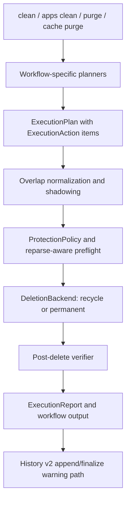
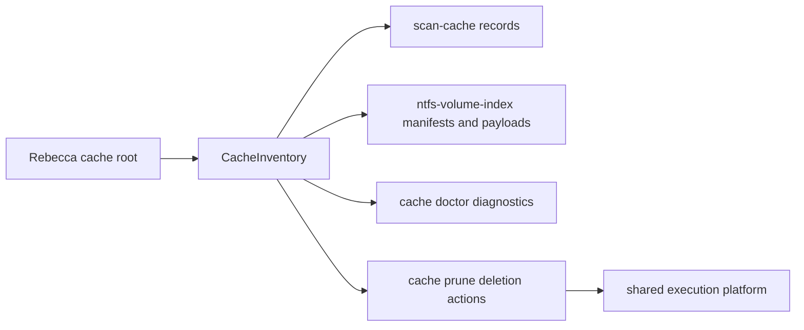

# Cleanup Execution Platform - Plan

## Goal Capsule

Build Rebecca's cleanup/delete layer into one auditable execution platform for `clean`, `apps clean`, `purge`, `cache purge`, cache diagnostics, performance evidence, and rule safety gates.

This plan assumes fearless refactoring is allowed: existing internal APIs may break, duplicate legacy models may be deleted, and CLI machine output may move to a cleaner v1 shape where the current behavior blocks correctness. The non-negotiable boundary is safety: preview-first operation, recoverable-by-default cleanup, rule provenance, and protected-path enforcement must get stricter, not weaker.

## Product Contract

### Problem Frame

Rebecca already has strong ingredients: a preview-first planner, Windows recoverable trash execution, protected-path checks, scan-cache evidence, NTFS persistent cache diagnostics, rule-catalog provenance gates, and benchmark scripts. The weak point is that these pieces are not yet one coherent cleanup platform.

The current execution layer mutates `CleanupPlan` targets directly, `cache purge` uses a separate deletion/report model, history append failures can mask already-performed deletion, parent/child cleanup targets can double-count reclaim estimates, and performance evidence is not yet a stable baseline gate. The rule catalog also has strong load-time checks, but some filesystem discovery and execution paths are still too dependent on final-target validation instead of traversal-safe behavior.

### Requirements

R1. Deletion execution must have one shared domain model for cleanup, app leftovers, project purge, and cache purge.

R2. Every executable item must produce an auditable action ledger: preflight, dispatch attempt, backend result, post-delete verification, and final classification. The execution report must also record final reporting and history/report persistence outcomes.

R3. Execution reports must distinguish logical estimate, recoverable pending bytes, confirmed reclaimed bytes, skipped bytes, failed bytes, shadowed-by-parent bytes, partial backend success, verification warnings, and history-write warnings.

R4. A plan containing parent/child delete overlap must not double-count or execute both as independent reclaim. It must merge, shadow, or block with a typed reason.

R5. History persistence must not turn a completed deletion into an indistinguishable command failure. History write failure must be reported as an execution warning with enough context to diagnose.

R6. Cache purge must reuse the same deletion executor, safety policy, recoverability model, and report vocabulary as other cleanup workflows.

R7. Cache lifecycle diagnostics must expose read-only inventory for scan cache and NTFS volume-index cache: namespace, records, payload pairing, schema/generation, age, bytes, corrupt/stale/missing state, and safe prune recommendations.

R8. Cache pruning must become targeted and preview-first, not only all-or-nothing purge. Namespace and stale-only pruning must be supported without weakening cache-root boundaries.

R9. Scan and performance evidence must become structured enough for automated comparison. Benchmark and dogfood reports must be comparable against a baseline with pass/regression/missing classifications.

R10. Filesystem discovery and preserve-root deletion must be reparse-aware at traversal, child enumeration, and dispatch boundaries, not only at final resolved target assessment.

R11. Built-in rule quality gates must require positive target-shape basis, structured provenance, warning-basis lint, and fixture coverage for new rule families.

R12. Documentation, changelog, and CLI API examples must describe the new execution report, cache diagnostics, and rule safety guarantees.

R13. Cache, execution, history, dogfood, and issue-report outputs must define a local-path redaction boundary so diagnostics are useful without accidentally exposing sensitive local paths or disk structure.

### Scope Boundaries

In scope:

- `rebecca-core` execution domain and safety revalidation.
- `rebecca` CLI wiring/rendering for cleanup and cache commands.
- `rebecca-windows` recoverable trash backend semantics.
- Cache inspect/doctor/prune inventory and reports.
- Performance baseline comparison scripts and self-tests.
- Rule-catalog linting, fixture expectations, and reparse hardening.
- README, changelog, and CLI API documentation updates.

Out of scope for this plan:

- GUI/TUI workflow.
- Auto-elevation, process killing, or privileged cleanup automation.
- Making NTFS persistent volume-index cache default for all users.
- Copying rule data or implementation from GPL/reference projects.
- Programmatic restore from recoverable trash item IDs. The new report may prepare for this, but full restore is a separate feature.

## Planning Contract

### Context and Research

Repo evidence:

- `crates/rebecca-core/src/executor.rs` currently owns cleanup execution, revalidation, overlap batching, and backend dispatch for `CleanupPlan`.
- `crates/rebecca-core/src/cache.rs` owns `cache purge` through a separate `CachePurgeReport` and `CachePurgeBackend`.
- `crates/rebecca/src/clean.rs` wires `clean`, `apps clean`, and `purge` to the executor, then appends history.
- `crates/rebecca-windows/src/lib.rs` implements both cleanup and cache purge deletion through `trash`.
- `crates/rebecca-core/src/scan_cache.rs` and `crates/rebecca-core/src/scan_cache/store.rs` already track scan-cache miss and freshness reasons, but there is no user-facing cache inventory.
- `crates/rebecca/src/inspect.rs` and `crates/rebecca-core/src/scan/windows_ntfs_mft.rs` already expose NTFS persistent-cache diagnostics through caveats and dogfood scripts.
- `crates/rebecca-rules/src/lib.rs` already enforces owned provenance, platform, slug, restore hint, and safety-catalog warnings for built-ins.
- `crates/rebecca-core/src/discovery.rs` and `crates/rebecca-windows/src/lib.rs` are the safety-sensitive traversal/deletion boundaries that need reparse-aware hardening.
- `docs/adr/0007-rule-catalog-and-license-provenance.md` and `docs/rule-authoring.md` define the license/provenance boundary.
- `docs/adr/0008-configuration-and-local-state-model.md` defines cache/state/history preservation and cache purge expectations.

Reference-project influence remains behavior-only. GPL/LGPL projects under `repo-ref/` may inform edge cases and validation posture, but no code, TOML rules, or text should be copied.

### Key Technical Decisions

KTD1. Replace workflow-specific deletion result models with a shared execution domain in `rebecca-core`.

Rationale: `CleanupPlan` and `CachePurgeReport` currently encode overlapping ideas with different names. That makes safety, history, and rendering drift likely. A shared model gives one vocabulary for backend attempts, recoverability, verification, and warnings.

KTD2. Model execution as action-level phases, not as direct target mutation.

Rationale: a cleanup target is a planned intent; an execution action is an operation against concrete paths. Parent/child overlap, preserve-root children, backend partial success, and post-delete verification all need action-level evidence that does not fit cleanly into target mutation.

KTD3. Treat cache purge as a workflow that builds deletion actions, not as a special deletion system.

Rationale: cache purge has unique inventory and policy inputs, but deletion safety should be the same platform as every other Rebecca deletion.

KTD4. Preserve recoverable-by-default behavior and keep permanent deletion explicit.

Rationale: the project identity is preview-first and recoverable trash by default. Permanent delete remains valid for rebuildable cache prune/purge only when explicitly requested.

KTD5. Use structured evidence first, caveat text second.

Rationale: current performance and NTFS evidence is often embedded in human caveats and extracted by scripts. New diagnostics should expose structured fields while keeping caveats for compatibility and human display.

KTD6. Shift built-in rule approval from negative-only checks to positive basis checks.

Rationale: "not blocked" is weaker than "known safe because it matches a cataloged target shape." New rule families should prove their target basis, warning basis, and fixture coverage.

KTD7. Harden traversal boundaries before adding more rule breadth.

Rationale: a larger catalog increases the blast radius of glob mistakes. Reparse-aware discovery and preserve-root child filtering are prerequisite safety work.

### Delivery Slicing

P0 is a user-path checkpoint, not only an internal foundation. The P0 checkpoint is complete only when:

- The shared execution domain exists.
- Parent/child overlap and reparse/dispatch safety are enforced.
- History write failures are warning-based.
- At least the core `clean`/`purge` execution path and existing `cache purge` path consume `ExecutionReport`.

P1 expands that platform to app leftovers, cache inspect/doctor/prune, structured performance evidence, and rule quality gates. P2 is documentation polish and broader release evidence after the user-visible API changes are already documented at their source units.

### High-Level Technical Design

This diagram is a guide, not an exact module prescription.

Shared execution concepts:

- `ExecutionPlan`: workflow id, delete mode, recoverability policy, action list, expected estimate totals, and plan-level warnings.
- `ExecutionAction`: concrete delete intent such as delete whole path, delete root contents, or delete selected cache record files.
- `ExecutionItemEvidence`: original target id/category, estimate provenance, safety basis, cache namespace, rule id, or app identity.
- `ExecutionAttempt`: attempted paths, backend, capability used, backend error kind, partial flag, and recoverability.
- `ExecutionVerification`: expected state after deletion, observed state, warning/error reason, and bytes classification.
- `ExecutionReport`: phase ledger plus summary matrices consumed by CLI, history, and tests.
- `DiagnosticPath`: output boundary that distinguishes absolute local paths, redacted display paths, and opaque identifiers for JSON/dogfood/reporting surfaces.

### Implementation Units

#### U1. Shared Execution Domain

Priority: P0

Goal: Introduce one `rebecca-core` execution domain that can represent cleanup targets and cache purge entries without duplicating deletion semantics.

Files:

- `crates/rebecca-core/src/executor.rs`
- `crates/rebecca-core/src/plan.rs`
- `crates/rebecca-core/src/model.rs`
- New `crates/rebecca-core/src/execution.rs` if it keeps the refactor clearer
- `crates/rebecca-core/tests/executor_contract.rs`

Approach:

- Add action-level types for execution plan, action, attempted path, recoverability, backend error kind, verification state, and report summary.
- Keep workflow planners free to build their own preview plans, then convert executable targets to execution actions.
- Replace loose backend notes with typed warnings and caveats.
- Keep serialization stable enough for CLI tests, but remove legacy fields that exist only to preserve the old internal split.

Test scenarios:

- A successful action records preflight, attempt, verification, and final summary.
- A backend failure records attempted paths and does not abort unrelated actions.
- A partial backend result is visible in the report and summary.
- A dry run never builds backend attempts.
- Unsupported backend capability yields a typed failure reason.

#### U2. Parent/Child Overlap Normalization

Priority: P0

Goal: Prevent double execution and double accounting when a plan contains overlapping delete actions.

Files:

- `crates/rebecca-core/src/executor.rs`
- `crates/rebecca-core/src/plan.rs`
- `crates/rebecca-core/tests/executor_contract.rs`

Approach:

- Normalize executable actions before batching.
- If a child is fully covered by a parent action, mark the child as `shadowed-by-parent` with skipped/reclaimed accounting handled once.
- If preserve-root semantics make overlap ambiguous, block the unsafe pair with a typed overlap reason rather than guessing.
- Reuse normalized action groups for serial, parallel, and batch backends.

Test scenarios:

- Parent whole-path action shadows child file and counts bytes once.
- Preserve-root parent plus child action is either safely ordered with no double count or blocked with a typed reason.
- Batch grouping still keeps non-overlapping actions parallelizable.
- Output issue matrix includes overlap/shadow reasons.

#### U3. History v2 and Post-Delete Reporting

Priority: P0

Goal: Make history persistence auditable without misreporting already-performed deletion.

Files:

- `crates/rebecca-core/src/history.rs`
- `crates/rebecca-core/tests/history.rs`
- `crates/rebecca/src/clean.rs`
- `crates/rebecca/src/output.rs`
- `crates/rebecca/tests/cli_history.rs`
- `crates/rebecca/tests/cli_clean.rs`

Approach:

- Add a history append result that can be attached to execution output as a warning.
- Make reader behavior tolerant of isolated bad JSONL lines when possible, while surfacing corruption diagnostics.
- Keep this pass focused on warning-based append failure, tolerant reads, and necessary atomic record writes. Pending/final journaling is a follow-up outside this plan.
- Ensure command exit status reflects deletion failures, not merely post-delete reporting failures.

Test scenarios:

- Backend succeeds and history append fails: command output reports completed deletion plus history warning.
- Corrupt existing history line does not make all later valid history unreadable.
- Concurrent append behavior is either locked or produces a deterministic warning path.

#### U4. Reparse-Aware Discovery and Execution Safety

Priority: P0

Goal: Enforce the "do not follow reparse points" safety promise during discovery traversal and preserve-root child deletion.

Files:

- `crates/rebecca-core/src/discovery.rs`
- `crates/rebecca-core/src/protection.rs`
- `crates/rebecca-windows/src/lib.rs`
- `crates/rebecca-core/tests/discovery.rs`
- `crates/rebecca-core/tests/safety_policy.rs`
- `crates/rebecca-windows/tests/recycle_bin.rs`

Approach:

- Check each recursive glob traversal segment for symlink/junction/reparse status before descending.
- Add a typed skip reason for reparse traversal boundaries.
- In `PreserveRootContents`, enumerate children and filter/block reparse children before sending paths to `trash::delete_all`.
- Immediately before backend dispatch, revalidate each attempted path without following reparse points, including canonical/root boundary and file-type checks where the platform exposes them.
- If a preserve-root child changes into a reparse point or protected near-miss between enumeration and dispatch, fail closed for that child and record a typed warning/failure.
- Keep platform-neutral tests for symlink behavior and Windows-specific tests for junction/reparse behavior where feasible.

Test scenarios:

- Glob discovery skips a symlinked intermediate directory.
- Protected near-miss behind a reparse parent is not yielded as an allowed target.
- Preserve-root deletion leaves or blocks reparse children and reports why.
- A child replaced by symlink/junction after preflight but before dispatch is blocked or reported as failed closed.
- Non-reparse children still delete normally.

#### U5. Migrate Cleanup/App/Purge Workflows

Priority: P0 for the minimum `clean`/`purge` migration; P1 for the full app-leftover migration.

Goal: Move user-facing cleanup workflows onto the shared execution report without keeping compatibility shims that preserve the old mutation model.

Files:

- `crates/rebecca/src/clean.rs`
- `crates/rebecca/src/apps.rs`
- `crates/rebecca/src/purge.rs`
- `crates/rebecca/src/output.rs`
- `crates/rebecca-core/src/executor.rs`
- `crates/rebecca/tests/cli_clean.rs`
- `crates/rebecca/tests/cli_apps.rs`
- `crates/rebecca/tests/cli_purge.rs`

Approach:

- Convert executable `CleanupTarget`s into execution actions after preview/confirmation.
- Render execution summaries from `ExecutionReport`.
- Remove duplicated per-target mode checks that are no longer meaningful after the action model exists.
- Do not introduce a new NDJSON execution-event model in this unit. Streaming execution events are a follow-up after `ExecutionReport` stabilizes.

Test scenarios:

- Dry-run output remains preview-only.
- Confirmed cleanup reports completed, skipped, failed, pending, and warning counts from `ExecutionReport`.
- App leftover metadata failures are distinct from missing paths.
- Project purge safety blocks still appear before backend execution.

#### U6. Fold Cache Purge into the Execution Platform

Priority: P0 for existing `cache purge`; P1 for targeted cache prune integration.

Goal: Delete the separate cache purge deletion model and build cache purge/prune on top of shared execution actions.

Files:

- `crates/rebecca-core/src/cache.rs`
- `crates/rebecca/src/cache.rs`
- `crates/rebecca/src/cache_view.rs`
- `crates/rebecca/tests/cli_cache.rs`
- `crates/rebecca-windows/src/lib.rs`

Approach:

- Keep cache inventory and policy in `cache.rs`, but delegate deletion actions to the shared executor.
- Preserve `RecoverableDelete` and `PermanentDelete` as explicit cache policy choices.
- Reuse `ProtectionPolicy` and Rebecca-owned path safeguards for cache deletion.
- Remove `CachePurgeBackend` if `DeletionBackend` can express the needed behavior.

Test scenarios:

- Cache purge preview produces an execution plan without backend attempts.
- Recoverable cache purge uses the recoverable trash backend and reports pending bytes.
- Permanent cache purge deletes only approved cache entries.
- Preserved config/state/history overlap is blocked.
- Symlink cache entries are skipped with a typed reason.

#### U7. Cache Inspect, Doctor, and Targeted Prune

Priority: P1

Goal: Give users and release scripts a read-only view of Rebecca-owned caches and a safer alternative to full purge.

Files:

- `crates/rebecca-core/src/cache.rs`
- `crates/rebecca-core/src/scan_cache.rs`
- `crates/rebecca-core/src/scan_cache/store.rs`
- `crates/rebecca/src/cli.rs`
- `crates/rebecca/src/cache.rs`
- `crates/rebecca/src/cache_view.rs`
- `crates/rebecca/tests/cli_cache.rs`
- `README.md`
- `docs/api/cli/v1/README.md`
- `docs/api/cli/v1/payloads.schema.json`
- `docs/api/cli/v1/examples/*.json`

Approach:

- Add a `CacheInventory` model with namespaces `scan-cache`, `ntfs-volume-index`, and `all`.
- Add `cache inspect` for inventory output and `cache doctor` for diagnostics/recommendations.
- Add `cache prune --namespace ... --stale-only --limit ...` with dry-run default and shared executor execution after confirmation.
- Treat NTFS volume-index cache as rebuildable but sensitive local metadata; do not print full payload content.
- Define output policy for cache and execution diagnostics: human output may shorten home/cache roots, JSON must label absolute paths versus redacted display paths, and dogfood/report examples should default to redacted values unless a verbose/debug flag explicitly asks for full local paths.

Test scenarios:

- Empty cache reports zero records without error.
- Valid scan-cache record reports namespace, root, backend/source, age, and bytes.
- Corrupt JSON reports a corrupt record diagnostic.
- Missing NTFS payload reports manifest/payload mismatch.
- Stale-only prune selects only stale/corrupt records and respects limit.
- JSON and human reports expose the intended path-redaction fields without leaking payload contents.

#### U8. Structured Scan Evidence and Performance Baseline Comparison

Priority: P1

Goal: Make scan/cache/delete performance evidence machine-comparable instead of regex-based and ad hoc.

Files:

- `crates/rebecca-core/src/scan.rs`
- `crates/rebecca-core/src/scan/backend.rs`
- `crates/rebecca-core/src/plan.rs`
- `crates/rebecca-core/src/scan/windows_ntfs_mft.rs`
- `crates/rebecca-core/benches/perf_matrix.rs`
- `scripts/perf/run-benchmark-matrix.ps1`
- New `scripts/perf/compare-benchmark-matrix.ps1`
- `scripts/dogfood/run-inspect-map-report.ps1`

Approach:

- Add structured backend evidence for timings, cache hit/miss/write-skip reasons, traversal counters, and confidence.
- Keep caveats for human output, but stop depending on caveat regex as the primary evidence path.
- Extend perf matrix output with baseline comparison fields.
- Add a synthetic self-test for the comparator covering pass, regression, improvement, skipped, and missing scenarios.

Test scenarios:

- Structured scan evidence round-trips through JSON output.
- NTFS cache miss/write-skip reasons appear as structured fields.
- Comparator self-test flags a scenario beyond threshold as regression.
- Missing baseline/current scenarios are classified without crashing.

#### U9. Rule Catalog Safety Gates and Fixture Matrix

Priority: P1

Goal: Raise built-in rule acceptance from "loads safely" to "proves safe target shape, provenance, warnings, and fixtures."

Files:

- `crates/rebecca-rules/src/lib.rs`
- `crates/rebecca-rules/rules/windows/**/*.toml`
- `crates/rebecca-rules/safety/windows.toml`
- `crates/rebecca-core/src/protection.rs`
- `crates/rebecca-core/tests/planner.rs`
- `crates/rebecca/tests/cli_catalog.rs`
- `docs/rule-authoring.md`
- `docs/adr/0007-rule-catalog-and-license-provenance.md`

Approach:

- Add positive target-shape basis for built-in targets.
- Add glob-shape lint for wildcard count, wildcard depth, profile-root wildcards, drive-root wildcards, and broad library traversal.
- Add structured provenance references while keeping current notes checks as a transition validator.
- Auto-require warnings from target shape where possible: broad discovery, source boundary, privileged location, durable-state-nearby, and active process.
- Generalize the Steam fixture pattern into a rule fixture matrix for major rule families.

Test scenarios:

- Built-in rule without target basis fails validation.
- Wide `%USERPROFILE%\\*` style glob fails validation.
- GPL/reference-derived provenance without explicit no-copy role fails validation.
- Shape that implies broad discovery requires the matching warning.
- Fixture matrix catches positive path, near-miss durable path, and protected near-miss.

#### U10. Documentation, Changelog, and API Contract Update

Priority: P1 for changelog/API examples tied to breaking output; P2 for broader README/release polish.

Goal: Make the new behavior discoverable and keep release notes honest.

Files:

- `CHANGELOG.md`
- `README.md`
- `docs/configuration.md`
- `docs/rule-authoring.md`
- `docs/api/cli/v1/*.md`
- `docs/release.md`

Approach:

- Update unreleased changelog entries in the same implementation slice that changes shared execution reports, cache inspect/doctor/prune, perf baseline comparison, or rule safety hardening.
- Document breaking machine-output changes where old fields are removed or renamed before the related CLI/API tests are considered complete.
- Add examples for history warnings, verification warnings, cache doctor JSON, and benchmark comparison output.
- Document the local-path redaction policy and mark fields that may contain sensitive local paths when verbose/debug output is requested.
- Restate the GPL/reference boundary for rule work.

Test scenarios:

- CLI docs examples match actual JSON keys used by tests.
- Changelog `Unreleased` includes user-visible changes and breaking notes.
- README still emphasizes preview-first and recoverable-by-default behavior.

### System-Wide Impact

Execution:

- `CleanupPlan` remains a preview artifact; `ExecutionReport` becomes the source of truth after deletion.
- CLI renderers will need to consume report summaries instead of reading mutated target fields in multiple places.
- History entries should include enough execution evidence to explain what happened even if later cache/rule code changes.

Safety:

- Reparse-aware traversal affects glob discovery results and may reduce discovered targets. This is expected.
- Parent/child normalization may reduce estimated reclaim bytes compared with previous output. This is correctness, not regression.
- Cache prune introduces a new deletion surface, so it must inherit the same preview/confirmation and protection gates.
- Diagnostic output introduces a local-information exposure surface, so paths and NTFS/cache identifiers need explicit absolute/redacted/debug field boundaries.

Performance:

- More structured evidence can add small overhead if collected unconditionally. Counters should be cheap and avoid per-file string-heavy diagnostics on hot paths.
- The comparator self-test is a required development gate. Real baseline comparison is a release/dogfood gate when baseline and current benchmark artifacts are available; absence of real artifacts should be reported as missing, not silently passed.

API:

- Machine output may break where legacy cache purge and cleanup reports had different shapes. The new API should be simpler and documented as a v1 cleanup report reset if needed.

### Risks and Mitigations

Risk: Refactoring execution and cache purge together creates a large diff.

Mitigation: Land in units with characterization tests first. Keep a temporary adapter only inside the branch when needed, then delete it before final DoD.

Risk: History/journal design can become too ambitious.

Mitigation: Keep pending/final journaling out of this plan. The required fix is warning-based append failure, tolerant reads, and necessary atomic record writes.

Risk: Structured scan evidence may duplicate caveat fields.

Mitigation: Treat structured fields as canonical and keep caveats as human display. Tests should assert structured fields first.

Risk: Rule positive-basis DSL can overfit current rules.

Mitigation: Start with explicit basis categories that match existing families, then fail closed for new families until fixtures prove them.

Risk: Windows reparse behavior is hard to test on non-Windows CI.

Mitigation: Add platform-neutral symlink tests where possible and Windows-only junction/reparse integration tests under `rebecca-windows`.

### Verification Contract

Targeted gates:

- `cargo fmt --all -- --check`
- `cargo nextest run -p rebecca-core --test executor_contract`
- `cargo nextest run -p rebecca-core scan_cache`
- `cargo nextest run -p rebecca-core --test discovery`
- `cargo nextest run -p rebecca-core --test safety_policy`
- `cargo nextest run -p rebecca --test cli_clean`
- `cargo nextest run -p rebecca --test cli_apps`
- `cargo nextest run -p rebecca --test cli_purge`
- `cargo nextest run -p rebecca --test cli_cache`
- `cargo nextest run -p rebecca --test cli_catalog`
- `cargo nextest run -p rebecca-rules`
- `cargo nextest run -p rebecca-windows --test recycle_bin`
- `pwsh -File scripts\perf\compare-benchmark-matrix.ps1 -SelfTest`

Final gates:

- `cargo clippy --workspace --all-targets -- -D warnings`
- `cargo nextest run --workspace --locked`
- `cargo deny check`
- `cargo run -p rebecca --locked -- catalog validate --format json`

Dogfood gates when local time permits:

- `pwsh -File scripts\dogfood\run-inspect-map-report.ps1 -SelfTest`
- `pwsh -File scripts\dogfood\run-ntfs-usn-replay-dogfood.ps1 -SelfTest`
- Run at least one real `cache inspect --format json` and one dry-run cleanup command on the current machine.

### Definition of Done

- Cleanup, app cleanup, project purge, cache purge, and cache prune use the shared execution report model.
- No duplicated cache-specific deletion backend remains unless it is a thin platform adapter with no separate report semantics.
- Parent/child overlap cannot double-count reclaim or execute ambiguous overlapping deletion.
- History write failure after deletion is reported as a warning and does not hide completed execution.
- Glob discovery and preserve-root child deletion do not follow reparse points.
- Dispatch immediately revalidates attempted paths so preflight-to-delete races fail closed where the platform can observe them.
- `cache inspect`, `cache doctor`, and targeted `cache prune` exist with JSON and human output.
- Cache/execution/history diagnostics define and use a local-path redaction policy.
- Benchmark comparison has a self-test and can classify pass/regression/missing scenarios.
- Rule validation enforces positive target basis, structured provenance, warning basis, and fixture coverage for new rule families.
- `CHANGELOG.md`, README, and CLI API docs describe the new behavior and breaking output changes.
- Targeted and final verification gates pass or any remaining failure is documented with a concrete blocker.

### Open Questions

Resolved during planning:

- Should cache purge remain separate? No. It can keep cache-specific inventory, but deletion/report semantics should be shared.
- Should permanent deletion become general-purpose? No. Keep it explicit and scoped to rebuildable cache operations in this plan.
- Should rule expansion happen before safety hardening? No. Reparse and positive-basis gates come first.

Deferred to implementation:

- Whether a future History v3 should add pending/final journaling after warning-based append failure and tolerant reads have landed.
- Whether NDJSON execution events should become a separate follow-up after the shared report is stable.
