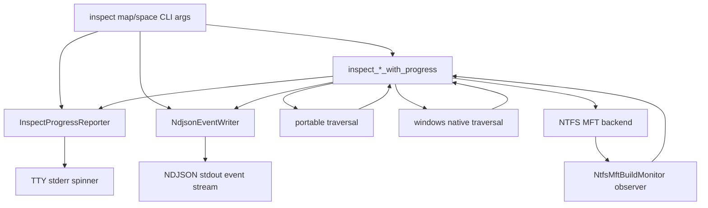

# Inspect Progress Observability - Plan

## Goal Capsule

| Field | Decision |
|---|---|
| Objective | Make `inspect map` and `inspect space` observable during long scans with first-class typed progress from core scanning, Windows native traversal, and NTFS MFT stages. |
| Authority | The Product Contract in this plan is the behavior contract; current CLI and API docs are implementation evidence but may be broken where this plan names a stronger contract. |
| Execution profile | Fearless refactor on `main`; remove stale compatibility code when it blocks a clean progress model. |
| Stop conditions | Stop only for a scope contradiction, a test environment blocker that prevents validation of changed behavior, or a finding that would require redesigning deletion safety rather than progress observability. |
| Tail ownership | Commit and push directly to `main` when the implementation is verified, matching the user's repository preference. |

---

## Product Contract

### Summary

Rebecca's cleanup workflows now show useful progress, but `inspect map` and `inspect space` still behave like black boxes during the scans that matter most for a "best cleanup CLI" experience.
This plan makes inspect progress a real domain contract: the core emits typed scan, backend, fallback, cache, and MFT stage events; the CLI renders compact stderr progress for humans; machine users receive structured NDJSON lifecycle events without stdout pollution in JSON, table, or human report modes.

### Problem Frame

The current `inspect space` code computes `_progress_enabled` but never wires a reporter, and `inspect map` has no progress flags at all.
The disk-map backend also has the strongest low-level signals in the NTFS MFT monitor, but those signals are only used for timeout caveats and evidence.
This leaves large-drive scans looking stalled, makes wrappers wait until completion for feedback, and hides the slowest MFT phases from users who need to understand what the CLI is doing.

### Requirements

**Human CLI behavior**

- R1. `inspect map` and `inspect space` show compact human progress for long scans only when output mode is `human`, the command is rendering a human report rather than raw table rows, stderr is a TTY, and `--no-progress` is absent.
- R2. Human progress writes only to stderr, never to stdout, so human reports, JSON envelopes, NDJSON streams, and raw table exports remain parseable.
- R3. `--no-progress` is accepted by both `inspect map` and `inspect space`; it disables only the human stderr spinner and does not suppress NDJSON machine progress.
- R4. `--progress-detail target|file` is accepted by both `inspect map` and `inspect space`; `target` is bounded root/backend/entry progress and `file` adds throttled file-level scan detail.

**Machine output behavior**

- R5. `inspect map --format ndjson` and `inspect space --format ndjson` emit lifecycle and bounded target-level progress before final report events, with monotonically increasing sequence numbers, replacing the current final-only inspect NDJSON stream.
- R6. `--progress-detail file` adds file-level NDJSON progress only when explicitly requested; default NDJSON progress stays bounded for large disks.
- R7. `--format json`, `inspect map --table csv|tsv`, and normal human stdout output do not include progress text or progress JSON fragments.

**Core and backend behavior**

- R8. Core inspect progress is represented by typed events independent from terminal UI and does not depend on `indicatif`.
- R9. Calling inspect with no progress sink produces the same `SpaceInsightReport` or `DiskMapReport` as calling it with a sink, apart from event observation.
- R10. Windows native and portable disk-map traversal emit root, fallback, file/directory counter, and completion progress without materially slowing hot paths.
- R11. NTFS MFT progress reuses `NtfsMftBuildMonitor` stage labels and metrics so users see real phases such as `open-volume`, `sequential-read-mft-bytes`, `sequential-parse-records`, and `build-mft-index`.

**Documentation and validation**

- R12. CLI help, README, API v1 docs, and `CHANGELOG.md` describe the inspect progress contract; no final-only NDJSON compatibility mode is retained because the CLI has not been released.
- R13. Tests cover progress event ordering, stdout/stderr separation, formatter helpers, no-sink report parity, and MFT monitor observer safety without requiring a live NTFS volume.

### Acceptance Examples

- AE1. Running `rebecca inspect map --root <drive-root>` in an interactive terminal shows messages like `map | root 1/1 | walking ...`, `mft | sequential-read-mft-bytes | 512 MiB`, and `map | files 120000 | dirs 8000 | 42.0 GiB` on stderr while the final ranked map remains on stdout.
- AE2. Running `rebecca inspect space --format json --root .` prints a single JSON success envelope to stdout and no human progress text.
- AE3. Running `rebecca inspect map --format ndjson --root . --progress-detail file` produces `started`, bounded inspect progress, optional file progress, `inspect-map-entry` or `inspect-map-group`, and `completed` events with strictly increasing sequence numbers.
- AE4. Running `rebecca inspect map --table csv --root .` prints raw CSV rows to stdout and never mixes spinner text into the table.
- AE5. Calling `inspect_map` and `inspect_map_with_progress` on the same fixture returns identical totals, top entries, groups, diagnostics, and backend provenance.

### Scope Boundaries

- This plan does not change deletion authorization, cleanup rule safety, or purge behavior.
- This plan does not implement new MFT correctness features such as `$ATTRIBUTE_LIST`, `$I30`, or runlist readers except where existing MFT stages need observation.
- This plan does not add a full TUI, dashboard, ETA guarantee, or exact percentage for recursive scans whose total work is unknown.
- This plan keeps `indicatif` unless implementation proves it cannot satisfy stderr TTY progress; adding another progress crate is out of scope.

### Sources

- `crates/rebecca/src/clean.rs` has the current stderr TTY spinner, cleanup NDJSON progress, file throttling, and message helper tests to follow.
- `crates/rebecca/src/inspect.rs` has the unused `inspect space` progress gate and the `inspect map` report rendering surface to wire.
- `crates/rebecca-core/src/inspect.rs` and `crates/rebecca-core/src/disk_map.rs` are the core inspect entry points that need no-sink wrappers plus progress-aware variants.
- `crates/rebecca-core/src/scan/windows_ntfs_mft.rs` already tracks MFT build stages and metrics through `NtfsMftBuildMonitor`.
- `docs/api/cli/v1/README.md` defines stdout/stderr and NDJSON API v1 conventions that must be updated with the new inspect stream behavior.

---

## Planning Contract

### Key Technical Decisions

- KTD1. Create inspect-specific progress events instead of expanding cleanup `PlanProgressEvent`, because cleanup rule/target status does not model disk-map roots, cache hits, backend fallbacks, or MFT build stages.
- KTD2. Keep terminal rendering in the CLI crate and expose only typed core events from `rebecca-core`, so library callers can observe progress without inheriting `indicatif` or stderr behavior.
- KTD3. Add progress-aware functions such as `inspect_space_with_progress` and `inspect_map_with_progress`, with existing no-progress functions as thin wrappers, so no-sink parity is easy to test when the progress sink succeeds.
- KTD4. Route backend-specific progress through a scan backend progress layer, then adapt it into inspect progress, so MFT stage/metric events do not force disk-map and space insight to invent separate backend bridges.
- KTD5. Break inspect NDJSON directly to stream lifecycle/progress by default, because the CLI has not been released and machine users need long-running feedback more than the current final-only inspect stream.
- KTD6. Bound default progress volume at root, entry, backend, cache, and sampled counter granularity; reserve per-file event streams for `--progress-detail file`.
- KTD7. Use `NtfsMftBuildMonitor` as the single MFT progress source and emit observer callbacks outside active `RefCell` borrows to avoid reentrant borrow panics.
- KTD8. Treat progress sinks as fallible observers: a returned error aborts the active command with context, a panic is not caught, and successful observers must not change the computed report.
- KTD9. Extract only genuinely shared CLI progress primitives from cleanup, such as spinner style, path compaction, byte/rate formatting, and throttling, while keeping cleanup and inspect domain reporters separate.

### High-Level Technical Design

The progress sink should be a lightweight callback receiving borrowed paths where possible and copied counters for metrics.
The CLI adapts that callback into two independent consumers: a human reporter enabled only for human-mode TTY stderr and an NDJSON writer enabled only for `--format ndjson`.
JSON and table modes may call progress-aware core functions for no-sink parity, but they pass no output sink and never render progress.

### Output Mode Activation Matrix

| Mode | Human stderr spinner | NDJSON progress events | Final stdout | `--no-progress` effect | `--progress-detail` effect |
|---|---|---|---|---|---|
| `human` report | Enabled only when stderr is TTY | Disabled | Human report | Disables spinner | `file` enables more detailed spinner messages; `target` stays bounded |
| `human` table | Disabled for table exports | Disabled | CSV or TSV rows only | No effect | No effect |
| `json` | Disabled | Disabled | One success envelope or one error envelope | No effect | No effect |
| `ndjson` | Disabled | Enabled | Event stream | Does not suppress machine progress | `target` emits bounded progress; `file` adds per-file scan events |

### Inspect NDJSON Event Contract

The current final-only inspect NDJSON behavior is replaced in place; old final-only tests should be rewritten or deleted instead of preserved behind compatibility flags.

| Event kind | Payload kind | Commands | Default emission | File-detail emission | Ordering |
|---|---|---|---|---|---|
| `started` | `inspect-map` or `inspect-space` | map, space | Yes | Yes | First event |
| `inspect-progress` | `inspect-progress` | map, space | Root start/finish, entry measured, fallback, cache decision, backend stage start/finish, sampled counters | Same plus file-level scan counters | After `started`, before final report rows and `completed` |
| `inspect-map-entry` | `inspect-map-entry` | map | Yes when top entries exist | Yes | After scan progress |
| `inspect-map-group` | `inspect-map-group` | map | Yes when groups exist | Yes | After map entries |
| `completed` | `inspect-map` or `inspect-space` | map, space | Yes | Yes | Last success event |
| `error` | `inspect-map` or `inspect-space` | map, space | Yes on failure | Yes on failure | Last failure event |

### Default Progress Event Budget

| Event family | Default budget | `--progress-detail file` budget |
|---|---|---|
| Root lifecycle | Start and finish per requested root | Same |
| Entry measurement | Start/finish per top-level entry for `inspect space`; sampled traversal counters for `inspect map` | Same plus file events |
| Portable/native file counters | Power-of-two milestones for files, directories, and bytes, plus final counters | Every measured file may produce a file event, with human rendering still throttled |
| Cache progress | One event per cache hit, miss, write, or write-skip decision that already affects provenance | Same |
| Backend fallback | One event per fallback decision | Same |
| MFT stage lifecycle | Start and finish per `NtfsMftBuildStage` | Same |
| MFT metrics | Power-of-two milestones per metric family, plus stage finish summaries | Same plus finer file/record counters when already available |

This budget keeps default machine progress sublinear in file count for traversal counters.
Human stderr rendering has an additional time throttle so repeated progress events do not redraw on every callback.

### Observer Contract

Progress callbacks are observers, not control-flow owners.
A successful callback must not change the report, totals, diagnostics, provenance, or cancellation behavior.
A callback may return an error; the active inspect command should abort with that error and enough context to show output failed rather than scan correctness failed.
Panics are not caught.
Callbacks must be called outside active `RefCell` borrows or other interior mutable monitor state.
Backend observers should emit small copied metrics or borrowed paths with lifetimes scoped to the callback and must not perform recursive scan calls.

### Sequencing

Build the shared CLI progress primitives first, then add the core progress model and no-sink parity tests.
Wire `inspect space` before `inspect map` because its traversal chain is smaller and proves the event shape.
Wire `inspect map` portable/native progress next, then bridge MFT stages through the same event model.
Update NDJSON, docs, and changelog after the event names settle.

### Risks & Mitigations

| Risk | Mitigation |
|---|---|
| Inspect NDJSON tests currently assume the first event is `inspect-map-entry`. | Delete or rewrite final-only assumptions, update API v1 docs and changelog, and require kinded payloads with monotonic sequence. |
| Hot recursive traversal could slow down if every path allocates a `String` or triggers UI work. | Emit borrowed-path events where possible, enforce the default event budget, sample counters in core, and let CLI throttle human rendering again. |
| MFT monitor callbacks could panic through nested `RefCell` borrows or turn output failure into ambiguous scan failure. | Capture small observer payloads while borrowed, drop the borrow, then call the observer; document fallible observer behavior and add monitor observer tests. |
| TTY progress is hard to assert in integration tests. | Keep formatter and throttling as pure helpers with unit tests; use CLI integration tests to prove flags and machine stdout contracts. |
| File-level NDJSON can be very large. | Keep it opt-in through `--progress-detail file` and document that it is for debuggers, wrappers, and GUI integrations. |

---

## Implementation Units

### U1. Shared CLI Progress Primitives

- **Goal:** Extract reusable progress UI primitives without merging cleanup and inspect domain semantics.
- **Requirements:** R1, R2, R7, R13; KTD9.
- **Files:** Modify `crates/rebecca/src/clean.rs`; create or modify `crates/rebecca/src/progress.rs`; modify `crates/rebecca/src/main.rs` if a module export is needed.
- **Patterns:** Follow existing `PlanProgressReporter`, `HumanFileProgressThrottle`, compact path formatting, and byte/rate formatting in `crates/rebecca/src/clean.rs`.
- **Approach:** Move spinner style creation, optional TTY spinner construction, compact path helpers, and throughput formatting into a small CLI-only module; keep `PlanProgressReporter` responsible for cleanup event semantics.
- **Test scenarios:** Existing cleanup progress helper tests still pass; extracted helper tests cover compact paths, byte formatting, rate formatting, and disabled non-TTY spinner construction.
- **Verification:** `cargo nextest run -p rebecca --test cli_clean` and focused unit tests covering the extracted helper module.

### U2. Core Inspect Progress Event Model

- **Goal:** Add a typed progress contract for inspect flows that can be observed without terminal dependencies.
- **Requirements:** R8, R9, R10, R13; KTD1, KTD2, KTD3, KTD4, KTD6, KTD8.
- **Files:** Modify `crates/rebecca-core/src/inspect.rs`, `crates/rebecca-core/src/disk_map.rs`, and `crates/rebecca-core/src/scan/progress.rs` or create a new inspect progress module under `crates/rebecca-core/src`.
- **Patterns:** Follow `ScanProgressEvent` callback style in `crates/rebecca-core/src/scan/progress.rs` and `ScanEngine::measure_scan_with_backend` in `crates/rebecca-core/src/scan.rs`.
- **Approach:** Introduce inspect events for root start/finish, entry measured, file measured, traversal counters, backend fallback, backend stage, backend metric, cache hit/miss/write-skip, and scan completion; introduce scan backend progress events for backend stage/metric observations; add no-sink wrappers around progress-aware inspect functions.
- **Test scenarios:** No-sink and successful with-sink inspect calls produce identical reports; root and entry events are emitted in deterministic order on fixtures; callback errors abort with output/progress context; cancellation still returns cancellation errors instead of swallowing them in the progress callback path.
- **Verification:** `cargo nextest run -p rebecca-core disk_map` and `cargo nextest run -p rebecca-core inspect`.

### U3. `inspect space` Human and NDJSON Progress

- **Goal:** Make `inspect space` observable through stderr TTY progress and NDJSON lifecycle/progress events.
- **Requirements:** R1, R2, R3, R4, R5, R6, R7, R12, R13; KTD2, KTD5, KTD6, KTD8.
- **Files:** Modify `crates/rebecca/src/cli.rs`, `crates/rebecca/src/main.rs`, `crates/rebecca/src/inspect.rs`, `crates/rebecca/src/output.rs`, and `crates/rebecca/tests/cli_inspect.rs`.
- **Patterns:** Follow output separation in `print_command_success_with_contract` and NDJSON lifecycle handling in `NdjsonEventWriter`.
- **Approach:** Add `--progress-detail` to `InspectSpaceArgs`; create `InspectProgressReporter`; call `inspect_space_with_progress`; emit `started`, bounded inspect progress, and `completed` in NDJSON; keep JSON final-only.
- **Test scenarios:** `inspect space --no-progress` and `--progress-detail file` parse; `--no-progress --format ndjson` still emits machine progress; JSON stdout contains one success envelope; NDJSON has monotonic sequence and includes progress before completed; existing report payload is unchanged.
- **Verification:** `cargo nextest run -p rebecca --test cli_inspect inspect_space`.

### U4. `inspect map` CLI Flags and Portable/Native Progress

- **Goal:** Give `inspect map` the same progress controls and real traversal counters for portable and Windows native scans.
- **Requirements:** R1, R2, R3, R4, R5, R6, R7, R10, R12, R13; KTD2, KTD5, KTD6, KTD8.
- **Files:** Modify `crates/rebecca/src/cli.rs`, `crates/rebecca/src/main.rs`, `crates/rebecca/src/inspect.rs`, `crates/rebecca/src/output.rs`, `crates/rebecca-core/src/disk_map.rs`, `crates/rebecca/tests/cli_help.rs`, and `crates/rebecca/tests/cli_inspect.rs`.
- **Patterns:** Follow `DiskMapRootInspection` traversal in `crates/rebecca-core/src/disk_map.rs` and table-output guards in `crates/rebecca/src/inspect.rs`.
- **Approach:** Add `--no-progress` and `--progress-detail` to `InspectMapArgs`; emit root, fallback, sampled file/dir/byte counters, ranking/finalizing progress, and optional per-file events; ensure table stdout remains raw rows.
- **Test scenarios:** Help includes progress controls; table output still rejects machine formats; JSON remains final-only; NDJSON event tests assert lifecycle/progress plus final map events rather than fixed final-only counts; old final-only NDJSON count assertions are removed; report totals do not change when progress is enabled.
- **Verification:** `cargo nextest run -p rebecca --test cli_help inspect_map` and `cargo nextest run -p rebecca --test cli_inspect inspect_map`.

### U5. NTFS MFT Stage Progress Bridge

- **Goal:** Surface real MFT backend stages and metrics through the inspect progress contract.
- **Requirements:** R5, R6, R8, R10, R11, R13; KTD2, KTD4, KTD6, KTD7, KTD8.
- **Files:** Modify `crates/rebecca-core/src/scan/windows_ntfs_mft.rs`, `crates/rebecca-core/src/scan.rs`, `crates/rebecca-core/src/disk_map.rs`, and tests in `crates/rebecca-core/src/scan/windows_ntfs_mft.rs` or `crates/rebecca-core/tests/scan_engine.rs`.
- **Patterns:** Reuse `NtfsMftBuildStage::label()` and `NtfsMftBuildMetric` in `crates/rebecca-core/src/scan/windows_ntfs_mft.rs`.
- **Approach:** Add an optional observer to `NtfsMftBuildMonitor`; emit stage started/finished and sampled metric events through the scan backend progress layer; thread a backend progress sink through MFT disk-map inspection and scan measurement paths; convert those events to inspect progress in map and space modes.
- **Test scenarios:** Observer receives stage start/finish in order; metric increments are observable without relying on a live volume; callback errors abort with progress/output context; timeout and timing caveats remain unchanged; observer calls do not trigger nested borrow panics.
- **Verification:** `cargo nextest run -p rebecca-core windows_ntfs_mft`.

### U6. CLI API Docs, README, and Changelog

- **Goal:** Make the new progress contract discoverable and keep API v1 examples aligned with the break.
- **Requirements:** R12, R13.
- **Files:** Modify `docs/api/cli/v1/README.md`, `README.md`, `CHANGELOG.md`, and any CLI API examples or schema fixtures touched by changed tests.
- **Patterns:** Follow existing cleanup progress documentation in `README.md` and `docs/api/cli/v1/README.md`.
- **Approach:** Document stderr TTY progress, `--no-progress`, `--progress-detail`, inspect NDJSON lifecycle/progress events, output-mode activation, event budget, and the fact that file-level events are opt-in; add an Unreleased changelog entry for the direct inspect NDJSON API update.
- **Test scenarios:** API docs tests and schema/example tests pass; README examples do not promise final-only inspect NDJSON.
- **Verification:** `cargo nextest run -p rebecca --test cli_api`.

### U7. End-to-End Validation and Cleanup

- **Goal:** Prove the refactor is shippable and remove abandoned paths introduced during implementation.
- **Requirements:** R1 through R13.
- **Files:** Modify only files already touched by U1-U6 unless implementation discovery exposes a necessary nearby cleanup.
- **Patterns:** Follow repository validation conventions: `cargo fmt --all`, `cargo nextest`, and targeted CLI tests.
- **Approach:** Run focused tests during units, run full relevant suites after integration, perform a manual smoke on a local large drive when available, and delete dead compatibility code rather than leaving parallel old paths.
- **Test scenarios:** Full inspect and cleanup tests pass; manual smoke shows nonblank stderr progress on a real long scan without corrupting stdout.
- **Verification:** `cargo fmt --all`, `cargo nextest run -p rebecca-core`, `cargo nextest run -p rebecca`, and `cargo clippy -p rebecca --all-targets -- -D warnings`.

---

## Verification Contract

| Gate | Command | Proves |
|---|---|---|
| Formatting | `cargo fmt --all` | Rust formatting and import ordering are stable. |
| Core focused tests | `cargo nextest run -p rebecca-core inspect disk_map windows_ntfs_mft` | Core progress event parity, traversal counters, and MFT observer behavior. |
| CLI inspect tests | `cargo nextest run -p rebecca --test cli_inspect` | Inspect progress flags, NDJSON lifecycle, JSON/table cleanliness, and final report parity. |
| CLI help tests | `cargo nextest run -p rebecca --test cli_help` | Help text exposes the new progress controls. |
| CLI API tests | `cargo nextest run -p rebecca --test cli_api` | Machine-output schema and docs examples match the new stream. |
| Cleanup regression tests | `cargo nextest run -p rebecca --test cli_clean` | Shared progress helper extraction does not regress cleanup progress. |
| Full package tests | `cargo nextest run -p rebecca-core` and `cargo nextest run -p rebecca` | Cross-module behavior remains coherent. |
| Lint | `cargo clippy -p rebecca --all-targets -- -D warnings` | CLI crate remains warning-free after refactor. |
| Manual smoke | `cargo run -p rebecca -- inspect map --root <drive-root> --scan-backend windows-ntfs-mft-experimental --top 20` | A real large-drive scan surfaces map/MFT progress without corrupting stdout. |

---

## Definition of Done

- `inspect map` and `inspect space` have real progress wired from core scanning to CLI reporters.
- Default inspect NDJSON streams lifecycle/progress plus final report events with documented monotonic sequences and no final-only compatibility path.
- JSON, raw table, and human final stdout remain progress-free.
- MFT build stages and metrics are observable through the same inspect progress contract.
- No-sink and successful with-sink inspect core paths return identical reports in tests; callback failure behavior is tested separately.
- README, CLI API v1 docs, and `CHANGELOG.md` Unreleased describe the new behavior and breaking NDJSON stream.
- Focused tests, full package tests, formatting, and clippy gates in the Verification Contract pass or have an explicit environment-only exception recorded.
- Abandoned compatibility shims, duplicate progress helpers, and dead experimental code introduced during the work are removed before committing.
