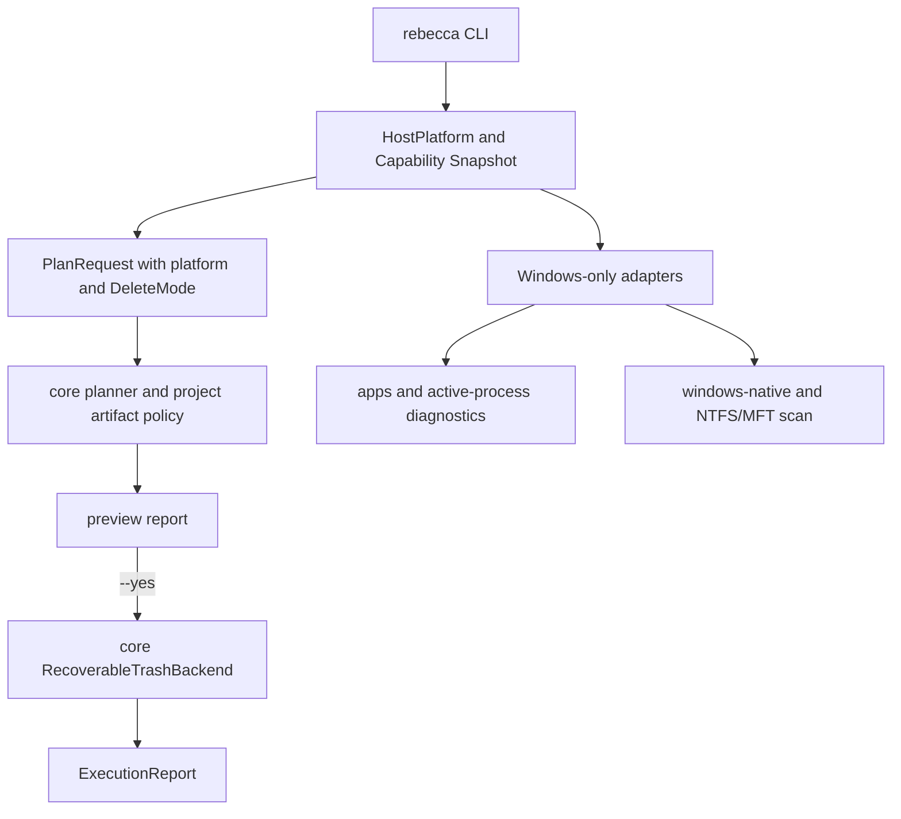

# Cross-Platform Cleanup Execution - Plan

## Goal Capsule

| Field | Value |
|---|---|
| Objective | Refactor Rebecca from a Windows-first cleanup executor into a portable cleanup CLI whose safe preview, project artifact purge, cache purge, and disk inspection workflows work on Windows, Linux, and macOS while Windows-only capabilities remain explicit enhancements. |
| Authority | The user's fearless-refactor direction outranks compatibility with the current unreleased CLI surface; deletion safety, recoverability, and clear machine output outrank preserving old field names or aliases. |
| Execution profile | Breaking code and CLI changes are allowed; delete compatibility paths that only exist because earlier iterations had not shipped. |
| Stop conditions | Stop if the chosen recoverable-trash backend cannot provide a defensible preview-first execution contract, if Linux/macOS builds cannot be made green without hiding behavior behind cfg stubs, or if a change would make permanent deletion easier than the current explicit `--permanent` path. |
| Tail ownership | `ce-work` owns implementation, focused tests, full quality gates, commits, and push to `main` unless a genuine scope blocker appears. |

---

## Product Contract

### Summary

Rebecca should present itself as a cross-platform cleanup CLI with Windows-specific superpowers, not as a Windows-only tool that happens to compile elsewhere.
The immediate product win is portable project artifact cleanup and Rebecca cache cleanup using recoverable trash semantics on every supported host, with Windows app-leftover discovery, active-process checks, Windows-native scan, and NTFS/MFT remaining capability-gated enhancements.

### Problem Frame

The current execution path still hardcodes `Platform::Windows`, `DeleteMode::RecycleBin`, and non-Windows execution failures in `crates/rebecca/src/clean.rs`, `crates/rebecca/src/purge.rs`, and `crates/rebecca/src/cache.rs`.
This makes the CLI message, JSON model, and tests lie about the product direction: project artifacts such as `node_modules`, `target`, `.gradle`, and `vendor` are portable by nature, but their rule IDs and execution path are still branded as Windows.
Because Rebecca has not shipped yet, keeping compatibility aliases such as `purge inspect` and `purge --list-artifacts` adds surface area without protecting real users.

### Requirements

**Portable execution**

- R1. `purge --yes` must execute project artifact cleanup through a recoverable trash backend on supported Windows, Linux, and macOS hosts, preserving preview-first behavior when `--yes` is absent.
- R2. `cache purge --yes` must use the same recoverable trash backend on supported hosts, while `cache purge --yes --permanent` remains the only irreversible Rebecca cache deletion path.
- R3. Execution reports must describe the operation as recoverable trash movement instead of Windows Recycle Bin movement, with pending reclaim bytes still reported for recoverable deletion.
- R4. If recoverable trash is unavailable at runtime, Rebecca must fail before deletion with a structured platform/capability error and must not fall back to permanent deletion.

**Platform identity and capability**

- R5. Core request and report models must represent the current host platform or a portable workflow without forcing every cleanup plan to be `windows`.
- R6. Windows-only capabilities must be modeled as explicit capabilities: installed-app discovery, active-process diagnostics, Windows-native scan, and NTFS/MFT scan.
- R7. Non-Windows users must get useful read-only and portable cleanup surfaces instead of blanket Windows-only errors.

**CLI and catalog cleanup**

- R8. User-facing help, human output, README text, and JSON examples must say `trash` or `recoverable delete` for portable execution and reserve `Recycle Bin` for Windows-specific notes only.
- R9. Project artifact rule IDs must move from `windows.project-artifact-*` to a portable namespace, with selectors continuing to accept human artifact names and suffixes.
- R10. Pre-release compatibility aliases must be removed: `purge inspect` is replaced by `inspect artifacts`, and `purge --list-artifacts` is replaced by `catalog --kind project-artifact`.

**Verification and release confidence**

- R11. CI must include a Linux Rust quality gate for portable compile/test coverage, not only skills validation and cargo-dist planning.
- R12. Tests must prove that no-progress, JSON, NDJSON, table output, history writes, and execution reports remain clean after the platform refactor.

### Acceptance Examples

- AE1. Given a Linux checkout with a Rust project `target/` fixture, when the user runs `rebecca purge --yes --root <workspace> --min-age-days 0 --format json`, then the target is moved through the recoverable trash backend or the command fails before deletion with a structured unsupported-trash error.
- AE2. Given a Windows checkout with a rule target, when the user runs `rebecca clean --dry-run --format json --rule windows.user-temp`, then the plan still builds with Windows rule data and reports the current host platform without requiring execution.
- AE3. Given any host with a Rebecca cache directory, when the user runs `rebecca cache purge --yes --permanent --format json`, then only direct cache contents are permanently deleted, the cache directory remains, and the report says `permanent-delete`.
- AE4. Given a user runs `rebecca purge inspect`, then the parser rejects the command and help points users at `rebecca inspect artifacts`.
- AE5. Given a user runs `rebecca catalog --kind project-artifact --format json`, then project artifact catalog entries use portable rule IDs and selectors rather than `windows.project-artifact-*`.

### Scope Boundaries

- This plan does not add macOS/Linux application leftover rule catalogs.
- This plan does not make NTFS/MFT or Windows-native scan work outside Windows.
- This plan does not add automatic permanent deletion fallback for hosts where trash is unavailable.
- This plan does not preserve old machine IDs, old alias commands, or old help text.

### Sources

- `crates/rebecca-core/src/model.rs` currently defines only `Platform::Windows` and `DeleteMode::RecycleBin`.
- `crates/rebecca/src/clean.rs` and `crates/rebecca/src/purge.rs` currently build requests with `PlanRequest::for_platform(Platform::Windows, ...)` and reject non-Windows execution.
- `crates/rebecca-windows/src/lib.rs` currently owns `WindowsRecycleBinBackend`, but its implementation already delegates to the cross-platform `trash` crate on Windows.
- `crates/rebecca-core/src/project_artifacts/policy.rs` currently assigns portable artifact policies to `windows.project-artifact-*` IDs.
- `.github/workflows/ci.yml` currently runs Rust quality gates only on Windows.

---

## Planning Contract

### Key Technical Decisions

- KTD1. Replace the singleton Windows platform model with an explicit host-platform model.
  `Platform` should become a real enum such as `Windows`, `Linux`, `Macos`, and `Unknown`, with a `Platform::current()` or equivalent helper used by CLI requests.
- KTD2. Rename cleanup execution from `RecycleBin` to recoverable trash semantics in core.
  The model should break to names such as `DeleteMode::Recoverable` and JSON label `recoverable-delete`, because `recycle-bin` is a Windows-specific implementation detail.
- KTD3. Move recoverable deletion into `rebecca-core`.
  A core `RecoverableTrashBackend` should implement `CleanupBackend` and `CachePurgeBackend` with the existing preserve-root child deletion rules, while `rebecca-windows` stops owning generic cleanup execution.
- KTD4. Preserve safety by failing closed when trash is unavailable.
  Recoverable execution returns a platform/capability error instead of attempting permanent deletion or partial cleanup without an explicit user command.
- KTD5. Treat project artifacts as portable catalog data.
  Rename `windows.project-artifact-*` to a portable namespace and update catalog selectors, advice, purge rendering, and tests in one breaking pass.
- KTD6. Keep Windows-only enhancements behind capability checks.
  `apps`, `doctor active-processes`, `windows-native`, and `windows-ntfs-mft-experimental` should report capability unavailable on unsupported hosts while portable inspect and purge paths keep working.
- KTD7. Delete pre-release compatibility surfaces.
  Removing `purge inspect` and `purge --list-artifacts` reduces parser branches, output identity exceptions, and documentation burden before public users depend on them.

### High-Level Technical Design

The CLI should construct one capability snapshot per run, pass it into command helpers, and avoid scattering `cfg(windows)` execution branches across command modules.
Core should own deletion semantics and reports; platform-specific crates should own discovery and OS-specific scan capabilities.

### System-Wide Impact

- Machine JSON changes are intentional and breaking for `request.platform`, `request.mode`, project artifact `rule_id`, cache purge text, and command identities for removed aliases.
- Tests that assert `Windows-only`, `Recycle Bin`, `recycle-bin`, or `windows.project-artifact-*` must be updated or deleted with the old behavior.
- Release packaging must still produce the Windows archive, but CI must also prove Linux Rust code does not rot.

### Risks and Mitigations

| Risk | Mitigation |
|---|---|
| `trash` behavior differs across Linux desktop environments. | Keep preview-first default, fail closed on recoverable-trash errors, and avoid adding permanent fallback. |
| Renaming project artifact IDs touches many snapshots and docs. | Do it in one unit with targeted `rg` verification for `windows.project-artifact`. |
| Moving deletion to core may duplicate Windows batch behavior. | Prefer one cross-platform backend first; reintroduce platform-specific batching only if tests or dogfood show a measurable regression. |
| Linux CI may expose default-feature coupling through `rebecca-windows`. | Make default features compile cross-platform or gate Windows-only code inside the optional crate without hiding portable CLI tests. |

---

## Implementation Units

### U1. Host platform and delete-mode model

- **Goal:** Break the core model away from singleton Windows and Windows-only delete labels.
- **Requirements:** R3, R5, R6.
- **Files:** `crates/rebecca-core/src/model.rs`, `crates/rebecca-core/src/plan.rs`, `crates/rebecca-core/tests/model_contract.rs`, `crates/rebecca-core/tests/executor_contract.rs`, `crates/rebecca/tests/cli_api.rs`.
- **Approach:** Add host-platform variants and a current-platform helper, rename `DeleteMode::RecycleBin` to recoverable semantics, update serde labels and test fixtures, and remove old `recycle-bin` expectations.
- **Patterns:** Follow the existing enum label pattern in `crates/rebecca-core/src/model.rs` and issue-matrix expectations in `crates/rebecca-core/src/plan.rs`.
- **Test scenarios:** Model serialization emits portable platform labels; dry-run remains `dry-run`; recoverable execution emits the new delete mode label; old `recycle-bin` assertions are gone.
- **Verification:** `cargo nextest run -p rebecca-core --locked model_contract executor_contract`.

### U2. Core recoverable trash backend

- **Goal:** Move recoverable cleanup and cache purge execution from `rebecca-windows` into `rebecca-core`.
- **Requirements:** R1, R2, R3, R4.
- **Files:** `Cargo.toml`, `crates/rebecca-core/Cargo.toml`, `crates/rebecca-windows/Cargo.toml`, `crates/rebecca-core/src/executor.rs`, `crates/rebecca-core/src/cache.rs`, `crates/rebecca-windows/src/lib.rs`, `crates/rebecca-core/tests/executor_contract.rs`.
- **Approach:** Add a core backend that wraps `trash::delete` and `trash::delete_all`, preserves current `PreserveRootContents` reparse-point refusal, implements both cleanup and cache purge backend traits, and removes `WindowsRecycleBinBackend` from generic execution.
- **Patterns:** Preserve the safety logic from `crates/rebecca-windows/src/lib.rs` and the cache boundary checks from `crates/rebecca-core/src/cache.rs`.
- **Test scenarios:** Recoverable backend reports pending reclaim; preserve-root deletes children while keeping root; reparse-like preserve-root children are refused; recoverable failure leaves targets failed without permanent deletion; cache purge keeps the cache directory.
- **Verification:** `cargo nextest run -p rebecca-core --locked executor_contract` and focused cache tests.

### U3. Portable purge and cache CLI execution

- **Goal:** Make `purge --yes` and `cache purge --yes` use the core recoverable backend on every supported host.
- **Requirements:** R1, R2, R3, R4, R7, R8.
- **Files:** `crates/rebecca/src/clean.rs`, `crates/rebecca/src/purge.rs`, `crates/rebecca/src/cache.rs`, `crates/rebecca/src/render/clean.rs`, `crates/rebecca/src/cache_view.rs`, `crates/rebecca/tests/cli_purge.rs`, `crates/rebecca/tests/cli_cache.rs`, `crates/rebecca/tests/cli_clean.rs`.
- **Approach:** Replace non-Windows execution rejection with recoverable backend dispatch for portable workflows, keep Windows rule execution available on Windows, and update human strings from Recycle Bin to recoverable trash except where Windows-specific diagnostics are named.
- **Patterns:** Keep `run_workflow_with_runtime_config` as the single plan-execute-render path and keep `cache purge --permanent` as the explicit irreversible path.
- **Test scenarios:** Portable purge preview still writes no history; portable purge execution produces an execution report with pending reclaim; cache recoverable purge no longer has a non-Windows unsupported test; permanent cache purge remains opt-in and reports confirmed reclaimed bytes.
- **Verification:** `cargo nextest run -p rebecca --locked cli_purge cli_cache cli_clean`.

### U4. Portable project artifact catalog IDs

- **Goal:** Rename project artifact policies from Windows IDs to portable IDs and update advice, catalog, purge, and inspect consumers.
- **Requirements:** R5, R8, R9.
- **Files:** `crates/rebecca-core/src/project_artifacts/policy.rs`, `crates/rebecca-core/src/project_artifacts/definitions.rs`, `crates/rebecca-core/src/catalog.rs`, `crates/rebecca-core/src/cleanup_advice.rs`, `crates/rebecca/src/purge_view.rs`, `crates/rebecca-core/tests/project_artifacts.rs`, `crates/rebecca-core/tests/cleanup_advice.rs`, `crates/rebecca/tests/cli_catalog.rs`, `crates/rebecca/tests/cli_purge.rs`, `crates/rebecca/tests/cli_inspect.rs`.
- **Approach:** Replace `windows.project-artifact-*` with `portable.project-artifact-*`, update suffix extraction helpers, keep selector aliases such as `node_modules` and `node-modules`, and remove old ID compatibility.
- **Patterns:** Use the policy table in `crates/rebecca-core/src/project_artifacts/policy.rs` as the single source of truth.
- **Test scenarios:** Catalog output uses portable IDs; purge targets use portable IDs; cleanup advice source still identifies project artifacts; no `windows.project-artifact` strings remain in Rust sources, docs, or tests.
- **Verification:** `rg "windows\\.project-artifact" crates README.md docs CHANGELOG.md` returns no live references after the unit.

### U5. Capability-gated Windows enhancements

- **Goal:** Make Windows-only functionality explicit without blocking portable workflows.
- **Requirements:** R6, R7, R8.
- **Files:** `crates/rebecca/src/apps.rs`, `crates/rebecca/src/info.rs`, `crates/rebecca/src/inspect.rs`, `crates/rebecca/src/scan.rs`, `crates/rebecca-core/src/scan/backend.rs`, `crates/rebecca/tests/cli_apps.rs`, `crates/rebecca/tests/info.rs`, `crates/rebecca/tests/cli_inspect.rs`.
- **Approach:** Centralize capability checks for app discovery, active-process diagnostics, Windows-native scan, and NTFS/MFT scan; return structured capability errors on unsupported hosts; keep portable recursive scan as the default everywhere.
- **Patterns:** Follow existing `RebeccaError::PlatformUnavailable` machine rendering in `crates/rebecca/src/output.rs`, but make messages capability-specific and not globally Windows-only.
- **Test scenarios:** Non-Windows `apps scan` and `doctor active-processes` report capability unavailable; `inspect map` with `windows-native` or `windows-ntfs-mft-experimental` falls back or errors with provenance as existing contracts require; portable `inspect map` and `inspect space` still work.
- **Verification:** `cargo nextest run -p rebecca --locked cli_apps info cli_inspect`.

### U6. Remove pre-release compatibility aliases

- **Goal:** Delete alias commands and compatibility output branches that no public user needs yet.
- **Requirements:** R8, R10.
- **Files:** `crates/rebecca/src/cli.rs`, `crates/rebecca/src/main.rs`, `crates/rebecca/src/purge.rs`, `crates/rebecca/src/purge_view.rs`, `crates/rebecca/tests/cli_purge.rs`, `crates/rebecca/tests/cli_api.rs`, `README.md`, `docs/api/cli/v1/README.md`.
- **Approach:** Remove `PurgeCommand::Inspect`, remove `--list-artifacts`, route users through `inspect artifacts` and `catalog --kind project-artifact`, and delete tests that only preserve alias behavior.
- **Patterns:** Keep canonical command identities in `command_api_contract` and avoid adding alias-specific payload kinds.
- **Test scenarios:** `purge inspect` fails as an unknown subcommand; `purge --list-artifacts` fails as an unknown flag; `inspect artifacts` keeps the read-only report contract; catalog output replaces the old artifact listing.
- **Verification:** `cargo nextest run -p rebecca --locked cli_purge cli_api cli_help`.

### U7. CI, docs, and release-facing polish

- **Goal:** Make cross-platform support visible, tested, and documented.
- **Requirements:** R8, R11, R12.
- **Files:** `.github/workflows/ci.yml`, `README.md`, `CHANGELOG.md`, `docs/api/cli/v1/README.md`, `crates/rebecca/tests/cli_help.rs`.
- **Approach:** Add a Linux Rust quality gate with format, clippy, nextest, and catalog validation where supported; update README product positioning from Windows-first to cross-platform with Windows enhancements; add Unreleased changelog entries for breaking command and JSON changes.
- **Patterns:** Follow the current Windows quality gate in `.github/workflows/ci.yml` and existing Unreleased bullets in `CHANGELOG.md`.
- **Test scenarios:** Root help no longer says Windows-first; help text says recoverable trash; Linux CI compiles the workspace; docs mention Windows-only capabilities as enhancements rather than baseline support.
- **Verification:** Full verification contract below.

---

## Verification Contract

| Gate | Command | Proves |
|---|---|---|
| Formatting | `cargo fmt --all -- --check` | Rust source formatting stays stable. |
| Lint | `cargo clippy --workspace --all-targets -- -D warnings` | Refactor has no clippy warnings on the active host. |
| Tests | `cargo nextest run --workspace --locked` | Core, CLI, rules, NTFS, and Windows adapter tests pass on the active host. |
| Catalog | `cargo run -p rebecca --locked -- catalog validate --format json` | Built-in rule and safety catalogs still validate after ID changes. |
| Skills | `python skills/validate.py` | Rebecca skill package remains installable and safe. |
| Search audit | `rg "Windows-first|Windows-only at this stage|recycle-bin|windows\\.project-artifact|purge inspect|list-artifacts" README.md CHANGELOG.md docs crates` | Old public contracts are removed or deliberately confined to historical changelog entries. |
| Linux CI | `.github/workflows/ci.yml` Linux Rust job | Portable compile/test coverage exists in CI, not only local Windows tests. |

---

## Definition of Done

- D1. `Platform` and `DeleteMode` no longer force all executable cleanup plans through Windows Recycle Bin semantics.
- D2. Recoverable cleanup and cache purge execution live in core and are used by CLI workflows without a non-Windows execution rejection branch for portable purge/cache.
- D3. Project artifact IDs and rendered selectors are portable, and no live code path depends on `windows.project-artifact-*`.
- D4. Windows-only commands and backends return capability-specific diagnostics on unsupported hosts while portable inspect and purge workflows keep working.
- D5. `purge inspect` and `purge --list-artifacts` are deleted, with docs and tests pointing to canonical commands.
- D6. README, API docs, skills where relevant, and CHANGELOG Unreleased describe cross-platform recoverable trash behavior and breaking changes.
- D7. CI includes Linux Rust quality coverage, and the full Verification Contract is green locally or any host-specific exception is documented with the exact failing gate.
- D8. Abandoned compatibility shims, stale tests, and experimental code from the refactor are removed before the final commit.
