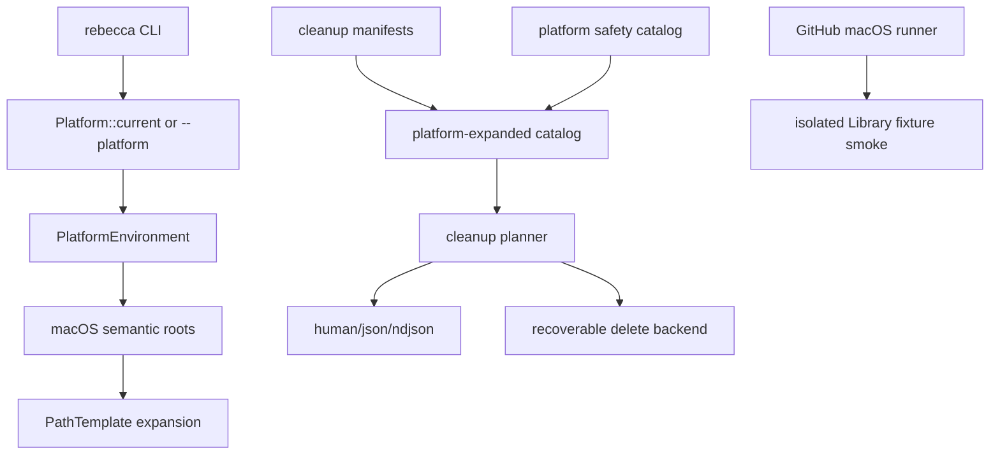

# macOS Cleanup Platform - Plan

## Goal Capsule

| Field | Value |
|---|---|
| Objective | Make macOS a first-class Rebecca cleanup platform across platform semantics, safe rule planning, catalog discovery, CLI tests, docs, and CI. |
| Authority | The user's fearless-refactor direction outranks unreleased CLI/API compatibility; platform correctness and deletion safety outrank preserving Windows/Linux-shaped shortcuts. |
| Execution profile | Breaking changes are allowed when they remove host assumptions, shrink compatibility code, or make platform behavior easier to prove. |
| Stop conditions | Stop if a proposed macOS target crosses from regenerable cache/log data into durable user data, Apple privacy data, app configuration, Keychain, sync state, or system roots without a blocking safety gate. |
| Tail ownership | `ce-work` owns implementation, review, verification, commits, push to `main`, and remote CI follow-through unless a genuine platform safety blocker appears. |

---

## Product Contract

### Summary

Rebecca should support macOS with the same product posture as Windows and Linux: explicit platform rule IDs, preview-first cleanup, recoverable deletion, useful catalog filtering, stable machine output, and host-specific CI.
macOS support must be built through shared platform seams so the next platform does not require another test and rule retrofit.

### Problem Frame

The codebase already contains `Platform::Macos`, CLI parsing for `--platform macos`, and macOS safety catalog entries.
That is not enough to call macOS supported.
The current rule catalog is mostly Windows/Linux, `PlatformEnvironment` only synthesizes Linux XDG defaults, tests still encode host-specific expectations in scattered places, and CI does not run a macOS quality gate.

macOS cleanup is not Linux with different separators.
Common user-owned cleanup targets live under `~/Library/Caches`, `~/Library/Application Support`, and `~/Library/Logs`, while durable and sensitive data lives beside them under Keychains, Containers, Group Containers, Safari, Mail, Messages, Photos, and application support databases.
The architecture should express these platform roots directly instead of forcing every rule and test to remember the same path conventions.

### Requirements

**Platform semantics**

- R1. Platform environment expansion must support macOS home-derived defaults for cache, application support, log, container, and group-container roots without changing Windows or Linux behavior.
- R2. CLI fixture helpers and tests must be platform-matrix aware so Windows, Linux, and macOS assertions do not depend on the developer host or path separator.
- R3. The cleanup planner must keep platform-prefixed rule IDs such as `macos.chrome-cache` and default to the current host platform for `clean` and `scan`.

**macOS safety**

- R4. Safety validation must allow bounded macOS cache and log leaves while protecting Keychain, Mail, Messages, Photos, Safari private data, browser profile databases, app settings, Containers data, Group Containers data, LaunchAgents, sync roots, and system roots.
- R5. Broad macOS roots such as `%HOME%/Library/*`, `%MACOS_APPLICATION_SUPPORT_HOME%/*`, `%MACOS_CONTAINER_HOME%/*`, `/Library/*`, and `/System/*` must be rejected or blocked before a rule can ship.
- R6. Moderate macOS maintenance rules must require explicit safety and warning gates when rebuild/redownload cost, active-process risk, or permission sensitivity is material.

**macOS cleanup coverage**

- R7. Built-in macOS developer-cache rules must cover Cargo, Rustup, npm, pnpm, Yarn, Bun, Corepack, pip, uv, Poetry, Conda, Go build/module cache, Gradle, Maven, NuGet, Android, ccache, sccache, Hugging Face, PyTorch, and Homebrew cache where the path is user-owned and bounded.
- R8. Built-in macOS browser and mail rules must cover Chrome, Chromium, Brave, Edge, Firefox, Waterfox, Zen, Thunderbird, and thumbnail/icon cache leaves without targeting browser history, cookies, credentials, extensions, Local Storage, IndexedDB, or profile preferences.
- R9. Built-in macOS desktop-app rules must cover common Electron and desktop caches such as VS Code, JetBrains, Discord, Slack, Zoom, Postman, Figma, VLC, Notion, and similar existing rule files where the macOS cache path is clear.
- R10. macOS Steam rules may cover cache, shader, download, logs, and library temp leaves through existing Steam target abstractions when they resolve from user-owned Steam roots.

**User surface and release confidence**

- R11. `catalog --platform macos`, `clean --rule macos.*`, JSON, NDJSON, and human output must expose macOS rules with stable platform fields and no human text in machine modes.
- R12. Docs, changelog, and the Rebecca skill must show macOS examples, explain recoverable delete expectations, and warn users away from `sudo` and broad `~/Library` deletion.
- R13. GitHub Actions must run macOS Rust quality gates and a no-root macOS cleanup smoke using isolated fixture directories.

### Acceptance Examples

- AE1. Given `HOME` points at an isolated fixture and no macOS-specific variables are set, when a macOS rule contains `%MACOS_CACHE_HOME%/pip`, then the target expands to `~/Library/Caches/pip`.
- AE2. Given a fixture under `~/Library/Caches/pip`, when `rebecca clean --format json --rule macos.pip-cache --allow-moderate` runs with platform `macos`, then the plan reports at least one allowed target and request platform `macos`.
- AE3. Given a rule candidate under `~/Library/Application Support/Google/Chrome/Default/History`, when catalog validation runs, then the shape is blocked as browser private data.
- AE4. Given a rule candidate under `~/Library/Containers/com.example.App/Data`, when catalog validation runs, then the broad container data target is blocked unless it names a known cache leaf under `Data/Library/Caches`.
- AE5. Given any host, when `rebecca catalog --kind cleanup-rule --platform macos --format json` runs, then every returned cleanup rule has platform `macos` and an ID prefixed with `macos.`.
- AE6. Given macOS CI, when the no-root smoke script creates isolated Library cache fixtures, then preview cleanup and recoverable execution are tested without touching the real user profile.

### Scope Boundaries

- This plan does not add raw APFS scanning, FSEvents indexing, or Time Machine cleanup.
- This plan does not implement macOS installed-application uninstallers or app-leftover deletion beyond existing cross-platform cleanup workflows.
- This plan does not clean Safari history, browser credentials, Mail, Messages, Photos, Keychain, Containers data, Group Containers data, LaunchAgents, or sync state.
- This plan does not require root privileges or permanent deletion on macOS.
- This plan does not copy GPL/LGPL rule data from external cleaners; external projects remain behavioral references only.

### Sources

- `docs/plans/2026-07-06-003-feat-linux-cleanup-adaptation-plan.md` is the closest platform-adaptation precedent.
- `crates/rebecca-core/src/model.rs` already defines `Platform::Macos`, `Platform::current()`, and platform labels.
- `crates/rebecca-core/src/environment.rs` currently synthesizes Linux XDG defaults but no macOS defaults.
- `crates/rebecca-rules/rules/cleanup` contains the shared rule files that should receive macOS platform blocks.
- `crates/rebecca-core/safety/cleanup.toml` and `crates/rebecca-rules/safety/cleanup.toml` already carry platform safety knowledge that can be extended for macOS boundaries.
- `.github/workflows/ci.yml` is the remote proof surface that must add macOS quality and smoke coverage.

---

## Planning Contract

### Key Technical Decisions

- KTD1. Treat macOS as a first-class platform root set, not as direct `%HOME%/Library/...` duplication.
  Introduce semantic environment defaults such as `MACOS_CACHE_HOME`, `MACOS_APPLICATION_SUPPORT_HOME`, `MACOS_LOG_HOME`, `MACOS_CONTAINER_HOME`, and `MACOS_GROUP_CONTAINER_HOME`.
- KTD2. Keep macOS targets exact or leaf-bounded.
  `~/Library` is high-value and high-risk; rule manifests should name regenerable leaves like `Cache`, `Code Cache`, `GPUCache`, `Logs`, `Crashpad`, `ShaderCache`, `cache2`, and `startupCache`.
- KTD3. Strengthen safety before adding large rule batches.
  The macOS catalog should fail validation for dangerous roots before the rules exist, so future additions inherit the same guardrails.
- KTD4. Use platform-matrix fixtures instead of host-specific assertions.
  Tests should construct synthetic Windows, Linux, and macOS environments and assert normalized machine output, not rely on whichever OS runs the test.
- KTD5. Let GitHub macOS CI be the authoritative platform proof.
  Local Windows and Linux checks can prove cross-platform compilation and host-neutral behavior, but only macOS CI proves macOS runner behavior and shell scripts.
- KTD6. Keep native macOS APIs out of this plan.
  `trash` crate behavior, filesystem planning, and TOML rules are enough for first-class cleanup support; native APIs belong in a later plan only if a concrete capability requires them.

### High-Level Technical Design

macOS work should deepen the shared cleanup pipeline.
The only macOS-specific behavior in the first pass is path-root derivation, rule data, safety validation, and host CI smoke.

### Sequencing

1. Create platform-matrix fixtures and macOS environment defaults before adding rule data.
2. Strengthen macOS safety/protection patterns so dangerous future rules fail early.
3. Add developer-cache rules first because they are common, user-owned, and easy to fixture.
4. Add browser, mail, desktop, and Steam rules after private-data protections are proven.
5. Add docs, skill, changelog, and macOS CI smoke once the CLI surface is stable.

### System-Wide Impact

- The rule catalog grows again, so platform filtering and stable platform fields become product-level requirements rather than convenience features.
- Test helpers should stop encoding platform knowledge in each test file.
- Safety catalog shape validation becomes more important because macOS durable data is adjacent to regenerable cache data.
- CI runtime increases because macOS joins the Rust quality matrix.

### Risks and Mitigations

| Risk | Mitigation |
|---|---|
| macOS application layouts vary by vendor and channel. | Add only paths already represented by existing rule families and keep each target leaf-bounded. |
| `~/Library/Application Support` contains both caches and durable state. | Protect broad application support roots and browser/app private-data leaves before adding app rules. |
| macOS CI may expose shell, trash, or permission behavior not visible locally. | Add a focused smoke script with isolated fixtures and watch remote CI before landing. |
| Large rule batches can create brittle count-based tests. | Rewrite tests to assert concrete rule IDs and platform fields instead of total counts. |
| Future platform additions could repeat this retrofit. | Centralize platform fixture and environment helpers now, then use them from Windows, Linux, and macOS tests. |

---

## Implementation Units

### U1. Platform-matrix cleanup test harness

- **Goal:** Replace scattered host assumptions with reusable Windows/Linux/macOS fixture helpers.
- **Requirements:** R2, R3, R11.
- **Files:** `crates/rebecca/tests/common/support.rs`, `crates/rebecca/tests/cli_clean.rs`, `crates/rebecca/tests/cli_scan.rs`, `crates/rebecca/tests/cli_catalog.rs`, `crates/rebecca/tests/cli_api.rs`, `crates/rebecca-core/tests/path_templates.rs`.
- **Approach:** Add helpers that build isolated platform environments, normalize machine-output paths only at assertion boundaries, and expose current-platform rule IDs through one function.
- **Test scenarios:** Windows and Linux existing fixture tests still pass; a synthetic macOS fixture can select `macos.user-temp`; JSON path assertions do not depend on host separators; NDJSON tests keep lifecycle events stable.
- **Verification:** `cargo nextest run -p rebecca --locked cli_clean cli_scan cli_catalog cli_api` and `cargo nextest run -p rebecca-core --locked path_templates`.

### U2. macOS environment defaults

- **Goal:** Make macOS path roots first-class template variables.
- **Requirements:** R1, R3, AE1.
- **Files:** `crates/rebecca-core/src/environment.rs`, `crates/rebecca-core/tests/path_templates.rs`, `docs/rule-authoring.md`.
- **Approach:** Extend `PlatformEnvironment` with macOS default suffixes derived from `HOME`, preserving explicit environment overrides and returning no candidate when `HOME` is missing or empty.
- **Test scenarios:** `MACOS_CACHE_HOME` defaults to `~/Library/Caches`; `MACOS_APPLICATION_SUPPORT_HOME` defaults to `~/Library/Application Support`; `MACOS_LOG_HOME` defaults to `~/Library/Logs`; `MACOS_CONTAINER_HOME` defaults to `~/Library/Containers`; `MACOS_GROUP_CONTAINER_HOME` defaults to `~/Library/Group Containers`; explicit values win; Windows and Linux behavior is unchanged.
- **Verification:** `cargo nextest run -p rebecca-core --locked path_templates`.

### U3. macOS safety and protection boundaries

- **Goal:** Fail unsafe macOS rule shapes before broad macOS rule coverage is added.
- **Requirements:** R4, R5, R6, AE3, AE4.
- **Files:** `crates/rebecca-core/safety/cleanup.toml`, `crates/rebecca-rules/safety/cleanup.toml`, `crates/rebecca-core/src/protection.rs`, `crates/rebecca-core/src/protection/patterns.rs`, `crates/rebecca-core/tests/safety_catalog.rs`, `crates/rebecca-core/tests/safety_policy.rs`, `crates/rebecca-rules/src/lib.rs`.
- **Approach:** Add accepted macOS cache/log leaves, protected macOS durable roots, browser private-data patterns, container data guards, and broad-root rejection tests.
- **Test scenarios:** Cache/log leaves pass; Keychains, Safari, Mail, Messages, Photos, LaunchAgents, browser History/Cookies/Login Data, Local Storage, IndexedDB, Service Worker, app preferences, and container data roots are blocked; `/System`, `/Library`, and broad `~/Library` globs fail validation.
- **Verification:** `cargo nextest run -p rebecca-core --locked safety_catalog safety_policy` and `cargo nextest run -p rebecca-rules --locked`.

### U4. macOS developer cache rules

- **Goal:** Add high-value macOS developer cleanup rules using shared manifests.
- **Requirements:** R7, R11, AE2.
- **Files:** `crates/rebecca-rules/rules/cleanup/cargo-cache.toml`, `crates/rebecca-rules/rules/cleanup/rustup-cache.toml`, `crates/rebecca-rules/rules/cleanup/npm-cache.toml`, `crates/rebecca-rules/rules/cleanup/pnpm-cache.toml`, `crates/rebecca-rules/rules/cleanup/yarn-cache.toml`, `crates/rebecca-rules/rules/cleanup/bun-cache.toml`, `crates/rebecca-rules/rules/cleanup/corepack-cache.toml`, `crates/rebecca-rules/rules/cleanup/pip-cache.toml`, `crates/rebecca-rules/rules/cleanup/uv-cache.toml`, `crates/rebecca-rules/rules/cleanup/poetry-cache.toml`, `crates/rebecca-rules/rules/cleanup/conda-cache.toml`, `crates/rebecca-rules/rules/cleanup/go-build-cache.toml`, `crates/rebecca-rules/rules/cleanup/go-module-cache.toml`, `crates/rebecca-rules/rules/cleanup/gradle-cache.toml`, `crates/rebecca-rules/rules/cleanup/maven-cache.toml`, `crates/rebecca-rules/rules/cleanup/nuget-cache.toml`, `crates/rebecca-rules/rules/cleanup/android-cache.toml`, `crates/rebecca-rules/rules/cleanup/ccache-cache.toml`, `crates/rebecca-rules/rules/cleanup/sccache-cache.toml`, `crates/rebecca-rules/rules/cleanup/huggingface-cache.toml`, `crates/rebecca-rules/rules/cleanup/pytorch-cache.toml`, `crates/rebecca-rules/src/lib.rs`, `crates/rebecca/tests/cli_clean.rs`.
- **Approach:** Add `platform = "macos"` blocks for safe and moderate developer caches, using semantic macOS roots when available and existing shared warning categories when rebuild cost is high.
- **Test scenarios:** Representative safe and moderate macOS developer rules produce allowed targets from isolated fixtures; moderate rules remain gated; no rule points at toolchain binaries, credentials, SDK platforms, virtualenvs, package databases, or project source roots.
- **Verification:** `cargo nextest run -p rebecca-rules --locked` and focused `cargo nextest run -p rebecca --locked cli_clean`.

### U5. macOS browser, mail, desktop, and Steam rules

- **Goal:** Add user-visible macOS cleanup breadth while keeping durable application data protected.
- **Requirements:** R8, R9, R10, R11.
- **Files:** `crates/rebecca-rules/rules/cleanup/chrome-cache.toml`, `crates/rebecca-rules/rules/cleanup/chromium-cache.toml`, `crates/rebecca-rules/rules/cleanup/brave-cache.toml`, `crates/rebecca-rules/rules/cleanup/edge-cache.toml`, `crates/rebecca-rules/rules/cleanup/firefox-profile-cache.toml`, `crates/rebecca-rules/rules/cleanup/waterfox-cache.toml`, `crates/rebecca-rules/rules/cleanup/zen-browser-cache.toml`, `crates/rebecca-rules/rules/cleanup/thunderbird-cache.toml`, `crates/rebecca-rules/rules/cleanup/thumbnail-cache.toml`, `crates/rebecca-rules/rules/cleanup/vscode-cache.toml`, `crates/rebecca-rules/rules/cleanup/jetbrains-cache.toml`, `crates/rebecca-rules/rules/cleanup/discord-cache.toml`, `crates/rebecca-rules/rules/cleanup/slack-cache.toml`, `crates/rebecca-rules/rules/cleanup/zoom-logs.toml`, `crates/rebecca-rules/rules/cleanup/postman-cache.toml`, `crates/rebecca-rules/rules/cleanup/figma-cache.toml`, `crates/rebecca-rules/rules/cleanup/vlc-cache.toml`, `crates/rebecca-rules/rules/cleanup/notion-cache.toml`, `crates/rebecca-rules/rules/cleanup/steam-cache.toml`, `crates/rebecca-rules/rules/cleanup/steam-install-cache.toml`, `crates/rebecca-rules/rules/cleanup/steam-install-download-cache.toml`, `crates/rebecca-rules/rules/cleanup/steam-library-shader-cache.toml`, `crates/rebecca/tests/cli_clean.rs`, `crates/rebecca/tests/cli_api.rs`.
- **Approach:** Add bounded macOS cache, code-cache, GPU-cache, shader-cache, crashpad/log, Firefox `cache2`, Thunderbird cache, and Steam cache targets; attach active-process warnings where existing rules already use them.
- **Test scenarios:** Browser cache fixtures produce target events; private data leaves remain blocked; desktop cache fixtures under semantic macOS roots are allowed; Steam targets resolve from user-owned install roots; NDJSON file-progress remains machine-only.
- **Verification:** `cargo nextest run -p rebecca-rules --locked` and `cargo nextest run -p rebecca --locked cli_clean cli_api`.

### U6. macOS catalog, docs, and skill surface

- **Goal:** Make macOS discoverable and teach safe usage.
- **Requirements:** R11, R12.
- **Files:** `crates/rebecca/src/catalog.rs`, `crates/rebecca/src/cli.rs`, `crates/rebecca/tests/cli_catalog.rs`, `docs/api/cli/v1/payloads.schema.json`, `docs/api/cli/v1/examples/success-catalog.json`, `README.md`, `CHANGELOG.md`, `docs/rule-authoring.md`, `docs/security-audit.md`, `skills/rebecca-disk-cleaner/SKILL.md`, `skills/README.md`.
- **Approach:** Ensure platform-filtered catalog output includes macOS rules, update examples and schema fixtures where platform fields appear, and document macOS cache roots plus warning gates.
- **Test scenarios:** `catalog --kind cleanup-rule --platform macos --format json` returns only macOS cleanup rules; docs include macOS examples; skill validation passes; docs do not recommend broad `~/Library` deletion or `sudo rebecca clean`.
- **Verification:** `cargo nextest run -p rebecca --locked cli_catalog`, `python skills/validate.py`, and documentation search audits.

### U7. macOS CI and smoke verification

- **Goal:** Keep macOS support durable after the implementation lands.
- **Requirements:** R13, AE6.
- **Files:** `.github/workflows/ci.yml`, `scripts/ci/run-macos-cleanup-smoke.sh`, `scripts/ci/run-linux-cleanup-smoke.sh`, `docs/performance/perf-matrix.md`.
- **Approach:** Add macOS to the Rust quality matrix, run a no-root macOS smoke that builds isolated Library fixtures, and keep Linux smoke unchanged except for shared helper reuse if needed.
- **Test scenarios:** macOS runner executes format, clippy, nextest, catalog validation, and smoke; smoke previews macOS cleanup without touching the real profile; Linux and Windows CI keep their existing gates.
- **Verification:** GitHub Actions macOS, Ubuntu, and Windows quality gates pass.

### U8. Simplify, review, and remove platform debt

- **Goal:** Remove compatibility scaffolding and stale assumptions created before macOS became a first-class platform.
- **Requirements:** R2, R12, R13.
- **Files:** `crates/rebecca-core/src/environment.rs`, `crates/rebecca/tests`, `crates/rebecca-core/tests`, `crates/rebecca-rules/src/lib.rs`, `CHANGELOG.md`.
- **Approach:** Consolidate duplicate platform fixture setup, delete count-based or Windows/Linux-only assertions that no longer express product behavior, and run code review before committing.
- **Test scenarios:** No test depends on total platform rule counts when concrete IDs are enough; no obsolete wording says Linux or macOS support is missing; no dead helpers remain after `cargo clippy --workspace --all-targets -- -D warnings`.
- **Verification:** Full Verification Contract is green locally where possible and remotely for macOS.

---

## Verification Contract

| Gate | Command | Proves |
|---|---|---|
| Formatting | `cargo fmt --all -- --check` | Rust formatting is stable. |
| Lint | `cargo clippy --workspace --all-targets -- -D warnings` | Active-host Rust code has no clippy warnings. |
| Tests | `cargo nextest run --workspace --locked --no-fail-fast` | Workspace behavior remains green on the current host. |
| Catalog validation | `cargo run -p rebecca --locked -- catalog validate --format json` | Built-in rules and safety catalogs compile and pass protection gates. |
| Skill validation | `python skills/validate.py` | Rebecca skill docs remain installable and parseable. |
| macOS catalog audit | `cargo run -p rebecca --locked -- catalog --kind cleanup-rule --platform macos --format json` | macOS rules are discoverable through the user-facing CLI. |
| Docs audit | `rg "macOS|MACOS_CACHE_HOME|Library/Caches|sudo rebecca clean|Windows-only|Linux-only" README.md docs skills CHANGELOG.md crates` | New macOS messaging exists and stale platform messaging is visible for review. |
| Remote CI | GitHub Actions Rust quality gate on Windows, Ubuntu, and macOS | macOS behavior is enforced on a real macOS runner. |

---

## Definition of Done

- D1. macOS environment defaults are implemented and tested without regressing Linux XDG or Windows environment expansion.
- D2. Safety validation blocks broad macOS Library, system, container, browser-private-data, and Apple privacy-data targets.
- D3. Built-in macOS rules cover the developer, browser, mail, desktop, and Steam groups named in the Product Contract.
- D4. CLI machine output and catalog filtering expose macOS platform data consistently.
- D5. Windows, Linux, and macOS fixture tests share platform helpers instead of duplicating host assumptions.
- D6. README, API docs, rule-authoring docs, security docs, Rebecca skill docs, and CHANGELOG Unreleased explain macOS support and safe usage.
- D7. Local verification is green where the host can run it, macOS CI is green remotely, and any host-specific exception is documented with the exact command and reason.
- D8. Dead compatibility code, obsolete tests, and exploratory platform adapters are removed before the final commit.
