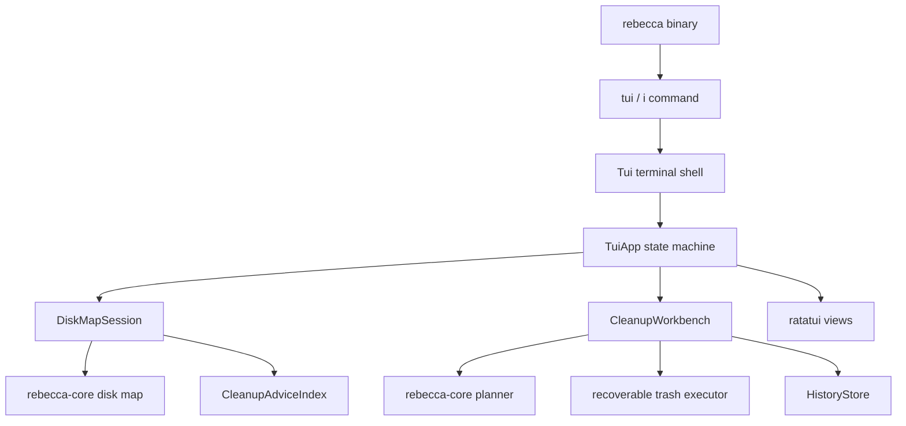
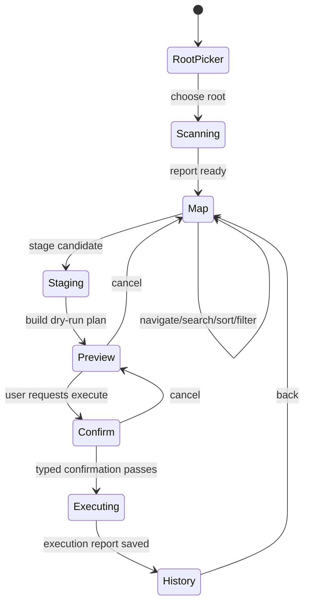

# TUI Cleanup Workbench - Plan

## Goal Capsule

| Field | Decision |
|---|---|
| Objective | Add a first-class Rebecca terminal UI in the existing `rebecca` binary for WizTree-like disk exploration and safe cleanup planning. |
| Authority | User request: one product entry, modern easy TUI, fearless refactor, no compatibility burden before launch. |
| Execution profile | Code implementation with focused tests per unit, then full workspace verification. |
| Stop conditions | Stop only for scope contradictions, unavailable terminal primitives that make the selected TUI stack unusable, or verification failures that require product scope changes. |
| Landing | Commit directly according to repo convention; main is allowed by prior user preference. |

---

## Product Contract

### Summary

Rebecca will add `rebecca tui` with `rebecca i` as a short alias.
The TUI gives users a fast terminal workbench: choose a root, scan disk usage, drill into large directories, see cleanup advice, stage safe cleanup candidates, preview the exact plan, and execute only through Rebecca's existing recoverable-trash cleanup path with strong confirmation.

### Problem Frame

Rebecca already has strong cleanup rules, safety policy, scan backends, history, and machine-readable output.
The missing experience is interactive discovery: users need to see where space went, understand what is cleanable, and act without composing several CLI commands.
WizTree-style products win because they combine space ranking, visual proportion, and immediate navigation; Rebecca should bring that interaction to the terminal while preserving its safety-first cleanup model.

### Requirements

**Entry and runtime**

- R1. The same `rebecca` binary exposes a TUI command without creating a second install target.
- R2. The TUI refuses to start without a real terminal and restores raw mode and alternate-screen state on normal exit, panic, or cancellation.
- R3. The no-argument TUI opens a root picker instead of immediately scanning a full disk.

**Disk exploration**

- R4. The TUI shows a navigable disk map with size-ranked rows, usage bars, logical and allocated bytes, file counts, backend provenance, and cleanup advice.
- R5. Users can drill into and back out of directories without parsing CLI output or forcing unnecessary full rescans.
- R6. Search, sort, filtering, pane switching, and help are available from the keyboard.

**Cleanup workflow**

- R7. Users can stage cleanup candidates from advice-bearing entries and from cleanup rules.
- R8. Cleanup preview is always shown before execution and uses Rebecca's existing planner, warning gates, safety levels, protected paths, scan cache, and app discovery.
- R9. Real cleanup in the TUI uses recoverable trash only; permanent deletion is out of scope for this first TUI.
- R10. Execution requires strong typed confirmation that includes the planned reclaim amount.
- R11. Execution writes the same history records and reports the same skipped, blocked, failed, pending-reclaim, and warning information as the CLI.

**Output quality**

- R12. The UI is dense, modern, and understandable without in-app tutorials: predictable tabs, visible commands, right-side details, and concise status text.
- R13. The first version favors readable tree tables and proportional bars over a full rectangular treemap.
- R14. The TUI shares core domain APIs with CLI workflows rather than scraping Rebecca's human, JSON, or NDJSON output.
- R15. The TUI has deterministic CI-friendly entry points for one-frame rendering and scripted key replay, hidden from normal help if needed.
- R16. The TUI supports plain accessibility modes with no visual bars, no color dependency, and deterministic width injection for CI and narrow terminals.

### Scope Boundaries

- In scope: `rebecca tui`, alias `rebecca i`, terminal event loop, disk-map session state, advice-driven staging, dry-run preview, recoverable-trash execution, history view, screen-reader/no-color display modes, deterministic one-frame and key-replay smoke and journey tests.
- In scope: dependency updates needed for `ratatui`, `crossterm`, and small input helpers.
- Deferred to follow-up work: mouse-first UX, true terminal rectangular treemap, restore-from-history index, plugin/custom rule editing, long-lived background daemon, release packaging changes, and permanent delete from TUI.
- Outside this product's identity: a separate GUI app, a separate `rebecca-tui` binary, or any TUI path that bypasses Rebecca's safety policy.

---

## Planning Contract

### Key Technical Decisions

- KTD1. Keep one user-facing binary.
  The TUI enters through `Command::Tui(TuiArgs)` and alias `i`, while code lives in a focused `tui` module so the user installs one tool and the codebase still has a clean boundary.
- KTD2. Add a core session model instead of teaching the TUI to parse CLI output.
  `inspect map` currently returns ranked flat entries; the TUI needs a persistent tree/session abstraction that can navigate, filter, sort, stage, and rescan without depending on renderer text.
- KTD3. Use `ratatui` with `crossterm`.
  Current crates are `ratatui 0.30.2` and `crossterm 0.29.0`; both are MIT-compatible and fit the repo's MSRV 1.95.
- KTD4. Make execution a shared service seam.
  CLI `clean`, `purge`, and `apps` already share planner and executor logic, but their workflow function is tied to output renderers; TUI needs a callable workbench service that builds previews and executes recoverable-trash plans without emitting CLI text.
- KTD5. Represent the first visual map as tree table plus byte bars.
  `dua-cli` shows that terminal proportional bars and keyboard navigation are dependable; full rectangular treemaps are deferred because they cost complexity and are less readable in narrow terminals.
- KTD6. Treat TUI tests as state-machine tests first and terminal rendering tests second.
  Most behavior should be proven through pure state transitions and scripted key journeys; snapshot-style terminal buffer tests cover only stable layout contracts.

### High-Level Technical Design

### Assumptions

- The first implementation should use alternate-screen TUI for humans and deterministic `--once` / `--replay-keys` paths for tests.
- The TUI may start with a bounded initial root list: current directory, home, platform drives or mount roots, and a custom path prompt.
- Staged cleanup candidates can initially map to rule ids and workflow kinds rather than arbitrary files.
- Recoverable-trash execution is acceptable for the first real cleanup path; permanent delete remains CLI-only.

### Sources & Research

- `crates/rebecca/src/cli.rs` and `crates/rebecca/src/main.rs` show the current single-binary clap command structure.
- `crates/rebecca/src/inspect.rs` and `crates/rebecca-core/src/disk_map.rs` provide disk-map reports, progress events, backend provenance, allocated bytes, unique bytes, groups, and diagnostics.
- `crates/rebecca-core/src/cleanup_advice.rs` already derives cleanup status and suggested commands for disk-map entries.
- `crates/rebecca/src/clean.rs` centralizes cleanup plan build, warning gates, recoverable-trash execution, and history writes.
- `repo-ref/dua-cli/src/interactive`, especially `app/eventloop.rs`, `app/cleanup.rs`, and `widgets/mark.rs`, is the strongest Rust TUI reference for TTY guard, event loop, keyboard journeys, and proportional bars.
- `repo-ref/dust` supports the decision to favor readable proportional bars over complex terminal treemaps.
- `repo-ref/edirstat`, `repo-ref/squirreldisk`, and `repo-ref/windirstat` support the user-facing model: space map plus selection plus cleanup decision context.
- `tui-tree-widget` is a candidate reference for tree state and keyboard behavior, but Rebecca should keep its own domain model and only use third-party widgets if they simplify rendering without owning the cleanup semantics.

---

## Implementation Units

### U1. Add TUI command surface and dependencies

- **Goal:** Expose `rebecca tui` and `rebecca i`, wire terminal-only startup, and add modern TUI dependencies.
- **Requirements:** R1, R2, R3, R15, R16
- **Dependencies:** None
- **Files:** `Cargo.toml`, `crates/rebecca/Cargo.toml`, `crates/rebecca/src/cli.rs`, `crates/rebecca/src/main.rs`, `crates/rebecca/src/tui/mod.rs`, `crates/rebecca/src/tui/terminal.rs`, `crates/rebecca/tests/cli_help.rs`
- **Approach:** Add a clap subcommand with alias `i`, root options, scan backend option reuse, visible `--screen-reader` and `--no-color` display modes, hidden deterministic `--once` / `--replay-keys` / `--terminal-width` test options, and a no-op terminal shell that validates TTY before entering raw mode. Use RAII for raw mode and alternate-screen cleanup.
- **Patterns to follow:** `repo-ref/dua-cli/src/main.rs` terminal guard; existing `Completion` and command dispatch patterns in `crates/rebecca/src/main.rs`.
- **Test scenarios:** Starting `rebecca tui --help` lists the command, alias, root option, accessibility modes, and safety wording. Starting TUI without a TTY returns a clear human error and machine-safe exit. `rebecca tui --once --root <fixture>` emits a stable one-frame text buffer for CI. `--screen-reader` omits visual bars, `--no-color` removes color dependency, and `--terminal-width` bounds headless lines. Completion generation includes the new command. Terminal guard unit tests prove cleanup drops both raw mode and alternate-screen flags.
- **Verification:** Focused CLI help tests pass and the command compiles on Windows, Linux, and macOS feature sets.

### U2. Introduce disk-map session data for interactive navigation

- **Goal:** Add a reusable core model that preserves a navigable disk tree and derived ranked views.
- **Requirements:** R4, R5, R14
- **Dependencies:** U1
- **Files:** `crates/rebecca-core/src/disk_map.rs`, `crates/rebecca-core/src/disk_session.rs`, `crates/rebecca-core/src/lib.rs`, `crates/rebecca-core/tests/disk_session.rs`, `crates/rebecca/tests/cli_inspect.rs`
- **Approach:** Refactor disk-map collection to emit a `DiskMapSession` tree with stable node ids, parent/child links, metrics, provenance, diagnostics, and optional cleanup advice. Keep existing `DiskMapReport` as a projection so current CLI JSON contracts can remain intact unless the refactor proves a cleaner breaking shape is needed.
- **Execution note:** Add characterization tests around existing `inspect map` JSON before changing disk-map internals.
- **Patterns to follow:** `DiskMapReport`, `DiskMapEntry`, `DiskMapGroup`, and `inspect_map_with_progress` in `crates/rebecca-core/src/disk_map.rs`.
- **Test scenarios:** A fixture tree can open a root, list children ordered by logical size, move to parent, filter by path text, and project the same top entries as existing `DiskMapReport`. Missing roots and skipped entries preserve diagnostics. Hardlink and allocated-byte metadata remain represented. Cleanup advice can annotate both exact and ancestor nodes.
- **Verification:** Disk-map tests, inspect-map CLI tests, and model contract tests pass.

### U3. Add cleanup workbench service shared by CLI and TUI

- **Goal:** Provide typed APIs for building cleanup previews and executing recoverable-trash plans without rendering CLI output.
- **Requirements:** R7, R8, R9, R10, R11, R14
- **Dependencies:** U2
- **Files:** `crates/rebecca/src/clean.rs`, `crates/rebecca/src/workbench.rs`, `crates/rebecca/src/apps.rs`, `crates/rebecca/src/purge.rs`, `crates/rebecca/tests/cli_clean.rs`, `crates/rebecca/tests/cli_purge.rs`, `crates/rebecca/tests/cli_apps.rs`
- **Approach:** Extract a `CleanupWorkbench` service from the current workflow path. It accepts workflow kind, selection, risk gates, scan cache policy, protected paths, and execution mode, and returns a typed preview or execution outcome. CLI renderers call the service; TUI calls the same service and renders its own views.
- **Execution note:** Characterize one CLI dry-run and one recoverable-trash execution path before extracting the service.
- **Patterns to follow:** `WorkflowRunOptions`, `run_workflow_with_runtime_config`, `PlanBuildContext`, `execute_cleanup_plan_parallel_with_policy`.
- **Test scenarios:** CLI clean dry-run payloads remain equivalent after extraction. A workbench preview for a staged rule reports allowed, skipped, blocked, failed, warnings, and issue matrix. Execution refuses permanent delete. Execution writes history exactly once. Active-process warning gates and moderate/risky gates are still enforced.
- **Verification:** Existing clean, purge, apps, and history tests pass with the extracted service.

### U4. Build TUI application state and keyboard event model

- **Goal:** Implement the pure state machine for root picker, scan progress, map navigation, staging, preview, confirm, execute, history, help, and errors.
- **Requirements:** R3, R4, R5, R6, R7, R8, R10, R11, R12, R15
- **Dependencies:** U2, U3
- **Files:** `crates/rebecca/src/tui/app.rs`, `crates/rebecca/src/tui/event.rs`, `crates/rebecca/src/tui/model.rs`, `crates/rebecca/src/tui/commands.rs`, `crates/rebecca/src/tui/input.rs`, `crates/rebecca/tests/tui_journey.rs`
- **Approach:** Keep domain state independent from ratatui widgets. Define commands such as open, back, search, sort, filter, stage, unstage, preview, confirm, execute, and quit. The event model should be deterministic and testable without a terminal.
- **Patterns to follow:** `repo-ref/dua-cli/src/interactive/app/state.rs`, `repo-ref/dua-cli/src/interactive/app/eventloop.rs`, and existing `CliRuntime` cancellation pattern.
- **Test scenarios:** Scripted key journeys can pick a root, wait for scan completion, drill down, search, stage an advised item, preview, cancel, return to map, and quit through `--replay-keys`. Invalid keys do not corrupt state. Confirm accepts spaces and requires the exact expected phrase. Execution failures keep basket items visible with their error state instead of silently removing them. Cancellation leaves terminal-independent state consistent. Empty scans and all-blocked cleanup plans render actionable state.
- **Verification:** Pure TUI journey tests pass without requiring a real TTY.

### U5. Render the modern TUI views

- **Goal:** Create ratatui views that are dense, readable, and safe on narrow and wide terminals.
- **Requirements:** R4, R6, R10, R11, R12, R13, R16
- **Dependencies:** U4
- **Files:** `crates/rebecca/src/tui/view.rs`, `crates/rebecca/src/tui/widgets.rs`, `crates/rebecca/src/tui/theme.rs`, `crates/rebecca/src/tui/format.rs`, `crates/rebecca/tests/tui_render.rs`
- **Approach:** Render top tabs, tree table, byte bars, right-side detail panel, bottom command strip, preview plan, confirmation prompt, execution report, and history summary. Avoid decorative card-heavy UI; prioritize stable columns, clear selected state, and no overflowing text.
- **Patterns to follow:** `repo-ref/dua-cli/src/interactive/widgets/entries.rs`, `repo-ref/dua-cli/src/interactive/app/bytevis.rs`, existing `format_bytes` and compact path helpers in `crates/rebecca/src/output.rs` and `crates/rebecca/src/progress.rs`.
- **Test scenarios:** A 120-column render shows map and detail panes. An 80-column render collapses detail content without text overlap. Hidden width-injected headless renders cap every line. Long paths are compacted. Screen-reader mode removes bars while preserving names, bytes, status, and advice. No-color mode remains understandable through text and selection markers. Cleanable, maybe-cleanable, protected, and unknown advice states are visually distinct in text and style. Preview and execution screens show summary, gates, and equivalent command context without hiding skipped or blocked items.
- **Verification:** Terminal-buffer snapshot tests pass for deterministic fixtures.

### U6. Connect async scanning, progress, cancellation, and execution

- **Goal:** Make the interactive app responsive while scanning and executing.
- **Requirements:** R2, R4, R5, R8, R10, R11
- **Dependencies:** U4, U5
- **Files:** `crates/rebecca/src/tui/runtime.rs`, `crates/rebecca/src/tui/mod.rs`, `crates/rebecca/src/runtime.rs`, `crates/rebecca/src/progress.rs`, `crates/rebecca/tests/tui_runtime.rs`
- **Approach:** Run scan and workbench tasks through bounded background workers that send typed progress messages to the TUI event loop. Use the existing cancellation token and avoid running full test-like workflows concurrently with user input state mutations.
- **Patterns to follow:** Rebecca `CliRuntime` cancellation and `InspectProgressEvent`; `dua-cli` background traversal channel model.
- **Test scenarios:** Progress messages update scanned files and bytes. Cancelling a scan transitions to a cancellable error state without leaving workers active. A second scan cannot overlap the first. Execution progress reaches history on success and an error panel on failure. Terminal exit cancels active background work.
- **Verification:** TUI runtime tests pass and no thread leaks are visible in focused tests.

### U7. Add documentation, skills, changelog, and smoke coverage

- **Goal:** Make the TUI discoverable and protect it in CI.
- **Requirements:** R1, R2, R12, R15
- **Dependencies:** U1, U5, U6
- **Files:** `README.md`, `CHANGELOG.md`, `docs/cli-api.md`, `skills/rebecca-disk-cleaner/SKILL.md`, `scripts/ci/run-tui-smoke.ps1`, `.github/workflows/ci.yml`, `docs/knowledge/engineering/current-state.md`
- **Approach:** Document `rebecca tui`, `rebecca i`, keyboard basics, safety model, and current limitations. Add one-frame and replay smoke coverage that works in CI without requiring an attached TTY.
- **Patterns to follow:** Existing CLI examples in `README.md`, existing smoke scripts under `scripts/ci/`, and the current skill install/use guidance.
- **Test scenarios:** README examples match live command help. Skill guidance points users to TUI for interactive cleanup and CLI JSON for automation. CI smoke verifies help, alias presence, non-TTY refusal, `--once`, and a tiny replay journey.
- **Verification:** Documentation validation, skill validation, and CI smoke pass.

### U8. Review, simplify, and full verification

- **Goal:** Remove dead scaffolding, simplify duplicated formatting/state code, and verify the whole feature.
- **Requirements:** R1-R15
- **Dependencies:** U1, U2, U3, U4, U5, U6, U7
- **Files:** `crates/rebecca/src/tui/`, `crates/rebecca/src/clean.rs`, `crates/rebecca-core/src/disk_map.rs`, `crates/rebecca-core/src/disk_session.rs`, `Cargo.lock`
- **Approach:** Run a simplification pass over newly extracted services and TUI modules. Delete unused compatibility code introduced during the refactor. Keep the public CLI contract coherent and update snapshots only when the intentional output changed.
- **Patterns to follow:** Current repo style: narrow modules, typed contracts, no CLI-output scraping, `cargo fmt`, clippy with `-D warnings`, and nextest.
- **Test scenarios:** Full workspace test suite passes. Clippy has no dead-code allowances introduced for unfinished TUI code. TUI modules have no unused transitional APIs. JSON/NDJSON contracts remain intentionally stable or are updated with tests if the fearless refactor chooses to break them.
- **Verification:** Full Verification Contract passes and the branch is committed.

---

## Verification Contract

| Gate | Applies to | Expected result |
|---|---|---|
| `cargo fmt --all -- --check` | All units | Formatting is stable. |
| `cargo clippy --workspace --all-targets -- -D warnings` | All Rust units | No warnings, no dead code, no unused transitional APIs. |
| `cargo nextest run --workspace --locked` | All units | Existing and new tests pass. |
| `cargo deny check` | Dependency additions | `ratatui`, `crossterm`, and helper dependencies satisfy advisory, license, ban, and source policy. |
| `cargo run -p rebecca --locked -- tui --help` | U1, U7 | TUI command and options are visible. |
| Non-TTY smoke for `rebecca tui --once --screen-reader --terminal-width 80` | U1, U5, U6, U7 | Command renders one bounded, plain headless frame without requiring a terminal or corrupting stdout machine contracts. |
| `python skills/validate.py` | U7 | Skill docs remain valid. |

---

## Definition of Done

- `rebecca tui` and `rebecca i` are available in the existing binary.
- The TUI can pick a root, scan, navigate disk usage, search/filter/sort, show cleanup advice, stage candidates, preview a cleanup plan, execute recoverable-trash cleanup after strong typed confirmation, and show execution history.
- TUI behavior uses typed core/workbench APIs rather than parsing CLI output.
- Existing CLI clean, purge, apps, inspect, catalog, cache, history, and doctor tests remain green or are intentionally updated for a cleaner shared service contract.
- Documentation, changelog, and the Rebecca skill mention the TUI and its safety model.
- Abandoned scaffolding, compatibility leftovers, and unused code from the refactor are removed before the final commit.
