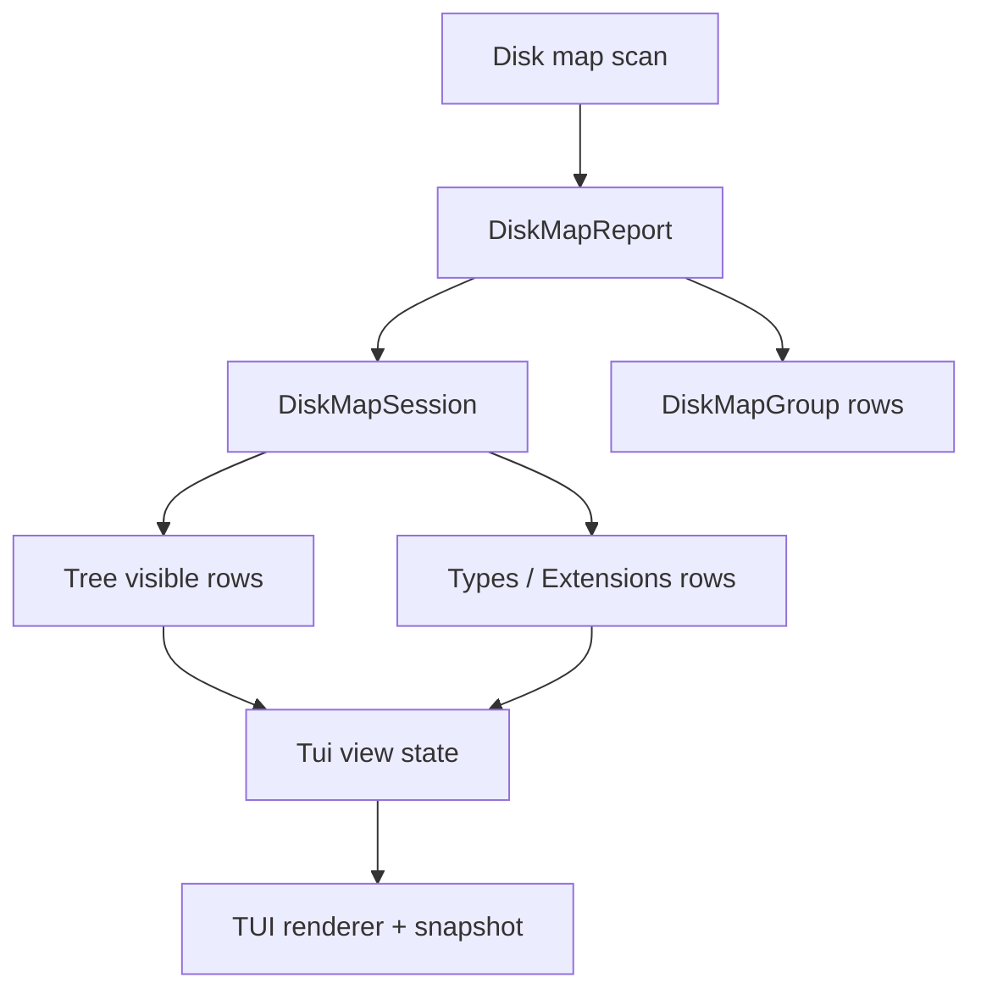
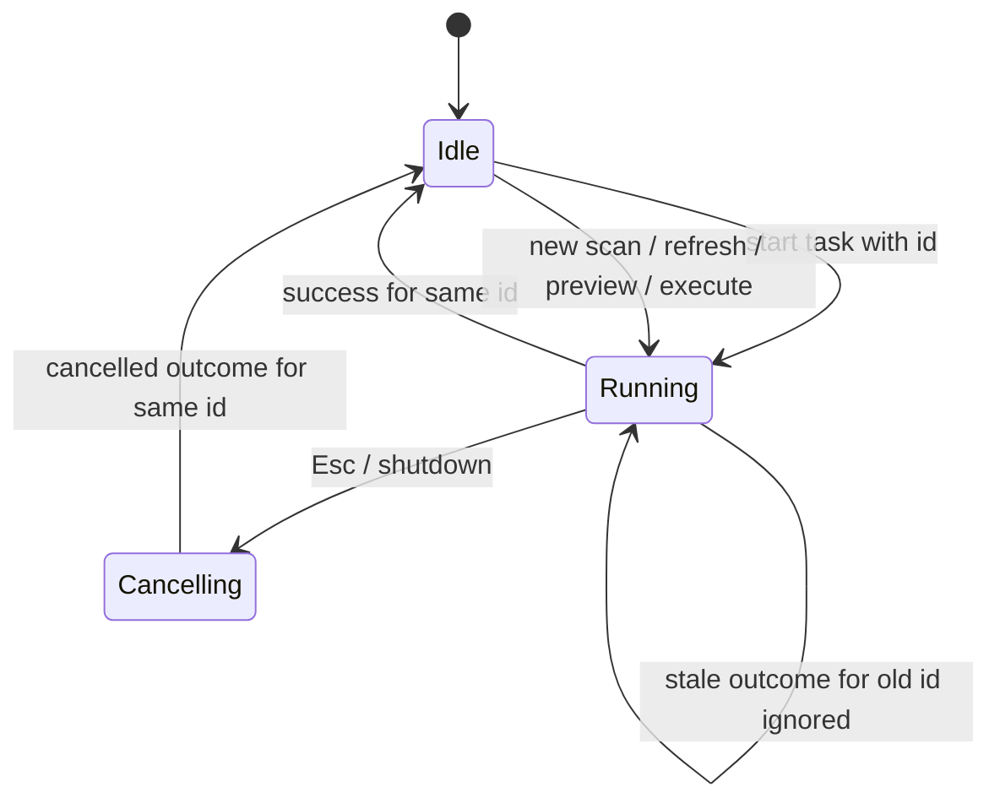
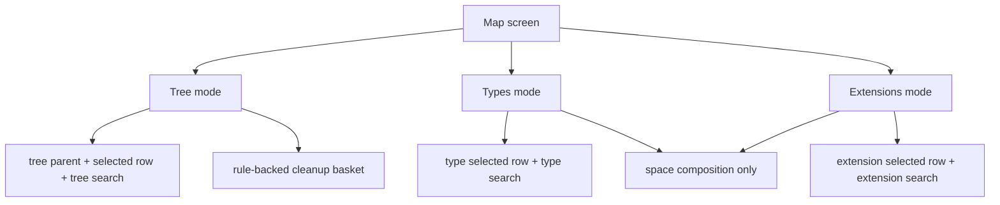

# TUI Distribution And Refresh Workbench - Plan

## Goal Capsule

| Field | Decision |
|---|---|
| Objective | Upgrade Rebecca's TUI from a single disk-map table into a multi-view workbench with tree, file-type, extension distribution, subtree refresh, and a stronger background task runtime. |
| Authority | User request: continue the TUI foundation work, prioritize async/concurrency infrastructure, optimize and fix aggressively, allow breaking refactors and deletion of unnecessary code. |
| Execution profile | Code implementation with characterization tests before core API refactors, focused TUI state tests per unit, then full workspace verification. |
| Stop conditions | Stop only for a cleanup-safety contradiction, an implementation discovery that invalidates the distribution/refresh model, or verification failures that require product-scope changes. |
| Landing | Work may commit incrementally with conventional commits after meaningful units; main-branch work is allowed by current repo practice. |

---

## Product Contract

### Summary

This plan extends `rebecca tui` with fast view switching between Tree, Types, and Extensions, lets users refresh the current root or subtree without restarting the TUI, and hardens background task ownership so scan, refresh, preview, execute, and future tasks share one stale-result-safe runtime.
The work intentionally favors a clean internal model over preserving transitional TUI state fields from the first workbench implementation.

### Problem Frame

The current TUI can scan a root, navigate ranked entries, stage rule-backed advice, preview cleanup, execute through recoverable trash, show history, and display live progress.
Its model is still first-generation: `TuiApp` owns one `Map` screen, one selected row index, one global sort, one path search string, and the session only keeps the tree projection from top entries while dropping report groups.
That shape blocks the next useful WizTree-like behaviors: file type/extension distribution, quick scan rescope, precise refresh after filesystem changes, and predictable async task ownership.

### Requirements

**Distribution views**

- R1. The TUI exposes Tree, Types, and Extensions as first-class view modes without leaving the current scan session.
- R2. Types and Extensions use typed disk-map/session data rather than re-parsing CLI text or re-walking the filesystem only to build UI rows.
- R3. Distribution rows show logical bytes, allocated bytes when known, unique bytes when known, file count, share of the current scope, and a stable label.
- R4. Distribution sort supports the same logical, allocated, files, and unique choices as the tree view.
- R5. Screen-reader and no-color modes carry the same distribution information without relying on bars or color.

**Refresh and task runtime**

- R6. Users can refresh the current root or selected subtree from the TUI and keep using the prior view while the refresh is running.
- R7. Refresh, scan, preview, and execute tasks have explicit task ids, task kinds, cancellation, stale-result rejection, and bounded progress updates.
- R8. A cancelled or superseded task cannot overwrite a newer session, preview, execution result, selection, or message.
- R9. TUI shutdown cancels and joins active background work without leaking threads or poisoning the global Ctrl+C token.

**State and interaction**

- R10. TUI state separates navigation state by view mode so switching tabs preserves each mode's selection and does not corrupt tree navigation.
- R11. Search/filter state is scoped enough that a tree path filter does not make extension/type rows disappear unexpectedly.
- R12. Key bindings remain compact: tab or number keys switch view modes, `s` cycles sort, `/` searches the active view, `r` refreshes the active scope, `R` refreshes the root, `Esc` backs out or cancels active work according to screen context.
- R13. Existing cleanup staging, preview, typed confirmation, recoverable-trash execution, and history behavior remain intact.

**Quality and compatibility**

- R14. Existing `inspect map` JSON, NDJSON, table, and human contracts remain stable unless a cleaner core API requires an intentional, tested breaking change.
- R15. TUI one-frame and key-replay test entry points cover the new views and refresh behavior without requiring an attached TTY.
- R16. Transitional code from the first TUI implementation is removed when the new state/runtime model replaces it.

### Acceptance Examples

- AE1. Given a scanned fixture containing `.rs`, `.md`, and extensionless files, when the user switches to Extensions, then the TUI shows rows for `.rs`, `.md`, and No extension with byte shares and file counts from the scan session.
- AE2. Given the same fixture in screen-reader mode, when the user switches to Extensions, then the snapshot contains textual bytes, share, kind, and file counts and contains no visual usage bars.
- AE3. Given a selected directory that changes on disk, when the user refreshes the selected subtree, then the old view remains visible while progress updates and the final tree/distribution rows reflect the refreshed subtree.
- AE4. Given a refresh is cancelled with Esc and a new scan starts after that, when the cancelled worker eventually returns, then its result is ignored and the newer scan remains the active session.
- AE5. Given a staged cleanup rule, when the user switches among Tree, Types, and Extensions, then the basket, preview, confirmation phrase, execution path, and history update behavior remain unchanged.

### Scope Boundaries

- In scope: core disk-map distribution contracts, session-level distribution rows, TUI view-mode state, Types and Extensions rendering, root/subtree refresh, task-runtime refactor, one-frame/replay tests, docs, changelog, and cleanup of transitional TUI code.
- In scope: breaking internal Rust APIs in `rebecca-core` and `crates/rebecca/src/tui` when that produces a simpler model with stronger tests.
- Deferred to follow-up work: mouse support, rectangular treemap, persistent scan daemon, file-open actions, restore-from-history UI, custom rule editing, and distribution drill-down from extension row into file list.
- Outside this product's identity: bypassing Rebecca's preview-first cleanup planner, permanent deletion from TUI, or treating TUI snapshots as a machine API.

---

## Planning Contract

### Key Technical Decisions

- KTD1. Promote distributions into the disk-map/session contract.
  `DiskMapReport` already has bounded groups for extension, depth, and age, but `DiskMapSession::from_report` drops them.
  The TUI should consume a session projection such as distribution rows so future views share one typed model.
- KTD2. Add a type/kind distribution beside extension distribution.
  Extensions answer "which suffixes use space"; Types answer "what kind of inventory is this" and should be represented as a first-class group kind instead of inferred from rendered strings.
- KTD3. Treat subtree refresh as a scan task with a scoped apply step.
  Refresh should reuse `inspect_map_with_progress`, cleanup-advice annotation, and the TUI task runtime; the session owns how a refreshed root/subtree replaces old nodes and distributions.
- KTD4. Replace ad hoc active-task handling with task identity.
  The current `ActiveTask` allows one worker, but outcomes are applied only by "whatever active task finished."
  Task ids and task kinds make cancellation, stale result rejection, and future concurrent read-only workers explicit.
- KTD5. Split view state from screen state.
  `TuiScreen::Map` is a screen; Tree, Types, and Extensions are modes inside that screen.
  Selection, search, and row derivation belong to mode-specific view state rather than one global `selected` and `search_query`.
- KTD6. Keep cleanup workflow independent from distribution rows.
  Staging stays rule/advice-backed from tree rows for this plan.
  Distribution rows explain space composition; converting an extension row into a cleanup selection is deferred until Rebecca has a safe product model for that action.
- KTD7. Keep CI snapshots intentionally text-first.
  Ratatui rendering remains the human surface, but `view::snapshot` is the stable CI oracle for tab labels, row content, width caps, and screen-reader behavior.

### High-Level Technical Design

### Assumptions

- The initial Types view can be implemented as file/directory/other inventory kind distribution if a richer MIME-like classifier would delay the core TUI architecture.
- Extension distribution should use lower-cased suffix keys and keep the existing `[no-extension]`/`No extension` semantics.
- Refresh may serialize background work at first; task identity is still required so cancellation and stale outcomes are correct before future read-only concurrency is added.
- Subtree refresh should preserve the active basket and cleanup preview only when staged rule ids are still valid; stale previews should be cleared after any scan/session replacement.

### System-Wide Impact

- `rebecca-core/src/disk_map.rs` becomes a stronger source of truth for distribution data consumed by CLI and TUI.
- `rebecca-core/src/disk_session.rs` becomes more than a tree adapter; it owns session projections, scoped rows, and refresh application semantics.
- `crates/rebecca/src/tui/app.rs` should shrink as view state, task state, and row projection move into narrower modules.
- Existing CLI inspect map contracts are protected by characterization tests before any core refactor.

### Risks & Dependencies

| Risk | Mitigation |
|---|---|
| Session groups are global today, while subtree refresh needs scoped distribution. | Model distribution rows with explicit scope metadata and add focused tests for root vs refreshed subtree behavior. |
| Task runtime refactor can accidentally regress cleanup preview/execute flow. | Keep workbench request/result APIs unchanged and add app-state tests for staged basket through view switches and refresh. |
| `DiskMapSession` currently reconstructs parents from bounded top entries, so incomplete session data can mislead distribution UI. | Distribution rows come from scan groups or refreshed scope reports, not from visible top rows unless explicitly labeled as visible-row-only. |
| Refresh merging can leave stale node ids or unreachable nodes. | Prefer rebuilding a compact session from old roots plus refreshed scope over in-place mutation unless tests prove the in-place path is simpler and safe. |
| Snapshot tests can become brittle. | Assert stable textual signals, width bounds, and absence/presence of bars instead of full-frame golden dumps. |

### Sources & Research

- `crates/rebecca/src/tui/app.rs` has the current single-screen TUI state, key handling, basket, preview, and task progress application.
- `crates/rebecca/src/tui/task.rs` has the current background scan/preview/execute worker and child cancellation token pattern.
- `crates/rebecca/src/tui/view.rs` has the current map/details/busy rendering and deterministic snapshot surface.
- `crates/rebecca-core/src/disk_map.rs` already provides `DiskMapGroupKind`, `DiskMapGroup`, group sorting, extension/depth/age grouping, progress, and backend provenance.
- `crates/rebecca-core/src/disk_session.rs` builds a navigable tree from `DiskMapReport` top entries but currently drops `groups`.
- `crates/rebecca-core/tests/disk_map.rs`, `crates/rebecca-core/tests/disk_session.rs`, `crates/rebecca/tests/cli_inspect.rs`, and `crates/rebecca/tests/cli_tui.rs` are the characterization and feature test bases.
- `README.md` and `CHANGELOG.md` already document TUI live progress and `inspect map --group-by extension`, so the new TUI views should align with those terms.

---

## Implementation Units

### U1. Extend core disk-map distributions

- **Goal:** Make distribution data complete enough for TUI Types and Extensions without a second UI-only scan.
- **Requirements:** R1, R2, R3, R4, R14
- **Dependencies:** None
- **Files:** `crates/rebecca-core/src/disk_map.rs`, `crates/rebecca/src/cli.rs`, `crates/rebecca/src/inspect.rs`, `crates/rebecca/src/render/inspect.rs`, `crates/rebecca-core/tests/disk_map.rs`, `crates/rebecca/tests/cli_inspect.rs`, `crates/rebecca/tests/cli_help.rs`
- **Approach:** Add a type/kind group to the disk-map grouping model, keep extension grouping semantics stable, and characterize existing inspect-map group JSON/table behavior before changing internals.
  Ensure grouped metrics use the same logical, allocated, unique, and file-count accounting as ranked entries.
- **Execution note:** Start with characterization coverage for existing group output, then add failing tests for the new type/kind group.
- **Patterns to follow:** Existing `DiskMapGroupKind::Extension`, `DiskMapGroupCollector::record_file`, `DiskMapSortField::metrics_value`, and `inspect_map_json_reports_requested_groups`.
- **Test scenarios:** Existing extension/depth/age groups remain unchanged in JSON and table output. A fixture with files, directories, and non-file entries produces type/kind groups with stable keys and labels. Sorting by `files` places the group with the most files first. Allocated/unique metrics remain nullable and fall back consistently with current sort semantics. Experimental backend fallback preserves all requested groups.
- **Verification:** Focused `disk_map` and `cli_inspect` tests pass before moving to session changes.

### U2. Promote distributions into `DiskMapSession`

- **Goal:** Expose session-level tree rows and distribution rows through typed APIs with explicit scope.
- **Requirements:** R1, R2, R3, R4, R10, R11
- **Dependencies:** U1
- **Files:** `crates/rebecca-core/src/disk_session.rs`, `crates/rebecca-core/src/lib.rs`, `crates/rebecca-core/tests/disk_session.rs`, `crates/rebecca/src/tui/app.rs`
- **Approach:** Carry report groups into `DiskMapSession`, add distribution row structs with kind, key, label, metrics, share denominator, and scope path/root, and add query APIs for tree rows vs distribution rows.
  Keep path search and distribution search separate: tree search matches paths; distribution search matches labels/keys.
- **Execution note:** Characterize current session navigation and parent-chain reconstruction before changing `DiskMapSession::from_report`.
- **Patterns to follow:** `DiskMapVisibleRow`, `DiskMapSessionFilter`, `children_sorted_by`, and current disk-session tests.
- **Test scenarios:** A session built from a report with extension/type groups returns distribution rows in requested sort order. Distribution rows use root totals as share denominator for full-root scans. Tree visible rows remain unchanged for existing fixtures. Path filtering does not filter extension/type labels. Empty groups return an empty row list without panics. Serialization remains stable for existing session fields or is intentionally updated with tests.
- **Verification:** `crates/rebecca-core/tests/disk_session.rs` passes and TUI app tests still compile.

### U3. Add scoped refresh application

- **Goal:** Let the TUI replace the current root or selected subtree from a fresh scan without restarting the whole app.
- **Requirements:** R6, R8, R10, R13, R16
- **Dependencies:** U2
- **Files:** `crates/rebecca-core/src/disk_session.rs`, `crates/rebecca-core/tests/disk_session.rs`, `crates/rebecca/src/tui/app.rs`
- **Approach:** Add a refresh scope model and a session apply API that consumes a refreshed `DiskMapReport`.
  Prefer rebuilding a compact session projection over in-place descendant deletion so node ids, parent links, root ids, and distributions remain coherent.
  Clear stale preview/execution state after refresh while preserving the rule basket when rule ids still exist.
- **Patterns to follow:** Existing session builder and app `apply_scan_result` state reset.
- **Test scenarios:** Refreshing a root replaces its metrics, children, and distributions while preserving other roots. Refreshing a child subtree updates that child and its descendants while retaining parent navigation. Selection moves to a valid row after the refreshed row count shrinks. A stale preview is cleared after refresh. A staged rule remains in the basket when the rule id is still present in refreshed advice and is removed or marked stale when no refreshed row supports it.
- **Verification:** Core session refresh tests and TUI app state tests pass.

### U4. Refactor TUI task runtime around task ids

- **Goal:** Make scan, refresh, preview, and execute workers share one explicit, stale-result-safe runtime.
- **Requirements:** R6, R7, R8, R9
- **Dependencies:** U3
- **Files:** `crates/rebecca/src/tui/task.rs`, `crates/rebecca/src/tui/app.rs`, `crates/rebecca/src/tui/mod.rs`, `crates/rebecca/tests/cli_tui.rs`
- **Approach:** Introduce task id, task kind, task request, task update, and task outcome types.
  Keep one active mutating task initially, reject or ignore stale outcomes by id, and ensure cancellation only targets the child task token.
  Add refresh task variants that reuse scan progress conversion and cleanup-advice annotation.
- **Patterns to follow:** Current `ActiveTask`, `runtime.child_task()`, `progress_sender`, `plan_progress_sender`, and `run_interactive` single active-task guard.
- **Test scenarios:** Starting a refresh while a scan is active produces a clear message and does not spawn a second worker. Cancelling a refresh marks cancel requested and returns to the prior screen. A stale outcome with an old task id does not change session, preview, execution result, message, or selection. Shutdown cancels and joins active work. Preview and execute outcomes still update plan/history exactly once.
- **Verification:** Focused TUI task/app tests pass without requiring a real TTY.

### U5. Split TUI map view state and interactions

- **Goal:** Add Tree, Types, and Extensions modes with independent selection/search state and predictable keys.
- **Requirements:** R1, R4, R10, R11, R12, R13
- **Dependencies:** U2, U4
- **Files:** `crates/rebecca/src/tui/app.rs`, `crates/rebecca/src/tui/model.rs`, `crates/rebecca/src/tui/task.rs`, `crates/rebecca/tests/cli_tui.rs`
- **Approach:** Extract view-mode state from `TuiApp`: active mode, per-mode selection, per-mode search, shared sort, and row projection methods.
  `Tab`, `1`, `2`, and `3` switch modes; `s` cycles sort for the active mode; `/` edits the active search; `r` refreshes selected subtree or active root; `R` refreshes the root.
  Tree mode keeps cleanup staging; distribution modes are read-only composition views for this plan.
- **Patterns to follow:** Current pure `handle_key` tests and `selected_row`/`visible_rows` derivation.
- **Test scenarios:** Switching modes preserves each mode's selected row. Tree search matches paths while extension search matches `.rs`/`No extension` labels. `s` reorders extension rows by file count. `r` on a tree directory emits a scoped refresh effect. `r` in Extensions refreshes the current tree scope rather than treating an extension row as a path. Staging a tree rule remains intact after switching modes. Help text names the new keys.
- **Verification:** Pure app-state tests cover all key behaviors.

### U6. Render distribution views and snapshots

- **Goal:** Make Types and Extensions feel like native TUI views, not debug dumps.
- **Requirements:** R1, R3, R4, R5, R12, R15
- **Dependencies:** U5
- **Files:** `crates/rebecca/src/tui/view.rs`, `crates/rebecca/src/tui/app.rs`, `crates/rebecca/tests/cli_tui.rs`
- **Approach:** Render a compact tab/header, table columns appropriate to the active mode, percentage/share bars when visual bars are enabled, and a detail pane that explains the selected distribution row.
  Snapshot output should include the active mode, row labels, bytes, share, files, and status text.
- **Patterns to follow:** Current `render_map`, `snapshot_map`, `byte_bar`, `trim_to_width`, and screen-reader inspect-map group rendering.
- **Test scenarios:** A 120-column snapshot shows the Extensions view with `.rs`, `.md`, and No extension rows. An 80-column snapshot keeps every line within the injected width. Screen-reader snapshots omit visual bars but include textual share and file counts. No-color mode still marks selection and active tab with text. Long extension/type labels are trimmed by display width. Empty distributions render a clear empty state.
- **Verification:** TUI snapshot/replay tests pass.

### U7. Wire refresh journeys, docs, and final simplification

- **Goal:** Cover the full user journey and remove transitional TUI code made obsolete by the new model.
- **Requirements:** R6, R7, R8, R9, R14, R15, R16
- **Dependencies:** U1, U2, U3, U4, U5, U6
- **Files:** `crates/rebecca/src/tui/`, `crates/rebecca-core/src/disk_map.rs`, `crates/rebecca-core/src/disk_session.rs`, `crates/rebecca/tests/cli_tui.rs`, `README.md`, `CHANGELOG.md`, `docs/knowledge/engineering/current-state.md`, `skills/rebecca-disk-cleaner/SKILL.md`
- **Approach:** Add replay journeys for switching views, refreshing, cancelling refresh, and preserving cleanup workflow.
  Update docs and skill guidance to mention Tree/Types/Extensions, refresh, and the automation boundary.
  Run a simplification pass over `TuiApp`, task runtime, and view helpers; delete obsolete single-map assumptions and unused transitional APIs.
- **Patterns to follow:** Existing README TUI section, changelog style, `python skills/validate.py`, and current `cli_tui` smoke tests.
- **Test scenarios:** `--replay-keys "tab"` reaches Types or Extensions deterministically. A replay can switch to Extensions, sort, search, and render expected rows. A refresh replay on a fixture updates visible bytes after a filesystem change path available to the test harness. Cancelled refresh returns to the prior mode. Existing preview/execute app-state tests still pass after view-mode extraction. Documentation examples match live help.
- **Verification:** Full Verification Contract passes and the final diff has no dead task/view scaffolding.

---

## Verification Contract

| Gate | Applies to | Expected result |
|---|---|---|
| `cargo fmt --all -- --check` | All units | Formatting is stable. |
| `cargo clippy --workspace --all-targets -- -D warnings` | All Rust units | No warnings, no dead code, no unused transitional APIs. |
| `cargo nextest run -p rebecca-core --test disk_map --test disk_session --locked` | U1, U2, U3 | Core distribution and session contracts pass. |
| `cargo nextest run -p rebecca --test cli_inspect --test cli_tui --locked` | U1, U4, U5, U6, U7 | CLI group contracts and TUI journeys pass. |
| `cargo nextest run --workspace --locked` | All units | Existing and new tests pass. |
| `cargo deny check` | Core/API changes and dependency surface | Dependency policy remains green, allowing the existing duplicate warning only if still present. |
| `cargo run -p rebecca --locked -- tui --once --screen-reader --terminal-width 80 --root .` | U5, U6, U7 | Headless TUI frame renders bounded text without visual bars. |
| `cargo run -p rebecca --locked -- inspect map --root . --top 5 --group-by extension --group-by type --format json` | U1, U7 | Inspect map exposes the distribution data the TUI consumes. |
| `python skills/validate.py` | U7 | Rebecca skill docs remain valid. |

---

## Definition of Done

- `rebecca tui` has Tree, Types, and Extensions modes with deterministic keyboard switching and CI snapshot coverage.
- Distribution rows come from typed disk-map/session data and include bytes, share, files, sort, screen-reader, and no-color behavior.
- Root and subtree refresh run as cancellable TUI tasks and stale outcomes cannot overwrite newer app state.
- Cleanup staging, preview, typed confirmation, recoverable-trash execution, and history behavior still work after view-mode and task-runtime refactors.
- Existing inspect map JSON/NDJSON/table contracts remain stable or are intentionally updated with characterization tests and docs.
- README, CHANGELOG, current-state docs, and the Rebecca skill describe the new TUI capabilities and automation boundary.
- Abandoned scaffolding and first-generation TUI state/runtime code are removed before the final commit.
