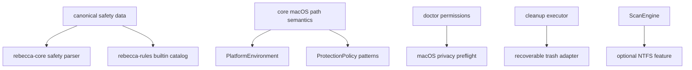

# macOS Platform Boundaries Refactor - Plan

## Goal Capsule

| Field | Value |
|---|---|
| Objective | Refactor Rebecca's macOS platform boundary before v0.2.0 so path semantics, permission diagnostics, recoverable trash execution, NTFS feature exposure, and safety catalog ownership are centralized, testable, and release-safe. |
| Authority | The user's v0.2.0 fearless-refactor direction outranks unreleased API compatibility; deletion safety, license hygiene, and root-cause fixes outrank preserving duplicated code or incidental feature defaults. |
| Execution profile | Breaking changes are allowed when they remove duplicated safety data, make platform semantics explicit, or shrink non-macOS dependency surface. |
| Stop conditions | Stop if an implementation copies GPL code or rules from `repo-ref/Mole`, broadens macOS cleanup into durable user data, silently changes permanent-delete semantics, or makes Windows NTFS behavior disappear without an explicit fallback contract. |
| Tail ownership | `ce-work` owns implementation, verification, and logical local commits; pushing remains a final landing decision after the verification contract is green unless the user redirects earlier. |

---

## Product Contract

### Summary

Rebecca has macOS cleanup support, but the platform boundary is still too distributed for a v0.2.0 release.
The next change should consolidate the logic that decides what a macOS path means, remove the duplicated built-in safety catalog, turn `doctor permissions` into a real macOS preflight, make recoverable-trash tests independent from the user's system Trash, and make the Windows NTFS parser an explicit feature surface instead of an unconditional core dependency.

### Problem Frame

The current codebase already fixed the immediate macOS failures, including `/var` alias handling, macOS npm fixture paths, test-only trash redirection, and user-Library safety tightening.
Those fixes exposed the deeper issue: macOS behavior is encoded across `crates/rebecca-core/src/environment.rs`, `crates/rebecca-core/src/protection/patterns.rs`, two identical `safety/cleanup.toml` files, CLI doctor text, and debug-only execution hooks.
That shape is fragile because a future rule can update one copy or one path recognizer without updating the others.

`repo-ref/Mole` remains useful only as a behavior reference for permission posture: do not drive tests through `sudo`, Finder prompts, TCC mutation, `osascript`, or `launchctl`; use preflight diagnostics and fail closed.
Because Mole is GPL-licensed while Rebecca is MIT OR Apache-2.0, this plan does not copy Mole implementation, rule lists, or text.

### Requirements

**macOS platform semantics**

- R1. macOS user-Library roots, semantic placeholders, and durable-data detection must live behind one deep module boundary that both environment expansion and protection logic use.
- R2. User-owned macOS cache and log leaves must remain allowable only when rooted at semantic placeholders or `/Users/<name>/Library/...`; system `/Library/...` and `/System/...` paths must stay blocked.
- R3. Browser, Electron, developer-cache, log, container, and group-container macOS classifications must be expressed as named predicates instead of scattered ad hoc segment matching.

**Safety catalog ownership**

- R4. The built-in safety catalog must have one canonical source so `rebecca-core` and `rebecca-rules` cannot drift.
- R5. Cargo packaging must include the canonical safety data in the crates that need it and must not package `repo-ref/Mole` or other reference repositories.

**Permission and execution preflight**

- R6. `doctor permissions` must expose a structured macOS privacy preflight in JSON and human output without requesting Full Disk Access, invoking privileged helpers, or recommending `sudo` as a TCC workaround.
- R7. Recoverable trash execution must use an injectable backend seam so tests can exercise move-to-trash behavior without touching the user's platform Trash; CLI integration may keep a debug-only environment adapter for child-process tests.

**Feature surface and release readiness**

- R8. Windows NTFS/MFT support must be an explicit feature or target-gated dependency surface so macOS-focused builds do not carry Windows-heavy implementation accidentally.
- R9. Existing CLI API v1 schema, docs, and tests must describe the new permission payload and any changed feature defaults.
- R10. The full workspace must pass format, focused nextest gates, full nextest, doc tests, and cargo package listing checks before the plan is considered done.

### Acceptance Examples

- AE1. Given `/Users/alice/Library/Caches/pip`, protection policy can classify it as a macOS user cache candidate; given `/Library/Caches/pip`, the same policy blocks it as a system path before maintenance allowlists can apply.
- AE2. Given a macOS rule target using `%MACOS_CACHE_HOME%`, environment expansion, safety catalog validation, and runtime protection all agree on the same semantic root.
- AE3. Given `rebecca doctor permissions --format json` on macOS, the payload includes a structured privacy/preflight object with a non-invasive status such as `no-block-detected`, `likely-blocked`, or `unknown`.
- AE4. Given cleanup execution in CLI tests, allowed targets move into the isolated test trash adapter and no test depends on Finder, the system Trash, or platform dialogs.
- AE5. Given a default macOS-focused `cargo tree` or build without NTFS feature opt-in, `rebecca-core` no longer needs to compile `rebecca-ntfs`; all-feature builds still compile and test the NTFS path.
- AE6. Given `cargo package -p rebecca* --allow-dirty --list`, release packages include the canonical safety catalog and exclude `repo-ref/Mole`.

### Scope Boundaries

- This plan does not add new macOS cleanup rule families; it hardens the platform boundary under the rules already added.
- This plan does not implement native macOS Trash, APFS, FSEvents, LaunchServices, or TCC database integration.
- This plan does not remove Windows NTFS/MFT behavior; it makes the dependency and feature surface explicit.
- This plan does not delete `repo-ref/Mole` from the working repository unless it becomes necessary for package hygiene; package exclusion and license-safe usage are the release blockers.
- This plan does not write execution progress back into this plan file.

### Sources

- `docs/plans/2026-07-07-001-feat-macos-cleanup-platform-plan.md` is the completed macOS adaptation baseline.
- `crates/rebecca-core/src/environment.rs` owns semantic environment defaults today.
- `crates/rebecca-core/src/protection/patterns.rs` owns current macOS cache, log, and durable-data recognition.
- `crates/rebecca-core/src/safety_catalog.rs` embeds `crates/rebecca-core/safety/cleanup.toml`.
- `crates/rebecca-rules/src/lib.rs` embeds `crates/rebecca-rules/safety/cleanup.toml`.
- `crates/rebecca/src/info.rs` owns `doctor permissions` output.
- `crates/rebecca-core/src/executor.rs` owns recoverable-trash execution and test redirection.
- `crates/rebecca-core/src/scan.rs` and `crates/rebecca-core/src/scan/windows_ntfs_mft.rs` own the experimental NTFS backend surface.

---

## Planning Contract

### Key Technical Decisions

- KTD1. Create a macOS platform semantics module in `rebecca-core`.
  The module should expose named predicates and root helpers, while rule manifests remain declarative data.
- KTD2. Use one canonical safety data crate or equivalent package-owned source, not symlinks or generated duplicate TOML.
  A small data-only crate keeps `rebecca-core` and `rebecca-rules` acyclic while letting both parse the same embedded string.
- KTD3. Keep macOS permission preflight observational.
  The CLI may probe readable user-owned paths, but it must not request permissions, mutate TCC state, shell out to AppleScript, or imply `sudo` fixes Full Disk Access.
- KTD4. Make recoverable trash a backend adapter, not a global side effect.
  Production keeps the `trash` crate path; tests and CLI child processes select an isolated adapter through an explicit constructor or debug-only environment bridge.
- KTD5. Feature-gate NTFS live indexing while preserving fallback semantics.
  The user-facing backend enum can stay stable, but unavailable builds must return the existing platform-unavailable fallback path instead of requiring the parser crate.
- KTD6. Treat Mole as license-sensitive prior art only.
  Behavior lessons can shape permission posture, but code, rule data, and prose cannot be copied into Rebecca.

### High-Level Technical Design

The target design has three deep seams: canonical safety data, macOS path semantics, and recoverable-trash execution.
Everything else should call those seams instead of reinterpreting paths or deletion behavior locally.

### Sequencing

1. Replace duplicate safety catalog data with one canonical packaged source.
2. Extract macOS path semantics and migrate environment/protection logic onto it.
3. Extend `doctor permissions` with structured macOS privacy diagnostics.
4. Adapterize recoverable trash execution and move tests onto the adapter seam.
5. Feature-gate the NTFS parser dependency and verify default/all-feature builds.
6. Update docs, schemas, package lists, and release verification.

### System-Wide Impact

- Safety catalog consumers move from duplicated `include_str!` paths to a shared data source.
- macOS protection tests become semantic-root tests instead of raw string-shape tests.
- CLI API v1 gains a new nested permission field and the schema must stay strict.
- Build and package metadata changes may alter default dependency trees.
- Windows NTFS tests must continue under `--all-features` even if default builds stop compiling the parser.

### Risks and Mitigations

| Risk | Mitigation |
|---|---|
| New safety data crate creates publish/package friction. | Keep it data-only, workspace-versioned, and covered by `cargo package -p rebecca-safety --allow-dirty --list`. |
| Moving macOS predicates changes safety behavior accidentally. | Add characterization tests for allowed user cache/log leaves and blocked system/durable roots before moving code. |
| Privacy preflight probes become noisy on real machines. | Probe only selected user-owned paths, tolerate missing paths, and report `unknown` instead of failing the command. |
| Trash adapter abstraction hides batch failure behavior. | Keep batch fallback tests and assert per-target outcomes after injected adapter failures. |
| NTFS feature gating breaks docs or all-feature tests. | Preserve the backend label and run `cargo nextest run --workspace --all-features --no-fail-fast` before landing. |

---

## Implementation Units

### U1. Canonical safety catalog source

- **Goal:** Delete duplicated built-in safety TOML and make both core and rules parse one packaged data source.
- **Requirements:** R4, R5, AE2, AE6.
- **Files:** `Cargo.toml`, `Cargo.lock`, `crates/rebecca-safety/Cargo.toml`, `crates/rebecca-safety/src/lib.rs`, `crates/rebecca-safety/safety/cleanup.toml`, `crates/rebecca-core/Cargo.toml`, `crates/rebecca-core/src/safety_catalog.rs`, `crates/rebecca-rules/Cargo.toml`, `crates/rebecca-rules/src/lib.rs`, `crates/rebecca-core/safety/cleanup.toml`, `crates/rebecca-rules/safety/cleanup.toml`, `crates/rebecca-core/tests/safety_catalog.rs`, `crates/rebecca-rules/src/lib.rs`, `docs/rule-authoring.md`, `docs/security-audit.md`.
- **Approach:** Introduce a data-only workspace crate exposing the embedded cleanup safety catalog string and display path, update core/rules loaders to use it, remove the two duplicate TOML files, and replace drift tests with canonical-source tests.
- **Test scenarios:** Core default safety catalog loads all platforms from the canonical source; rules built-in catalog uses the same data; warning/category counts stay stable; package listing includes the canonical TOML once per crate dependency path and excludes `repo-ref/Mole`.
- **Verification:** `cargo nextest run -p rebecca-core --test safety_catalog --no-fail-fast`, `cargo nextest run -p rebecca-rules --no-fail-fast`, and `cargo package -p rebecca-safety --allow-dirty --list`.

### U2. macOS path semantics deep module

- **Goal:** Centralize macOS root derivation and path classification behind named helpers.
- **Requirements:** R1, R2, R3, AE1, AE2.
- **Files:** `crates/rebecca-core/src/lib.rs`, `crates/rebecca-core/src/environment.rs`, `crates/rebecca-core/src/protection/patterns.rs`, `crates/rebecca-core/src/macos_paths.rs`, `crates/rebecca-core/tests/path_templates.rs`, `crates/rebecca-core/tests/safety_policy.rs`, `crates/rebecca-core/tests/safety_catalog.rs`.
- **Approach:** Add a crate-internal macOS path module for default suffixes, semantic placeholder recognition, `/Users/<name>/Library/...` root recognition, user cache/log/application-support classification, and durable Library categories; migrate environment and protection code to call it.
- **Test scenarios:** `%MACOS_CACHE_HOME%`, `%MACOS_APPLICATION_SUPPORT_HOME%`, `%MACOS_LOG_HOME%`, `%MACOS_CONTAINER_HOME%`, and `%MACOS_GROUP_CONTAINER_HOME%` expand from `HOME`; literal `/Users/alice/Library/Caches/pip` can be allowed; `/Library/Caches/pip`, `/Library/Application Support/Slack/Cache`, `/Users/alice/Library/Application Support/Google/Chrome/Default/History`, and container roots remain blocked.
- **Verification:** `cargo nextest run -p rebecca-core --test path_templates --no-fail-fast`, `cargo nextest run -p rebecca-core --test safety_policy --no-fail-fast`, and focused `cargo nextest run -p rebecca-core --test safety_catalog default_safety_catalog_loads_auditable_platform_knowledge --no-fail-fast`.

### U3. macOS permission diagnostics preflight

- **Goal:** Make `doctor permissions` report macOS privacy readiness as structured, non-invasive diagnostics.
- **Requirements:** R6, R9, AE3.
- **Files:** `crates/rebecca/src/info.rs`, `crates/rebecca/tests/info.rs`, `crates/rebecca/tests/cli_output.rs`, `crates/rebecca/tests/cli_api.rs`, `docs/api/cli/v1/payloads.schema.json`, `docs/api/cli/v1/README.md`, `README.md`.
- **Approach:** Add a nested macOS privacy diagnostic with status, probe summary, and guidance; use pure filesystem probes against selected user-owned privacy-sensitive directories when present; keep non-macOS payloads valid with `null` or omitted fields per schema decision.
- **Test scenarios:** JSON schema accepts the new field; human output names macOS privacy preflight on macOS; unsupported or non-macOS hosts keep existing privilege labels; permission-denied probe cases report `likely-blocked` without failing the command; missing probe paths report `unknown` or `not-required` consistently.
- **Verification:** `cargo nextest run -p rebecca --test cli_api doctor_permissions --no-fail-fast`, `cargo nextest run -p rebecca --test info doctor_permissions --no-fail-fast`, and `cargo nextest run -p rebecca --test cli_output doctor_permissions --no-fail-fast`.

### U4. Recoverable trash backend adapter

- **Goal:** Separate production trash behavior from test trash behavior without changing cleanup semantics.
- **Requirements:** R7, AE4.
- **Files:** `crates/rebecca-core/src/executor.rs`, `crates/rebecca-core/tests/executor.rs`, `crates/rebecca/tests/common/isolated.rs`, `crates/rebecca/tests/cli_clean.rs`, `crates/rebecca/tests/cli_cache.rs`, `crates/rebecca/tests/cli_apps.rs`.
- **Approach:** Introduce a private trash adapter trait or enum used by `RecoverableTrashBackend`, keep production adapter backed by `trash::delete` and `trash::delete_all`, and move debug test redirection into an explicit isolated adapter constructor plus a debug-only CLI environment bridge.
- **Test scenarios:** Single-target and batch cleanup move files through the isolated adapter; preserve-root cleanup moves children but preserves the root; adapter batch failure still reconstructs per-target outcomes; cache purge uses the same adapter; CLI integration tests keep using isolated child-process trash.
- **Verification:** `cargo nextest run -p rebecca-core --test executor --no-fail-fast`, `cargo nextest run -p rebecca --test cli_clean --no-fail-fast`, `cargo nextest run -p rebecca --test cli_cache --no-fail-fast`, and `cargo nextest run -p rebecca --test cli_apps --no-fail-fast`.

### U5. NTFS dependency and feature surface

- **Goal:** Make Windows NTFS/MFT support opt-in at the dependency level while preserving all-feature behavior and fallback contracts.
- **Requirements:** R8, R9, AE5.
- **Files:** `Cargo.toml`, `Cargo.lock`, `crates/rebecca-core/Cargo.toml`, `crates/rebecca/Cargo.toml`, `crates/rebecca-core/src/scan.rs`, `crates/rebecca-core/src/scan/windows_ntfs_mft.rs`, `crates/rebecca-core/src/disk_map.rs`, `crates/rebecca-core/tests/scan_engine.rs`, `crates/rebecca-core/tests/disk_map.rs`, `crates/rebecca/tests/cli_clean.rs`, `crates/rebecca/tests/cli_inspect.rs`, `README.md`, `docs/api/cli/v1/README.md`, `docs/configuration.md`, `docs/release.md`.
- **Approach:** Make `rebecca-ntfs` optional behind a `ntfs` feature, compile the live NTFS implementation only when both Windows and the feature are enabled, and provide stub fallback functions for builds without the feature that return the existing platform-unavailable diagnostic.
- **Test scenarios:** Default non-Windows builds do not compile `rebecca-ntfs`; `--all-features` builds compile existing NTFS tests; selecting `windows-ntfs-mft-experimental` without the feature falls back with the same user-facing backend label and diagnostic shape; docs name the feature when live NTFS evidence is required.
- **Verification:** `cargo check -p rebecca-core --no-default-features`, `cargo nextest run -p rebecca-core --all-features --test scan_engine --no-fail-fast`, `cargo nextest run -p rebecca-core --all-features --test disk_map --no-fail-fast`, and focused CLI inspect/clean tests that select `windows-ntfs-mft-experimental`.

### U6. Release verification and cleanup

- **Goal:** Finish the refactor with docs, package hygiene, full tests, and no dead scaffolding.
- **Requirements:** R5, R9, R10, AE6.
- **Files:** `README.md`, `docs/api/cli/v1/README.md`, `docs/security-audit.md`, `docs/release.md`, `docs/knowledge/engineering/current-state.md`, `docs/knowledge/engineering/log.md`, `Cargo.toml`, `Cargo.lock`.
- **Approach:** Update documentation for canonical safety data, macOS permission diagnostics, test trash behavior, and NTFS features; remove stale comments/tests that mention duplicated catalogs; run package listing checks for release crates and verify reference repos are not included.
- **Test scenarios:** Documentation no longer points rule authors at removed safety TOML paths; package lists include the new data crate and no GPL reference tree; full nextest and doc tests pass; `cargo fmt` is clean.
- **Verification:** `cargo fmt --all -- --check`, `cargo nextest run --workspace --all-features --no-fail-fast`, `cargo test --workspace --all-features --doc`, `cargo package -p rebecca --allow-dirty --list`, `cargo package -p rebecca-core --allow-dirty --list`, `cargo package -p rebecca-rules --allow-dirty --list`, and `cargo package -p rebecca-safety --allow-dirty --list`.

---

## Verification Contract

| Gate | Command | Proves |
|---|---|---|
| Formatting | `cargo fmt --all -- --check` | Rust formatting is stable. |
| Safety catalog | `cargo nextest run -p rebecca-core --test safety_catalog --no-fail-fast` and `cargo nextest run -p rebecca-rules --no-fail-fast` | Canonical safety data loads and rule validation still holds. |
| macOS protection | `cargo nextest run -p rebecca-core --test safety_policy --no-fail-fast` | User Library cache/log paths and durable/system paths stay correctly classified. |
| Permission diagnostics | `cargo nextest run -p rebecca --test cli_api doctor_permissions --no-fail-fast` | CLI API schema and doctor payload match the new permission contract. |
| Trash execution | `cargo nextest run -p rebecca-core --test executor --no-fail-fast` plus focused CLI cleanup/cache tests | Recoverable-trash semantics work through the adapter and CLI bridge. |
| NTFS feature surface | `cargo check -p rebecca-core --no-default-features` and focused all-feature NTFS tests | Default build can omit NTFS while all-feature behavior remains covered. |
| Full workspace | `cargo nextest run --workspace --all-features --no-fail-fast` | Cross-crate Rust behavior is green. |
| Docs | `cargo test --workspace --all-features --doc` | Public docs compile. |
| Package hygiene | `cargo package -p rebecca --allow-dirty --list`, `cargo package -p rebecca-core --allow-dirty --list`, `cargo package -p rebecca-rules --allow-dirty --list`, `cargo package -p rebecca-safety --allow-dirty --list` | Release crates package the intended files and exclude GPL reference repositories. |

---

## Definition of Done

| Unit | Done signal |
|---|---|
| U1 | Only one canonical safety catalog TOML remains in active crates, and both core and rules parse it. |
| U2 | macOS semantic roots are centralized and protection tests prove user cache/log allow paths versus system/durable block paths. |
| U3 | `doctor permissions` exposes structured macOS privacy diagnostics in JSON and clear non-sudo human guidance. |
| U4 | Recoverable-trash tests use an injected isolated adapter and production behavior still calls the platform trash backend. |
| U5 | NTFS/MFT is optional at the dependency level, while all-feature builds preserve the experimental backend and fallback contract. |
| U6 | Docs, schema, package lists, full nextest, and doc tests are green or have a documented platform-only exception. |

No implementation unit is complete until its focused tests have passed.
The plan is complete only after the full Verification Contract is satisfied and any logical commits contain only files changed for this refactor.
