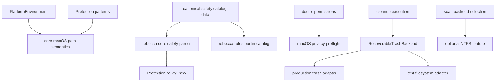
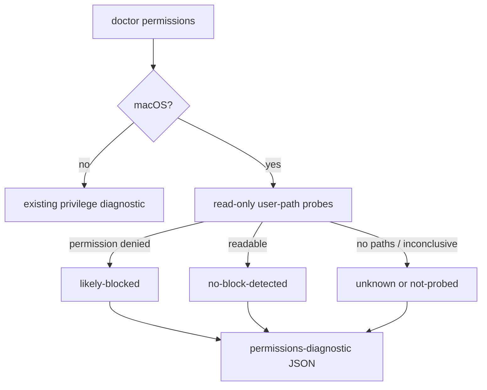

# macOS Platform Boundaries Refactor - Plan

## Goal Capsule

| Field | Value |
|---|---|
| Objective | Finish the v0.2.0 macOS release refactor by consolidating macOS path semantics, permission preflight, recoverable-trash test seams, NTFS feature boundaries, and safety catalog ownership. |
| Authority | The user's "fearless refactor, break if needed, delete unneeded code" direction outranks unreleased compatibility. Deletion safety, license safety, and testable platform semantics outrank preserving convenient duplication. |
| Execution profile | Deep Rust refactor across `rebecca-core`, `rebecca-rules`, CLI API v1 docs/tests, workspace manifests, and release documentation. |
| Stop conditions | Stop if a change weakens path protection, makes permanent deletion easier than recoverable-trash execution, copies GPL source/rule material, or removes core's fail-closed default safety policy. |
| Tail ownership | The active goal executes this plan to its Definition of Done, with progress tracked in git commits and task state rather than by editing this plan. |

---

## Product Contract

### Summary

This plan turns the remaining macOS work from rule coverage into platform-boundary cleanup.
Rebecca should leave v0.2.0 with one macOS path semantics module, structured permission diagnostics, an injectable recoverable-trash seam, an explicit NTFS feature surface, and one safety catalog source.

### Problem Frame

The previous macOS platform plan made macOS usable and fixed the immediate nextest failures.
The remaining risk is structural drift.
macOS root semantics now live in environment expansion, protection pattern helpers, and safety TOML at the same time; `doctor permissions` still reports only a privilege label plus advice; recoverable-trash tests depend on a debug-only global environment variable; and `rebecca-core` still declares the NTFS parser dependency even when non-Windows users do not need the live backend.

Rebecca is MIT OR Apache-2.0 while `repo-ref/Mole` is GPLv3.
Mole can inform behavior such as permission preflight and conservative prompts, but Rebecca must not copy Mole code, rules, fixtures, or strings.
The release shape should make this boundary obvious in package contents and docs.

### Requirements

**macOS platform semantics**

- R1. macOS user-root recognition must be owned by one core module used by environment defaults and protection decisions.
- R2. macOS cache/log/application-support classification must distinguish user-owned `~/Library/...` roots from `/Library`, `/System`, `/private`, and other system roots.
- R3. Runtime protection must keep blocking Apple privacy data, browser private data, containers, group containers, app durable state, and broad Library roots after the refactor.

**Permissions and user guidance**

- R4. `doctor permissions` must expose a structured macOS privacy preflight that is read-only, best-effort, and machine-readable.
- R5. macOS guidance must keep telling users not to use `sudo` as a TCC workaround and must explain Full Disk Access only for reviewed user-owned cache paths.
- R6. CLI API v1 schema, examples, and tests must cover any new permissions-diagnostic fields because the schema forbids extra payload properties.

**Recoverable trash**

- R7. Recoverable-trash execution must have a first-class backend seam so production uses the platform trash adapter and tests can use a deterministic filesystem adapter.
- R8. Test isolation must not depend on touching Finder, system Trash, or real user Trash during normal `nextest`.
- R9. Preserve-root cleanup must keep refusing reparse-like children and must keep per-target outcome semantics after batching.

**Release dependency and package surface**

- R10. NTFS/MFT live scanning must be an explicit Windows/NTFS capability, with `rebecca-ntfs` optional from `rebecca-core` where the current API allows it.
- R11. Non-Windows default builds should not carry live NTFS implementation dependencies unless the user opts into the relevant feature or all-features testing.
- R12. Existing experimental backend labels and fallback caveats must remain stable for callers that deliberately select `windows-ntfs-mft-experimental`.

**Safety catalog ownership and license hygiene**

- R13. The safety catalog TOML must have one canonical source instead of requiring edits in both `crates/rebecca-core` and `crates/rebecca-rules`.
- R14. `ProtectionPolicy::new()` must continue to fail closed with built-in safety knowledge after the catalog source moves.
- R15. Release packages must not include `repo-ref/Mole`, and docs must continue to state that GPL projects are behavior references only.

### Acceptance Examples

- AE1. Given `%MACOS_CACHE_HOME%/pip` and `/Users/alice/Library/Caches/pip`, when protection classifies the target on macOS, then both use the same macOS path semantics and are allowed only as bounded cache leaves.
- AE2. Given `/Library/Caches/pip`, `/Library/Application Support/Slack/Cache`, or `/Users/alice/Library/Application Support/Slack/Local Storage`, when protection runs on macOS, then each is blocked as system or durable/private data.
- AE3. Given `rebecca doctor permissions --format json` on macOS, when privacy probe paths are inaccessible with permission-denied errors, then the payload includes a macOS privacy status that a GUI can interpret without scraping human text.
- AE4. Given a normal CLI integration test that executes recoverable cleanup, when `cargo nextest` runs on macOS, then the test moves files into an isolated test adapter directory and never prompts Finder or uses the real Trash.
- AE5. Given a default non-Windows build, when workspace dependencies are resolved, then the live NTFS parser crate is not required by `rebecca-core` unless the NTFS feature set is enabled.
- AE6. Given `cargo package -p rebecca --allow-dirty --list`, when release contents are inspected, then no path under `repo-ref/Mole` appears.

### Scope Boundaries

- This plan does not add new macOS cleanup rule families beyond those already covered by the macOS platform work.
- This plan does not implement native TCC database reads, AppleScript automation, Finder automation, `launchctl`, or system-settings mutation.
- This plan does not make NTFS/MFT scanning default on Windows.
- This plan does not remove the `rebecca-ntfs` crate from the workspace or stop testing it under all-features and package-specific gates.
- This plan does not delete `repo-ref/Mole`; it keeps it outside release packages and treats it as local reference material only unless the user separately asks to remove the reference directory.

---

## Planning Contract

### Key Technical Decisions

- KTD1. Create a core macOS path semantics module before changing rules or diagnostics.
  Environment defaults and protection helpers need one source of truth for `~/Library` roots so future cache rules cannot reintroduce `/Library` allowlist drift.
- KTD2. Add macOS permission preflight as structured diagnostic data, not as shell automation.
  The safe behavior is to probe selected user-owned privacy-sensitive paths read-only, report `likely-blocked`, `no-block-detected`, `not-probed`, or `unknown`, and leave permission changes to the user.
- KTD3. Keep core's default safety policy while removing duplicate TOML.
  A tiny canonical safety data crate or equivalent single packaged source is safer than forcing every core caller to inject `SafetyKnowledge`.
- KTD4. Turn recoverable trash into an adapter boundary while keeping the debug env as a CLI integration hook if still useful.
  Core unit tests should depend on injected behavior; spawned CLI tests still need a process-level way to select the test adapter.
- KTD5. Gate live NTFS implementation behind an explicit feature without deleting NTFS parser work.
  The compile boundary should reduce macOS/default release surface while `--all-features` and Windows paths continue to prove the experimental backend.
- KTD6. Do not use Mole as source material.
  Only behavior-level lessons such as preview-first cleanup, fail-closed permission handling, and conservative root choices can shape Rebecca.

### High-Level Technical Design

### Assumptions

- A canonical safety data crate is acceptable for v0.2.0 because it removes duplicate package data without adding runtime behavior.
- The macOS privacy probe can be best-effort and non-blocking; it informs users before cleanup but does not become a hard gate for every command.
- CLI tests can keep a debug-only process environment override as long as core tests can exercise the trash seam without global state.
- The NTFS feature gate may require breaking default feature composition for the unreleased CLI, but `cargo nextest --all-features` remains authoritative for full workspace behavior.

### System-Wide Impact

- The workspace manifest changes because a canonical safety data package and optional NTFS dependency both affect package metadata.
- CLI API v1 changes additively for `permissions-diagnostic`, so docs, schema, examples, and JSON contract tests must move together.
- Protection and rule validation become easier to audit because macOS semantics and safety catalog data stop being edited in multiple places.
- Default non-Windows builds become smaller and clearer, while all-features verification remains broader.

### Risks and Mitigations

| Risk | Mitigation |
|---|---|
| Moving safety data breaks `ProtectionPolicy::new()` or direct `rebecca-core` users. | Introduce the canonical data source below core and keep `default_safety_catalog()` / `default_safety_knowledge()` APIs intact. |
| Privacy preflight accidentally prompts or mutates macOS privacy state. | Use only read-only metadata/read-dir probes, no `osascript`, no `tccutil`, no Settings automation, and model inconclusive results as `unknown`. |
| Trash adapter abstraction adds complexity without reducing flake. | Keep the trait private or narrowly scoped, prove it with cross-platform tests, and delete only the ad hoc test-path logic that the adapter replaces. |
| NTFS feature gating causes non-Windows tests or benches to lose expected fallback strings. | Preserve `ScanBackendKind::WindowsNtfsMftExperimental` labels and make disabled-feature selection return the same safe fallback/caveat shape where callers can observe it. |
| A canonical safety crate increases package count. | Keep it pure data with no parser dependency, document it as internal safety data, and verify `cargo package --list` for release crates. |

---

## Implementation Units

### U1. Canonical macOS path semantics module

- **Goal:** Move macOS root recognition and default root suffixes into one core module consumed by environment and protection code.
- **Requirements:** R1, R2, R3, AE1, AE2.
- **Dependencies:** None.
- **Files:** `crates/rebecca-core/src/macos_paths.rs`, `crates/rebecca-core/src/lib.rs`, `crates/rebecca-core/src/environment.rs`, `crates/rebecca-core/src/protection/patterns.rs`, `crates/rebecca-core/tests/path_templates.rs`, `crates/rebecca-core/tests/safety_policy.rs`.
- **Approach:** Extract macOS default suffix mapping and user `Library` tail recognition into a crate-internal module. Keep application-specific cache leaf decisions in protection, but make all macOS root/tail decisions call the shared module. Preserve placeholder handling for `%macos_cache_home%`, `%macos_application_support_home%`, and `%macos_log_home%`.
- **Execution note:** Start with characterization tests around the currently fixed macOS allow/block examples before moving helpers.
- **Patterns to follow:** `crates/rebecca-core/src/environment.rs` for environment abstraction, `crates/rebecca-core/src/protection/patterns.rs` for normalized segment helpers, and `crates/rebecca-core/tests/safety_policy.rs` for platform-specific protection tests.
- **Test scenarios:** macOS defaults still derive from `HOME`; explicit macOS env values still win; `/Users/<name>/Library/Caches/pip` and `%MACOS_CACHE_HOME%/pip` classify identically; `/Library/Caches/pip` remains blocked; `~/Library/Application Support/Slack/Local Storage` remains protected.
- **Verification:** Focused path-template and safety-policy nextest runs pass, then all core safety tests pass.

### U2. Single safety catalog source

- **Goal:** Delete duplicate safety TOML data while preserving core and rules public loading behavior.
- **Requirements:** R13, R14, R15.
- **Dependencies:** U1 should land first so the macOS safety assertions are stable.
- **Files:** `Cargo.toml`, `Cargo.lock`, `crates/rebecca-safety/Cargo.toml`, `crates/rebecca-safety/src/lib.rs`, `crates/rebecca-safety/safety/cleanup.toml`, `crates/rebecca-core/Cargo.toml`, `crates/rebecca-core/src/safety_catalog.rs`, `crates/rebecca-rules/Cargo.toml`, `crates/rebecca-rules/src/lib.rs`, `crates/rebecca-core/safety/cleanup.toml`, `crates/rebecca-rules/safety/cleanup.toml`, `crates/rebecca-core/tests/safety_catalog.rs`, `crates/rebecca-rules/src/lib.rs`, `docs/security-audit.md`, `docs/rule-authoring.md`.
- **Approach:** Add a pure data crate that exposes the cleanup safety catalog string and logical catalog path. Make core and rules parse that one source. Remove the two duplicate TOML files after call sites and tests no longer reference them. Keep drift tests by asserting core default and rules builtin parse the same canonical data rather than comparing two files.
- **Execution note:** Use tests that fail on path/source mismatch before deleting duplicate files.
- **Patterns to follow:** Existing `default_safety_catalog()` in `crates/rebecca-core/src/safety_catalog.rs` and `builtin_safety_catalog()` in `crates/rebecca-rules/src/lib.rs`.
- **Test scenarios:** `default_safety_catalog()` loads the canonical data; `builtin_safety_catalog()` loads the same canonical data; warning/category counts remain stable; macOS allow/block regressions from U1 still pass; docs no longer point authors to two safety TOML locations.
- **Verification:** `cargo nextest run -p rebecca-core --test safety_catalog --no-fail-fast`, `cargo nextest run -p rebecca-rules --no-fail-fast`, and package list checks show only the canonical safety file.

### U3. Structured macOS permission preflight

- **Goal:** Extend `doctor permissions` with a macOS privacy diagnostic that is useful to users and stable for machine consumers.
- **Requirements:** R4, R5, R6, AE3.
- **Dependencies:** U1, because probe paths should use the same macOS root semantics.
- **Files:** `crates/rebecca/src/info.rs`, `crates/rebecca/tests/info.rs`, `crates/rebecca/tests/cli_api.rs`, `crates/rebecca/tests/cli_output.rs`, `docs/api/cli/v1/payloads.schema.json`, `docs/api/cli/v1/examples/success-doctor-permissions.json`, `docs/api/cli/v1/README.md`, `README.md`.
- **Approach:** Add a serialized optional `macos_privacy` object under the permissions diagnostic. On macOS, derive candidate user-owned privacy paths from `HOME`, probe read-only without following broad cleanup roots, and summarize status plus probed/blocked path labels. On other platforms, omit the field or emit `null` consistently with the schema decision made during implementation.
- **Execution note:** Update the schema and contract test in the same commit as the Rust payload; the schema is strict.
- **Patterns to follow:** Existing `PermissionDiagnostic` and `active_process_diagnostic_from_processes` testable helper style in `crates/rebecca/src/info.rs`.
- **Test scenarios:** JSON payload validates against schema; human output keeps `Privilege level` and `Suggested action`; macOS helper reports `likely-blocked` for injected permission-denied probe results; missing or empty `HOME` reports `unknown` or `not-probed`; no output recommends sudo as a TCC workaround.
- **Verification:** Focused CLI API/output/info tests pass, and docs examples validate against the schema.

### U4. Recoverable trash adapter seam

- **Goal:** Replace the current env-centered test path with a small recoverable-trash adapter boundary.
- **Requirements:** R7, R8, R9, AE4.
- **Dependencies:** None, but it should land after U2 if shared tests are already moving files.
- **Files:** `crates/rebecca-core/src/executor.rs`, `crates/rebecca-core/tests/recoverable_trash.rs`, `crates/rebecca-core/tests/executor_contract.rs`, `crates/rebecca-core/tests/cache.rs`, `crates/rebecca/tests/common/isolated.rs`, `crates/rebecca/tests/cli_clean.rs`, `crates/rebecca/tests/cli_cache.rs`.
- **Approach:** Introduce a narrow internal adapter for delete/delete-all operations. Production uses a `trash` crate adapter. Core tests use a filesystem-moving adapter directly. CLI integration tests may keep `REBECCA_TEST_RECOVERABLE_TRASH_DIR` as a debug-only adapter selector, but it should construct the same adapter instead of branching deletion logic around the env var.
- **Execution note:** Preserve existing batch fallback and preserve-root semantics before changing adapter wiring.
- **Patterns to follow:** `CachePurgeBackend` test doubles under `crates/rebecca-core/src/cache.rs` tests and existing `RecoverableTrashBackend` behavior.
- **Test scenarios:** Single-file delete, preserve-root delete, batch delete, batch fallback, missing target, and reparse-like child refusal pass with the test adapter; CLI isolated cleanup moves files into the test trash directory; no normal nextest path uses real system Trash.
- **Verification:** Recoverable-trash, executor-contract, cache purge, and CLI cleanup/cache focused nextest runs pass on macOS.

### U5. NTFS feature boundary

- **Goal:** Make live NTFS/MFT scanning an explicit feature/dependency surface without deleting the parser crate.
- **Requirements:** R10, R11, R12, AE5.
- **Dependencies:** U2 should land first because workspace manifest churn is easier to review one layer at a time.
- **Files:** `Cargo.toml`, `Cargo.lock`, `crates/rebecca-core/Cargo.toml`, `crates/rebecca-core/src/scan.rs`, `crates/rebecca-core/src/disk_map.rs`, `crates/rebecca-core/src/scan/windows_ntfs_mft.rs`, `crates/rebecca/Cargo.toml`, `crates/rebecca/src/cli.rs`, `crates/rebecca/src/inspect.rs`, `crates/rebecca-core/tests/scan_engine.rs`, `crates/rebecca-core/tests/disk_map.rs`, `crates/rebecca/tests/cli_clean.rs`, `crates/rebecca/tests/cli_inspect.rs`, `crates/rebecca-ntfs/tests/mft_parser.rs`, `README.md`, `docs/api/cli/v1/README.md`.
- **Approach:** Make `rebecca-ntfs` an optional `rebecca-core` dependency behind an `ntfs` feature. Keep `windows_ntfs_mft` compiled only when both Windows and the feature are enabled, and provide a disabled-feature fallback that keeps backend selection safe and observable. Decide during implementation whether CLI `default` keeps or drops the NTFS feature; if dropping it, document the breaking feature opt-in.
- **Execution note:** Characterize current fallback output for `windows-ntfs-mft-experimental` before gating the dependency.
- **Patterns to follow:** Existing `#[cfg(windows)]` split in `crates/rebecca-core/src/scan.rs` and fallback caveat strings in scan/disk-map tests.
- **Test scenarios:** Default non-Windows core build resolves without `rebecca-ntfs`; `--all-features` compiles and tests the NTFS path; selecting the experimental backend without live support still falls back with a stable caveat; `rebecca-ntfs` package tests still run directly.
- **Verification:** Default workspace tests, all-features workspace tests, and package-specific `rebecca-ntfs` tests pass.

### U6. Release and documentation cleanup

- **Goal:** Align docs, package contents, and obsolete references with the new boundaries.
- **Requirements:** R5, R15, AE6.
- **Dependencies:** U2, U3, U5.
- **Files:** `README.md`, `docs/api/cli/v1/README.md`, `docs/security-audit.md`, `docs/rule-authoring.md`, `CHANGELOG.md`, `Cargo.toml`, `crates/rebecca/Cargo.toml`, `crates/rebecca-core/Cargo.toml`, `crates/rebecca-rules/Cargo.toml`, `crates/rebecca-safety/Cargo.toml`.
- **Approach:** Update user-facing macOS guidance, safety catalog authoring paths, NTFS feature docs, and package descriptions. Verify release package lists for `rebecca`, `rebecca-core`, `rebecca-rules`, and the new safety data crate. Keep `repo-ref/Mole` out of package contents and repeat the GPL behavior-reference boundary where source provenance is discussed.
- **Execution note:** Treat stale docs as dead code; delete or rewrite obsolete Windows/Linux-only statements instead of layering caveats.
- **Patterns to follow:** Current package-list checks used after the previous macOS safety fix and existing GPL provenance language in `docs/rule-authoring.md`.
- **Test scenarios:** Documentation search finds no old duplicate safety paths except historical plans; package lists include the canonical safety catalog once; package lists exclude `repo-ref/Mole`; README permission guidance matches `doctor permissions`.
- **Verification:** Package list commands and targeted docs search pass.

### U7. Integration verification and simplification pass

- **Goal:** Prove the refactor as one coherent release surface and remove abandoned code paths.
- **Requirements:** R1-R15.
- **Dependencies:** U1-U6.
- **Files:** All files changed by U1-U6.
- **Approach:** Run the full verification contract, inspect the diff for duplicate helpers or dead branches introduced during intermediate commits, and delete any compatibility scaffolding that the final design made unnecessary.
- **Execution note:** Run a simplification pass after U4 and again after U6 because those are the highest-churn boundaries.
- **Patterns to follow:** Existing `cargo fmt`, `cargo nextest`, doc-test, package-list, and schema-validation practices from the prior macOS fixes.
- **Test scenarios:** No duplicate safety TOML remains; no macOS root helper is reimplemented outside the core module; no CLI test path depends on real Trash; no feature-gated NTFS call path panics on default builds; full workspace verification is green.
- **Verification:** Full Verification Contract passes locally, or any host-specific exception is recorded with the exact command and reason.

---

## Verification Contract

| Gate | Command | Proves |
|---|---|---|
| Formatting | `cargo fmt --all -- --check` | Rust formatting is stable. |
| Core safety/path tests | `cargo nextest run -p rebecca-core --test safety_catalog --test safety_policy --test path_templates --no-fail-fast` | macOS path semantics and safety catalog behavior survived the refactor. |
| Rules tests | `cargo nextest run -p rebecca-rules --no-fail-fast` | Built-in rule parsing, safety catalog loading, and validation still pass. |
| CLI permissions/API tests | `cargo nextest run -p rebecca --test info --test cli_api --test cli_output --no-fail-fast` | `doctor permissions` human and machine contracts match schema/docs. |
| Recoverable trash tests | `cargo nextest run -p rebecca-core --test recoverable_trash --test executor_contract --no-fail-fast` | Adapter seam preserves execution semantics without real Trash. |
| NTFS feature tests | `cargo nextest run -p rebecca-core --test scan_engine --test disk_map --all-features --no-fail-fast` | Experimental NTFS backend remains available and safely gated under all-features. |
| Workspace tests | `cargo nextest run --workspace --all-features --no-fail-fast` | Cross-crate behavior is green with every feature enabled. |
| Doc tests | `cargo test --workspace --all-features --doc` | Public docs examples compile. |
| Package audit | `cargo package -p rebecca --allow-dirty --list`, `cargo package -p rebecca-core --allow-dirty --list`, `cargo package -p rebecca-rules --allow-dirty --list`, and the canonical safety data package list | Release packages contain expected files and exclude `repo-ref/Mole`. |

---

## Definition of Done

- D1. macOS environment defaults and macOS protection helpers share a single core path semantics module.
- D2. macOS safety regressions from the previous fixes remain covered by focused tests.
- D3. `doctor permissions` exposes structured macOS privacy status in JSON and clear non-sudo guidance in human output.
- D4. Recoverable-trash production behavior uses the platform adapter and tests use deterministic adapters without real system Trash.
- D5. The safety catalog TOML has one canonical packaged source, while core and rules loading APIs remain usable.
- D6. NTFS/MFT live scanning is feature-gated cleanly, and all-features testing still covers the experimental backend.
- D7. README, API docs, security docs, and rule-authoring docs match the new safety, permission, and feature boundaries.
- D8. Package audits show no GPL reference material in release contents.
- D9. Full verification is green, and every logical unit is committed with a conventional commit message.
