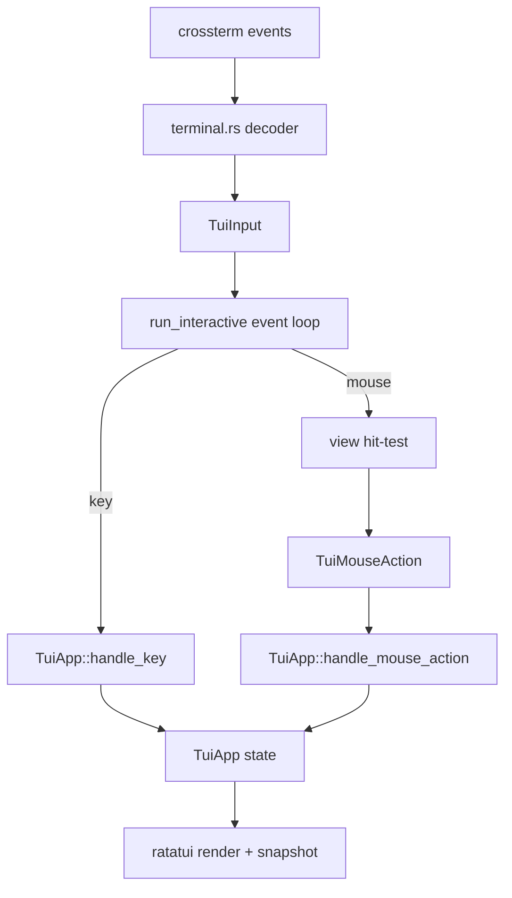
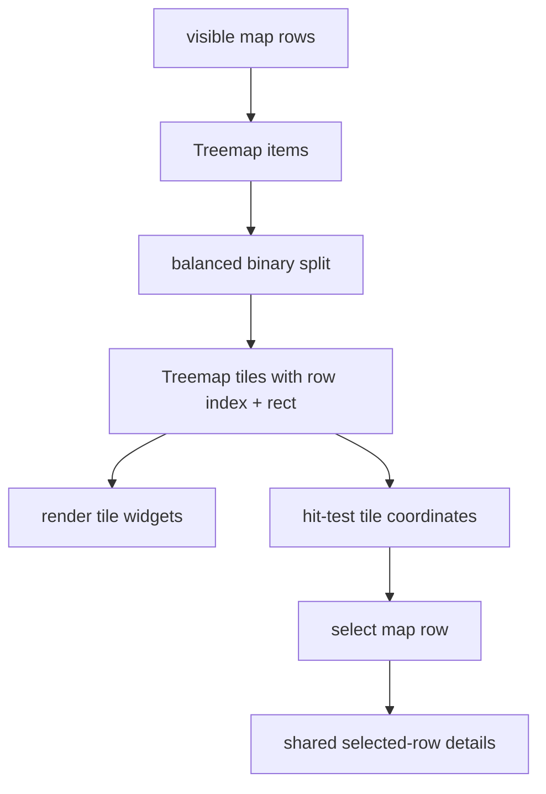
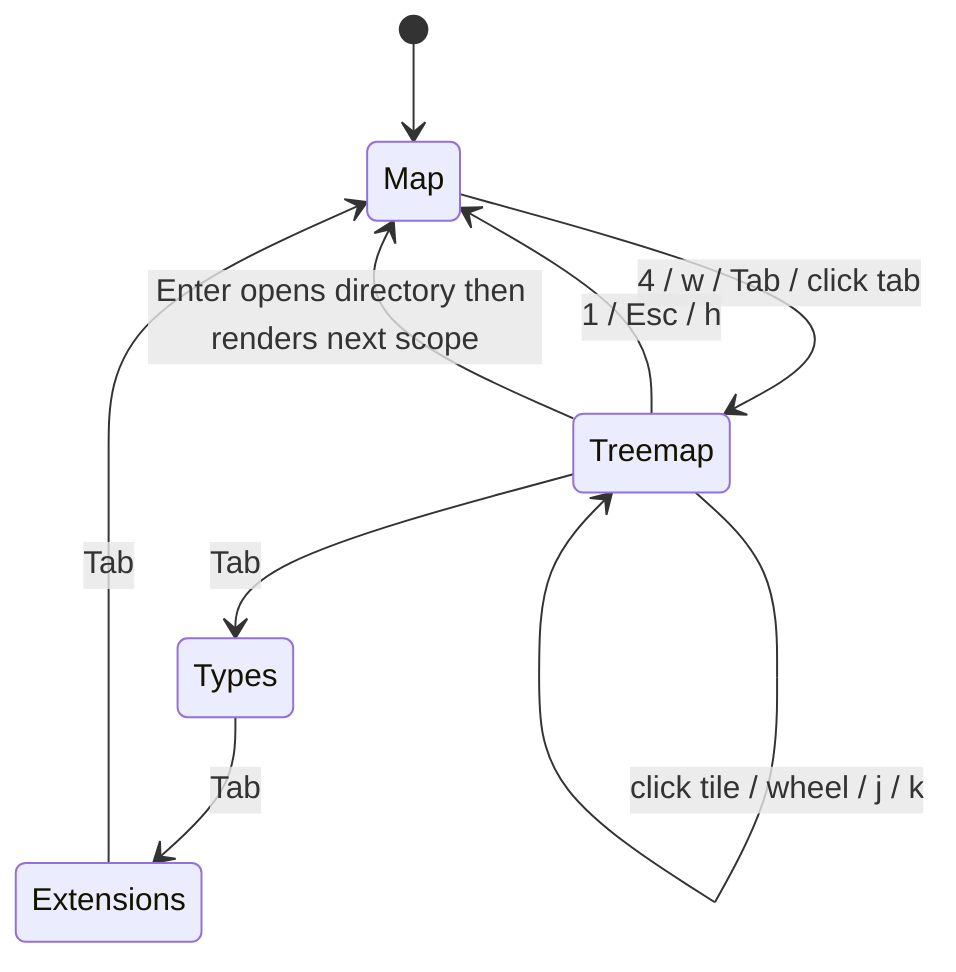

# TUI Treemap And Mouse Interaction - Plan

## Goal Capsule

| Field | Decision |
|---|---|
| Objective | Add a WizTree-like terminal treemap view and mouse-aware interaction layer to Rebecca's existing single-binary TUI without weakening keyboard, accessibility, or cleanup safety. |
| Authority | User request: continue fearless TUI refactoring, use mature open-source references, allow breaking internal APIs and deletion of transitional code, keep `rebecca tui` in the same binary unless there is a strong reason not to. |
| Execution profile | Code implementation from this plan with focused pure-layout and app-state tests first, then CLI snapshot/replay coverage and full workspace verification. |
| Stop conditions | Stop only for a cleanup-safety contradiction, a terminal backend limitation that invalidates the semantic input model, or verification failures that require product-scope changes. |
| Landing | Work may commit incrementally with conventional commits; direct main landing and push are acceptable under the user's current repo preference. |

---

## Product Contract

### Summary

Rebecca already has a Ratatui cleanup workbench with map, type, extension, refresh, background task, and safe cleanup flows.
This plan adds a fourth Treemap view plus mouse support so users can understand space composition visually and operate the TUI with familiar terminal clicks while retaining full keyboard parity.

### Problem Frame

The current TUI is useful but still reads like a table-first terminal inspector.
WizTree-like tools work because they make "what is big" visible immediately, let users click the region they care about, and keep details close to the selection.
Rebecca should learn that interaction model without becoming a separate GUI app or making terminal snapshots into a machine API.

The technical gap is that `crates/rebecca/src/tui/terminal.rs` currently emits only `TuiKey`, while `crates/rebecca/src/tui/view.rs` renders without a hit-test contract.
Adding mouse support directly to `TuiApp` would couple crossterm coordinates to cleanup state and make future macOS/Linux terminal differences painful.
The correct refactor is a semantic input layer: terminal events become `TuiInput`, the view layer maps coordinates to `TuiMouseAction`, and the app only handles domain actions such as select row, switch screen, scroll selection, or open focused node.

### Requirements

**Treemap view**

- R1. `rebecca tui` exposes Treemap as a first-class view in the existing binary, reachable by `4`, `w`, and the normal `Tab` cycle.
- R2. Treemap layout uses current map rows from `DiskMapSession`, not a second filesystem scan and not parsed CLI text.
- R3. Treemap tiles show proportional logical bytes, selected state, label, size, and cleanup-advice hint when space allows.
- R4. Keyboard behavior in Treemap preserves map parity: move selection, open directories, move to parent, stage cleanup rule, preview, refresh, restore, history, help, and quit.
- R5. Screen-reader and `--no-color` paths expose treemap information as bounded textual rows without depending on color or box geometry.

**Mouse interaction**

- R6. Interactive TUI mode enables crossterm mouse capture through RAII and disables it on every exit path.
- R7. Mouse support is additive: terminals without mouse support still work through keyboard and replay paths.
- R8. Left click on view tabs switches views; left click on map rows, distribution rows, and treemap tiles selects the matching semantic item.
- R9. Mouse wheel events move the active selection up or down in the current selectable view.
- R10. Mouse clicks never execute deletion, confirmation, or cleanup by themselves; destructive actions still require the existing preview and typed confirmation flow.

**Architecture and quality**

- R11. Terminal event decoding, hit testing, app state changes, and treemap layout are separated so each layer is testable without a real TTY.
- R12. Treemap layout is deterministic, bounded, and stable across platforms for the same visible rows and terminal dimensions.
- R13. The help text, README, changelog, and Rebecca skill document Treemap and mouse support as human TUI features, while automation guidance continues to point scripts at typed CLI output.
- R14. Existing map, type, extension, refresh, preview, execution, history, screen-reader, and replay behavior remains intact.
- R15. Transitional code that only exists because the first TUI was keyboard-only should be removed when the semantic input model replaces it.

### Acceptance Examples

- AE1. Given a scan with one large directory and several small files, when the user presses `4`, then the TUI shows a Treemap view where the large directory owns the largest tile and the selected item is described in the details pane.
- AE2. Given the same scan in `--screen-reader` mode, when the user presses `4`, then the snapshot contains textual treemap rows with rank, size, share, and label, and contains no visual bars or color-dependent meaning.
- AE3. Given Treemap is active, when the user presses `j`, `k`, `Enter`, `h`, `Space`, and `c`, then the behavior matches Map view selection, drilldown, parent navigation, staging, and preview.
- AE4. Given an interactive terminal that emits mouse events, when the user clicks the Treemap tab, then the active screen changes to Treemap without changing the cleanup basket.
- AE5. Given Treemap is active, when the user clicks a tile for row 3, then the map selection becomes row 3 and the details pane reflects that row.
- AE6. Given any view, when the user uses the mouse wheel over the content area, then the active selection moves by one row and stays within bounds.
- AE7. Given a user clicks on the cleanup preview or confirm screen, then no cleanup executes unless the existing keyboard confirmation phrase is completed.

### Scope Boundaries

- In scope: a terminal treemap view, deterministic treemap layout engine, semantic terminal input model, mouse capture guard, hit-test rectangles, click-to-select, wheel-to-move, help/docs/changelog/skill updates, and cleanup of obsolete keyboard-only assumptions.
- In scope: breaking internal TUI APIs and creating new TUI modules when that makes the model cleaner.
- Deferred to follow-up work: right-click context menus, double-click open semantics, drag selection, multi-select, file-open actions, persistent view preferences, animated treemap transitions, and GUI app packaging.
- Outside this product's identity: a separate `rebecca-tui` binary, direct deletion from mouse clicks, treating TUI snapshots as a stable machine API, or copying GPL/LGPL implementation code into Rebecca.

---

## Planning Contract

### Key Technical Decisions

- KTD1. Keep Treemap inside `rebecca tui`.
  The TUI is a human surface of the existing cleanup CLI, not a separate product or binary.
  This keeps install, help, safety policy, and recovery behavior coherent.
- KTD2. Add a semantic input layer instead of passing raw crossterm events into `TuiApp`.
  `terminal.rs` should decode platform terminal events into `TuiInput`, while `TuiApp` handles keys and semantic mouse actions.
  This keeps tests independent from crossterm and prevents terminal coordinates from leaking into cleanup state.
- KTD3. Make hit testing a view contract.
  Rendering and hit testing should share layout helpers so a screen coordinate maps to the same table row, tab, or treemap tile the user sees.
  The app receives actions such as `SwitchScreen(Treemap)` or `SelectMapRow(3)`, not `x=42, y=17`.
- KTD4. Use a deterministic balanced binary treemap layout for terminal cells.
  A full squarified treemap is attractive in GUI contexts, but terminal cells are coarse and labels are short.
  A balanced split along the longer axis is simpler, stable, testable, and good enough for "what is taking space" in a terminal.
- KTD5. Bound treemap complexity by visible rows.
  The initial Treemap view should render the same filtered/sorted visible rows the Map table uses, capped by available area and a small maximum tile count.
  When the cap trims positive-size rows, the layout may aggregate the remainder into an `Other` tile so the visual total still communicates the current scope.
  This keeps it fast and makes keyboard selection and mouse tile selection one shared row index.
- KTD6. Keep mouse actions non-destructive.
  Mature disk tools often use clicks to select and double-click to drill down, but Rebecca's cleanup identity is preview-first.
  This plan allows click selection and tab switching only; destructive work remains behind preview and typed confirmation.
- KTD7. Prefer textual accessibility over geometric accessibility.
  Ratatui geometry is useful for sighted users, but CI and screen readers need deterministic lines.
  `view::snapshot` should describe treemap ranks and selected details rather than trying to serialize tile drawings.

### High-Level Technical Design

### Assumptions

- The first Treemap view can use logical bytes as its area weight because that is Rebecca's current default ranking and the existing TUI sort label already exposes allocated/unique alternatives separately.
- Tile count can be bounded to the top visible rows because Rebecca's TUI already uses bounded `entry_limit` for human navigation.
- Mouse replay does not need to be added to `--replay-keys` in this plan; pure hit-test and app-action tests are the correct CI proof.
- Ratatui and crossterm versions already in the workspace are sufficient; no new UI crate is required unless implementation proves an existing dependency is materially cleaner.

### System-Wide Impact

- `crates/rebecca/src/tui/app.rs` gets a cleaner interaction boundary and one new screen.
- `crates/rebecca/src/tui/terminal.rs` becomes an input decoder with mouse-capture RAII.
- `crates/rebecca/src/tui/view.rs` owns shared layout and hit-test surfaces, not just rendering.
- A new TUI-local treemap module can stay independent of `rebecca-core` because terminal cell layout is presentation logic.
- Existing CLI machine contracts remain unchanged.

### Risks & Dependencies

| Risk | Mitigation |
|---|---|
| Hit-test rectangles drift from rendered layout. | Derive render and hit-test regions from shared layout helpers and test representative coordinates. |
| Mouse capture can leave the terminal in a bad state on panic or early return. | Add RAII guard next to raw mode and alternate screen, and disable mouse capture during `Drop`. |
| Treemap labels can overlap or render unreadably in tiny terminals. | Skip labels in very small tiles, keep details pane authoritative, and verify bounded snapshots. |
| A treemap can imply precision the bounded top-entry model does not have. | Render only visible rows and label it as the current scope; do not claim full unbounded inventory. |
| Mouse interactions could bypass safety. | Restrict mouse actions to selection, view switching, and scrolling. Existing cleanup execution path remains keyboard confirmation only. |

### Sources & Research

- `crates/rebecca/src/tui/app.rs` has the current key-driven state machine, screens, selection, cleanup basket, and view switching.
- `crates/rebecca/src/tui/view.rs` has current map, distribution, details, snapshot, trim, and style helpers.
- `crates/rebecca/src/tui/terminal.rs` has the raw-mode and alternate-screen guard that should own mouse capture.
- `crates/rebecca/tests/cli_tui.rs` already covers one-frame snapshots and replayed keyboard journeys.
- `repo-ref/dua-cli/src/interactive` is the strongest local Rust terminal reference for keeping terminal event handling and app behavior separated.
- `repo-ref/edirstat/src/stats/treemap.rs` and `repo-ref/edirstat/src/gui/explorer.rs` are useful local references for proportional disk-usage treemap behavior and click-to-select principles; use design ideas only and do not copy implementation.
- `repo-ref/dust` remains a useful counterweight: terminal disk tools must stay readable in narrow terminals rather than chasing GUI fidelity.
- Local reference audit notes: `repo-ref/edirstat` and `repo-ref/dua-cli` are MIT-compatible design references, `repo-ref/dust` is Apache-2.0, while WinDirStat-like GPL/AGPL projects should inform behavior only and must not be copied into Rebecca.

---

## Implementation Units

### U1. Introduce semantic TUI input

- **Goal:** Replace the keyboard-only terminal boundary with `TuiInput` while preserving existing key behavior.
- **Requirements:** R6, R7, R11, R14, R15
- **Dependencies:** None
- **Files:** `crates/rebecca/src/tui/app.rs`, `crates/rebecca/src/tui/terminal.rs`, `crates/rebecca/src/tui/mod.rs`, `crates/rebecca/tests/cli_tui.rs`
- **Approach:** Add a TUI input enum with key and mouse variants.
  Keep replay tokens key-only, but route interactive polling through `poll_input`.
  Add crossterm mouse capture to the terminal guard with RAII cleanup.
  Preserve Ctrl+C-to-quit behavior through the key path.
- **Execution note:** Characterize existing replay/key behavior before changing terminal polling.
- **Patterns to follow:** Current `TuiKey`, `poll_key`, `replay_token_to_key`, `TerminalGuard`, and `run_interactive`.
- **Test scenarios:** Existing replay tests still pass unchanged. Decoding a key press returns the same `TuiKey` values as before. Non-press key events are ignored. Mouse capture guard construction and drop are isolated enough to compile on all supported targets. `--replay-keys` stays deterministic and does not require mouse syntax.
- **Verification:** Focused TUI replay tests and terminal unit tests pass.

### U2. Add shared TUI layout and hit-test contracts

- **Goal:** Make rendered regions addressable by semantic hit-test actions.
- **Requirements:** R8, R9, R11, R14
- **Dependencies:** U1
- **Files:** `crates/rebecca/src/tui/view.rs`, `crates/rebecca/src/tui/app.rs`, `crates/rebecca/tests/cli_tui.rs`
- **Approach:** Extract reusable layout functions for header/content/status, map table/details, distribution table/details, and future treemap/details regions.
  Define hit targets for view tabs, map rows, distribution rows, treemap tiles, and scrollable content.
  Convert left click and wheel events into app-level mouse actions.
- **Execution note:** Add pure hit-test tests before wiring interactive mouse handling.
- **Patterns to follow:** Existing `render_map`, `render_distribution`, `snapshot_map`, `snapshot_distribution`, and `selected_distribution_index`.
- **Test scenarios:** A coordinate in the map table body maps to the expected row index. A coordinate in the type distribution table maps to the expected distribution row. A coordinate outside known regions returns no action. Clicking tab labels maps to the correct screen. Wheel up/down over content maps to active-selection movement.
- **Verification:** Pure view hit-test tests pass without a TTY.

### U3. Implement deterministic terminal treemap layout

- **Goal:** Add a pure treemap layout engine for proportional terminal rectangles.
- **Requirements:** R2, R3, R5, R11, R12
- **Dependencies:** None
- **Files:** `crates/rebecca/src/tui/treemap.rs`, `crates/rebecca/src/tui/mod.rs`, `crates/rebecca/src/tui/view.rs`
- **Approach:** Build layout from visible map rows, row index, label, logical bytes, and cleanup advice.
  Use a balanced binary split along the longer axis, omit zero-byte items, cap tile count, optionally aggregate trimmed rows into `Other`, and drop labels for tiles below a readability threshold.
  Keep the module independent from crossterm and app mutation.
- **Execution note:** Implement this module test-first because it is pure and boundary-heavy.
- **Patterns to follow:** `repo-ref/edirstat/src/stats/treemap.rs` for proportional disk-usage intent, but keep Rebecca's implementation original and terminal-specific.
- **Test scenarios:** Empty input returns no tiles. Zero-byte rows are ignored. Tiles stay within the requested rectangle. Tiles do not overlap. The largest item receives the largest area for a simple three-item fixture. A capped layout aggregates trimmed positive-size rows into `Other`. Very narrow or short rectangles still produce bounded, non-panicking output. Stable input produces stable tile order and geometry.
- **Verification:** Treemap unit tests pass.

### U4. Add the Treemap screen and keyboard parity

- **Goal:** Render Treemap as a first-class screen and make keyboard behavior match Map view.
- **Requirements:** R1, R2, R3, R4, R5, R14
- **Dependencies:** U3
- **Files:** `crates/rebecca/src/tui/app.rs`, `crates/rebecca/src/tui/view.rs`, `crates/rebecca/src/tui/treemap.rs`, `crates/rebecca/tests/cli_tui.rs`
- **Approach:** Add `TuiScreen::Treemap`, open/cycle helpers, screen labels, help/status text, snapshot output, and render path.
  Reuse `selected`, `visible_rows`, `selected_row`, and map details so Treemap remains another projection over the same current scope.
  Keep cleanup staging and preview available from Treemap.
- **Patterns to follow:** Existing Map/Types/Extensions view switching, `render_details`, `snapshot_map`, and help/status text.
- **Test scenarios:** `--replay-keys 4` renders `Rebecca TUI | treemap` and includes selected treemap row text. `--replay-keys w` is an alias. Tab cycles Map -> Treemap -> Types -> Extensions -> Map. `j/k` changes the selected treemap row. `Enter` opens a selected directory. `h` or `Esc` returns to Map or parent consistently with the chosen key contract. `Space` stages the selected map row from Treemap. Screen-reader snapshots contain no visual tile art.
- **Verification:** TUI app-state and CLI snapshot tests pass.

### U5. Wire mouse actions into the interactive loop

- **Goal:** Make mouse clicks and wheel events operate through the semantic action model.
- **Requirements:** R6, R7, R8, R9, R10, R11, R14
- **Dependencies:** U1, U2, U4
- **Files:** `crates/rebecca/src/tui/app.rs`, `crates/rebecca/src/tui/terminal.rs`, `crates/rebecca/src/tui/view.rs`, `crates/rebecca/src/tui/mod.rs`
- **Approach:** Store or recompute the last rendered layout for hit testing after each draw.
  On left click, ask the view layer for a semantic action and apply it through `TuiApp`.
  On wheel events, move the active selection in the current selectable view.
  Ignore mouse input on confirm/preview screens except harmless tab or help regions if they are explicitly hit-testable.
- **Execution note:** Keep mouse actions non-destructive and prove that clicks cannot directly execute cleanup.
- **Patterns to follow:** Current `run_interactive` event loop and pure `handle_key` state tests.
- **Test scenarios:** Clicking a Treemap tile selects the matching map row. Clicking a map row selects it. Clicking a distribution row selects the matching distribution row. Clicking `4 treemap` in the header switches screens. Wheel down from the first row selects the second row, and wheel up at the first row stays clamped. Mouse actions on Confirm do not emit `TuiEffect::Execute`.
- **Verification:** Pure app/view tests pass; interactive compilation proves crossterm wiring.

### U6. Update docs, help, skill, and quality gates

- **Goal:** Make the new interaction model discoverable and protect it in CI.
- **Requirements:** R5, R13, R14, R15
- **Dependencies:** U4, U5
- **Files:** `README.md`, `CHANGELOG.md`, `skills/rebecca-disk-cleaner/SKILL.md`, `docs/knowledge/engineering/current-state.md`, `crates/rebecca/tests/cli_help.rs`, `crates/rebecca/tests/cli_tui.rs`
- **Approach:** Document `4`/`w` Treemap, mouse click/scroll support, keyboard parity, non-destructive mouse semantics, and the fact that scripts should use `inspect map` rather than TUI snapshots.
  Update CLI help tests where visible help text changes.
- **Patterns to follow:** Existing TUI README section, changelog Unreleased bullets, and skill guidance for choosing TUI vs machine APIs.
- **Test scenarios:** Help text includes Treemap and mouse wording without exposing hidden CI flags. README commands remain accurate. Skill guidance points humans to Treemap and scripts to CLI output. Changelog has an Unreleased entry. Full TUI replay coverage includes Treemap.
- **Verification:** Docs are updated, focused help/TUI tests pass, and full workspace quality gates pass.

---

## Verification Contract

| Gate | Applies to | Done signal |
|---|---|---|
| `cargo fmt --all -- --check` | All units | Formatting is stable. |
| `cargo clippy --workspace --all-targets -- -D warnings` | All Rust code | No warnings, dead code, or unused transitional APIs remain. |
| `cargo nextest run --workspace --locked` | All units | Full workspace tests pass. |
| `cargo deny check` | Dependency and license safety | No new advisory, source, ban, or license failure is introduced. |
| `cargo run -p rebecca --locked -- tui --help` | U4, U6 | Help exposes Treemap and mouse behavior appropriately. |
| `cargo run -p rebecca --locked -- tui --once --root . --replay-keys 4 --terminal-width 100` | U4, U6 | A bounded Treemap snapshot renders without a TTY. |
| `cargo run -p rebecca --locked -- tui --once --screen-reader --root . --replay-keys 4 --terminal-width 100` | U4, U6 | Screen-reader Treemap snapshot is textual and has no visual tile dependency. |
| `python skills/validate.py skills/rebecca-disk-cleaner/SKILL.md` | U6 | Rebecca skill remains valid after guidance updates. |
| `git diff --check` | All docs and code | No trailing whitespace or patch hygiene issues. |

---

## Definition of Done

- Treemap is available from the existing `rebecca tui` command and `rebecca i` alias.
- Treemap has keyboard parity with Map for navigation, selection, drilldown, staging, preview, refresh, restore, history, help, and quit.
- Interactive terminals enable mouse capture and clean it up reliably.
- Mouse clicks can switch views and select rows/tiles, and wheel events can move selection.
- Mouse actions cannot execute cleanup or bypass typed confirmation.
- Treemap layout and hit testing are covered by pure tests that do not require a real TTY.
- `--once`, `--replay-keys`, `--screen-reader`, and `--terminal-width` continue to provide deterministic CI coverage.
- Documentation, changelog, and the Rebecca disk-cleaner skill mention Treemap and mouse support while preserving script/API guidance.
- Abandoned or obsolete keyboard-only transition code is removed from the diff.
- All Verification Contract gates pass before final commit/push.
