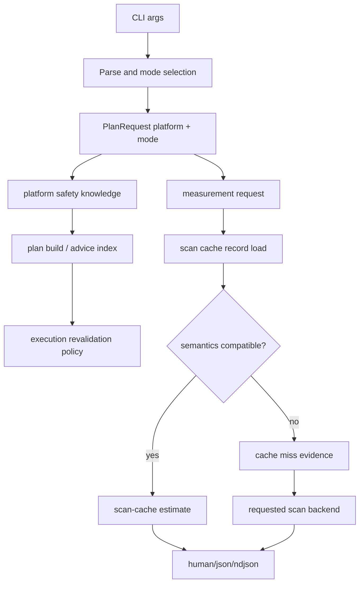

# Runtime Safety And Scan Cache Correctness - Plan

## Goal Capsule

| Field | Value |
|---|---|
| Objective | Make Rebecca's cleanup authority, scan-cache reuse, and machine-facing CLI failures correct before further TUI explorer expansion. |
| Primary authority | Runtime safety must use the same platform knowledge as the selected `PlanRequest`; cache hits must not cross metric semantics boundaries; JSON/NDJSON callers must receive structured failures once a machine format is requested. |
| Execution profile | Fearless refactor allowed; break pre-release behavior where it simplifies the contract; delete obsolete compatibility branches and helper code once tests prove replacement behavior. |
| Stop conditions | Stop if a change would weaken preview-first cleanup, bypass execution revalidation, or make machine output mix human text into stdout. |
| Deferred scope | TUI path identity, viewport, task manager backpressure, and subtree patch refresh are intentionally next-plan work. |

---

## Product Contract

### Summary

Rebecca has reached the point where more UI polish depends on lower-level correctness.
This plan fixes three foundation issues: runtime safety knowledge must be selected per platform, scan-cache records must only be reused when their backend metric semantics match the request, and CLI error/confirmation behavior must be consistent for wrappers, skills, and future TUI integration.

### Problem Frame

The rule catalog and safety catalog already model Windows, Linux, and macOS, but several runtime paths still ask for the built-in default safety knowledge rather than selecting the knowledge for the active `PlanRequest`.
That can make non-Windows planning, execution revalidation, and cleanup-advice use the wrong protected-root and durable-state boundary.

The scan cache already records backend provenance, but cache lookup currently returns a hit before the measuring code asks whether the cached backend is compatible with the requested backend and metric semantics.
That can turn a performance cache into an incorrect estimate source when portable, native, and experimental NTFS backends disagree on hardlinks, logical bytes, allocated bytes, or unique physical meaning.

The CLI has a strong API envelope for command handlers, but some parse failures and destructive-mode flag combinations still behave differently across commands.
That weakens automation and skill reliability exactly where Rebecca should be conservative.

### Requirements

**Runtime Safety**

- R1. Runtime cleanup planning, TUI workbench planning, execution revalidation, and cleanup-advice indexing must select safety knowledge for the same platform as the active `PlanRequest`.
- R2. Linux and macOS protected roots, durable state, browser private data, and Electron private data must be blocked by runtime planner and execution paths, not only by static catalog validation.
- R3. A missing safety knowledge entry for a supported platform must fail clearly before cleanup authority is granted.

**Scan Cache**

- R4. Scan-cache hits must be accepted only when the record's backend and metric semantics are compatible with the current measurement request.
- R5. Explicit backend requests must not silently reuse incompatible records from another backend.
- R6. Cache miss evidence must explain incompatibility as a cache event without losing existing stale, corrupt, missing, expired, and USN invalidation behavior.

**CLI Contract**

- R7. Once the user requested `--format json` or `--format ndjson`, recoverable argument and validation failures must be emitted as structured machine errors when the format can be discovered.
- R8. Help, version, and invalid `--format` parser behavior must remain readable and must not become misleading machine envelopes.
- R9. Cleanup-like commands must share one `--dry-run` and `--yes` contract: preview by default, execute only with `--yes`, and reject contradictory `--dry-run --yes` combinations before planning.
- R10. Documentation, changelog, and skill guidance must describe the corrected platform safety, cache-compatibility, and execution-confirmation contracts.

### Acceptance Examples

- AE1. Given a Linux cleanup rule target under `/etc`, when a dry-run plan is built with Linux platform safety knowledge, then the target is blocked with a safety-policy issue before measurement or execution.
- AE2. Given a macOS target under `~/Library/Application Support` durable state, when cleanup-advice annotates a disk-map entry, then the advice is `protected` instead of `unknown` or `cleanable`.
- AE3. Given a scan-cache record written by one backend, when a different explicit backend with incompatible metric semantics is requested, then the planner reports a scan-cache miss and measures through the requested backend.
- AE4. Given `rebecca clean --format json --dry-run --yes`, when the command is parsed, then stdout contains a JSON error envelope and no human text.
- AE5. Given `rebecca --help`, when help is requested, then clap help remains normal human help.

### Scope Boundaries

- Deferred: TUI path identity, viewport, task-manager backpressure, and subtree refresh patching.
- Deferred: making Windows native the default `auto` backend.
- Deferred: expanding rule quantity or adding new app/browser cleanup surfaces.
- Deferred: schema-wide migration from `estimated_bytes` to logical/allocated/unique cleanup plan fields.
- Out of scope: changing recoverable-trash default execution or adding permanent deletion to ordinary cleanup.

---

## Planning Contract

### Key Technical Decisions

- KTD1. Select safety knowledge from platform, not from catalog default.
  Runtime code should use a small helper that returns `SafetyKnowledge` for a `Platform` and fails if the platform is unsupported, then thread that helper through clean, workbench, cleanup-advice, and execution policy construction.
- KTD2. Keep platform safety selection near `PlanRequest`.
  The strongest invariant is that anything granting cleanup authority can derive its safety knowledge from the request it is about to use, rather than from `Platform::current()` or a default catalog value.
- KTD3. Model scan-cache compatibility as a first-class cache miss reason.
  Cache lookup can still load and validate record freshness first, but measurement must reject a hit whose backend or metric semantics cannot satisfy the current request.
- KTD4. Prefer explicit machine-format parse recovery over total clap replacement.
  A pre-parse pass should discover `--format json|ndjson` for known commands and render errors through Rebecca's output layer, while help/version and unrecognizable format flags continue to use clap's native behavior.
- KTD5. Normalize destructive flag contradiction at the CLI boundary.
  `--dry-run --yes` should be rejected consistently for cleanup-like commands before planning starts, because preview-only and execute-now are mutually exclusive user intents.

### High-Level Technical Design

### Existing Patterns To Follow

- `crates/rebecca-core/src/safety_catalog.rs` already exposes `default_safety_knowledge_for_platform`.
- `crates/rebecca-core/src/planner.rs` already accepts `PlanBuildContext::with_safety_knowledge`.
- `crates/rebecca-core/src/protection.rs` already builds `ProtectionPolicy::with_safety_knowledge`.
- `crates/rebecca-core/src/scan_cache/store.rs` already has `ScanCacheMiss`, `ScanCacheLookup`, backend fields, USN validation, and prune behavior.
- `crates/rebecca/src/main.rs` already has early `Cli::try_parse()` handling for broken-pipe and can host a narrower machine-format recovery path.
- `crates/rebecca/src/cache.rs` already rejects `--dry-run --yes` for cache prune and is the behavior model for cleanup-like commands.

### Sequencing

Safety platform selection lands first because it affects every destructive authority path.
Scan-cache compatibility lands second because it changes cache hit behavior and estimate provenance.
CLI parse and confirmation normalization land third because tests will become easier to reason about after the underlying authority paths are correct.
Documentation lands last after final command behavior is known.

---

## Implementation Units

### U1. Platform safety knowledge selection

- **Goal:** Replace runtime default safety knowledge use with platform-selected safety knowledge in cleanup authority paths.
- **Requirements:** R1, R2, R3.
- **Files:** Modify `crates/rebecca-rules/src/lib.rs`, `crates/rebecca/src/clean.rs`, `crates/rebecca/src/workbench.rs`, `crates/rebecca/src/inspect.rs`; update or add tests in `crates/rebecca-core/tests/planner.rs`, `crates/rebecca-core/tests/executor_contract.rs`, and `crates/rebecca-core/tests/cleanup_advice.rs`.
- **Approach:** Add a public helper such as `builtin_safety_knowledge_for_platform(platform)` in `rebecca-rules`, backed by `builtin_safety_catalog().knowledge_for_platform(platform)`.
  Use the active `PlanRequest` platform when building `PlanBuildContext`, execution `ProtectionPolicy`, and `CleanupAdviceIndex`.
  Delete direct runtime calls to default `builtin_safety_knowledge()` where the code has a request platform.
- **Patterns:** `crates/rebecca-core/src/safety_catalog.rs`, `crates/rebecca-core/tests/safety_policy.rs`, `crates/rebecca/src/cache.rs`.
- **Test Scenarios:** Linux plan blocks `/etc/passwd`; macOS plan blocks `/System/Library` and `~/Library/Application Support`; cleanup-advice marks protected non-Windows private data as protected; execution revalidation blocks a plan target when policy is platform-selected.
- **Verification:** Focused core planner/executor/advice tests pass before moving to U2.
- **Execution note:** Use proof-first tests for at least one Linux or macOS protected path before replacing runtime helper calls.

### U2. Scan-cache backend and metric compatibility

- **Goal:** Prevent incompatible scan-cache hits from satisfying explicit backend requests or mismatched metric semantics.
- **Requirements:** R4, R5, R6.
- **Files:** Modify `crates/rebecca-core/src/scan_cache.rs`, `crates/rebecca-core/src/scan_cache/store.rs`, `crates/rebecca-core/src/planner/measure.rs`, `crates/rebecca-core/src/scan/backend.rs`; update tests in `crates/rebecca-core/tests/planner.rs`, `crates/rebecca/tests/cli_clean.rs`, and scan-cache module tests.
- **Approach:** Introduce a compact compatibility model carried by scan-cache records or derived from existing record fields.
  Accept exact-compatible records and reject incompatible records with a new miss reason such as `backend-incompatible` or `metric-semantics-incompatible`.
  Preserve all freshness, fingerprint, age, corrupt, stale, and USN invalidation behavior.
  Record scan-cache miss evidence in `EstimateProvenance.estimate_backend_evidence`.
- **Patterns:** `ScanCacheMiss`, `ScanCacheLookup::Hit`, `EstimateProvenance::from_backend_confidence_and_source`, `ScanBackendKind`.
- **Test Scenarios:** Portable cache hit satisfies portable request; portable cache is rejected for explicit NTFS experimental request when semantics are incompatible; native cache behavior is defined and tested; existing directory freshness and USN invalidation tests still pass; JSON dry-run exposes cache miss evidence.
- **Verification:** Focused scan-cache and planner tests pass before U3.
- **Execution note:** Characterize current cache hit behavior with a failing or adjusted test before changing store lookup behavior.

### U3. Machine parse errors and destructive flag normalization

- **Goal:** Make machine-mode failures and `--dry-run --yes` behavior consistent across cleanup-like commands.
- **Requirements:** R7, R8, R9.
- **Files:** Modify `crates/rebecca/src/main.rs`, `crates/rebecca/src/cli.rs`, `crates/rebecca/src/clean.rs`, `crates/rebecca/src/purge.rs`, `crates/rebecca/src/apps.rs`, `crates/rebecca/src/cache.rs`, `crates/rebecca/src/output.rs`; update tests in `crates/rebecca/tests/cli_api.rs`, `crates/rebecca/tests/cli_clean.rs`, `crates/rebecca/tests/cli_purge.rs`, `crates/rebecca/tests/cli_apps.rs`, `crates/rebecca/tests/cli_cache.rs`, and `crates/rebecca/tests/cli_help.rs`.
- **Approach:** Add an early machine-format detector that handles recognized command arguments containing `--format json|ndjson`.
  On parse or command validation failures after a machine format is detected, render Rebecca error envelopes through the existing command API contract.
  Keep help/version and invalid format values on clap's native path unless the existing API registry can classify them without ambiguity.
  Reject `--dry-run --yes` consistently for `clean`, `apps clean`, `purge`, `cache prune`, and `cache purge`.
- **Patterns:** `cache::run_prune`, `output::render_error`, command API registry tests in `cli_api.rs`.
- **Test Scenarios:** JSON and NDJSON receive structured errors for representative validation failures; help output stays human; invalid `--format` remains clear; each cleanup-like command rejects `--dry-run --yes`; `--yes` alone still executes; default remains preview.
- **Verification:** CLI API, help, clean, purge, apps, and cache focused tests pass before U4.
- **Execution note:** Do not broaden machine recovery so far that it hides clap help or makes invalid format values appear valid.

### U4. Documentation and release notes

- **Goal:** Make user-facing guidance match the corrected safety, cache, and execution contracts.
- **Requirements:** R10.
- **Files:** Modify `README.md`, `CHANGELOG.md`, `docs/api/cli/v1/README.md`, and `skills/rebecca-disk-cleaner/SKILL.md`.
- **Approach:** Add concise Unreleased notes for platform-selected safety knowledge, scan-cache compatibility misses, structured machine parse errors, and `--dry-run --yes` rejection.
  Update the skill so agents preview first and treat contradictory execute flags as invalid.
  Update API docs only for observable payload or error-contract changes.
- **Patterns:** Existing Unreleased sections in `CHANGELOG.md`, existing CLI API envelope docs, existing skill preview-first language.
- **Test Scenarios:** API examples still validate; skill validation passes; README commands remain accurate.
- **Verification:** Documentation checks and skill validation pass with the final code behavior.

### U5. Full validation and cleanup

- **Goal:** Finish with a clean tree, no abandoned compatibility branches, and full local gates.
- **Requirements:** R1-R10.
- **Files:** Repository-wide verification only; no planned implementation file.
- **Approach:** Run formatting, linting, full nextest, dependency policy, catalog validation, skill validation, and representative CLI smokes.
  Remove dead helpers or transitional compatibility code introduced during implementation.
  Commit in logical conventional commits and keep `main` synchronized with `origin/main` when ready.
- **Patterns:** Recent release-gate practice in `README.md` Development and prior workflow commits.
- **Test Scenarios:** Full suite passes; targeted JSON/NDJSON machine failures produce parseable envelopes; cleanup-like commands reject contradictory flags; scan-cache tests show compatible hit and incompatible miss paths.
- **Verification:** Final gates in Verification Contract pass.

---

## Verification Contract

| Gate | Command | Applies To | Done Signal |
|---|---|---|---|
| Format | `cargo fmt --all -- --check` | All units | No formatting diff. |
| Lint | `cargo clippy --workspace --all-targets -- -D warnings` | All Rust changes | No warnings on default workspace features. |
| Focused safety | `cargo nextest run -p rebecca-core planner executor_contract cleanup_advice --locked` | U1 | Platform safety tests pass. |
| Focused scan cache | `cargo nextest run -p rebecca-core scan_cache planner --locked` | U2 | Cache compatibility and existing freshness tests pass. |
| Focused CLI | `cargo nextest run -p rebecca --test cli_api --test cli_clean --test cli_purge --test cli_apps --test cli_cache --test cli_help --locked` | U3 | Machine errors and flag normalization pass. |
| Full tests | `cargo nextest run --workspace --locked` | U1-U5 | Workspace tests pass. |
| Dependency policy | `cargo deny check` | U5 | Advisories, bans, licenses, and sources pass; existing duplicate warnings may remain if policy permits them. |
| Catalog health | `cargo run -p rebecca --locked -- catalog validate --format json` | U1-U5 | JSON reports `valid: true`. |
| Skill validation | `python skills\validate.py` | U4-U5 | Shipped skill validates. |
| Whitespace | `git diff --check` | U5 | No whitespace errors. |

---

## Definition of Done

- U1-U4 are implemented with behavior-bearing tests that fail or characterize the old behavior before the production change when practical.
- Runtime cleanup authority no longer uses default safety knowledge when the active platform is knowable.
- Scan-cache lookup rejects incompatible backend or metric semantics and reports the rejection through existing provenance evidence.
- Cleanup-like commands share the same contradictory `--dry-run --yes` behavior.
- Machine-mode representative failures are parseable JSON or NDJSON where the requested format is discoverable.
- README, CHANGELOG, CLI API docs, and the Rebecca skill describe the final behavior.
- Full Verification Contract gates pass.
- Dead or transitional code introduced during development is removed before the final commit.
- Work is committed with conventional commits and pushed according to the repository's current main-branch preference.

---

## Appendix

### Source Notes

- `crates/rebecca/src/clean.rs`, `crates/rebecca/src/workbench.rs`, and `crates/rebecca/src/inspect.rs` currently contain runtime calls to built-in default safety knowledge.
- `crates/rebecca-core/src/safety_catalog.rs` already exposes platform-specific safety knowledge lookup.
- `crates/rebecca-core/src/planner/measure.rs` currently accepts scan-cache hits before the measurement request applies backend compatibility.
- `crates/rebecca-core/src/scan_cache/store.rs` already records backend fields and USN validation outcomes.
- `crates/rebecca/src/cache.rs` already rejects `--dry-run --yes` for cache prune and can serve as a consistency model.
- Prior read-only audits identified TUI Explorer improvements as valuable but dependent on this correctness foundation.
